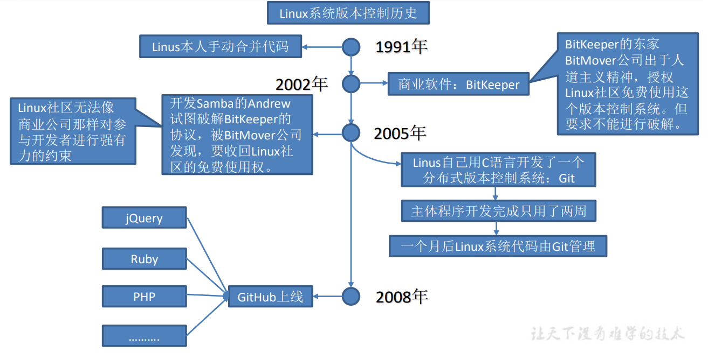
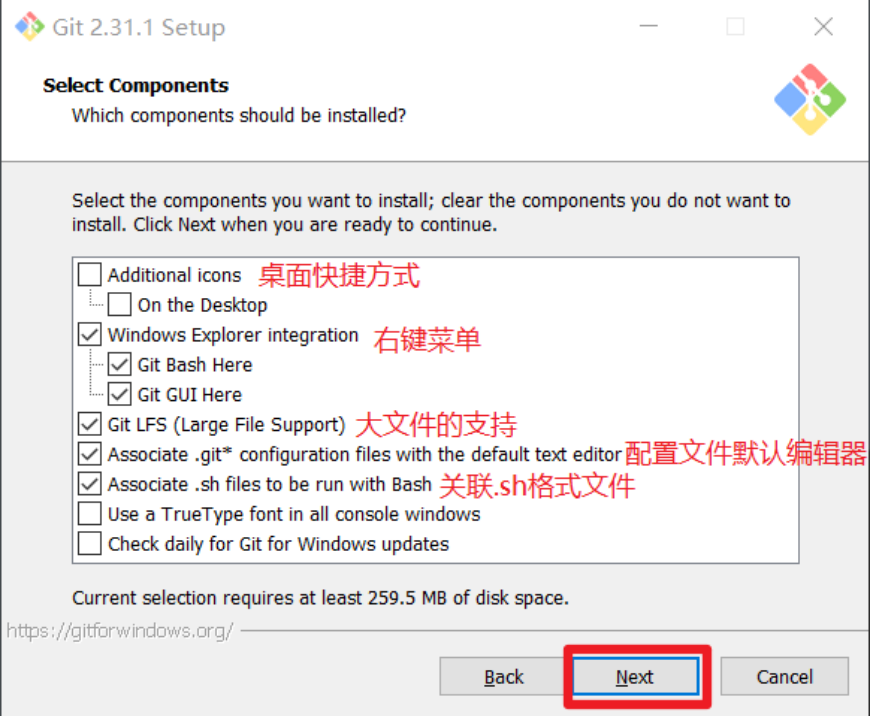

# 一、认识Git

## 1、Git概述：

​	Git 是一个免费的、开源的分布式版本控制系统，可以快速高效地处理从小型到大型的各种 项目。 

​	Git 易于学习，占地面积小，性能极快。 它具有廉价的本地库，方便的暂存区域和多个工作 流分支等特性。其性能优于 Subversion、CVS、Perforce 和 ClearCase 等版本控制工具。

## 2、版本控制：

### 2.1、何为版本控制：

​	版本控制是一种记录文件内容变化，以便将来查阅特定版本修订情况的系统。 

​	版本控制其实最重要的是可以记录文件修改历史记录，从而让用户能够查看历史版本， 方便版本切换。

### 2.2、为什么需要版本控制：

​	个人开发过渡到团队协作

### 2.3、版本控制工具：

#### a>集中式版本控制工具

​	CVS、SVN(Subversion)、VSS……

​	集中化的版本控制系统诸如 CVS、SVN 等，都有一个单一的集中管理的服务器，保存 所有文件的修订版本，而协同工作的人们都通过客户端连到这台服务器，取出最新的文件或 者提交更新。多年以来，这已成为版本控制系统的标准做法。

​	这种做法带来了许多好处，每个人都可以在一定程度上看到项目中的其他人正在做些什 么。而管理员也可以轻松掌控每个开发者的权限，并且管理一个集中化的版本控制系统，要 远比在各个客户端上维护本地数据库来得轻松容易。

​	事分两面，有好有坏。这么做显而易见的缺点是中央服务器的单点故障。如果服务器宕 机一小时，那么在这一小时内，谁都无法提交更新，也就无法协同工作。

#### b>分布式版本控制工具

​	Git、Mercurial、Bazaar、Darcs……

​	像 Git 这种分布式版本控制工具，客户端提取的不是最新版本的文件快照，而是把代码 仓库完整地镜像下来（本地库）。这样任何一处协同工作用的文件发生故障，事后都可以用 其他客户端的本地仓库进行恢复。因为每个客户端的每一次文件提取操作，实际上都是一次 对整个文件仓库的完整备份。

​	分布式的版本控制系统出现之后,解决了集中式版本控制系统的缺陷：

- 服务器断网的情况下也可以进行开发（因为版本控制是在本地进行的）
- 每个客户端保存的也都是整个完整的项目（包含历史记录，更加安全）

### 2.4、Git 简史



### 2.5、Git 工作机制


> 提交到本地库的历史版本代码是删不掉的，所以提交需要慎重，哪怕重新提交也是会基于上一次的提交历史，记录下这一次的版本，要想完全删掉，就只能删库跑路，重新从版本1开始，但是后果自负。

### 2.6、Git 和代码托管中心

​	代码托管中心是基于网络服务器的远程代码仓库，一般我们简单称为远程库。

- 局域网
  - GitLab
- 互联网
  - GitHub（外网）
  - Gitee 码云（国内网站）

# 二、Git 安装

### 1、下载安装：

https://npm.taobao.org/mirrors/git-for-windows/

> 选择对应的版本

### 2、安装步骤：

#### 2.1：第一步：

​	霸王条款，直接下一步即可


#### 2.2、第二步：

​	选择安装路径

> 要求是非中文并且没有空格的目录


#### 2.3、第三步：

​	配置默认选项



#### 2.4、第四步：

​	再次确认是否安装在所选的目录下，直接下一步即可


#### 2.5、第五步：

​	选择Git 的默认编辑器，建议使用默认的 Vim 编辑器，然后点击下一步


#### 2.6、第六步：

​	选择默认分支名设置，选择让 Git 决定，分支名默认为 master，下一步


#### 2.7、第七步：

​	选择是否修改 Git 的环境变量，选第一个，不修改环境变量，只在 Git Bash 里使用 Git。


#### 2.8、第八步：

​	选择后台客户端连接协议，选默认值 OpenSSL，然后下一步


#### 2.9、第九步

​	配置 Git 文件的行末换行符，Windows 使用 CRLF，Linux 使用 LF，选择第一个自动 转换，然后继续下一步。


#### 2.10、第十步：

​	选择 Git 终端类型，选择默认的 Git Bash 终端，然后继续下一步。


#### 2.11、第十一步：

​	选择 Git pull 合并的模式，选择默认，然后下一步


#### 2.12、第十二步：

​	选择 Git 的凭据管理器，选择默认的跨平台的凭据管理器，然后下一步。


#### 2.13、第十三步：

​	其他配置，选择默认设置，然后下一步


#### 2.14、第十四步：

​	实验室功能，技术还不成熟，有已知的 bug，不要勾选，然后点击右下角的 Install 按钮，开始安装 Git。


> 新增的是：启用实验性内置文件系统监视器
>
> ​					(新) 自动运行一个内置的文件系统手表，以加快常见的操作，如“git状态”，“git添加，git提交，等等，在包含许多文件的工作树。

#### 2.15、第十五步：

​	选择安装之后的选择


#### 2.16、第十六步：

​	使用git，右键任意位置，在右键菜单里选择 Git Bash Here 即可打开 Git Bash 命令行终端。


​	在 Git Bash 终端里输入 git --version 查看 git 版本，如图所示，说明 Git 安装成功


# 三、Git常用命令

## 1、常用命令：

|                命令名称                |      作用      |
| :------------------------------------: | :------------: |
| `git config --global user.name 用户名` |  设置用户签名  |
| `git config --global user.email 邮箱`  |  设置用户签名  |
|               `git init`               |  初始化本地库  |
|              `git status`              | 查看本地库状态 |
|            `git add 文件名`            |  添加到暂存区  |
|   `git commit -m "日志信息" 文件名`    |  提交到本地库  |
|              `git reflog`              |  查看历史记录  |
|       `git reset --hard 版本号`        |    版本穿梭    |

## 2、设置用户签名

> 说明： 
>
> ​	签名的作用是区分不同操作者身份。用户的签名信息在每一个版本的提交信息中能够看 到，以此确认本次提交是谁做的。
>
> ​	**Git 首次安装必须设置一下用户签名，否则无法提交代码。** 
>
> ​	**※注意**：这里设置用户签名和将来登录 GitHub（或其他代码托管中心）的账号没有任 何关系。

### a>基本语法 ：

- `git config --global user.name 用户名 `

- `git config --global user.email 邮箱`

### b>案例实操：

​	全局范围的签名设置：

```shell
Admin@DESKTOP-LJKIGKC MINGW32 ~/Desktop
签名的作用是区分不同操作者身份。用户的签名信息在每一个版本的提交信息中能够看 到，以此确认本次提交是谁做的。
※注意：这里设置用户签名和将来登录 GitHub（或其他代码托管中心）的账号没有任 何关系。

$ git config --global user.name Hutongxue(设置用户名)

$ git config --global user.email 2956433131@qq.com(设置邮箱)

=========================会在C盘Admin目录下生成 .gitconfig 文件===================================
[user]
	name = Hutongxue
	email = 2956433131@qq.com
```

## 3、初始化本地库：

### a>基本语法

- `git init`

### b>案例实操

1. 首先需要先创建一个目录
2. 在这个目录下右键使用git Bach 能直接进入到该目录下

在该目录下：

```shell
Admin@DESKTOP-LJKIGKC MINGW32 /d/Git2.37/Git-Space

$ git init

Initialized empty Git repository in D:/Git2.37/Git-Space/.git/

Admin@DESKTOP-LJKIGKC MINGW32 /d/Git2.37/Git-Space (master)

$ ll -a

total 4
drwxr-xr-x 1 Admin 197121 0 Jun 28 11:55 ./
drwxr-xr-x 1 Admin 197121 0 Jun 28 11:53 ../
drwxr-xr-x 1 Admin 197121 0 Jun 28 11:55 .git/

```

> 想让git管理该目录就需要git获取该目录的管理权，即初始化该目录
>
> 初始化该目录之后，会在该目录下生成一个隐藏的 .git文件
>
> ll -a是Linux中的命令，可以查看隐藏文件

## 4、查看本地库状态：

### a>基本语法

- `git status`

### b>案例实操

首次查看（工作区没有任何文件）

```shell
Admin@DESKTOP-LJKIGKC MINGW32 /d/Git2.37/Git-Space (master)

$ git status

On branch master

No commits yet

nothing to commit (create/copy files and use "git add" to track)
```

新增文件：hello.txt

```shell
Admin@DESKTOP-LJKIGKC MINGW32 /d/Git2.37/Git-Space (master)

$ vim hello.txt

Hello.World.
Hello.World.
Hello.World.
Hello.World.
Hello.World.
Hello.World.
```

再次查看（检测到未追踪的文件）

```shell
Admin@DESKTOP-LJKIGKC MINGW32 /d/Git2.37/Git-Space (master)

$ git status

On branch master

No commits yet

Untracked files:
  (use "git add <file>..." to include in what will be committed)
        hello.txt

nothing added to commit but untracked files present (use "git add" to track)
```

## 5、添加暂存区

### a> 将工作区的文件添加到暂存区

#### 1）基本语法

​	`git add 文件名`

#### 2）案例实操

```shell
Admin@DESKTOP-LJKIGKC MINGW32 /d/Git2.37/Git-Space (master)

$ git add hello.txt

warning: in the working copy of 'hello.txt', LF will be replaced by CRLF the next time Git touches it

```

### b> 查看状态（检测到暂存区有新文件）

```shell
Admin@DESKTOP-LJKIGKC MINGW32 /d/Git2.37/Git-Space (master)

$ git status

On branch master

No commits yet

Changes to be committed:
  (use "git rm --cached <file>..." to unstage)
        new file:   hello.txt
```

> 删除**暂存区内文件**的指令 `git rm -cached hello.txt`

## 6、提交本地库

### a> 将暂存区的文件提交到本地库

#### 1）基本语法

​	`git commit -m "日志信息" 文件名`

#### 2）案例实操

```shell
Admin@DESKTOP-LJKIGKC MINGW32 /d/Git2.37/Git-Space (master)

$ git commit -m "first commit" hello.txt

warning: in the working copy of 'hello.txt', LF will be replaced by CRLF the next time Git touches it
[master (root-commit) fb7d421] first commit
 1 file changed, 6 insertions(+)
 create mode 100644 hello.txt

```

### b> 查看状态

```shell
Admin@DESKTOP-LJKIGKC MINGW32 /d/Git2.37/Git-Space (master)

$ git status

On branch master
nothing to commit, working tree clean

```

## 7、修改文件

### a> 修改文件

```shell
Admin@DESKTOP-LJKIGKC MINGW32 /d/Git2.37/Git-Space (master)

$ vim hello.txt

Hello.World. 1111111
Hello.World.
Hello.World.
Hello.World.
Hello.World.
Hello.World.
```

### b> 查看状态

```shell
Admin@DESKTOP-LJKIGKC MINGW32 /d/Git2.37/Git-Space (master)

$ git status

On branch master
Changes not staged for commit:
  (use "git add <file>..." to update what will be committed)
  (use "git restore <file>..." to discard changes in working directory)
        modified:   hello.txt

no changes added to commit (use "git add" and/or "git commit -a")

```

### c> 将修改的文件再次添加暂存区

```shell
Admin@DESKTOP-LJKIGKC MINGW32 /d/Git2.37/Git-Space (master)

$ git add hello.txt

warning: in the working copy of 'hello.txt', LF will be replaced by CRLF the next time Git touches it

```

### d> 查看状态（工作区的修改添加到了暂存区）

```shell
Admin@DESKTOP-LJKIGKC MINGW32 /d/Git2.37/Git-Space (master)

$ git status

On branch master
Changes to be committed:
  (use "git restore --staged <file>..." to unstage)
        modified:   hello.txt
```

### e> 提交版本

```shell
Admin@DESKTOP-LJKIGKC MINGW32 /d/Git2.37/Git-Space (master)

$ git commit -m "second commit" hello.txt

warning: in the working copy of 'hello.txt', LF will be replaced by CRLF the next time Git touches it
[master 09d20a0] second commit
 1 file changed, 1 insertion(+), 1 deletion(-)
```

## 8、历史版本

### a> 查看版本信息

#### 1）基本语法

​	`git reflog`  查看版本信息

​	`git log`  查看版本详细信息

#### 2）案例实操

```shell
Admin@DESKTOP-LJKIGKC MINGW32 /d/Git2.37/Git-Space (master)

$ git reflog

09d20a0 (HEAD -> master) HEAD@{0}: commit: second commit
fb7d421 HEAD@{1}: commit (initial): first commit
```

### b> 版本穿梭

#### 1）基本语法

​	`git reset --hard 版本号`

#### 2）案例实操

```shell
Admin@DESKTOP-LJKIGKC MINGW32 /d/Git2.37/Git-Space (master)

$ git reflog

09d20a0 (HEAD -> master) HEAD@{0}: commit: second commit
fb7d421 HEAD@{1}: commit (initial): first commit

Admin@DESKTOP-LJKIGKC MINGW32 /d/Git2.37/Git-Space (master)

--切换到 fb7d421 版本，也就是我们第一次提交的版本
$ git reset --hard fb7d421

HEAD is now at fb7d421 first commit

Admin@DESKTOP-LJKIGKC MINGW32 /d/Git2.37/Git-Space (master)

--切换完毕之后再查看历史记录，当前成功切换到了 fb7d421 版本
$ git reflog

fb7d421 (HEAD -> master) HEAD@{0}: reset: moving to fb7d421
09d20a0 HEAD@{1}: commit: second commit
fb7d421 (HEAD -> master) HEAD@{2}: commit (initial): first commit

Admin@DESKTOP-LJKIGKC MINGW32 /d/Git2.37/Git-Space (master)

--然后查看文件 hello.txt，发现文件内容已经变化
$ cat hello.txt

Hello,World.
Hello,World.
Hello,World.
Hello,World.
Hello,World.
Hello,World.
```

> 可以切换到任意版本

> 可以在 .git 文件中的 HEAD 查看当前的分支，在 refs 文件夹中的 heads 文件夹中的 master 文件中查看当前版本号信息

> Git 切换版本，底层其实是移动的 HEAD 指针，具体原理如下图所示


# 四、Git分支操作

## 1、什么是分支

​	在版本控制过程中，同时推进多个任务，为每个任务，我们就可以创建每个任务的单独 分支。使用分支意味着程序员可以把自己的工作从开发主线上分离开来，开发自己分支的时 候，不会影响主线分支的运行。对于初学者而言，分支可以简单理解为副本，一个分支就是 一个单独的副本。（分支底层其实也是指针的引用）

## 2、分支的好处

​	同时并行推进多个功能开发，提高开发效率。 

​	各个分支在开发过程中，如果某一个分支开发失败，不会对其他分支有任何影响。失败 的分支删除重新开始即可。

## 3、分支的操作

|       命令名称        |             作用             |
| :-------------------: | :--------------------------: |
|  `git branch 分支名`  |           创建分支           |
|    `git branch -v`    |           查看分支           |
| `git checkout 分支名` |           切换分支           |
|  `git merge 分支名`   | 把指定的分支合并到当前分支上 |

### a> 查看分支

#### 1）基本语法 

​	`git branch -v `

#### 2）案例实操

```shell
Admin@DESKTOP-LJKIGKC MINGW32 /d/Git2.37/Git-Space (master)

$ git branch -v

* master fb7d421 first commit
```

### b> 创建分支

#### 1）基本语法 

​	`git branch 分支名 `

#### 2）案例实操

```shell
Admin@DESKTOP-LJKIGKC MINGW32 /d/Git2.37/Git-Space (master)

$ git branch hot-fix

Admin@DESKTOP-LJKIGKC MINGW32 /d/Git2.37/Git-Space (master)

$ git branch -v

  hot-fix fb7d421 first commit（刚创建的新的分支，并将主分支 master的内容复制了一份）

* master  fb7d421 first commit
```

### c> 切换分支

#### 1）基本语法 

​	`git checkout 分支名 `

#### 2）案例实操

```shell
Admin@DESKTOP-LJKIGKC MINGW32 /d/Git2.37/Git-Space (master)

$ git checkout hot-fix

Switched to branch 'hot-fix'

Admin@DESKTOP-LJKIGKC MINGW32 /d/Git2.37/Git-Space (hot-fix)

$ git branch -v

* hot-fix fb7d421 first commit(星星已在该分支上，表示已经切换到了该分支)
  master  fb7d421 first commit
```

#### 3）修改该分支

```shell
Admin@DESKTOP-LJKIGKC MINGW32 /d/Git2.37/Git-Space (hot-fix)

$ vim hello.txt

Hello,World.
Hello,World.
Hello,World.
Hello,World.
Hello,World.
Hello,World.
123456789012

--添加暂存区
Admin@DESKTOP-LJKIGKC MINGW32 /d/Git2.37/Git-Space (hot-fix)
$ git add hello.txt

--提交本地库
Admin@DESKTOP-LJKIGKC MINGW32 /d/Git2.37/Git-Space (hot-fix)
$ git commit -m "hot-fix first commit" hello.txt
[hot-fix fc4c3a3] hot-fix first commit
 1 file changed, 1 insertion(+)
```

### d> 合并分支

#### 1）基本语法 

​	`git merge 分支名 `

#### 2）案例实操 

在 master 分支上合并 hot-fix 分支

```shell
Admin@DESKTOP-LJKIGKC MINGW32 /d/Git2.37/Git-Space (hot-fix)

$ git checkout master

Switched to branch 'master'
Admin@DESKTOP-LJKIGKC MINGW32 /d/Git2.37/Git-Space (master)

$ git merge hot-fix

Updating fb7d421..fc4c3a3
Fast-forward
 hello.txt | 1 +
 1 file changed, 1 insertion(+)
```

> 这里注意，在哪一个分支上进行 合并分支 ，那么**会改变的就是 要合并的分支** ，而 **被合并的分支 是不会发生改变的**

### e> 产生冲突

​	冲突产生的表现：**后面状态为 MERGING**

```shell
Admin@DESKTOP-LJKIGKC MINGW32 /d/Git2.37/Git-Space (master|MERGING)

$ cat hello.txt

hello git! hello atguigu! 2222222222222
hello git! hello atguigu! 3333333333333
hello git! hello atguigu!
hello git! hello atguigu!
hello git! hello atguigu!
hello git! hello atguigu!
hello git! hello atguigu!
hello git! hello atguigu!
hello git! hello atguigu!
hello git! hello atguigu!
hello git! hello atguigu!
hello git! hello atguigu!
hello git! hello atguigu!
hello git! hello atguigu!
<<<<<<< HEAD
hello git! hello atguigu! master test
hello git! hello atguigu!
=======
hello git! hello atguigu!
hello git! hello atguigu! hot-fix test
>>>>>>> hot-fix
```

​	冲突产生的原因： 合并分支时，两个分支在同一个文件的同一个位置有两套完全不同的修改。Git 无法替 我们决定使用哪一个。必须**人为决定新代码**内容。

**查看状态（检测到有文件有两处修改）**

```shell
Admin@DESKTOP-LJKIGKC MINGW32 /d/Git2.37/Git-Space (master|MERGING)

$ git status

On branch master
You have unmerged paths.
 (fix conflicts and run "git commit")
 (use "git merge --abort" to abort the merge)
Unmerged paths:
 (use "git add <file>..." to mark resolution)
 both modified: hello.txt
no changes added to commit (use "git add" and/or "git commit -a")
```

### f> 解决冲突

#### 1）编辑有冲突的文件

​		**删除特殊符号，决定要使用的内容**

​		 **特殊符号**：`<<<<<<< HEAD` 当前分支的代码 `=======` 合并过来的代码 `>>>>>>> hot-fix`

```shell
hello git! hello atguigu! 2222222222222
hello git! hello atguigu! 3333333333333
hello git! hello atguigu!
hello git! hello atguigu!
hello git! hello atguigu!
hello git! hello atguigu!
hello git! hello atguigu!
hello git! hello atguigu!
hello git! hello atguigu!
hello git! hello atguigu!
hello git! hello atguigu!
hello git! hello atguigu!
hello git! hello atguigu!
hello git! hello atguigu!
hello git! hello atguigu! master test
hello git! hello atguigu! hot-fix test
```

#### 2）添加到暂存区

```shell
$ git add hello.txt
```

#### 3）执行提交

```shell
$ git commit -m "merge hot-fix"
[master 69ff88d] merge hot-fix
--发现后面 MERGING 消失，变为正常
Admin@DESKTOP-LJKIGKC MINGW32 /d/Git2.37/Git-Space (master)
$
```

**（注意：此时使用 git commit 命令时不能带文件名）**

## 4、创建分支和切换分支图解


​	master、hot-fix 其实都是指向具体版本记录的指针。当前所在的分支，其实是由 HEAD 决定的。所以创建分支的本质就是多创建一个指针。

​	 HEAD 如果指向 master，那么我们现在就在 master 分支上。 

​	HEAD 如果执行 hotfix，那么我们现在就在 hotfix 分支上

​	所以切换分支的本质就是移动 HEAD 指针。

# 五、GitHub操作

## 1、创建远程仓库


## 2、远程仓库操作

|               命令名称               |                           作用                            |
| :----------------------------------: | :-------------------------------------------------------: |
|           `git remote -v`            |                 查看当前所有远程地址别名                  |
|    `git remote add 别名 远程地址`    |                          起别名                           |
|         `git push 别名 分支`         |              推送本地分支上的内容到远程仓库               |
|         `git clone 远程地址`         |                将远程仓库的内容克隆到本地                 |
| `git pull 远程库地址别名 远程分支名` | 将远程仓库对于分支最新内容拉下来后与 当前本地分支直接合并 |

### 1）创建远程仓库别名

#### a> 基本语法

​	`git remote -v 查看当前所有远程地址别名`

​	`git remote add 别名 远程地址`

#### b> 案例实操

```shell
Admin@DESKTOP-LJKIGKC MINGW32 /d/Git2.37/Git-Space (master)

$ git remote add demo https://github.com/Mrstudyer/git-demo.git

Admin@DESKTOP-LJKIGKC MINGW32 /d/Git2.37/Git-Space (master)

$ git remote -v

demo    https://github.com/Mrstudyer/git-demo.git (fetch) //可以以别名拉取和克隆下来
demo    https://github.com/Mrstudyer/git-demo.git (push) //可以以别名推送
```

### 2）推送本地分支到远程仓库

#### a> 基本语法

​	`git push 别名 分支 `

#### b> 案例实操

```shell
Admin@DESKTOP-LJKIGKC MINGW32 /d/Git2.37/Git-Space (master)

$ git push demo master

Enumerating objects: 15, done.
Counting objects: 100% (15/15), done.
Delta compression using up to 12 threads
Compressing objects: 100% (10/10), done.
Writing objects: 100% (15/15), 1.11 KiB | 566.00 KiB/s, done.
Total 15 (delta 5), reused 0 (delta 0), pack-reused 0
remote: Resolving deltas: 100% (5/5), done.
To https://github.com/Mrstudyer/git-demo.git
 * [new branch]      master -> master
```


### 3）拉取并和并远程库的内容

#### a> 基本语法

​	`git pull 远程库地址别名 远程分支名`

​	将远程仓库对于分支最新内容拉下来后与 当前本地分支直接合并

#### b> 案列实操

```shell
Admin@DESKTOP-LJKIGKC MINGW32 /d/Git2.37/Git-Space (master)

$ git pull demo master

===========表示拉取成功===========
remote: Enumerating objects: 5, done.
remote: Counting objects: 100% (5/5), done.
remote: Compressing objects: 100% (2/2), done.
remote: Total 3 (delta 1), reused 0 (delta 0), pack-reused 0
Unpacking objects: 100% (3/3), 643 bytes | 24.00 KiB/s, done.
From https://github.com/Mrstudyer/git-demo
 * branch            master     -> FETCH_HEAD
   2890088..326d866  master     -> demo/master
Updating 2890088..326d866
Fast-forward
 hello.txt | 1 +
 1 file changed, 1 insertion(+)
```

### 4）克隆远程库的内容到本地

#### a> 基本语法

​	`git clone 远程地址`

​	将远程仓库的内容克隆到本地

> 公共库的代码，克隆是不需要账户密码的，任何人都能任意的克隆

#### b> 案例实操

```shell
Admin@DESKTOP-LJKIGKC MINGW32 /d/Admin/Documents/学

$ git clone https://github.com/Mrstudyer/git-demo.git

Cloning into 'git-demo'...
remote: Enumerating objects: 18, done.
remote: Counting objects: 100% (18/18), done.
remote: Compressing objects: 100% (7/7), done.
Receiving objects: 100% (18/18), done.
Resolving deltas: 100% (6/6), done.
remote: Total 18 (delta 6), reused 14 (delta 5), pack-reused 0
```

> 小结：clone 会做如下操作。1、拉取代码。2、初始化本地仓库。3、创建别名 origin 
>
> 查看别名，需要先进入目录下

## 3、团队协作

### 1）邀请加入团队

#### a> 选择邀请合作者


#### b> 填入想要合作的人


#### c> 复 制 地 址 并 通 过 微 信 钉 钉 等 方 式 发 送 给 该 用 户 ， 复 制 内 容 如 下 ：


#### d> 在 atguigulinghuchong 这个账号中的地址栏复制收到邀请的链接，点击接受邀请


#### e> 成功之后可以在 atguigulinghuchong 这个账号上看到 git-Test 的远程仓库。


#### f> 令狐冲可以修改内容并 push 到远程仓库。

```shell
--编辑 clone 下来的文件
Layne@LAPTOP-Layne MINGW64 /d/Git-Space/pro-linghuchong/git-shTest
(master)
$ vim hello.txt
Layne@LAPTOP-Layne MINGW64 /d/Git-Space/pro-linghuchong/git-shTest
(master)
$ cat hello.txt
hello git! hello atguigu! 2222222222222
hello git! hello atguigu! 33333333333333
hello git! hello atguigu!
hello git! hello atguigu!
hello git! hello atguigu! 我是最帅的，比岳不群还帅
hello git! hello atguigu!
hello git! hello atguigu!
hello git! hello atguigu!
hello git! hello atguigu!
hello git! hello atguigu!
hello git! hello atguigu!
hello git! hello atguigu!
hello git! hello atguigu!
hello git! hello atguigu!
hello git! hello atguigu! master test
hello git! hello atguigu! hot-fix test
--将编辑好的文件添加到暂存区
Layne@LAPTOP-Layne MINGW64 /d/Git-Space/pro-linghuchong/git-shTest
(master)
$ git add hello.txt
--将暂存区的文件上传到本地库
Layne@LAPTOP-Layne MINGW64 /d/Git-Space/pro-linghuchong/git-shTest(master)
$ git commit -m "lhc commit" hello.txt
[master 5dabe6b] lhc commit
1 file changed, 1 insertion(+), 1 deletion(-)
--将本地库的内容 push 到远程仓库
Layne@LAPTOP-Layne MINGW64 /d/Git-Space/pro-linghuchong/git-shTest
(master)
$ git push origin master
Logon failed, use ctrl+c to cancel basic credential prompt.
Username for 'https://github.com': atguigulinghuchong
Counting objects: 3, done.
Delta compression using up to 12 threads.
Compressing objects: 100% (2/2), done.
Writing objects: 100% (3/3), 309 bytes | 309.00 KiB/s, done.
Total 3 (delta 1), reused 0 (delta 0)
remote: Resolving deltas: 100% (1/1), completed with 1 local object.
To https://github.com/atguiguyueyue/git-shTest.git
 7cb4d02..5dabe6b master -> master
```

#### g> 回到 atguiguyueyue 的 GitHub 远程仓库中可以看到，最后一次是 lhc 提交的


## 2）跨团队协作

### a> 将远程仓库的地址复制发给邀请跨团队协作的人，比如东方不败。


### b> 在东方不败的 GitHub 账号里的地址栏复制收到的链接，然后点击 Fork 将项目叉到自 己的本地仓库。


等待叉入

叉成功后可以看到当前仓库信息


### c> 东方不败就可以在线编辑叉取过来的文件。


### d> 编辑完毕后，填写描述信息并点击左下角绿色按钮提交。


### e> 接下来点击上方的 Pull 请求，并创建一个新的请求


### f> 回到岳岳 GitHub 账号可以看到有一个 Pull request 请求。


进入到聊天室，可以讨论代码相关内容


### g> 如果代码没有问题，可以点击 Merge pull reque 合并代码


## 4、SSH免密登录

我们可以看到远程仓库中还有一个 SSH 的地址，因此我们也可以使用 SSH 进行访问。


### 1）具体操作如下：

```shell
=========该步骤只在有 .ssh 文件或目录的情况下执行============
--进入当前用户的家目录
Layne@LAPTOP-Layne MINGW64 /d/Git-Space/SH0720 (master)

$ cd

--删除.ssh 目录
Layne@LAPTOP-Layne MINGW64 ~

$ rm -rvf .ssh

removed '.ssh/known_hosts'
removed directory '.ssh'

=======================分割线===========================

--进入到系统盘下 -> 用户目录 -> 用户名目录下 -> 右键执行 git,bash 
--运行命令生成.ssh 秘钥目录[注意：这里-C 这个参数是大写的 C]

Layne@LAPTOP-Layne MINGW64 ~

$ ssh-keygen -t rsa -C Mrstudyer@aliyun.com

Generating public/private rsa key pair.
Enter file in which to save the key (/c/Users/Layne/.ssh/id_rsa):
Created directory '/c/Users/Layne/.ssh'.
Enter passphrase (empty for no passphrase):
Enter same passphrase again:
Your identification has been saved in /c/Users/Layne/.ssh/id_rsa.
Your public key has been saved in /c/Users/Layne/.ssh/id_rsa.pub.
The key fingerprint is:
SHA256:7CPfRLITKcYDhaqpEDeok7Atvwh2reRmpxxOC6dkY44 
atguiguyueyue@aliyun.com
The key's randomart image is:
+---[RSA 2048]----+
| .. |
| .. |
| . .. |
|+ + o . . |
|oO . = S . |
|X . .. + = |
|+@ * .. = . |
|X.&o+. o = |
|Eo+Oo . . |
+----[SHA256]-----+

--进入.ssh 目录查看文件列表
Layne@LAPTOP-Layne MINGW64 ~

$ cd .ssh

Layne@LAPTOP-Layne MINGW64 ~/.ssh

$ ll -a

total 21
drwxr-xr-x 1 Layne 197609 0 11 月 25 19:27 ./
drwxr-xr-x 1 Layne 197609 0 11 月 25 19:27 ../
-rw-r--r-- 1 Layne 197609 1679 11 月 25 19:27 id_rsa
-rw-r--r-- 1 Layne 197609 406 11 月 25 19:27 id_rsa.pub

--查看 id_rsa.pub 文件内容
Layne@LAPTOP-Layne MINGW64 ~/.ssh

$ cat id_rsa.pub

ssh-rsa 
AAAAB3NzaC1yc2EAAAADAQABAAABAQDRXRsk9Ohtg1AXLltsuNRAGBsx3ypE1O1Rkdzpm
l1woa6y6G62lZri3XtCH0F7GQvnMvQtPISJFXXWo+jFHZmqYQa/6kOIMv2sszcoj2Qtwl
lGXTPn/4T2h/cHjSHfc+ks8OYP7OWOOefpOCbYY/7DWYrl89k7nQlfd+A1FV/vQmcsa1L
P5ihqjpjms2CoUUen8kZHbjwHBAHQHWRE+Vc371MG/dwINvCi8n7ibI86o2k0dW0+8SL+
svPV/Y0G9m+RAqgec8b9U6DcSSAMH5uq4UWfnAcUNagb/aJQLytrH0pLa8nMv3XdSGNNo
AGBFeW2+K81XrmkP27FrLI6lDef atguiguyueyue@aliyun.com
```

2）复制 id_rsa.pub 文件内容，登录 GitHub，点击用户头像→Settings→SSH a nd GPG keys


接下来再往远程仓库 push 东西的时候使用 SSH 连接就不需要登录了。

> 使用 SSH 链接登录，就只需要 `git push SSH链接 分支` 即可，第一次需要保存配置，yes即可

# 六、IDEA 集成 Git

## 1、配置 Git 忽略文件

### 1）Eclipse 特定文件


### 2）IDEA 特定文件


### 3）Maven 工程的 target 目录


**问题 1:为什么要忽略他们？** 

​	答：与项目的实际功能无关，不参与服务器上部署运行。把它们忽略掉能够屏蔽 IDE 工具之 间的差异。

**问题 2：怎么忽略？** 

1）创建忽略规则文件 xxxx.ignore（前缀名随便起，建议是 git.ignore） 

这个文件的存放位置原则上在哪里都可以，为了便于让~/.gitconfig 文件引用，建议也放在用户家目录下( 即 系统盘下 -> 用户目录下 -> 用户名目录下 -> 创建配置文件)

 git.ignore 文件模版内容如下：

```ignore
# Compiled class file
*.class

# Log file
*.log

# BlueJ files
*.ctxt

# Mobile Tools for Java (J2ME)
.mtj.tmp/

# Package Files #
*.jar
*.war
*.nar
*.ear
*.zip
*.tar.gz
*.rar

# virtual machine crash logs, see 
http://www.java.com/en/download/help/error_hotspot.xml
hs_err_pid*

.classpath
.project
.settings
target
.idea
*.iml
```

2）在 .gitconfig 文件中引用忽略配置文件（此文件在 Windows 的家目录中）

```ignore
[user]
	name = Layne
	email = Layne@atguigu.com
[core]
	excludesfile = C:/Users/Admin/git.ignore 【这里需要根据自身的实际位置来填写】
注意：这里要使用“正斜线（/）”，不要使用“反斜线（\）
```

## 2、定位 Git 程序


## 3、初始化本地库


**选择要创建 Git 本地仓库的工程。**


## 4、添加到暂存区

​	右键点击项目选择 Git -> Add 将项目添加到暂存区。


## 5、提交到本地库


## 6、切换版本

​	在 IDEA 的左下角，点击 Version Control，然后点击 Log 查看版本


## 7、创建分支

​	选择 Git，在 Repository 里面，点击 Branches 按钮。

​	**第一种方式**


​	**第二种方式**


## 8、切换分支

在 IDEA 窗口的右下角，切换到 master 分支。

​	**查看当前分支的情况**


切换分支

然后在 IDEA 窗口的右下角看到了 master，说明 master 分支切换成功。


## 9、合并分支

### 1）正常合并

在 IDEA 窗口的右下角，将 hot-fix 分支合并到当前 master 分支。


如果代码没有冲突，分支直接合并成功，分支合并成功以后，代码自动提交，无需手动 提交本地库。

### 2）冲突合并

如果 master 分支和 hot-fix 分支都修改了代码，在合并分支的时候就会发生 冲突


**代码冲突解决，会自动提交本地库**

# 七、IDEA 集成 GitHub

## 1、设置 GitHub 账号


**设置令牌的方法**

登录GitHub


​	点击生成 token。


复制红框中的字符串到 idea 中。


​	点击登录


> 注：口令只显示一次，需及时复制，但是就算没来得及复制也可，可随时删除当前口令，并重新生成口令

## 2、分享工程到 GitHub


## 3、push 推送本地库到远程库

​	**第一种方式**

右键点击项目，可以将当前分支的内容 push 到 GitHub 的远程仓库中。


​	**第二种方式**


​	**定义新的远程链接方式**


> 注意：push 是将本地库代码推送到远程库，如果本地库代码跟远程库代码版本不一致， push 的操作是会被拒绝的。也就是说，要想 push 成功，一定要保证本地库的版本要比远程 库的版本高！**因此一个成熟的程序员在动手改本地代码之前，一定会先检查下远程库跟本地 代码的区别！如果本地的代码版本已经落后，切记要先 pull 拉取一下远程库的代码，将本地 代码更新到最新以后，然后再修改，提交，推送！**

## 4、pull 拉取远程库到本地库

右键点击项目，可以将远程仓库的内容 pull 到本地仓库


> 注意：pull 是拉取远端仓库代码到本地，如果远程库代码和本地库代码不一致，会自动 合并，如果自动合并失败，还会涉及到手动解决冲突的问题。

## 5、 clone 克隆远程库到本地

​	**第一种方式**


为 clone 下来的项目创建一个工程，然后点击 Next。


​	**第二种方式**


# 八、码云

## 1、简介

​	众所周知，GitHub 服务器在国外，使用 GitHub 作为项目托管网站，如果网速不好的话， 严重影响使用体验，甚至会出现登录不上的情况。针对这个情况，大家也可以使用国内的项目托管网站-码云。

​	码云是开源中国推出的基于 Git 的代码托管服务中心，网址是 https://gitee.com/ ，使用 方式跟 GitHub 一样，而且它还是一个中文网站，如果你英文不是很好它是最好的选择

## 2、码云帐号注册和登录

​	进入码云官网地址：https://gitee.com/，点击注册 Gitee

## 3、码云创建远程库

​	点击首页右上角的加号，选择下面的新建仓库


填写仓库名称，路径和选择是否开源（共开库或私有库）


最后根据需求选择分支模型，然后点击创建按钮


远程库创建好以后，就可以看到 HTTPS 和 SSH 的链接。


## 4、IDEA 集成码云

### 1）IDEA 安装码云插件

Idea 默认不带码云插件，我们第一步要安装 Gitee 插件。 

如图所示，在 Idea 插件商店搜索 Gitee，然后点击右侧的 Install 按钮。

	

Idea 链接码云和链接 GitHub 几乎一样，安装成功后，重启 Idea。


Idea 重启以后在 Version Control 设置里面看到 Gitee，说明码云插件安装成功


然后在码云插件里面添加码云帐号，我们就可以用 Idea 连接码云了。


## 2）IDEA 连接码云

​	Idea 连接码云和连接 GitHub 几乎一样，首先在 Idea 里面创建一个工程，初始化 git 工 程，然后将代码添加到暂存区，提交到本地库，这些步骤上面已经讲过，此处不再赘述。

### 将本地代码 push 到码云远程库


自定义远程库链接。


给远程库链接定义个 name，然后再 URL 里面填入码云远程库的 HTTPS 链接即可。码云服务器在国内，用 HTTPS 链接即可，没必要用 SSH 免密链接。


然后选择定义好的远程链接，点击 Push 即可。


看到提示就说明 Push 远程库成功。


去码云远程库查看代码。


只要码云远程库链接定义好以后，对码云远程库进行 pull 和 clone 的操作和 Github 一 致，此处不再赘述。

## 5、码云复制 GitHub 项目

码云提供了直接复制 GitHub 项目的功能，方便我们做项目的迁移和下载。

新建仓库 -> 啥也不干直接往下翻，就有了图中的内容

具体操作如下：


将 GitHub 的远程库 HTTPS 链接复制过来，点击创建按钮即可。


如果 GitHub 项目更新了以后，在码云项目端可以手动重新同步，进行更新！


# 九、自建代码托管平台-GitLab

## 1、GitLab 简介

​	GitLab 是由 GitLabInc.开发，使用 MIT 许可证的基于网络的 Git 仓库管理工具，且具有 wiki 和 issue 跟踪功能。使用 Git 作为代码管理工具，并在此基础上搭建起来的 web 服务。

​	GitLab 由乌克兰程序员 DmitriyZaporozhets 和 ValerySizov 开发，它使用 Ruby 语言写 成。后来，一些部分用 Go 语言重写。截止 2018 年 5 月，该公司约有 290 名团队成员，以 及 2000 多名开源贡献者。GitLab 被 IBM，Sony，JülichResearchCenter，NASA，Alibaba， Invincea，O’ReillyMedia，Leibniz-Rechenzentrum(LRZ)，CERN，SpaceX 等组织使用。

## 2、GitLab 官网地址

​	官网地址：https://about.gitlab.com/

​	安装说明：https://about.gitlab.com/installation/

## 3、GitLab 安装

### 1）服务器准备

​	准备一个系统为 CentOS7 以上版本的服务器，要求内存 4G，磁盘 50G。 

​	关闭防火墙，并且配置好主机名和 IP，保证服务器可以上网。 

​	此教程使用虚拟机：主机名：gitlab-server IP 地址：192.168.6.200

### 2） 安装包准备

​	Yum 在线安装 gitlab- ce 时，需要下载几百 M 的安装文件，非常耗时，所以最好提前把 所需 RPM 包下载到本地，然后使用离线 rpm 的方式安装。

​	下载地址：

```
https://packages.gitlab.com/gitlab/gitlab-ce/packages/el/7/gitlab-ce-13.10.2-ce.0.el7.x86_64.rpm
```

​	注：资料里提供了此 rpm 包，直接将此包上传到服务器 /opt/module 目录下即可。

### 3）编写安装脚本

​	安装 gitlab 步骤比较繁琐，因此我们可以参考官网编写 gitlab 的安装脚本。

```
[root@gitlab-server module]# vim gitlab-install.sh
sudo rpm -ivh /opt/module/gitlab-ce-13.10.2-ce.0.el7.x86_64.rpm

sudo yum install -y curl policycoreutils-python openssh-server cronie

sudo lokkit -s http -s ssh

sudo yum install -y postfix

sudo service postfix start

sudo chkconfig postfix on

curl https://packages.gitlab.com/install/repositories/gitlab/gitlab-ce/script.rpm.sh | sudo bash

sudo EXTERNAL_URL="http://gitlab.example.com" yum -y install gitlab-ce
```

给脚本增加执行权限

```
[root@gitlab-server module]# chmod +x gitlab-install.sh
[root@gitlab-server module]# ll
总用量 403104
-rw-r--r--. 1 root root 412774002 4 月 7 15:47 gitlab-ce-13.10.2-
ce.0.el7.x86_64.rpm
-rwxr-xr-x. 1 root root 416 4 月 7 15:49 gitlab-install.sh
```

然后执行该脚本，开始安装 gitlab-ce。注意一定要保证服务器可以上网。

```
[root@gitlab-server module]# ./gitlab-install.sh 
警告：/opt/module/gitlab-ce-13.10.2-ce.0.el7.x86_64.rpm: 头 V4 
RSA/SHA1 Signature, 密钥 ID f27eab47: NOKEY
准备中... ################################# 
[100%]
正在升级/安装...
 1:gitlab-ce-13.10.2-ce.0.el7 
################################# [100%]
。 。 。 。 。 。
```

### 4）初始化 GitLab 服务

​	执行以下命令初始化 GitLab 服务，过程大概需要几分钟，耐心等待…

```
[root@gitlab-server module]# gitlab-ctl reconfigure

。 。 。 。 。 。
Running handlers:
Running handlers complete
Chef Client finished, 425/608 resources updated in 03 minutes 08 
seconds
gitlab Reconfigured!
```

### 5）启动 GitLab 服务

```
[root@gitlab-server module]# gitlab-ctl start
ok: run: alertmanager: (pid 6812) 134s
ok: run: gitaly: (pid 6740) 135s
ok: run: gitlab-monitor: (pid 6765) 135s
ok: run: gitlab-workhorse: (pid 6722) 136s
ok: run: logrotate: (pid 5994) 197s
ok: run: nginx: (pid 5930) 203s
ok: run: node-exporter: (pid 6234) 185s
ok: run: postgres-exporter: (pid 6834) 133s
ok: run: postgresql: (pid 5456) 257s
ok: run: prometheus: (pid 6777) 134s
ok: run: redis: (pid 5327) 263s
ok: run: redis-exporter: (pid 6391) 173s
ok: run: sidekiq: (pid 5797) 215s
ok: run: unicorn: (pid 5728) 221s
```

### 6）使用浏览器访问 GitLab

​	使用主机名或者 IP 地址即可访问 GitLab 服务。需要提前配一下 windows 的 hosts 文件。


​	首次登陆之前，需要修改下 GitLab 提供的 root 账户的密码，要求 8 位以上，包含大小 写子母和特殊符号。因此我们修改密码为 **Atguigu.123456**

​	然后使用修改后的密码登录 GitLab。


GitLab 登录成功。


### 7）GitLab 创建远程库


### 8）IDEA 集成 GitLab

#### a> 安装 GitLab 插件


#### b> 设置 GitLab 插件


#### c> push 本地代码到 GitLab 远程库


自定义远程连接


​	注意：gitlab 网页上复制过来的连接是：http://gitlab.example.com/root/git-test.git，需要手动修改为：http://gitlab-server/root/git-test.git

​	选择 gitlab 远程连接，进行 push。


​	首次向连接 gitlab，需要登录帐号和密码，用 root 帐号和我们修改的密码登录即可。


​	代码 Push 成功。


​	只要 GitLab 的远程库连接定义好以后，对 GitLab 远程库进行 pull 和 clone 的操作和 Github 和码云一致，此处不再赘述。