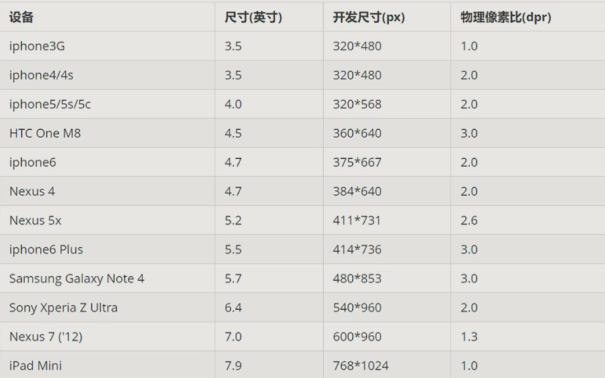

[TOC]

# 一、基础概述

## 1、移动端基础

### 1.1 PC浏览器/移动端浏览器

PC：360,谷歌,火狐,QQ,百度,搜狗,IE

IOS：UC,QQ,百度,360,谷歌,搜狗,猎豹,和其他杂牌

总结：兼容移动端主流浏览器，主要考虑 WebKit 内核浏览器即可。

### 1.2 手机屏幕

现状：

- 屏幕尺寸多，碎片化严重
- 多种分辨率

常见屏幕尺寸：



注：以上数据参考自 https://material.io/devices/

注：dp,dpi,pt,ppi 等单位，作为前端不用过多纠结，IOS 开发需要熟悉

### 1.3 移动端调试

1. Chrome DevTools(谷歌浏览器)的手机模拟调试
2. 搭建本地 Web 服务器，在同一局域网内，通过手机访问服务器
3. 外网服务器，直接 IP 或域名访问

## 2、视口

视口 (viewport) 就是浏览器显示页面内容的屏幕区域。视口可以分为 布局视口，视觉视口，理想视口。

### 2.1 布局视口

布局视口-layout viewport

- 一般移动设备的浏览器默认设置了一个布局视口，用于解决早期的 PC 端页面在手机上显示的问题
- 这个视口的分辨率一般默认为 980px，所以 PC 端网页元素在移动端看上去很小，一般默认可以手动缩放网页

### 2.2 视觉视口

视觉视口-visual viewport

- 指用户正在看到的**网站的区域**。
- 视觉视口可以通过缩放操作，但不会影响布局视口，布局视口仍保持原始宽度。

### 2.3 理想视口

理想视口-ideal viewport

- 初衷：使网站在移动端有最理想的浏览体验和阅读宽度

- 使用：需要手动添写 meta 视口标签

- meta 视口标签的主要目的：布局视口的宽度应该与理想视口的宽度一致。

### 2.4 mate 标签

语法：

```css
<mate name="viewport" content="width=device-width,user-scalable=no,initial-scale=1.0,maximum-scale=1.0,minimum-scale=1.0">
```

| 属性          | 解释说明                                             |
| ------------- | ---------------------------------------------------- |
| width         | 设置视口 viewport 宽度，可以设置 device-width 特殊值 |
| initial-scale | 初始缩放比，大于 0 的数字                            |
| maximum-scale | 最大缩放比，大于 0 的数字                            |
| minimum-scale | 最小缩放比，大于 0 的数字                            |
| user-scalable | 用户是否可以缩放，yes 或 no (1 或 0)                 |

> device-width 表示设备的宽度，表示跟设备自适应

### 2.5 标准的 viewport 设置

- 视口宽度和设备保持一致
- 视口的默认缩放比例 1.0
- 不允许用户自行缩放
- 最大允许的缩放比例 1.0
- 最小允许的缩放比例 1.0

## 3、二倍图

### 3.1 物理像素 & 物理像素比

- 物理像素点指的是屏幕显示的最小颗粒，是物理真实存在的，也是厂商在出厂时就设置好了的
- 在移动端，1px = 2 个物理像素点
- 一个 px 能显示的物理像素点的个数，称为物理像素比或屏幕像素比
- 不同手机的物理像素比可能不同

为什么会存在这种比例关系？

因为 Retina (视网膜屏幕) 显示技术的出现，可以将更多的物理像素点压缩至一块屏幕里，这样提高分辨率，提高屏幕显示的细腻程度，但是同样的，也将原本的比例系给改变了，因为在 Retina 技术中，一个 px 可能是由多个物理像素点组成。

### 3.2 多倍图

对于一张图片，如果采取措施就直接将其在 Retina 屏中打开，会因为物理像素比的原因而被放大，从而造成图片失真的效果

为了解决这个问题，就采用多倍图的方法，基本思路为：将一张图片的尺寸缩小为原来的 2 倍

> 具体缩小倍数根据自身需求，最终取决于 物理像素比 的比例缩放

**图片压缩语法：**

```css
img {
    width: 宽;
    height: 高;
}
```

**背景图片缩放语法：**

background-size 属性规定背景图像的尺寸。

```css
background-size: 背景图片宽 背景图片高;
```

- 单位：长度 | 百分比 | cover | contain;
- cover 表示将背景图片扩展的足够大，以使背景图像完全覆盖(铺满)背景区域，这就导致部分背景图片可能显示不全。
- contain 表示将图像拓展至最大尺寸，以使其宽和高完全适应内容区域，而当宽或高铺满 div 盒子时，就不再拓展图片，这就导致可能会有部分空白区域

### 3.3 二倍精灵图

1. 在测量软件中，将原图进行二倍缩小
2. 然后再进行测量
3. 确定位置后，写上相应的坐标即可，但是再程序中仍然要将 background-size 加上，来缩小精灵图原图的尺寸

## 4、移动端开发选择

### 4.1 移动端开发主流方案

1）单独制作移动端页面 (主流)

通常情况下，网址域名前面加 m(mobile) 可以打开移动端。通过判断设备，如果是移动设备打开，则跳到移动端页面。

2）响应式页面兼容移动端 (其次)

通过判断屏幕宽度来改变样式，以适应不同终端。

缺点：制作麻烦，需要花很大精力去调**兼容性**问题


## 5、移动端技术解决方案

### 5.1 移动端浏览器

移动端浏览器基本以 webkit 内核为主，因此我们就考虑 webkit 兼容性问题。

我们可以放心使用 H5 标签和 CSS3 样式。

同时我们浏器的私有前缀我们只需要考虑添加 webkit 即可

### 5.2 CSS 初始化 normalize.css

移动端 CSS 初始化推荐使用 normalize.css/

- Normalize.css: 保护了有价值的默认值
- Normalize.css: 修复了浏览器的 bug
- Normalize.css: 是模块化的
- Normalize.css: 拥有详细的文档

官网地址：http://necolas.github.io/normalize.css/

### 5.3 移动端常见特殊样式

**1）CSS3 盒子模型**

```css
box-sizing: border-box;
-webkit-box-sizing: border-box;
```

**2）超链接点击高亮问题**

```css
* {
    -webkit-tap-highlight-color: transparent;
}
```

**3）移动端默认样式问题**

```css
/* 苹果移动端浏览器对按钮元素可能会有默认外观样式的问题，
   只有加上这个属性才能自己给该元素设置自定义样式 */
input {
    -webkit-appearance: none;
}
```

**4）长按页面弹出菜单问题**

```css
/* 禁止长按图片或超链接元素，右侧会弹出菜单 */
img,a {
    -webkit-touch-callout: none;
}
```

## 6、移动端常见布局

### 6.1 单独制作

- 流式布局 (百分比布局)
- flex 弹性布局 (强烈推荐)
- less + rem + 媒体查询布局
- 混合布局

### 6.2 响应式兼容

- 媒体查询
- bootstarp

## 7、图片格式

### 7.1 DPG

DPG 图片压缩技术

京东自主研发推出 DPG 图片压缩技术，经测试该技术，可直接节省用户近 50% 的浏览流量，极大的提升了用户的网页打开速度。能够兼容 jpeg,实现全平台、全部浏览器的兼容支持，经过内部和外部上万张图片的人眼浏览测试后发现，压缩后的图片和 webp 的清晰度对比没有差距。

### 7.2 webp

webp 图片格式

谷歌开发的一种旨在加快图片加载速度的图片格式。图片压缩体积大约只有 PEG 的 2/3,并能节省大量的服务器宽带资源和数据空间

## 8、背景线性渐变

**语法：**

```css
background: linear-gradient(起始方向，颜色1，颜色2，...);
background: -webkit-linear-gradient(left,red blue);
background: -webkit-linear-gradient(left top,red,blue);
```

> 背景渐变必须添加浏览器私有前缀

> 起始方向可以是：方位名词 或者 度数，如果省略默认就是 top,

# 二、布局实现

## 1、流式布局

- 流式布局就是百分比布局，也称非固定像素布局。移动 Web 开发比较常见

好处：不受固定像素的限制

问题：宽高不受限制，在特殊情况下(宽高极大或极小)，会影响内容的呈现

解决思路：设置 最大 (小) 宽 (高) 度 --> `max-width(min-width) / max-height(min-height)`

**流式布局只管宽度**

## 2、flex 布局

flex 布局 也被称为 弹性布局

### 2.1 传统布局 VS flex 布局

**传统布局：**

- 兼容性好
- 布局繁琐
- 局限性，不能再移动端很好的布局

**flex 弹性布局：**

- 操作方便，布局极为简单，移动端应用很广泛
- PC 端浏览器支持情况较差
- IE 11 或更低版本，不支持或仅部分支持

**总结：**

1. 如果是 PC 端页面布局，我们还是传统布局。
2. 如果是移动端或者不考虑兼容性问题的 PC 端页面布局，我们还是使用 flex 弹性布局

### 2.2 布局原理

flex 是 flexible Box 的缩写，意为"弹性布局"，用来为盒状模型提供最大的灵活性，任何一个容器都可以指定为 flex 布局。

- 当我们为父盒子设为 flex 布局以后，子元素的 float、clear 和 vertical-align 属性将失效。
- 伸缩布局 = 弹性布局 = 伸缩盒布局 = 弹性盒布局 = flex 布局

采用 Flex 布局的元素，称为 Flex 容器 (flex container)，简称 "容器"。它的所有子元素自动成为容器成员，称为 Flex 项目 (flex item)，简称 "项目"。

**总结：**

就是通过给父盒子添加 flex 属性，来控制子盒子的位置和排列方式

### 2.3 常见父元素属性

| 属性            | 说明                                                   |
| --------------- | ------------------------------------------------------ |
| flex-direction  | 设置主轴的方向                                         |
| justify-content | 设置主轴上的子元素排列方式                             |
| flex-wrap       | 设置子元素是否换行                                     |
| align-content   | 设置侧轴上的子元素的排列方式（多行）                   |
| align-items     | 设置侧轴上的子元素排列方式（单行）                     |
| flex-flow       | 复合属性，相当于同时设置了 flex-direction 和 flex-wrap |

**1）flex-direction：**

主轴和侧轴：

- 默认主轴方向就是 X 轴方向，水平向右
- 默认侧轴方向就是 y 轴方向，水平向下

> 主轴和侧轴是会变化的，就看 flex-direction 设置谁为主轴，剩下的就是侧轴。而我们的子元素是跟着主轴来排列的

**属性值：**

| 属性值         | 说明           |
| -------------- | -------------- |
| row            | 默认值从左到右 |
| row-reverse    | 从右到左       |
| column         | 从上到下       |
| column-reverse | 从下到上       |


**2）justify-content**

该属性定义了项目在主轴上的对齐方式

> 注意：使用这个属性之前一定要确定好主轴是哪个

**属性值：**

| 属性值        | 说明                                          |
| ------------- | --------------------------------------------- |
| flex-start    | 默认值从头部开始，如果主轴是 x 轴，则从左到右 |
| flex-end      | 从尾部开始排列                                |
| center        | 在主轴居中对齐（如果主轴是 x 轴则水平居中）   |
| space-around  | 平分剩余空间                                  |
| space-between | 先两边贴边，再平分剩余空间（重要）            |

**3）flex-wrap**

默认情况下，项目都排在一条线 (又称 "轴线") 上。flex-wrap 属性定义，flex 布局中默认是不换行的。

所以，如果出现了项目过大或过多的情况，flex 布局会修改项目的大小，然后将其一行显示。

**属性值：**

| 属性值 | 说明           |
| ------ | -------------- |
| nowrap | 默认值，不换行 |
| wrap   | 换行           |

**4）align-items**

设置侧轴上的子元素排列方式（单行）

**属性值：**

| 属性值     | 说明                     |
| ---------- | ------------------------ |
| flex-start | 从上到下                 |
| flex-end   | 从下到上                 |
| center     | 挤在一起居中（垂直居中） |
| stretch    | 拉伸（默认值）           |

**5）align-content**

设置侧轴上的子元素的排列方式（多行），在单行的情况下无效。

> 多行就是必须要出现一次 换行

**属性值：**

| 属性值        | 说明                                   |
| ------------- | -------------------------------------- |
| flex-start    | 默认值，在侧轴的头部开始排列           |
| flex-end      | 在侧轴的尾部开始排列                   |
| center        | 在侧轴中间显示                         |
| space-around  | 子项在侧轴平分剩余空间                 |
| space-between | 子项在侧轴先分布在两头，再平分剩余空间 |
| stretch       | 设置子项元素高度平分父元素高度         |

**6）flex-flow**

复合属性，相当于同时设置了 flex-direction 和 flex-wrap

**语法：**

```css
flex-flow: row wrap;
```

### 2.4 子项常见属性

| 属性       | 说明                         |
| ---------- | ---------------------------- |
| flex       | 子项目占的份数               |
| align-self | 控制子项自己在侧轴的排列方式 |
| order      | 定义子项的排列顺序(前后顺序) |

**1）flex**

flex 属性定义子项目分配剩余空间，用 flex 来表示占多少份数。

在 flex 属性中，空间的计量单位变成了 份额，根据份额来自适应大小

用在谁身上，就表示谁占有，一般用在子项身上，表示对当前空间的分配比例，一个子项就独占全部，两个子项就平分，以此类推

值的数字表示，当前子项在这个剩余空间中能得到几个份额的空间。

> 剩余空间：一个盒子中，如果只有一个子元素，且该子元素有大小，那么除去这个子元素之外的空间就是剩余空间
>
> 如果这个盒子是空的，没有任何元素，那么这个盒子里面的所有空间都是剩余空间

**语法：**

```css
.item {
    flex: <number>; /* default 0 */
}
```

> flex 的值可以为1，2，3...，也可以是 百分比，如果是百分比，则是相对于父元素的百分比

**2）align-self**

控制子项自己在侧轴的排列方式

align-self 属性允许单个项目有与其他项目不一样的对齐方式，可覆盖 align-items 属性。

默认值为 auto，表示继承父元素的 align-items 属性，如果没有父元素，则等同于 stretch。

**语法：**

```css
span:nth-child(2) {
    /* 设置自己在侧轴的排列方式 */
    align-self: flex-end;
}
```

**3）order**

数值越小，排列越靠前，默认为 0。

> 注意：和 z-index 不一样。
>
> z-index 控制层级前后上的先后顺序
>
> order 控制左右上的前后顺序

## 3、rem 适配布局

### 3.1 认识 rem

rem 是一个单位

rem 全称 root em ，是一个相对单位，类似于 em

> em 是父元素字体的大小，是相对于 父元素的字体大小来进行换算的
>
> 换算公式为：父元素字体大小 px * em 的值 = 当前盒子/字体的大小

不同的是 rem 的基准是相对于 html 元素的字体大小

> rem 与 px 的换算跟 em 一致。

rem 的优点：可以通过修改 HTML 里面的文字大小，来改变页面元素的大小，使整个页面元素整体可控。

### 3.2 媒体查询

**(1) 什么是媒体查询？**

是 CSS3 新**语法**，媒体查询 英文名为 Media Query


**(2) 有什么用？**

- 使用 @media 查询，可以针对不同的 媒体类型 和 屏幕尺寸 设置/定义 不同的样式
- @media 查询能使你在重置浏览器大小的过程中，页面也会根据浏览器的宽度和高度重新渲染页面
- 使用范围广，很多苹果手机、Android 手机，平板等设备都用得到


**(3) 媒体查询怎么用？**

**语法：**

```css
@media mediatype and|not|only (media feature){
	CSS-Code;
}
```

**名词解释：**

- 用 @media 开头，注意 @ 符号
- mediatype 表示媒体类型
- 关键字：and not only
- media feature 表示媒体特性 必须有小括号包含


1. **mediatype 媒体类型**

将不同的终端设备划分成不同的类型，称为媒体类型

| 值     | 说明                               |
| ------ | ---------------------------------- |
| all    | 用于所有设备                       |
| print  | 用于打印机和打印预览               |
| screen | 用于电脑屏幕，平板电脑，智能手机等 |


2. **关键字**

关键字将媒体类型或多个媒体特性连接到一起做为媒体查询的条件。

| 关键字 | 说明                                               |
| ------ | -------------------------------------------------- |
| and    | 可以将多个媒体特性连接到一起，相当于 "且" 的意思。 |
| not    | 排除某个媒体类型，相当于 "非" 的意思，可以省略。   |
| only   | 指定某个特定的媒体类型，可以省略。                 |


3. **媒体特性**

每种媒体类型都具有各自不同的特性，根据不同媒体类型的媒体特性设置不同的展示风格。我们暂且了解三个。

注意他们要加小括号包含

| 值        | 说明                               |
| --------- | ---------------------------------- |
| width     | 定义输出设备中页面可见区域的宽度   |
| min-width | 定义输出设备中页面最小可见区域宽度 |
| max-width | 定义输出设备中页面最大可见区域宽度 |

> 最大值和最小值都包含了一个等于号的含义
>
> 最大值表示不超过的意思，最小值表示不低于的意思。
>
> 最大值表示在范围内发生变化，范围外不做处理，最小值表示在范围外发生变化，范围内不做处理


**(4) 引入资源**

当样式比较繁多的时候，我们可以针对不同的媒体使用不同 stylesheets (样式表)。

原理，就是直接在 link 中判断设备的尺寸，然后引用不同的 css 文件。

**语法规范：**

```html
<link rel="stylesheet" media="mediatype and|not|only (media feature)" href="mystylesheet.css">
```

> 建议：媒体查询最好的方法是从小到大

### 3.2 Less


**(1) Less 是什么**

Less 全称：Leaner Style Sheets

Less 是 CSS 的一门扩展语言，也称为 CSS 预处理器。

Less 中文网址：http://lesscss.cn

常见的 CSS 预处理器：Sass、Less、Stylus

**总结**：Less 是一门 CSS 预处理语言，它扩展了 CSS 的动态特性。


**(2) Less 有什么用**

less 的出现是为了解决 CSS 的一些弊端的。

因为：

- CSS 是一门非程序式语言，没有变量、函数、SCOPE (作用域)等概念。
- CSS 需要书写大量看似没有逻辑的代码，CSS 冗余度是比较高的。
- 不方便维护及扩展，不利于复用
- CSS 没有很好的计算能力
- 非前端开发工程师来讲，往往会因为缺少 CSS 编写经验而很难写出组织良好且易于维护的 CSS 代码项目。

Less 做为 CSS 的一种形式的扩展，它并没有减少 CSS 的功能，而是在现有的 CSS 语法上，为 CSS 加入程序式语言的特性。

它在 CSS 的语法基础之上，引入了 变量，Mixin(混入)，运算 以及 函数 等功能，大大简化了 CSS 的编写，并且降低了 CSS 的维护成本，就像它的名称所说的那样，Less 可以让我们用更少的代码做更多的事情。


**(3) Less 怎么用**

我们首先新建一个后缀名为 less 的文件，在这个 less 文件里面书写 less 语句。

- Less 变量
- Less 编译
- Less 嵌套
- Less 运算


1. **Less 变量**

变量是指没有固定的值，可以改变的。因为我们 CSS 中的一些颜色和数值等经常使用。

**语法：**

```css
@变量名: 值;
```

**变量命名规范：**

- 必须有 @ 为前缀
- 不能包含特殊字符
- 不能以数字开头
- 大小写敏感


2. **Less 编译**

本质上，Less 包含一套自定义的语法及一个解析器，用户根据这些语法定义自己的样式规则，这些规则最终会通过解析器，编译生成对应的 CSS 文件。

所以，我们需要把我们的 less 文件，编译生成为 css 文件，这样我们的 html 页面才能使用。


3. **Less 嵌套**


我们经常用到选择器的嵌套

Less 嵌套写法：

```less
#header {
    .logo {
        width: 300px;
    }
}
```

**如果遇见 (交集|伪类|伪元素选择器)：**

- 内层选择器的前面没有 & 符号，则它被解析为父选择器的后代；

- 如果有 & 符号，它就被解析为父元素自身或父元素的伪类。
- 总结：交集|伪类|伪元素选择器 需要在内层的选择器前面加 &


4. **Less 运算**

任何数字、颜色或者变量都可以参与运算。

Less 提供了 加(+)、减(-)、乘(*)、除(/) 算术运算。

**例如：**

```less
// Less
@witdh: 10px + 5;

div {
	border: @witdh solid red;
}
```

```css
/* css */
div {
	border: 15px solid red;
}
```

```less
// Less 甚至还可以这样
width: (@width + 5) * 2;
```

**注意：**

- 乘号(*) 和 除号(/) 的 写法
- 运算符中间**左右有空格隔开** 1px + 5
- 对于**两个不同的单位的值之间的运算，运算结果的值取第一个值的单位**
- **如果两个值之间只有一个值有单位，则运算结果就取该单位**

> WebStrom 中，计算公式需要用 `()` 括号括起来。


**(4) Less 中的导入**

将写好的文件导入，可以使我们使用

**语法：**

```less
@import "文件名"
```

> 文件名不用加后缀

### 3.3 rem 适配方案

**(1) 适配的目标是什么？**

让一些不能等比自适应的元素，达到当设备尺寸发生改变的时候，等比例适配当前设备。


**(2) 怎么去达到这个目标？**

使用媒体查询，根据不同设备按比例设置 html 的字体大小，然后页面元素使用 rem 做尺寸单位，当 html 字体大小变化，元素尺寸也会发生变化，从而达到等比缩放的适配。


**(3) 怎么在实际的开发当中使用？**

按照设计稿与设备宽度的比例，动态计算并设置 html 根标签的f ont-size 大小；（媒体查询）

CSS 中，设计稿元素的宽、高、相对位置等取值，按照同等比例换算为 rem 为单位的值;


**(4) rem 适配方案技术选型**


1. **方案1**

- less
- 媒体查询
- rem


**设计稿常见尺寸宽度：**

| 设备       | 常见宽度                                                     |
| ---------- | ------------------------------------------------------------ |
| iphone 4.5 | 640px                                                        |
| iphone 678 | 750px                                                        |
| Android    | 常见 320px、360px、375px、384px、400px、414px、500px、720px <br>大部分 4.7~5 寸的安卓设备为 720px |

一般情况下，我们以一套或两套效果图适应大部分的屏幕，放弃极端屏或对其优雅降级，牺性一些效果

现在基本以 750 为准。


**动态设置 html 标签 font-size 大小：**

1. 假设设计稿是 750px
2. 假设我们把整个屏幕划分为 15 等份（划分标准不一，可以是 20 等份也可以是 10 等份）
3. 每一份作为 html 字体大小，这里就是 50px
4. 那么在 320px 设备的时候，字体大小为 320/15 就是 21.33px
5. 用我们页面元素的大小除以不同的 html 字体大小会发现他们比例还是相同的
6. 比如我们以 750 为标准设计稿
7. 一个 `100 * 100` 像素的页面元素在 750 屏幕下，就是 `100 / 50`，
   转换为 rem， 是 `2rem * 2rem` ，比例是 1 比 1
8. 320 屏幕下，html 字体大小为 21.33，则 `2rem = 42.66px`，
   此时宽和高都是 42.66，但是宽和高的比例还是 1 比 1 
9. 但是已经能实现不同屏幕下，页面元素盒子等比例缩放的效果


**元素大小取值方法：**

1. 最后的公式：`页面元素的 rem 值 = 页面元素值(px) / (屏幕宽度 / 划分的份数)`
2. `屏幕宽度 / 划分的份数`，就是 html 中 font-size 的大小
3. 或者：`页面元素的 rem 值 = 页面元素值(px) / html 里 font-size 的大小`


2. **方案2 (推荐)**

- flexible.js
- rem


**认识 flexible.js**

手机淘宝团队出的简洁高效的移动端适配库

我们再也不需要在写不同屏幕的媒体查询，因为里面 js 做了处理

它的原理是把当前设备划分为 10 等份，但是不同设备下，比例还是一致的。

我们要做的，就是确定好我们当前设备的 html 文字大小就可以了

比如当前设计稿是 750px，那么我们只需要把 html 文字大小设置为 75px(750px/10) 就可以

里面页面元素 rem 值：页面元素的 px 值 / 75

剩余的，让 flexible.js 来去算

github:地址：https://github.com/amfe/lib-flexible


**总结**：

- 两种方案现在都存在。
- 方案2 更简单

## 4、响应式布局

### 4.1 响应式开发原理

使用媒体查询针对不同宽度的设备进行布局和样式的设置，从而适配不同设备。

**档位划分：**

| 设备划分                 | 尺寸区间            |
| ------------------------ | ------------------- |
| 超小屏幕（手机）         | < 768px             |
| 小屏设备（平板）         | >= 768px ~ < 992px  |
| 中等屏幕（桌面显示器）   | >= 992px ~ < 1200px |
| 宽屏设备（大桌面显示器） | >= 1200px           |

### 4.2 响应式布局容器

响应式需要一个父级做为布局容器，来配合子级元素来实现变化效果。

原理就是在不同屏幕下，通过媒体查询来改变这个布局容器的大小，再改变里面子元素的排列方式和大小，从而实现不同屏幕下，看到不同的页面布局和样式变化。

**响应式尺寸划分档位：**

- 超小屏幕（手机，小于 768px)：设置宽度为 100%
- 小屏幕（平板，大于等于 768px)：设置宽度为 750px
- 中等屏幕（桌面显示器，大于等于 992px)：宽度设置为 970px
- 大屏幕（大桌面显示器，大于等于 1200px)：宽度设置为 1170px

## 5、vw and vh

### 5.1 基本介绍

`vw / vh` 是一个相对单位（类似 em 和 rem 相对单位)

1. vw 是：viewport width 视口宽度单位
2. vh 是：viewport height 视口高度单位
3. 相对视口的尺寸计算结果
   - 1 vw = 1 / 100 视口宽度
   - 1 vh = 1 / 100 视口高度

例如：

当前屏幕视口是 375 像素，则 1vw 就是 3.75像素 (375 / 100) 。

**注意：**

- 与百分比有区别，百分比是相对于父元素，而 vw 和 vh 总是针对于当前视口。

### 5.2 还原设计稿

跟 rem 的思想基本一致

1. 当前屏宽 / 划分数量 (vw 里是 100 份)，所以这个公式经过转换是 --> 当前屏宽 / 100，得到 1vw 的值
2. 明确设计稿中的目标像素大小
3. 用设计稿中的目标的原始尺寸 / 1vw 所得到的就是一个元素在不同视口下的 vw 值

**总结：**

1. 当前屏宽 / 100，得到 1vw 的值
2. 元素的原始尺寸 / 1vw ，得到的就是具体的 vw 值

### 5.3 vw 使用注意事项

我们本质是根据视口宽度来等比例缩放页面元素高度和宽度的，所以开发中使用 vw 就基本够用了。vh 很少使用。

宽度也可以使用 vw，因为 vw 的本质就是一个单位，所以不管是宽度也好，高度也好，都可以使用 vw 来作为单位。

重点看重的是一个等比例，因为 vw 是根据宽度来进行运算的，所以 宽和高 都使用 vw 来做单位，那么只要宽度一改变，那么 元素的宽度 和高度都会进行等比例的改变。

## 6、Bootstrap

### 5.1 简介

Bootstrap 来自 Twitter (推特)，是目前最受欢的前端框架。Bootstrap 是基于 HTML、CSS 和 JAVASCRIPT的，它简洁灵活，使得 Web 开发更加快捷。

中文官网：http://www.bootcss.com/

官网：http://getbootstrap.com/

框架：顾名思义就是一套架构，它有一套比较完整的网页功能解决方案，而目控制权在框架本身，有预制样式库、组件和插件。使用者要按照框架所规定的某种规范进行开发。

**优点：**

- 标准化的 html + css 编码规范
- 提供了一套简洁、直观、强悍的组件
- 有自己的生态圈，不断的更新迭代
- 让开发更简单提高了开发的效率

**版本：**

- 2.x.x：停止维护，兼容性好，代码不够简洁，功能不够完善。
- 3.x.x：目前使用最多，稳定但是放弃了IE6 - IE7。对 IE8 支持但是界面效果不好，偏向用于开发响应式布局、移动设备优先的 WEB 项目。
- 4.x.x：最新版，目前还不是很流行

### 5.2 使用

控制权在框架本身，使用者要按照框架所规定的某种规范进行开发。

**使用四部曲：**

1. 创建文件夹结构
2. 创建 html 骨架结构
3. 引入相关样式文件
4. 书写内容

**(1) 创建文件夹结构：**

1. 下载 Bootstrap
2. 解压文件夹
3. 在项目根目录下新建 bootstrap 文件夹
4. 将解压后的文件复制进 bootstrap 文件夹

**(2) 创建 html 骨架结构：**

```html
    <!-- 要求当前网页使用 IE 浏览器最高版本的内核来渲染 -->
    <meta http-equiv="X-UA-Compatible" content="IE=edge">
    <!-- 视口的设置：视口的宽度和设备一致，默认的缩放比例和 PC 端一致，用户不能自行缩放-->
    <meta name="viewport" content="width=device-width, initial-scale=1, user-scalable=0">

<!--[if lt IE 9]>
 	解决 ie9 以下浏览器对 html5 新增标签的不识别，并导致 CSS 不起作用的问题
      <script src="https://cdn.jsdelivr.cn/npm/html5shiv@3.7.3/dist/html5shiv.min.js"></script>
	解决 ie9 以下浏览器对 css3 Media Query 的不识别
      <script src="https://cdn.jsdelivr.cn/npm/respond.js@1.4.2/dest/respond.min.js"></script>
    <![endif]-->
```

**(3) 引入 bootstrap 样式文件：**

```html
<!-- 引入 bootstrap 核心样式 -->
    <link rel="stylesheet" href="bootstrap/css/bootstrap.min.css">
```

**(4) 书写内容：**

```html
<body>
    ...
</body>
```

- 直接拿 Bootstrap 预先定义好的样式来使用
- 修改 Bootstrap 原来的样式，注意权重问题
- 学好 Bootstrap 的关键在于知道它定义了哪些样式，以及这些样式能实现什么样的效果


### 5.3 Bootstrapt 的布局容器

Bootstrap 需要为页面内容和栅格系统包裹个 .container 容器，Bootstarp 预先定义好了这个类，叫 .container，它提供了两个作此用处的类。

**(1) container 类：**

- 响应式布局的容器固定宽度
- 大屏 (>=1200px) 完度定为 1170px
- 中屏 (>=992px) 宽度定为 970px
- 小屏 (>=768px) 宽度定为 750px
- 超小屏 (100%)
- 左右默认有一个 15 像素左右的内边距

**(2) container-fluid 类：**

- 流式布局容器，百分百宽度
- 占据全部视口 (viewport) 的容器。
- 适合于单独做移动端开发


### 5.4 栅格系统

栅格系统英文为 “grid systems”，也有人翻译为 “网格系统”，它是指将页面布局划分为等宽的列，然后通
过列数的定义来模块化页面布局。

Bootstrap 提供了一套响应式、移动设备优先的流式栅格系统，随着屏幕或视口 (viewport) 尺寸的增加，
系统会自动分为最多 12 列。

Bootstrap 里面 container 宽度是固定的，但是不同屏幕下，container 的宽度不同，我们再把 container 划分为 12 等份

**(1) 栅格选项参数：**

栅格系统用于通过一系列的行 (row) 与列 (column) 的组合来创建页面布局，你的内容就可以放入这些创建好的布局中。

|                     | 超小屏幕（手机）< 768px | 小屏设备（平板）>= 768pX | 中等屏幕（桌面显示器）>= 992px | 宽屏设备（大桌面显示器）>= 1200px |
| ------------------- | :---------------------: | :----------------------: | :----------------------------: | :-------------------------------: |
| .container 最大宽度 |       自动(100%)        |          750px           |             970px              |              1170px               |
| 类前缀              |       `.col-xs-`        |        `.col-sm-`        |           `.col-md-`           |            `.col-Ig-`             |
| 列 (column) 数      | 12 |12|12|12|

- 行 (row) 必须放到 container 布局容器里面
- 我们实现列的平均划分，需要给列添加类前缀
- `xs-extra small`：超小；`sm-small`：小；`md-medium`：中等；`lg-large`：大；
- 列 (column) 大于 12，多余的 “列 (column) ” 所在的元素将被作为一个整体另起一行排列每一列默认有左右 15 像素的 padding
- 可以同时为一列指定多个设备的类名，以便划分不同份数例如 `class="col-md-4 col-sm-6"`
- 划分数量铺不满屏幕则会留白，超出了屏幕则会换行


**(2) 列嵌套：**

栅格系统内置的栅格系统将内容再次嵌套。简单理解就是一个列内再分成若干份小列。我们可以通过添加一个新的 `.row` 元素和一系列 `.col-sm-*` 元素到已经存在的 `.co-sm-*` 元素内。

列嵌套时最好再加一个 行 `.row` ，这样可以取消父元素的 padding 值

例如：

```html
<!--父容器-->
<div class="container">
    <!--行元素-->
    <div class="row">
        <!--占了 4 份-->
        <div class="col-md-4">
            <!--上面的 div 盒子里面再次嵌套，使用 row，取消父元素的 padding 值，而且高度自动和父级一样高 -->
            <div class="row">
                <!--占了父盒子空间的6份-->
                <div class="col-md-6"></div>
                <div class="col-md-6"></div>
            </div>
        </div>
    </div>
</div>
```


**(3) 列偏移：**

使用 `.col-md-offset-*` 类，可以将列向右侧偏移。这些类实际是通过使用 `*` 选择器为当前元素增加了左侧的边距(margin)。

例如：

```html
<!-- 列偏移 -->
<div class="row">
    <div class="col-1g-4">1</div>
    <!-- 向右平移- offset 的格数 -->
    <div class="col-1g-4 col-lg-offset-4">2</div>
</div>
```


**(4) 列排序：**

通过使用 `.col-md-push-*` 和 `.col-md-pull-*` 类就可以很容易的改变列 (column) 的顺序。

- 将 右边的元素 移向左边，需要用到 `pull` 拉
- 将 左边的元素 移向右边，需要用到 `push` 推


**(5) 响应式工具：**

为了加快对移动设备友好的页面开发工作，利用媒体查询功能，并使用这些工具类可以方便的针对不同设备展示或隐藏页面内容。

| 类名       | 超小屏 | 小屏 | 中屏 | 大屏 |
| ---------- | ------ | ---- | ---- | ---- |
| .hidden-xs | 隐藏   | 可见 | 可见 | 可见 |
| .hidden-sm | 可见   | 隐藏 | 可见 | 可见 |
| .hidden-md | 可见   | 可见 | 隐藏 | 可见 |
| .hidden-lg | 可见   | 可见 | 可见 | 隐藏 |

- 与之相反的，是 `visible-xs, visible-sm, visible-md, visible-lg` 是显示某个页面内容

Bootstrap 其他（按钮、表单、表格) 请参考 Bootstrap 文档。


## 补充：

### 1、swiper插件

官网地址：https://www.swiper.com.cn/

- 下载需要的css和js文件
- 官网找到类似案例，复制 html 结构，css 样式 js 语法
- 根据需求定制修改模块
