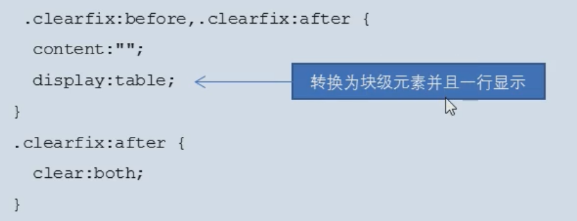

# 一、网页

## 1、什么是网页？

### 1.1 什么是网站？

​	**网站**是指在因特网上根据一定的规则，使用 HTML 等制作的用于展示特定内容相关的**网页集合**。

### 1.2 什么是网页？

​	网页是网站中的一 “页” ，通常是 HTML 格式的文件，它要**通过浏览器来阅读**。

​	网页是构成网站的基本元素，它通常由 图片、链接、文字、声音、视频 等元素组成。通常我们看到的网页，常见以 .htm 或 .html 后缀结尾的文件，因此将其俗称为 HTML 文件。

## 2、什么是 HTML？

### 2.1 HTML

​	HTML 指的是**超文本标记语言** (Hyper Text Markup Language) ,它是**用来描述网页的一种语言**。

​	HTML **不是一种编程语言**，而**是一种标记语言** (markup language)。

​	标记语言是一套标记标签 (markup tag) 。

### 2.2 术语解释

#### 1）超文本

(1) 它可以加入 图片、声音、动画、多媒体 等内容（**超越了文本限制**）。

(2) 它还可以从一个文件跳转到另一个文件，与世界各地主机的文件连接（**超级链接文本**）。

## 3、网页的形成

​	网页是由网页元素组成的，这些元素是利用 html 标签描述出来，然后通过浏览器解析来显示给用户的。

## 4、总结

1、网页是 图片、链接、文字、声音、视频 等元素组成其实就是一个 html 文件（后缀名为 html)

2、网页生成制作 ：由前端人员书写 HTML 文件，然后浏览器打开，就能看到了网页

3、HTML : 超文本标记语言，用来制作网页的一门语言.有标签组成的.比如图片标签链接标签视频标签等.

# 二、常用游览器

### 1、基本介绍

​	**浏览器是 网页显示、运行的平台**。

​	常用的浏览器有 IE、火狐 (Firefox) 、谷歌 (Chrome) 、Safari 和 Opera 等。平时称为五大浏览器。


### 2、游览器内核

​	浏览器内核 （**渲染引擎**）：负责读取 网页内容，整理讯息，计算网页的显示方式并显示页面。

| 浏览器         | 内核    | 同内核浏览器                                            |
| -------------- | ------- | ------------------------------------------------------- |
| IE             | Trident | IE、猎豹安全、360极速浏览器、百度浏览器                 |
| firefox        | Gecko   | 火狐浏览器内核                                          |
| Safari         | Webkit  | 苹果浏览器内核                                          |
| chrome / Opera | Blink   | chrome / Opera 浏览器内核。Blink 其实是 WebKit 的分支。 |

​	目前国内一般浏览器都会采用 Webkit / Blink 内核，如 360、UC、QQ、搜狗 等。

# 三、Web 标准

## 1、基本介绍

​	**Web 标准**是由 W3C 组织和其他标准化组织制定的**一系列标准的集合**。W3C (万维网联盟) 是国际最著名的标准化组织。

## 2、为什么需要 Web 标准

遵循 Web 标准除了可以让不同的开发人员写出的页面更标准、更统一外，还有以下优点：

(1) 让 Web 的发展前景更广阔。

(2) 内容能被更广泛的设备访问。

(3) 更容易被搜寻引擎搜索。

(4) 降低网站流量费用。

(5) 使网站更易于维护。

(6) 提高页面浏览速度。

## 3、Web 标准主要构成

​	主要包括 **结构 (Structure)**、**表现 (Presentation)** 和 **行为 (Behavior)** 三个方面。

| 标准 | 说明                                                         |
| ---- | ------------------------------------------------------------ |
| 结构 | 结构用于对**网页元素**进行整理和分类，现阶段主要学的是 HTML。 |
| 表现 | 表现用于设置网页元素的版式、颜色、大小等**外观样式**，主要指的是 CSS |
| 行为 | 行为是指网页模型的定义及**交互**的编写，现阶段主要学的是 Javascript |

Web 标准提出的最佳体验方案：**结构、样式、行为相分离。**

简单理解：**结构写到 HTML 文件中，表现写到 CSS 文件中，行为写到 JavaScript 文件中。**

# 四、HTML 基础

## 1、语法规范

(1) HTML 标签是**由尖括号包围的关键词**，例如`<html>`。

(2) HTML 标签**通常是成对出现的**，例如`<html>和</html>`,我们称为**双标签**。标签对中的第一个标签是开始标签，第二个标签是结束标签。

(3) 有些特殊的标签必须是单个标签（极少情况），例妆如`<br/>`，我们称为**单标签**。

## 2、标签关系

​	双标签关系可以分为两类：**包含关系**和**并列关系。**

### 1）包含关系

```html
<head>
    <title></title>
</head>
```

### 2）并列关系

​	又称 **兄弟关系**

```html
<head></head>
<body></body>
```

## 3、HTML 基本结构标签

### 3.1 第一个HTML

​	每个网页都会有一个基本的结构标签（也称为骨架标签），页面内容也是在这些基本标签上书写。

| 标签名            | 定义       | 说明                                                     |
| ----------------- | ---------- | -------------------------------------------------------- |
| `<html></html>`   | HTML 标签  | 页面中最大的标签，我们称为根标签                         |
| `<head></head>`   | 文档的头部 | 注意在 head 标签中我们必须要设置的标签是 title           |
| `<title></title>` | 文档的标题 | 让页面拥有一个属于自己的网页标题                         |
| `<body></body>`   | 文档的主体 | 元素包含文档的所有内容，页面内容基本都是放到 body 里面的 |

​	HTML 文档的后缀名必须是 .html 或 .htm ，浏览器的作用是读取 HTML 文档，并以网页的形式显示出它们。

​	此时，用浏览器打开这个网页，我们就可以预览我们写的第一个 HTML 文件了。

## 4、开发工具

​	目前我所选用的是 WebStorm

​	快速生成代码块 和 股价 和 结构标签 --> 标签名 + TAB

​	快速生成骨架方式 --> ! + TAB

## 5、标签解释

### 5.1 网页骨架新增标签

#### (1) <!DOCTYPE> 

​	表示 文档类型声明，作用就是告诉浏览器使用哪种 HTML 版本来显示网页。

```html
<!DOCTYPE html>
```

​	这句代码的意思是：当前页面采取的是 HTML5 版本来显示网页。

**注意：**

1）<!DOCTYPE> 声明位于文档中的最前面的位置，处于 `<html>` 标签之前。

2）<!DOCTYPE> 不是一个 HTML 标签，它就是文档类型声明标签。

#### (2) lang

​	表示语言种类

​	用来定义当前文档显示的语言。

​	1）en 定义语言为英语

​	2）Zh-CN 定义语言为中文

​	简单来说，定义为 en 就是英文网页，定义为 zh-CN 就是中文网页

​	其实对于文档显示来说，定义成 en 的文档也可以显示中文，定义成 zh-CN 的文档也可以显示英文

​	这个属性对浏览器和搜索引擎（百度.谷歌等）还是有作用的

#### (3) 字符集

​	字符集 (Character set) 是多个字符的集合。以便计算机能够识别和存储各种文字。

​	在 `<head>` 标签内，可以通过 `<meta>` 标签的 charset 属性来规定 HTML 文档应该使用哪种字符编码。

```html
<meta charset="UTF-8"/>
```

​	charset 常用的值有：GB2312、BIG5、GBK 和 UTF-8， 其中 UTF-8 也被称为万国码，基本包含了全世界所有国家需要用到的字符。

​	**注意：上面语法是必须要写的代码，否则可能引起乱码的情况。一般情况下，统一使用 “UTF-8” 编码，尽量统一写成标准的 "UTF-8" ，不要写成 "utf8" 或 "UTF8" 。**

# 五、HTML 常用标签

## 0、标签语义

​	学习标签是有技巧的，重点是记住每个标签的语义。简单理解就是指**标签的含义**，即这个标签是用来干麻的。

​	**根据标签的语义，在合适的地方给一个最为合理的标签，可以让页面结构更清晰。**

## 1、标题标签

​	为了使网页更具有语义化，我们经常会在页面中用到标题标签。 HTML 提供了 6 个等级的网页标题。

​	即 `<h1>-<h6>` 。

### 1.1 语法

```html
<h1></h1>
```

​	单词 head 的缩写，意为头部、标题。

​	**标签语义**：作为标题使用，并且依据重要性递减。

**特点**：

1）加了标题的文字会变的加粗，字号也会依次变大。

2）一个标题独占一行。

## 2、段落标签和换行标签

​	在网页中，要把文字有条理地显示出来，就需要将这些文字分段显示。在 HTML 标签中，`<p>` 标签用于**定义段落**，它可以将整个网页分为若干个段落。

### 2.1 段落标签

#### 语法

```html
<p>我是一个段落标签</p>
```

单词 paragraph ['paeragraef] 的缩写，意为段落。

**标签语义**：可以把 HTML 文档分割为若干段落。

**特点**：

1）文本在一个段落中会根据浏览器窗口的大小自动换行。

2）段落和段落之问保有空隙。


### 2.2 换行标签

​	在 HTML 中，一个段落中的文字会从左到右依次排列，直到浏览器窗口的右端，然后才自动换行。如果希望某段文本强制换行显示，就需要使用**换行标签** `<br/>`。

#### 语法

```html
<br />
```

单词 break 的缩写，意为打断、换行。

**标签语义**：强制换行。

特点：

1 ) `<br/>` 是个单标签。

2 ) `<br/>` 标签只是简单地开始新的一行，跟段落不一样，段落之间会插入一些垂直的间距

## 3、文本格式化标签

​	在网页中，有时需要为文字设置粗体、斜体或下划线等效果，这时就需要用到 HTML 中的文本格式化标签，使文字以特殊的方式显示。

​	标签语义：突出重要性，比普通文字更重要

| 语义   | 标签                               | 说明                                      |
| ------ | ---------------------------------- | ----------------------------------------- |
| 加粗   | `<strong></strong>` 或者 `<b></b>` | 更推荐使用 `<strong>` 标签加粗 语义更强烈 |
| 倾斜   | `<em></em>` 或者 `<i></i>`         | 更推荐使用 `<em>` 标签加粗 语义更强烈     |
| 删除线 | `<del></del>` 或者 `<s></s>`       | 更推荐使用 `<del>` 标签加粗 语义更强烈    |
| 下划线 | `<ins></ins>` 或者 `<u></u>`       | 更推荐使用 `<ins>` 标签加粗 语义更强烈    |

​	同学们**重点记住加粗和倾斜。**

## 4、盒标签

​	`<div>` 和 `<span>` 是没有语义的，它们就是一个盒子，用来装内容的。

**语法：**

```html
<div></div>
<span></span>
```

​	div 是 division 的缩写，表示分割、分区

​	span 意为跨度、跨距。

### 4.1 div

特点：

​	`<div>` 标签用来布局，但是现在**一行只能放一个** `<div>`。大盒子


### 4.2 span

特点：

​	`<span>` 标签用来布局，**一行上可以多个** `<span>` 。小盒子


## 5、图像标签和路径

### 5.1 图像标签

在 HTML 标签中，`` 标签用于定义 HTML 页面中的图像。

#### 1）语法：

```html

```

单词 image 的缩写，意为图像。

src 是 `` 标签的必须属性，它用于指定图像文件的路径和文件名。

所谓**属性**：简单理解就是属于这个图像**标签的特性**。

#### 2）图像标签的其他属性：

| 属性   | 属性值   | 说明                                 |
| ------ | -------- | ------------------------------------ |
| src    | 图片路径 | 必须属性                             |
| alt    | 文本     | 替换文本。图像不能显示的文字         |
| title  | 文本     | 提示文本。鼠标放到图像上，显示的文字 |
| width  | 像素     | 设置图像的宽度                       |
| height | 像素     | 设置图像的高度                       |
| border | 像素     | 设置图像的边框粗细                   |

补充：

1）修改图片像素的宽度和高度时，只修改其中的一个属性时，另外一个属性会等比例的缩放，所以一般情况下，我们只修改其中的一个属性即可。

#### 3）图像标签属性注意点：

(1) 图像标签可以拥有多个属性，必须写在标签名的后面。

(2) 属性之间不分先后顺序，标签名与属性、属性与属性之间均以空格分开。

(3) 属性采取键值对的格式，即 key=“value" 的格式，属性= "属性值"

### 5.2 路径

#### (1) 目录文件夹和根目录：

实际工作中，我们的文件不能随便乱放，否则用起来很难快速的找到他们，因此我们需要一个文件夹来管理他们。

目录文件夹：就是普通文件夹，里面只不过存放了我们做页面所需要的相关素材，比如 html 文件、图片等。

根目录：打开目录文件夹的第一层就是根目录

#### (2) 相对路径

​	以引用文件所在位置为参考基础，而建立出的目录路径。

​	这里简单来说，图片相对于 HTML 页面的位置


| 相对路径分类 | 符号 | 说明                                                         |
| ------------ | ---- | ------------------------------------------------------------ |
| 同一级路径   |      | 图像文件位于 HTML 文件同一级如 ``   |
| 下一级路径   | /    | 图像文件位于 HTML 文件下一级如 `` 。 |
| 上一级路径   | ../  | 图像文件位于 HTML 文件上一级如 `` 。 |

#### (3) 绝对路径

​	绝对路径：是指目录下的绝对位置，直接到达目标位置，通常是从盘符开始的路径。

​	例如，`“D:\web\img\logo.gif"` 或完整的网络地址 `"http:/www.itcast.cn/images/,Iogo.gif"` 。

**补充：**

/ 一般表示相对路径，在网络中表示绝对路径

\ 一般表示绝对路径，一般用在自己计算机中的绝对路径

## 6、超链接

​	在 HTML 标签中，`<a>` 标签用于定义超链接，作用是从一个页面链接到另一个页面。

### (1) 链接的语法格式

```html
<a href="跳转目标" target="目标窗口的弹出方式">文本或图像</a>
```

单词 anchor ['enka()] 的缩写，意为：锚。

两个属性的作用如下：

| 属性   | 作用                                                         |
| ------ | ------------------------------------------------------------ |
| href   | 用于指定链接目标的 url 地址，(必须属性)当为标签应用 href 属性时，它就具有了超链接的功能 |
| target | 用于指定链接页面的打开方式，其中 `_self` 为默认值，`_blank` 为在新窗口中打开方式。 |

#### (2) 链接的分类

(1) 外部链接：例如 `<a href="http://www.baidu.com">百度</a>` 。

(2) 内部链接：网站内部页面之间的相互链接，直接链接内部页面名称即可，例如 `<a href="index.html">首页</a>` 

(3) 空链接：如果当时没有确定链接目标时，`<a href="#">首页</a>`。

(4) 下载链接：如果 href 里面地址是一个文件或者压缩包，会下载这个文件。

(5) 网页元素链接：在网页中的各种网页元素，如文本、图像、表格、音频、视频等都可以添加超链接

(6) 锚点链接：点我们点击链接，可以快速定位到页面中的某个位置

- 在链接文本的 href 属性中，设置属性值为 #名字 的形式，如`<a href = "#two">第2集</a>`
- 找到目标位置标签，里面添加一个 id 属性 = 刚才的名字，如：`<h3 id="two">第2集个绍<h3>`

## 7、注释和特殊字符

### 7.1 注释

如果需要在 HTML 文档中添加一些便于阅读和理解但又不需要显示在页面中的注释文字，就需要使用注释标签。

HTML 中的注释以 “<!--”开头，以 ”->” 结束。

```html
<!-- 注释语句 --> 快捷键：ctrl + /
```

一句话：注释标签里面的内容是给程序猿看的，这个代码是不执行不显示到页面中的

添加注释是为了更好地解释代码的功能，便于相关开发人员理解和阅读代码，程序是不会执行注释内容的。

### 7.2 特殊字符

​	在 HTML 页面中，一些特殊的符号很难或者不方便直接使用，此时我们就可以使用下面的字符来替代。


**重点记住：空格、大于号、小于号这三个**，其余的使用很少，如果需要回头查阅即可。

## 8、表格标签

​	表格是实际开发中非常常用的标签：

### 8.1 表格的主要作用

​	表格主要**用于显示、展示数据**，因为它可以让数据显示的非常的规整，可读性非常好。特别是后台展示数据的时候，能够熟练运用表格就显得很重要。一个清爽简约的表格能够把繁杂的数据表现得很有条理。

Pink 老师总结：表格不是用来布局页面的，而是用来展示数据的。

### 8.2 表格的基本语法

```html
<table>
	<tr>
		<td>单元格内的文字</td>
        ...
	</tr>
    ...
</table>
```

(1) `<table></table>` 是用于定义表格的标签。

(2) `<tr></tr>` 标签用于定义表格中的行，必须嵌套在 `<table></table>` 标签中。

(3) `<td></td>` 用于定义表格中的单元格，必须嵌套在 `<tr></tr>` 标签中。

(4) 字母 td 指表格数据 (table data) ，即数据单元格的内容。

### 8.3 表头单元格标签

​	一般**表头单元格位于表格的第一行或第一列**，表头单元格**里面的文本内容加粗居中显示**

`<th>` 标签表示 HTML 表格的表头部分 (table head 的缩写)

```html 
<table>
	<tr>
	<th>姓名</th>
     ...
    </tr>
    ...
</table>
```

### 8.4 表格属性

表格标签这部分属性我们实际开发我们不常用，后面通过 CSS 来设置

目的有2个：

(1) 记住这些英语单词，后面 CSS 会使用.

(2) 直观感受表格的外观形态

| 属性名      | 属性值              | 描述                                               |
| ----------- | ------------------- | -------------------------------------------------- |
| align       | left、center、right | 规定表格相对周围元素的对齐方式。                   |
| border      | 1 或 ""             | 规定表格单元是否拥有边框，默认为 "" ，表示没有边框 |
| cellpadding | 像素值              | 规定单元边沿与其内容之间的空白，默认 1 像素。      |
| cellspacing | 像素值              | 规定单元格之间的空白，默认 2 像素                  |
| width       | 像素值或百分比      | 规定表格的宽度。                                   |

### 8.5 表格结构标签

使用场景：因为表格可能很长，为了更好的表示表格的语义，可以将表格分割成表格头部和表格主体两大部分

在表格标签中，分别用：`<thead>` 标签 表格的头部区域、`<tbody>` 标签表格的主体区域，这样可以更好的分清表格结构。

**总结：**

1）`<thead></thead>`：用于定义表格的头部。`<thead>` 内部必须拥有 `<tr>` 标签。一般是位于第一行。

2）`<tbody></tbody>`：用于定义表格的主体，主要用于放数据本体。

3）以上标签都是放在 `<table></table>` 标签中。

### 8.6 合并单元格

待殊情况下，可以把多个单元格合并为一个单元格，这里同学们会最简单的合并单元格即可。

(1) 合并单元格方式

- 跨行合并：rowspan = "合并单元格的个数"
- 跨列合并：colspan = "合并单元格的个数"

(2) 目标单元格

- 跨行：最上侧单元格为目标单元格，写合并代码
- 跨列：最左侧单元格为目标单元格，写合并代码

(3) 合并单元格的步骤

1）先确定是跨行还是跨列合并。

2）找到目标单元格，写上合并方式 = 合并的单元格数量。比如：`<td colspan="2"></td>`。

3）删除多余的单元格。

## 9、列表标签

表格是用来显示数据的，那么**列表就是用来布局的**。

列表最大的特点就是整齐、整洁、有序，它作为布局会更加自由和方便。

根据使用情景不同，列表可以分为三大类：**无序列表、有序列表**和**自定义列表**。

### 9.1 无序列表(重点)

`<ul>` 标签表示 HTML 页面中项目的无序列表，一般会以项目符号呈现列表项，而列表项使用 `<li>` 标签定义。

无序列表的基本语法格式如下：

```html
<ul>
    <li>列表项1</li>
    <li>列表项2</li>
    <li>列表项3</li>
    <li>列表项4</li>
</ul>
```

1）无序列表的各个列表项之间没有顺序级别之分，是并列的。

2）`<ul></ul>` 中只能嵌套 `<li></li>` ，直接在 `<ul></ul>` 标签中输入其他标签或者文字的做法是不被允许的。

3）`<li>` 与 `</li>` 之间相当于一个容器，可以容纳所有元素。

4）无序列表会带有自己的样式属性，但在实际使用时，我们会使用 CSS 来设置。

### 9.2 有序列表

有序列表即为有排列顺序的列表，其各个列表项会按照一定的顺序排列定义。

在 HTML 标签中，`<Ol>` 标签用于定义有序列表，列表排序以数字来显示，并目使用 `<li>` 标签来定义列表项。

有序列表的基本语法格式如下：

```html
<ol>
    <li>列表项1</li>
    <li>列表项2</li>
    <li>列表项3</li>
</ol>
```

(1) `<ol></ol>` 中只能嵌套 `<li></li>` ，直接在 `<ol></ol>` 标签中输入其他标签或者文字的做法是不被允许的。

(2) `<li>` 与 `</li>` 之间相当于一个容器，可以容纳所有元素。

(3) 有序列表会带有自己样式属性，但在实际使用时，我们会使用 CSS 来设置。

### 9.3 自定义列表(重点)

自定义列表的使用场景：

自定义列表常用于对术语或名词进行解释和描述，定义列表的列表项前没有任何项目符号。

在 HTML 标签中，`<dl>` 标签用于定义描述列表（或定义列表），该标签会与 `<dt>` (定义项目/名字)和 `<dd>` (描述每一个项目/名字)一起使用。

其基本语法如下：

```html
<dl>
    <dt>名词1</dt>
    <dd>名词1解释</dd>
    <dd>名词1解释</dd>
</dl>
```

(1) `<dl></dl>` 里面只能包含 `<dt>` 和 `<dd>` 。

(2) `<dt>` 和 `<dd>` 个数没有限制，经常是一个 `<dt>` 对应多个 `<dd>` 。

### 9.4 列表总结

| 标签名      | 定义       | 说明                                                         |
| ----------- | ---------- | ------------------------------------------------------------ |
| `<ul></ul>` | 无序标签   | 里面只能包含 li，没有顺序，使用较多。li 里面可以包含任何标签 |
| `<ol></ol>` | 有序标签   | 里面只能包含 li，有顺序，使用相对较少。li 里面可以包含任何标签 |
| `<dl></dl>` | 自定义列表 | 里面只能包含 dt 和 dd 。dt 和 dd 里面可以放任何标签          |

## 10、表单标签

### 10.1 为什么需要表单

使用表单目的是为了**收集用户信息**。

在我们网页中，我们也需要跟用户进行交互，收集用户资料，此时就需要表单。

### 10.2 表单的组成

​	在 HTML 中，一个完整的表单通常由**表单域、表单控件（也称为表单元素）**和**提示信息** 3 个部分构成。

### 10.3 表单域

​	表单域是一个包含表单元素的区域。

​	在 HTML 标签中，`<form>` 标签用于定义表单域，以实现用户信息的收集和传递。

`<form>` 会把它范围内的表单元素信息提交给服务器。

```html
<form action="url地址" method="提交方式" name="表单域名称">
    各种表单元素控件
</form>
```

**常用属性：**

| 属性   | 属性值   | 作用                                                 |
| ------ | -------- | ---------------------------------------------------- |
| action | url 地址 | 用于指定接收并处理表单数据的服务器程序的 url 地址。  |
| method | get/post | 用于设置表单数据的提交方式，其取值为 get 或 post 。  |
| name   | 名称     | 用于指定表单的名称，以区分同一个页面中的多个表单域。 |

### 10.4 表单控件（表单元素）

​	在表单域中可以定义各种表单元素，这些表单元素就是允许用户在表单中输入或者选择的内容控件。

#### (1) input 输入表单元素

​	在英文单词中，input 是输入的意思，而在表单元素中 `<input>` 标签**用于收集用户信息**。

在 `<input>` 标签中，包含一个 type 属性，根据不同的 type 属性值，输入字段拥有很多种形式（可以是文本字段、复选框、掩码后的文本控件、单选按钮、按钮等)。

```html
<input type="属性值"/>
```

- `<input/>` 标签为单标签
- type 属性设置不同的属性值用来指定不同的控件类型

1）type 属性的**属性值**及其描述如下：

| 属性值   | 描述                                                         |
| -------- | ------------------------------------------------------------ |
| button   | 定义可点击按钮（多数情况下，用于通过 JavaScript 启动脚本）   |
| checkbox | 定义复选框。                                                 |
| file     | 定义输入字段和 "浏览" 按钮，供文件上传。                     |
| hidden   | 定义隐藏的输入字段。                                         |
| image    | 定义图像形式的提交按钮。                                     |
| password | 定义密码字段。该字段中的字符被掩码。                         |
| radio    | 定义单选按钮。                                               |
| reset    | 定义重置按钮。重置按钮会清除表单中的所有数据。               |
| submit   | 定义提交按钮。提交按钮会把表单数据发送到服务器。             |
| text     | 定义单行的输入字段，用户可在其中输入文本。默认宽度为 20 个字符。 |

> 补充：单元按钮 radio 想要实现多选一的效果，需要与 name 属性搭配使用，且要保证单选内容的 name 属性的值都是相同的。
>
> 复选框 checkbox 想实现复选效果，与 单选属性 同理 ，要实现复选效果 ，需要 name 的值相同，虽然不用 name 也能实现复选的效果，但是这样更严谨

2）input 标签的**其他常用属性**

| 属性      | 属性值       | 描述                                    |
| --------- | ------------ | --------------------------------------- |
| name      | 由用户自定义 | 定义 input 元素的名称。                 |
| value     | 由用户自定义 | 规定 input 元素的值。                   |
| checked   | checked      | 规定此 input 元素首次加载时应当被选中。 |
| maxlength | 正整数       | 规定输入字段中的字符的最大长度。        |

**注意**：

(1) name 和 value 是每个表单元素都有的属性值，主要给后台人员使用.

(2) name 表单元素的名字，要求**单选按钮和复选框要有相同的 name 值**。

(3) **checked 属性主要针对于单选按钮和复选框**，主要作用一打开页面，就要可以默认选中某个表单元素。

(4) maxlength 是用户可以在表单元素输入的最大字符数，一般较少使用。

#### 3）`<label>` 标签

`<label>` 标签为 input 元素定义标注（**标签**）。

`<label>` 标签用于绑定一个表单元素，当点击 `<label>` 标签内的文本时，浏览器就会自动将焦点 (光标) 转到或者选择对应的表单元素上，用来增加用户体验，

**语法**：

```html
<label for="sex">男</label>
<input type="radio" name="sex" id="sex"/>
```

**核心**：`<label>` 标签的 **for 属性** 应当与 相关元素的 **id 属性相同**。

#### (2) select 下拉表单元素

​	在页面中，如果有多个选项让用户选择，并且想要节约页面空间时，我们可以使用 `<select>` 标签控件定义**下拉列表**

**语法：**

```html
<select>
    <option>选项1</option>
    <option>选项2</option>
    <option>选项3</option>
</select>
```

1）`<select>` 中至少包含一对 `<option>` 。

2）在 `<option>` 中定义 `selected="selected"` 时，当前项即为默认选中项 。

#### (3) textarea 文本域元素

​	使用场景：当用户输入内容较多的情况下，我们就不能使用文本框表单了，此时我们可以使用 `<textarea>` 标签。

​	在表单元素中，`<textarea>` 标签是用于定义多行文本输入的控件。

​	使用多行文本输入控件，可以输入更多的文字，该控件常见于留言板，评论。

**语法：**

```html
<textarea row="3" cols="20">
	文本内容
</textarea>
```

1）通过 `<textarea>` 标签可以轻松地创建多行文本输入框。

2）cols="每行中的字符数"，rows="显示的行数"，**我们在实际开发中不会使用，都是用CSS来改变大小。**

# 六、CSS

## 1、简介

### 1.1 HTML 的局限性

​	说起 HTML ，这其实是个非常单纯的家伙，他只关注内容的语义。比如 `<h1>` 表明这是一个大标题， `<p>` 表明这是一个段落，`` 表明这儿有一个图片，`<a>` 表示此处有链接。

很早的时候，世界上的网站虽然很多，但是他们都有一个共同的特点：**丑**。

虽然 HTML 可以做简单的样式，但是带来的是无尽的**臃肿和繁琐**......

### 1.2 CSS-网页的美容师

CSS 是 **层叠样式表 (Cascading Style Sheets)** 的简称。

有时我们也会称之为 **CSS 样式表** 或 **级联样式表**。

CSS 也是一种标记语言

CSS 主要用于设置 HTML 页面中的**文本内容**（字体、大小、对齐方式等）、**图片的外形**（宽高、边框样式边距等)以及**版面的布局和外观显示样式**。

CSS 让我们的网页更加丰富多彩，布局更加灵活自如。简单理解：**CSS 可以美化 HTML ，让 HTML 更漂亮，让页面布局更简单**。

**总结：**

(1) HTML 主要做结构，显示元素内容

(2) CSS 美化 HTML，布局网页

(3) **CSS 最大价值：由 HTML 专注去做结构呈现，样式交给 CSS，即结构 (HTML) 与样式 (CSS) 相分离。**

### 1.3 CSS 语法规范

使用 HTML 时，需要遵从一定的规范，CSS 也是如此。要想熟练地使用 CSS 对网页进行修饰，首先需要了解 CSS 样式规则。

**CSS 规则由两个主要的部分构成：选择器以及条或多条声明。**


- 选择器是用于指定 CSS 样式的 HTML 标签，花括号内是对该对象设置的具体样式

- 属性 和 属性值 以 "键值对" 的形式出现

- 属性 是对指定的对象设置的样式属性，例如字体大小、文本颜色等

- 属性 和 属性值 之间用英文 ":" 分开

- 多个 "键值对" 之间用英文 ";" 进行区分

### 1.4 CSS 代码风格

​	以下代码书写风格不是强制规范，而是符合实际开发书写方式。

#### (1) 样式格式书写

1）紧凑格式

```css
h3 {color:deeppink;font-size:20px;}
```

2）展开格式

```css
h3 {
    color: deeppink;
    font-size: 20px;
}
```

**强烈推荐第二种格式**，因为更直观。

#### (2) 样式大小写风格

1）全小写

```css
h3 {
    color: pink;
}
```

2）全大写

```css
H3 {
    COLOR: PINK;
}
```

**强烈推荐样式选择器，属性名，属性值关键字全部使用小写字母**，特殊情况除外。

#### (3) 样式空格风格

```css
h3 {
    color: pink;
}
```

1）属性值前面，冒号后面，保留一个空格

2）选择器（标签）和大括号中间保留空格

## 2、CSS 基础选择器

### 2.1 CSS 选择器的作用

​	选择器（选择符）就是根据不同需求把不同的标签选出来，这就是选择器的作用。简单来说，就是**选择标签**用的。


以上 CSS 做了两件事：

1）找到所有的 h1 标签。选择器（选对人）。

2）设置这些标签的样式，比如颜色为红色（做对事）。

### 2.2 选择器分类

**选择器** 分为 **基础选择器** 和 **复合选择器** 两个大类，我们这里先讲解一下基础选择器。

- 基础选择器是由 **单个选择器** 组成的
- 基础选择器又包括：**标签选择器、类选择器、id 选择器** 和 **通配符选择器**

### 2.3 标签选择器

​	**标签选择器**（元素选择器）是指用 **HTML 标签名称**作为选择器，按标签名称分类，为页面中某一类标签指定统一的 CSS 样式。

**语法：**

```css
标签名 {
    属性1: 属性值1;
    属性2: 属性值2;
    属性3: 属性值3;
    ......
}
```

**作用：**

​	标签选择器可以把某一类标签全部选择出来，比如所有的 `<div>` 标签和所有的 `<span>` 标签。

**优点：**

​	能快速为页面中同类型的标签统一设置样式。

**缺点：**

​	不能设计差异化样式，只能选择全部的当前标签。

### 2.4 类选择器

​	如果想要差异化选择不同的标签，单独选一个或者某几个标签，可以使用**类选择器**。

**语法：**

```css
.类名 {
    属性1: 属性值1;
    ...
}
```

例如，将所有拥有 red 类的 HTML 元素均为红色。

```css
/*定义*/
.red {
    color: red;
}
```

**使用：**

```html
<!--使用类选择器-->
<div class="red">变红色</div>
```


**解读：**

​	结构需要用 **class 属性**来调用 class 类的意思

**注意：**

(1) 类选择器使用 "."（英文点号）进行标识，后面紧跟类名（自定义，我们自己命名的）。

(2) 可以理解为给这个标签起了一个名字，来表示。

(3) 长名称或词组可以使用中横线来为选择器命名。

(4) 不要使用纯数字、中文等命名，尽量使用英文字母来表示。

(5) 命名要有意义，尽量使别人一眼就知道这个类名的目的。

(6) 命名规范：见附件 (Web 前端开发规范手册 .doc)


**类选择器口诀**：样式 点 定义，结构 类 (class) 调用，一个或多个，开发最常用

### 2.4 类选择器-多类名

我们可以给一个标签指定**多个类名**，从而达到更多的选择目的。这些类名都可以选出这个标签。

简单理解就是一个标签有多个名字。

#### (1) 多类名的使用方式

```html
<div class="red font20">亚瑟</div>
```

1）在标签 class 属性中写 多个类名

2）**多个类名中间必须用空格分开**

3）这个标签就可以分别具有这些类名的样式

#### (2) 多类名开发中使用场景

1）可以把一些标签元素相同的样式（共同的部分）放到一个类里面。

2）这些标签都可以调用这个公共的类，然后再调用自己独有的类

3）从而节省 CSS 代码，统一修改非常方便。

#### (3) 总结

- 各个类名中间用空格隔开
- 简单理解：就是给某个标签添加了多个类，或者这个标签有多个名字
- 这个标签就可以分别具有这些类名的样式
- 从而节省 CSS 代码，统一修改也非常方便
- 多类名选择器在后期布局比较复杂的情况下，还是较多使用的

### 2.5 id 选择器

id 选择器 可以为标有特定 id 的 HTML 元素指定特定的样式。

HTML 元素以 **id 属性** 来设置 id 选择器 ，CSS 中 id 选择器以 "#" 来定义。

#### (1) 语法：

```css
#id名 {
    属性1：属性值1;
    ......
}
```

例如，将 id 为 nav 元素中的内容设置为红色

```id
#nav {
	color: red;
}
```

**注意：id 属性 只能在每个 HTML 文档中出现一次。**

**经过测试，发现 id 属性就算被 二次调用，仍能使用，但是 编译语法会报错**

口诀：样式 # 定义，结构 id 调用，只能调用一次，别人切勿使用.

#### (2) id 选择器和类选择器的区别 

1）类选择器 (class) 好比人的名字，一个人可以有多个名字，同时一个名字也可以被多个人使用。

2）id 选择器好比人的身份证号码，全中国是唯一的，不得重复。

3）id 选择器 和 类选择器最大的不同在于**使用次数**上。

4）类选择器在修改样式中用的最多，id 选择器一般用于页面唯一性的元素上，经常和 JavaScript 搭配使用。

### 2.6 通配符选择器

​	在 CSS 中，通配符选择器使用 "*" 定义，它表示选取页面中所有元素（标签）。

**语法：**

```css
* {
    属性1: 属性值1;
    ......
}
```

- 通配符选择器不需要调用，自动就给所有的元素使用样式
- 特殊情况才使用，后面讲解使用场景（以下是清除所有的元素标签的内外边距，后期讲）

```css
* {
    margin: 0;
    padding: 0;
}
```

### 2.7 基础选择器总结

| 基础选择器   | 作用                           | 特点                                  | 使用情况       | 用法                 |
| ------------ | ------------------------------ | ------------------------------------- | -------------- | -------------------- |
| 标签选择器   | 可以选出所有相同的标签，比如 p | 不能差异化选择                        | 较多           | `p {color: red;}`    |
| 类选择器     | 可以选出 1 个或者多个标签      | 可以根据需求选择                      | 非常多         | `.nav {color: red;}` |
| id 选择器    | 一次只能选择 1 个标签          | ID 属性只能在每个 HTML 文档中出现一次 | 一般和 js 搭配 | `#nav {color: red;}` |
| 通配符选择器 | 选择所有的标签                 | 选择的太多，有部分不需要              | 特殊情况使用   | `* {color: red;}`    |

- 每个基础选择器都有使用场景，都需要掌握
- 如果是修改样式，类选择器是使用最多的

## 3、CSS 字体属性

​	CSS Fonts(字体) 属性用于定义 字体系列、大小、粗细、和文字样式（如斜体）。

### 3.1 字体系列

​	CSS 使用 font-family 属性定义文本的字体系列。

```css
p {font-family: "微软雅黑";}
div {font-family:Arial,"Microsoft Yahei","微软雅黑";}
```

- 各种字体之间必须使用英文状态下的逗号隔开
- 一般情况下，如果有空格隔开的多个单饲组成的字体。加引号，
- 尽量使用系统默认自带字体，保证在任何用户的刘览器中都能正确显示
- 最常见的几个字体：`body{font-family: 'Microsoft YaHei',tahoma,arial,'Hiragino Sans GB';}`

### 3.2 字体大小

​	CSS 使用 font-size 属性定义字体大小。

```css
p {
    font-size: 20px;
}
```

- px (像素) 大小是我们网页的最常用的单位
- 谷歌浏览器默认的文字大小为 16 px
- 不同浏览器可能默认显示的字号大小不一致，我们尽量给一个明确值大小，不要默认大小
- 可以给 body 指定整个页面文字的大小
- 标题标签比较特殊，需要单独指定文字大小

### 3.3 字体粗细

CSS Fonts (字体) 属性用于定义字体系列、大小、粗细、和文字样式（如斜体）。

CSS 使用 **font-weight** 属性设置文本字体的粗细。

```css
p {
	font-weight: bold;
}
```

| 属性值  | 描述                                                         |
| ------- | ------------------------------------------------------------ |
| normal  | 默认值(不加粗的)                                             |
| bold    | 定义粗体（加粗的）                                           |
| 100-900 | 400 等同于 normal，而 700 等同于 bold 注意这个数字后面不跟单位 |

- 学会让加粗标签（比如 h 和 strong 等）不加粗，或者其他标签加粗
- **实际开发时，我们更喜欢用数字表示粗细**

### 3.4 文字样式

​	CSS 使用 **font-style** 属性设置文本的风格。

```css
p {
    font-style: norma;
}
```

| 属性值 | 作用                                                     |
| ------ | -------------------------------------------------------- |
| normal | 默认值，浏览器会显示标准的字体样式 `font-style: normal;` |
| italic | 浏览器会显示斜体的字体样式。                             |

​	注意：平时我们很少给文字加斜体，反而要给斜体标签 (em,i) 改为不倾斜字体。

### 3.5 字体复合属性

​	字体属性可以把以上文字样式综合来写，这样可以更节约代码：

```css
body {
    font: font-style font-weight font-size/line-height font-family;
}
```

- 使用 font 属性时，必须按上面语法格式中的顺序书写，**不能更换顺序**，并且各个属性间以**空格**隔开

- 不需要设置的属性可以省略（取默认值），但**必须保留 font-size 和 font-family 属性**，否则 font 属性将不起作用

### 3.6 字体属性总结

| 属性        | 表示     | 注意点                                                       |
| ----------- | -------- | ------------------------------------------------------------ |
| font-size   | 字号     | 我们通常用的单位是 px 像素，一定要跟上单位                   |
| font-family | 字体     | 实际工作中按照团队约定来写字体                               |
| font-weight | 字体粗细 | 记住加粗是 700 或者 bold 不加粗 是 normal 或者 400 记住数字不要跟单位 |
| font-style  | 字体样式 | 记住倾斜是 italic，不倾斜是 normal，工作中我们最常用 normal  |
| font        | 字体连写 | 1. 字体连写是有顺序的，不能随意换位置 <br/>2. 其中 字号 和 字体 必须同时出现 |

## 4、CSS 文本属性

​	CSS Text (文本) 属性可定义文本的**外观**，比如文本的颜色、对齐文本、装饰文本、文本缩进、行间距等。

### 4.1 文本颜色

color 属性用于定义文本的颜色。

```css
div {
    color: red;
}
```

| 表示           | 属性值                          |
| -------------- | ------------------------------- |
| 预定义的颜色值 | red,green,blue                  |
| 十六进制       | #FF0000,#FF6600,#29D7g          |
| RGB代码        | rgb(255,0,0) 或 rgb(100%,0%,0%) |

> RGB 是 Red，Green，Bule 的缩写，也就是红绿蓝的缩写，这涉及到了一点基本的 色彩组成 的知识，红绿蓝也被称为三原色。

**开发中最常用的是十六进制。**

### 4.2 对齐文本

​	text-align 属性用于设置元素内文本内容的水平对齐方式。

```css
div {
    text-align: center;
}
```

| 属性值 | 解释             |
| ------ | ---------------- |
| left   | 左对齐（默认值） |
| right  | 右对齐           |
| center | 居中对齐         |

### 4.3 装饰文本

​	text-decoration 属性规定添加到文本的修饰。可以给文本添加下划线、删除线、上划线等。

```css
div {
	text-decoration: underline;
}
```

| 属性值       | 描述                            |
| ------------ | ------------------------------- |
| none         | 默认。没有装饰线(最常用)        |
| underline    | 下划线。链接 a 自带下划线(常用) |
| overline     | 上划线。（几乎不用）            |
| line-through | 删除线。(不常用)                |

​	重点记住如何添加下划线？如何删除下划线？其余了解即可

### 4.4 文本缩进

​	**text-indent** 属性用来指定文本的第一行的缩进，通常是将**段落的首行缩进**。

```css
div {
	text-indent: 10px;
}
```

通过设置该属性，所有元素的第一行都可以缩进一个给定的长度，甚至该长度可以是负值。

```css
p {
	text-indent: 2em;
}
```

​	**em** 是一个相对单位，就是当前元素 (font-siz) **1 个文字的大小**，如果当前元素没有设置大小，则会按照父元素的 1 个文字大小。

### 4.5 行间距

​	**line-height** 属性用于设置行间的距离（行高）。可以控制文字**行与行之间的距离**。

```css
p {
	line-height: 26px;
}
```


### 4.6 文本属性总结

| 属性            | 表示     | 注意点                                                    |
| --------------- | -------- | --------------------------------------------------------- |
| color           | 文本颜色 | 我们通常用 十六进制，比如 #fff，而且是简写形式            |
| text-align      | 文本对齐 | 可以设定文字水平的对齐方式                                |
| text-indent     | 文本缩进 | 通常我们用于段落首行缩进 2 个字的距离 `text-indent: 2em;` |
| text-decoration | 文本修饰 | 记住 添加下划线 underline 取消下划线 none                 |
| line-height     | 行高     | 控制行与行之间的距离                                      |

## 5、CSS 的引入方式

### 5.1 CSS 的三种样式表

按照 CSS 样式书写的位置（或者引入的方式），CSS 样式表 可以分为三大类：

1）行内样式表（行内式）

2）内部样式表（嵌入式）

3）外部样式表（链接式）

### 5.2 内部样式表

​	内部样式表（内嵌样式表）是写到 html 页面内部，是将所有的 CSS 代码抽取出来，单独放到一个 `<style>` 标签中。

```html
<style>
    div{
        color: red;
        font-size: 12px;
    }
</style>
```

- `<style>` 标签理论上可以放在 HTML 文档的任何地方，但一般会放在文档的 `<head>` 标签中
- 通过此种方式，可以方便控制当前整个页面中的元素样式设置
- 代码结构清晰，但是并没有实现结构与样式完全分离
- 使用内部样式表设定 CSS，通常也被称为**嵌入式引入**，这种方式是我们练习时常用的方式

### 5.3 行内样式表

​	行内样式表（内联样式表）是**在元素标签内部的 style 属性中设定 CSS 样式**。适合于修改简单样式。

```html
<div style="color: red; font-size: 12px;">青春不常在</div>
```

- style 其实就是标签的属性
- 在双引号中间，写法要符合 CSS 规范
- 可以控制当前的标签设置样式
- 由于书写繁琐，并且没有体现出结构与样式相分离的思想，所以不推荐大量使用，只有对当前元素添加简单样式的时候，可以考虑使用
- 使用行内样式表设定 CSS，通常也被称为**行内式引入**

### 5.4 外部样式表

​	实际开发都是外部样式表，适合于样式比较多的情况，核心是：样式单独写到 CSS 文件中，之后把 CSS 文件引入到 HTML 页面中使用。

引入外部样式表分为两步：

1）新建一个后缀名为 .css 的样式文件，把所有 CSS 代码都放入此文件中。

2）在 HTML 页面中，使用 `<link>` 标签引入这个文件。

```html
<link rel="stylesheet" href="css文件路径">
```

| 属性 | 作用                                                         |
| ---- | ------------------------------------------------------------ |
| rel  | 定义当前文档与被链接文档之间的关系，在这里需要指定为 "stylesheet"，表示被链接的文档是一个样式表文件。 |
| href | 定义所链接外部样式表文件的 URL，可以是相对路径，也可以是绝对路径。 |

- 使用外部样式表设定 CSS，通常也被称为**外链式**或**链接式引入**，这种方式是开发中常用的方式

### 5.5 CSS 引入方式总结

| 样式表     | 优点                     | 缺点         | 使用情况       | 控制范围     |
| ---------- | ------------------------ | ------------ | -------------- | ------------ |
| 行内样式表 | 书写方便，权重高         | 结构样式混写 | 较少           | 控制一个标签 |
| 内部样式表 | 部分结构和样式相分离     | 没有彻底分离 | 较多           | 控制一个页面 |
| 外部样式表 | 完全实现结构和样式相分离 | 需要引入     | 最多，吐血推荐 | 控制多个页面 |

## 6、Emmet 语法

Emmet 语法的前身是 Zen coding，它使用缩泻，来提高 html/css 的编写速度，Vscode 内部已经集成该语法。

### (1) 快速生成 HTML 结构语法

1）生成标签直接输入标签名按 tab 键即可，比如 div 然后 tab 键，就可以生成 `<div></div>`

2）如果想要生成多个相同标签加 `*` 就可以了比如 `div * 3` 就可以快速生成 3 个 div

3）如果有父子级关系的标签，可以用 > 比如 ul>li 就可以了

4）如果有兄弟关系的标签，用 + 就可以了，比如 div + p

5）如果生成带有类名或者 id 名字的，直接写 .demo 或者 #two tab 键就可以了

6）如果生成的 div 类名是有顺序的，可以用自增符号 $

7）如果想要在生成的标签内部写内容可以用 {} 表示

### (2) 快速生成 CSS 样式语法

CSS 基本采取简写形式即可。

1）比如 w200 按 tab 可以生成 width:200px;

2）比如 lh26 按 tab 可以生成 line-height:26px;

### (3) 快速格式化代码

WebStorm 快捷键 --> ctrl + alt + l，或者 setting 中去设置，自动保存时自动格式化

## 7、复合选择器

### 7.1 什么是复合选择器

​	在 CSS 中，可以根据选择器的类型把选择器分为**基础选择器**和**复合选择器**，复合选择器是建立在基础选择器之上，对基本选择器进行组合形成的。

- 复合选择器可以更准确、更高效的选择目标元素（标签）
- 复合选择器是由两个或多个基础选择器，通过不同的方式组合而成的
- 常用的复合选择器包括：后代选择器、子选择器、并集选择器、伪类选择器等等

### 7.2 后代选择器(重要)

​	后代选择器又称为包含选择器，可以选择父元素里面子元素。其写法就是把外层标签写在前面，内层标签写在后面，中间用空格分隔。当标签发生嵌套时，内层标签就成为外层标签的后代。

**语法：**

```css
元素1 元素2 { 样式声明 }
```

上述语法表示**选择元素1里面的所有元素2**（后代元素）。

**例如：**

```css
ul li { 样式声明 } /* 选择 ul 里面所有的 li 标签元素 */
```

- 元素1 和 元素2 中间用**空格隔开**

- 元素1 是父级，元素2 是子级，最终选择的是 元素2

- 元素2 可以是儿子，也可以是孙子等，只要是 元素1 的后代即可
- 元素1 和 元素2 可以是任意基础选择器

### 7.3 子选择器(重要)

子元素选择器（子选择器）只能选择作为某元素的最近一级子元素。简单理解就是选亲儿子元素。

**语法：**

```css
元素1>元素2{样式声明}
```

上述语法表示 **选择元素1 里面的所有直接后代（子元素）元素2。**

**例如：**

```html
div>p {样式声明} /* 选择 div 里面所有最近一级 p 标签元素 */
```

- 元素1 和 元素2 中间用**大于号**隔开
- 元素1 是父级，元素2 是子级，**最终选择的是元素2**
- 元素2 必须是**亲儿子**，其孙子、重孙之类都不归他管，你也可以叫他 亲儿子选择器

### 7.4 并集选择器(重要)

**并集选择器可以选择多组标签，同时为他们定义相同的样式**。通常用于集体声明

**并集选择器**是各选择器**通过英文逗号 (,) 连接而成**，**任何形式的选择器都可以作为并集选择器的一部分**。

**语法：**

```css
元素1，元素2 { 样式声明 }
```

上述语法表示**选择 元素1 和 元素2** 。

**例如：**

```css
ul,div { 样式声明 } /* 选择 ul 和 div 标签元素 */
```

- 元素1 和 元素2 中间用**逗号隔开**
- 逗号可以理解为 **和** 的意思
- 并集选择器通常用于集体声明

### 7.5 伪类选择器

**伪类选择器**用于向某些选择器添加特殊的效果，比如给链接添动加特殊效果，或选择第 1 个，第 n 个元素。

伪类选择器书写最大的特点是**用冒号 (:) 表示**，比如 :hover、:first-child。

因为伪类选择器很多，比如有 链接伪类、结构伪类等，所以这里先给大家讲解常用的 链接伪类选择器。

#### (1) 链接伪类选择器

```css
a:link	/*选择所有未被访问的链接*/
a:visited	/*选择所有已被访问的链接*/
a:hover		/*选择鼠标指针位于其上的链接*/
a:active	/*选择活动链接（鼠标按下未弹起的链接）*/
```

#### 1）链接伪类选择器注意事项

1】为了确保生效，请按照 LVHA 的循顺序声明：link-:visited-:hover-:active。

2】记忆法：love hate 或者 lv 包包 hao 。

3】因为 a 链接在浏览器中具有默认样式，所以我们实际工作中都需要给链接单独指定样式。

#### 2）链接伪类选择器实际工作开发中的写法：

```css
/* a 是标签选择器 所有的链接 */
a {
    color: gray;
}

/* :hover 是链接伪类选择器 鼠标经过 */
a:hover{
    color: red;/* 鼠标经过的时候，由原来的灰色变成了红色 */
}
```

#### (2) :focus 伪类选择器

:focus 伪类选择器用于选取获得焦点的表单元素。

焦点就是**光标**，一般情况 `<input>` 类表单元素才能获取，因此这个选择器也主要**针对于表单元素**来说。

**语法：**

```css
input:focus {
    background-color: yellow;
}
```

## 7.6 复合选择器总结

| 选择器         | 作用                   | 特征             | 使用情况 | 隔开符号及用法                          |
| -------------- | ---------------------- | ---------------- | -------- | --------------------------------------- |
| 后代选择器     | 用来选择后代元素       | 可以是子孙后代   | 较多     | 符号是空格 .nav a                       |
| 子代选择器     | 选择最近一级元素       | 只选亲儿子       | 较少     | 符号是大于 .nav>p                       |
| 并集选择器     | 选择某些相同样式的元素 | 可以用于集体声明 | 较多     | 符号是逗号 .nav, .header                |
| 链接伪类选择器 | 选择不同状态的链接     | 跟链接相关       | 较多     | 重点记住 a {} 和 a:hover 实际开发的写法 |
| :focus 选择器  | 选择获得光标的表单     | 跟表单相关       | 较少     | input:focus 记住这个写法                |

# 七、CSS 的元素显示模式

了解元素的显示模式可以更好的让我们布局页面

## 1、什么是元素的显示模式

作用：网页的标签非常多，在不同地方会用到不同类型的标签，了解他们的特点**可以更好的布局我们的网页**。

元素显示模式就是**元素（标签）以什么方式进行显示**，比如 `<div>` 自己占一行，比如一行可以放多个 `<span>` 。

## 2、元素显示模式的分类

HTML 元素一般分为 **块元素** 和 **行内元素** 两种类型。

### 2.1 块元素

常见的块元素有 `<h1>~<h6>`、`<p>`、`<div>`、`<ul>`、`<ol>`、`<li>` 等，其中 `<div>` 标签是最典型的块元素。

**块级元素的特点：**

1. 比较霸道，自己独占一行。
2. 高度，宽度、外边距以及内边距都可以控制。
3. 宽度默认是容器（父级宽度）的 100%。
4. 是一个容器及盒子，里面可以放行内或者块级元素。

**注意：**

- 文字类的元素内不能使用块级元素
- `<p>` 标签主要用于存放文字，因此 `<p>` 里面不能放块级元素，特别是不能放 `<div>`
- 同理，`<h1>~<h6>` 等都是文字类块级标签，里面也不能放其他块级元素

### 2.2 行内元素

常见的行内元素有 `<a>`、`<strong>`、`<b>`、`<em>`、`<i>`、`<del>`、`<s>`、`<ins>`、`<u>`、`<span>` 等，其中 `<span>` 标签是**最典型的行内元素**。有的地方也将行内元素称为内联**元素**。

**行内元素的特点：**

1. 相邻行内元素在一行上，一行可以显示多个。
2. 高、完直接设置是无效的。
3. 默认宽度就是它本身内容的宽度。
4. 行内元素只能容纳文本或其他行内元素。

**注意：**

- 链接里面不能再放链接
- 特殊情况链接 `<a>` 里面可以放块级元素，但是给 `<a>` 转换一下块级模式最安全

### 2.3 行内块元素

在行内元素中有几个特殊的标签 一 ``、`<input/>`、`<td>`，它们**同时具有块元素和行内元素的特点**。

有些资料称它们为**行内块元素**。

**行内块元素的特点：**

1. 和相邻行内元素（行内块）在一行上，但是他们之间会有空白缝隙。一行可以显示多个（行内元素特点）。
2. 默认宽度就是它本身内容的宽度（行内元素特点）。
3. 高度、行高、外边距以及内边距都可以控制（块级元素特点）。

### 2.4 元素显示模式总结

| 元素模式   | 元素排列               | 设置样式               | 默认宽度         | 包含                     |
| ---------- | ---------------------- | ---------------------- | ---------------- | ------------------------ |
| 块级元素   | 一行只能放一个块级元素 | 可以设置宽度高度       | 容器的 100%      | 容器级可以包含任何标签   |
| 行内元素   | 一行可以放多个行内元素 | 不可以直接设置宽度高度 | 它本身内容的宽度 | 容纳文本或测其他行内元素 |
| 行内块元素 | 一行放多个行内块元素   | 可以设置宽度和高度     | 它本身内容的宽度 |                          |

## 3、元素显示模式的转换

特殊情况下，我们需要元素模式的转换，简单理解：一个模式的元素需要另外一种模式的特性

比如想要增加链接 `<a>` 的触发范围。

- 转换为块元素：`display: block;`

- 转换为行内元素：`display: inline;`

- 转换为行内块：`display: inline-block;`

## 4、单行文字垂直居中的代码

CSS 没有给我们提供文字垂直居中的代码，这里我们可以使用一个小技巧来实现。

**解决方案：**

​	**让文字的行高等于盒子的高度**，就可以让文字在当前盒子内垂直居中

**简单理解：**

​	行高的上空隙和下空隙把文字挤到中间了，如果行高小于盒子高度，文字会偏上如果行高大于盒子高度，则文字偏下


# 八、CSS 的背景

通过 CSS 背景属性，可以给页面元素添加背景样式。

背景属性可以设置**背景颜色、背景图片、背景平铺、背景图片位置、背景图像固定等**。

## 1、背景颜色

`background-color` 属性定义了元素的背景颜色。

```css
background-color: 颜色值；
```

一般情况下元素背景颜色默认值是 **transparent** (透明) ，我们也可以手动指定背景颜色为透明色。

## 2、背景图片

​	`background-image` 属性描述了元素的背景图像。实际开发常见于 logo 或者一些装饰性的小图片或者是超大的背景图片，优点是非常便于控制位置。（精灵图也是一种运用场景）

```css
background-image: none | url(URL)
```

| 参数值 | 作用                           |
| ------ | ------------------------------ |
| none   | 无背景图（默认的）             |
| url    | 使用绝对或相对地址指定背景图像 |

## 3、背景平铺

如果需要在 HTML 页面上对背景图像进行平铺，可以使用 `background-repeat` 属性。

```css
background-repeat: repeat | no-repeat | repeat-x | repeat-y
```

| 参数值    | 作用                                 |
| --------- | ------------------------------------ |
| repeat    | 背景图像在纵向和横向上平铺（默认的） |
| no-repeat | 背景图像不平铺                       |
| repeat-x  | 背景图像在横向上平铺                 |
| repeat-y  | 背景图像在纵向平铺                   |

页面元素既可以添加背景颜色也可以添加背景图片，只不过背景图片会压住背景颜色

## 4、背景图片位置

利用 `background-position` 属性可以改变图片在背景中的位置。

```css
background-position: x y;
```

参数代表的意思是：x 坐标 和 y 坐标。可以使用 **方位名词** 或者 **精确单位**

| 参数值   | 说明                                                     |
| -------- | -------------------------------------------------------- |
| length   | 百分数 \| 由浮点数字和单位标识符组成的长度值             |
| position | `top | center | bottom | left | center | right` 方位名词 |

### 4.1 参数为方位名词

1）如果指定的两个值都是方位名词，则两个值前后顺序无关，比如 left top 和 top left 效果一致

2）如果只指定了一个方位名词，另一个值省略，则第二个值默认居中对齐 

3）如果第一个值写的是水平的值，那么第二个值省略的就是垂直的值，反之，第一个值写的是垂直的值，那么第二个值省略的就是水平的值，并且被省略的方位值默认是居中对齐

### 4.2 参数为精确单位

1）如果参数值是精确坐标，那么第一个肯定是 x 坐标，第二个一定是 y 坐标

2）如果只指定一个数值，那该数值一定是 x 坐标，另一个默认垂直居中

### 4.3 参数为混合单位

1）如果指定的两个值是精确单位和方位名词混合使用，则第一个值是 x 坐标，第二个值是 y 坐标

## 5、背景图像固定(背景附着)

`background-attachment` 属性设置背景图像是否固定或者随着页面的其余部分滚动。

`background-attachment` 后期可以制作视差滚动的效果。

**语法：**

```css
background-attachment: scroll | fixed
```

| 参数   | 作用                     |
| ------ | ------------------------ |
| scroll | 背景图像是随对象内容滚动 |
| fixed  | 背景图像固定             |

## 6、背景复合写法

为了简化背景属性的代码，我们可以将这些属性合并简写在同一个属性 `background` 中。从而节约代码量

当使用简写属性时，没有特定的书写顺序，一般习惯约定顺序为：

`background:背景颜色 背景图片地址 背景平铺 背景滚动 背景图片位置；`

```css
background: transparent url(image.jpg) repeat-y fixed top;
```

这是实际开发中，我们更提倡的写法。

## 7、背景色半透明

CSS3 为我们提供了背景颜色半透明的效果。

**语法：**

```css
background: rgba (0,0,0,0.3);
```

1）最后一个参数是 alpha 透明度，取值范围在 0~1 之间

2）我们习惯把 0.3 的 0 省略掉，写为 `background: rgba(0,0,0,.3);`

3）CSS3 新增属性，是 IE9+ 版本浏览器才支持的

4）但是现在实际开发，我们不太关注兼容性写法了，可以放心使用

## 8、背景总结

| 属性                  | 作用           | 值                                                 |
| --------------------- | -------------- | -------------------------------------------------- |
| background-color      | 背景颜色       | 预定义的颜色值/十六进制/RGB代码                    |
| background-image      | 背景图片       | url(图片路径)                                      |
| background-repeat     | 是否平铺       | repeat/no-repeat/repeat-x/repeat-y                 |
| background-position   | 背景位置       | length/position 分别是 x 和 y 坐标                 |
| background-attachment | 背景附着       | scroll (背景滚动) /fixed (背景固定)                |
| 背景简写              | 书写更简单     | 背景颜色 背景图片地址 背景平铺 背景滚动 背景位置； |
| 背景色半透明          | 背景颜色半透明 | `background: rgba(0,0,0,0.3);` 后面必须是 4 个值   |

背景图片：实际开发常见于 logo 或者一些装饰性的小图片或者是超大的背景图片，优点是非常便于控制位置。

(精灵图也是一种运用场景)

# 九、CSS 的三大特性

CSS 有三个非常重要的三个特性：层叠性、继承性、优先级。

## 1、层叠性

相同选择器给设置相同的样式，此时一个样式就会覆盖（层叠）另一个冲突的样式。层叠性主要解决样式冲突的问题

**层叠性原则：**

- 样式冲突，遵循的原则是**就近原则**，哪个样式离结构近，就执行哪个样式
- 样式不冲突，不会层叠

## 2、继承性

现实中的继承：我们继承了父亲的姓

CSS 中的继承：子标签会继承父标签的某些样式，如文本颜色和字号。简单的理解就是：子承父业。

- 怡当地使用继承可以简化代码，降低 CSS 样式的复杂性
- 子元素可以继承父元素的样式 (text-,font-,line-，这些元素开头的可以继承，以及 color 属性
- 继承性口诀：龙生龙，凤生凤，老鼠生的孩子会打洞

### 2.1 行高的继承性

```css
body {
	font: 12px/1.5 'Microsoft YaHei';
}
```

- 行高可以跟单位也可以不跟单位
- 如果子元素没有设置行高，则会继承父元素的行高为 1.5
- 此时子元素的行高是：当前子元素的文字大小 * 1.5
- body 行高 1.5 这样写法最大的优势就是里面子元素可以根据自己文字大小自动调整行高

## 3、优先级

当同一个元素指定多个选择器，就会有优先级的产生。

- 选择器相同，则执行层叠性
- 选择器不同，则根据**选择器权重**执行

选择器权重如下表所示：

| 选择器                 | 选择器权重 |
| ---------------------- | ---------- |
| 继承 或者 *            | 0,0,0,0    |
| 元素选择器(标签选择器) | 0,0,0,1    |
| 类选择器，伪类选择器   | 0,0,1,0    |
| ID选择器               | 0,1,0,0    |
| 行内样式 style = ""    | 1,0,0,0    |
| !important 重要的      | ∞ 无穷大   |

### 3.1 优先级注意点

1）权重是有 4 组数字组成，但是**不会有进位**。

2）可以理解为类选择器永远大于元素选择器，id 选择器 永远大于类选择器，以此类推......

3）等级判断从左向右，如果某一位数值相同，则判断下一位数值。

4）可以简单记忆法：通配符 和 继承权重为0，标签选择器为 1，类（伪类）选择器为 10，id 选择器 100，行内样式表为 1000,!important 无穷大。

5）继承的权重是 0，如果该元素没有直接选中，不管父元素权重多高，子元素得到的权重都是 0。

### 3.2 权重叠加

**权重叠加：**如果是复合选择器，则会有权重叠加，需要计算权重。

- div ul li --> 0,0,0,3
- .nav ul li --> 0,0,1,2
- a:hover --> 0,0,1,1
- .nav a --> 0,0,1,1

**注意：**

​	权重虽然会叠加，但是**永远不会有进位**

# 十、CSS 盒子模型

页面布局要学习三大核心，盒子模型，浮动和定位。学习好盒子模型能非常好的帮助我们布局页面

## 1、看透网页布局的本质

网页布局过程：

1）先准备好相关的网页元素，网页元素基本都是盒子 Box。

2）利用 CSS 设置好盒子样式，然后摆放到相应位置。

3）往盒子里面装内容

网页布局的核心本质：就是利用 CSS 摆盒子。

## 2、盒子模型(Box Model)组成

所谓盒子模型：就是把 HTML 页面中的布局元素看作是一个矩形的盒子，也就是一个盛装内容的容器。

CSS 盒子模型本质上是一个盒子，封装周围的 HTML 元素，它包括：边框、外边距、内边距、和实际内容

border(边框)，content(内容)，padding(内边距)，margin(外边距)


## 3、边框(border)

border 可以设置元素的边框。边框有三部分组成：边框宽度（粗细），边框样式，边框颜色

**语法：**

```css
border: border-width || border-style || border-color
```

| 属性         | 作用                    |
| ------------ | ----------------------- |
| border-width | 定义边框粗细，单位是 px |
| border-style | 边框的样式              |
| border-color | 边框颜色                |

CSS 边框属性允许你指定一个元素边框的样式和颜色。

**边框简写：**

```css
border: 1px solid red; /* 没有顺序 */
```

**边框分开写法：**

```css
border-top: 1px solid red;/* 只设定上边框，其余同理 */
```

### 3.1 表格的细线边框

border-collapse 属性控制浏览器绘制表格边框的方式。它控制相邻单元格的边框。

语法：

```css
border-collapse: collapse;
```

- collapse 单词是合并的意思
- `border-collapse: collapse;` 表示相邻边框合并在一起

### 3.2 边框会影响盒子实际大小

边框会额外增加盒子的实际大小。因此我们有两种方案解决：

1）测量盒子大小的时候，不量边框

2）如果测量的时候包含了边框，则需要 width/height 减去边框宽度

## 4、内边距(padding)

padding 属性用于设置内边距，即边框与内容之间的距离。

| 属性           | 作用     |
| -------------- | -------- |
| padding-left   | 左内边距 |
| padding-right  | 右内边距 |
| padding-top    | 上内边距 |
| padding-bottom | 下内边距 |

padding 属性（简写属性）可以有一到四个值。

| 值的个数                     | 表达意思                                                     |
| ---------------------------- | ------------------------------------------------------------ |
| padding: 5px;                | 1 个值，代表**上下左右**都有 5 像素内边距；                  |
| padding: 5px 10px;           | 2 个值，代表**上下**内边距是 5 像素，**左右**内边距是 10 像素； |
| padding: 5px 10px 20px;      | 3 个值，代表**上**内边距 5 像素，**左右**内边距 10 像素，**下**内边距 20 像素; |
| padding: 5px 10px 20px 30px; | 4 个值，**上**是 5 像素，**右** 10 像素，**下** 20 像素，**左**是 30 像素，顺时针; |

当我们给盒子指定 padding 值之后，**发生了 2 件事情**：

1）内容和边框有了距离，添加了内边距。

2）padding 影响了盒子实际大小。

也就是说，**如果盒子已经有了宽度和高度，此时再指定内边框，会撑大盒子**。

**解决方案：**

如果保证盒子跟效果图大小保持一致，则**让 width/height 减去多出来的内边距大小**即可。

如果**盒子本身没有指定 width/height 属性，则此时 padding 不会撑开盒子大小**。

## 5、外边距(margin)

margin 属性用于设置外边距，即控制盒子和盒子之间的距离。

| 属性          | 作用     |
| ------------- | -------- |
| margin-left   | 左外边距 |
| margin-right  | 右外边距 |
| margin-top    | 上外边距 |
| margin-bottom | 下外边距 |

margin 简写方式代表的意义跟 padding 完全一致。

### 5.1 盒子水平居中

外边距可以让块级盒子**水平居中**，但是必须满足两个条件：

1）盒子必须指定了宽度 (width) 。

2）盒子**左右的外边距**都设置为 auto

```css
.header{width: 960px;margin: 0 auto;}
```

常见的写法，以下三种都可以：

- `margin-left: auto; margin-right: auto;`

- `margin: auto;`

- **`margin: 0 auto;`**

**注意：**以上方法是让块级元素水平居中，**行内元素或者行内块元素水平居中给其父元素添加 text-align:center 即可**。

### 5.2 外边距合并

使用 margin 定义块元素的垂直外边距时，可能会出现外边距的合并。

#### (1) 相邻块元素垂直外边距的合并

​	当上下相邻的两个块元素（兄弟关系）相遇时，如果上面的元素有下外边距 margin-bottom,下面的元素有上外边距 margin-top，则他们之间的垂直间距不是 margin-bottom 与 margin-top 之和。**而是取两个值中的较大者，这种现象被称为相邻块元素垂直外边距的合并。**


**解决方案：**

**尽量只给一个盒子添加 margin 值。**

#### (2) 嵌套块元素垂直外边距的塌陷

对于两个嵌套关系（父子关系）的块元素，父元素有上外边距同时子元素也有上外边距，此时父元素会塌陷较大的外边距值，


**解决方案：**

1）可以为父元素定义上边框。

2）可以为父元素定义上内边距。

3）可以为父元素添加 overflow: hidden。

还有其他方法，比如浮动、固定，绝对定位的盒子不会有塌陷问题，后面咱们再总结。

## 6、清除内外边距

网页元素很多都带有默认的内外边距，而且不同浏览器默认的也不致。因此我们在布局前，首先要清除下网页元素的内外边距。

```css
* {
    padding: 0;  /* 清除内边距 */
    margin: 0;	/* 清除外边距 */
}
```

**注意：**行内元素为了**照顾兼容性**，**尽量只设置左右内外边距**，**不要设置上下内外边距**。**但是转换为块级和行内块元素就可以了**(因为设置了也**不起效果**)


## 7、清除 li 标签的圆点

**语法：**

```css
list-style: none;
```


## 8、盒子模型综合案例感悟

1、在盒子本身有 宽度和高度 的情况下，调整方位时优先考虑使用 外边距，因为这不会撑大盒子

2、在盒子只指定了一个值的情况下，调整方位时，优先考虑使用内边距，而且是没有指定值的位置，这样也不会撑大盒子

3、只要考虑到盒子与盒子之间的距离，优先考虑使用外边距。

4、需要再次明确，块元素标签本身其实也是一个盒子，可以直接当盒子来用，不需要再往外面再次套一个盒子


1）布局为啥用不同盒子，我只想用 div?

标签都是有语义的，合理的地方用合理的标签。比如产品标题就用 h,大量文字段落就用 p

2）为啥用辣么多类名？

类名就是给每个盒子起了一个名字，可以更好的找到这个盒子，选取盒子更容易，后期维护也方便。

3）到底用 margin 还是 padding?

大部分情况两个可以混用，两者各有优缺点，但是根据实际情况，总是有更简单的方法实现。

4）自己做没有思路？

布局有很多种实现方式，同学们可以开始先模仿我的写法，然后再做出自己的风格。

最后同学们一定多运用辅助工具，比如屏幕画笔，Ps 等等


## 9、CSS3 新增

### 9.1 圆角边框(重点)

在 CSS3 中，新增了 圆角边框 样式，这样我们的盒子就可以变圆角了。

border-radius 属性用于设置元素的外边框圆角。

**语法：**

```css
border-radius: length;
```

- 参数值可以为数值或百分比的形式
- 如果是正方形，想要设置为一个圆，把数值修改为高度或者宽度的一半即可，或者直接写为 50%
- 如果是个矩形，设置为高度的一半就可以做两边圆弧的效果
- 该属性是一个简写属性，可以跟四个值，分别代表左上角、右上角、右下角、左下角，跟一个值表示四个角，跟两个值分别表示两个对角，第一个值表示左上和右下的对角，第二个值表示右上和左下的对角，这是以顺时针的方向来的，以左上的角为起点，跟3个值，就表示，第一个值改第一个点，第二个值改第二和第三个点，第三个值改第4个点
- 分开写：`border-top-left-radius、border-top-right-radius、border-bottom-right-radius和
  border-bottom-left-radius`


radius 半径（圆的半径）原理：（椭）圆与边框的交集形成圆角效果


### 9.2 盒子阴影

CSS3 中新增了盒子阴影，我们可以使用 box-shadow 属性为盒子添加阴影。

**语法：**

```css
box-shadow: h-shadow v-shadow blur spread color inset;
```

| 值       | 描述                                   |
| -------- | -------------------------------------- |
| h-shadow | 必需。水平阴影的位置。允许负值。       |
| v-shadow | 必需。垂直阴影的位置。允许负值。       |
| blur     | 可选。模糊距离。                       |
| spread   | 可选。阴影的尺寸。                     |
| color    | 可选。阴影的颜色。请参阅 CSS 颜色值。  |
| inset    | 可选。将外部阴影 (outset) 改为内部阴影 |

注意：

1）默认的是外阴影 (outset),但是不可以写这个单词，否则导致阴影无效

2）盒子阴影不占用空间，不会影响其他盒子排列。

3）链接伪类选择器 :hover：`标签:hover`，hover 不止能用在 a 标签上，还能用在其他标签上

- 例如 `div:hover` 表示：鼠标经过 div 这个块元素时，会发生变化
- `p:hover` 表示：鼠标经过 p 这个块元素时，会发生变化

### 9.3 文字阴影

在 CSS3 中，我们可以使用 text-shadow 属性将阴影应用于文本。

**语法：**

```css
text-shadow: h-shadow v-shadow blur color;
```

| 值       | 描述                                |
| -------- | ----------------------------------- |
| h-shadow | 必需。水平阴影的位置。允许负值。    |
| v-shadow | 必需。垂直阴影的位置。允许负值。    |
| blur     | 可选。模糊的距离。                  |
| color    | 可选。阴影的颜色。参阅 CSS 颜色值。 |

# 十一、CSS 浮动

## 1、浮动

### 1.1 传统网页布局的三种方式

网页布局的本质 --> 用 CSS 来摆放盒子。把盒子摆放到相应位置

CSS 提供了三种传统布局方式（简单说，就是盒子如何进行排列顺序）

- 普通流（标准流）
- 浮动
- 定位

### 1.2 标准流(普通流/文档流)

所谓的标准流：就是标签按照规定好的默认方式排列。

1）块级元素会独占一行，从上向下顺序排列。

- 常用元素：div、hr、p、h1~h6、ul、ol、dl、form、table

2）行内元素会按照顺序，从左到右顺序排列，碰到父元素边缘则自动换行

- 常用元素：span、a、i、em 等

以上都是标准流布局，我们前面学习的就是标准流，标准流是最基本的布局方式。

这三种布局方式都是用来摆放盒子的，盒子摆放到恰适位置，布局自然就完成了。

**注意：实际开发中，一个页面基本都包含了这三种布局方式（后面移动端学习新的布局方式）。**

### 1.3 为什么需要浮动？

总结：有很多的布局效果，标准流没有办法完成，此时就可以利用浮动完成布局。因为浮动可以改变元素标签默认的排列方式

浮动最典型的应用：可以让多个块级元素一行内排列显示。

网页布局第一准测：**多个块级元素纵向排列找标准流，多个块级元素横向排列找浮动**。

### 1.4 什么是浮动？

float 属性用于创建浮动框，将其移动到一边，直到左边缘或右边缘及包含块或另一个浮动框的边缘。

**语法：**

```css
选择器 { float: 属性值; }
```

| 属性值 | 描述                 |
| ------ | -------------------- |
| none   | 元素不浮动（默认值） |
| left   | 元素向左浮动         |
| right  | 元素向右浮动         |

### 1.5 浮动特性（重难点)

加了浮动之后的元素，会具有很多特性，需要我们掌握的。

1）浮动元素会脱离标准流（脱标）

2）浮动的元素会一行内显示并且元素顶部对齐

3）浮动的元素会具有行内块元素的特性

#### 1.5.1 脱标

设置了浮动 (float) 的元素最重要特性：

1）脱离标准普通流的控制（浮）移动到指定位置（动），（俗称脱标）

2）浮动的盒子不再保留原先的位置


#### 1.5.2 元素一行显示并顶部对齐

​	如果多个盒子都设置了浮动，则它们会按照属性值**一行内显示并且顶端对挤排列**。


**注意：浮动的元素是互相贴靠在一起的（不会有缝隙），如果父级宽度装不下这些浮动的盒子，多出的盒子会另起一行对齐。**

#### 1.5.3 行内块元素特性

​	浮动元素会具有行内块元素特性。

**任何元素都可以浮动**。不管原先是什么模式的元素，添加浮动之后**具有行内块元素相似的特性**。

- 如果块级盒子没有设置宽度，默认宽度和父级一样宽，但是添加浮动后，它的大小根据内容来决定
- 浮动的盒子中间是没有缝隙的，是紧挨着一起的
- 行内元素同理

### 1.6 浮动元素经常和标准流父级搭配使用

为了约束浮动元素位置，我们网页布局一般采取的策略是：

先用标准流的父元素排列上下位置，之后内部子元素采取浮动排列左右位置。符合网页布局第一准侧


**网页布局第二准则：先设置盒子大小，之后设置盒子的位置**

## 2、常见网页布局

### 2.1 常见网页布局


### 2.2 浮动布局注意点

**1）浮动和标准流的父盒子搭配。**

**先用标准流的父元素排列上下位置，之后内部子元素采取浮动排列左右位置**

**2）一个元素浮动了，理论上其余的兄弟元素也要浮动。**

一个盒子里面有多个子盒子，如果其中一个盒子浮动了，那么其他兄弟也应该浮动，以防止起问题

**浮动的盒子只会影响浮动盒子后面的标准流，不会影响前面的标准流.**

## 3、清除浮动

### 3.1 为什么需要清除浮动？

我们前面浮动元素有一个标准流的父元素，他们有一个共同的特点都是有高度的

但是，所有的父盒子都必须有高度吗？

**如果出现这种情况，那么我们面临，子元素内容不确定或者不清楚的情况下，父盒子高度就无法指定，并且父盒子高度也无法随着子元素的增加而增加，极为不灵活**

理想中的状态，让子盒子撑开父亲，有多少孩子，我父盒子就有多高，

**但是，如果子元素全加浮动，就会出现，父盒子高度为 0 的情况(浮动元素不占有位置)，而之后的标准流盒子，就会占有该盒子本身的位置，这样就会打乱我们的网页布局，这是不能容忍的**

所以，这个时候，我们就需要 清除浮动了。


总结：由于父级盒子很多情况下，不方便给高度，但是子盒子浮动又不占有位置，最后父级盒子高度为 0 时，就会影响下面的标准流盒子。

- 由于浮动元素不再占用原文档流的位置，所以它会对后面的元素排版产生影响

### 3.2 清除浮动的本质

- 清除浮动的本质是清除浮动元素造成的影响
- 如果父盒子本身有高度，则不需要清除浮动
- 清除浮动之后，父级就会根据浮动的子盒子自动检测高度。父级有了高度，就不会影响下面的标准流了

**语法：**

```css
选择器 { clear: 属性值; }
```

| 属性值 | 描述                                       |
| ------ | ------------------------------------------ |
| left   | 不允许左侧有浮动元素（清除左侧浮动的影响） |
| right  | 不允许右侧有浮动元素（清除右侧浮动的影响） |
| both   | 同时清除左右两侧浮动的影响                 |

**我们实际工作中，几乎只用 clear:both;**

**清除浮动的策略是：闭合浮动。**

### 3.3 清除浮动的方法

**策略：闭合浮动。只让浮动在父盒子内部影响，不影响父盒子外面的其他盒子**

1）额外标签法也称为隔墙法，是 W3C 推荐的做法。

2）**父级添加 overflow 属性**

3）**父级添加 after 伪元素**

4）**父级添加双伪元素**


总结：

(1) 清除浮动本质是？

清除浮动的本质是清除浮动元素脱离标准流造成的影响

(2) 清除浮动策略是？

闭合浮动.只让浮动在父盒子内部影响，不影响父盒子外面的其他盒子

(3) 额外标签法？

隔墙法，就是在最后一个浮动的子元素后面添加一个额外标签，添加 清除浮动样式。

实际工作可能会遇到，但是不常用

#### 3.3.1 额外标签法

额外标签法也称为**隔墙法**，是 W3C 推荐的做法。

**额外标签法会在浮动元素末尾添加一个空的标签**。

例如 `<div style=”clear:both"”></div>`,或者其他标签(如 `<br/>` 等)。

- 优点：通俗易懂，书写方便
- 缺点：添加许多无意义的标签，结构化较差

**注意：要求这个新的空标签必须是块级元素**

#### 3.3.2 父级添加 overflow 属性

可以给父级添加 overflow 属性，将其属性值设置为 hidden、auto 或 scroll。

**注意是给父元素添加代码**

- 优点：代码简洁
- 缺点：无法显示溢出的部分

#### 3.3.3 :after 伪元素法

:after 方式是额外标签法的升级版。也是给父元素添加

**语法：**

```css
.clearfix:after{
    content:"";
    display:block;
    height:0;
    clear:both;
    visibility:hidden;
}
.clearfix {/* IE6、7专有 */
	*zoom: 1;
}
```

- 优点：没有增加标签，结构更简单

- 缺点：照顾低版本浏览器
- 代表网站：百度、淘宝、网易等等

#### 3.3.4 双伪元素清除浮动

也是给父元素添加

```css
.clearfix:before,.clearfix:after{
    content: "";
    display: table;
}

.clearfix:after {
    clear: both;
}
.clearfix {
    *zoom: 1;
}
```

- 优点：代码更简洁
- 缺点：照顾低版本浏览器
- 代表网站：小米，腾讯等

### 3.4 总结

1、清除浮动需要满足的三条件：

(1) 父级没高度。

(2) 子盒子浮动了。

(3) 影响下面布局了，我们就应该清除浮动了。

| 清除浮动的方式         | 优点               | 缺点                                   |
| ---------------------- | ------------------ | -------------------------------------- |
| 额外标签法(隔墙法)     | 通俗易懂，书写方便 | 添加许多无意义的标签，结构化较差       |
| 父级 overflow: hidden; | 书写简单           | 溢出隐藏                               |
| 父级 after 伪元素      | 结构语义化正确     | 由于 IE6-7 不支持 :after，兼容性有问题 |
| 父级双伪元素           | 结构语义化正确     | 由于 IE6-7 不支持 :after，兼容性有问题 |


# 十二、CSS 定位

## 1、定位

### (1) 为什么需要定位

提问：以下情况使用标准流或者浮动能实现吗？

1）某个元素可以自由的在一个盒子内移动位置，并且压住其他盒子

2）当我们滚动窗口的时候，盒子是固定屏幕某个位置的

以上效果，标准流或浮动都无法快速实现，此时**需要定位来实现**。

所以：

1）浮动可以让多个块级盒子一行没有缝隙排列显示，经常用于横向排列盒子。

2）定位则是可以让盒子自由的在某个盒子内移动位置或者固定屏幕中某个位置，并且可以压住其他盒子。

### (2) 定位组成

定位：将盒子定在某一个位置，所以**定位也是在摆放盒子**，**按照定位的方式移动盒子**。

定位 = 定位模式 + 边偏移。

**定位模式**用于指定一个元素在文档中的定位方式。**边偏移**则决定了该元素的最终位置。

**1）定位模式**

定位模式决定元素的定位方式，它通过 CSS 的 position 属性来设置，其值可以分为四个：

| 值       | 语义     |
| -------- | -------- |
| static   | 静态定位 |
| relative | 相对定位 |
| absolute | 绝对定位 |
| fixed    | 固定定位 |

**2）边偏移**

边偏移就是定位的盒子移动到最终位置。有 top、bottom、left 和 right 4 个属性。

| 边偏移属性 | 示例        | 描述                                             |
| ---------- | ----------- | ------------------------------------------------ |
| top        | top:80px    | 顶端偏移量，定义元素相对于其父元素上边线的距离。 |
| bottom     | bottom:80px | 底部偏移量，定义元素相对于其父元素下边线的距离。 |
| left       | left:80px   | 左侧偏移量，定义元素相对于其父元素左边线的距离。 |
| right      | right:80px  | 右侧偏移量，定义元素相对于其父元素右边线的距离   |

### (3) 静态定位 static(了解)

静态定位是元素的**默认定位方式**，**无定位**的意思。

**语法：**

```css
选择器 { position: static; }
```

- 静态定位按照标准流特性摆放位置，它没有边偏移
- 静态定位在布局时很少用到

### (4) 相对定位 relative(重要)

**相对定位**是元素在移动位置的时候，是相对于它**原来的位置**来说的（自恋型）。

> 以左上角的原点位置为准

**语法：**

```css
选择器 { position: relative; }
```

相对定位的特点：（务必记住）

1）它是相对于自己原来的位置来移动的（**移动位置的时候参照点是自己原来的位置**）。

2）原来在标准流的位置继续占有，后面的盒子仍然以标准流的方式对待它。（**不脱标，继续保留原来位置**）

3）因此，相对定位并没有脱标。它最典型的应用是给绝对定位当爹的。。。

### (5) 绝对定位 absolute(重要)

绝对定位是元素在移动位置的时候，是相对于它祖先元素来说的（拼爹型）。

**语法：**

```css
选择器 { position: absolute; }
```

绝对定位的特点：（务必记住)

1）如果**没有祖先元素或者祖先元素没有定位**，则以浏览器为准定位(Document文档)。

2）如果祖先元素有定位（相对、绝对、固定定位），则**以最近一级的有定位祖先元素为参考点移动位置。**

3）绝对定位不再占有原先的位置。（脱标）


### (6) 子绝父相

这个 “子绝父相” 太重要了，是我们学习定位的口诀，是定位中最常用的一种方式这句话的意思是：**子级是绝对定位的话，父级要用相对定位**。

1）子级绝对定位，不会占有位置，可以放到父盒子里面的任何一个地方，不会影响其他的兄弟盒子。

2）父盒子需要加定位限制子盒子在父盒子内显示。

3）父盒子布局时，需要占有位置，因此父亲只能是相对定位。

这就是子绝父相的由来，所以**相对定位经常用来作为绝对定位的父级**。

总结：**因为父级需要占有位置，因此是相对定位，子盒子不需要占有位置，则是绝对定位**

当然，**子绝父相不是永远不变的**，如果父元素不需要占有位置，子绝父绝也会遇到。

### (7) 固定定位 fixed(重要)

固定定位是元素**固定于浏览器可视区的位置**。主要使用场景：可以在浏览器页面滚动时元素的位置不会改变

**语法：**

```css
选择器 { position: fixed; }
```

固定定位的特点：（务必记住）

1）以浏览器的可视窗口为参照点移动元素。

- 跟父元素没有任何关系
- 不随滚动条滚动。

2）固定定位不在占有原先的位置。

- **固定定位也是脱标的**，其实固定定位也可以看做是一种特殊的绝对定位。


**固定定位小技巧**：固定在版心右侧位置。

小算法：

1）让固定定位的盒子 left:50%。 走到浏览器可视区（也可以看做版心）的一半位置

2）让固定定位的盒子 margin-left: 版心宽度的一半距离。多走版心宽度的一半位置

就可以让固定定位的盒子贴着版心右侧对齐了。


### (8) 粘性定位 sticky(了解)

​	粘性定位可以被认为是**相对定位和固定定位的混合**。Sticky 粘性的

**语法：**

```css
选择器 { position: sticky; top: 10px; }
```

**粘性定位的特点：**

1）以浏览器的可视窗口为参照点移动元素（固定定位特点）

2）粘性定位**占有原先的位置**（相对定位特点）

3）必须添加 top、left、right、bottom 其中一个才有效

跟**页面滚动搭配使用**。兼容性较差，**IE不支持**。

### (9) 定位总结

| 定位模式          | 是否脱标         | 移动位置           | 是否常用   |
| ----------------- | ---------------- | ------------------ | ---------- |
| static 静态定位   | 否               | 不能使用边偏移     | 很少       |
| relative 相对定位 | 否（占有位置）   | 相对于自身位置移动 | 常用       |
| absolute 绝对定位 | 是（不占有位置） | 带有定位的父级     | 常用       |
| fixed 固定定位    | 是（不占有位置） | 浏览器可视区       | 常用       |
| sticky 粘性定位   | 否（占有位置）   | 浏览器可视区       | 当前阶段少 |

1）一定记住相对定位、固定定位、绝对定位两个大的特点：

1. 是否占有位置（脱标否）

2. 以谁为基准点移动位置。
3. 学习定位重点学会子绝父相。

### (10) 定位叠放次序 z-index

在使用定位布局时，可能会出现盒子重叠的情况。此时，可以使用 z-index 来控制盒子的前后次序(z轴)

**语法：**

```css
选择器 { z-index: 1; }
```

- 数值可以是正整数、负整数或 0，默认是 auto，数值越大，盒子越靠上
- 如果属性值相同，则按照书写顺序，后来居上
- 数字后面不能加单位
- 只有定位的盒子才有 z-index 属性(标准流和浮动没有)

### (11) 拓展

1）**绝对定位的盒子居中**

加了绝对定位的盒子不能通过 `margin: 0 auto` 水平居中，但是可以通过以下计算方法实现水平和垂直居中。

1. `left: 50%;` ：让盒子的左侧移动到父级元素的水平中心位置。
2. `margin-left: -100px;` ：让盒子向左移动自身宽度的一半。


2）**定位特殊特性**

绝对定位和固定定位也和浮动类似。

1. 行内元素添加绝对或者固定定位，可以直接设置高度和宽度。
2. 块级元素添加绝对或者固定定位，如果不给宽度或者高度，默认大小是内容的大小。


3）**脱标的盒子不会触发外边距塌陷**

浮动元素、绝对定位（固定定位）元素的，都不会触发外边距合并的问题。


4）**绝对定位（固定定位）会完全压住盒子**

**浮动元素**不同，**只会压住它下面标准流的盒子**，但是**不会压住下面标准流盒子里面的文字（图片）**

但是**绝对定位（固定定位）会压住下面标准流所有的内容**。

浮动之所以不会压住文字，因为**浮动产生的目的最初是为了做文字环绕效果的**。文字会围绕浮动元素


5）**公共代码抽取和先后顺序问题**

1. 公共代码可以用并集选择器抽取
2. 如果一个盒子既有 left 属性也有 right 属性，则默认会执行 left 属性同理 top bottom 会执行 top(先上后下，先左后右)

## 2、网页布局总结

通过盒子模型，清楚知道大部分 html 标签是一个盒子。

通过 CSS 浮动、定位可以让每个盒子排列成为网页。

一个完整的网页，是标准流、浮动、定位一起完成布局的，每个都有自己的传门用法。

1）标准流

可以让盒子上下排列或者左右排列，**垂直的块级盒子显示就用标准流布局**。

2）浮动

可以让多个块级元素一行显示或者左右对齐盒子，**多个块级盒子水平显示就用浮动布局**。

3）定位

定位最大的特点是有层叠的概念，就是可以让多个盒子前后叠压来显示。**如果元素自由在某个盒子内移动就用定位布局**。

## 3、元素的显示与隐藏

类似网站广告，当我们点击关闭就不见了，但是我们重新刷新页面，会重新出现！

本质：**让一个元素在页面中隐藏或者显示出来**。

(1) display 显示隐藏

(2) visibility 显示隐藏

(3) overflow 溢出显示隐藏

### (1) display 属性

display属性用于设置一个元素应如何显示。

- `display: none;` 隐藏对象
- `display: block;` 除了转换为块级元素之外，同时还有显示元素的意思

**display 隐藏元素后，不再占有原来的位置**

后面应用及其广泛，搭配 JS 可以做很多的网页特效。

### (2) visibility 可见性

visibility 属性用于指定一个元素应可见还是隐藏。

- `visibility: visible;` 元素可视

- `visibility: hidden;` 元素隐藏

visibility 隐藏元素后，**继续占有原来的位置**

如果隐藏元素想要原来位置，就用 visibility: hidden

如果隐藏元素不想要原来位置，就用 display: none (用处更多重点)

### (3) overflow 溢出

overflow 属性指定了如果内容溢出一个元素的框（超过其指定高度及宽度）时，会发生什么。

| 属性值  | 描述                                       |
| ------- | ------------------------------------------ |
| visible | 不剪切内容也不添加滚动条                   |
| hidden  | 不显示超过对象尺寸的内容，超出的部分隐藏掉 |
| scroll  | 不管超出内容否，总是显示滚动条             |
| auto    | 超出自动显示滚动条，不超出不显示滚动条     |

一般情况下，我们都不想让溢出的内容显示出来，因为溢出的部分会影响布局。

但是如果有定位的盒子，请慎用 overflow: hidden 因为它会隐藏多余的部分。


# 十三、CSS 高级

## 1、精灵图

### (1) 为什么需要精灵图？

​	一个网页中往往会应用很多小的背景图像作为修饰，当网页中的图像过多时，服务器就会频繁地接收和发送请求图片，造成服务器请求压力过大，这将大大降低页面的加载速度。

​	因此，为了有效地减少服务器接收和发送请求的次数，提高页面的加载速度，出现了CSS精灵技术（也称 CSS Sprites、CSS 雪碧)。

**精灵技术目的：**

​	为了有效地减少服务器接收和发送请求的次数，**提高页面的加载速度**

### (2) 精灵图(sprites)的使用

使用精灵图**核心**：

1）精灵技术主要针对于背景图片使用。就是把多个小背景图片整合到一张大图片中。

2）这个大图片也称为 sprites 精灵图 或者 雪碧图

3）移动背景图片位置，此时可以使用 background-position。

4）移动的距离就是这个目标图片的 x 和 y 坐标。注意网页中的坐标有所不同

5）因为一般情况下都是往上往左移动，所以数值是负值。

6）使用精灵图的时候需要精确测量，每个小背景图片的大小和位置。

使用精灵图核心**总结**：

1）精灵图**主要针对于小的背景图片**使用。

2）主要借助于背景位置来实现 --> background-position。

3）一般情况下精灵图都是负值。（千万注意网页中的坐标：x 轴右边走是正值，左边走是负值，y 轴同理。）

## 2、字体图标

### (1) 字体图标的产生

字体图标使用场景：主要用于显示网页中通用、常用的一些小图标

精灵图是有诸多优点的，但是缺点很明显。

1）图片文件还是比较大的。

2）图片本身放大和缩小会失真。

3）一旦图片制作完毕想要更换非常复杂。

此时，有一种技术的出现很好的解决了以上问题，就是**字体图标 iconfont**。

**字体图标**可以为前端工程师提供一种方便高效的图标使用方式，**展示的是图标，本质属于字体**。

### (2) 字体图标的优点

- 轻量级：一个图标字体要比一系列的图像要小。一旦字体加载了，图标就会马上渲染出来，减少了服务器请求

- 灵活性：本质其实是文字，可以很随意的改变颜色、产生阴影、透明效果、旋转等

- 兼容性：几乎支持所有的浏览器，请放心使用

**注意：**字体图标不能替代精灵技术，只是对工作中图标部分技术的提升和优化。

**总结：**

1）如果遇到一些结构和样式比较简单的小图标，就用字体图标

2）如果遇到一些结构和样式复杂一点的小图片，就用精灵图。

### (3) 字体图标的下载

推荐下载网站：

1）icomoon 字库 http://icomoon.io 推荐指数 ★★★★★

​	icomoor 成立于 2011 年，推出了第一个自定义图标字体生成器，它允许用户选择所需要的图标，使它们成字型。该字库内容种类繁多，非常全面，唯一的遗憾是国外服务器，打开网速较慢。

2）阿里 iconfont 字库 http://www.iconfont.cn/ 推荐指数 ★★★★★

​	这个是阿里妈妈 M2UX 的一个 iconfont 字体图标字库，包含了淘宝图标库和阿里妈妈图标库。可以使用 Al 制作图标上传生成。重点是，免费！

### (4) 字体图标的引入

下载完毕之后，注意原先的文件不要删，后面会用。

1）把下载包里面的 fonts 文件夹放入页面根目录下

> 不同浏览器所支持的字体格式是不一样的，字体图标之所以兼容，就是因为包含了主流浏览器支持的字体文件。
>
> 1、TureType (.ttf) 格式。
>
> ttf 字体是 Windows 和 Mac 的最常见的字体，支持这种字体的浏览器有 IE9+、Firefox3.5+、Chrome4+、Safari3+、Opera10+、iOSMobile、Safari4.2+;
>
> 2、Web Open Font Format (.woff) 格式。
>
> woff 字体，支持这种字体的浏览器有 IE9+、Firefox3.5+、Chrome6+、Safari3.6+、Opera11.1+;
>
> 3、Embedded Open Type (.eot) 格式。
>
> eot 字体是 IE 专用字体，支持这种字体的浏览器有 IE4+;
>
> 4、SVG (.svg) 格式。
>
> svg 字体是基于 SVG 字体渲染的一种格式，支持这种字体的浏览器有 Chrome4+、Safari3.1+、Opera10.0+，iOS Mobile Safari3.2+;

2）在 CSS 样式中全局声明字体：简单理解把这些字体文件通过 css 引入到我们页面中。

一定注意字体文件路径的问题。

> 该路径可在 解压后的字体文件包中，根目录下的 style.css 文件中查看，第一部分就是

```css
@font-face {
  font-family: 'icomoon';
  src:  url('fonts/icomoon.eot?t220nu');
  src:  url('fonts/icomoon.eot?t220nu#iefix') format('embedded-opentype'),
    url('fonts/icomoon.ttf?t220nu') format('truetype'),
    url('fonts/icomoon.woff?t220nu') format('woff'),
    url('fonts/icomoon.svg?t220nu#icomoon') format('svg');
  font-weight: normal;
  font-style: normal;
  font-display: block;
}
```

3）html 标签内添加小图标。将其放置在相应的位置


4）声明引用，对 图标 所在的父标签声明引用，即可使用

**声明语法：**

```css
标签 {
    font-family: 'icomoon'; /*  */
}
```

### (5) 字体图标的追加

如果工作中，原来的字体图标不够用了，我们需要添加新的字体图标到原来的字体文件中。

把压缩包里面的 selection.json 从新上传，然后选中自己想要新的图标，从新下载压缩包，并替换原来的文件即可。


## 3、CSS 三角

网页中常见一些三角形，使用 CSS 直接画出来就可以，不必做成图片或者字体图标。

一张图，你就知道 CSS 三角是怎么来的了，做法如下：

​								

代码：

```css
div {
    width: 0;
    height: 0;
    line-height: 0;
    font-size: 0;
    border: 50px solid transparent;
    border-left-color: pink;
}
```

> 方位词：right,left,top,bottom 单独使用，表示以该和模型的边框为基准线，进行左右移动，正数为该方位词的反方向，负数则为该方位词的方向。

## 4、CSS 用户界面样式

### (1) 鼠标样式 cursor

**语法：**

```css
li { cursor: pointer; }
```

**设置或检索在对象上移动的鼠标指针采用何种系统预定义的光标形状**。

| 属性值      | 描述     |
| ----------- | -------- |
| default     | 小白默认 |
| pointer     | 小手     |
| move        | 移动     |
| text        | 文本     |
| not-allowed | 禁止     |

### (2) 轮廓线 outline

给表单添加 `outline: O;` 或者 `outline: none;` 样式之后，就可以去掉默认的蓝色边框。

```css
input { outline: none; }
```

### (3) 防止拖拽文本域 resize

实际开发中，我们文本域右下角是不可以拖拽的。

```css
textarea { resize: none; }
```

## 5、vertical-align 属性应用

### (1) vertical-align

CSS 的 vertical-align 属性使用场景：经常用于设置图片或者表单（行内块元素）和文字垂直对齐。

官方解释：用于设置一个元素的垂直对齐方式，但是它只针对于行内元素或者行内块元素有效。

语法：

```css
vertical-align: baseline | top | middle | bottom
```

| 值       | 描述                                     |
| -------- | ---------------------------------------- |
| baseline | 默认。元素放置在父元素的基线上。         |
| top      | 把元素的顶端与行中最高元素的顶端对齐     |
| middle   | 把此元素放置在父元素的中部。             |
| bottom   | 把元素的顶端与行中最低的元素的顶端对齐。 |


> 与 行内块元素更搭配，img 标签本身就是行内块元素，如果是用盒子，然后插入背景图片的话，记得先将 该盒子 转换为行内块元素，dispaly: inline-block;

> 块级元素也没有 vertical-align 属性

### (2) 图片底部默认空白缝隙问题

bug:图片底侧会有一个空白缝隙，原因是行内块元素会和文字的基线对齐。

主要解决方法有两种：

1）给图片添加 vertical-align: middle|top|bottom 等。（提倡使用的）

2）把图片转换为块级元素 display: block;

## 6、溢出文字省略号显示

### (1) 单行文本溢出显示省略号

1）**满足三个条件**

```css
/* 1.先强制一行内显示文本 */
white-space: nowrap; /* (默认normal自动换行) */

/* 2.超出的部分隐藏 */
overflow: hidden;

/* 3.文字用省略号替代超出的部分 */
text-overflow: ellipsis;
```

### (2) 多行文本溢出显示省略号

多行文本溢出显示省略号，有较大兼容性问题，适合于 webKit 浏览器或移动端（移动端大部分是 webkit 内核)

```css
overflow: hidden;

text-overflow: ellipsis;

/*弹性伸缩盒子模型显示*/
display: -webkit-box;

/*限制在一个块元素显示的文本的行数*/
-webkit-line-clamp: 2;

/*设置或检索伸缩盒对象的子元素的排列方式*/
-webkit-box-orient: vertical;
```

## 7、常见布局技巧

巧妙利用一个技术更快更好的布局：

### (1) margin 负值的运用

采用负值的方法，让第二个盒子的左边框，压住第一个盒子的右边框，实现只有一个边框的效果，负值大小取决于 边框的粗细

即，让每个盒子 向左移动一个负值 1

**但是这样会有一些问题：**

在鼠标经过时无法实现四个边框全部变色的效果，因为有一个边框被后面的盒子盖住了，针对这种情况，有两种解决方法

1. 在没有设置定位的情况下，在鼠标经过时给当前的盒子添加一个相对定位即可
2. 在已经设置了定位的情况下，在鼠标经过时，给当前的盒子添加一个更高的层级即可，使用 z-index 属性。

### (2) 文字围绕浮动元素

在遇到，只有一张图片与一些文字组成的板块时，可以考虑利用 浮动的特性，即不会覆盖文字的特性，从而减轻代码量

具体思路为：一个父盒子 --> 直接写入文字将其填充 --> 插入图片 --> 给 图片 以浮动效果 --> 文字自动会进行环绕--> 适当的距离调整，更加美观。

### (3) 行内块的巧妙运用

常用于 翻页板块按钮 的设置


遇到这种板块，可以不用无序列表了，而是直接上 超链接 a --> 将 a 改成行内块

改成行内块的好处有：

1. 可以设置宽高
2. 每个行内块之间只要没有加浮动，就默认有一点空隙间隔
3. 只要将父元素设置为文本水平居中，子元素就都会继承文本水平居中的属性 text-align ，省去了大量的代码

### (4) css 三角强化

直角三角形效果的实现，

首先明确一点，**一个盒子的每一个三角型都是依托于一条边而存在的**，只要这个边没了，相应的三角型就没了

所以流程为：将一个盒子中的两个边框的尺寸设置为 0(根据自己需求) --> 然后将一个边的 尺寸设置的大于另一个边 --> 然后再将一个边的颜色设为透明 --> 就有了一个直角三角型

代码：

```css
width: 0;
height: 0;
border-color: transparent red transparent transparent;
border-style: solid;
border-width: 22px 8px 0 0;
```

> 这里，将 width 和 height 都设置为 0 的根本目的就是，为了不让宽度和高度影响到 三角形的呈现。
>
> why？因为，一个盒子，将宽和高定死之后，无论边框如何变化，都是影响不到该盒子的宽和高的，加边框的尺寸只能，增大盒子的边缘，但是其内在的空间边框是影响不到的，所以，如果宽和高都不为 0 的话，整个盒子呈现出来的效果就只能是一个梯形，而不是三角形，宽和高都为0，说明盒子没有内部空间了，这样 边框就能以三角形的样子将整个内部空间给填充好

> 可以理解为：
>
> 边框和盒子本身是**两个部分**，边框是套在盒子上的，而盒子内部有空间，那么边框无论怎么变化都影响不到盒子本身的空间。
>
> 而盒子内部没有空间的话，那么**四个边框线组成在一起就是一个实心的块了**，这个时候，这个盒子的大小就取决于边框线的粗细程度。**而边框的加大又是不断的在外层嵌套一个新的边框，所以就呈现出来了一个三角形的形状**。

## 8、CSS 初始化

不同浏览器对有些标签的默认值是不同的，为了消除不同浏览器对 HTML 文本呈现的差异，照顾浏览器的兼容，我们需要对 CSS 初始化。

简单理解：CSS 初始化是指**重设浏览器的样式**。（也称为 CSS reset)

每个网页都必须首先进行 CSS 初始化。

这里我们以京东 css 初始化代码为例。

```css
/* 清除全局的内外边距 */
* {
    margin: 0;
    padding: 0
}
/* 将倾斜文字的设置为不倾斜 */
em, i {
    font-style: normal
}

/* 清除 li 标签的默认小圆点 */
li {
    list-style: none
}


img {
    /* border 0 照顾低版本浏览器，加果图片外面包含了链接会有边框的问题 */
    border: 0;
    /* 取消图片底侧有空白缝隙的问题，图片文字居中对齐 */
    vertical-align: middle
}

button {
    /* 当我们鼠标经过 button 按钮的时候，鼠标变成小手 */
    cursor: pointer
}

a {
    color: #666;
    text-decoration: none
}

a:hover {
    color: #c81623
}

button, input {
    font-family: Microsoft YaHei, Heiti SC, tahoma, arial, Hiragino Sans GB, "\5B8B\4F53", sans-serif
}

body {
    /* CSS3 抗锯齿形让文字显示的更加清晰 */
    -webkit-font-smoothing: antialiased;
    background-color: #fff;
    font: 12px/1.5 Microsoft YaHei, Heiti SC, tahoma, arial, Hiragino Sans GB, "\5B8B\4F53", sans-serif;
    color: #666
}
/* 自己定义的样式，隐藏元素 */
.hide, .none {
    display: none
}
/* 清除浮动 */
.clearfix:after {
    visibility: hidden;
    clear: both;
    display: block;
    content: ".";
    height: 0
}

.clearfix {
    *zoom: 1
}
```

**Unicode 编码字体**：

把中文字体的名称用相应的 Unicode 编码来代替，这样就可以有效的避免浏览器解释 CSS 代码时候出现乱码的问题。

例如：

- 黑体 \19ED1\4F53
- 宋体 \5B8B\4F53
- 微软雅黑 \5FAE\8F6F\96C5\9ED1

# 十四、HTML5 与 CSS3 的提高

## 1、HTML5 新特性

HTML5 的新增特性主要是针对于以前的不足，增加了一些**新的标签**、**新的表单**和**新的表单属性**等。

这些新特性都有兼容性问题，基本是 IE9+ 以上版本的浏览器才支持，如果不考虑兼容性问题，可以大量使用这些新特性。

### (1) HTML5 新增的语义化标签

以前布局，我们基本用 div 来做。div 对于搜索引擎来说，是没有语义的。

| 标签        | 表示             |
| ----------- | ---------------- |
| `<header>`  | 头部标签         |
| `<nav>`     | 导航标签         |
| `<article>` | 内容标签         |
| `<section>` | 定义文档某个区域 |
| `<aside>`   | 侧边栏标签       |
| `<footer>`  | 尾部标签         |


**注意：**

- 这种语义化标准主要是针对搜索引擎的
- 这些新标签页面中可以使用多次
- 在 IE9 中，需要把这些元素转换为块级元素
- 其实，我们移动端更喜欢使用这些标签
- HTML5 还增加了很多其他标签，我们后面再慢慢学

### (2) HTML5 新增的多媒体标签

新增的多媒体标签主要包含两个

1. 音频：`<audio>`

2. 视频：`<video>`

使用它们可以很方便的在页面中嵌入音频和视频，而不再去使用 f1ash 和其他浏览器插件。

**1、视频** `<video>`

当前 `<video>` 元素支持三种视频格式：尽量使用 mp4 格式

| 浏览器           | MP4                                                          | WebM | Ogg  |
| ---------------- | ------------------------------------------------------------ | ---- | ---- |
| Intemet Explorer | YES                                                          | NO   | NO   |
| Chrome           | YES                                                          | YES  | YES  |
| Firefox          | YES <br>从 Firefox21 版本开始 <br>Linux 系统从 Firefox30 开始 | YES  | YES  |
| Safari           | YES                                                          | NO   | NO   |
| Opera            | YES <br>从 Opera25 版本开始                                  | YES  | YES  |

**语法：**

```html
<video src="文件地址" controls="controls"></video>
```

或者：(兼容性更强)

```html
<video controls="controls" width="300">
	<source src="move.ogg" type="video/ogg">
	<source src="move.mp4" type="video/mp4">
	您的浏览器暂不支持<video>标签播放视频
</video>
```


**视频 `<video>` -- 常见属性**

| 属性     | 值                                        | 描述                                                         |
| -------- | ----------------------------------------- | ------------------------------------------------------------ |
| autoplay | autoplay                                  | 视频就绪自动播放（谷歌浏览器需要添加 muted 来解决自动播放问题） |
| controls | controls                                  | 向用户显示播放控件                                           |
| width    | pixels(像素)                              | 设置播放器宽度                                               |
| height   | pixels(像素)                              | 设置播放器高度                                               |
| loop     | loop                                      | 播放完是否继续播放该视频，循环播放                           |
| preload  | auto(预先加载视频) <br>none(不应加载视频) | 规定是否预加载视频（如果有了 autoplay 就忽略该属性）         |
| src      | url                                       | 视频 url 地址                                                |
| poster   | Imgurl                                    | 加载等待的画面图片                                           |
| muted    | muted                                     | 静音播放                                                     |


**2、音频 `<audio>`**

当前 `<audio>` 元素支持三种音频格式：

| 浏览器            | MP3  | Wav  | Ogg  |
| ----------------- | ---- | ---- | ---- |
| Internet Explorer | YES  | NO   | NO   |
| Chrome            | YES  | YES  | YES  |
| Firefox           | YES  | YES  | YES  |
| Safari            | YES  | YES  | NO   |
| Opera             | YES  | YES  | YES  |

**语法：**

```html
<audio src="文件地址" controlss="controls"></audio>
```

或者：(兼容性更强版)

```html
<audio controls="controls">
    <source src="happy.mp3" type="audio/mpeg">
    <source src="happy.gg" type="audio/ogg">
    您的浏览器暂不支持 <audio> 标签。
</audio>
```


**常见属性：**

| 属性     | 值       | 描述                                             |
| -------- | -------- | ------------------------------------------------ |
| autoplay | autoplay | 如果出现该属性，则音频在就绪后马上播放。         |
| controls | controls | 如果出现该属性，则向用户显示控件，比如播放按钮。 |
| loop     | loop     | 如果出现该属性，则每当音频结束时重新开始播放。   |
| src      | url      | 要播放的音频的 URL。                             |

- 谷歌浏览器把音频和视频自动播放禁止了


**3、多媒体标签总结**

- 音频标签和视频标签使用方式基本一致
- 浏览器支持情况不同
- 谷歌浏览器把音频和视频自动播放禁止了
- 我们可以给视频标签添加 muted 属性来静音播放视频，音频不可以（可以通过 JavaScript 解决)
- 视频标签是重点，我们经常设置自动播放，不使用 controls 控件，循环和设置大小属性


### (3) HTML5 新增的 input 标签

| 属性值        | 说明                          |
| ------------- | ----------------------------- |
| type="email"  | 限制用户输入必须为 Email 类型 |
| type="url"    | 限制用户输入必须为 URL 类型   |
| type="date"   | 限制用户输入必须为日期类型    |
| type="time"   | 限制用户输入必须为时间类型    |
| type="month"  | 限制用户输入必须为月类型      |
| type="week"   | 限制用户输入必须为周类型      |
| type="number" | 限制用户输入必须为数字类型    |
| type="tel"    | 手机号码                      |
| type="search" | 搜索框                        |
| type="color"  | 生成一个颜色选择表单          |

- 重点记住：number tel search 这三个


### (4) HTML5 新增的表单属性

| 属性            | 值        | 说明                                                         |
| --------------- | --------- | ------------------------------------------------------------ |
| required        | required  | 表单拥有该属性表示其内容不能为空，必填                       |
| **placeholder** | 提示文本  | 表单的提示信息，存在默认值将不显示                           |
| autofocus       | autofocus | 自动聚焦属性，页面加载完成自动聚焦到指定表单                 |
| autocomplete    | off/on    | 当用户在字段开始键入时，浏览器基于之前键入过的值，应该显示出在字段中填写的选项。默认已经打开，如 autocomplete = "on",关闭 autocomplete = "off" <br>需要放在表单内，同时加上 name 属性，同时成功提交 |
| **multiple**    | multiple  | 可以多选文件提交                                             |

可以通过以下设置方式修改 placeholder 里面的字体颜色：

```css
input::placeholder {
    color: pink;
}
```


## 2、CSS3 新特性

### (1) CSS3 的现状

- 新增的 CSS3 特性有兼容性问题，ie9+ 才支特
- 移动端支持优于 PC 端
- 不断改进中
- 应用相对广泛
- 现阶段主要学习：**新增选择器**和**盒子模型**以及**其他特性**

### (2) CSS3 新增选择器

CSS3 给我们新增了选择器，可以更加便捷，更加自由的选择目标元素。

1. 属性选择器
2. 结构伪类选择器
3. 伪元素选择器

**1）属性选择器**

属性选择器可以根据元素特定的属性来选择元素。这样就可以不用借助于类或者选择器。

| 选择符           | 简介                                        |
| ---------------- | ------------------------------------------- |
| E[att]           | 选择具有 att 属性的 E 元素                  |
| **E[att="val"]** | 选择具有 att 属性且属性值等于 val 的 E 元素 |
| E[att^="val"]    | 匹配具有 att 属性且值以 val 开头的 E 元素   |
| E[att$="val"]    | 匹配具有 att 属性且值以 val 结尾的 E 元素   |
| E[att*="val"]    | 匹配具有 att 属性且值中含有 val 的 E 元素   |

**注意：类选择器、属性选择器、伪类选择器，权重为 10。**


**2）结构伪类选择器**

结构伪类选择器主要**根据文档结构**来选择器元素，常用于根据父级选择器里面的子元素

| 选择符             | 简介                          |
| ------------------ | ----------------------------- |
| E:first-child      | 匹配父元素中的第一个子元素 E  |
| E:last-child       | 匹配父元素中最后一个 E 元素   |
| **E:nth-child(n)** | 匹配父元素中的第 n 个子元素 E |
| E:first-of-type    | 指定类型 E 的第一个           |
| E:last-of-type     | 指定类型 E 的最后一个         |
| E:nth-of-type(n)   | 指定类型 E 的第 n 个          |

nth-child(n) 选择某个父元素的一个或多个特定的子元素

- n 可以是数字，关键字和公式

- n 如果是数字，就是选择第 n 个子元素，里面数字从 1 开始 …

- n 可以是关键字：even 偶数，odd 奇数，
- n 可以是公式：常见的公式如下（如果是公式，则从 0 开始计算，但是第 0 个元素或者超出了元素的个数会被忽略）

| 公式   | 取值                              |
| ------ | --------------------------------- |
| 2n     | 偶数                              |
| 2n + 1 | 奇数                              |
| 5n     | 5 10 15...                        |
| n + 5  | 从第 5 个开始（包含第五个）到最后 |
| -n + 5 | 前 5 个（包含第 5 个）...         |

> -n 表示 从负数开始递增，

nth-child 和 nth-of-type 的区别：

1）nth-child 对父元素里面**所有**孩子排序选择（序号是固定的）先找到第 n 个孩子，然后看看是否和 E 匹配

2）nth-of-type 对父元素里面**指定**子元素进行排序选择。先去匹配 E ,然后再根据 E 找第 n 个孩子


**小结：**

- 结构伪类选择器一般用于选择父级里面的第几个孩子
- nth-child 对父元素里面所有孩子排序选择（序号是固定的）先找到第 n 个孩子，然后看看是否和 E 匹配
- nth-of-type 对父元素里面指定子元素进行排序选择。先去匹配 E，然后再根据 E 找第 n 个孩子
- 关于 nth-child(n) 我们要知道 n 是从 0 开始计算的，要记住常用的公式
- 如果是无序列表，我们肯定用 nth-child 更多
- 类选择器、属性选择器、伪类选择器，权重为 10。


**3）伪元素选择器(重点)**

​	伪元素选择器可以帮助我们利用 CSS 创建新标签元素，而不需要 HTML 标签，从而简化 HTML 结构。

| 选择符   | 简介                         |
| -------- | ---------------------------- |
| ::before | 在元素内部的**前面**插入内容 |
| ::after  | 在元素内部的**后面**插入内容 |

**注意：**

- before 和 after 创建一个元素，但是属于行内元素
- 新创建的这个元素在文档树中是找不到的，所以我们称为**伪元素**
- 语法：`element:: before`
- before 和 after **必须有 content 属性**，content 可以没有内容，但是 必须要有，值可以直接给个空 --> ''
- before 在父元素内容的前面创建元素，after 在父元素内容的后面插入元素
- 伪元素选择器 和 标签选择器一样，权重为 1

**使用场景1：伪元素字体图标**

```css
p::before{
    position: absolute;
    right: 20px;
    top: 10px;
    content: '\e9le';
    font-size: 20px;
}
```

**使用场景2：土豆网阴影遮罩效果**

```css
/* 前面的基本都一样，使用伪元素，然后设置样式 */
/* 主要点在这里，链接伪类选择器和伪元素搭配使用时的语法 */
.tudou:hover::before {
    /* .tudou:hover 可以看作是一个标签，并且有功能 --> 捕捉鼠标经过
    	::before 就是伪元素的语法，表示在鼠标经过时，伪元素会发生的变化
    	组合起来，就是，在鼠标经过时，让伪元素显示
    */
    display: block;
}
```

**使用场景3：伪元素清除浮动**

1）单伪元素清除法：


2）双伪元素清除法



### (3) CSS3 盒子模型

​	CSS3 中可以通过 box-sizing 来指定盒模型，有 2 个值：即可指定为 content-box、border-box，这样我们计算盒子大小的方式就发生了改变。

可以分成两种情况：

1）box-sizing: content-box 盒子大小为 width + padding + border (以前默认的)

2）box-sizing: border-box 盒子大小为 width

如果盒子模型我们改为了 box-sizing: border-box，那 padding 和 border 就不会撑大盒子了（前提 padding 和 border 不会超过 width 宽度)

### (4) CSS3 的其他特性(了解)

**1）图片变模糊**

CSS3 滤镜 filter:

filter CSS 属性将模糊或颜色偏移等图形效果应用于元素。

**语法：**

```css
filter: 函数()；
/* 例如：filter: blur(5px); blur模糊处理，数值越大越模糊，注意数值要加 px 单位 */
```


**2）计算盒子宽度 width: calc 函数**

CSS3 calc 函数：

calc() 此 CSS 函数让你在声明 CSS 属性值时执行一些计算。

**语法：**

```css
width: calc(100% - 80px);
```

> 括号里能使用 + , - , * , / ,来进行计算。

CSS3 还增加了一些动画 2D， 3D 等新特性，我们就业班会继续学习。

### (5) CSS3 过渡(重点)

​	过渡 (transition) 是 CSS3 中具有颠覆性的特征之一，我们可以在不使用 Flash 动画或 JavaScript 的情况下，当元素从一种样式变换为另一种样式时为元素添加效果。

过渡动画：是从一个状态 渐渐的过渡到另外一个状态

可以让我们页面更好看，更动感十足，虽然低版本浏览器不支持 (IE9 以下版本) 但是不会影响页面布局。

**我们现在经常和 :hover 一起搭配使用。**

**语法：**

```css
transition: 要过渡的属性 花费时间 运动曲线 何时开始；
```

1）属性：想要变化的 css 属性，宽度 高度 背景颜色 内外边距 都可以。**如果想要所有的属性都变化过渡，写一个 all 就可以。**

2）花费时间：单位是秒（必须写单位）比如 0.5s

3）运动曲线：默认是 ease(可以省略)

| 属性值      | 表示         |
| ----------- | ------------ |
| ease        | 逐渐慢下来   |
| lineax      | 匀速         |
| ease-in     | 加速         |
| ease-out    | 减速         |
| ease-in-out | 先加速后减速 |

4）何时开始：单位是秒（必须写单位）可以设置延迟触发时间默认是 0s(可以省略)

**过渡的使用口诀：谁做过渡给谁加**

改变若干属性值 --> 利用逗号间隔

```css
div {
  transition: width 2s, height 4s;
}
```

或者直接使用 all

```css
transition: all 2s;
```


## 3、狭义与广义的 HTML5 和 CSS3

### (1) 广义的 HTML5

1）广义的 HTML5 是 HTML5 本身 + CSS3 + JavaScript。

2）这个集合有时称为 HTML5 和朋友，通常缩写为 HTML5。

3）虽然 HTML5 的一些特性仍然不被某些浏览器支持，但是它是一种发展趋势。

4）HTML5 MDN介绍：

https://developer.mozilla.org/zh-CN/docs/Web/Guide/HTML/HTML


# 十五、Web 服务器

## 1、服务器概述

我们写的品优购网站，目前是放到自己电脑上的，只能自己访问浏览。

如果想要很多人访问我们的网站，可以把品优购放到服务器上，这样就可以多人访问我们的品优购网站了。

**服务器**（我们也会称之为主机）是提供计算服务的设备，它**也是一台计算机**。在网络环境下，根据服务器提供的服务类型不同，服务器又分为文件服务器、数据库服务器、应用程序服务器、Web 服务器等。

**Web 服务器一般指网站服务器**，是指驻留于因特网上某种类型计算机的程序，可以向浏览器等 Web 客户端提供文档，也可以放置网站文件，让全世界浏览；可以放置数据文件，让全世界下载。

以下服务器我们主要指的是 Web 服务器。

根据服务器在网络中所在的位置不同，又可分为**本地服务器**和**远程服务器**。

**1）本地服务器**

我们可以把自己的电脑设置为本地服务器，这样同一个局域网内的同学就可以访问你的品优购网站了。就业班学 ajax 的时候，再进行讲解。

**2）远程服务器**

本地服务器主要在局域网中访问，如果想要在互联网中访问，可以把品优购网站上传到远程服务器。

远程服务器是通常是别的公司为我们提供的一台电脑（主机），我们只要把网站项目上传到这台电脑上，任何人都可以利用域名访问我们的网站了。

比如域名：www.mi.com 可以访问小米网站

**3）总结**

(1) 服务器就是一台电脑。因为我们主要是做网站，所以我们主要使用 web 服务器

(2) 服务器可以分为本地服务器和远程服务器

(3) 远程服务器是别的公司为我们提供了一台计算机。

(4) 我们可以把网站上传到远程服务器里面，别人就可以通过域名访问我们的网站了。

**4）将网站上传到远程服务器**

注意：一般稳定的服务器都是需要收费的。比如：阿里云

这里给大家推荐一个免费的远程服务器（免费空间）http:/free.3v.do/

(1) 去免费空间网站注册账号。

(2) 记录下主机名、用户名、密码、域名。

(3) 利用 cutftp 软件 上传网站到远程服务器。

(4) 在浏览器中输入域名，即可访问我们的品优购网站了。

**5）课程总结：**

(1) HTML 我们学的就是常用标签，就是基本盒子

(2) CSS 就是用来美化布局网页。

(3) HTML + CSS 是没有逻辑可言的，基本就是搭积木摆放盒子的过程，你需要的是耐心。

(4) 对同学们来说，现在最困难的是布局结构。欠缺分析页面布局的能力，

(5) 同一个模块，有很多布局方式，能做出来就是好的。

(6) 多看别人写的页面，模仿人家的布局，每次写页面总会有新的收获。

(7) 错误总是在所难免，一定要学会利用 chrome 调试工具，他们能快速帮我们排查错误。你还需要细心。

(8) 学好定位，对后面学习 JavaScript 有很大的帮助。

# 十六、2D 转换

转换 (transform) 是 CSS3 中具有颠覆性的特征之一，可以实现元素的位移、旋转、缩放等效果。

转换可以理解为变形。

- 移动：translate
- 旋转：rotate
- 缩放：sacle

## 1 二维坐标系

2D 转换是改变标签在二维平面上的位置和形状的一种技术

二维平面特点：

- 横向为 x 轴，纵向为 y 轴。
- x 轴向右增大，向左减小
- y 轴向下增大，向上减小

## 2 移动 translate

可以改变元素在页面中的位置

语法：

```css
transform: translate(x,y);
transform: translateX(x);
transform: translateY(y);
```

重点：

- 移动定义：沿着 x 轴和 y 轴移动
- translate 最大优点是：不会影响到其他元素的位置。
- translate 中参数 x,y 可以为百分数，移动的距离为盒子自身的宽度或高度
- translate 对行内标签无效

## 3 旋转 rotate

让元素在 2 维平面内顺时针或逆时针旋转

语法：

```css
transform: rotate(度数);
```

重点：

- rotate 里面跟度数，单位为 deg。
- 度数为正是 顺时针，为负是 逆时针。
- 默认旋转中心点为元素的中心点。

## 4 转换中心点 transform-origin

可以设置元素转换的中心点

语法：

```css
transfrom-origin: x y;
```

重点：

- 参数间，用**空格**分隔
- x y 默认转换的中心点是元素的中心点
- x y 可以设置为**像素**或者**方位名词**

## 5 缩放 scale

可以放大或者缩小

语法：

```css
transform: scale(x,y);
```

重点：

- 参数间，用**逗号**分隔
- 参数为盒子自身大小的倍数
- 只写一个参数，则默认第二个参数与第一个参数一样，即 等比例缩放
- 优势：以中心点缩放，且不影响其他盒子的位置，中心点可以设置

## 6 2D 转换综合写法

语法：

```css
transform: translate() ratate() scale()...
```

重点：

- 先后顺序会影响转换的效果 (先旋转会改变坐标轴的方向)
- 同时有位移和其他属性时，记得将位移放到最前

# 十七、动画

可通过设置多个节点来精确控制一个或一组动画，常用来实现复杂的动画效果。

对比过渡，动画可以实现更多变化，更多控制，连续自动播放等效果。

## 1 基本使用

总体分两大步：

1. 定义
2. 调用

定义语法：

```css
@keyframes 动画名称 {
    0% {
        width: 100px;
    }
    100% {
        width: 200px;
    }
}
```

0% 至 100% 表示 动画序列

动画序列：

- 0% 是动画的开始，100% 是动画的完成。这样的规则就是动画序列
- 在 @keyframes 中规定某项 CSS 样式，就能创建由当前样式逐渐改为新样式的动画效果。
- 动画是使元素从一种样式逐渐变化为另一种样式的效果。您可以改变任意多的样式任意多的次数
- 请用百分比来规定变化发生的时间，或用关键词 "from" 和 "to" ，等同于 0% 和 100%。

使用动画语法：

```css
div {
    /* 调用动画 */
    animation-name:动画名称;
    /* 持续时间 */
    animation-duration:持续时间;
}
```

重点：

- keyframes 表示关键帧
- 百分比参数要是整数
- 百分比个数表示对总时间的划分，计算公式为：百分比 * animation-duration 参数，所得时间就是每一个百分比状态的所持续时间

## 2 动画常用属性

| 属性                      | 描述                                                         |
| ------------------------- | ------------------------------------------------------------ |
| @keyframes                | 规定动画                                                     |
| animation                 | 所有动画属性的简写属性，除了 animation-play-state 属性。     |
| animation-name            | 规定 @keyframes 动画名称 (必须的)                            |
| animation-duration        | 规定动画完成一个周期所花费的秒或毫秒，默认是 0。(必须的)     |
| animation-timing-function | 规定动画的速度曲线，默认是 "ease"。                          |
| animation-delay           | 规定动画何时开始，默认是 0。                                 |
| animation-iteration-count | 规定动画被播放的次数，默认是 1，还有 infinite (无限)         |
| animation-direction       | 规定动画是否在下一周期逆向播放，默认是 "normal",alternate 逆播放 |
| animation-play-state      | 规定动画是否正在运行或暂停。默认是 "running",还有 "pause"    |
| animation-fill-mode       | 规定动画结束后，保持 forwards 回到起始 backwards             |

## 3 动画简写属性

语法：

```css
animation: 动画名称 持续时间 运动曲线 何时开始 播放次数 是否反方向 动画起始或结束的状态;
```

- 最少写上动画名称和持续时间，其他不写就是默认值

重点：

- 简写属性里不包含 animation-play-state 
- animation-play-state 暂停动画，经常和鼠标经过等其他配合使用

## 4 animation-timing-function

| 属性值      | 表示                                         |
| ----------- | -------------------------------------------- |
| ease        | 默认。动画以低速开始，然后加快，在结束前变慢 |
| linear      | 动画从头到尾的速度是相同的。匀速             |
| ease-in     | 动画以低速开始                               |
| ease-out    | 动画以低速结束                               |
| ease-in-out | 动画以低速开始和结束                         |
| steps()     | 指定了时间函数中的间隔数量(步长)             |

- steps() 就是分步骤完成，参数为步骤数，一步一步的完成，就是步长。
- 以上都为属性值，只可选用其中一个。

# 十八、3D 转换

3D 的特点：

- 近大远小
- 物体后面遮挡看不见

构建 3D 效果时，主要参考的就是 3D 的特点

## 1 三维坐标系

- x 轴：水平向右。右正左负
- y 轴：水平向下。下正上负
- z 轴：垂直屏幕。外正内负

## 2 3D 移动 translate3d

3D 移动在 2D 移动的基础上多了一个 z 轴移动

语法：

```css
translate:translate3d(x,y,z);
translate:translateZ(z);
```

- translateZ 表示沿着 z 轴移动，参数一般跟的是 px ，多用精确单位，很少用 百分比
- translate3d 中，x,y,z 是不能省略的，没有值就写 0 
- 3D 移动需要与 透视 搭配使用，否则看不到效果


## 3 透视 perspective

在 2D 平面产生近大远小的视觉立体，但是只是效果是二维的

- 网页产生 3D 效果需要透视
- 透视也称为视距，即人的眼睛到屏幕的距离
- 距离视觉点越近的在电脑平面成像越大，越远成像越小
- 透视的单位是 px (像素)
- 透视写在被观察物体的父元素上


- d 指视距，即 人眼到屏幕的距离
- z 就是 z 轴，物体距屏幕的距离，z 轴越大，看到的物体就越大。

## 5 3D 旋转 rotate3d

基于 2D 旋转，多了一个基于 z 轴进行旋转

语法：

```css
transform: ratateX(x deg);
transform: ratateY(y deg);
transform: ratateZ(z deg);
transform: ratate3d(x,y,z,deg);
```

左手准则：

1 x 轴旋转方向

- 左手拇指指向 x 轴正方向
- 其余手指弯曲方向即为该元素沿着 x 轴旋转的方向

2 y 轴旋转方向

- 左手拇指指向 y 轴正方向
- 其余手指弯曲方向即为该元素沿着 y 轴旋转的方向

3 z 轴旋转方向

- 跟 2D 旋转差不多，沿着 z 轴即沿着中心点旋转

`transform:rotate3d(x,y,z,deg)`: 沿着自定义轴旋转deg为角度（了解即可）

x,y,z 是表示旋转轴的矢量，是标示你是否希望沿着该轴旋转，最后一个标示旋转的角度。

`transform:rotate3d(1,0,0,45deg)` 就是沿着 x 轴旋转 45deg

`transform:rotate3d(1,1,0,45deg)` 就是沿着对角线旋转 45deg

## 6 3D 呈现 transfrom-style

- 控制子元素是否开启三维立体环境。

- `transform-style:flat` 子元素不开启 3d 立体空间 默认的

- `transform-style:preserve-3d;` 子元素开启立体空间

- 代码**写给父级**，但是影响的是子盒子

- 这个属性很重要，后面必用

# 十九、浏览器私有前缀

浏览器私有前缀是为了兼容老版本的写法，比较新版本的浏览器无须添加。

私有前缀

| 私有前缀 | 表示                         |
| -------- | ---------------------------- |
| -moz-    | 代表 firefox 浏览器私有属性  |
| -ms-     | 代表 ie 浏览器私有属性       |
| -webkit- | 代表 safari、chrome 私有属性 |
| -o-      | 代表 Opera 私有属性          |

提倡的写法：

```css
-moz-border-radius: 10px;
-webkit-border-radius: 10px;
-o-border-radius: 10px;
border-radius: 10px;
```


# 补充

## 1、Chrome 调试工具

Chrome 浏览器提供了一个非常好用的调试工具，可以用来调试我们的 HTML 结构和 CSS 样式。

### 1.1 使用调试工具

(1) Ctrl + 滚轮 可以放大开发者工具代码大小。

(2) 左边是 HTML 元素结构，右边是 CSS 样式。

(3) 右边 CSS 样式可以改动数值（左右箭头或者直接输入）和查看颜色。

(4) Ctrl + 0 复原浏览器大小。

(5) 如果点击元素，发现右侧设有样式引入，极有可能是类名或者样式引入错误。

(6) 如果有样式，但是样式前面有**黄色叹号提示**，则是样式属性书写错误。


## 2、截图工具 snipaste

Snipaste 是一个简单但强大的截图工具，也可以让你将截图贴回到屏幕上。

常用快捷方式：

1）F1 可以截图，同时测量大小，设置箭头，书写文字等

2）F3 在桌面置顶显示

3）点击图片，alt 可以取色 (按下 shift 可以切换取色模式)

4）按下 esc 取消图片显示


## 3、PS

### 3.1 基本使用

因为网页美工大部分效果图都是利用 PS(Photoshop) 来做的，所以以后我们大部分切图工作都是在 PS 里面完成。

- 文件 --> 打开：可以打开我们要测量的图片
- Ctrl + R : 可以打开标尺，或者视图 --> 标尺
- 右击标尺，把里面的单位改为像素
- Ctrl + 加号 (+) 可以放大视图，Ctrl + 减号 (-) 可以缩小视图
- 按住空格键，鼠标可以变成小手，拖动 PS 视图
- 用选区拖动，可以测量大小
- Ctrl + D 可以取消选区，或者在旁边空白处点击一下也可以取消选区


### 3.2 切图

> PS 有很多的切图方式：图层切图、切片切图、PS 插件切图等。(前端必须要掌握)

**(1) 常见图片格式**

1. jpg 图像格式：JPEG(JPG) **对色彩的信息保留较好，高清，颜色较多**，我们产品类的图片经常用 jpg 格式的
2. gif 图像格式：GIF 格式最多只能储存 256 色，所以通常**用来显示简单图形及字体**，但是可以保存透明背景和动画效果，实际**经常用于一些图片小动画效果**
3. png 图像格式是一种新兴的网络图形格式，结合了 GIF 和 JPEG 的优点，具有存储新形式丰富的特点，能够保持透明背景，如果**想要切成背景透明的图片，请选择印 png 格式**。
4. PSD 图像格式 PSD 格式是 Photoshop 的专用格式，里面可以存放图层、通道、遮罩等多种设计稿，对我们前端人员来。说，**最大的优点我们可以直接从上面复制文字，获得图片，还可以测量大小和距离。**

**(2) 图层切图**

最简单的切图方式：右击图层 --> 快速导出为 PNG。

但很多情况下，我们需要合并图层并导出：

1、选中需要的图层：图层菜单 --> 合并图层(ctrl + e)

> 键盘快捷键 shift + ↑/↓

2、右击 --> 快速导出为 PNG

**(3) 切片切图**

1、利用切片工具选中图片

- 利用切片工具手动划出

2、导出选中图片

- 文件菜单 --> 导出 --> 储存为 web 设备所用格式 --> 选择我们要的图片格式 --> 储存

**(4) PS 插件切图**

Cutterman 是一款运行在 Photoshop 中的插件，能够自动将你需要的图层进行输出，以替代传统的手工 "导出 web 所用格式" 以及使用切片工具进行挨个切图的繁琐流程。

注意：Cutterman 插件要求你的 PS 必须是完整版，不能是绿色版，所以大家需要安装完整版本。

## 4、学成在线综合案例

### 4.1 CSS 属性书写顺序(重点)

建议遵循以下顺序：

**(1) 布局定位属性：**

display/position/float/clear/visibility/overflow(建议display第一个写，毕竟关系到模试)

**(2) 自身属性：**

width/height/margin/padding/border/background

**(3) 文本属性：**

color/font/text-decoration/text-align/vertical-align/white-space/break-word

**(4) 其他属性 (CSS3)：**

content/cursor/border-radius/box-shadow/text-shadow/background:linear-gradient...

### 4.2 页面布局整体思路

为了提高网页制作的效率，布局时通常有以下的整体思路：

1）必须确定页面的版心（可视区），我们测量可得知。

2）分析页面中的行模块，以及每个行模块中的例列模块。是页面布局第一准则！

3）一行中的列模块经常浮动布局，先确定每个列的大小之后确定列的位置。页面布局第二准则

4）制作 HTML 结构。我们还是遵循，先有结构，后有样式的原则。结构永远最重要

5）所以，先理清楚布局结构，再写代码尤为重要。这需要我们多写多积累

### 4.3 书写导航栏注意点

实际开发中，我们不会直接用链接 a 而是用 li 包含链接 ( li + a ) 的做法。

(1) li + a 语义更清晰，一看这就是有条理的列表型内容。

(2) 如果直接用 a，搜索引擎容易辨别为有堆砌关键字嫌疑（故意堆砌关键字容易被搜索擎有降权的风险），从而影响网站排名

**注意：**

(1) **让导航栏一行显示，给 li 加浮动，因为 li 是块级元素，需要一行显示**

(2) 这个 nav 导航栏可以不给宽度，将来可以继续添加其余文字

(3) 因为导航栏里面文字不一样多，所以最好给链接 a 左右 padding 撑开盒子，而不是指定宽度

## 5、品优购项目案例

### (1) 网站制作流程


### (2) 项目制作步骤

1 规划

 --> 2 环境搭建(文件夹和所需文件)

 --> 3 模块化开发(抽取公共代码块，提高代码复用性，例如公共样式文件约定为 common.css 公共样式文件)

 --> 4 准备 favicon 图标 和 TDK 三大标签 和 SEO 优化

### (3) 网站 favicon 图标

就是这东西


**使用流程：**

1. 制作 favicon 图标 (比特虫网站，将 png 格式图片能 转化为 ico 文件，favicon 图标文件只能是 ico 格式的)

> 网站地址：

2. 将 favicon 图标文件防止在跟目录下

> 将压缩文件中的 favicon.ico 图像放在根目录下(也可以是其他目录)

3. HTML 界面引入 favicon 图标

> 在页面源文件的 `<head></head>` 标签之间插入
>
> `<link rel="shortcut icon" href=" /favicon.ico" />`

### (4) TDK三大标签和SEO优化

​	SEO (Search Engine Optimization) 汉译为**搜索引擎优化**，是一种利用搜索引擎的规则提高网站在有关搜索引擎内自然排名的方式。

​	SEO 的目的是**对网站进行深度的优化**，从而帮助网站获取免费的流量，进而在搜索引擎上提升网站的排名，提高网站的知名度。

​	页面必须有三个标签用来符合 SEO 优化。


**1）title网站标题**

title 具有不可替代性，是我们内页的第一个重要标签，是搜索擎了解网页的入口和对网页主题归属的最佳判断点。

建议：网站名（产品名）- 网站的介绍（尽量不要超过30个汉字）

例如：

- 京东 (JD.COM) - 综合网购首选 - 正品低价、品质保障、配送及时、轻松购物！
- 小米商城 - 小米 5s、红米 Note4、小米 MIX、小米笔记本官方网站

**2）description 网站说明**

简要说明我们网站主要是做什么的。

我们提倡，description 作为网站的总体业务和主题慨括，多采用 "我们是..."、"我们提供..."、"×××网作为..."、"电话：010..." 之类语句。

例如：

`<meta name = "description" content = "京东JD.COM-专业的综合网上购物商城，销售家电、数码通讯、电脑家居百货、服装服饰、母婴、图书、食品等数万个品牌优质商品便捷、诚信的服务，为您提供愉悦的网上购物体验！”/>`


**3）keywords 关键字**

**keywords 是页面关键词，是搜索引擎的关注点之一。**

keywords 最好限制为 6~8 个关键饲，关键词之间用英文逗号隔开，采用 关键饲1，关键饲2 的形式。

例如：

`<meta name="keywords" content="网上购物,网上商城,手机,笔记本,电脑,MP3,CD,VCD,DV,相机,数码,配件,手表,存储卡,京东”/>`

对于我们前端人员来说，我们只需要准备好这三个标签，具体里面的内容，有专门的 SEO 人员准备。

### (5) LOGO SEO 优化

1）LOGO 里面首先放一个 h1 标签，目的是为了提权，告诉搜索引擎，这个地方很重要。

2）h1 里面再放一个链接，可以返回首页的，把引 LOGO 的背景图片给链接即可。

3）为了搜索引擎收录我们，我们链接里面要放文字（网站名称），但是文字不要显示出来。

- 方法1：text-indent 移到盒子外面 (text-indent: -9999px),然后 overflow:hidden,淘宝的做法。
- 方法2：直接给 font-size: 0; 就看不到文字了，京东的做法。

4）最后给链接一个 title 属性，这样鼠标放到 logo 上就可以看到提示文字了。

### (6) CSS 样式实现感悟

1）实现同一种 CSS 的效果有不同的方式，但是，最终的导向是以目的为导向，是想让用户体验更好，还是其他？这些都会决定 CSS 的使用模式

2）子元素过多时，可以将一些公用属性给到父元素，让父元素继承给子元素，起到简化代码的作用

3）想要让某一个元素实现某一个效果，就优先考虑给 该元素 的 CSS 进行设置，当然，前提是用在父元素上时，效果没有直接用在该元素上好时，或者用在哪个元素都无所谓时，这样可以考虑直接对 需要变化的元素进行 CSS 设置，这样能起到简化代码的用处。

4）宽高设置给到谁，文本修饰就给到谁，前提是给到父元素时不能简化代码，那就直接给到需要修改的元素即可

### (7) 总结

1）上下布局标准流，左右布局浮动流，复杂布局定位流

2）排列整齐有规律就用列表

3）商品分类区域的盒子需要注意，这种下面一堆词只是对一个词的解释的情况，需要放到一个盒子中，整体布局采用上下形式，不会将下面的解释词部分放到下面的盒子中，例如：


这种情况就是放置在一个盒子中，而不是分块放在了下面的盒子中，采用上下布局的形式，每一个解释词分类都是 li 

4）有描点定位跳转的情况下，我们习惯将这些分类的详细情况放置在一个 “楼层区” 的盒子中，这个盒子没有高度，只有宽度，该盒子的高度完全取决于里面内容的量，好处是，可以不用考虑里面能防止多少内容，内容会自动将盒子的高度撑开，在这个楼层区的盒子中，每一个 div 都代表一个楼层，然后在对其楼层 div 做具体划分即可

5）li 也可以当作 间隔线用，不过感觉没必要，还要单独给样式，很麻烦。做间隔先用就将其边框设为 1 即可。

6）在一些比较有规律的横排或竖排中，绝大多数是用列表做的，包括表单区域的各种输入框等等，都是用列表做的

7）一个页面对应一个 css 样式文件，外加一个初始化样式文件 base.css 和 公共样式文件 common.css 

8）制作流程总共分为：分析结构 --> 搭建结构 --> 写 css 样式，注：最好做一步看一步，这是血泪的教训
