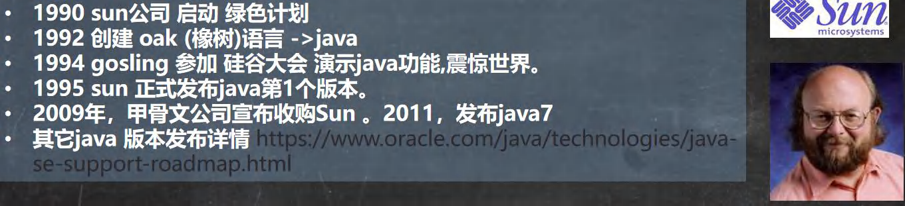
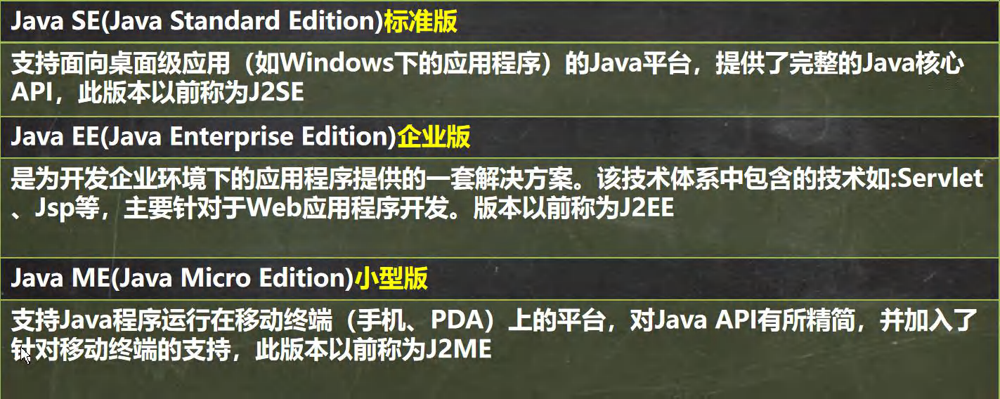
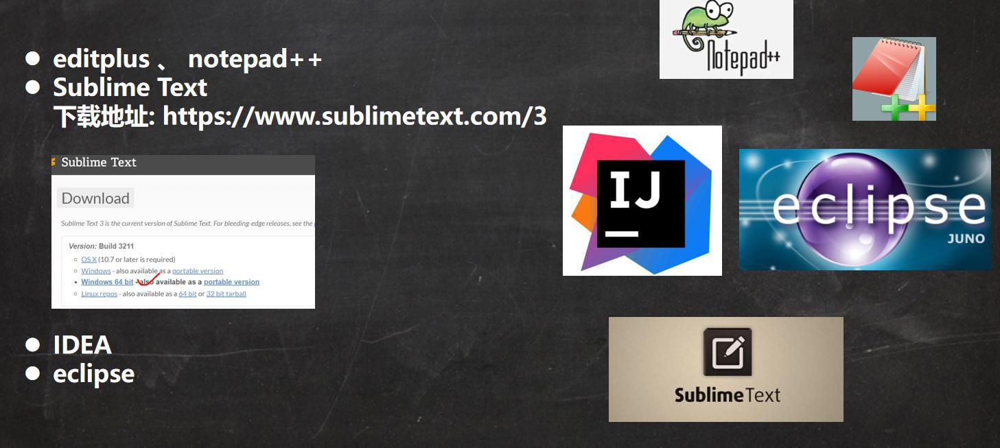
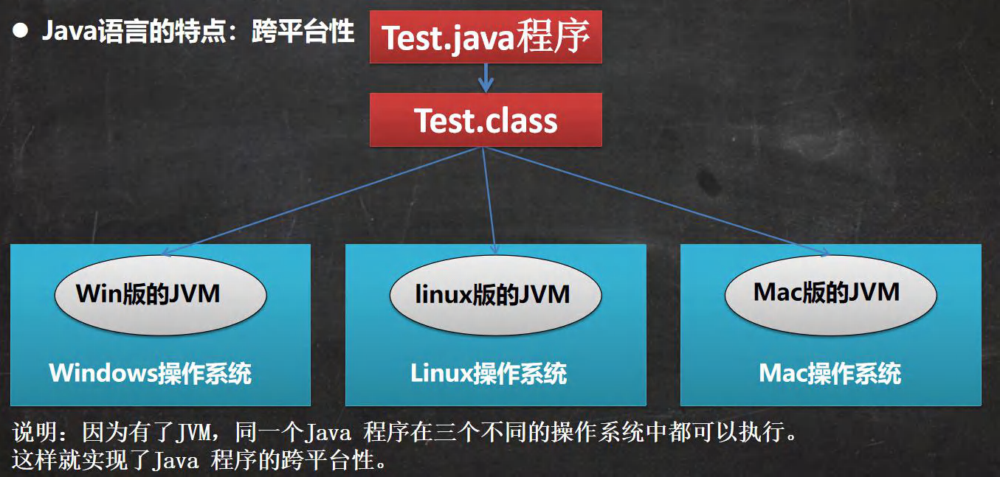
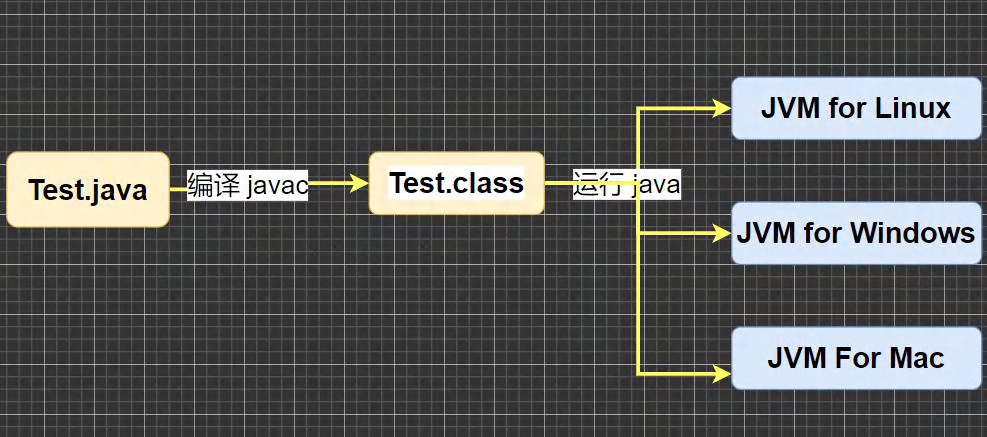
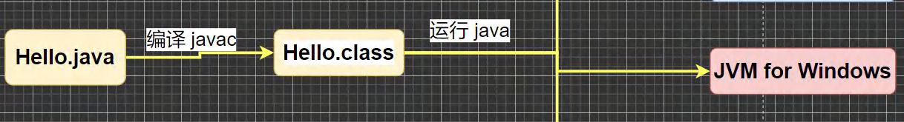
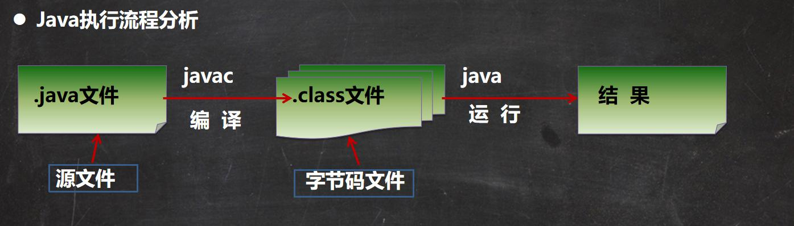
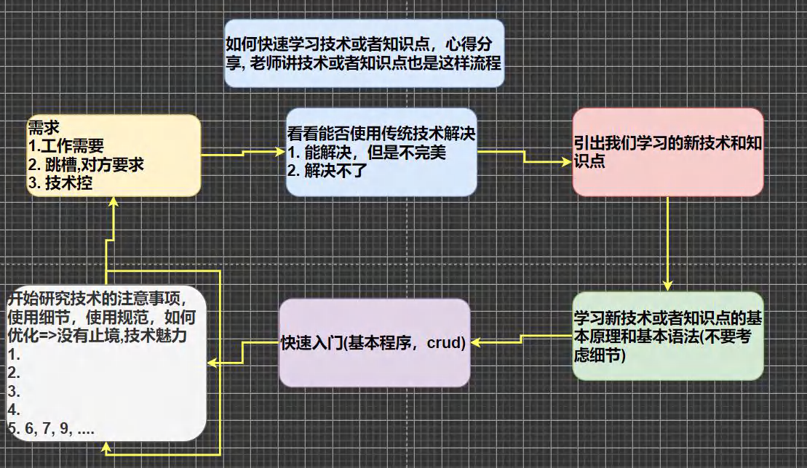
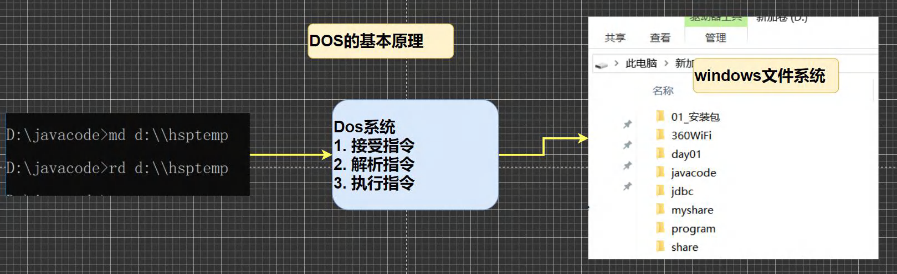
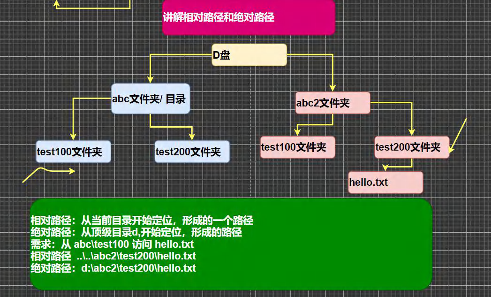

# 一、Java 概述

## 1、程序

​	程序：计算机执行某些操作或解决某个问题而 **编写的一系列有序指令的集合**

## 2、关于java

### 2.1 诞生



### 2.2 java 技术栈



### 2.3 java 重要特点

1）Java 语言是面向对象的(oop)

2）Java 语言是健壮的。Java 的强类型机制、异常处理、垃圾的自动收集等是 Java 程序健壮性的重要保证

3）Java 语言是 跨平台性的。[即: 一个编译好的.class 文件可以在多个系统下运行，这种特性称为跨平台]

4）Java 语言是解释型的[了解]

> ​	解释性语言：javascript,PHP, java 编译性语言: c / c++
>
> ​	区别是：解释性语言，编译后的代码，不能直接被机器执行,需要解释器来执行, 编译性语言, 编译后的代码, 可以直接被机器执行, c/c++

### 2.4 java开发工具



#### 2.4.1 工具的选择

1）如何选择开发工具

​	我们先选择用文本编辑器本 sublime，到大家对 java 有一定了解后，我们再使用 IDEA 和 Eclipse 开发工具。

2）这是为什么呢

​	更深刻的理解 java 技术,培养代码感。【面试时，往往程序员手写代码】

​	有利于公司面试。

### 2.5 java 运行机制

#### 2.5.1 java语言特点-跨平台性



#### 2.5.2 java核心机制-Java虚拟机

##### 1）基本介绍

① JVM 是一个虚拟的计算机，具有指令集并使用不同的存储区域。负责执行指令，管理数据、内存、寄存器，包含在 JDK 中.

② 对于不同的平台，有不同的虚拟机。

③ Java 虚拟机机制屏蔽了底层运行平台的差别，实现了 “一次编译，到处运行” [说明]

##### 2）示意图



### 2.6 JDK和JRE

#### 2.6.1 JDK 基本介绍

1）JDK 的全称(Java Development Kit Java 开发工具包)

JDK = JRE + java 的开发工具 [java, javac,javadoc,javap 等]

2）JDK 是提供给 Java 开发人员使用的，其中包含了 java 的开发工具，也包括了 JRE。所以安装了 JDK，就不用在单独
安装 JRE 了。

#### 2.6.2 JRE 基本介绍

1）JRE(Java Runtime Environment Java 运行环境)

JRE = JVM + Java 的核心类库[类]

2）包括 Java 虚拟机(JVM Java Virtual Machine)和 Java 程序所需的核心类库等，如果想要运行一个开发好的 Java 程序，计算机中只需要安装 JRE 即可。

#### 2.6.3 JDK、JRE 和 JVM 的包含关系

1）JDK = JRE + 开发工具集（例如 Javac,java 编译工具等)

2）JRE = JVM + Java SE 标准类库（java 核心类库）

3）如果只想运行开发好的 .class 文件 只需要 JRE

### 2.7 JDK 的下载和安装

官网：https://www.oracle.com/java/technologies/javase-downloads.html

1）安装步骤：傻瓜式安装，一直下一步

2）配置环境变量


**细节说明**：

- 安装路径不要有中文或者特殊符号如空格等。
- 当提示安装 JRE 时，可以选择不安装，也可以安装。

## 3、java 快速入门

### 3.1 开发步骤

1）将 Java 代码编写到扩展名为 Hello.java 的文件中。[代码说明]

2）通过 javac 命令对该 java 文件进行编译，生成 .class 文件。

3）通过 java 命令对生成的 class 文件进行运行。

### 3.2 运行原理图



### 3.3 开发

#### 1）代码

```java
//这是 java 的快速入门， 演示 java 的开发步骤
//对代码的相关说明
//1. public class Hello 表示 Hello 是一个类,是一个 public 公有的类
//2. Hello{ } 表示一个类的开始和结束
//3. public static void main(String[] args) 表示一个主方法,即我们程序的入口
//4. main() {} 表示方法的开始和结束
//5. System.out.println("hello,world~"); 表示输出"hello,world~"到屏幕
//6. ;表示语句结束
public class Hello {
//编写一个 main 方法
	public static void main(String[] args) {
		System.out.println("韩顺平教育 hello");
	}
}


//一个源文件中最多只能有一个 public 类。其它类的个数不限。[演示]
//Dog 是一个类
//编译后，每一个类，都对于一个.class
class Dog {
//一个源文件中最多只能有一个 public 类。其它类的个数不限，也可以将 main 方法写在非 public 类中，
//然后指定运行非 public 类，这样入口方法就是非 public 的 main 方法
	public static void main(String[] args) {
		System.out.println("hello, 小狗狗~");
	}
}


class Tiger {
	public static void main(String[] args) {
		System.out.println("hello, 小老虎~");
	}
}
```


#### 2）注意事项

​	在文件中有中文时，在文件设置中，设置文件编码为 GBK ，然后重新保存即可。

### 3.4 流程分析图




## 4、开发注意事项和细节

1）Java 源文件以 .java 为扩展名。源文件的基本组成部分是类 (class) ,如本类中的 Hello 类。

2）Java 应用程序的执行入口是 main() 方法。它有固定的书写格式：

```java
public static void main(String[]args){...}
```

3）Java 语言严格区分大小写。

4）Java 方法由一条条语句构成，每个语句以 ";" 结束。

5）大括号都是成对出现的，缺一不可。[习惯，先写 {} 再写代码]

6）一个源文件中最多只能有一个 public 类。其它类的个数不限。

7）如果源文件包含一个 public 类，则文件名必须按该类名命名！

8）一个源文件中最多只能有一个 public 类。其它类的个数不限，也可以将 main 方法写在非 public 类中，然后指定运行非 public 类，这样入口方法就是非 public 的 main 方法

## 5、快速掌握技术的方法



## 6、java 转义字符

### 6.1 java 常用的转义字符

1）在控制台，输入 tab 键，可以实现命令补全

2）常用转义字符：

| 转义字符 | 作用                       |
| -------- | -------------------------- |
| `\t`     | 一个制表位，实现对齐的功能 |
| `\n`     | 换行符                     |
| `\\`     | 一个 \                     |
| `\"`     | 一个 "                     |
| `\'`     | 一个 '                     |
| `\r`     | 一个回车                   |

## 7、注释

### 7.1 概述

​	用于注解说明解释程序的文字就是注释，注释提高了代码的阅读性（可读性）；注释是一个程序员必须要具有的良好编程习惯。将自己的思想通过注释先整理出来，再用代码去体现。

### 7.2 java 中的注释类型

1）单行注释 //

2）多行注释 /* */

3）文档注释 /** */

#### 7.2.1 单行注释

基本格式：

```java
格式： //注释文字
```

#### 7.2.2 多行注释

基本格式：

```java
格式： /* 注释文字 */
```

#### 7.2.3 文档注释

注释内容可以被 JDK 提供的工具 javadoc 所解析，生成一套以网页文件形式体现的该程序的说明文档，一般写在类

基本格式：

```java
格式：/**  */
```

##### 1）javadoc 应用

```doc
javadoc -d 文件夹 -xx-yy Demo.java
```


## 8、初学 java 易犯错误

1）找不到文件

解决：源文件名不存在或者写错，或者当前路径错误

2）主类名和文件名不一致

解决:声明为 public 的主类应与文件名一致，否知编译失败

3）缺少分号

解决：编译失败，注意错误出现的行数，再到源代码中指定位置改错。

4）常见错误总结

学习编程最容易犯的错是语法错误（初学者）。Java 要求你必须按照语法规则编写代码。如果你的程序违反了语法规则，例如：忘记了分号、大括号、引号，或者拼错了单词，java 编译器都会报语法错误。尝试着去看懂编译器会报告的错误信息。

举例：

1）1->l

2）0->o

3）英文符号写中文符号 ; ； "" “”

4）void->viod 拼写错误

不好修改的错误其实是 业务错误，环境错误

## 9、java 代码规范

1）类、方法的注释，要以 javadoc 的方式来写。

2）非 java Doc 的注释，往往是给代码的维护者看的，着重告述读者为什么这样写，如何修改，注意什么问题等

3）使用 tab 操作，实现缩进，默认整体向右边移动，时候用 shift + tab 整体向左移

4）运算符和 = 两边习惯性各加一个空格。比如：2 + 4 * 5 + 345 - 89

5）源文件使用 utf-8 编码

6）行宽度不要超过 80 字符

7）代码编写次行风格和行尾风格(推荐)

## 10、DOS 命令(了解)

### 10.1 概述

​	Dos： Disk Operating System 磁盘操作系统, 简单说一下 windows 的目录结构。[ 原理图]



### 10.2 相关的知识补充：相对路径，绝对路径



### 10.3 常用的 dos 命令

1）查看当前目录是有什么内容 dir

```dos
dir dir d:\abc2\test200
```

2）切换到其他盘下：盘符号 cd : change directory

```dos
案例演示：切换到 c 盘 cd /D c:
```

3）切换到当前盘的其他目录下 (使用相对路径和绝对路径演示), ..\表示上一级目录

```dos
案例演示： cd d:\abc2\test200 cd ..\..\abc2\test200
```

4）切换到上一级：

```dos
案例演示： cd ..
```

5）切换到根目录：cd \

```dos
案例演示：cd \
```

6）查看指定的目录下所有的子级目录 tree

7）清屏 cls [苍老师]

8）退出 DOS exit

9）说明: 因为小伙伴后面使用 DOS 非常少，所以对下面的几个指令，老韩给大家演示下, 大家了解即可 (md[创建目录],rd[删除目录],copy[拷贝文件],del[删除文件],echo[输入内容到文件],type,move[剪切]) => Linux。