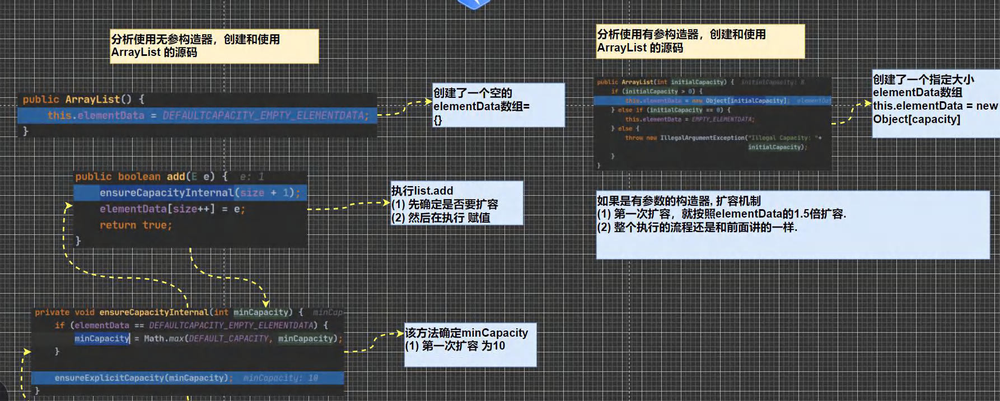
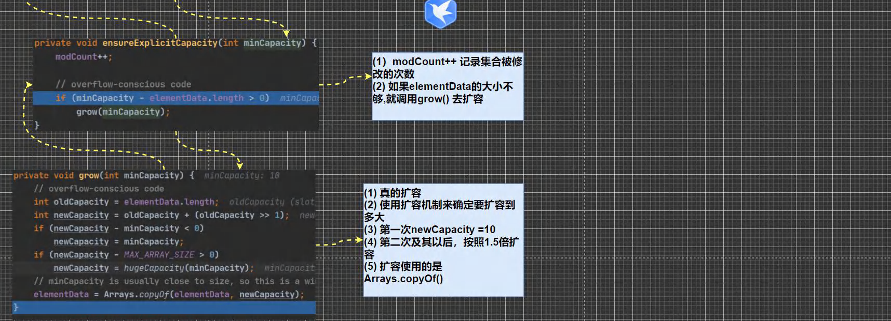
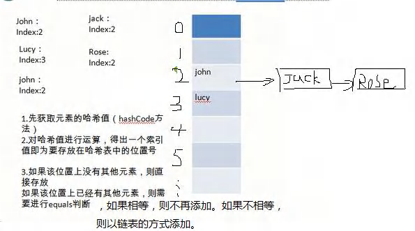
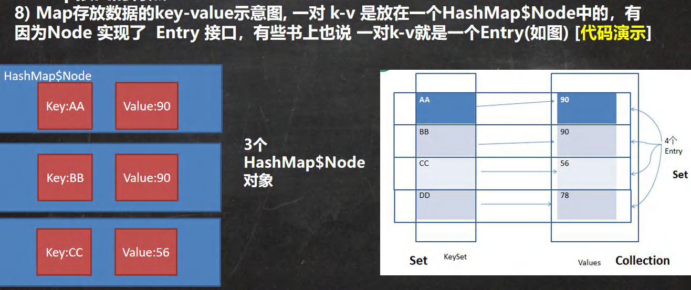
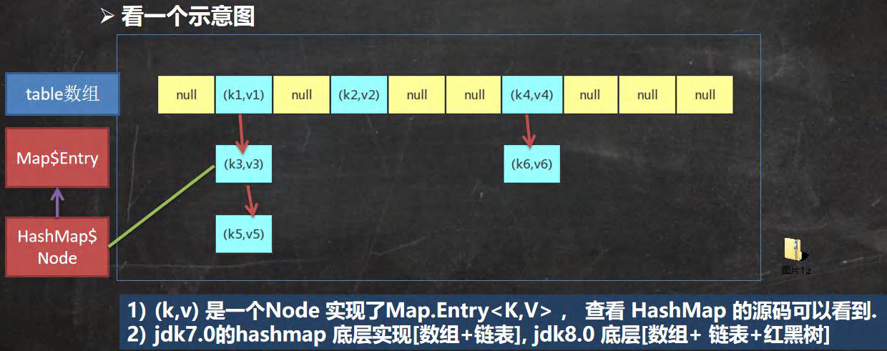

# 十、集合

概念：是一种工具类，就像是容器，储存任意数量的具有共同属性的对象

1）集合主要是两组(单列集合 , 双列集合)

2）Collection 接口有两个重要的子接口 List Set , 他们的实现子类都是单列集合

3）Map 接口的实现子类 是双列集合，存放的 K-V

4）把老师梳理的两张图记住

##  1、Collection 接口体系

### 1.1、Conllection接口体系图：


### 1.2、Collection

#### 1.2.1 Collection 接口实现类的特点

```java
public interface Collection<E> extends Iterable<E>
```

1）Collection 实现子类可以存放多个元素，每个元素可以是 Object

2）有些 Collection 的实现类，可以存放重复的元素，有些不可以

3）Collection 的实现类，有些是有序的(List),有些不是有序(Set)

4）Collection 接口没有直接的实现子类，是通过它的子接口 Set 和 List 来实现的

#### 1.2.2 常用方法：

|     方法      | 效果                                               |
| :-----------: | :------------------------------------------------- |
|     `add`     | 添加单个元素                                       |
|   `remove`    | 删除指定元素                                       |
|  `contains `  | 查找元素是否存在（找名字）                         |
|    `size`     | 获取元素个数                                       |
|   `isEmpty`   | 判断集合是否为空                                   |
|    `clear`    | 清空（集合）                                       |
|   `addAll`    | 添加多个元素（可以将实现了 List 接口的集合放进去） |
| `containsAll` | 查找多个元素是否都存在（与 addAll 同理 ）          |
|  `removeAll`  | 删除多个元素（与 addAll 同理）                     |

```java
//实现方法
对象名 . 方法名();

例：dog.add()
```

#### 1.2.3 迭代器-Iterator

1）Iterator 对象称为迭代器，主要用于遍历 Collection 集合中的元素，为 Collection 的抽象方法

2）所有实现了 Collection 接口的集合类都有一个 Iterator() 方法，用以返回一个实现了 Iterator 接口的对象，即可以返回一个迭代器。

3）Iterator 仅用于遍历集合，Iterator 本身并不存放对象。

```java
//迭代器的执行原理

Iterator Iterator = col.iterator();
//得到集合的迭代器
//上面的动作还有重置迭代器的功能
//hasNext():判断是否还有下一个元素
while(iterator.hasNext()){
//next(): 1.指针下移 将下移后集合位置上的元素返回
System.out.println(iterator.next());}
//循环结束后，迭代器不会重置，所以不能立刻调next()方法，会抛异常
//需要手动的将迭代器重置一下，才可以调用next()方法
//迭代器的重置方法为第1行，不带编译类型即可
Iterator = col.iterator();//迭代器的重置
```

 > hasNext():判断是否还有下一个元素

 > next():指针下移，将下移后集合位置上的元素返回

> 补充：在调用 iterator.next() 方法之前必须要调用 iterator.hasNext() 进行检测，若不调用，且下一条记录无效，直接调用 iterator.next() 会抛出 NoSuchElementException 异常。

#### 1.2.4 补充：增强for循环  

```java
//基本语法:
for(元素类型 元素名 ：集合名 或 数组名) {访问元素}
```

本质：简化版的迭代器

特点：除遍历集合外，还可以遍历数组

### 1.3、List

#### 1.3.1 介绍/特点

首先，List 是 Collection 的子接口

1）List 集合类中元素有序、且可重复

> 元素有序 即添加顺序和取出顺序一致

2）List 集合中的每个元素都有其对应的顺序索引，且可以根据索引序号存取容器中的元素。

> 顺序索引 即 数组下标，可以根据索引序号存取容器中的元素 即 支持索引

3）List 容器中的元素都对应一个整数型的序号记载其在容器中的位置，可以根据序号存取容器中的元素

4）List 接口的常用实现类有 ArrayList，LinkedList，Vector

#### 2.2 基本增删改查方法：

| 返回类型 | 方法名                             | 作用                                          |
| -------- | ---------------------------------- | --------------------------------------------- |
| void     | add(int index,Object ele)          | 在 index 位置插入 ele 元素                    |
| boolean  | addAll(int index,Collection eles)  | 从 index 位置开始将 eles 中的所有元素添加进来 |
|          |                                    |                                               |
| Object   | remove(int index)                  | 移除指定 index 位置的元素                     |
|          |                                    |                                               |
| Object   | set(int index,Object ele)          | 设置指定 index 位置的元素为 ele，相当于是替换 |
|          |                                    |                                               |
| Object   | get(int index)                     | 获取指定 index 位置的元素                     |
| int      | indexOf(Object obj)                | 返回 obj 在集合中首次出现的位置               |
| int      | lastIndexOf(Object obj)            | 返回 obj 在当前集合中末次出现的位置           |
| List     | subList(int fromlndex,int tolndex) | 返回从 fromIndex 到 tolndex 位置的元素        |

####   2.3 List 的三种遍历方式

1）迭代器

2）增强for

3）普通for

> 普通 for 循环的结束条件为用 size() 方法获得集合大小，然后小于集合大小即可

> 补充：实现了 List 接口的类，均能使用这3种方式遍历集合

### 1.4、ArrayList

#### 1.4.1 ArrayList 的注意事项

1）ArrayList 可以加入 null ,并且多个

2）ArrayList 是由数组来实现数据存储的

3）ArrayList 基本等同于 Vector ，除了 ArrayList 是线程不安全（执行效率高)，在多线程情况下，不建议使用 ArrayList

#### 1.4.2 ArrayList 的底层操作机制源码分析（重点，难点）

1）ArrayList 中维护了一个 Object 类型的数组 elementData。

```java
transient Object[] elementData;//transient表示瞬间，短暂的，表示该属性不会被序列化的 
```

2）当创建 ArrayList 对像时，如果使用的是无参构造器，则初始 elementData 容量为 0 ，第 1 次添加，则扩容	 elementData 为 10，如需要再次扩容，则扩容 elementData 为1.5倍。

> 总结：无参构造器，初始容量为 0 ，第一次添加，扩容为 10 ，之后按 1.5 倍扩容。

3）如果使用的是指定大小的构造器，则初始 elementData 容量为指定大小，如果需要扩容，则直接扩容 elementData 为1.5倍。

> 构造时如指定大小，则 该数组 elementData 的初始容量为指定大小，之后按 1.5 倍扩容





### 1.5、Vector

#### 1.5.1 Vector 概述

1）定义说明：

   ```java
public class Vector<E>
extends AbstractList<E>
implements List<E>,RandomAccess,Cloneable,Serializable
   ```

2）Vector 底层也是一个对象数组

```java
protected Object[] elementData;
```

3）Vector 是**线程同步**的，即线程安全，Vector 类的操作方法带有 synchronized

   ```java
public synchronized E get(int index){
if (index >= elementCount)
	throw new ArrayIndexOutOfBoundsException(index);
return elementData(index);
}
   ```

4）在开发中，需要线程同步安全时，考虑使用Vector

#### 1.5.2 Vectori 和 ArrayList 的比较

|             | 底层结构 |   版本   | 线程安全（同步）效率 |                           扩容倍数                           |
| :---------: | :------: | :------: | :------------------: | :----------------------------------------------------------: |
| `ArrayList` | 可变数组 | `jdk1.2` |    不安全，效率高    | 如果有参构造 1.5倍<br/>如果是无参<br/>1.第1次10<br/>从第2次开始安1.5扩 |
|  `Vector`   | 可变数组 | `jdk1.0` |    安全，效率不高    | 如果是无参，默认10，满后，就按2倍扩容<br/>如果指定大小，则每次直接按2倍扩 |

###   1.6、LinkedList

#### 1.6.1 概述

1）LinkedList底层实现了**双向链表**和**双端队列**特点

2）可以添加任意元素（元素可以重复），包括 null

3）线程不安全，没有实现同步

#### 1.6.2 LinkedList 的底层操作机制

1）LinkedList 底层维护了一个双向链表

2）LinkedList 中维护了两个属性 first 和 last，分别指向首节点和尾节点

3）每个节点（Node 对像）里面又维护了 prev 、next 、item 三个属性，其中通过 prev 指向前一个，通过 next 指向后一个节点，最终实现双向链表

4）所以 LinkedList 元素的添加和删除，不是通过数组完成的，相对来说效率较高。


**双向链表示例代码**：

```java
public class LinkedList01 {
	public static void main(String[] args) {
        //模拟一个简单的双向链表
        Node jack = new Node("jack");
        Node tom = new Node("tom");
        Node hsp = new Node("老韩");
        //连接三个结点，形成双向链表
        //jack -> tom -> hsp
        jack.next = tom;
        tom.next = hsp;
        //hsp -> tom -> jack
        hsp.pre = tom;
        tom.pre = jack;
        Node first = jack;//让 first 引用指向 jack,就是双向链表的头结点
        Node last = hsp; //让 last 引用指向 hsp,就是双向链表的尾结点
    	//演示，从头到尾进行遍历
        System.out.println("===从头到尾进行遍历===");
        while (true) {
            if(first == null) {
        	break;
        	}
        //输出 first 信息
        System.out.println(first);
        first = first.next;
        }
        //演示，从尾到头的遍历
        System.out.println("====从尾到头的遍历====");
        while (true) {
        	if(last == null) {
        	break;
        	}
        //输出 last 信息
        System.out.println(last);
        last = last.pre;
        }
        //演示链表的添加对象/数据，是多么的方便
        //要求，是在 tom --------- 老韩直接，插入一个对象 smith
        //1. 先创建一个 Node 结点，name 就是 smith
        Node smith = new Node("smith");
        //下面就把 smith 加入到双向链表了
        smith.next = hsp;
    	smith.pre = tom;
        hsp.pre = smith;
        tom.next = smith;
        //让 first 再次指向 jack
        first = jack;//让 first 引用指向 jack,就是双向链表的头结点
        System.out.println("===从头到尾进行遍历===");
        while (true) {
        if(first == null) {
       		break;
        	}
        //输出 first 信息
        System.out.println(first);
        first = first.next;
        }
        last = hsp; //让 last 重新指向最后一个结点
        //演示，从尾到头的遍历
        System.out.println("====从尾到头的遍历====");
        while (true) {
        if(last == null) {
        	break;
        	}
        //输出 last 信息
        System.out.println(last);
        last = last.pre;
		}
	}
}

//定义一个 Node 类，Node 对象 表示双向链表的一个结点
class Node {
	public Object item; //真正存放数据
    public Node next; //指向后一个结点
    public Node pre; //指向前一个结点
    public Node(Object name) {
		this.item = name;
		}
    public String toString() {
    	return "Node name=" + item;
    }
}
```

#### 1.6.3 LinkedList 的增删改查


```java
@SuppressWarnings({"all"})
public class LinkedListCRUD {
	public static void main(String[] args) {
        LinkedList linkedList = new LinkedList();
        linkedList.add(1);
        linkedList.add(2);
        linkedList.add(3);
        System.out.println("linkedList=" + linkedList);
        //演示一个删除结点的
        linkedList.remove(); // 这里默认删除的是第一个结点
        //linkedList.remove(2);
        System.out.println("linkedList=" + linkedList);
        //修改某个结点对象
        linkedList.set(1, 999);
        System.out.println("linkedList=" + linkedList);
        //得到某个结点对象
        //get(1) 是得到双向链表的第二个对象
        Object o = linkedList.get(1);
        System.out.println(o);//999
        //因为 LinkedList 是 实现了 List 接口, 遍历方式
        System.out.println("===LinkeList 遍历迭代器====");
        Iterator iterator = linkedList.iterator();
        while (iterator.hasNext()) {
            Object next = iterator.next();
            System.out.println("next=" + next);
        }
        System.out.println("===LinkeList 遍历增强 for====");
        for (Object o1 : linkedList) {
        	System.out.println("o1=" + o1);
        }
        System.out.println("===LinkeList 遍历普通 for====");
        for (int i = 0; i < linkedList.size(); i++) {
        	System.out.println(linkedList.get(i));
        }
        //老韩源码阅读.
        /* 1. 
        LinkedList linkedList = new LinkedList();
        public LinkedList() {}
        2. 这时 linkeList 的属性 first = null last = null
        3. 执行 添加
        public boolean add(E e) {
            linkLast(e);
            return true;
        }
        4.将新的结点，加入到双向链表的最后
        void linkLast(E e) {
            final Node<E> l = last;
            final Node<E> newNode = new Node<>(l, e, null);
            last = newNode;
            if (l == null)
            first = newNode;
        	else
        	l.next = newNode;
        	size++;
        	modCount++;
        }
        */
        /*
        老韩读源码 linkedList.remove(); // 这里默认删除的是第一个结点
        1. 执行 removeFirst
        public E remove() {
        	return removeFirst();
        }
        2. 执行
        public E removeFirst() {
        	final Node<E> f = first;
        	if (f == null)
            throw new NoSuchElementException();
            return unlinkFirst(f);
        }
        3. 执行 unlinkFirst, 将 f 指向的双向链表的第一个结点拿掉
        private E unlinkFirst(Node<E> f) {
            // assert f == first && f != null;
            final E element = f.item;
            final Node<E> next = f.next;
            f.item = null;
            f.next = null; // help GC
            first = next;
            if (next == null)
            last = null;
            else
            next.prev = null;
            size--;
            modCount++;
            return element;
        }
        */
	}
}
```

#### 1.6.4 ArrayList 和 LinkedList 的比较 

|              | 底层结构 |     增删的效率     | 改查的效率 |
| :----------: | :------: | :----------------: | :--------: |
| `ArrayList`  | 可变数组 | 较低<br/>数组扩容  |    较高    |
| `LinkedList` | 双向链表 | 较高，通过链表追加 |    较低    |

#### 1.6.5 如何选择 ArrayList 和 LinkedList

1）如果我们改查的操作多，选择 ArrayList

2）如果我们增删的操作多，选择  LinkedList

3）一般来说，在程序中，80% ~ 90% 都是查询，因此大部分情况下会选择 ArrayList

4）在一个项目中，根据业务灵活选择，也可能这样，一个模块使用的是 ArrayList，另外一个模块是 LinkedList

###   1.7、Set 接口

#### 1.7.1 Set 接口概述

1）无序（**添加和取出的顺序不一致**），没有索引(但是**取出顺序是固定的**)

2）不允许重复元素，所以最多包含一个 null

3）JDK API 中 Set 接口的实现类有 HashSet，TreeSet 等等

#### 1.7.2 常用方法

​	和 List 接口一样，Set 接口也是 Collection 的子接口，因此，常用方法和 Collection 接口一样

#### 1.7.3 遍历方式

​	同 Collection 的遍历方式一样，因为 Set 接口是 Collection 接口的子接口。

1）可以使用迭代器

2）增强 for

3）不能使用索引的方式来获取(普通 for 循环)

###   1.8、Hashset

#### 1.8.1 HashSet 概述

1）HashSet 实现了 Set 接口

2）HashSet 实际上是 HashMap

```java
	public HashSet() {
        map = new HashMap<>();
    }
```

3）可以存放 null 值，但是只能有一个 null

4）HashSet 不保证元素是有序的，取决于 hash 后，再确定索引的结果（即，不保证存放元素的顺序和取出的顺序是一致的）

5）不能有重复元素/对像。在前面 Set 接口使用已经讲过

#### 1.8.2 HashSet 底层机制说明

1）HashSet 底层是 HashMap ,HashMap 底层是（数组+链表+红黑树）

2）添加一个元素时，先得到 hash 值-会转成--->索引值

3）找到存储数据表 table，看这个索引位置是否已经存放的有元素

4）如果没有，直接加入

5）如果有，调用 equals 比较，如果相同，就放弃添加，如果不相同，则添加到最后

6）在 Java8 中，如果一条链表的元素个数超过 TREEIFY_THRESHOLD (默认是8)，并且 table 的大小 >= MIN_TREEIFY CAPACITY (默认64) 就会进行树化（红黑树）



> 底层添加元素机制：hash() + equals()


```java
public class HashSetSource {
	public static void main(String[] args) {
        HashSet hashSet = new HashSet();
        hashSet.add("java");//到此位置，第 1 次 add 分析完毕.
        hashSet.add("php");//到此位置，第 2 次 add 分析完毕
        hashSet.add("java");
        System.out.println("set=" + hashSet);
        /*
        老韩对 HashSet 的源码解读
        1. 执行 HashSet()
        public HashSet() {
        	map = new HashMap<>();
        }
        
        2. 执行 add()
        public boolean add(E e) {//e = "java"
        	return map.put(e, PRESENT)==null;//(static) PRESENT = new Object();
        }
        
		3.执行 put() , 
		该方法会执行 hash(key) 得到 key 对应的 hash 值 算法 h = key.hashCode()) ^ (h >>> 16)
		public V put(K key, V value) {//key = "java" value = PRESENT 共享
			return putVal(hash(key), key, value, false, true);
		}
		
		4.执行 putVal
		final V putVal(int hash, K key, V value, boolean onlyIfAbsent,boolean evict) {
			Node<K,V>[] tab; Node<K,V> p; int n, i; //定义了辅助变量
            //table 就是 HashMap 的一个数组，类型是 Node[]
            //if 语句表示如果当前 table 是 null, 或者 大小=0
            //就是第一次扩容，到 16 个空间.
			if ((tab = table) == null || (n = tab.length) == 0)
				n = (tab = resize()).length;
            //(1)根据 key，得到 hash 去计算该 key 应该存放到 table 表的哪个索引位置
            //并把这个位置的对象，赋给 p
            //(2)判断 p 是否为 null
            //(2.1) 如果 p 为 null, 表示还没有存放元素, 
            就创建一个 Node (key="java",value=PRESENT)
            //(2.2) 就放在该位置 tab[i] = newNode(hash, key, value, null)
            if ((p = tab[i = (n - 1) & hash]) == null)
            	tab[i] = newNode(hash, key, value, null);
            else {
            //一个开发技巧提示： 在需要局部变量(辅助变量)时候，在创建
            Node<K,V> e; K k; //
			//如果当前索引位置对应的链表的第一个元素和准备添加的 key 的 hash 值一样
            //并且满足 下面两个条件之一:
            //(1) 准备加入的 key 和 p 指向的 Node 结点的 key 是同一个对象
            //(2) p 指向的 Node 结点的 key 的 equals() 和准备加入的 key 比较后相同
            //就不能加入
            if (p.hash == hash &&((k = p.key) == key || (key != null && key.equals(k))))
           		 e = p;
            //再判断 p 是不是一颗红黑树,
            //如果是一颗红黑树，就调用 putTreeVal , 来进行添加
            else if (p instanceof TreeNode)
            e = ((TreeNode<K,V>)p).putTreeVal(this, tab, hash, key, value);
            else {//如果 table 对应索引位置，已经是一个链表, 就使用 for 循环比较
            //(1) 依次和该链表的每一个元素比较后，都不相同, 则加入到该链表的最后
            // 注意在把元素添加到链表后，立即判断 该链表是否已经达到 8 个结点
            // , 就调用 treeifyBin() 对当前这个链表进行树化(转成红黑树)
            // 注意，在转成红黑树时，要进行判断, 判断条件
            // if (tab == null || (n = tab.length) < MIN_TREEIFY_CAPACITY(64))
            // resize();
            // 如果上面条件成立，先 table 扩容.
            // 只有上面条件不成立时，才进行转成红黑树
            //(2) 依次和该链表的每一个元素比较过程中，如果有相同情况,就直接 break
            for (int binCount = 0; ; ++binCount) {
            	if ((e = p.next) == null) {
                    p.next = newNode(hash, key, value, null);
                    if (binCount >= TREEIFY_THRESHOLD(8) - 1) // -1 for 1st
                    treeifyBin(tab, hash);
                    break;
				}
				if (e.hash == hash && ((k = e.key) == key 
				|| (key != null && key.equals(k))))
					break;
                    p = e;
                    }
				}
                if (e != null) { // existing mapping for key
                V oldValue = e.value;
                if (!onlyIfAbsent || oldValue == null)
                	e.value = value;
                	afterNodeAccess(e);
                	return oldValue;
                	}
                }
                ++modCount;
                //size 就是我们每加入一个结点 Node(k,v,h,next), size++
                if (++size > threshold)
                	resize();//扩容
                	afterNodeInsertion(evict);
                	return null;
                }
                */
	}
}
```

#### 1.8.3 HashSet 扩容和红黑树机制

1）HashSet 底层是 HashMap ,第一次添加时， table 数组扩容到 16，临界值( threshold )是  16 * 加载因子( loadFactor )是 0.75 * 12

2）如果 table 数组使用到了临界值 12，就会扩容到 16 * 2 = 32，新的临界值就是 32 * 0.75 = 24,依次类推

3）在 Java8 中，如果一条链表的元素个数到达 TREEIFY_ THRESHOLD (默认是 8 )，并且 table 的大小 >= MIN_TREEIFY_CAPACITY (默认 64 )，就会进行树化（红黑树），否则仍然采用数组扩容机制

> 当我们向 hashset 增加一个元素，-> Node -> 加入 table , 就算是增加了一个 size++

```java
@SuppressWarnings({"all"})
public class HashSetIncrement {
	public static void main(String[] args) {
        /*
        HashSet 底层是 HashMap, 第一次添加时，table 数组扩容到 16，
        临界值(threshold)是 16*加载因子(loadFactor)是 0.75 = 12
        如果 table 数组使用到了临界值 12,就会扩容到 16 * 2 = 32,
        新的临界值就是 32*0.75 = 24, 依次类推
        */
		HashSet hashSet = new HashSet();
        // for(int i = 1; i <= 100; i++) {
        // hashSet.add(i);//1,2,3,4,5...100
        // }
        /*
        在 Java8 中, 如果一条链表的元素个数到达 TREEIFY_THRESHOLD(默认是 8 )，
        并且 table 的大小 >= MIN_TREEIFY_CAPACITY(默认 64),就会进行树化(红黑树),
        否则仍然采用数组扩容机制
        */
        // for(int i = 1; i <= 12; i++) {
        // hashSet.add(newA(i));//
        // }
        /*
        当我们向 hashset 增加一个元素，-> Node -> 加入 table , 就算是增加了一个 size++
        */
        for(int i = 1; i <= 7; i++) {//在 table 的某一条链表上添加了 7 个 A 对象
        	hashSet.add(newA(i));//
        }
        for(int i = 1; i <= 7; i++) {//在 table 的另外一条链表上添加了 7 个 B 对象
        	hashSet.add(new B(i));//
        }
	}
}
class B {
    private int n;
    public B(int n) {
    	this.n = n;
    }
    @Override
    public int hashCode() {
    	return 200;
    }
}
class A{
    private int n;
    publicA(int n) {
    	this.n = n;
    }
    @Override
    public int hashCode() {
        return 100;
        }
}
```

   ###    1.9、LinkedHashSet

#### 1.9.1 LinkedHashSet 概述

1）LinkedHashSet 是 HashSet 的子类

2）LinkedHashSet 底层是一个 LinkedHashMap ( HashMap 的子类), 底层维护了一个 数组 + 双向链表

3）LinkedHashSet 根据元素的 hashCode 值来决定元素的存储位置，同时使用链表维护元素的次序，这使得元素看起来是以插入顺序保存的。

4）LinkedHashSet 不允许添重复元素

#### 1.9.2 LinkedHashSet 添加元素机制说明

1）在 LinkedHastSet 中维护了一个 hash 表和双向链表( LinkedHashSet 有 head（头指向）和 tail（尾指向）)

2）每一个节点有 before （向上指向）和 after (向下指向)属性，这样可以形成双向链表

3）在添加一个元素时，先求 hash 值，再求索引，确定该元素在 hashtable 的位置，然后将添加的元素加入到双向链表（如果已经存在，不添加[原则和 HashSet 一样])

```java
    tail.next = newElement//示意代码
    newElement.pre = tail
    tail = newEelment;
```

4）这样的话，我们遍历 LinkedHashSet 也能确保插入顺序和遍历顺序一致

 ###    1.10、TreeSet

#### 1.10.1 概述/底层

1）底层是 TreeMap

2）当我们使用无参构造器，创建 TreeSet 时，仍然是无序的

3）使用 TreeSet 提供的一个构造器，可以传入一个比较器(匿名内部类，为实现 Comparator() 的内部类，并可以指定排序规则)

4）创建匿名内部类指定排序时，判断元素是否相同的决定权就由程序员来定（具体可以追溯源码）

5）因为 Set 不允许元素重复，Map 不允许 Key 重复，所以会有决定元素重复的机制，底层为 比较大小，比较大小的方式在程序员自定义与匿名内部类中，然后根据比较值决定排序，特别说明，比较值等于 0 就判断为重复元素，就不会添加，但是 Key 的元素没有改变的情况下，Value 的值会被替换掉。

> 注：不会添加的仅仅为 Key ， Value 的值还是会进行替换

```java
      TreeSet treeSet = new Treeset(new Comparator(){
      @Override
      public int compare(Object o1,Object o2){
      //下面调用String的compareTo方法进行字符串大小比较
      	return ((String)o2).compareTo((string)o1);
      //return后面就可以由程序员自己自行定义判断元素是否相等的条件，和比较大小和排序的条件
      })；
```

##    2、Map 接口体系

### 2.1 Map接口体系图：

### 2.2 Map接口

#### 2.2.1 概述：

> 这里讲的是 JDK8 的 Map 接口特点

1）Map 与 Collection 并列存在（毫无关系，是两个不同的类，也是两个不同的体系）。用于保存具有映射关系的数据： Key-Valve (双列元素)

2）Map 中的 key 和 valve 可以是任何引用类型的数据，会封装到 HashMap$Node 对象中2

3）Map 中的 key 不允许重复，原因和 HashSet 一样(如果重复，会将当前位置的元素与新的元素进行替换)

4）Map 中的 value 可以重复（即不同位置( key 不同)的 value 可以相同）

5）Map 的 key 可以为 null,value 也可以为 null,注意 key 为 null,只能有一个，value 为 null,可以多个

6）常用 String 类作为 Map 的 key (只是常用，不是不能用其他类型作 key (只要该类属于 object 类及其子类就行))

7）key 和 value 之间存在单向一对一关系，即通过指定的 key 总能找到对应的 value

8）Map 存放数据的 key-value 示意图，一对 k-v 是放在一个 HashMap$Node 中的，又因为 Node 实现了 Entry 接口，有些书上也说一对 k-v 就是一个 Entry    



#### 2.2.1 常用方法

| 返回类型 | 方法          | 作用                     |
| -------- | ------------- | ------------------------ |
|          | put()         | 添加                     |
|          | remove()      | 根据键删除映射关系       |
|          | get()         | 根据键获取值             |
|          | size()        | 获取元素个数             |
|          | isEmpty()     | 判断个数是否为0          |
|          | clear()       | 清除                     |
|          | containsKey() | 查找键是否存在(遍历方法) |
|          | keySet()      | 获取所有的键(遍历方法)   |
|          | entrySet()    | 获取所有关系k-y          |
|          | values()      | 获取所有的值             |

#### 2.2.2 遍历方法

##### 1）containsKey()和keySet()

```java
      //第一组：先取出所有的Key,通过Key取出对应的Value
      Set keyset = map.keySet();
      //(1)增强for
      System.oUt.println("---第一种方式----")；
      for (Object key : keyset){
      	System.out.println(key +"-" + map.get(key));
      }
      //(2)迭代器
      System.oUt.println("---第二种方式----")；
      Iterator iterator = keyset.iterator();
      while (iterator.hasNext()){
      	Object key = iterator.next();
      	System.out.println(key + "-" + map.get(key));
      }
```

##### 2）entrySet: 获取所有关系k-y

```java
      //第三组：通过EntrySet来获取k-v
      Set entrySet = map.entrySet();//EntrySet<Map.Entry<K,V>>
      //(1)增强for
      System.oUt.println("---使用EntrySet的for增强（第3种）--")；
      for (Object entry : entrySet){
      //将entry转成Map.Entry
      	Map.Entry m = (Map.Entry) entry;
      	System.out.println(m.getKey() + "-" + m.getValue());
      }
      //(2)迭代器
      System.oUt.println("--使用EntrySet的迭代器（第4种）--")；
      Iterator iterator3 = entrySet.iterator();
      while (iteratorhasNext()){
      	Object entry = iteratornext();
      //System.out.println(next.getclass());//HashMap$Node-实现->Map.Entry (getKey,getValue)
      //向下转型Map.Etry
          Map.Entry m = (Map.Entry) entry;
      	System.out.println(m.getKey()+ "-" + m.getValue());
      }
```

##### 3）values: 获取所有的值

```java
      //第二组：把所有的values取出
      Collection values = map.values();
      //这里可以使用所有的Collections使用的遍历方法
      //(1)增强for
      System.oUt.println("---取出所有的value增强for----");
      for (Object value : values){
      	System.out.println(value);
      }
      //(2)迭代器
      System.oUt.println("--取出所有的value迭代器----")；
      Iterator iterator2 = values.iterator();
      while (iteratorhasNext()){
      	Object value = iteratornext();
      	System.out.println(value);
      }
```

### 2.3 HashMap

#### 2.3.1 概述

1）Map 接口的常用实现类：HashMap、Hashtable 和 Properties

2）HashMap 是 Map 接口**使用频率最高**的实现类。

3）HashMap 是以 key-val 对的方式来存储数据( HashMap$Node 类型)

4）**key 不能重复**，但是**值可以重复**，**允许使用 null 键和 null 值**。

5）如果**添加相同的 key **,则会**覆盖原来的 key-val**,**等同于修改**.(**key 不会替换**，val 会替换)

6）与 HashSet 一样，**不保证映射的顺序**，因为**底层是以 hash 表的方式来存储**的

7）HashMap 没有实现同步，因此是**线程不安全**的

 ####   2.3.2 HashMap 底层机制及源码刨析

1）(k,v) 是一个 Node 实现了 Map.Entry<K,V> ,查看 HashMap 的源码可以看到。

2）JDK7.0 的 HashMap 底层实现[数组+链表]，JDK8.0 底层[数组+链表+红黑树]



3）HashMap 底层维护了 Node 类型的数组 table ,默认为 null

4）当创建对象时，将加载因子( loadfactor )初始化为 **0.75**

5）当添加 key-val 时，通过 key 的哈希值得到在 tablel 的**索引**，然后判断该索引处是否有元素，如果没有元素直接添加。如果该索引处有元素，继续判断该元素的 key 是否和准备加入的 key 相等，如果相等，则直接替换 val ，如果不相等需要判断是树结构还是链表结构，做出相应处理。如果添加时发现容量不够，则需要扩容。

6）**第1次添加**，则需要扩容 table 容量为 **16**，临界值( threshold )为 **12（ 16 * 0.75）**

7）以后再扩容，则需要扩容 table 容量为**原来的 2 倍**，**临界值为原来的 2 倍**，即 24，依次类推。

8）在 Java8 中，如果一条链表的元素个数超过 TREEIFY_THRESHOLD (默认是 8)，并且 table 的大小 >= MIN_TREEIFY_CAPACITY (默认 64 )，就会进行树化（红黑树）

**源码解读**：

```java
@SuppressWarnings({"all"})
public class HashMapSource1 {
	public static void main(String[] args) {
        HashMap map = new HashMap();
        map.put("java", 10);//ok
        map.put("php", 10);//ok
        map.put("java", 20);//替换 value
        System.out.println("map=" + map);//
        
        /*老韩解读 HashMap 的源码+图解
        
        1. 执行构造器 new HashMap()
        
        初始化加载因子 loadfactor = 0.75
        HashMap$Node[] table = null
        
        2. 执行 put 调用 hash 方法，计算 key 的 hash 值 (h = key.hashCode()) ^ (h >>> 16)
        
        public V put(K key, V value) {	//K = "java" value = 10
        	return putVal(hash(key), key, value, false, true);
        }
        
        3. 执行 putVal
        
        final V putVal(int hash, K key, V value, boolean onlyIfAbsent,boolean evict) {
            Node<K,V>[] tab; 
            Node<K,V> p; 
            int n, i;//辅助变量
        	//如果底层的 table 数组为 null, 或者 length =0 , 就扩容到 16
        	if ((tab = table) == null || (n = tab.length) == 0)
            	n = (tab = resize()).length;
            //取出 hash 值对应的 table 的索引位置的 Node, 如果为 null, 就直接把加入的 k-v
            //, 创建成一个 Node ,加入该位置即可
        	if ((p = tab[i = (n - 1) & hash]) == null)
       	 		tab[i] = newNode(hash, key, value, null);
        	else {
            	Node<K,V> e; 
            	K k;//辅助变量
        // 如果 table 的索引位置的 key 的 hash 相同和新的 key 的 hash 值相同，
        // 并 满足(table 现有的结点的 key 和准备添加的 key 是同一个对象 || equals 返回真)
        // 就认为不能加入新的 k-v
        if (p.hash == hash &&((k = p.key) == key || (key != null && key.equals(k))))
        	e = p;
        else if (p instanceof TreeNode)
        //如果当前的 table 的已有的 Node 是红黑树，就按照红黑树的方式处理
        e = ((TreeNode<K,V>)p).putTreeVal(this, tab, hash, key, value);
        else {
        //如果找到的结点，后面是链表，就循环比较
        for (int binCount = 0; ; ++binCount) {//死循环
        	if ((e = p.next) == null) {	//如果整个链表，没有和他相同,就加到该链表的最后
        		p.next = newNode(hash, key, value, null);
                //加入后，判断当前链表的个数，是否已经到 8 个，到 8 个，后
                //就调用 treeifyBin 方法进行红黑树的转换
        		if (binCount >= TREEIFY_THRESHOLD - 1) // -1 for 1st
        			treeifyBin(tab, hash);
        			break;
        		}
        if (e.hash == hash && //如果在循环比较过程中，发现有相同,就 break,就只是替换 value
        ((k = e.key) == key || (key != null && key.equals(k))))
            break;
            p = e;
        	}
        }
        if (e != null) { // existing mapping for key
        	V oldValue = e.value;
        if (!onlyIfAbsent || oldValue == null)
        	e.value = value; //替换，key 对应 value
        	afterNodeAccess(e);
        	return oldValue;
        	}
        }
        ++modCount;//每增加一个 Node ,就 size++
        if (++size > threshold[12-24-48])//如 size > 临界值，就扩容
        	resize();
        	afterNodeInsertion(evict);
        	return null;
        }
        
        5. 关于树化(转成红黑树)
        
        //如果 table 为 null ,或者大小还没有到 64，暂时不树化，而是进行扩容.
        //否则才会真正的树化 -> 剪枝
        final void treeifyBin(Node<K,V>[] tab, int hash) {
            int n, index;
            Node<K,V> e;
        	if (tab == null || (n = tab.length) < MIN_TREEIFY_CAPACITY)
        		resize();
        }
        */
    }
}
```


### 2.4 Hashtable

#### 2.4.1 概述

1）存放的元素是键值对：即 K-V

2）HashTable 的**键和值都不能为 null**，否则会抛出 NullPointerException

3）HashTable 使用方法基本上和 HashMap 一样

4）HashTable 是**线程安全**的，HashMap 是线程不安全的

> 扩容机制为：**（当前容量 * 2 ）+ 1**

 #### 2.4.2 HashMap VS HashTable

|             | 版本 | 线程安全（同步） | 效率 | 允许null键null值 |
| :---------: | :--: | :--------------: | :--: | :--------------: |
|  `HashMap`  | 1.2  |      不安全      |  高  |       可以       |
| `Hashtable` | 1.0  |       安全       | 较低 |      不可以      |

###   2.5 Properties

#### 2.5.1 概述

1）Properties 类继承自 HashTable 类并且实现了 Map 接口，也是使用一种键值对的形式来保存数据。

2）他的使用特点和 Hashtable 类似

3）Properties 还可以用于从 xxx.properties 文件中，加载数据到 Properties 类对象，并进行读取和修改

4）说明：工作后 xxx.properties 文件通常作为配置文件，这个知识点在 IO 流举例，有兴趣可先看文章

[Java 读写Properties配置文件](https://www.cnblogs.com/xudong-bupt/p/3758136.html)

#### 2.5.2 基本使用

### 2.6 TreeMap

#### 2.6.1 概述

1）TreeSet 的底层就是 TreeMap

2）使用方法与 TreeSet 一样

3）唯一与  TreeSet  不同的点在于，TreeMap 存放的是一个键值对( K--V )，而 TreeSet 存放的就只是一个 Key

> 具体可以详见 TreeSet
>
> 依据判断条件，Key 可能不会添加成功，然是，Value 的值会进行替换

#### 2.6.2 源码解析：

```java
      //源码解读：
      //1.构造器。把传入的实现了Comparator接口的匿名内部类（对象），传给给TreeMap的comparator
      public TreeMap(Comparator<?super K>comparator){
      	this.comparator = comparator;
      }
      //调用put方法
      //1第一次添加，把 k-V 封装到 Enty 对象，放入 root
      Entry<K,V> t = root;
      if (t =null){
      	compare(key,key);//type (and possibly null)check
          //这里调用方法是对集合是否为空做一个校验，并不影响后面代码的执行
          //如果集合为空，这里就会抛出异常
      	root = new Entry<>(key,valve,null);
          size = 1;
          modCount++;
      	return null;
      }
      //2以后添加
      Comparator<? super K> cpr = comparator;
      if (cpr != null){
          do{//遍历所有的key,给当前key找到适当位置
          parent = t;
          cmp = cpr.compare(key,t.key);
          //动态绑定到我们的匿名内部类的compare
          if(cmp < 0〕
          	t.left;
          else if (cmp > 0)
          	t.right;
      	eLse
      //如果遍历过程中，发现准备添加Key和当前已有的Key相等，就不添加
      	return t.setValue(value);
             //这里Key没加，但是对应的Value值被替换掉了
             }while (t != null);
```


## 3、开发中如何选择集合实现类？【！！】

​	在开发中，选择什么集合实现类，主要取决于业务操作特点，然后根据集合实现类特性进行选择，分析如下：

1）先判断存储的类型（一组对象 [单列] 或一组键值对 [双列] ）

2）一组对象 [单列] ：Collection接口

- 允许重复：List
  - 增删多：LinkedList [底层维护了一个双向链表]
  - 改查多：ArrayList [底层维护 Object 类型的可变数组]
- 不允许重复：Set
  - 无序：HashSet[底层是HashMap,维护了一个哈希表即（数组+链表+红黑树）]
  - 排序：TreeSet
  - 插入和取出顺序一致：LinkedHashSet，维护数组 + 双向链表

3）一组键值对：Map

- 键无序：HashMap [底层是：哈希表 JDK7 : 数组 + 链表，JDK8 : 数组 + 链表 + 红黑树]

- 键排序：TreeMap
- 键插入和取出顺序一致：LinkedHashMap
- 读取文件：Properties

## 4、Collections 工具类

### 4.1 概述

1）Collections 是一个操作 Set、List 和Map 等集合的工具类

2）Collections 中提供了一系列静态的方法对集合元素进行排序查询和修改等操作

### 4.2 排序操作

> 均为 static ,方法

| 方法                  | 作用                                                     |
| --------------------- | -------------------------------------------------------- |
| reverse(List)         | 反转 List 中元素的顺序                                   |
| shuffle(List)         | 对 List 集合元素进行随机排序                             |
| sort(List)            | 根据元素的自然顺序对指定 List 集合元素按升序排序         |
| sort(List,Comparator) | 根据指定的 Comparator 产生的顺序对 List 集合元素进行排序 |
| swap(List,int,int)    | 将指定 List 集合中的 i 处元素和 j 处元素进行交换         |

### 4.3 查找、替换

| 方法                                                        | 作用                                               |
| ----------------------------------------------------------- | -------------------------------------------------- |
| Object max(Collection)                                      | 根据元素的自然顺序，返回给定集合中的最大元素       |
| Object max(Collection,Comparator)                           | 根据 Comparator 指定的顺序返回给定集合中的最大元素 |
| Object min(Collection)                                      | 返回给定集合中的最小元素                           |
| Object min(Collection，Comparator)                          | 根据 Comparator 指定的顺序返回给定集合中的最小元素 |
| int frequency(Collection,Object)                            | 返回指定集合中指定元素的出现次数                   |
| void copy(List dest，List src)                              | 将 src 中的内容复制到 dest 中                      |
| boolean replaceAll(List list，Object oldVal，Object newVal) | 使用新值替换 List 对象的所有旧值                   |

**代码演示**：

```java
public class Collections_ {
	public static void main(String[] args) {
        //创建 ArrayList 集合，用于测试.
        List list = newArrayList();
        list.add("tom");
        list.add("smith");
        list.add("king");
        list.add("milan");
        list.add("tom");
        // reverse(List)：反转 List 中元素的顺序
        Collections.reverse(list);
        System.out.println("list=" + list);
        // shuffle(List)：对 List 集合元素进行随机排序
        // for (int i = 0; i < 5; i++) {
            // Collections.shuffle(list);
            // System.out.println("list=" + list);
        // }
        // sort(List)：根据元素的自然顺序对指定 List 集合元素按升序排序
        Collections.sort(list);
        System.out.println("自然排序后");
        System.out.println("list=" + list);
        // sort(List，Comparator)：根据指定的 Comparator 产生的顺序对 List 集合元素进行排序
        //我们希望按照 字符串的长度大小排序
        Collections.sort(list, new Comparator() {
            @Override
            public int compare(Object o1, Object o2) {
            //可以加入校验代码.
            return ((String) o2).length() - ((String) o1).length();
        	}
        });
        System.out.println("字符串长度大小排序=" + list);
        // swap(List，int， int)：将指定 list 集合中的 i 处元素和 j 处元素进行交换
        //比如
        Collections.swap(list, 0, 1);
        System.out.println("交换后的情况");
        System.out.println("list=" + list);
        //Object max(Collection)：根据元素的自然顺序，返回给定集合中的最大元素
        System.out.println("自然顺序最大元素=" + Collections.max(list));
        //Object max(Collection，Comparator)：根据 Comparator 指定的顺序，返回给定集合中的最大元素
        //比如，我们要返回长度最大的元素
        Object maxObject = Collections.max(list, new Comparator() {
            @Override
            public int compare(Object o1, Object o2) {
            	return ((String)o1).length() - ((String)o2).length();
            }
        });
        System.out.println("长度最大的元素=" + maxObject);
        //Object min(Collection)
        //Object min(Collection，Comparator)
        //上面的两个方法，参考 max 即可
        //int frequency(Collection，Object)：返回指定集合中指定元素的出现次数
        System.out.println("tom 出现的次数=" + Collections.frequency(list, "tom"));
        //void copy(List dest,List src)：将 src 中的内容复制到 dest 中
        ArrayList dest = newArrayList();
        //为了完成一个完整拷贝，我们需要先给 dest 赋值，大小和 list.size()一样
        for(int i = 0; i < list.size(); i++) {
        	dest.add("");
        }
        //拷贝
        Collections.copy(dest, list);
        System.out.println("dest=" + dest);
        //boolean replaceAll(List list，Object oldVal，Object newVal)：使用新值替换 List 对象的所有旧值
        //如果 list 中，有 tom 就替换成 汤姆
        Collections.replaceAll(list, "tom", "汤姆");
        System.out.println("list 替换后=" + list);
    }
}
```

```java
    ArrayList dest = new ArrayList();
    //为了完成一个完整拷贝，我们需要先给dest赋值，大小和List.size()一样
    for(int i = 0;i < list.size(); i++){
    	dest.add("");
    //或者
    //第二种方式，下面为第二种
    	dest.add(list.get(i))
    //循环并获取添加元素，可以省去拷贝的步骤
    }


    //拷贝
    	Collections.copy(dest,list);
    	System.out.println("dest=" + dest);
    //第二种方式更加的简洁，可以直接在for循环中完成，一步到位
```

> 补充：remove删除对象时，会重新计算hash值（这个hash值根据情况，程序员可以自定义，没有自定义就调用的是父类的），而且是根据最新情况计算hash值，例如：p1对象原有两个属性，id和名字，要remove时，会重新调用hash方法计算hash值，这个时候，如果你在中间将id或者名字改了，那么remove就会根据改变后的属性去计算hash值，从而得出一个新的索引位置，但是，原对象的位置并没有改变，所以，就会造成删除失败的现象（根据id和名字重写了hash方法）