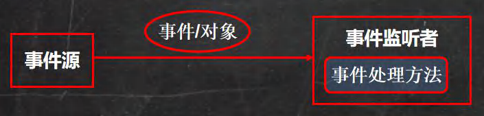

# 十二、绘图体系

## 1、坐标体系 

### 1.1 概念

​	坐标原点位于左上方，以像素为单位。JAVA坐标体系中，第一个是X坐标，表示水平方向，距离坐标原点X个像素，第二个是Y坐标，表示当前位置为垂直方向距离坐标原点Y个像素。

​						

### 1.2 像素

1）像素是一个密度单位，不是长度单位，计算机的屏幕就是像素组成的

2）分辨率800 × 600；表示计算机屏幕上的每一行由800个点组成，共有600行，整个计算机屏幕共有 480000 个像素

### 1.3 快速入门

```java
import javax.swing.*;
import java.awt.*;
/**
* 演示如何在面板上画出圆形
*/
@SuppressWarnings({"all"})
public class DrawCircle extends JFrame { //JFrame 对应窗口,可以理解成是一个画框
    //定义一个面板
    private MyPanel mp = null;
    public static void main(String[] args) {
    	new DrawCircle();
    	System.out.println("退出程序~");
    }
    
public DrawCircle() {//构造器
    	//初始化面板
        mp = new MyPanel();
        //把面板放入到窗口(画框)
        this.add(mp);
        //设置窗口的大小
        this.setSize(400, 300);
        //当点击窗口的小×，程序完全退出.
        this.setDefaultCloseOperation(JFrame.EXIT_ON_CLOSE);
        this.setVisible(true);//可以显示
    }
}


//1.先定义一个 MyPanel, 继承 JPanel 类， 画图形，就在面板上画
class MyPanel extends JPanel {
    //说明:
    //1. MyPanel 对象就是一个画板
    //2. Graphics g 把 g 理解成一支画笔
    //3. Graphics 提供了很多绘图的方法
    //Graphics g
    @Override
    public void paint(Graphics g) {//绘图方法
        super.paint(g);//调用父类的方法完成初始化.
        System.out.println("paint 方法被调用了~");
        //画出一个圆形.
        //g.drawOval(10, 10, 100, 100);
        //演示绘制不同的图形..
        //画直线 drawLine(int x1,int y1,int x2,int y2)
        //g.drawLine(10, 10, 100, 100);
        //画矩形边框 drawRect(int x, int y, int width, int height)
        //g.drawRect(10, 10, 100, 100);
        //画椭圆边框 drawOval(int x, int y, int width, int height)
        //填充矩形 fillRect(int x, int y, int width, int height)
        //设置画笔的颜色
        // g.setColor(Color.blue);
        // g.fillRect(10, 10, 100, 100);
        //填充椭圆 fillOval(int x, int y, int width, int height)
        // g.setColor(Color.red);
        // g.fillOval(10, 10, 100, 100);
        //画图片 drawImage(Image img, int x, int y, ..)
        //1. 获取图片资源, /bg.png 表示在该项目的根目录去获取 bg.png 图片资源
        // Image image = Toolkit.getDefaultToolkit().getImage(Panel.class.getResource("/bg.png"));
        // g.drawImage(image, 10, 10, 175, 221, this);
        //画字符串 drawString(String str, int x, int y)//写字
        //给画笔设置颜色和字体
        g.setColor(Color.red);
        g.setFont(new Font("隶书", Font.BOLD, 50));
        //这里设置的 100， 100， 是 "北京你好"左下角
        g.drawString("北京你好", 100, 100);
        //设置画笔的字体 setFont(Font font)
        //设置画笔的颜色 setColor(Color c)
    }
}
```

### 1.4 绘图原理

1）Component 类提供了两个和绘图相关最重要的方法：

- paint(Graphics g) 绘制组件的外观

- repaint() 刷新组件的外观。

2）当组件第一次在屏幕显示的时候，程序会自动的调用 paint() 方法来绘制组件。

在以下情况 paint() 将会被调用：

- 窗口最小化，再最大化
- 窗口的大小发生变化
- repainti 方法被调用

### 1.5 Graphics类

​	Graphics 类你可以理解就是画笔，为我们提供了各种绘制图形的方法：[参考jdk帮助文档]

| 方法                                        | 作用           |
| ------------------------------------------- | -------------- |
| drawLine(int x1,int y1,int x2,int y2)       | 画直线         |
| drawRect(int x,int y,int width,int height)  | 画矩形边框     |
| drawOval((int x,int y,int width,int height) | 画椭圆边框     |
| fillRect(int x,int y,int width,int height)  | 填充矩形       |
| fillOval(int x,int y,int width,int height)  | 填充椭圆       |
| drawlmage(image\ img,int x,int y, …)        | 画图片         |
| drawString(String str,int x,int y)          | 画字符串       |
| setFont(Font font)                          | 设置画笔的字体 |
| setColor(Color c)                           | 设置画笔的颜色 |

**案例演示**：

```java
import javax.swing.*;
import java.awt.*;
/**
* 演示如何在面板上画出圆形
*/
@SuppressWarnings({"all"})
public class DrawCircle extends JFrame { //JFrame 对应窗口,可以理解成是一个画框
    //定义一个面板
    private MyPanel mp = null;
    public static void main(String[] args) {
    new DrawCircle();
    System.out.println("退出程序~");
	}
    
    public DrawCircle() {//构造器
        //初始化面板
        mp = new MyPanel();
        //把面板放入到窗口(画框)
        this.add(mp);
        //设置窗口的大小
        this.setSize(400, 300);
        //当点击窗口的小×，程序完全退出.
        this.setDefaultCloseOperation(JFrame.EXIT_ON_CLOSE);
        this.setVisible(true);//可以显示
    }
}


//1.先定义一个 MyPanel, 继承 JPanel 类， 画图形，就在面板上画
class MyPanel extends JPanel {
    //说明:
    //1. MyPanel 对象就是一个画板
    //2. Graphics g 把 g 理解成一支画笔
    //3. Graphics 提供了很多绘图的方法
    //Graphics g
    @Override
    public void paint(Graphics g) {//绘图方法
        super.paint(g);//调用父类的方法完成初始化.
        System.out.println("paint 方法被调用了~");
        //画出一个圆形.
        //g.drawOval(10, 10, 100, 100);
        //演示绘制不同的图形..
        //画直线 drawLine(int x1,int y1,int x2,int y2)
        //g.drawLine(10, 10, 100, 100);
        //画矩形边框 drawRect(int x, int y, int width, int height)
        //g.drawRect(10, 10, 100, 100);
        //画椭圆边框 drawOval(int x, int y, int width, int height)
        //填充矩形 fillRect(int x, int y, int width, int height)
        //设置画笔的颜色
        // g.setColor(Color.blue);
        // g.fillRect(10, 10, 100, 100);
        //填充椭圆 fillOval(int x, int y, int width, int height)
        // g.setColor(Color.red);
        // g.fillOval(10, 10, 100, 100);
        //画图片 drawImage(Image img, int x, int y, ..)
        //1. 获取图片资源, /bg.png 表示在该项目的根目录去获取 bg.png 图片资源
        // Image image = Toolkit.getDefaultToolkit().getImage(Panel.class.getResource("/bg.png"));
        // g.drawImage(image, 10, 10, 175, 221, this);
        //画字符串 drawString(String str, int x, int y)//写字
        //给画笔设置颜色和字体
        g.setColor(Color.red);
        g.setFont(new Font("隶书", Font.BOLD, 50));
        //这里设置的 100， 100， 是 "北京你好"左下角
        g.drawString("北京你好", 100, 100);
        //设置画笔的字体 setFont(Font font)
        //设置画笔的颜色 setColor(Color c)
    }
}
```

## 2、Java 事件处理机制

### 2.1 基本说明：

​	java 事件处理是采取 "委派事件模型" 。当事件发生时，产生事件的对像，会把此 "信息" 传递给 "事件的监听者" 处理，这里说的 "信息" 实际上就是 java.awt.event 事件类库里某个类所创建的对象，把它称为 "事件的对象” 。

### 2.2 示意图



### 2.3 机制分析图


### 2.4 事件处理机制深入理解

1）事件源：事件源是一个产生事件的对象，比如按钮，窗口等。

2）事件：事件就是承载事件源状态改变时对象，比如当键盘事件、鼠标事件、窗口事件等等，会生成一个事件对象，该对像保存着当前事件很多信息，比如 KeyEvent 对象有含义被按下键的 Code 值。java.awt.event 包和 javax.swing.event 包中定义了各种事件类型

3）事件类型：查阅 jdk 文档

| 事件类          | 说明                                                         |
| --------------- | ------------------------------------------------------------ |
| ActionEvent     | 通常在按下按钮，或双击一个列表项或选中某个菜单时发生         |
| AdjustmentEvent | 当操作一个滚动条时发生                                       |
| ComponentEvent  | 当一个组件隐藏，移动，改变大小时发生                         |
| ContainerEvent  | 当一个组件从容器中加入或者删除时发生                         |
| FocusEvent      | 当一个组件获得或是失去焦点时发生                             |
| ltemEvent       | 当一个复选框或是列表项被选中时，当一个选择框或选择菜单被选中 |
| KeyEvent        | 当从键盘的按键被按下，松开时发生                             |
| MouseEvent      | 当鼠标被拖动，移动，点击，按下                               |
| TextEvent       | 当文本区和文本域的文本发生改变时发生                         |
| WindowEvent     | 当一个窗口激活，关闭，失效，恢复，最小化                     |

4）事件监听器接口

(1) 当事件源产生一个事件，可以传送给事件监听者处理

(2) 事件监听者实际上就是一个类，该类实现了某个事件监听器接口比如前面我们案例中的 MyPanle 就是一个类，它实现了  KeyListener 接口，它就可以作为一个事件监听者，对接受到的事件进行处理

(3) 事件监听器接口有多种，不同的事件监听器接口可以监听不同的事件，一个类可以实现多个监听接口

(4)这些接口在 java.awt.event 包和 javax.swing.event 包中定义，列出常用的事件监听器接口，查看 jdk 文档聚集了

5）案例演示：

 ```java
   //KeyListener监听接口的常用方法解释
   //当某个键按下，该方法会触发
   @Override
   public void keyPressed(KeyEvent e){}
   //当某个键释放（松开），该方法会触发
   @Override
   public void keyReleased(KeyEvent e){} 
   //有字符输出时，该方法就会触发
   @Override
   public void keyTyped(KeyEvent e){}
   
   //根据用户按下的不同键，来处理小球的移动（上下左右的键）
   //在java中，会给每一个键，分配一个值(int)
   if(e.getKeyCodef() == KeyEvent.VK_DOWN){//KeyEvent.VK_DoWN就是向下的箭头对应的code
   //VK_UP等于向上
   //VK_LEFT表示左
   //VK_RIGHT表示右
   //最后，需要在构造器中添加一个接收监听器的消息的方法
       this.addKeyListener(mp);
   //每次处理完一个事件后，让面板重绘一次，方法为：
       this.repaint();
 ```
