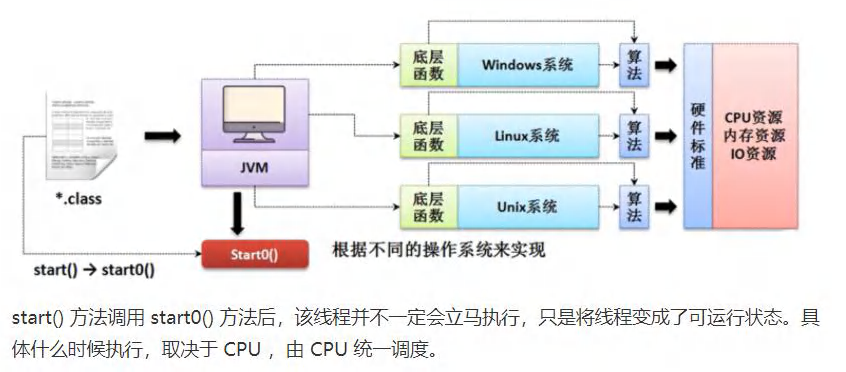

# 十三、线程

## 1、概述

### 1.1 程序是什么

​	用某种语言编写的用于完成特定任务的指令集合，简而言之，人写的代码

### 1.2 进程是什么

1）运行中的程序，系统会为这个程序分配一个内存空间

2）进程是程序的一次执行过程，或是正在运行的一个程序，有它自身的诞生，存在，消亡的过程，是一个动态的过程，注：程序是一个静态的过程

### 1.3 线程是什么

1）由进程创建（先有进程，再有线程），是进程的实体

2）一个进程可以有多个线程（线程也可以创建线程）

### 1.4 其他相关概念

#### 1.4.1 单线程

​	同一时刻，只能执行一个线程

#### 1.4.2 多线程

​	同一时刻，能执行多个线程，如QQ的聊天窗口，迅雷的下载任务

####  1.4.3 并发

​	并发执行，同一时间，单个cpu交替执行多个任务，就是并发（因为速度够快，造成一种同时的错觉，实际不是，是来回替换执行）

#### 1.4.4 并行

​	同一时刻，多个任务同时执行。（简单理解，多个任务分别交给不同的人（这里就是指cpu），在同一时间，同时去做这几件事）

## 2 线程基本使用

### 2.1 创建线程的两种方式：

1）继承 Thread 类，重写 run 方法（这里 Thread 已经实现了 Runnable 接口）

2）实现 Runnable 接口，重写 run 方法（ run 方法是这个接口里的方法）


#### 2.1.1 方式1-继承 Thread

```java
public class Thread01 {
	public static void main(String[] args) throws InterruptedException {
    //创建 Cat 对象，可以当做线程使用
    	Cat cat = new Cat();
    //老韩读源码
	/*
	(1)
    public synchronized void start() {
    	start0();
    }
	(2)
    //start0() 是本地方法，是 JVM 调用, 底层是 c/c++实现
    //真正实现多线程的效果， 是 start0(), 而不是 run
    private native void start0();
	*/
		cat.start();//启动线程-> 最终会执行 cat 的 run 方法
//cat.run();//run 方法就是一个普通的方法, 没有真正的启动一个线程，就会把 run 方法执行完毕，才向下执行
//说明: 当 main 线程启动一个子线程 Thread-0, 主线程不会阻塞, 会继续执行
//这时 主线程和子线程是交替执行..
        System.out.println("主线程继续执行" + Thread.currentThread().getName());//名字 main
        for(int i = 0; i < 60; i++) {
            System.out.println("主线程 i=" + i);
        //让主线程休眠
            Thread.sleep(1000);
		}
	}
}
    //老韩说明
    //1. 当一个类继承了 Thread 类， 该类就可以当做线程使用
    //2. 我们会重写 run 方法，写上自己的业务代码
    //3. run Thread 类 实现了 Runnable 接口的 run 方法
	/*
    @Override
    public void run() {
    	if (target != null) {
    	target.run();
    }
}
*/
        class Cat extends Thread {
        int times = 0;
        @Override
        public void run() {//重写 run 方法，写上自己的业务逻辑
        while (true) {
        //该线程每隔 1 秒。在控制台输出 “喵喵, 我是小猫咪”
        System.out.println("喵喵, 我是小猫咪" + (++times) + " 线程名=" + Thread.currentThread().getName());
            //让该线程休眠 1 秒 ctrl+alt+t
        try {
            Thread.sleep(1000);
        } catch (InterruptedException e) {
            e.printStackTrace();
        }
        if(times == 80) {
        break;//当 times 到 80, 退出 while, 这时线程也就退出..
    		}
		}
	}
}
```



#### 2.1.2 方式2-实现 Runnable 接口

**说明**：

1）java 是单继承的，在某些情况下一个类可能已经继承了某个父类，这时在用继承 Thread 类方法来创建线程显然不可能了。

2）java 设计者们提供了另外一个方式创建线程，就是通过实现 Runnable 接口来创建线程

**代码**：

```java
public class Thread02 {
	public static void main(String[] args) {
        Dog dog = new Dog();
        //dog.start(); 这里不能调用 start
        //创建了 Thread 对象，把 dog 对象(实现 Runnable),放入 Thread
        Thread thread = new Thread(dog);
        thread.start();
        // Tiger tiger = new Tiger();//实现了 Runnable
        // ThreadProxy threadProxy = new ThreadProxy(tiger);
        // threadProxy.start();
        }
	}
class Animal {}
class Tiger extendsAnimal implements Runnable {
	@Override
	public void run() {
		System.out.println("老虎嗷嗷叫....");
	}
}
/代理类 , 模拟了一个极简的 Thread 类
class ThreadProxy implements Runnable {//你可以把 Proxy 类当做 ThreadProxy
	private Runnable target = null;//属性，类型是 Runnable
	@Override
	public void run() {
		if (target != null) {
		target.run();//动态绑定（运行类型 Tiger）
	}
}
	public ThreadProxy(Runnable target) {
		this.target = target;
	}
	public void start() {
		start0();//这个方法时真正实现多线程方法
	}
	public void start0() {
		run();
	}
}
class Dog implements Runnable { //通过实现 Runnable 接口，开发线程
	int count = 0;
	@Override
	public void run() { //普通方法
		while (true) {
		System.out.println("小狗汪汪叫..hi" + (++count) + Thread.currentThread().getName());
        //休眠 1 秒
        try {
            Thread.sleep(1000);
      } catch (InterruptedException e) {
		e.printStackTrace();
		}
		if (count == 10) {
			break;
			}
		}
	}
}
```

**底层原理解释**：

1）底层实现多线程的方法为 start0，而 start 则是调用了 start0 方法，我们可以简单的认为，start0 调用了 run 方法，而 run 方法中又调用了这个对象的 this.run 方法（动态绑定，找到了对象的run方法中）

**具体实现流程**：

1）首先创建一个 Thread 对象

2）在创建对象时将需要多线程化但是没有 start 方法的对象放入其中（因为这个对象实现了 Runnable 接口，所以可以传进去）

3）然后，由这个 Thread 的对象去调用 start 方法

> 这一整个流程被称之为  静态代理模式 ，代理，叫别人去帮忙做某一件事嘛，代劳

> 补充：
>
> 1）start0 是由 JVM 机调用的，而具体什么时候能够调用，取决于 cpu 的状态，了解即可，以后再去深究
>
> 2）实现 Runnable 接口的方式更加适合多个线程共享一个资源的情况（一个对象方法，由两个或多个线程去调用），并且避免了单继承的限制

### 2.2 线程的好处

1）使主程序不会阻塞在一个地方，等该地方的方法执行完再往下执行代码，而是会新开一个栈，单独的去执行一个方法，这个时候就是主线程和子线程交替执行的

2）由进程创建一个主线程，这个主线程一般为 main 方法，再由主线程去创建一个子线程，或者多个子线程


3）一般一个进程执行完毕就会消亡，但是进程是随着最后一个线程执行完毕后的消亡而消亡

### 2.3 继承 Thread vs 实现 Runnable 的区别

1）从 java 的设计来看，通过继承 Thread 或者实现 Runnable 接口来创建线程本质上没有区别，从 JDK 帮助文档我们可以看到 Thread 类本身就实现了 Runnable 接口

2）实现 Runnable 接口方式更加适合多个线程共享一个资源的情况，并且避免了单继承的限制，建议使用 Runnable

## 3、线程终止

### 3.1 基本说明：

1）当线程完成任务后，会自动推出

2）通过一个变量，来修改线程的循环条件，达到终止线程的目的

> 还可以通过**使用变量**来控制 run 方法退出的方式停止线程，即**通知方式**

### 3.2 线程终止实操

思想：在主线程中设置一个休眠时间，时间一到，就执行循环条件修改的操作，去终止子线程的运行，或者在子线程中设置休眠时间，让其终止其衍生的线程的运行

```java
//需求：启动一个线程t,要求在main线程中去停止线程t,请编程实现.
class AThread implements Runnable{
    boolean loop = true;//步骤1：定义标记变量，默认为 true
    @Override
    public void run(){//步骤2：将 loop 作为循环条件
        while(loop){
            try{
                Thread.sleep(50);//让当前线程休眠10ms
            }catch(InterruptedException e){
                e.printStackTrace();
            }
            
            System.out.println("AThread 运行中....");
            
        }
    }
    //步骤3：提供公共的 set 方法，用于更新 loop
	public void setLoop(boolean loop){
		this.loop = loop;
    }
}

	AThread st = new AThread();
	new Thread(st).start();
	for(int i = 1; i <= 60; i++){
		try{
            Thread.sleep(50);//让 main 线程休眠50ms
        }catch(InterruptedException e){
			e.printStackTrace();
        }
	System.out.println("main线程 运行中" + i);
        if(i==30){//中断 StopThread
			st.setLoop(false);
		}
    }
```

## 4、线程常用方法

| 方法          | 作用                                                         |
| ------------- | ------------------------------------------------------------ |
| setName()     | 设置线程名称，使之与参数 name 相同                           |
| getName()     | 获取该线程的名称                                             |
| start()       | 使线程开始执行，JVM 机调用该线程的 start0 方法               |
| run()         | 调用线程对象 run 方法                                        |
| setPriority() | 更改线程的优先级                                             |
| getPriority() | 获取线程的优先级                                             |
| sleep()       | 在指定的毫秒数内让当前的线程休眠（暂停执行）                 |
| interrupt()   | 中断线程                                                     |
|               |                                                              |
| yield()       | 线程的礼让，让出cpu，让其他线程执行，但礼让的时间不确定，所以也不一定礼让成功（主要取决于cpu的资源是否紧张，如果cpu的资源丰富，两个线程都能兼顾的过来，则不一定能让成功，如果cpu资源紧张，则大概率能礼让成功） |
| join()        | 线程的插队，插队的线程一旦插队成功，则肯定先执行完插入的线程的所有任务。直到插入的线程的所有任务执行完毕后，才会执行当前的线程任务（相当于主线程阻塞在了插入线程的位置，等待插入线程执行完毕后才会继续执行） |
|               |                                                              |

### 4.1 注意细节：

1）start 底层会创建新的线程，调用 run 方法，run 方法就是一个简单的方法调用，不会启动新的线程

2）interrupt 中断线程，但并没有真正的结束线程。所以一般用于中断正在休眠的线程，其实就是  唤醒休眠的线程（中断线程的休眠嘛）

3）sleep 线程的静态方法，使当前线程休眠

4）线程的优先级的范围：

- MAX_PRIORITY 为 10，最大
- MIN_PRIOTITY 为 1，最小
- NORM_PRIORITY 为 5  这个应该是取中间值

5）线程礼让示意图：


### 4.2、用户线程和守护线程

> **以结束方式来划分**

1）用户线程：也叫工作线程，**当线程的任务执行完或以通知的方式来结束**

2）守护线程：一般是为工作线程服务的，**当所有的用户线程结束，守护线程自动结束**

3）常见的守护线程：垃圾回收机制

```java
class MyDaemonThread extends Thread{
    public void run(){
        for(;;){
            try{
                Thread.sleep(50);
            }catch(InterruptedException e){
                //TODO Auto-generated catch block
                e.printStackTrace();
            }
            System.out.println("马蓉和宋喆快乐聊天，哈哈哈~~~");
        }
        MyDaemonThread dt = new MyDaemonThread();
        //将dt设置为守护线程，当所有线程结束后，dt也就自动结束
		//如果没有设置，那么即使main线程执行完毕，dt也不退出，可以体验一下
        dt.setDaemon(true);
		dt.start();
        for(inti=1;i<=100:i++){
        Thread.sleep(50);
        System.out.println("宝强辛苦工作---" + i);
    }
}
```

> 1）守护线程的设置方式：myDaemonThread.setDaemon(true)
>
> 2）守护线程需要先设置再启动，不然会抛异常（将设置的步骤放在启动的步骤之上即可）

## 5、线程的生命周期

### 5.1 线程的几种状态

| 状态          | 表示                                                         |
| ------------- | ------------------------------------------------------------ |
| NEN           | 尚未启动的线程处于此状态。                                   |
| RUNNABLE      | 在 Java 虚拟机中执行的线程处于此状态                         |
| BLOCKED       | 被阻塞等待监视器锁定的线程处于此状态。                       |
| WAITING       | 正在等待另一个线程执行特定动作的线程处于此状态。             |
| TIMED_WAITING | 正在等待另一个线程执行动作达到指定等待时间的线程处于此状态。 |
| TERMINATED    | 已退出的线程处于此状态。                                     |


### 5.2 线程状态转换图


> 线程状态总结：
>
> ​	共分为4块  
>
> ​	创建，运行，阻塞，结束，创建有一种状态（1），运行有一种状态（2  里面细分为两种），阻塞有三种状态（3，4，5），结束有一种状态（6)

### 5.3 线程状态查询

```java
public class ThreadState_ {
	public static void main(String[] args) throws InterruptedException {
        T t = new T();
        System.out.println(t.getName() + " 状态 " + t.getState());
        t.start();
		while (Thread.State.TERMINATED != t.getState()) {
            System.out.println(t.getName() + " 状态 " + t.getState());
            Thread.sleep(500);
		}
        System.out.println(t.getName() + " 状态 " + t.getState());
	}
}

class T extends Thread {
    @Override
    public void run() {
        while (true) {
            for (int i = 0; i < 10; i++) {
                System.out.println("hi " + i);
                try {
                	Thread.sleep(1000);
                } catch (InterruptedException e) {
                	e.printStackTrace();
        		}
			}
			break;
		}
	}
}
```

## 6、Synchronized

### 6.1 关键字 Synchronized - 线程同步

1）保证敏感的数据在任何时刻，最多有一个线程访问，以保证数据的完整性（多线程会比较容易出现数据超量增减的情况）

2）即只能有一个线程对内存进行操作，在这个线程操作该内存的时候，其他线程都不能对该内存进行操作，直到该线程对内存的操作结束，其他线程才可对该内存（地址）进行操作

### 6.2 线程同步实现方法

#### 6.2.1 代码块实现同步

```java
synchronized(对象){//得到对象的锁，才能操作同步代码块
    //需要被同步代码;
}
```

#### 6.2.2 方法实现同步

```java
public synchronized void m(String name){
    //需要被同步的代码;
}
```

### 6.3 同步原理图


## 7、锁

### 7.1 互斥锁

1）一种标记，每个对象都有一个

2）用来保证任意时刻，只能有一个线程访问该对象，保证共享数据操作的完整性

3）关键字 Synchronized 是用来与对象的互斥锁联系的

4）同步的局限性：导致程序的执行效率降低

5）非静态的同步方法的锁可以是 this，也可以是其他对象（要求是同一个对象），this 表示当前对象，谁调用对象就是谁

6）静态的同步方法的锁为当前类本身（不能用 this ）

**我的理解**：

每个对象都有一个锁，而关键字的作用是调用这把锁，要实现的效果为保证只有一个线程修改数据（限制线程进入的数量），那么，不管是谁的锁（随便那个对象的锁），只要保证是同一把锁，就可以限制线程进入的数量了，这就是我对  要求为同一个对象   的理解，也就是，锁是谁的（那个对象的）无所谓，但要求锁本身必须是同一把锁（就是只能是一个对象的锁，保证锁本身的唯一性，或者说是统一性，）毕竟一把锁对应着一把钥匙，而这里的线程可以理解为是一把万能钥匙，什么锁都能开，所以只有确保锁只有一把，才能限制线程的进入数量，而不同对象的锁就代表着不只一把锁，而是多个不同的锁，这里有多个对象，就代表着有多个锁，而线程本身就是万能钥匙，任何锁都能开，所以如果不能保证锁只有一个，那么就无法限制进入的线程只有一个（线程表示：这个锁被用了，我换个锁进去不就得了嘛~~），这里其实也可以将锁理解为门，而同步现象其实就是排队，只不过这个队可能不是按顺序排的，而是乱序的。

####  7.1.1 注意事项和细节

1）同步方法如果没有使用 static 修饰，默认锁对象为 this

2）如果方法使用 static 修饰，默认锁对象是当前类

3）实现的落地步骤：

- 先分析上锁的代码
- 选择同步代码块或同步方法
- 要求多个线程的锁对象为同一个即可          

 ### 7.2 死锁：

   多个线程都占用了对方的锁资源，但不肯相让，导致了死锁。

**模拟死锁的情况**：

```java
public class DeadLock_ {
	public static void main(String[] args) {
	//模拟死锁现象
    DeadLockDemo A= new DeadLockDemo(true);
    A.setName("A 线程");
    DeadLockDemo B = new DeadLockDemo(false);
    B.setName("B 线程");
    A.start();
    B.start();
    }
}

/
class DeadLockDemo extends Thread {
    static Object o1 = new Object();// 保证多线程，共享一个对象,这里使用 static
    static Object o2 = new Object();
    boolean flag;
	public DeadLockDemo(boolean flag) {//构造器
        this.flag = flag;
	}
    @Override
    public void run() {
    //下面业务逻辑的分析
    //1. 如果 flag 为 T, 线程 A 就会先得到/持有 o1 对象锁, 然后尝试去获取 o2 对象锁
    //2. 如果线程 A 得不到 o2 对象锁，就会 Blocked
    //3. 如果 flag 为 F, 线程 B 就会先得到/持有 o2 对象锁, 然后尝试去获取 o1 对象锁
    //4. 如果线程 B 得不到 o1 对象锁，就会 Blocked
    if (flag) {
        synchronized (o1) {//对象互斥锁, 下面就是同步代码
            System.out.println(Thread.currentThread().getName() + " 进入 1");
                synchronized (o2) { // 这里获得 li 对象的监视权
                    System.out.println(Thread.currentThread().getName() + " 进入 2");
                }
   		 	}
		} else {
        synchronized (o2) {
            System.out.println(Thread.currentThread().getName() + " 进入 3");
            	synchronized (o1) { // 这里获得 li 对象的监视权
            		System.out.println(Thread.currentThread().getName() + " 进入 4");
				}
			}
		}
	}
}
```


### 7.3 锁的释放

#### 7.3.1 释放锁的操作

1）当线程的同步方法、同步代码块执行结束

2）当前线程在同步代码块、同步方法中遇到 break，return

3）当前线程在同步代码块、同步方法中出现了未处理的 Error（错误）或 Exception（异常），导致异常结束

4）当前线程在同步代码块、同步方法中执行了线程对象的 wait（）方法（没有正常完成），当前线程暂停，并释放锁

#### 7.3.2 不会释放锁

1）调用 sleep（休眠），yield（礼让）方法，暂停当前线程的执行，不会释放锁

2）其他线程调用了该线程的 suspend（）方法将该线程挂起，该线程不会释放锁