# 十四、IO流

## 1、文件

### 1.1 了解文件

​	文件是保存数据的地方、保存数据的框架，文件里面存放的是数据，注意，文件不是文件夹，文件夹里面存放的是文件，文件里面存放的是具体的数据。

### 1.2 文件流

1）流：表示一种媒介或工具，文件里的数据到内存里的过程，需要通过流的中转

2）输出流：由 内存/程序 保存到 硬盘/文件（就是专门放置数据的地方）的过程（可以理解为写入，从程序写入到文件）

3）输入流：由 文件/硬盘 到 内存/程序 的过程（可以理解为读取，从文件读取到程序）

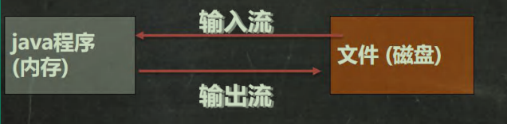


### 1.3 创建文件对象的方法

| 方法                                    | 作用                                   |
| --------------------------------------- | -------------------------------------- |
| new File(String pathname)               | 根据路径构建一个File对象               |
| new File(File parent , String child)    | 根据父目录文件（就是对象）+ 子路径构建 |
| new File(String parent , String child ) | 根据父目录 + 子路径构建                |
| createNewFile()                         | 创建新文件                             |

**方法演示案例**：

```java
public class FileCreate {
	public static void main(String[] args) {}
    //方式 1 new File(String pathname)
    @Test
    public void create01() {
    	String filePath = "e:\\news1.txt";
    	File file = new File(filePath);
		try {
			file.createNewFile();
			System.out.println("文件创建成功");
		} catch (IOException e) {
			e.printStackTrace();
		}
	}
    //方式 2 new File(File parent,String child) //根据父目录文件+子路径构建
    //e:\\news2.txt
    @Test
	public void create02() {
		File parentFile = new File("e:\\");
		String fileName = "news2.txt";
        //这里的 file 对象，在 java 程序中，只是一个对象
        //只有执行了 createNewFile 方法，才会真正的，在磁盘创建该文件
        File file = new File(parentFile, fileName);
        try {
			file.createNewFile();
			System.out.println("创建成功~");
		} catch (IOException e) {
			e.printStackTrace();
		}
	}
    
	//方式 3 new File(String parent,String child) //根据父目录+子路径构建
	@Test
	public void create03() {
	//String parentPath = "e:\\";
        String parentPath = "e:\\";
        String fileName = "news4.txt";
        File file = new File(parentPath, fileName);
        try {
        	file.createNewFile();
        	System.out.println("创建成功~");
        } catch (IOException e) {
        	e.printStackTrace();
        	}
        }
    //下面四个都是抽象类
    //InputStream
    //OutputStream
    //Reader //字符输入流
    //Writer //字符输出流
	}
}
```

### 1.4 获取文件的相关信息

| 方法    | 作用               |
| ------- | ------------------ |
| getName | 获取文件的名字 |
| getAbsolutePath | 绝对路径 |
| getParent | 父级目录 |
| length | 大小，表示文件里有多少个字节（注意，一个英文和一个中文代表的字节数量不一样） |
| exists | 是否存在这个文件 |
| isFile | 是不是一个文件 |
| isDirectory | 是不是一个目录 |

**代码演示**：

```java
public class FileInformation {
	public static void main(String[] args) {}
    
    
    //获取文件的信息
    @Test
    public void info() {
        //先创建文件对象
        File file = new File("e:\\news1.txt");
        //调用相应的方法，得到对应信息
        System.out.println("文件名字=" + file.getName());
        //getName、getAbsolutePath、getParent、length、exists、isFile、isDirectory
        System.out.println("文件绝对路径=" + file.getAbsolutePath());
        System.out.println("文件父级目录=" + file.getParent());
        System.out.println("文件大小(字节)=" + file.length());
        System.out.println("文件是否存在=" + file.exists());//T
        System.out.println("是不是一个文件=" + file.isFile());//T
        System.out.println("是不是一个目录=" + file.isDirectory());//F
	}
}
```

### 1.5 目录的操作和文件的删除：

| 方法   | 作用                                             |
| ------ | ------------------------------------------------ |
| mkdir  | 创建一级目录                                     |
| mkdirs | 创建多级目录（必须得是多级目录，否则会创建失败） |
| delete | 删除空目录或文件                                 |

## 2 IO流原理

### 2.1 概述

1）I/O 是 Input（输入）/ Output（输出）的缩写，I/O 常用于处理数据传输，如 读/写 文件，网络通讯等

2）Java 程序中，对于数据的 输入/输出 操作以 "流（ stream ）" 的方式进行

3）java.io 包下提供了各种 "流" 类和接口，用以获取不同种类的数据，并**通过方法**输入或输出数据

4）输入 input : 读取外部数据（磁盘、光盘等存储设备的数据）到程序（内存）中。

5）输出 output : 将程序（内存）数据输出到磁盘、光盘等存储设备中

 ### 2.2 流的分类

1）按操作数据单位不同分为：字节流 (8 bit) 二进制文件，字符流（按字符）文本文件

2）按数据流的流向不同分为：输入流，输出流

3）按流的角色的不同分为：节点流，处理流/包装流

> 1）效率上 字符 比 字节 效率高
>
> 2）字节用于 二进制 文件，能保证文件的无损
>
> 3）字符 常用于 文本文件

| 抽象基类 |    字节流    | 字符流 |
| :------: | :----------: | :----: |
|  输入流  | InputStream  | Reader |
|  输出流  | OutputStream | Writer |

1）Java 的 IO 流共涉及 40 多个类，实际上非常规则，都是从如上 4 个抽象基类派生的

2）由这四个类派生出来的子类名称都是以其父类名 作为子类名后缀

### 2.3 IO流常用类

#### 2.3.1 IO流体系图

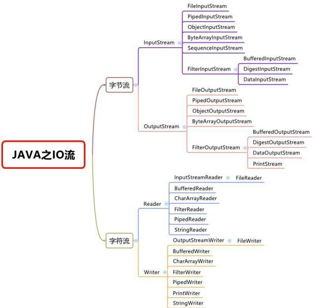

#### 2.3.2 FileInputStream

> 文件输入流 

```java
public void read(){
    //输入就是读取
    String filePath = "D:\\next.txt";
    //指定路径
    FileInputStream fileInputStream = null;
    //创建相应类的对象
    int readDate = 0;
    byte[] buf = new byte[8];
	try {
		fileInputStream = new FileInputStream(filePath);
        //调用构造器方法
        while ((readDate = fileInputStream.read()) != -1){
        //循环读取
        //读取的方法还有将数组对象放入read的括号中
        //对应的输出要用
        //System.out.print(new String(buf,0,readDate));
//这里String里面第二个0表示读取开头的位置，readDate表示读取结尾，因为之前将readDate用于接收数组的长度了，所以不会出现重复的现象
        System.out.print((char) readDate);
//将读取到的数字转成char后输出
}
	} catch (IOException e) {
		e.printStackTrace();
	}finally {
		try {
		//关闭IO流的读取，释放资源
		fileInputStream.close();
		} catch (IOException e) {
			e.printStackTrace();
		}
	}
}
```

**注意事项**：

1）这种文件输入流**默认会覆盖掉原文件**（注意是文件），想要不被覆盖（在文件结尾添加新的文件内容），需要在构造方法的 后面加个true 

```java
newFileOutputstream(filePath,true)//即这种形式
```

2）每次重新写入才会覆盖，执行中的不会覆盖

3）文件输出流 与 输入的基本步骤一样，就是调方法的时候将 输入方法 换成 输出方法

#### 2.3.3 FileOutputStream

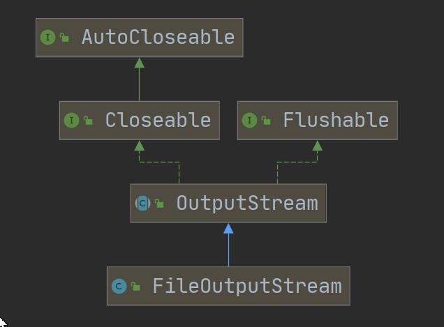


**注意事项**：

1）如果文件不存在，会创建文件(注意：前提是目录已经存在)


#### 2.3.4 FileRader

> 字符输入流

##### 1）常用方法：

| 方法                        | 作用                                                         |
| --------------------------- | ------------------------------------------------------------ |
| new FileReader(File/String) | 构造方法                                                     |
| read                        | 每次读取单个字符，返回该字符，如果到文件末尾返回 -1          |
| read(char[])                | 批量读取多个字符到数组，返回读取到的字符数，如果到文件末返回 -1 |
| new String(char[])          | 将 char[] 转换成 String                                      |
| new String(char[],off,len)  | 将 char[] 的指定部分转换成String                             |


#### 2.3.5 FileWriter

> 字符输出流

##### 1）常用方法

| 方法                             | 作用                           |
| -------------------------------- | ------------------------------ |
| new FileWriter(File/String)      | 覆盖模式，相当于流的指针在首端 |
| new FileWriter(File/String,true) | 追加模式，相当于流的指针在尾端 |
| write(int)                       | 写入单个字符                   |
| write(char[])                    | 写入指定数组                   |
| write(char[],off,len)            | 写入指定数组的指定部分         |
| write(string)                    | 写入整个字符串                 |
| write(string,off,len)            | 写入字符串的指定部分           |
|                                  |                                |
| toCharArray                      | 将 String 转换成 char[]        |

##### 2）注意事项：

​	FileWriter 使用后，必须要关闭 (close) 或刷新 (flush) ,否则写入不到指定的文件！

#### 2.3.6 字符流综合应用案例

```java
//要求：
//1) 使用 FileReader 从 story.txt 读取内容，并显示
import org.junit.jupiter.api.Test;
import java.io.FileNotFoundException;
import java.io.FileReader;
import java.io.FileWriter;
import java.io.IOException;
public class FileReader_ {
public static void main(String[] args) {}
    
    /**
	* 单个字符读取文件
	*/
	@Test
	public void readFile01() {
		String filePath = "e:\\story.txt";
		FileReader fileReader = null;
		int data = 0;
		//1. 创建 FileReader 对象
		try {
			fileReader = new FileReader(filePath);
		//循环读取 使用 read, 单个字符读取
			while ((data = fileReader.read()) != -1) {
				System.out.print((char) data);
			}
		} catch (IOException e) {
			e.printStackTrace();
		} finally {
		try {
			if (fileReader != null) {
				fileReader.close();
			}
		} catch (IOException e) {
			e.printStackTrace();
		}
	}
}
    
    
    /**
	* 字符数组读取文件
	*/
	@Test
	public void readFile02() {
        System.out.println("~~~readFile02 ~~~");
        String filePath = "e:\\story.txt";
        FileReader fileReader = null;
        int readLen = 0;
        char[] buf = new char[8];
        //1. 创建 FileReader 对象
        try {
            fileReader = new FileReader(filePath);
        //循环读取 使用 read(buf), 返回的是实际读取到的字符数
        //如果返回-1, 说明到文件结束
        	while ((readLen = fileReader.read(buf)) != -1) {
        		System.out.print(new String(buf, 0, readLen));
        	}
		} catch (IOException e) {
			e.printStackTrace();
		} finally {
			try {
				if (fileReader != null) {
					fileReader.close();
					}
			} catch (IOException e) {
				e.printStackTrace();
			}
		}
	}
}
```

```java
//2) 使用 FileWriter 将 “风雨之后，定见彩虹” 写入到 note.txt 文件中, 注意细节.
import java.io.FileWriter;
import java.io.IOException;
public class FileWriter_ {
	public static void main(String[] args) {
		String filePath = "e:\\note.txt";
        //创建 FileWriter 对象
        FileWriter fileWriter = null;
        char[] chars = {'a', 'b', 'c'};
		try {
			fileWriter = new FileWriter(filePath);//默认是覆盖写入
            // 3) write(int):写入单个字符
            fileWriter.write('H');
            // 4) write(char[]):写入指定数组
            fileWriter.write(chars);
            // 5) write(char[],off,len):写入指定数组的指定部分
            fileWriter.write("韩顺平教育".toCharArray(), 0, 3);
            // 6) write（string）：写入整个字符串
            fileWriter.write(" 你好北京~");
            fileWriter.write("风雨之后，定见彩虹");
            // 7) write(string,off,len):写入字符串的指定部分
            fileWriter.write("上海天津", 0, 2);
            //在数据量大的情况下，可以使用循环操作.
		} catch (IOException e) {
            e.printStackTrace();
        } finally {
        //对应 FileWriter , 一定要关闭流，或者 flush 才能真正的把数据写入到文件
        //老韩看源码就知道原因.
    /*
    看看代码
    private void writeBytes() throws IOException {
        this.bb.flip();
        int var1 = this.bb.limit();
        int var2 = this.bb.position();
        assert var2 <= var1;
        int var3 = var2 <= var1 ? var1 - var2 : 0;
        if (var3 > 0) {
            if (this.ch != null) {
                assert this.ch.write(this.bb) == var3 : var3;
            } else {
        this.out.write(this.bb.array(), this.bb.arrayOffset() + var2, var3);
    	}
    }
    	this.bb.clear();
    }
    */
        try {
        //fileWriter.flush();
        //关闭文件流，等价 flush() + 关闭
            fileWriter.close();
        } catch (IOException e) {
            e.printStackTrace();
		}
	}
		System.out.println("程序结束...");
	}
}
```


## 3、节点流和处理流

### 3.1 节点流

#### 1）基本介绍

​	节点流可以从一个特定的数据源读写数据，如 FileReader、FileWriter

​	针对一个特定的数据源（就是特定文件）读写数据


### 3.2 处理流

#### 1）基本介绍

​	处理流（也叫**包装流**）是 “连接” 在已存在的流（节点流 或 处理流）之上，为程序提供更为强大的读写功能，也更加灵活，如 BufferedReader、BufferedWriter

> ​	其实就是对已有的节点流放入一个超类属性，这个超类属性可以为任意子类对象，而这个子类对象就可以是各种不同的节点流，这些节点流可以分别处理各种不同的情况，用于针对各种不同的数据源（文件），这样能扩大包装流的使用范围，使用处理流，一般会要求传一个节点流的对象，这个就代表了包装流的灵活性

### 3.3 节点流和处理流一览图

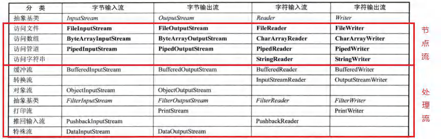

### 3.4 节点流和处理流的区别和联系

1）节点流是 底层流/低级流，直接跟数据源相接。

2）处理流（包装流）包装节点流，既可以消除不同节点流的实现差异，也可以提供更方便的方法来完成输入输出。

3）处理流（也叫包装流）对节点流进行包装，使用了修饰器设计模式，不会直接与数据源相连

### 3.5 处理流的功能主要体现在以下两个方面

1）性能的提高：主要以增加缓冲的方式来提高输入输出的效率。

2）操作的便捷：处理流可能提供了一系列便捷的方法来一次输入输出大批量的数据，使用更加灵活方便

### 3.6 处理流：BufferedReader 和 BufferedWriter

1）BufferedReader 和 BufferedWriter 属于字符流，是按照字符来读取数据的

2）关闭时，只需要关闭外层流即可

3）**应用案例：**

```java
//BufferedReader 

public class BufferedReader_ {
	public static void main(String[] args) throws Exception {
        String filePath = "e:\\a.java";
        //创建 bufferedReader
        BufferedReader bufferedReader = new BufferedReader(new FileReader(filePath));
        //读取
        String line; //按行读取, 效率高
        //说明
        //1. bufferedReader.readLine() 是按行读取文件
        //2. 当返回 null 时，表示文件读取完毕
        while ((line = bufferedReader.readLine()) != null) {
        	System.out.println(line);
        }
        //关闭流, 这里注意，只需要关闭 BufferedReader ，因为底层会自动的去关闭 节点流
        //FileReader。
    /*
public void close() throws IOException {
    synchronized (lock) {
    	if (in == null)
    		return;
    	try {
    		in.close();//in 就是我们传入的 new FileReader(filePath), 关闭了.
    	} finally {
            in = null;
            cb = null;
    	}
    }
}
*/
        bufferedReader.close();
	}
}
```

```java
//BufferedWriter
public class BufferedWriter_ {
	public static void main(String[] args) throws IOException {
        String filePath = "e:\\ok.txt";
        //创建 BufferedWriter
        //说明:
        //1. new FileWriter(filePath, true) 表示以追加的方式写入
        //2. new FileWriter(filePath) , 表示以覆盖的方式写入
        BufferedWriter bufferedWriter = new BufferedWriter(new FileWriter(filePath));
        bufferedWriter.write("hello, 韩顺平教育!");
        bufferedWriter.newLine();//插入一个和系统相关的换行
        bufferedWriter.write("hello2, 韩顺平教育!");
        bufferedWriter.newLine();
        bufferedWriter.write("hello3, 韩顺平教育!");
        bufferedWriter.newLine();
        //说明：关闭外层流即可 ， 传入的 new FileWriter(filePath) ,会在底层关闭
        bufferedWriter.close();
	}
}
```

```java
//综合案例
public class BufferedCopy_ {
	public static void main(String[] args) {
    //老韩说明
    //1. BufferedReader 和 BufferedWriter 是安装字符操作
    //2. 不要去操作 二进制文件[声音，视频，doc, pdf ], 可能造成文件损坏
    //BufferedInputStream
    //BufferedOutputStream
    String srcFilePath = "e:\\a.java";
    String destFilePath = "e:\\a2.java";
    // String srcFilePath = "e:\\0245_韩顺平零基础学 Java_引出 this.avi";
    // String destFilePath = "e:\\a2 韩顺平.avi";
    BufferedReader br = null;
    BufferedWriter bw = null;
    String line;
    try {
        br = new BufferedReader(new FileReader(srcFilePath));
        bw = new BufferedWriter(new FileWriter(destFilePath));
        //说明: readLine 读取一行内容，但是没有换行
        while ((line = br.readLine()) != null) {
            //每读取一行，就写入
            bw.write(line);
        	//插入一个换行
            bw.newLine();
    	}
    System.out.println("拷贝完毕...");
    } catch (IOException e) {
    	e.printStackTrace();
    } finally {
    //关闭流
    try {
    if(br != null) {
    	br.close();
    }
    if(bw != null) {
    	bw.close();
    	}
    } catch (IOException e) {
    	e.printStackTrace();
    		}
    	}
    }
}
```

### 3.7 处理流-BufferedInputStream 和 BufferedOutputStream

#### 3.7.1 BufferedInputStream 基本介绍

​	BufferedInputStream 是字节流，在创建 BufferedInputStream 时，会创建一个内部缓冲区数组。

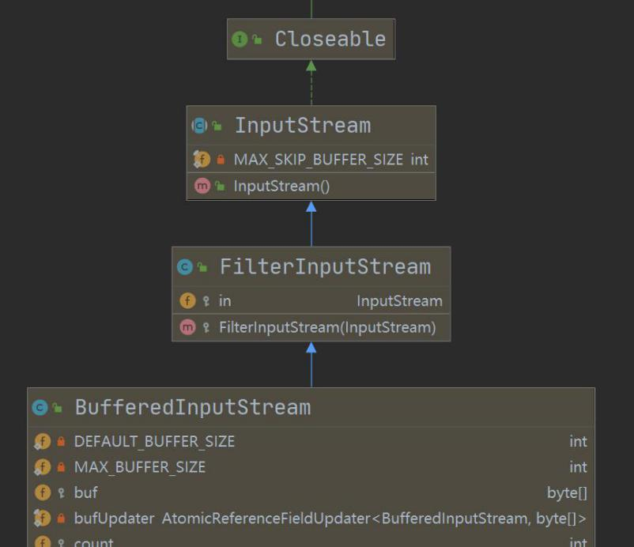

#### 3.7.2 BufferedOutputStream 基本介绍

​	BufferedOutputStream 是字节流，实现缓冲的输出流，可以将多个字节写入底层输出流中，而不必对每次字节写入调用底层系统

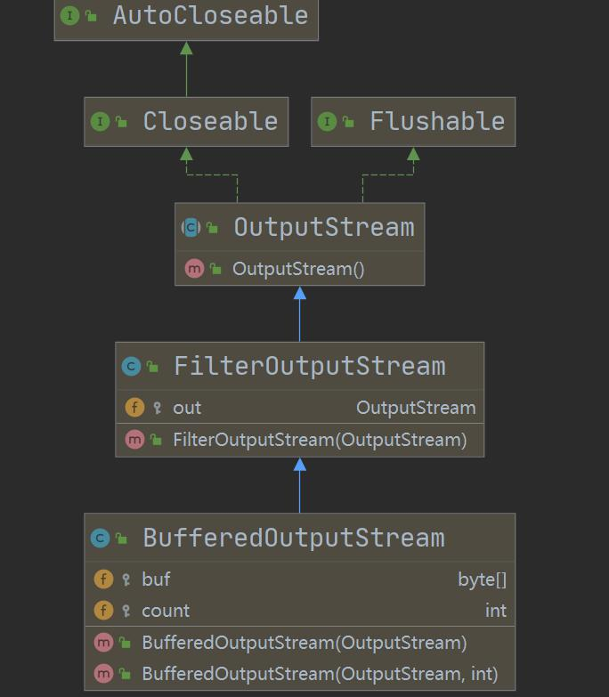

#### 3.7.3 应用案例

```java
/**
* 演示使用 BufferedOutputStream 和 BufferedInputStream 使用
* 使用他们，可以完成二进制文件拷贝.
* 思考：字节流可以操作二进制文件，可以操作文本文件吗？当然可以
*/
public class BufferedCopy02 {
    public static void main(String[] args) {
        // String srcFilePath = "e:\\Koala.jpg";
        // String destFilePath = "e:\\hsp.jpg";
        // String srcFilePath = "e:\\0245_韩顺平零基础学 Java_引出 this.avi";
        // String destFilePath = "e:\\hsp.avi";
        String srcFilePath = "e:\\a.java";
        String destFilePath = "e:\\a3.java";
        //创建 BufferedOutputStream 对象 BufferedInputStream 对象
        BufferedInputStream bis = null;
        BufferedOutputStream bos = null;
        try {
            //因为 FileInputStream 是 InputStream 子类
            bis = new BufferedInputStream(new FileInputStream(srcFilePath));
            bos = new BufferedOutputStream(new FileOutputStream(destFilePath));
            //循环的读取文件，并写入到 destFilePath
            byte[] buff = new byte[1024];
            int readLen = 0;
            //当返回 -1 时，就表示文件读取完毕
            while ((readLen = bis.read(buff)) != -1) {
                bos.write(buff, 0, readLen);
			}
		System.out.println("文件拷贝完毕~~~");
		} catch (IOException e) {
			e.printStackTrace();
		} finally {
        //关闭流 , 关闭外层的处理流即可，底层会去关闭节点流
		try {
			if(bis != null) {
            	bis.close();
            }
            if(bos != null) {
            	bos.close();
            }
		} catch (IOException e) {
			e.printStackTrace();
			}
		}
	}
}
```


### 3.8 对象流：ObjectInputStream 和 ObjetOutputStrean

#### 3.8.1 序列化和反序列化

1）序列化就是在保存数据时，保存数据的值和数据类型

2）反序列化就是在恢复数据时，恢复数据的值和数据类型

3）需要让某个对象支持序列化机制，则必须让其类是可序列化的，为了让某个类是可序列化的，该类必须实现如下两个接口之一

- Serializable  //这是一个标记接口，没有方法
- Externalizable//该接口有方法需要实现，因此我们一般实现上面的 Serializable 接口

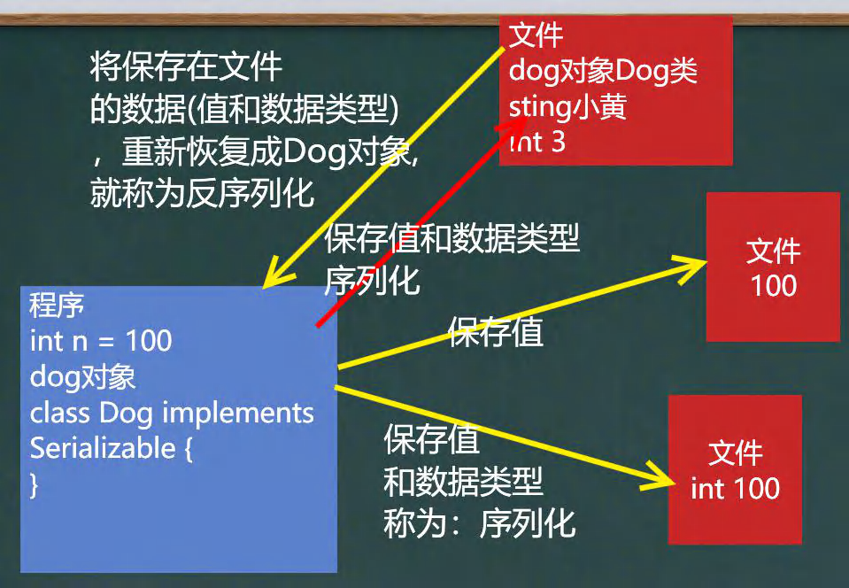

#### 3.8.2 对象流介绍

1）仍是一个处理流，模式上仍旧用的是修饰者模式

2）功能：提供了对基本类型或对象类型的序列化和反序列化的方法

3）ObjectOutputStream 提供 序列化 功能（输出是序列化）

4）ObjectlnputStream 提供 反序列化 功能（输入时反序列化）

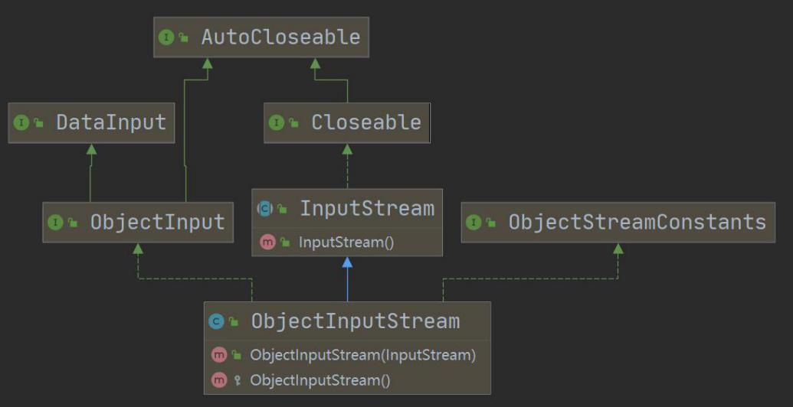

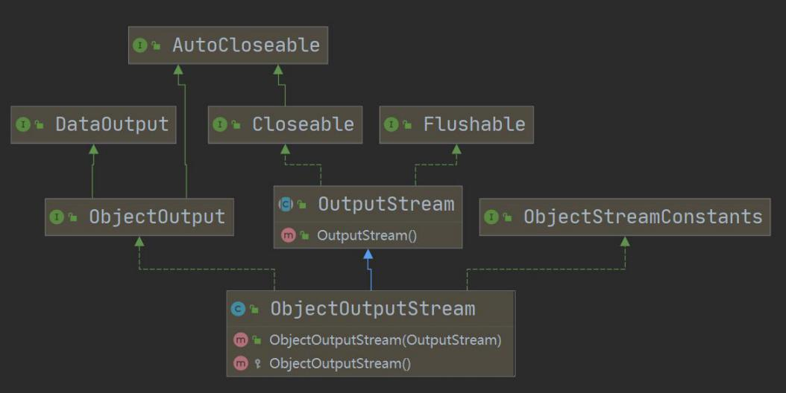

####   3.8.3 应用案例

```java
//1、数据的序列化
public class ObjectOutStream_ {
	public static void main(String[] args) throws Exception {
        //序列化后，保存的文件格式，不是存文本，而是按照他的格式来保存
        String filePath = "e:\\data.dat";
        ObjectOutputStream oos = new ObjectOutputStream(new FileOutputStream(filePath));
        //序列化数据到 e:\data.dat
        oos.writeInt(100);// int -> Integer (实现了 Serializable)
        oos.writeBoolean(true);// boolean -> Boolean (实现了 Serializable)
        oos.writeChar('a');// char -> Character (实现了 Serializable)
        oos.writeDouble(9.5);// double -> Double (实现了 Serializable)
        oos.writeUTF("韩顺平教育");//String
        //保存一个 dog 对象
        oos.writeObject(new Dog("旺财", 10, "日本", "白色"));
        oos.close();
        System.out.println("数据保存完毕(序列化形式)");
	}
}
```

```java
//2、数据的反序列化
// 1.创建流对象
ObjectInputStream ois = new ObjectInputStream(new FileInputStream("src\\data.dat"));
// 2.读取， 注意顺序
System.out.println(ois.readInt());
System.out.println(ois.readBoolean());
System.out.println(ois.readChar());
System.out.println(ois.readDouble());
System.out.println(ois.readUTF());
System.out.println(ois.readObject());
System.out.println(ois.readObject());
System.out.println(ois.readObject());
// 3.关闭
ois.close();
System.out.println("以反序列化的方式读取(恢复)ok~");
```

#### 3.8.4 细节

1）读写顺序要一致

2）要求序列化或反序列化对象，需要实现 Serializable

3）序列化的类中建议添加 SerialVersionUID ,为了提高版本的兼容性

4）序列化对象时，默认将里面所有属性都进行序列化，但除了 statici 或 transient 修饰的成员

5）序列化对象时，要求里面**属性的类型**也需要实现序列化接口

6）序列化具备可继承性，也就是如果某类已经实现了序列化，则它的所有子类也已经默认实现了序列化

7）序列化后，保存的文件格式，不是存文本，而是按照他的格式来保存，所以文件的后缀可以随意的给

8）反序列化时，读取的顺序需要和保存数据（序列化）的顺序一致，如果顺序不一致，会报错

9）反序列化之后，如果我们希望调用一个反序列化之后的对象，那么我们需要向下转型，因为反序列化之后的对象是使用Object 来接收的，并且还要导入该反序列化之后的类所在的包，让这个类的方法可以使用，导包的时候，需要保证该类的访问修饰符是共有的，可以访问的。

  

### 3.9 标准输入流和标准输出流：

|                    |    类型     | 默认设备 |
| :----------------: | :---------: | :------: |
| System.in标准输入  | InputStream |   键盘   |
| System.out标准输出 | PrintStream |  显示器  |


### 3.10 转换流-InputStreamReader 和 OutputStreamWriter

> 解决文件乱码问题

#### 3.10.1 基本介绍

1）InputStreamReader ：Reader 的子类，可以将 InputStream (字节流) 包装成 Reader (字符流)

2）OutputStreamWriter ：Writer 的子类，实现将 OutputStream (字节流) 包装成 Writer (字符流)

3）当处理纯文本数据时，使用字符流效率更高，并且可以有效解决中文问题，所以建议将字节流转换成字符流

4）可以在使用时指定编码格式（比如 utf-8,gbk,gb2312,ISO8859-1 等）

> 补充：能够转换的原因是，这种转换流会专门提供一种指定字节码的方法，写在需要转换的字节流的对象的后面（需要双引号包起来），能保证编译器读取序列化文件时不乱码。

#### 3.10.2 案例演示

```java
//将字节流 FilelnputStream 包装成（转换成）字符流 InputStreamReader ,对文件进行读取（按照utf-8/gbk 格式），进而在包装成 BufferedReader
import java.io.*;
/**
* 演示使用 InputStreamReader 转换流解决中文乱码问题
* 将字节流 FileInputStream 转成字符流 InputStreamReader, 指定编码 gbk/utf-8
*/
public class InputStreamReader_ {
	public static void main(String[] args) throws IOException {
		String filePath = "e:\\a.txt";
        //解读
        //1. 把 FileInputStream 转成 InputStreamReader
        //2. 指定编码 gbk
        //InputStreamReader isr = new InputStreamReader(new FileInputStream(filePath), "gbk");
        //3. 把 InputStreamReader 传入 BufferedReader
        //BufferedReader br = new BufferedReader(isr);
        //将 2 和 3 合在一起
        BufferedReader br = new BufferedReader(new InputStreamReader(
        new FileInputStream(filePath), "gbk"));
        //4. 读取
        String s = br.readLine();
        System.out.println("读取内容=" + s);
        //5. 关闭外层流
        br.close();
	}
}
```

```java
//编程将字节流 FileOutputStream 包装成（转换成）字符流 OutputStreamWriter ,对文件进行写入（按照 gbk 格式，可以指定其他，比如 utf-8 )

// 1.创建流对象
OutputStreamWriter osw = new OutputStreamWriter(new FileOutputStream("d:\\a.txt"), "gbk");
// 2.写入
osw.write("hello,韩顺平教育~");
// 3.关闭
osw.close();
System.out.println("保存成功~");
```


### 3.11 打印流-PrintStream 和 PrintWriter

1）打印流只有输出流，没有输入流

2）使用方法与之前的没有什么区别

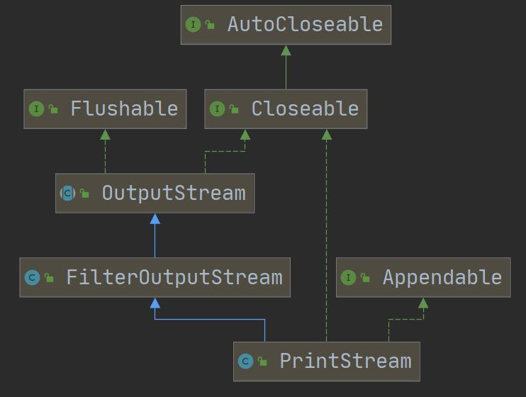

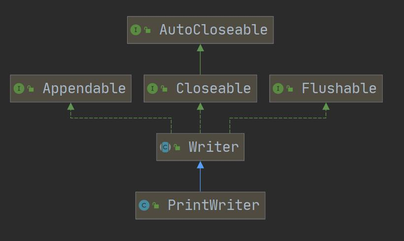


#### 3.11.1 案例演示

```java
import java.io.FileWriter;
import java.io.IOException;
import java.io.PrintWriter;
/**
* 演示 PrintStream （字节打印流/输出流）
*/
public class PrintStream_ {
	public static void main(String[] args) throws IOException {
        PrintStream out = System.out;
        //在默认情况下，PrintStream 输出数据的位置是 标准输出，即显示器
	/*
	public void print(String s) {
		if (s == null) {
			s = "null";
		}
		write(s);
	}
	*/
	out.print("john, hello");
	//因为 print 底层使用的是 write , 所以我们可以直接调用 write 进行打印/输出
    out.write("韩顺平,你好".getBytes());
    out.close();
    //我们可以去修改打印流输出的位置/设备
    //1. 输出修改成到 "e:\\f1.txt"
    //2. "hello, 韩顺平教育~" 就会输出到 e:\f1.txt
    //3. public static void setOut(PrintStream out) {
    // checkIO();
    // setOut0(out); // native 方法，修改了 out
    // }
    System.setOut(new PrintStream("e:\\f1.txt"));
    System.out.println("hello, 韩顺平教育~");
	}
}
    printWriter.print("hi, 北京你好~~~~");
    printWriter.close();//flush + 关闭流, 才会将数据写入到文件..
	}
}
```


## 4、Properties

### 4.1 基本介绍：

1）Hashtable的子类

2）专门用来读写配置文件的集合类

> 配置文件的格式：
>
> 键=值
>
> 注意：键值对不需要有空格，值不需要用引号引起来。默认类型是 String

### 4.2 常见方法：

| 方法                   | 作用                                                         |
| ---------------------- | ------------------------------------------------------------ |
| load                   | 加载配置文件的键值对到 Properties 对象                       |
| list                   | 将数据显示到指定设备                                         |
| getProperty(key)       | 根据键获取值                                                 |
| setProperty(key,value) | 设置键值对到 Properties 对象（可以往里面加新东西）           |
| store                  | 将 Propertiesl 中的键值对存储到配置文件，在 idea 中，保存信息到配置文件,如果含有中文，会存储为 unicode 码 |

### 4.3 应用案例

```java
//1.使用Properties类完成对mysql-.properties的读取，看老师代码演示
//2.使用Properties类添加key-val到新文件mysql22.properties中
//3.使用Properties类完成对mysql22.properties的读取，并修改某个key-val

import java.io.FileNotFoundException;
import java.io.FileReader;
import java.io.IOException;
import java.util.Properties;

public class Properties02 {
	public static void main(String[] args) throws IOException {
		//使用 Properties 类来读取 mysql.properties 文件
		//1. 创建 Properties 对象
        Properties properties = new Properties();
        //2. 加载指定配置文件
        properties.load(new FileReader("src\\mysql.properties"));
        //3. 把 k-v 显示控制台
        properties.list(System.out);
        //4. 根据 key 获取对应的值
        String user = properties.getProperty("user");
        String pwd = properties.getProperty("pwd");
        System.out.println("用户名=" + user);
        System.out.println("密码是=" + pwd);
	}
}


import java.io.FileNotFoundException;
import java.io.FileOutputStream;
import java.io.IOException;
import java.util.Properties;

public class Properties03 {
	public static void main(String[] args) throws IOException {
        //使用 Properties 类来创建 配置文件, 修改配置文件内容
        Properties properties = new Properties();
        //创建
        //1.如果该文件没有 key 就是创建
        //2.如果该文件有 key ,就是修改
		/*
        Properties 父类是 Hashtable ， 底层就是 Hashtable 核心方法
        public synchronized V put(K key, V value) {
        // Make sure the value is not null
        if (value == null) {
            throw new NullPointerException();
		}
        // Makes sure the key is not already in the hashtable.
        Entry<?,?> tab[] = table;
        int hash = key.hashCode();
        int index = (hash & 0x7FFFFFFF) % tab.length;
        @SuppressWarnings("unchecked")
        Entry<K,V> entry = (Entry<K,V>)tab[index];
        for(; entry != null ; entry = entry.next) {
            if ((entry.hash == hash) && entry.key.equals(key)) {
        		V old = entry.value;
        		entry.value = value;//如果 key 存在，就替换
        		return old;
   	 		}
		}
		addEntry(hash, key, value, index);//如果是新 k, 就 addEntry
		return null;
	}
	*/
        properties.setProperty("charset", "utf8");
        properties.setProperty("user", "汤姆");//注意保存时，是中文的 unicode 码值
        properties.setProperty("pwd", "888888");
        //将 k-v 存储文件中即可
        properties.store(new FileOutputStream("src\\mysql2.properties"), null);
        System.out.println("保存配置文件成功~");
	}
}
```

