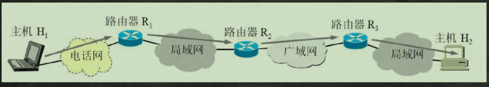
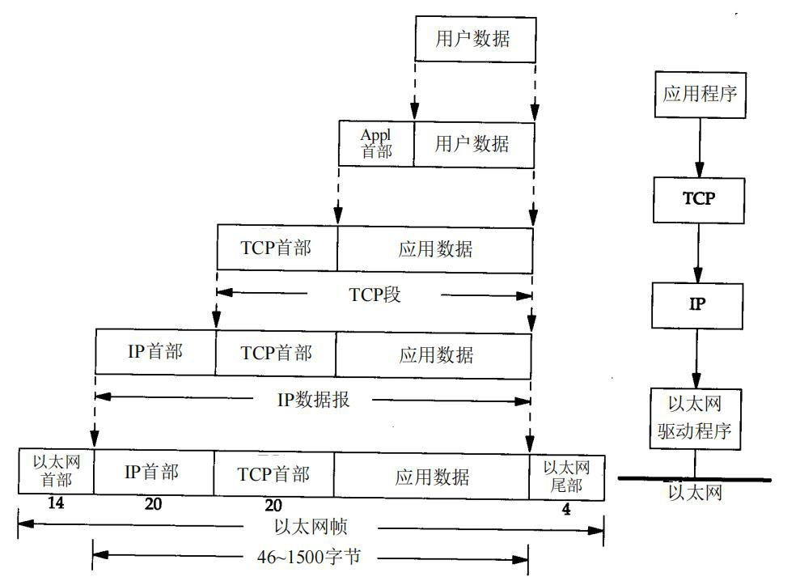
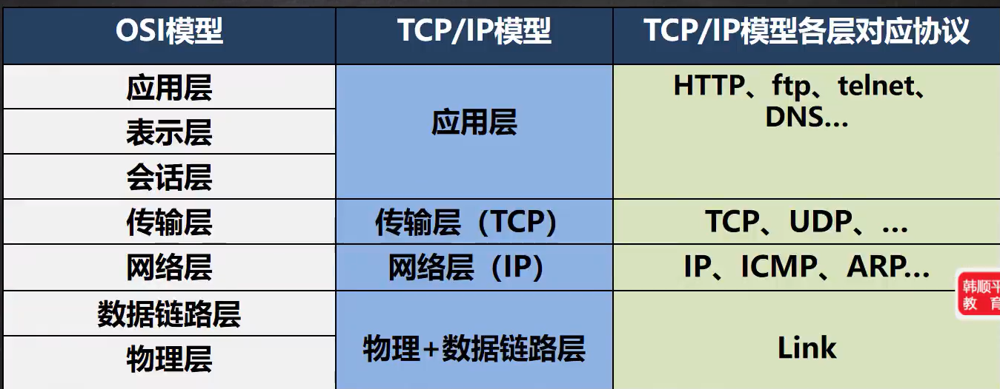
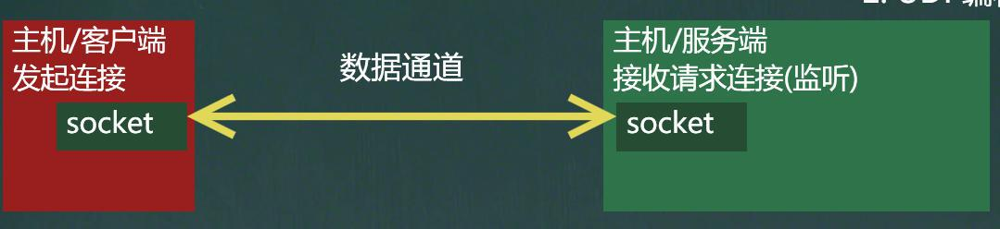
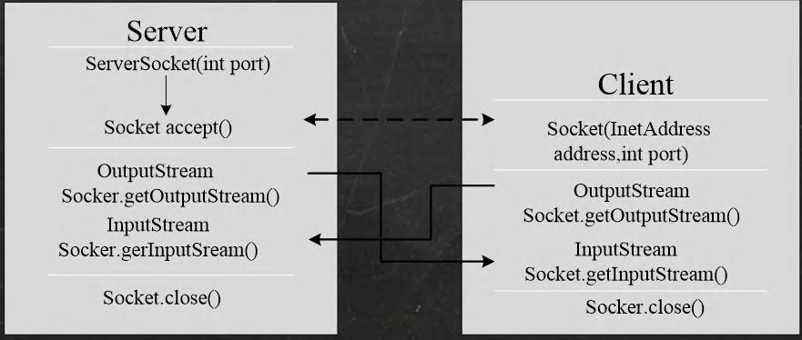
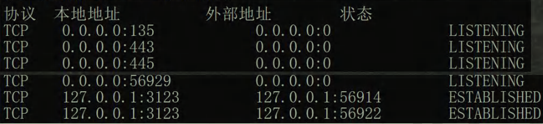
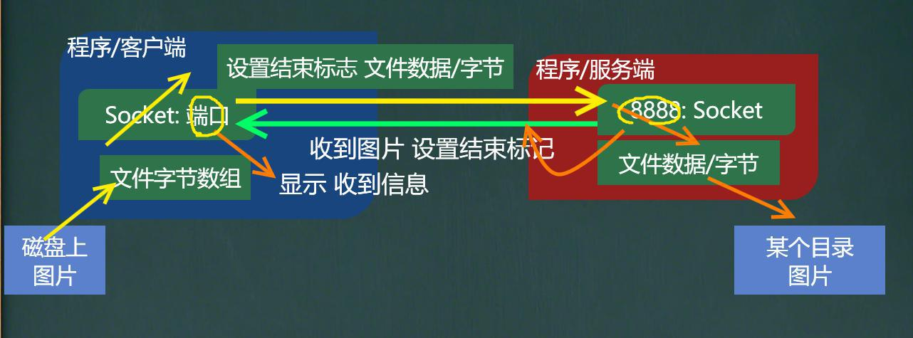

# 十五、网络编程

## 1、网络相关的概念

### 1.1 网络通信

1）概念：两台设备之间通过网络实现数据传输

2）网络通信：将数据通过网络从一台设备传输到另一台设备

3）java.net 包下提供了一系列的类或接口，供程序员使用，完成网络通信



### 1.2 网络基本介绍：

1）概念：两台或多台设备通过一定物理设备连接起来构成了网络

2）根据覆盖的范围不同，对网络进行分类：

- 局域网：覆盖范围最小，只覆盖一个教室或一个机房
- 城域网：覆盖范围较大，可覆盖一座城市
- 广域网：覆盖范围最大，可以覆盖全国，甚至全球，万维网是广域网的代表

### 1.3 IP地址：

1）概念：用于唯一标识网络中的每台计算机/主机

2）查看 ip 地址：ipconfig（命令提示符窗口）

3）ip 地址的表示形式：点分十进制 xx.xx.xx.xx

4）每一个十进制的范围：0 ~ 255

5） ip 地址组成：网络地址 + 主机地址

6）ip 地址分两类：IPV4和IPV6

- IPV6 是基于 IPV4 的基础上开发出来的，用于解决 IP 地址不够的问题
- IPV4 是用 4 个字节（32）表示，一个字节的范围是 0 ~ 255
- IPV6 是用 16 个字节（128）表示

### 1.4  ipv4 地址分类


### 1.5 域名

1）概念：将 IP 地址 **映射** 成 域名 ，通过 HTTP 协议

2）好处：方便记忆，解决 ip 的困难

3）例子：www.baidu.com

### 1.6 端口号：

1）概念：用于标识计算机上的某个特定的网络程序

2）表示形式：以整数形式，范围 0 ~ 65535 (2个字节表示端口 0 到 2 的 16 次方 - 1)

3）0 ~ 1024 已被占用，比如 ssh 22，ftp 21，smtp 25，http 80

4）常见的网络程序端口号：

- tomcat : 8080
- mysql : 3306
- oracle : 1521
- sqlserver : 1433

### 1.7 网络通信协议

#### 1.7.1 协议( tcp / ip )

1）TCP / IP (Transmission Control Protocol / Internet Protocol)的简写，中文译名为 **传输控制协议**/**因特网互联协议**，又叫**网络通讯协议**，这个协议是 Interneti 最基本的协议、Internet **国际互联网络的基础**，简单地说，就是由网络层的IP协议和传输层的TCP协议组成的。





> ​	简单的理解为：协议是数据的一种组织形式，形象的比喻，可以理解为一种约定俗成的模式，例如语言，通过这种协议的模式，使得计算机之间可以解读/理解互相之间传输的数据

### 1.8 TCP 和 UDP 协议

#### 1.8.1 TCP协议

1）使用 TCP 协议前，须先建立 TCP 连接，形成传输数据通道

2）传输前，采用 ”三次握手“ 方式，**是可靠的**

3）TCP 协议进行通信的两个应用进程：客户端、服务端

4）在连接中**可进行大数据量的传输**

5）传输完毕，需释放已建立的连接，**效率低**

#### 1.8.2 UDP 协议

1）将数据、源、目的**封装成数据包**，**不需要建立连接**

2）每个数据包的**大小限制在64K内**，不适合传输大量数据

3）因无需连接，故是**不可靠的**

4）发送数据结束时无需释放资源（因为不是面向连接的)，**速度快**

## 2、InetAddress 类

### 2.1 相关方法

| 方法             | 作用                                    |
| ---------------- | --------------------------------------- |
| getLocalHost()   | 获取本机 InetAddress 对象               |
| getByName()      | 根据指定主机名/域名获取 ip 地址对象     |
| getHostName()    | 获取 InetAddressi 对象的主机名          |
| getHostAddress() | 获取 InetAddress 对像的地址（ IP 地址） |

> 静态方法，可以直接类名来调，但是调完后还是用一个对象来接收一下

### 2.2 应用案例

```java
//获取本机 InetAddress 对象 getLocalHost
InetAddress localHost = InetAddress.getLocalHost();
System.out.println(localHost);
//根据指定主机名/域名获取 ip 地址对象 getByName
InetAddress host2 = InetAddress.getByName("ThinkPad-PC");
System.out.println(host2);
InetAddress host3 = InetAddress.getByName("www.hsp.com");
System.out.println(host3);
//获取 InetAddress 对象的主机名 getHostName
String host3Name = host3.getHostName();
System.out.println(host3Name);
//获取 InetAddress 对象的地址 getHostAddress
String host3Address = host3.getHostAddress();
System.out.println(host3Address);
```

## 3、Socket 关键字

> ​	中文：插座

### 3.1 概述

1）套接字 ( Socket ) 开发网络应用程序被广泛采用，以至于成为事实上的标准。

2）通信的两端都要有 Socket ,是两台机器间通信的端点

3）网络通信其实就是 Socket 间的通信。

4）Socket 允许程序把网络连接当成一个流，数据在两个 Socket 间通过 IO 传输。

5）一般主动发起通信的应用程序属客户端，等待通信请求的为服务端

**示意图**：



## 4、TCP网络通信编程

### 4.1 概述

1）基于 客户端 -- 服务端 的网络通信

2）底层使用的是 TCP/IP 协议

3）应用场景举例：客户端发送数据，服务端接收并显示控制台

4）基于 Socket 的 TCP 编程

**示意图**：



###  4.2 应用案例

#### 1）使用字节流

```java
//1. 编写一个服务器端，和一个客户端
//2. 服务器端在 9999 端口监听
//3. 客户端连接到服务器端，发送 "hello,server" ,然后退出
//4. 服务器端接收到客户端发送的信息，输出，并退出
//
import java.io.IOException;
import java.io.InputStream;
import java.net.ServerSocket;
import java.net.Socket;
/**
* 服务端
*/
public class SocketTCP01Server {
	public static void main(String[] args) throws IOException {
    //思路
    //1. 在本机 的 9999 端口监听, 等待连接
    // 细节: 要求在本机没有其它服务在监听 9999
    // 细节：这个 ServerSocket 可以通过 accept() 返回多个 Socket[多个客户端连接服务器的并发]
        ServerSocket serverSocket = new ServerSocket(9999);
        System.out.println("服务端，在 9999 端口监听，等待连接..");
    //2. 当没有客户端连接 9999 端口时，程序会 阻塞, 等待连接
    // 如果有客户端连接，则会返回 Socket 对象，程序继续
        Socket socket = serverSocket.accept();
        System.out.println("服务端 socket =" + socket.getClass());
    //
    //3. 通过 socket.getInputStream() 读取客户端写入到数据通道的数据, 显示
        InputStream inputStream = socket.getInputStream();
    //4. IO 读取
        byte[] buf = new byte[1024];
        int readLen = 0;
        while ((readLen = inputStream.read(buf)) != -1) {
            System.out.println(new String(buf, 0, readLen));//根据读取到的实际长度，显示内容.
		}
    //5.关闭流和 socket
        inputStream.close();
        socket.close();
        serverSocket.close();//关闭
	}
}


import java.io.IOException;
import java.io.OutputStream;
import java.net.InetAddress;
import java.net.Socket;
import java.net.UnknownHostException;
/**
* 客户端，发送 "hello, server" 给服务端
*/
public class SocketTCP01Client {
	public static void main(String[] args) throws IOException {
    //思路
    //1. 连接服务端 (ip , 端口）
    //解读: 连接本机的 9999 端口, 如果连接成功，返回 Socket 对象
        Socket socket = new Socket(InetAddress.getLocalHost(), 9999);
        System.out.println("客户端 socket 返回=" + socket.getClass());
    //2. 连接上后，生成 Socket, 通过 socket.getOutputStream()
    // 得到 和 socket 对象关联的输出流对象
        OutputStream outputStream = socket.getOutputStream();
    //3. 通过输出流，写入数据到 数据通道
        outputStream.write("hello, server".getBytes());
    //4. 关闭流对象和 socket, 必须关闭
        outputStream.close();
        socket.close();
        System.out.println("客户端退出.....");
	}
}
```


#### 2）使用字节流

```java
//1. 编写一个服务端，和一个客户端
//2. 服务器端在 9999 端口监听
//3. 客户端连接到服务端，发送 "hello,server",并接收服务器端回发的 "hello,client",再退出
//4. 服务器端接收到客户端发送的信息，输出，并发送 "hello,client",再退出
import java.io.IOException;
import java.io.InputStream;
import java.io.OutputStream;
import java.net.ServerSocket;
import java.net.Socket;
/**
* 服务端
*/
@SuppressWarnings({"all"})
public class SocketTCP02Server {
	public static void main(String[] args) throws IOException {
    //思路
    //1. 在本机 的 9999 端口监听, 等待连接
    // 细节: 要求在本机没有其它服务在监听 9999
    // 细节：这个 ServerSocket 可以通过 accept() 返回多个 Socket[多个客户端连接服务器的并发]
        ServerSocket serverSocket = new ServerSocket(9999);
        System.out.println("服务端，在 9999 端口监听，等待连接..");
    //2. 当没有客户端连接 9999 端口时，程序会 阻塞, 等待连接
    // 如果有客户端连接，则会返回 Socket 对象，程序继续
        Socket socket = serverSocket.accept();
        System.out.println("服务端 socket =" + socket.getClass());
    //
    //3. 通过 socket.getInputStream() 读取客户端写入到数据通道的数据, 显示
        InputStream inputStream = socket.getInputStream();
    //4. IO 读取
        byte[] buf = new byte[1024];
        int readLen = 0;
        while ((readLen = inputStream.read(buf)) != -1) {
        	System.out.println(new String(buf, 0, readLen));//根据读取到的实际长度，显示内容.
    	}
    //5. 获取 socket 相关联的输出流
        OutputStream outputStream = socket.getOutputStream();
        outputStream.write("hello, client".getBytes());
    // 设置结束标记
        socket.shutdownOutput();
    //6.关闭流和 socket
        outputStream.close();
        inputStream.close();
        socket.close();
        serverSocket.close();//关闭
    }
}


import java.io.IOException;
import java.io.InputStream;
import java.io.OutputStream;
import java.net.InetAddress;
import java.net.Socket;
/**
* 客户端，发送 "hello, server" 给服务端
*/
@SuppressWarnings({"all"})
public class SocketTCP02Client {
	public static void main(String[] args) throws IOException {
    //思路
    //1. 连接服务端 (ip , 端口）
    //解读: 连接本机的 9999 端口, 如果连接成功，返回 Socket 对象
        Socket socket = new Socket(InetAddress.getLocalHost(), 9999);
        System.out.println("客户端 socket 返回=" + socket.getClass());
    //2. 连接上后，生成 Socket, 通过 socket.getOutputStream()
    // 得到 和 socket 对象关联的输出流对象
        OutputStream outputStream = socket.getOutputStream();
    //3. 通过输出流，写入数据到 数据通道
        outputStream.write("hello, server".getBytes());
    // 设置结束标记
        socket.shutdownOutput();
    //4. 获取和 socket 关联的输入流. 读取数据(字节)，并显示
        InputStream inputStream = socket.getInputStream();
        byte[] buf = new byte[1024];
        int readLen = 0;
        while ((readLen = inputStream.read(buf)) != -1) {
        	System.out.println(new String(buf, 0, readLen));
        }
    //5. 关闭流对象和 socket, 必须关闭
        inputStream.close();
        outputStream.close();
        socket.close();
        System.out.println("客户端退出.....");
    }
}
```

#### 3）使用字符流

```java
//1. 编写一个服务端，和一个客户端
//2. 服务端在 9999 端口监听
//3. 客户端连接到服务端，发送 "hello,server",并接收服务端回发的 "hello,client“,再退出
//4. 服务端接收到客户端发送的信息，输出，并发送 "hello,client",再退出

import java.io.*;
import java.net.ServerSocket;
import java.net.Socket;
/**
* 服务端, 使用字符流方式读写
*/
@SuppressWarnings({"all"})
public class SocketTCP03Server {
	public static void main(String[] args) throws IOException {
    //思路
    //1. 在本机 的 9999 端口监听, 等待连接
    // 细节: 要求在本机没有其它服务在监听 9999
    // 细节：这个 ServerSocket 可以通过 accept() 返回多个 Socket[多个客户端连接服务器的并发]
        ServerSocket serverSocket = new ServerSocket(9999);
        System.out.println("服务端，在 9999 端口监听，等待连接..");
    //2. 当没有客户端连接 9999 端口时，程序会 阻塞, 等待连接
    // 如果有客户端连接，则会返回 Socket 对象，程序继续
        Socket socket = serverSocket.accept();
        System.out.println("服务端 socket =" + socket.getClass());
    //
    //3. 通过 socket.getInputStream() 读取客户端写入到数据通道的数据, 显示
        InputStream inputStream = socket.getInputStream();
    //4. IO 读取, 使用字符流, 老师使用 InputStreamReader 将 inputStream 转成字符流
        BufferedReader bufferedReader = new BufferedReader(new InputStreamReader(inputStream));
        String s = bufferedReader.readLine();
        System.out.println(s);//输出
    //5. 获取 socket 相关联的输出流
        OutputStream outputStream = socket.getOutputStream();
    // 使用字符输出流的方式回复信息
        BufferedWriter bufferedWriter = new BufferedWriter(new OutputStreamWriter(outputStream));
        bufferedWriter.write("hello client 字符流");
        bufferedWriter.newLine();// 插入一个换行符，表示回复内容的结束
        bufferedWriter.flush();//注意需要手动的 flush
    //6.关闭流和 socket
        bufferedWriter.close();
        bufferedReader.close();
        socket.close();
        serverSocket.close();//关闭
    }
}


import java.io.*;
import java.net.InetAddress;
import java.net.Socket;
/**
* 客户端，发送 "hello, server" 给服务端， 使用字符流
*/
@SuppressWarnings({"all"})
public class SocketTCP03Client {
    public static void main(String[] args) throws IOException {
    //思路
    //1. 连接服务端 (ip , 端口）
    //解读: 连接本机的 9999 端口, 如果连接成功，返回 Socket 对象
        Socket socket = new Socket(InetAddress.getLocalHost(), 9999);
        System.out.println("客户端 socket 返回=" + socket.getClass());
    //2. 连接上后，生成 Socket, 通过 socket.getOutputStream()
    // 得到 和 socket 对象关联的输出流对象
        OutputStream outputStream = socket.getOutputStream();
    //3. 通过输出流，写入数据到 数据通道, 使用字符流
        BufferedWriter bufferedWriter = new BufferedWriter(new OutputStreamWriter(outputStream));
        bufferedWriter.write("hello, server 字符流");
        bufferedWriter.newLine();//插入一个换行符，表示写入的内容结束, 注意，要求对方使用 readLine()!!!!
        bufferedWriter.flush();// 如果使用的字符流，需要手动刷新，否则数据不会写入数据通道
    //4. 获取和 socket 关联的输入流. 读取数据(字符)，并显示
        InputStream inputStream = socket.getInputStream();
        BufferedReader bufferedReader = new BufferedReader(new InputStreamReader(inputStream));
        String s = bufferedReader.readLine();
        System.out.println(s);
    //5. 关闭流对象和 socket, 必须关闭
        bufferedReader.close();//关闭外层流
        bufferedWriter.close();
        socket.close();
        System.out.println("客户端退出.....");
    }
}
```

#### 4）使用TCP

```java
//1. 编写一个服务端，和一个客户端
//2. 服务器端在 8888 端口监听
//3. 客户端连接到服务端，发送一张图片 e:\\qie.png
//4. 服务器端接收到客户端发送的图片，保存到 src 下，发送 "收到图片" 再退出
//5. 客户端接收到服务端发送的 "收到图片"，再退出
//6. 该程序要求使用 StreamUtils.java,我们直接使用

import java.io.BufferedReader;
import java.io.ByteArrayOutputStream;
import java.io.IOException;
import java.io.InputStream;
import java.io.InputStreamReader;
/**
* 此类用于演示关于流的读写方法
*/
public class StreamUtils {
/**
* 功能：将输入流转换成 byte[]
* @param is
* @return
* @throws Exception
*/
	public static byte[] streamToByteArray(InputStream is) throws Exception{
		ByteArrayOutputStream bos = new ByteArrayOutputStream();//创建输出流对象
        byte[] b = new byte[1024];
        int len;
        while((len=is.read(b))!=-1){
            bos.write(b, 0, len);
		}
        byte[] array = bos.toByteArray();
        bos.close();
        return array;
	}
    
    
/**
* 功能：将 InputStream 转换成 String
* @param is
* @return
* @throws Exception
*/
	public static String streamToString(InputStream is) throws Exception{
		BufferedReader reader = new BufferedReader(new InputStreamReader(is));
        StringBuilder builder= new StringBuilder();
        String line;
        while((line=reader.readLine())!=null){ //当读取到 null 时，就表示结束
        	builder.append(line+"\r\n");
		}
		return builder.toString();
	}
}


import java.io.*;
import java.net.ServerSocket;
import java.net.Socket;
/**
* 文件上传的服务端
*/
public class TCPFileUploadServer {
	public static void main(String[] args) throws Exception {
    //1. 服务端在本机监听 8888 端口
        ServerSocket serverSocket = new ServerSocket(8888);
        System.out.println("服务端在 8888 端口监听....");
    //2. 等待连接
    	Socket socket = serverSocket.accept();
    //3. 读取客户端发送的数据
    // 通过 Socket 得到输入流
        BufferedInputStream bis = new BufferedInputStream(socket.getInputStream());
        byte[] bytes = StreamUtils.streamToByteArray(bis);
    //4. 将得到 bytes 数组，写入到指定的路径，就得到一个文件了
        String destFilePath = "src\\abc.mp4";
        BufferedOutputStream bos = new BufferedOutputStream(new FileOutputStream(destFilePath));
        bos.write(bytes);
        bos.close();
    // 向客户端回复 "收到图片"
    // 通过 socket 获取到输出流(字符)
        BufferedWriter writer = new BufferedWriter(new OutputStreamWriter(socket.getOutputStream()));
        writer.write("收到图片");
        writer.flush();//把内容刷新到数据通道
        socket.shutdownOutput();//设置写入结束标记
    //关闭其他资源
        writer.close();
        bis.close();
        socket.close();
        serverSocket.close();
    }
}


import java.io.*;
import java.net.InetAddress;
import java.net.Socket;
/**
* 文件上传的客户端
*/
public class TCPFileUploadClient {
	public static void main(String[] args) throws Exception {
    //客户端连接服务端 8888，得到 Socket 对象
    	Socket socket = new Socket(InetAddress.getLocalHost(), 8888);
    //创建读取磁盘文件的输入流
    //String filePath = "e:\\qie.png";
    	String filePath = "e:\\abc.mp4";
    	BufferedInputStream bis = new BufferedInputStream(new FileInputStream(filePath));
    //bytes 就是 filePath 对应的字节数组
    	byte[] bytes = StreamUtils.streamToByteArray(bis);
    //通过 socket 获取到输出流, 将 bytes 数据发送给服务端
        BufferedOutputStream bos = new BufferedOutputStream(socket.getOutputStream());
        bos.write(bytes);//将文件对应的字节数组的内容，写入到数据通道
        bis.close();
        socket.shutdownOutput();//设置写入数据的结束标记
    //=====接收从服务端回复的消息=====
    	InputStream inputStream = socket.getInputStream();
    //使用 StreamUtils 的方法，直接将 inputStream 读取到的内容 转成字符串
        String s = StreamUtils.streamToString(inputStream);
        System.out.println(s);
    //关闭相关的流
        inputStream.close();
        bos.close();
        socket.close();
    }
}
```

### 4.3、netstat 指令

1）netsrar -an 指令可以查看当前主机网络情况，包括端口监听情况和网络连接情况

2）netstat -an|more 指令表示可以分页显示

3）要求在 dos 控制台下执行

#### 4.3.1 说明：

1）Listening 表示某个端口在监听

2）如果有一个外部程序（客户端）连接到该端口，就会显示一条连接信息

3）可以输入 ctrl + c 退出指令



#### 4.3.2 TCP网络通讯不为人知的秘密

1）客户端连接到服务端后，实际上客户端也是通过一个端口和服务端进行通讯的，这个端口是 TCP/IP 来分配的，是**随机**的（说明客户端也是有端口的)

2）示意图：



## 5、UDP 网络编程


### 5.1 概述

1）类 DatagramSocket 和 DatagramPacket [数据包/数据报] 实现了基于 UDP 协议的网络程序。

> 两个关键类：DatagramSocket （数据包套接字）和DatagramPacket （数据包/也可以叫数据报）

2）UDP 数据报**通过 数据报套接字 DatagramSocket 发送和接收**，系统**不保证 UDP 数据报一定能够安全送到目的地**，**也不能确定什么时候可以抵达。**

3）DatagramPacket 对象**封装了 UDP 数据报**，在**数据报中包含了发送端的 IP 地址和端口号以及接收端的 IP 地址和端口号。**

4）UDP 协议中**每个数据报都给出了完整的地址信息**，因此**无须建立 发送方 和 接收方 的连接**

### 5.2 基本流程

1）核心的两个 类/对像 DatagramSocket 与 DatagramPacket

2）建立发送端，接收端（没有 服务端 和 客户端 的概念）

3）发送数据之前，建立数据包/报 DatagramPacket 对象

4）调用 DatagramSocket 的发送、接收方法

5）关闭 DatagramSocket

### 5.3 UDP 说明

1）没有明确的服务端和客户端，演变成数据的发送端和接收端

2）接收数据和发送数据是通过 DatagramSocket 对象完成

3）将数据封装到 DatagramPacket 对象/装包

4）当接收到 DatagramPacket 对象，需要进行拆包，取出数据

5）DatagramSocket 可以指定在哪个端口接收数据

### 5.4 应用案例

```java
//1. 编写一个接收端 A,和一个发送端 B
//2. 接收端 A 在 9999 端口等待接收数据 (receive)
//3. 发送端 B 向接收端 A 发送数据 "helo,明天吃火锅~"
//4. 接收端 A 接收到发送端 B 发送的数据，回复 "好的，明天见"，再退出
//5. 发送端接收回复的数据，再退出


import java.io.IOException;
import java.net.DatagramPacket;
import java.net.DatagramSocket;
import java.net.InetAddress;
import java.net.SocketException;
/**
* UDP 接收端
*/
public class UDPReceiverA{
    public static void main(String[] args) throws IOException {
    //1. 创建一个 DatagramSocket 对象，准备在 9999 接收数据
    	DatagramSocket socket = new DatagramSocket(9999);
    //2. 构建一个 DatagramPacket 对象，准备接收数据
    // 在前面讲解 UDP 协议时，老师说过一个数据包最大 64k
        byte[] buf = new byte[1024];
        DatagramPacket packet = new DatagramPacket(buf, buf.length);
    //3. 调用 接收方法, 将通过网络传输的 DatagramPacket 对象
    // 填充到 packet 对象
    //老师提示: 当有数据包发送到 本机的 9999 端口时，就会接收到数据
    // 如果没有数据包发送到 本机的 9999 端口, 就会阻塞等待.
        System.out.println("接收端 A 等待接收数据..");
        socket.receive(packet);
    //4. 可以把 packet 进行拆包，取出数据，并显示.
        int length = packet.getLength();//实际接收到的数据字节长度
        byte[] data = packet.getData();//接收到数据
        String s = new String(data, 0, length);
        System.out.println(s);
    //===回复信息给 B 端
    //将需要发送的数据，封装到 DatagramPacket 对象
    	data = "好的, 明天见".getBytes();
    //说明: 封装的 DatagramPacket 对象 data 内容字节数组 , data.length , 主机(IP) , 端口
    	packet =
    new DatagramPacket(data, data.length, InetAddress.getByName("192.168.12.1"), 9998);
    	socket.send(packet);//发送
    //5. 关闭资源
    	socket.close();
    	System.out.println("A 端退出...");
    }
}


import java.io.IOException;
import java.net.*;
/**
* 发送端 B ====> 也可以接收数据
*/
@SuppressWarnings({"all"})
public class UDPSenderB {
    public static void main(String[] args) throws IOException {
    //1.创建 DatagramSocket 对象，准备在 9998 端口 接收数据
    	DatagramSocket socket = new DatagramSocket(9998);
    //2. 将需要发送的数据，封装到 DatagramPacket 对象
    	byte[] data = "hello 明天吃火锅~".getBytes(); //
    //说明: 封装的 DatagramPacket 对象 data 内容字节数组 , data.length , 主机(IP) , 端口
        DatagramPacket packet =
        new DatagramPacket(data, data.length, InetAddress.getByName("192.168.12.1"), 9999);
        socket.send(packet);
    //3.=== 接收从 A 端回复的信息
    //(1) 构建一个 DatagramPacket 对象，准备接收数据
    // 在前面讲解 UDP 协议时，老师说过一个数据包最大 64k
        byte[] buf = new byte[1024];
        packet = new DatagramPacket(buf, buf.length);
    //(2) 调用 接收方法, 将通过网络传输的 DatagramPacket 对象
    // 填充到 packet 对象
    //老师提示: 当有数据包发送到 本机的 9998 端口时，就会接收到数据
    // 如果没有数据包发送到 本机的 9998 端口, 就会阻塞等待.
    	socket.receive(packet);
    //(3) 可以把 packet 进行拆包，取出数据，并显示.
        int length = packet.getLength();//实际接收到的数据字节长度
        data = packet.getData();//接收到数据
        String s = new String(data, 0, length);
        System.out.println(s);
    //关闭资源
        socket.close();
        System.out.println("B 端退出");
    }
}
```


