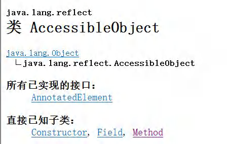

# 十六、反射(Reflection)

## 1、反射机制

### 1.1 概述

1）反射机制允许程序在执行期借助 ReflectionAPI 取得任何类的内部消息（成员变量/方法/构造器），并能操作对象的属性及方法。

2）加载完类之后，在堆中就产生了一个 Class 类型的对象（一个类只有一个 Class 对象），这个对象包含了类的完整信息。通过这个对象得到类的结构。这个 Class 对象就像一面镜子，透过这个镜子看到类的结构，所以形象的称之为：反射

### 1.2 反射机制原理图


### 1.3 反射机制作用

1）在运行时判断任意一个对象所属的类

2）在运行时构造任意一个类的对象

3）在运行时能得到任意一个类所具有的成员变量和方法

4）在运行时调用任意一个对象的成员变量和方法

5）生成动态代理

### 1.4 反射相关主要类

> reflect（表示反射），Method（表示方法），field（表示领域），Constructor（构造器）

1）java.lang.Class：代表一个类，Class 对象表示一个类加载后在堆中的对象

2）java.lang.reflect.Method：表示方法，Method 对象表示一个类的方法

3）java.lang.reflect.Field：表示属性，Field 对象表示一个类的成员属性

4）java.lang.reflect.Constructor：表示构造方法，Constructor 对象表示一个类的构造器

> 这些类在 java.lang.reflection



### 1.5 反射的优缺点

1）优点：可以动态的创建和使用对象（也是框架底层核心），使用灵活，没有反射机制，框架技术就失去底层支撑。

2）缺点：使用反射基本是解释执行，对执行速度有影响。

3）缺点优化：反射类中有一个 setAccessible 方法，表示 关闭访问权限，true 表示关闭访问检查，false 表示每次都要访问检查，关闭访问检查可以一定程度上提升执行速度（不多，就一点点）

### 1.6 反射调用优化-关闭访问检查

1）Method 和 Field、Constructor 对象都有 setAccessible() 方法

2）setAccessible 作用是启动和禁用访问安全检查的开关

3）参数值为 true 表示 反射的对象在使用时取消访问检查，提高反射的效率。参数值为 false 则表示反射的对象执行访问检查

### 1.7 案例演示

#### 1）反射的使用

```java

import java.io.FileInputStream;
import java.io.FileNotFoundException;
import java.lang.reflect.Constructor;
import java.lang.reflect.Field;
import java.lang.reflect.Method;
import java.util.Properties;

public class Reflection01 {
    public static void main(String[] args) throws Exception {
        //1. 使用 Properties 类, 可以读写配置文件
        Properties properties = new Properties();
        properties.load(new FileInputStream("src\\re.properties"));
        String classfullpath = properties.get("classfullpath").toString();//"com.hspedu.Cat"
        String methodName = properties.get("method").toString();//"hi"
        //2. 使用反射机制解决
        //(1) 加载类, 返回 Class 类型的对象 cls
        Class cls = Class.forName(classfullpath);
        //(2) 通过 cls 得到你加载的类 com.hspedu.Cat 的对象实例
        Object o = cls.newInstance();
        System.out.println("o 的运行类型=" + o.getClass()); //运行类型
        //(3) 通过 cls 得到你加载的类 com.hspedu.Cat 的 methodName"hi" 的方法对象
        // 即：在反射中，可以把方法视为对象（万物皆对象）
        Method method1 = cls.getMethod(methodName);
        //(4) 通过 method1 调用方法: 即通过方法对象来实现调用方法
        System.out.println("=============================");
        method1.invoke(o); //传统方法 对象.方法() , 反射机制 方法.invoke(对象)
        //java.lang.reflect.Field: 代表类的成员变量, Field 对象表示某个类的成员变量
        //得到 name 字段
        //getField 不能得到私有的属性
        Field nameField = cls.getField("age"); //
        System.out.println(nameField.get(o)); // 传统写法 对象.成员变量 , 反射 : 成员变量对象.get(对象)
        //java.lang.reflect.Constructor: 代表类的构造方法, Constructor 对象表示构造器
        Constructor constructor = cls.getConstructor(); //()中可以指定构造器参数类型, 返回无参构造器
        System.out.println(constructor);//Cat()
        Constructor constructor2 = cls.getConstructor(String.class); //这里老师传入的String.class 就是 String 类的Class 对象
        System.out.println(constructor2);//Cat(String name)
    }
}
```

#### 2）反射调优

```java

import com.hspedu.Cat;
import java.io.FileInputStream;
import java.lang.reflect.Constructor;
import java.lang.reflect.Field;
import java.lang.reflect.InvocationTargetException;
import java.lang.reflect.Method;
/**
* 测试反射调用的性能，和优化方案
*/
public class Reflection02 {
    public static void main(String[] args) throws ClassNotFoundException, NoSuchMethodException,InvocationTargetException, InstantiationException, IllegalAccessException {
        //Field
        //Method
        //Constructor
        m1();//传统
        m2();//反射
        m3();//反射优化
	}
	//传统方法来调用 hi
public static void m1() {
	Cat cat = new Cat();
	long start = System.currentTimeMillis();
	for (int i = 0; i < 90; i++) {
		cat.hi();
	}
	long end = System.currentTimeMillis();
	System.out.println("m1() 耗时=" + (end - start));
}
    
//反射机制调用方法 hi
public static void m2() throws ClassNotFoundException, IllegalAccessException,InstantiationException,NoSuchMethodException, InvocationTargetException {
    Class cls = Class.forName("com.hspedu.Cat");
    Object o = cls.newInstance();
    Method hi = cls.getMethod("hi");
    long start = System.currentTimeMillis();
	for (int i = 0; i < 900000000; i++) {
		hi.invoke(o);//反射调用方法
	}
    long end = System.currentTimeMillis();
    	System.out.println("m2() 耗时=" + (end - start));
}
    
//反射调用优化 + 关闭访问检查
public static void m3() throws ClassNotFoundException, IllegalAccessException,InstantiationException,NoSuchMethodException, InvocationTargetException {
	Class cls = Class.forName("com.hspedu.Cat");
	Object o = cls.newInstance();
	Method hi = cls.getMethod("hi");
	hi.setAccessible(true);//在反射调用方法时，取消访问检查
	long start = System.currentTimeMillis();
	for (int i = 0; i < 900000000; i++) {
		hi.invoke(o);//反射调用方法
		}
	long end = System.currentTimeMillis();
	System.out.println("m3() 耗时=" + (end - start));
	}
}
```

## 2、Class 类

### 2.1、概述


1）Class 也是类，因此也继承 Object

2）Class 类对象不是 new 出来的，而是由系统创建的

3）对于某个类的 Class 类对象，在内存中只有一份，因为类只加载一次

4）每个类的实列都会记录自己是由哪个 Class 的实列（反射类）所生成

5）通过 Class 对象可以完整地得到一个类的完整结构，通过一系列 API

6）Class 对象是存放在堆中的

7）类的字节码二进制数据，是放在方法区的，有的地方称为类的元数据（包括 方法代码，变量名，方法名，访问权限等等），详情参考：[hotpot java虚拟机Class对象是放在 方法区 还是堆中 ？](https://www.zhihu.com/question/38496907)

8）类加载的时候，通过类加载器在堆中生成反射类（即Class对象）对象的同时，还会在方法区中生成一份类的字节码数据（二进制的），这份数据存放在方法区中，也被称为类的元数据

### 2.2 Class 类的常用方法

| 方法名                                             | 作用                                                         |
| -------------------------------------------------- | ------------------------------------------------------------ |
| static Class forName(String name)                  | 返回指定类名 name 的 Class 对象                              |
| Object newlnstance()                               | 调用缺省构造函数，返回该 Class 对象的一个实例                |
| getName()                                          | 返回此 Class 对象所表示的实体（类、接口、数组类、基本类型等）名称 |
| Class [] getlnterfaces()                           | 获取当前 Class 对象的接口                                    |
| ClassLoader getClassLoader()                       | 返回该类的类加载器                                           |
| Class getSuperclass()                              | 返回表示此 Class 所表示的实体的超类的 Class                  |
| Constructor[] getConstructors()                    | 返回一个包含某些 Constructor 对象的数组                      |
| Field[] getDeclaredFields()                        | 返回 Field 对象的一个数组                                    |
| Method getMethod(String name,Class ... paramTypes) | 返回一个Method对象，此对象的形参类型为paramType              |

**应用实例**：

```java
		//获取Car类的位置
        String classAllPath = "Car";
        //1 获取到Car对应的镜像Class对象
        Class<?> cls = Class.forName(classAllPath);
        //2 直接输出cls
        System.out.println(cls);//会输出是那个类的Class对象，就是被镜像的实例类
        System.out.println(cls.getClass());//输出运行类型，其实运行类型还是Class，也就是镜像类
        //3 得到包名
        //System.out.println(cls.getPackage().getName());
        //得到包名，这里我没将该类放到包下，所以没有包名，所以会报空指针异常
        //4 得到类名
        System.out.println(cls.getName());//得到全类名
        //通过cls获取对象实例
        Object car =  cls.newInstance();
        //6 通过反射获取属性实例
        Field name = cls.getField("name");
        System.out.println(name.get(car));
        //7 通过反射给属性赋值
        name.set(car,"小黄");
        System.out.println(name.get(car));
        //8 遍历所有属性
        Field[] fields = cls.getFields();
        for (Field field : fields) {
            System.out.println(field.getName());//遍历所有属性的名称
        }
```

### 2.3 获取 Class 类对象

#### 2.3.1 情况1

1）前提：已知一个类的全类名，且该类在类路径下，可通过 Class 类的静态方法 forName() 获取，可能抛出ClassNotFoundException

实例：Class cls1 = Class.forName("java.lang.Cat");

应用场景：多用于配置文件，读取类全路径，加载类。

#### 2.3.2 情况2

2）前提：若已知具体的类，通过类的 class 获取，该方式 最为安全可靠，程序性能最高

实例：Class cls2=Cat.class;

应用场景：多用于参数传递，比如通过反射得到对应构造器对象.

#### 2.3.3 情况3

3）前提：已知某个类的实例，调用该实例的 getClass() 方法获取 Class 对象

实例：Class clazz = 对象.getClass();//运行类型

应用场景：通过创建好的对象，获取 Class 对象。

#### 2.3.4 其他方式

1）ClassLoader cl = 对象.getClass().getClassLoader();

2）Class class4 = cl.loadClass("类的全类名");

#### 2.3.5 基本数据类型获得 Class 类对象

基本数据类型：int，char，boolean，float，double，byte，long，short

获取 Class 类对象：

Class cls = 基本数据类型.class

#### 2.3.6 基本数据类型对应包装类获得 Class 类对象

获取 Class 类对象：

Class cls = 包装类.TYPE

#### 2.3.7 应用实例

```java
	//四种情况，四种获取方法，两种补充案例
    //1 编译阶段获取Class对象
    //前提：已知一个类的全类名，且该类在类路径下，可通过Class类的静态方法forName()获取，
    // 可能抛出ClassNotFoundException,
    //应用场景：多用于配置文件，读取类全路径，加载类
    String classAllPath="类的路径";//通过读取配置文件获取
    Class<?>cls1 = Class.forName(classAllPath);
    System.out.println(cls1);
     
    //2 Class类加载阶段的Class对象获取
    //前提：若已知具体的类，通过类的class获取，该方式最为安全可靠，程序性能最高
    //应用场景：多用于参数传递，比如通过反射得到对应构造器对象
    Class cls2 = 类名.class;
    System.out.println(cls2);
     
    //3 运行阶段的Class对象获取
    //前提：已知某个类的实例，调用该实例的getClass0方法获取Class对像
    //应用场景：通过创建好的对象，获取Class对象
    Car car = new Car();
    Class cls3 = 类名.getclass();
    System.out.println(cls3);
     
    //4 通过类加载器得到Class对象
    //ClassLoader cl =.getClass(.getClassLoader();
    //Class clazz4=cl.loadClass(“类的全类名”)
    //(1)先得到类加载器car
    CLassLoader classLoader = car.getclass().getclassLoader();
    //(2)通过类加载器得到class对象
    Class cls4 = classLoader.LoadClass(classAllPath);
    System.out.println(cls4);
     
    //以下为两种补充案例
    //基本数据(int,char,boolean,float,double,byte,Long,short)按如下方式得到Class类对象
    Class<Integer>integerClass = int.class;
    Class<Character>characterclass = char.class;
    Class<Boolean>booleanclass = boolean.class;
    System.out.println(integerClass);//int
    //基本数据类型对应的包装类，可以通过.TYPE得到Class类对象
    Class<Integer>type1 = Integer.TYPE;
    Class<Character>type2 = Character.TYPE;
    System.out.println(type1);
    //hash值一样，int和Integer能通过Class进行的映射进行自动装拆箱，本质还是同一个
    System.out.println(integerClass.hashCode());//?
    System.out.println(type1.hashCode());//?
```

## 3、那些类型有 Class 对象

### 3.1 如下

1）外部类，成员内部类，静态内部类，局部内部类，匿名内部类

2）interface : 接口

3）数组

4）enum : 枚举

5）annotation : 注解

6）基本数据类型

7）void

### 3.2 案例

```java

import java.io.Serializable;
/**
* 演示哪些类型有 Class 对象
*/
public class AllTypeClass {
    public static void main(String[] args) {
        Class<String> cls1 = String.class;//外部类
        Class<Serializable> cls2 = Serializable.class;//接口
        Class<Integer[]> cls3 = Integer[].class;//数组
        Class<float[][]> cls4 = float[][].class;//二维数组
        Class<Deprecated> cls5 = Deprecated.class;//注解
        //枚举
        Class<Thread.State> cls6 = Thread.State.class;
        Class<Long> cls7 = long.class;//基本数据类型
        Class<Void> cls8 = void.class;//void 数据类型
        Class<Class> cls9 = Class.class;//
        System.out.println(cls1);
        System.out.println(cls2);
        System.out.println(cls3);
        System.out.println(cls4);
        System.out.println(cls5);
        System.out.println(cls6);
        System.out.println(cls7);
        System.out.println(cls8);
        System.out.println(cls9);
    }
}
```

## 4、类加载

### 4.1 概述

反射机制是 java 实现动态语言的关键，也就是通过反射实现类动态加载。

1）静态加载：编译时加载相关的类，如果没有就报错，依赖性太强

2）动态加载：运行时加载需要的类，如果运行时不用该类，即使不存在该类，则不报错，降低了依赖性

### 4.2 类加载时机

1）创建对象时（new）//静态加载

2）当子类被加载时，父类也加载 //静态加载

3）调用类中的静态成员时 //静态加载

4）通过反射 //动态加载

### 4.3 类加载过程图


### 4.4 类加载各阶段完成任务


### 4.5 加载阶段


1）JVM 在该阶段的主要目的是将字节码从不同的数据源（可能是 class 文件、也可能是 jar 包，甚至网络)转化为 二进制字节流加载到内存中，并生成一个代表该类的 java.lang.Class 对象

### 4.6 验证

1）目的是为了确保 Class 文件的字节流中包含的信息符合当前虚以机的要求，并且不会危害虚拟机自身的安全。

2）包括：文件格式验证（是否以魔数 oxcafebabe 开头）、元数据验证、字节码验证和符号引用验证

3）可以考虑使用 -Xverify:none 参数来关闭大部分的类验证措施，缩短虚拟机类加载的时间

### 4.7 准备

1）JVM 会在该阶段对静态变量，分配内存并默认初始化（对应数据类型的默认初始值，如 0、OL、null、false 等)。这些变量所使用的内存都将在方法区中进行分配

#### 4.7.1 注意事项

1）实例属性，不是静态变量，因此在准备阶段，是不会分配内存

2）静态变量，分配内存n2是默认初始化0，而不是20

3）static final是常量，和静态变量不一样，因为一旦赋值就不变，所以准备阶段会一次性的分配内存并赋值

#### 4.7.2 案例

```java
package com.hspedu.reflection.classload_;
/**
* @author 韩顺平
* @version 1.0
* 我们说明一个类加载的链接阶段-准备
*/
public class ClassLoad02 {
	public static void main(String[] args) {}
}

class A{
//属性-成员变量-字段
//老韩分析类加载的链接阶段-准备 属性是如何处理
//1. n1 是实例属性, 不是静态变量，因此在准备阶段，是不会分配内存
//2. n2 是静态变量，分配内存 n2 是默认初始化 0 ,而不是 20
//3. n3 是 static final 是常量, 他和静态变量不一样, 因为一旦赋值就不变 n3 = 30
public int n1 = 10;
public static int n2 = 20;
public static final int n3 = 30;
}
```


### 4.8 解析

1）虚拟机将常量池内的符号引用（相对坐标）替换为直接引用（直接坐标）的过程。

> ​	在编译的时候一个每个 java 类都会被编译成一个 class 文件，但在编译的时候虚拟机并不知道所引用类的地址，所以就用符号引用来代替，而在解析阶段就是为了把这个符号引用转化成真正的地址的阶段。

**解释**：


​	首先看图，当一个Java类被编译成Class之后，假如这个类称为A，并且A中引用了B，那么在编译阶段A是不知道B有没有被编译的，而且此时B也一定没有被加载，所以A 肯定不知道B的实际地址，那么此时在A的class文件中，将使用一个字符串S来代表B的地址，S就被称为符号引用，在运行时，如果A发生了类加载到了解析阶段会发现B还未被加载，那么将会触发B的类加载，将B加载到虚拟机中，此时A中B的符号引用将会被替换为B的实际地址，这被称为直接引用。这样也能真正的调用B了。

​	但是事情没有这么简单，了解多态的同学应该知道Java通过后期绑定的方式来实现多态，那么后期绑定这个概念又是如何实现的呢，其实就是这里的动态解析。接着上面所说，如果A调用的B是一个具体的实现类那么就称为静态解析，因为解析的目标类型很明确，而假如上层Java代码使用了多态，这里B]是一个抽象类或者是接口，那么B可能有两个具体的实现类C和D，此时B的具体实现并不明确，当然也就不知道使用那个具体类的直接引用来进行替换，既然不知道那就等一等吧，直到在运行过程中发生了调用，此时虚拟机调用栈中将会得到具体的类信息，这时候再进行解析，就能用明确的直接引用，来替换符号引用，这也就解释了为什么解析阶段有时候会发生在初始化阶段之后，这就是动态解析，用它来实现后期绑定。

### 4.9  Initialization(初始化)

1）到初始化阶段，才真正开始执行类中定义的 Java 程序代码，此阶段是执行 `<clinit>()` 方法的过程。

2）`<clinit>()`方法是由编译器按语句在源文件中出现的顺序，依次自动收集类中的所有**静态变量**的赋值动作和**静态代码块**中的语句，并进行合并。（就是按顺序，从上到下将所有的静态代码整合起来并执行）

3）虚拟机会保证一个类的 `<clinit>()`方法在多线程环境中被正确地加锁、同步，如果多个线程同时去初始化一个类，那么只会有一个线程去执行这个类的 `<clinit>()`方法，其他线程都需要阻塞等待，直到活动线程执行 `<clinit>()`方法完毕

4）**案例演示**：

```java
package com.hspedu.reflection.classload_;
/**
* 演示类加载-初始化阶段
*/
public class ClassLoad03 {
	public static void main(String[] args) throws ClassNotFoundException {
    //老韩分析
    //1. 加载 B 类，并生成 B 的 class 对象
    //2. 链接 num = 0
    //3. 初始化阶段
    // 依次自动收集类中的所有静态变量的赋值动作和静态代码块中的语句,并合并
    /*
    clinit() {
    	System.out.println("B 静态代码块被执行");
    	//num = 300;
    	num = 100;
    }
    合并: num = 100
    */
    //new B();//类加载
    //System.out.println(B.num);//100, 如果直接使用类的静态属性，也会导致类的加载
    //看看加载类的时候，是有同步机制控制
    /*
    protected Class<?> loadClass(String name, boolean resolve)
    	throws ClassNotFoundException
    {
    //正因为有这个机制，才能保证某个类在内存中, 只有一份 Class 对象
    synchronized (getClassLoadingLock(name)) {
    //....
    }
    }
    */
    B b = new B();
    	}
    }
    class B {
    	static {
    		System.out.println("B 静态代码块被执行");
    		num = 300;
    }
    	static int num = 100;
    public B() {//构造器
    	System.out.println("B() 构造器被执行");
    }
}
```


## 5、通过反射获取类的结构信息

### 5.1 第一组 java.lang.Class

| 方法                    | 作用                                           |
| ----------------------- | ---------------------------------------------- |
| getName                 | 获取全类名                                     |
| getSimpleName           | 获取简单类名                                   |
| getFields               | 获取所有 public 修饰的属性，包含本类以及父类的 |
| getDeclaredFields       | 获取本类中所有属性                             |
| getMethods              | 获取所有public修饰的方法，包含本类以及父类的   |
| getDeclaredMethods      | 获取本类中所有方法                             |
| getConstructors         | 获取所有 public 修饰的构造器，包含本类         |
| getDeclaredConstructors | 获取本类中所有构造器                           |
| getPackage              | 以 Package 形式返回包信息                      |
| getSuperClass           | 以 Class 形式返回父类信息                      |
| getInterfaces           | 以 Class[] 形式返回接口信息                    |
| getAnnotations          | 以 Annotation[] 形式返回注解信息               |

### 5.2 第二组 java.lang.reflect.Field 类

| 方法         | 作用                                                         |
| ------------ | ------------------------------------------------------------ |
| getModifiers | 以 int 形式返回修饰符<br/>[说明：默认修饰符是 0，public 是 1，private 是 2，protected 是 4，static 是 8，final 是 16] |
| getType      | 以Class形式返回类型                                          |
| getName      | 返回属性名                                                   |

### 5.3 第三组 java.lang.reflect.Method 类

| 方法              | 作用                                                         |
| ----------------- | ------------------------------------------------------------ |
| getModifiers      | 以 int 形式返回修饰符[说明：默认修饰符是0，public是1，private是2，protected是4，static是8，final是16] |
| getReturnType     | 以 Class 形获取返回类型                                      |
| getName           | 返回方法名                                                   |
| getParameterTypes | 以 Class[] 返回参数类型数组                                  |

### 5.4 第四组 java.lang.reflect.Constructor 类

| 方法              | 作用                        |
| ----------------- | --------------------------- |
| getModifiers      | 以 int 形式返回修饰符       |
| getName           | 返回构造器名（全类名）      |
| getParameterTypes | 以 Class[] 返回参数类型数组 |

### 5.5 案例演示

```java
import org.junit.jupiter.api.Test;
import java.lang.annotation.Annotation;
import java.lang.reflect.Constructor;
import java.lang.reflect.Field;
import java.lang.reflect.Method;
/**
* 演示如何通过反射获取类的结构信息
*/
public class ReflectionUtils {
	public static void main(String[] args) {}
	@Test
	public void api_02() throws ClassNotFoundException, NoSuchMethodException {
    //得到 Class 对象
    	Class<?> personCls = Class.forName("com.hspedu.reflection.Person");
    //getDeclaredFields:获取本类中所有属性
    //规定 说明: 默认修饰符 是 0 ， public 是 1 ，private 是 2 ，protected 是 4 , static 是 8 ，final 是 16
        Field[] declaredFields = personCls.getDeclaredFields();
        for (Field declaredField : declaredFields) {
        System.out.println("本类中所有属性=" + declaredField.getName()
        + " 该属性的修饰符值=" + declaredField.getModifiers()
        + " 该属性的类型=" + declaredField.getType());
        }
    //getDeclaredMethods:获取本类中所有方法
        Method[] declaredMethods = personCls.getDeclaredMethods();
        for (Method declaredMethod : declaredMethods) {
        System.out.println("本类中所有方法=" + declaredMethod.getName()
        + " 该方法的访问修饰符值=" + declaredMethod.getModifiers()
        + " 该方法返回类型" + declaredMethod.getReturnType());
    //输出当前这个方法的形参数组情况
        Class<?>[] parameterTypes = declaredMethod.getParameterTypes();
        for (Class<?> parameterType : parameterTypes) {
        	System.out.println("该方法的形参类型=" + parameterType);
    	}
    }
    //getDeclaredConstructors:获取本类中所有构造器
        Constructor<?>[] declaredConstructors = personCls.getDeclaredConstructors();
        for (Constructor<?> declaredConstructor : declaredConstructors) {
        System.out.println("====================");
        System.out.println("本类中所有构造器=" + declaredConstructor.getName());//这里老师只是输出名
        Class<?>[] parameterTypes = declaredConstructor.getParameterTypes();
        for (Class<?> parameterType : parameterTypes) {
        System.out.println("该构造器的形参类型=" + parameterType);
    	}
    }
}
    
    
//第一组方法 API
@Test
public void api_01() throws ClassNotFoundException, NoSuchMethodException {
    //得到 Class 对象
    Class<?> personCls = Class.forName("com.hspedu.reflection.Person");
    //getName:获取全类名
    System.out.println(personCls.getName());//com.hspedu.reflection.Person
    //getSimpleName:获取简单类名
    System.out.println(personCls.getSimpleName());//Person
    //getFields:获取所有 public 修饰的属性，包含本类以及父类的
    Field[] fields = personCls.getFields();
    for (Field field : fields) {//增强 for
    	System.out.println("本类以及父类的属性=" + field.getName());
    }
    //getDeclaredFields:获取本类中所有属性
    Field[] declaredFields = personCls.getDeclaredFields();
    for (Field declaredField : declaredFields) {
    	System.out.println("本类中所有属性=" + declaredField.getName());
    }
    //getMethods:获取所有 public 修饰的方法，包含本类以及父类的
    Method[] methods = personCls.getMethods();
    for (Method method : methods) {
    	System.out.println("本类以及父类的方法=" + method.getName());
    }
    //getDeclaredMethods:获取本类中所有方法
    Method[] declaredMethods = personCls.getDeclaredMethods();
    for (Method declaredMethod : declaredMethods) {
    	System.out.println("本类中所有方法=" + declaredMethod.getName());
    }
    //getConstructors: 获取所有 public 修饰的构造器，包含本类
    Constructor<?>[] constructors = personCls.getConstructors();
    for (Constructor<?> constructor : constructors) {
    	System.out.println("本类的构造器=" + constructor.getName());
    }
    //getDeclaredConstructors:获取本类中所有构造器
    Constructor<?>[] declaredConstructors = personCls.getDeclaredConstructors();
    for (Constructor<?> declaredConstructor : declaredConstructors) {
    	System.out.println("本类中所有构造器=" + declaredConstructor.getName());//这里老师只是输出名
    }
    //getPackage:以 Package 形式返回 包信息
    System.out.println(personCls.getPackage());//com.hspedu.reflection
    //getSuperClass:以 Class 形式返回父类信息
    Class<?> superclass = personCls.getSuperclass();
    System.out.println("父类的 class 对象=" + superclass);//
    //getInterfaces:以 Class[]形式返回接口信息
    Class<?>[] interfaces = personCls.getInterfaces();
    for (Class<?> anInterface : interfaces) {
    	System.out.println("接口信息=" + anInterface);
    }
    //getAnnotations:以 Annotation[] 形式返回注解信息
    Annotation[] annotations = personCls.getAnnotations();
    for (Annotation annotation : annotations) {
    	System.out.println("注解信息=" + annotation);//注解
    	}
    }
}


class A{
	public String hobby;
	public void hi() {}
	public A() {}
	public A(String name) {}
}


interface IA {}

interface IB {}

@Deprecated
class Person extendsAimplements IA, IB {
    //属性
    public String name;
    protected static int age; // 4 + 8 = 12
    String job;
    private double sal;
    //构造器
	public Person() {}
	public Person(String name) {}
	//私有的
	private Person(String name, int age) {}
	//方法
	public void m1(String name, int age, double sal) {}
	protected String m2() {
		return null;
	}
    void m3() {}
    private void m4() {}
}
```

## 6、通过反射创建对象

1）方式一：调用类中的 public 修饰的无参构造器

2）方式二：调用类中的指定构造器

3）Class 类相关方法

| 方法                                          | 作用                                     |
| --------------------------------------------- | ---------------------------------------- |
| newlnstance                                   | 调用类中的无参构造器，获取对应类的对象   |
| getConstructor(Class...clazz)（这个为可变参） | 根据参数列表，获取对应的public构造器对象 |
| getDecalaredConstructor(Class...clazz)        | 根据参数列表，获取对应的所有构造器对象   |

4）Constructor 类相关方法

| 方法                      | 作用                                               |
| ------------------------- | -------------------------------------------------- |
| setAccessible             | 暴破，使用爆破可以访问私有的构造器，来创建对象实例 |
| newlnstance(Object...obj) | 调用构造器                                         |

**案例演示**

```java
      //1.先获取到User类的Class对象
      Class<?>userclass Class.forName("路径");
      //通过public的无参构造器创建实例
      Object o = userClass.newInstance();
      System.out.println(o);
      //通过public的有参构造器创建实例
      /*
      constructor对象就是
      public User(String name){//public的有参构造器
      	this.name = name;
      */
      //1先得到对应构造器
      Constructor<?>constructor = userClass.getConstructor(String.class);
      //2创建实例，并传入实参
      Object hsp = constructor.newInstance("hsp");
      System.out.println("hsp="hsp);
      //通过非public的有参构造器创建实例
      //1得到orivate的构造器对象
      Constructor<?>constructor1 = userClass.getDeclaredConstructor(int.class,String.class);
      //2创建实例
      //暴破【暴力破解】，使用反射可以访问private构造器/方法/属性，反射面前，都是纸老虎
      constructor1.setAccessible(true);
      Object user2 = constructor1.newInstance(100,"张三丰")；
      System.out.println("user2=" + user2);
```

## 7、通过反射访问类中的成员

### 7.1 访问属性

1）根据属性名获取 Field 对象

```java
Field f = clazz对象.getDeclaredField(属性名);
```

2）暴破

```java
f.setAccessible(true); //f是Field
```

3）访问

```java
f.set(o,值); // o表示对象，访问静态的时候，对象 o 可以是空，因为是属于类的，而不是属于对象的
syso(f.get(o)); // o 表示对象
```

4）注意：如果是静态属性，则 set 和 get 中的参数 o，可以写成 null


### 7.2 案例演示

```java
import java.lang.reflect.Field;
/**
* 演示反射操作属性
*/
public class ReflecAccessProperty {
	public static void main(String[] args) throws ClassNotFoundException,IllegalAccessException,InstantiationException, NoSuchFieldException {
        //1. 得到 Student 类对应的 Class 对象
        Class<?> stuClass = Class.forName("com.hspedu.reflection.Student");
        //2. 创建对象
    	Object o = stuClass.newInstance();//o 的运行类型就是 Student
		System.out.println(o.getClass());//Student
        //3. 使用反射得到 age 属性对象
        Field age = stuClass.getField("age");
        age.set(o, 88);//通过反射来操作属性
        System.out.println(o);//
        System.out.println(age.get(o));//返回 age 属性的值
        //4. 使用反射操作 name 属性
		Field name = stuClass.getDeclaredField("name");
        //对 name 进行暴破, 可以操作 private 属性
        name.setAccessible(true);
        //name.set(o, "老韩");
        name.set(null, "老韩~");//因为 name 是 static 属性，因此 o 也可以写出 null
        System.out.println(o);
        System.out.println(name.get(o)); //获取属性值
        System.out.println(name.get(null));//获取属性值, 要求 name 是 static
	}
}


class Student {//类
    public int age;
    private static String name;
    public Student() {//构造器}
    public String toString() {
		return "Student [age=" + age + ", name=" + name + "]";
	}
}
```

## 8、反射访问方法

1）根据方法名和参数列表获取 Method 方法对象 ：

```java
Method m = clazz.getDeclaredMethod(方法名，XX.class); //得到本类的所有方法
```

2）获取对象：Object o = clazz.newlnstance();

3）暴破：m.setAccessible(true);

4）访问：Object returnValue = m.invoke (o,实参列表); //o 就是对象

5）注意：如果是静态方法，则 invoke 的参数 o,可以写成 null ！

**案例演示**

```java
import java.lang.reflect.InvocationTargetException;
import java.lang.reflect.Method;
/**
* 演示通过反射调用方法
*/
public class ReflecAccessMethod {
	public static void main(String[] args) throws ClassNotFoundException,NoSuchMethodException,IllegalAccessException, InstantiationException, InvocationTargetException {
        //1. 得到 Boss 类对应的 Class 对象
        Class<?> bossCls = Class.forName("com.hspedu.reflection.Boss");
        //2. 创建对象
        Object o = bossCls.newInstance();
        //3. 调用 public 的 hi 方法
        //Method hi = bossCls.getMethod("hi", String.class);//OK
        //3.1 得到 hi 方法对象
        Method hi = bossCls.getDeclaredMethod("hi", String.class);//OK
        //3.2 调用
        hi.invoke(o, "韩顺平教育~");
        //4. 调用 private static 方法
        //4.1 得到 say 方法对象
        Method say = bossCls.getDeclaredMethod("say", int.class, String.class, char.class);
        //4.2 因为 say 方法是 private, 所以需要暴破，原理和前面讲的构造器和属性一样
        say.setAccessible(true);
        System.out.println(say.invoke(o, 100, "张三", '男'));
        //4.3 因为 say 方法是 static 的，还可以这样调用 ，可以传入 null
        System.out.println(say.invoke(null, 200, "李四", '女'));
        //5. 在反射中，如果方法有返回值，统一返回 Object , 但是他运行类型和方法定义的返回类型一致
        Object reVal = say.invoke(null, 300, "王五", '男');
        System.out.println("reVal 的运行类型=" + reVal.getClass());//String
        //在演示一个返回的案例
        Method m1 = bossCls.getDeclaredMethod("m1");
        Object reVal2 = m1.invoke(o);
        System.out.println("reVal2 的运行类型=" + reVal2.getClass());//Monster
	}
}

class Monster {}

class Boss {//类
    public int age;
    private static String name;
    public Boss() {//构造器}
    public Monster m1() {
    	return new Monster();
	}
	private static String say(int n, String s, char c) {//静态方法
		return n + " " + s + " " + c;
	}
	public void hi(String s) {//普通 public 方法
		System.out.println("hi " + s);
	}
}
```

