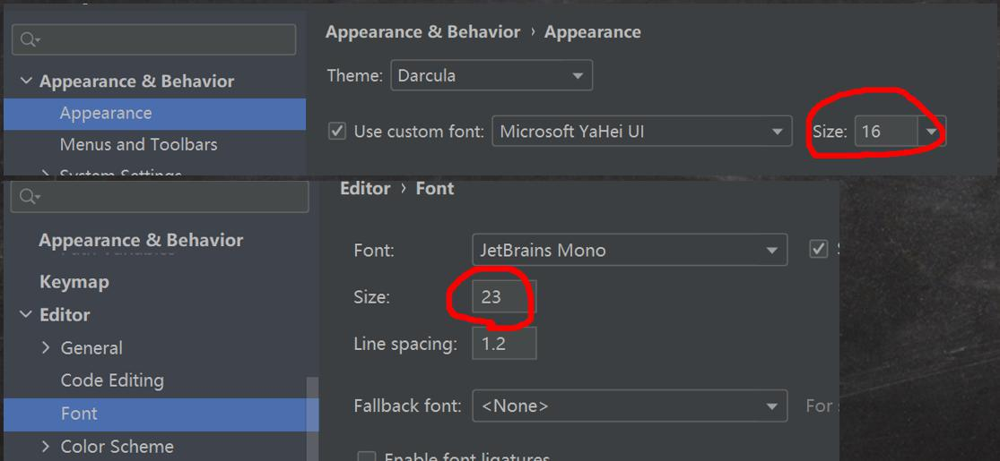
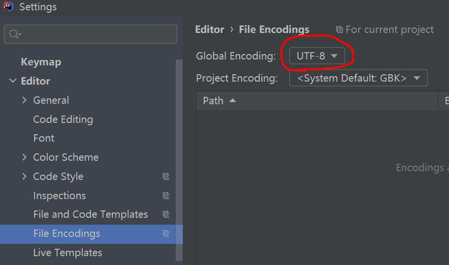

# 十七、补充

## 1、JUnit

### 1.1 为什么需要 JUnit

1）一个类有很多功能代码需要测试，为了测试，就需要写入到 main 方法中

2）如果有多个功能代码测试，就需要来回注销，切换很麻烦

3）如果可以直接运行一个方法，就方便很多，并且可以给出相关信息，就好了 -> JUnit

### 1.2 基本介绍

1）JUnit 是一个 Java 语言的单元测试框架

2）多数 Java 的开发环境都已经集成了 JUnit 作为单元测试的工具

### 1.3 使用

​	注解：@Test

## 2、IDE（集成开发环境）

### 2.1 IDEA 介绍

1）IDEA 全称 IntelliJ IDEA

2）在业界被公认为的 最好的 Java 开发工具

3）IDEA 是 JetBrains 公司的产品，总部位于捷克的首都布拉格

4）除了支持 Java 开发，还支持 HTML，CSS，PHP，MySQL，Python 等

### 2.2 Eclipse 介绍

1）Eclipse 是一个开放源代码的、基于 Java 的可扩展开发平台。

2）最初是由 IBM 公司耗资 3000 万美金开发的下一代 IDE 开发环境

3）2001 年 11 月贡献给开源社区

4）Eclipse 是目前最优秀的 Java 开发 IDE 之一

### 2.3 IDEA 的使用

1）官网: https://www.jetbrains.com/

2）IDEA 下载后，就可以开始安装。

建议：

1）使用老师讲课用的版本，学习起来比较顺畅

2）老师从官网下载的 IDEA2020.2 会提供给各位

### 2.4 IDEA 的基本介绍和使用

1）设置字体 [如图] 和 颜色主题

菜单 file -> settings

2）字符编码设置

### 2.5 IDEA 常用快捷键

1）删除当前行, 默认是 ctrl + Y 自己配置 ctrl + d

2）复制当前行, 自己配置 ctrl + alt + 向下光标

3）补全代码 alt + /

4）添加注释和取消注释 ctrl + / 【第一次是添加注释，第二次是取消注释】

5）导入该行需要的类 先配置 auto import , 然后使用 alt+enter 即可

6）快速格式化代码 ctrl + alt + L

7）快速运行程序 自己定义 alt + R

8）生成构造器等 alt + insert [提高开发效率]

9）查看一个类的层级关系 ctrl + H [学习继承后，非常有用]

10）将光标放在一个方法上，输入 ctrl + B , 可以定位到方法 [学继承后，非常有用]

11）自动的分配变量名 , 通过 在后面假 .var [老师最喜欢的]

12）还有很多其它的快捷键...

### 2.6 模板/自定义模板

​	file --> settings --> editor --> Live templates --> 查看有哪些模板快捷键/可以自己增加模板