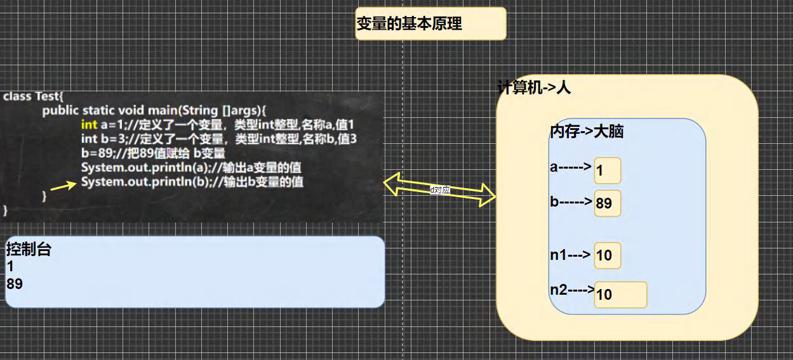
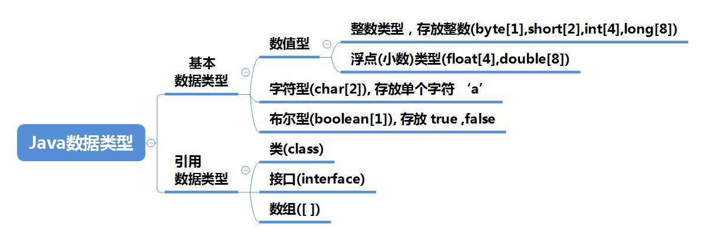
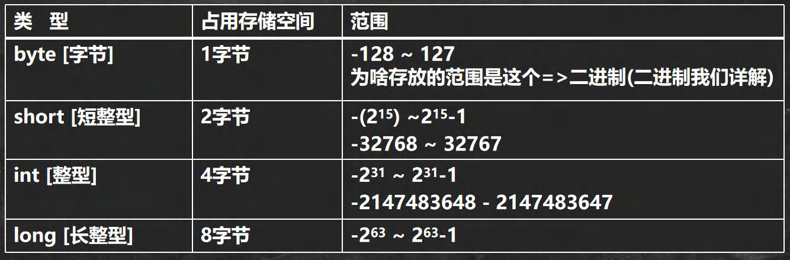
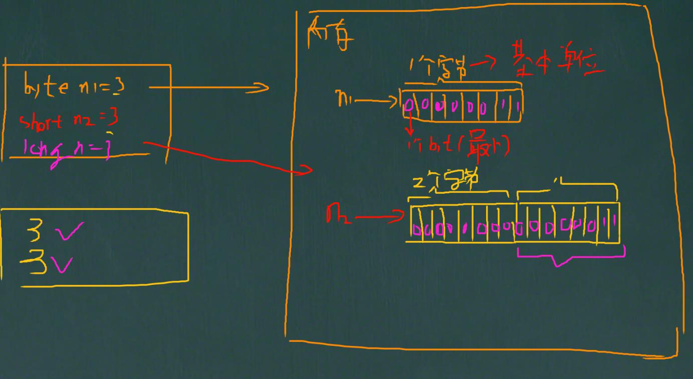
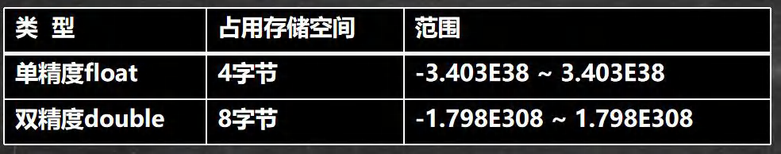
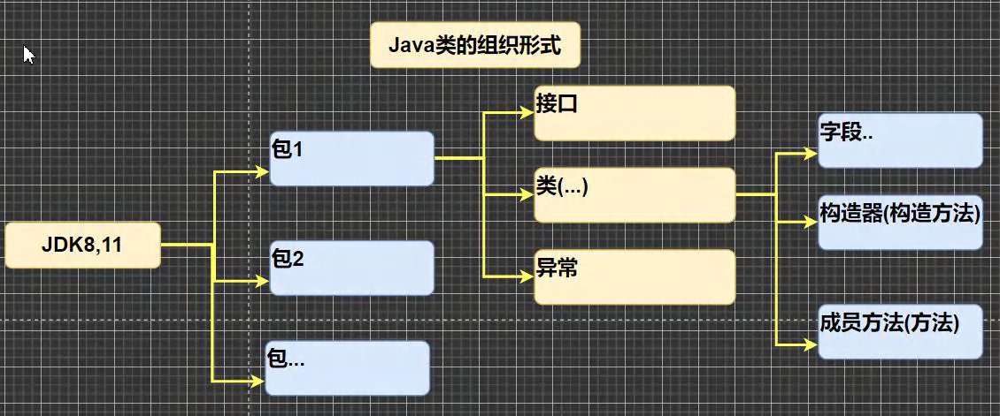
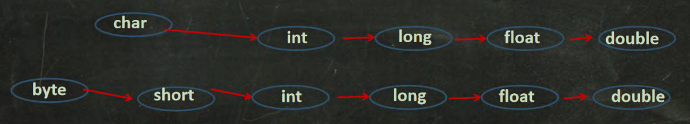

# 二、变量

## 1、为什么需要变量

### 1.1 一个程序就是一个世界

### 1.2 变量是程序的基本组成单位

​	不论是使用哪种高级程序语言编写程序，变量都是其程序的基本组成单位。

​	变量有三个基本要素(类型 + 名称 + 值)

### 1.3 简单的原理示意图



## 2、概述

### 2.1 概念

​	**变量相当于内存中一个数据存储空间的表示**，你可以把变量看做是一个房间的门牌号，通过 门牌号我们可以找到房间，而通过变量名可以访问到变量(值)。

### 2.2 变量使用的基本步骤

1）声明变量

```java
int a;
```

2）赋值

```java
a = 60; //应该这么说: 把 60 赋给 a
使用 System.out.println(a);
//也可以一步到位[int a = 60; 通常我们是一步完成]
```

### 2.3 变量使用注意事项

1）变量表示内存中的一个存储区域 [不同的变量，类型不同，占用的空间大小不同，比如：int4个字节，double就是8个字节，先有基本印象，后面说字节]

2）该区域有自己的名称 [变量名] 和 类型 [数据类型]

3）变量必须先声明，后使用，即有顺序

4）该区域的数据/值可以在**同一类型**范围内不断变化

5）变量在同一个作用域内不能重名

6） 变量 = 变量名 + 值 + 数据类型，这一点请大家注意。变量**三要素**


## 3、程序中的 + 号

1）当左右**两边都是 数值型 时**，则**做 加法运算**

2）当**左右两边有一方为字符串**，则**做拼接运算**

3）**运算顺序**，是**从左到右**

## 4、数据类型

​	每一种数据都定义了明确的数据类型，在内存中分配了不同大小的内存空间(字节)。



上图说明 [ 老韩要求小伙伴，背下来!!!!]

1）java 数据类型分为两大类 ， 基本数据类型， 引用类型

2）基本数据类型有 8 种 数值型 [byte , short , int , long , float ,double] char , boolean 型 引用类型 [类，接口， 数组]

### 4.1 整数类型

#### 4.1.1 基本介绍

​	Java 的整数类型就是用于存放整数值的，比如 12 , 30, 3456 等等

#### 4.1.2 整数的类型



#### 4.1.3 整数的使用细节

1）Java 各整数类型有固定的范围和字段长度，不受具体 OS [操作系统] 的影响，以保证 java 程序的可移植性。

2）Java 的整型常量（具体值）默认为 int 型，声明 long 型常量须后加 'l'或 'L'

3）java 程序中变量常声明为 int 型，除非不足以表示大数，才使用 long

4）bit：计算机中的最小存储单位。byte 计算机中基本存储单元，1 byte = 8 bit。

[二进制再详细说，简单举例一个byte 3 和 short 3]



### 4.2 浮点类型

#### 4.2.1 基本介绍

​	Java 的浮点类型可以表示一个小数，比如 123.4 ，7.8 ，0.12 等等

#### 4.2.2 浮点型的分类



#### 4.2.3 说明

1）关于浮点数在机器中存放形式的简单说明,浮点数 = 符号位 + 指数位 + 尾数位

2）尾数部分可能丢失，造成精度损失(小数都是近似值)。

#### 4.2.4 使用细节

1）与整数类型类似，Jva浮点类型也有固定的范围和字段长度，不受具体OS的影响。[float4个字节double是8个字节]

2）Java的浮点型常量（具体值）默认为double型，声明float型常量，须后加f'或F

3）浮点型常量有两种表示形式：

十进制数形式：如：5.12	512.0f	.512（必须有小数点)

科学计数法形式：如：5.12e2[5.12*10的2次方]	5.12E-2[5.12/10的2次方]

4）通常情况下，应该使用double型，因为它比float型更精确。[举例说明]

```java
double num9=2.1234567851:
float num10=2.1234567851F:
double num7 2.7;
```

5）浮点数使用陷阱：2.7 和 8.1/3 比较问题

```java
public class FloatDetail {
	//编写一个 main 方法
	public static void main(String[] args) {
    //Java 的浮点型常量(具体值)默认为 double 型，声明 float 型常量，须后加‘f’或‘F'
    //float num1 = 1.1; //对不对?错误
        float num2 = 1.1F; //对的
        double num3 = 1.1; //对
        double num4 = 1.1f; //对
    //十进制数形式：如：5.12 512.0f .512 (必须有小数点）
        double num5 = .123; //等价 0.123
        System.out.println(num5);
    //科学计数法形式:如：5.12e2 [5.12 * 10 的 2 次方 ] 5.12E-2 []
        System.out.println(5.12e2);//512.0
        System.out.println(5.12E-2);//0.0512
    //通常情况下，应该使用 double 型，因为它比 float 型更精确。
    //[举例说明]double num9 = 2.1234567851;float num10 = 2.1234567851F;
        double num9 = 2.1234567851;
        float num10 = 2.1234567851F;
        System.out.println(num9);
        System.out.println(num10);
    //浮点数使用陷阱: 2.7 和 8.1 / 3 比较
    //看看一段代码
        double num11 = 2.7;
        double num12 = 2.7; //8.1 / 3; //2.7
        System.out.println(num11);//2.7
        System.out.println(num12);//接近 2.7 的一个小数，而不是 2.7
    //得到一个重要的使用点: 当我们对运算结果是小数的进行相等判断是，要小心
    //应该是以两个数的差值的绝对值，在某个精度范围类判断
        if( num11 == num12) {
        	System.out.println("num11 == num12 相等");
        }
    //正确的写法 , ctrl + / 注释快捷键, 再次输入就取消注释
        if(Math.abs(num11 - num12) < 0.000001 ) {
        	System.out.println("差值非常小，到我的规定精度，认为相等...");
        }
    // 可以通过 javaAPI 来看 下一个视频介绍如何使用 API
    	System.out.println(Math.abs(num11 - num12));
    //细节:如果是直接查询得的的小数或者直接赋值，是可以判断相等
    }
}
```

### 4.3 字符类型

#### 4.3.1 基本介绍

​	字符类型可以表示单个字符,字符类型是 char，char 是两个字节(可以存放汉字)，多个字符我们用字符串 String(我们

后面详细讲解 String)

#### 4.3.2 字符类型使用细节

1）字符常量是用单引号 ('') 括起来的单个字符。例如：

```java
char c1 = 'a'; char c2 = '中'; char c3 ='9';
```

2）Java中还允许使用转义字符 `'\'` 来将其后的字符转变为特殊字符型常量。例如：

```java
char c3 = '\n';// \n 表示换行符
```

3）在 java 中，char 的本质是一个整数，在输出时，是 unicode 码对应的字符。

http://tool.chinaz.com/Tools/Unicode.aspx

4）可以直接给 char 赋一个整数，然后输出时，会按照对应的 Unicode 字符输出[97 -> a]

5）char 类型是可以进行运算的，相当于一个整数，因为它都对应有 Unicodet 码

6）字符型存储到计算机中，需要将字符对应的码值（整数）找出来，比如 'a' 

存储：'a'--> 码值97 --> 二进制 (110 0001) --> 存储

读取：二进制 (1100001) --> 97 --> 'a' --> 显示

7）字符和码值的对应关系是通过字符编码表决定的（是规定好的）

8）介绍一下字符编码表：

- ASCII（ASCII编码表 一个字节表示，一个 128 个 字符，实际上一个字节可以表示 256 个字符，只用 128 个)
- Unicode（Unicode 编码表 固定大小的编码 使用两个字节来表示字符，字母和汉字统一都是占用两个字节，这样浪费空间)
- utf-8 (编码表，大小可变的编码 字母使用 1 个字节，汉字使用 3 个字节)
- gbk (可以表示汉字，而且范围广，字母使用 1 个字节，汉字 2 个字节)
- gb2312 (可以表示汉字，gb2312 < gbk)
- big5 码（繁体中文，台湾，香港）

### 4.4 布尔类型

#### 4.4.1 基本介绍

1）布尔类型也叫 boolean 类型，booolean 类型数据只允许取值 true 和 false ,无 null

2）boolean 类型占 1 个字节。

3）boolean 类型适于逻辑运算，一般用于程序流程控制[这个后面会详细介绍]：

- if条件控制语句;
- while循环控制语句；
- do-while循环控制语句；
- for循环控制语句

## 4、javaAPI文档

1）API (Application Programming Interface,用程序编程接口)是 Java 提供的基本编程接口( java 提供的类还有相关的方法)。中文在线文档：https://www.matools.com

2）Java 语言提供了大量的基础类，因此 Oracle 公司也为这些基础类提供了相应的 API 文档，用于告诉开发者如何使用这些类，以及这些类里包含的方法。

3）Java 类的组织形式[图]



4）举例说明如何使用 ArrayList 类有哪些方法。

安：包 -> 类 -> 方法

直接索引。Math

## 5、编码

### 5.1 ASCII 码介绍(了解)

1）ASCII 码：上个世纪 60 年代，美国制定了一套字符编码（使用一个字节）对英语字符与二进制位之间的关系，做了统一规定。这被称为 ASCII 码。ASCII 的一共规定了 128 个字符的编码，只占用了一个字节的后面 7 位，最前面的 1 位统一规定为 0 。特别提示：一个字节可以表示 256 个字符，ASCII 码只用了 128 个字符。

2）看一个完整的 ASCII 码表[百度]

3）缺点：不能表示所有字符。

### 5.2 Unicode 编码介绍(了解)

1）Unicode 的好处：一种编码，将世界上所有的符号都纳入其中。每一个符号都给予一个独一无二的编码，使用 Unicode 没有乱码的问题。

2）Unicode 的缺点：一个英文字母和一个汉字都占用 2 个字节，这对于存储空间来说是浪费。

3）2 的 16 次方是 65536，所以最多编码是 65536 个字符。

4）编码 0-127 的字符是与 ASCII 的编码一样。比如 'a' 在 ASCII 码是 0x61，在 unicode 码是 ox0061,都对应 97。因此 Unicode 码兼容 ASCII 码。

### 5.3 UTF-8 编码介绍(了解)

1）UTF-8 是在互联网上使用最广的一种 Unicode 的实现方式（改进）

2）UTF-8 是一种变长的编码方式。它可以使用 1 - 6 个字节表示一个符号，根据不同的符号而变化字节长度。

3）使用大小可变的编码字母占 1 个字节，汉字占 3 个字节

## 6、类型转换

### 6.1 基本数据类型转换

#### 6.1.1  自动类型转换

1）介绍：当 java 程序在进行赋值或者运算时，精度小的类型自动转换为精度大的数据类型，这个就是自动类型转换。

2）数据类型按精度（容量）大小排序为（背，规则）：



#### 6.6.2 自动类型转换注意和细节

1）有多种类型的数据混合运算时，系统首先自动将所有数据转换成容量最大的那种数据类型，然后再进行计算。

2）当我们把精度（容量）大的数据类型赋值给精度（容量）小的数据类型时，就会报错，反之就会进行自动类型转换。

3）(byte,short) 和 char 之间不会相互自动转换

4）byte,short,char 他们三者可以计算，在计算时首先转换为 int 类型。

5）boolean 不参与转换

6）自动提升原则：表达式结果的类型自动提升为 操作数中最大的类型

#### 6.6.3 案例演示

```java
//自动类型转换细节
public class AutoConvertDetail {
    //编写一个 main 方法
    public static void main(String[] args) {
        //细节 1： 有多种类型的数据混合运算时，
        //系统首先自动将所有数据转换成容量最大的那种数据类型，然后再进行计算
        int n1 = 10; //ok
        //float d1 = n1 + 1.1;//错误 n1 + 1.1 => 结果类型是 double
        //double d1 = n1 + 1.1;//对 n1 + 1.1 => 结果类型是 double
        float d1 = n1 + 1.1F;//对 n1 + 1.1 => 结果类型是 float
        //细节 2: 当我们把精度(容量)大 的数据类型赋值给精度(容量)小 的数据类型时，
        //就会报错，反之就会进行自动类型转换。
        //
        //int n2 = 1.1;//错误 double -> int
        //细节 3: (byte, short) 和 char 之间不会相互自动转换
        //当把具体数赋给 byte 时，(1)先判断该数是否在 byte 范围内，如果是就可以
        byte b1 = 10; //对 , -128-127
        // int n2 = 1; //n2 是 int
        // byte b2 = n2; //错误，原因： 如果是变量赋值，判断类型
        //
        // char c1 = b1; //错误， 原因 byte 不能自动转成 char
        //
        //
        //细节 4: byte，short，char 他们三者可以计算，在计算时首先转换为 int 类型
        byte b2 = 1;
        byte b3 = 2;
        short s1 = 1;
        //short s2 = b2 + s1;//错, b2 + s1 => int
        int s2 = b2 + s1;//对, b2 + s1 => int
        //byte b4 = b2 + b3; //错误: b2 + b3 => int
        //
        //boolean 不参与转换
        boolean pass = true;
        //int num100 = pass;// boolean 不参与类型的自动转换
        //自动提升原则： 表达式结果的类型自动提升为 操作数中最大的类型
        //看一道题
        byte b4 = 1;
        short s3 = 100;
        int num200 = 1;
        float num300 = 1.1F;
        double num500 = b4 + s3 + num200 + num300; //float -> double
    }
}
```

#### 6.6.4 强制类型转换

​	介绍：自动类型转换的逆过程， **将容量大的数据类型转换为容量小的数据类型**。使用时要加上强制转换符 ( )，但可能造成**精度降低或溢出**，格外要注意。

##### 1）细节说明：

1）当进行数据的大小从 大一>小 ，就需要使用到强制转换

2）强转符号只针对于最近的操作数有效，往往会使用小括号提升优先级

```java
//int x = (int)10 * 3.5 + 6 * 1.5;
int y = (int)(10 * 3.5 + 6 * 1.5);
System.out.println(y);
```

3）char 类型可以保存 int 的常量值，但不能保存 int 的变量值，需要强转

```java
char c1 = 100; //ok
int m = 100; //ok
char c2 = m; //错误
char c3 = (char)m; //ok
System.out.println(c3); //100对应的字符
```

4）byte 和 short,char 类型在进行运算时，当做 int 类型处理。

### 6.2 基本数据类型和 String 类型的转换

参考包装类与 String 类型的互相转换

代码演示：

```java
public class StringToBasic {
	//编写一个 main 方法
    public static void main(String[] args) {
        //基本数据类型->String
        int n1 = 100;
        float f1 = 1.1F;
        double d1 = 4.5;
        boolean b1 = true;
        String s1 = n1 + "";
        String s2 = f1 + "";
        String s3 = d1 + "";
        String s4 = b1 + "";
        System.out.println(s1 + " " + s2 + " " + s3 + " " + s4);
        //String->对应的基本数据类型
        String s5 = "123";
        //会在 OOP 讲对象和方法的时候回详细
        //解读 使用 基本数据类型对应的包装类，的相应方法，得到基本数据类型
        int num1 = Integer.parseInt(s5);
        double num2 = Double.parseDouble(s5);
        float num3 = Float.parseFloat(s5);
        long num4 = Long.parseLong(s5);
        byte num5 = Byte.parseByte(s5);
        boolean b = Boolean.parseBoolean("true");
        short num6 = Short.parseShort(s5);
        System.out.println("===================");
        System.out.println(num1);//123
        System.out.println(num2);//123.0
        System.out.println(num3);//123.0
        System.out.println(num4);//123
        System.out.println(num5);//123
        System.out.println(num6);//123
        System.out.println(b);//true
        // 怎么把字符串转成字符 char -> 指 含义是指 把字符串的第一个字符得到
        //解读 s5.charAt(0) 得到 s5 字符串的第一个字符 '1'
        System.out.println(s5.charAt(0));
    }
}
```


**注意事项**：

1）在将 String 类型转成 基本数据类型时，要确保 String 类型能够转成有效的数据 ，比如 我们可以把 "123" , 转成一个整数，但是不能把 "hello" 转成一个整数

2）如果格式不正确，就会 抛出异常，程序就会终止， 这个问题在异常处理章节中，会处理

```java
/**
* 演示字符串转基本数据类型的细节
*/
public class StringToBasicDetail {
    //编写一个 main 方法
    public static void main(String[] args) {
        String str = "hello";
        //转成 int
        int n1 = Integer.parseInt(str);
        System.out.println(n1);
	}
}
```

