# 三、运算符

## 1、概述

​	运算符是一种特殊的符号，用以表示数据的运算、赋值和比较等。

## 2、算术运算符

### 2.1 介绍

​	算术运算符是对数值类型的变量进行运算的，在 Java 程序中使用的非常多。

### 2.2 算术运算符一览

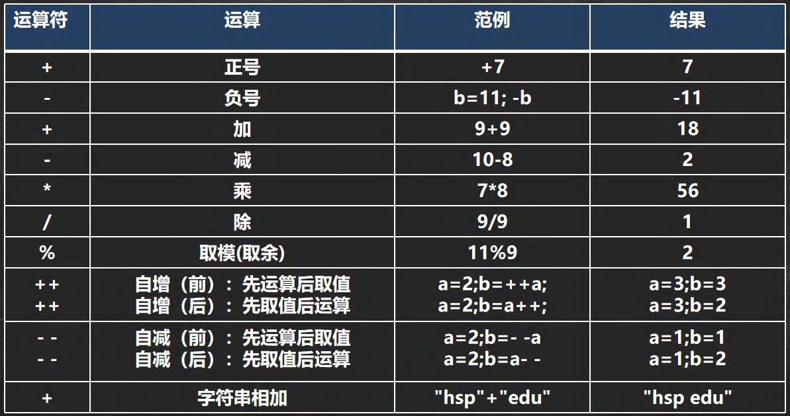

### 2.3 案例演示

1）+ ， - ， * ， / , % , ++ , -- , 重点讲解 /、 % 、++

2）自增：++

作为独立的语句使用：

前 ++ 和 后 ++ 都完全等价于 i = i + 1;

作为表达式使用

前 ++ ：++ 先自增后赋值

后 ++ ：i ++ 先赋值后自增

3）-- ，+ 、- 、* 是一个道理，完全可以类推。

```java
/**
* 演示算术运算符的使用
*/
public class ArithmeticOperator {
    //编写一个 main 方法
    public static void main(String[] args) {
        // /使用
        System.out.println(10 / 4); //从数学来看是 2.5, java 中 2
        System.out.println(10.0 / 4); //java 是 2.5
        // 注释快捷键 ctrl + /, 再次输入 ctrl + / 取消注释
        double d = 10 / 4;//java 中 10 / 4 = 2, 2=>2.0
        System.out.println(d);// 是 2.0
        // % 取模 ,取余
        // 在 % 的本质 看一个公式!!!! a % b = a - a / b * b
        // -10 % 3 => -10 - (-10) / 3 * 3 = -10 + 9 = -1
        // 10 % -3 = 10 - 10 / (-3) * (-3) = 10 - 9 = 1
        // -10 % -3 = (-10) - (-10) / (-3) * (-3) = -10 + 9 = -1
        System.out.println(10 % 3); //1
        System.out.println(-10 % 3); // -1
        System.out.println(10 % -3); //1
        System.out.println(-10 % -3);//-1
        //++的使用
        //
        int i = 10;
        i++;//自增 等价于 i = i + 1; => i = 11
        ++i;//自增 等价于 i = i + 1; => i = 12
        System.out.println("i=" + i);//12
        /*
        作为表达式使用
        前++：++i 先自增后赋值
        后++：i++先赋值后自增
        */
        int j = 8;
        //int k = ++j; //等价 j=j+1;k=j;
        int k = j++; // 等价 k =j;j=j+1;
        System.out.println("k=" + k + "j=" + j);//8 9
    }
}
```

### 2.4 细节说明

1）对于除号 "/" ，它的整数除和小数除是有区别的：整数之间做除法时，只保留整数部分而舍弃小数部分。

例如：int x = 10 / 3; 结果是3

2）当对一个数取模时，可以等价 a % b = a - a / b * b,这样我们可以看到取模的一个本质运算。

3）当 自增 当做一个独立语言使用时，不管是 ++i；还是 i++; 都是一样的，等价

4）当 自增 当做一个 表达式使用时 j = ++i 等价[?]

5）当 自增 当做一个 表达式使用时 j = i++ 等价[?]

### 2.5 面试题

1）面试题1

```java
int i = 1; //i -> 1
i = i++; //规则使用临时变量：(1)temp=i(2)i=i+1:(3)i=temp:
System.out.println(i); //1
```

问：结果是多少？为什么？

2）面试题2

```java
int i = 1;
i = ++i; //规则使用临时变量：(1)i=i+1;(2)temp=i:(3)i=temp;
System.out.printlIn(i); //2
```

### 2.6 课堂练习

```java
//练习
public class ArithmeticOperatorExercise01 {
	//编写一个 main 方法
	public static void main(String[] args) {
        // int i = 1;//i->1
        // i = i++; //规则使用临时变量: (1) temp=i;(2) i=i+1;(3)i=temp;
        // System.out.println(i); // 1
        // int i=1;
        // i=++i; //规则使用临时变量: (1) i=i+1;(2) temp=i;(3)i=temp;
        // System.out.println(i); //2
        //
        // 测试输出
        int i1 = 10;
        int i2 = 20;
        int i = i1++;
        System.out.print("i="+i);//10
        System.out.println("i2="+i2);//20
        i = --i2;
        System.out.print("i="+i);//19
        System.out.println("i2="+i2);//19
    }
}
```

```java
//课堂练习
public class ArithmeticOperatorExercise02 {
    //编写一个 main 方法
    public static void main(String[] args) {
        //1.需求:
        //假如还有 59 天放假，问：合 xx 个星期零 xx 天
        //2.思路分析
        //(1) 使用 int 变量 days 保存 天数
        //(2) 一个星期是 7 天 星期数 weeks： days / 7 零 xx 天 leftDays days % 7
        //(3) 输出
        //3.走代码
        int days = 25911;
        int weeks = days / 7;
        int leftDays = days % 7;
        System.out.println(days + "天 合" + weeks + "星期零" + leftDays + "天");
        //1.需求
        //定义一个变量保存华氏温度，华氏温度转换摄氏温度的公式为
        //：5/9*(华氏温度-100),请求出华氏温度对应的摄氏温度
        //
        //2 思路分析
        //(1) 先定义一个 double huaShi 变量保存 华氏温度
        //(2) 根据给出的公式，进行计算即可 5/9*(华氏温度-100)
        // 考虑数学公式和 java 语言的特性
        //(3) 将得到的结果保存到 double sheShi
        //3 走代码
        double huaShi = 1234.6;
        double sheShi = 5.0 / 9 * (huaShi - 100);
        System.out.println("华氏温度" + huaShi
        + " 对应的摄氏温度=" + sheShi);
    }
}
```

## 3、关系运算符

### 3.1 介绍

1）关系运算符的结果都是 boolean 型，也就是要么是 true，要么是 false

2）关系表达式 经常用在 if 结构的条件中或循环结构的条件中

### 3.2 关系运算符一览

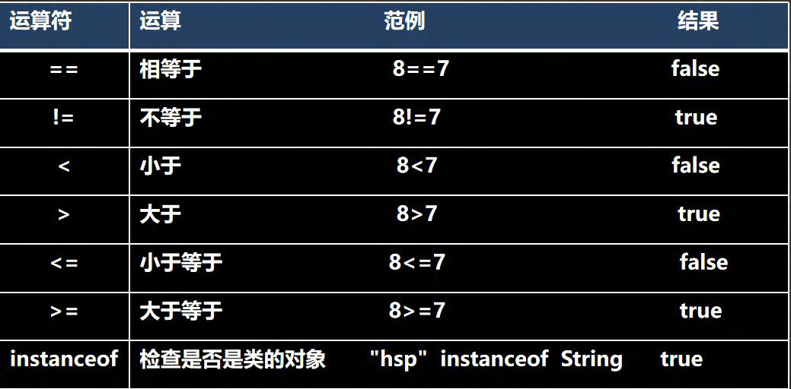

### 3.3 细节说明

1）关系运算符的结果都是 boolean 型，也就是要么是 true，要么是 false。

2）关系运算符组成的表达式，我们称为关系表达式。 a > b

3）比较运算符"=="不能误写成"="

## 4、逻辑运算符

### 4.1 介绍

​	用于连接多个条件（多个关系表达式），最终的结果也是一个 boolean 值。

### 4.2 逻辑运算符一览

分为两组学习

1）短路与 && ， 短路或 ||，取反 !

2）逻辑与 &，逻辑或 |，^ 逻辑异或

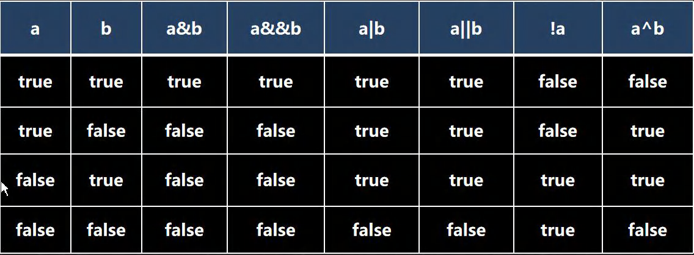

说明逻辑运算规则：

3）a&b : & 叫逻辑与：规则：当 a 和 b 同时为 true ,则结果为 true, 否则为 false

4）a&&b : && 叫短路与：规则：当 a 和 b 同时为 true ,则结果为 true,否则为 false

5）a|b : | 叫逻辑或，规则：当 a 和 b ，有一个为 true ,则结果为 true,否则为 false

6）a||b : || 叫短路或，规则：当 a 和 b ，有一个为 true ,则结果为 true,否则为 false

7）!a : 叫取反，或者非运算。当 a 为 true, 则结果为 false, 当 a 为 false 是，结果为 true

8）a^b: 叫逻辑异或，当 a 和 b 不同时，则结果为 true, 否则为 false

### 4.3 && 和 & 基本规则

| 名称      | 语法             | 特点                                      |
| --------- | ---------------- | ----------------------------------------- |
| 短路与 && | 条件 1 && 条件 2 | 两个条件都为 true，结果为 true,否则 false |
| 逻辑与 &  | 条件 1 & 条件 2  | 两个条件都为 true，结果为 true,否则 false |

#### 4.3.1 案例演示

```java
/**
* 演示逻辑运算符的使用
*/
public class LogicOperator01 {
    //编写一个 main 方法
    public static void main(String[] args) {
        //&&短路与 和 & 案例演示
        int age = 50;
        if(age > 20 && age < 90) {
        	System.out.println("ok100");
        }
        //&逻辑与使用
        if(age > 20 & age < 90) {
        	System.out.println("ok200");
        }
        //区别
        int a = 4;
        int b = 9;
        //对于&&短路与而言，如果第一个条件为 false ,后面的条件不再判断
        //对于&逻辑与而言，如果第一个条件为 false ,后面的条件仍然会判断
        if(a < 1 & ++b < 50) {
        	System.out.println("ok300");
        }
        System.out.println("a=" + a + " b=" + b);// 4 10
    }
}
```

#### 4.3.2 && 和 & 使用区别

1）&& 短路与：如果第一个条件为 false，则第二个条件不会判断，最终结果为 false，效率高

2）& 逻辑与：不管第一个条件是否为 false，第二个条件都要判断，效率低

3）开发中， 我们使用的基本是使用短路与&&, 效率高

### 4.4 || 和 | 基本规则

| 名称        | 语法               | 特点                                               |
| ----------- | ------------------ | -------------------------------------------------- |
| 短路或 \|\| | 条件 1 \|\| 条件 2 | 两个条件中只要有一个成立，结果为 true,否则为 false |
| 逻辑或 \|   | 条件 1 \| 条件 1   | 只要有一个条件成立，结果为 true,否则为 false       |

#### 4.4.1 案例演示

```java
//演示| || 使用
public class LogicOperator02 {
    //编写一个 main 方法
    public static void main(String[] args) {
        //||短路或 和 |逻辑或 案例演示
        //|| 规则: 两个条件中只要有一个成立，结果为 true,否则为 false
        //| 规则: 两个条件中只要有一个成立，结果为 true,否则为 false
        int age = 50;
        if(age > 20 || age < 30) {
        	System.out.println("ok100");
        }
        //&逻辑与使用
        if(age > 20 | age < 30) {
        	System.out.println("ok200");
        }
        //看看区别
        //(1)||短路或：如果第一个条件为 true，
        //则第二个条件不会判断，最终结果为 true，效率高
        //(2)| 逻辑或：不管第一个条件是否为 true，第二个条件都要判断，效率低
        int a = 4;
        int b = 9;
        if( a > 1 || ++b > 4) { // 可以换成 | 测试
        	System.out.println("ok300");
        }
        System.out.println("a=" + a + " b=" + b); //4 10
    }
}
```

#### 4.4.2 || 和 | 使用区别

1）|| 短路或：如果第一个条件为 true，则第二个条件不会判断，最终结果为 true，效率高

2）| 逻辑或：不管第一个条件是否为 true，第二个条件都要判断，效率低

3）开发中，我们基本使用 ||

### 4.5 ！取反

#### 4.5.1 基本规则

| 名称         | 语法   | 特点                                        |
| ------------ | ------ | ------------------------------------------- |
| ！非（取反） | ！条件 | 如果条件本身成立，结果为 false，否则为 true |

### 4.6 ^ 逻辑异或

#### 4.6.1 基本规则

| 名称       | 语法            | 特点                                                  |
| ---------- | --------------- | ----------------------------------------------------- |
| ^ 逻辑异或 | 条件 1 ^ 条件 2 | 当 条件1 和 条件2 不同时，则结果为 true, 否则为 false |

#### 4.6.2 案例演示

```java
//!和^案例演示
public class InverseOperator {
    //编写一个 main 方法
    public static void main(String[] args) {
        //! 操作是取反 T->F , F -> T
        System.out.println(60 > 20); //T
        System.out.println(!(60 > 20)); //F
        //a^b: 叫逻辑异或，当 a 和 b 不同时，则结果为 true, 否则为 false
        boolean b = (10 > 1) ^ ( 3 > 5);
        System.out.println("b=" + b);//T
    }
}
```


## 5、赋值运算符

### 5.1 介绍

​	赋值运算符就是将某个运算后的值，赋给指定的变量。

### 5.2 赋值运算符的分类

1）基本赋值运算符： = 

案例：int a = 10;

2）复合赋值运算符：+= ，-= ，*= ， /= ，%= 等 , 

重点讲解一个 += ，其它的使用是一个道理

案例1：a += b; [等价 a = a + b; ]

案例2：a -= b; [等价 a = a - b; ]

### 5.3 案例演示

```java
//演示赋值运算符的使用
public class AssignOperator {
    //编写一个 main 方法
    public static void main(String[] args) {
        int n1 = 10;
        n1 += 4;// n1 = n1 + 4;
        System.out.println(n1); // 14
        n1 /= 3;// n1 = n1 / 3;//4
        System.out.println(n1); // 4
        //复合赋值运算符会进行类型转换
        byte b = 3;
        b += 2; // 等价 b = (byte)(b + 2);
        b++; // b = (byte)(b+1);
    }
}
```

### 5.4 赋值运算符特点

1）运算顺序从右往左 

int num = a + b + c;

2）赋值运算符的左边 只能是变量,右边 可以是变量、表达式、常量值

int num = 20;

int num2= 78 * 34 - 10; 

int num3 = a;

3）复合赋值运算符等价于下面的效果

比如：a+=3;等价于 a=a+3; 其他类推

4）复合赋值运算符会进行类型转换。

byte b = 2; b+=3; b++;

## 6、三元运算符

### 6.1 基本语法

​	**条件表达式 ? 表达式 1: 表达式 2;**

### 6.2 运算规则

1）如果条件表达式为 true，运算后的结果是表达式 1；

2）如果条件表达式为 false，运算后的结果是表达式 2；

口诀: [一灯大师： 一真大师]

### 6.3 案例演示

```java
//三元运算符使用
public class TernaryOperator {
    //编写一个 main 方法
    public static void main(String[] args) {
        int a = 10;
        int b = 99;
        // 解读
        // 1. a > b 为 false
        // 2. 返回 b--, 先返回 b 的值,然后在 b-1
        // 3. 返回的结果是 99
        int result = a > b ? a++ : b--;
        System.out.println("result=" + result);
        System.out.println("a=" + a);
        System.out.println("b=" + b);
    }
}
```

### 6.4 使用细节

1）表达式 1 和 表达式 2 要为可以赋给接收变量的类型(或可以自动转换)

2）三元运算符可以转成 if--else 语句

```java
//三元运算符细节
public class TernaryOperatorDetail {
    //编写一个 main 方法
    public static void main(String[] args) {
        //表达式 1 和表达式 2 要为可以赋给接收变量的类型
        //(或可以自动转换/或者强制转换)
        int a = 3;
        int b = 8;
        int c = a > b ? (int)1.1 : (int)3.4;//可以的
        double d = a > b ? a : b + 3;//可以的，满足 int -> double
    }
}
```

## 7、运算符优先级

1）运算符有不同的优先级，所谓优先级就是表达式运算中的运算顺序。如右表，上一行运算符总优先于下一行。

2）只有单目运算符、赋值运算符是从右向左运算的。

3）一览表, 不要背，使用多了，就熟悉了。

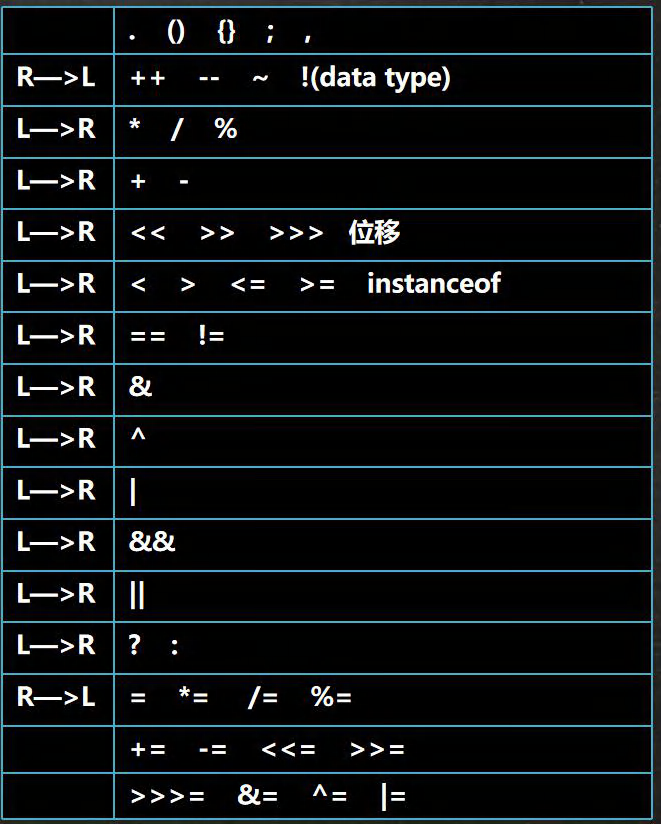


## 8、标识符的命名规则和规范

### 8.1 标识符概念

1）Java 对各种变量、方法和类等命名时使用的字符序列称为标识符

2）凡是自己可以起名字的地方都叫标识符 int num1 = 90; 

### 8.2 标识符的命名规则（必须遵守）

1）由 26 个英文字母大小写，0 - 9，_ 或 $ 组成

2）数字不可以开头。

int 3ab = 1; //错误

3）不可以使用 关键字 和 保留字 ，但能包含 关键字 和 保留字 。

4）Java中严格区分大小写，长度无限制。

int totalNum = 10;

int n = 90;

5）标识符不能包含空格。

int a b=90; //错误

### 8.3 标识符命名规范[更加专业]

1）**包名**：多单词组成时所有字母都小写：aaa.bbb.ccc //比如 com.hsp.crm

2）**类名**、接口名：多单词组成时，所有单词的首字母大写：XxxYyyZzz [大驼峰]

比如： TankShotGame

3）**变量名、方法名**：多单词组成时，第一个单词首字母小写，第二个单词开始每个单词首字母大写：xxxYyyZzz [小驼峰， 简称 驼峰法]

比如： tankShotGame

4）**常量名**：所有字母都大写。多单词时每个单词用下划线连接：XXX_YYY_ZZZ

比如 ：定义一个所得税率 TAX_RATE

5）后面我们学习到 类，包，接口，等时，我们的命名规范要这样遵守,更加详细的看文档。

## 9、关键字

### 9.1 关键字的定义和特点 (不用背)

定义：被 Java 语言赋予了特殊含义，用做 专门用途的字符串（单词）

特点：关键字中所有字母都为小写

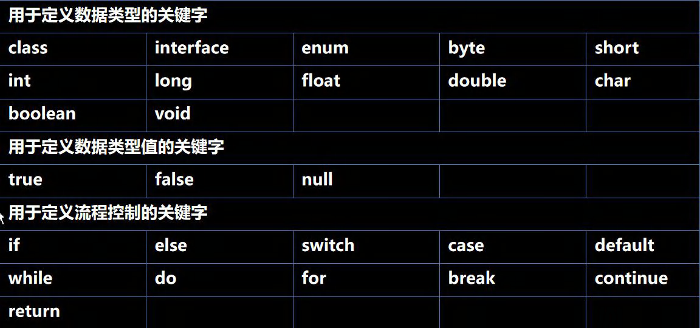

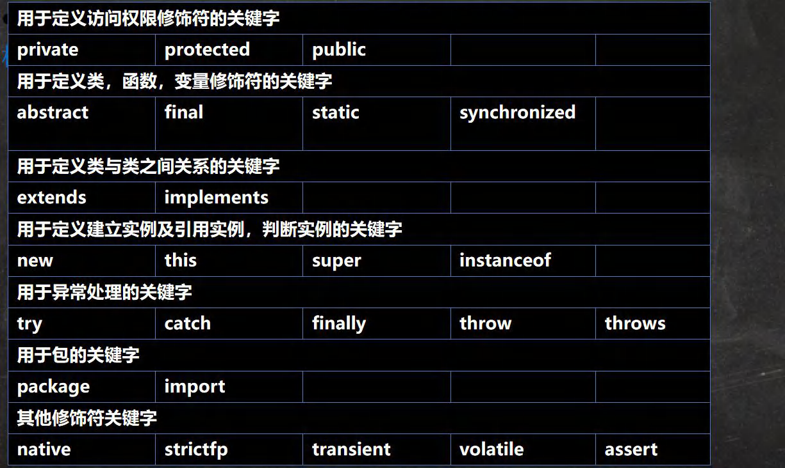

## 10、保留字

### 10.1 介绍

​	Java 保留字：现有 Java 版本 尚未使用，但 以后版本可能会作为关键字使用。自己命名标识符时要避免使用这些保留字 byValue、cast、future、 generic、 inner、 operator、 outer、 rest、 var 、 goto 、const

## 11、键盘输入语句

### 11.1 介绍

​	在编程中，需要接收用户输入的数据，就可以使用键盘输入语句来获取。Input.java , 需要一个 扫描器(对象), 就是 Scanner

### 11.2 步骤

1）导入该类的所在包, java.util.*

2）创建该类对象（声明变量）

3）调用里面的功能

### 11.3 案例演示

```java
import java.util.Scanner;//表示把 java.util 下的 Scanner 类导入
public class Input {
    //编写一个 main 方法
    public static void main(String[] args) {
        //演示接受用户的输入
        //步骤
        //Scanner 类 表示 简单文本扫描器，在 java.util 包
        //1. 引入/导入 Scanner 类所在的包
        //2. 创建 Scanner 对象 , new 创建一个对象,体会
        // myScanner 就是 Scanner 类的对象
        Scanner myScanner = new Scanner(System.in);
        //3. 接收用户输入了， 使用 相关的方法
        System.out.println("请输入名字");
        //当程序执行到 next 方法时，会等待用户输入~~~
        String name = myScanner.next(); //接收用户输入字符串
        System.out.println("请输入年龄");
        int age = myScanner.nextInt(); //接收用户输入 int
        System.out.println("请输入薪水");
        double sal = myScanner.nextDouble(); //接收用户输入 double
        System.out.println("人的信息如下:");
        System.out.println("名字=" + name + " 年龄=" + age + " 薪水=" + sal);
    }
}
```

## 12、进制转换

### 12.1 进制介绍

对于整数，有四种表示方式：

1）二进制：0,1 ，满 2 进 1.以 0b 或 0B 开头。

2）十进制：0-9 ，满 10 进 1。

3）八进制：0-7 ，满 8 进 1. 以数字 0 开头表示。

4）十六进制：0-9 及 A(10)-F(15)，满 16 进 1. 以 0x 或 或 0X 开头表示。此处的 A-F 不区分大小写。

### 12.2 进制图示

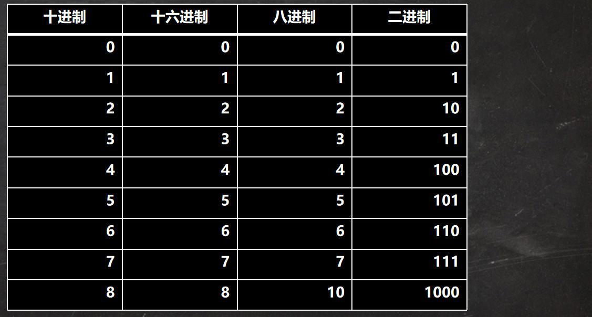

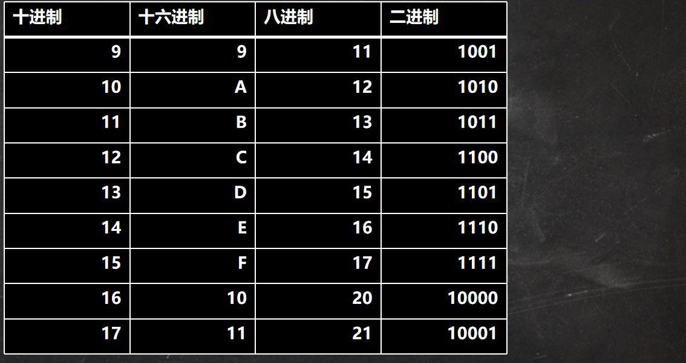

### 12.3 其他进制转 十进制

#### 12.3.1 二进制 转 十进制

​	规则：从最低位（右边）开始，将每个位上的数提取出来，乘以2的（位数-1）次方，然后求和。

案例：请将 0b1011 转成十进制的数

0b1011 = 1 * 2 的 ( 1 - 1 ) 次方 + 1 * 2 的 ( 2 - 1 ) 次方 + 0 * 2 的 ( 3 - 1 ) 次方 + 1 * 2 的 ( 4 - 1 ) 次方法 = 1 + 2 + 0 + 8 = 11

#### 12.3.2 八进制 转 十进制

​	规则：从最低位（右边）开始，将每个位上的数提取出来，乘以8的（位数-1）次方，然后求和。

​	案例：请将 0234 转成十进制的数

​	0234 = 4 * 8 ^ 0 + 3 * 8 ^ 1 + 2 * 8 ^ 2 = 4 + 24 + 128 = 156

#### 12.3.3 十六进制 转 十进制

​	规则：从最低位(右边)开始，将每个位上的数提取出来，乘以 16 的(位数-1)次方，然后求和。

​	案例：请将 0x23A 转成十进制的数

​	0x23A = 10 * 16^0 + 3 * 16 ^ 1 + 2 * 16^2 = 10 + 48 + 512 = 570

### 12.4 十进制转 其他

#### 12.4.1 十进制 转 二进制

​	规则：将该数不断除以 2，直到商为 0 为止，然后将每步得到的余数倒过来，就是对应的二进制。

​	案例：请将 34 转成二进制 = 0B00100010

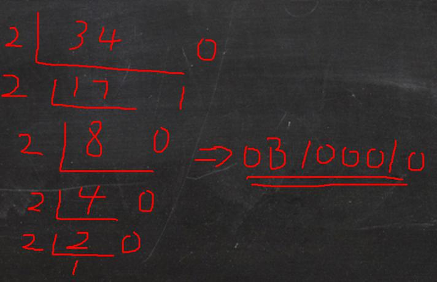

#### 12.4.2 十进制 转 八进制

​	规则：将该数不断除以 8，直到商为 0 为止，然后将每步得到的余数倒过来，就是对应的八进制。

​	案例：请将 131 转成八进制 => 0203

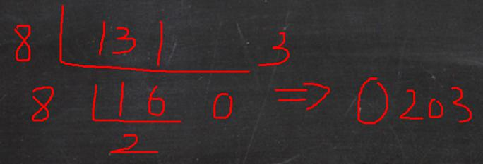

#### 12.4.3 十进制 转 十六进制

​	规则：将该数不断除以 16，直到商为 0 为止，然后将每步得到的余数倒过来，就是对应的十六进制。

​	案例：请将 237 转成十六进制 => 0xED

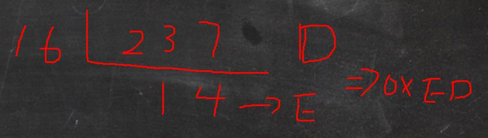

### 12.5 二进制 转 其他

#### 12.5.1 二进制 转 八进制

​	规则：从低位开始,将二进制数每三位一组，转成对应的八进制数即可。

​	案例：请将 ob11010101 转成八进制

​	ob11(3)010(2)101(5) => 0325

#### 12.5.2 二进制 转 十六进制

​	规则：从低位开始，将二进制数每四位一组，转成对应的十六进制数即可。

​	案例：请将 ob11010101 转成十六进制

​	ob1101(D)0101(5) = 0xD5

### 12.6 其他进制 转 二进制

#### 12.6.1 八进制 转 二进制

​	规则：将八进制数每 1 位，转成对应的一个 3 位的二进制数即可。

​	案例：请将 0237 转成二进制

​	02(010)3(011)7(111) = 0b10011111

#### 12.6.2 十六进制 转 二进制

​	规则：将十六进制数每 1 位，转成对应的 4 位的一个二进制数即可。

​	案例：请将 0x23B 转成二进制

​	0x2(0010)3(0011)B(1011) = 0b001000111011

### 12.7  二进制在运算中的说明

1）二进制是逢 2 进位的进位制，0、1 是基本算符。

2）现代的电子计算机技术全部采用的是二进制，因为它只使用 0、1 两个数字符号，非常简单方便，易于用电子方式实现。计算机内部处理的信息，都是采用二进制数来表示的。二进制 (Binary) 数用 0 和 1 两个数字及其组合来表示任何数。进位规则是 "逢 2 进 1 ” ，数字 1 在不同的位上代表不同的值，按从右至左的次序，这个值以二倍递增。

## 13、位运算符

### 13.1 java 种有 7 个位运算符

| 名称         | 作用                                          |
| ------------ | --------------------------------------------- |
| 按位与 &     | 两位全为1，结果为1，否则为0                   |
| 按位或 \|    | 两位有一个为1，结果为1，否则为0               |
| 按位异或 ^   | 两位一个为0，一个为1，结果为1，否则为0        |
| 按位取反 ~   | 0 变 1 ，1 变 0 。 0 -> 1,1 -> 0              |
| 算术右移 >>  | 低位溢出,符号位不变,并用符号位补溢出的高位    |
| 算术左移 <<  | 符号位不变,低位补 0                           |
| 逻辑右移 >>> | 也叫无符号右移,运算规则是: 低位溢出，高位补 0 |

特别说明：没有 <<< 符号

### 13.2 应用详解

运算规则是：将数值转换为二进制，然后按位比较 (个位与个位比，十位与十位比，然后比较规则则是运算规则)

1）运算符案例

例如：2 & 3 ==> 10(2) & 11(3) ==> 10(2)(个位分别是 0 和 1，所以取 0，十位都是 1 ，所以取 1 ，其他运算符同理)

2）算术左右移案例

例如：

- int a = 1 >> 2; //1 => 00000001 => 00000000 本质 1 / 2 / 2 = 0

- int c = 1 << 2; //1 => 00000001 => 00000100 本质 1 * 2 * 2 = 4

### 13.3 JAVA 为什么没有 无符号左移 <<<

因为左移是在后面补0，而右移是在前面边补1或0，有无符号是取决于数的前面的第一位是0还是1，所以右移是会产生到底补1还是0的问题。而左移始终是在右边补，不会产生符号问题。所以没有必要无符号左移<<<。无符号左移<<<和左移<<是一样的概念

## 14、原码、补码、反码

网上对原码，反码，补码的解释过于复杂，我这里精简几句话：（背下来）

对于有符号的而言：

1）二进制的最高位是符号位：0 表示正数，1 表示负数（老韩口诀：0 --> 0;1 --> -）

2）正数的原码，反码，补码都一样（三码合一）

3）负数的反码 = 它的原码符号位不变，其它位取反(0 --> 1,1 --> 0)

4）负数的补码 = 它的反码 + 1，负数的反码 = 负数的补码 - 1

5）0 的反码，补码都是 0

6）java 没有无符号数，换言之，java 中的数都是有符号的

7）在计算机运算的时候，都是以补码的方式来运算的

8）当我们看运算结果的时候，要看他的原码（重点）


**建议**：掌握老师讲解的即可，不用再深入。

