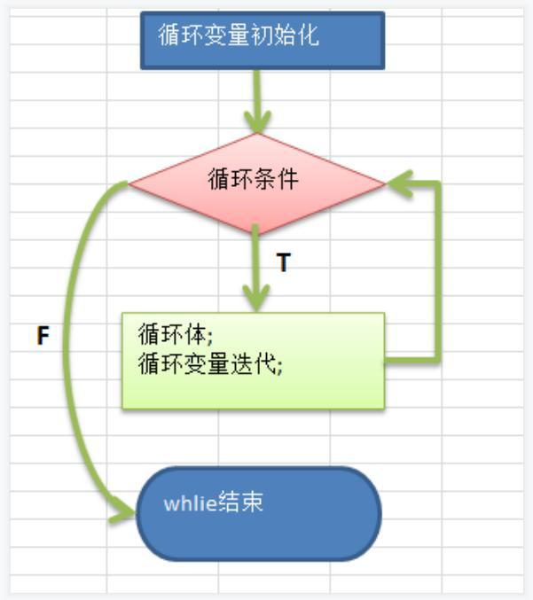

# 四、程序控制结构

## 1、概述

​	在程序中，程序运行的流程控制决定程序是如何执行的，是我们必须掌握的，主要有三大流程控制语句。

1）顺序控制

2）分支控制

3）循环控制

## 2、顺序控制

​	程序从上到下逐行地执行，中间没有任何判断和跳转。


### 2.1 顺序控制举例和注意事项

Java中定义变量时采用合法的前向引用。如：

```java
public class Test{
int num1 = 12;
int num2 = num1 + 2;
}

//错误形式：
public class Test{
int num2 = num1 + 2;/错误
int num1 = 12;
}
```

## 3、分支控制 if-else

### 3.1 基本介绍

​	让程序有选择的的执行,分支控制有三种

1）单分支 if

2）双分支 if-else

3）多分支 if-else if -....-else

### 3.2 单分支

#### 1）基本语法

```java
if(条件表达式){
    执行代码块;(可以有多条语句)
}
```

#### 2）说明

​	当条件表达式为 ture 时，就会执行 {} 的代码。如果为 false ，就不执行。

​	特别说明：如果 {} 中只有一条语句，则可以不用 {} ，韩老师建议写上 {}

#### 3）案例

```java
//if 的快速入门
import java.util.Scanner;//导入
public class If01 {
    //编写一个 main 方法
    public static void main(String[] args) {
        //编写一个程序,可以输入人的年龄,如果该同志的年龄大于 18 岁,
        //则输出 "你年龄大于 18,要对自己的行为负责,送入监狱"
        //
        //思路分析
        //1. 接收输入的年龄, 应该定义一个 Scanner 对象
        //2. 把年龄保存到一个变量 int age
        //3. 使用 if 判断，输出对应信息
        //应该定义一个 Scanner 对象
        Scanner myScanner = new Scanner(System.in);
        System.out.println("请输入年龄");
        //把年龄保存到一个变量 int age
        int age = myScanner.nextInt();
        //使用 if 判断，输出对应信息
        if(age > 18) {
        	System.out.println("你年龄大于 18,要对自己的行为负责,送入监狱");
        }
        System.out.println("程序继续...");
    }
}
```

#### 4）流程图


### 3.3 双分支

#### 1）基本语法

```java
if(条件表达式){
    执行代码块1;
}
else{
    执行代码块2;
}
```

#### 2）说明

​	当条件表达式成立，即执行 代码块1，否则执行 代码块2，如果执行代码块只有一条语句，则 {} 可以省略，否则，不能省略。

#### 3）案例

```java
//if-else 的快速入门
import java.util.Scanner;//导入
public class If02 {
//编写一个 main 方法
    public static void main(String[] args) {
        //编写一个程序,可以输入人的年龄,如果该同志的年龄大于 18 岁,
        //则输出 "你年龄大于 18,要对
        //自己的行为负责, 送入监狱"。否则 ,输出"你的年龄不大这次放过你了."
        //
        //思路分析
        //1. 接收输入的年龄, 应该定义一个 Scanner 对象
        //2. 把年龄保存到一个变量 int age
        //3. 使用 if-else 判断，输出对应信息
        //应该定义一个 Scanner 对象
        Scanner myScanner = new Scanner(System.in);
        System.out.println("请输入年龄");
        //把年龄保存到一个变量 int age
        int age = myScanner.nextInt();
        //使用 if-else 判断，输出对应信息
        if(age > 18) {
        	System.out.println("你年龄大于 18,要对自己的行为负责,送入监狱");
        } else {//双分支
        	System.out.println("你的年龄不大这次放过你了");
        }
        System.out.println("程序继续...");
    }
}
```

#### 4）流程图


### 3.4 多分支

#### 1）基本语法

```java
if(条件表达式1){
    执行代码块1;
}
else if(条件表达式2){
    执行代码块2;
}
......
else{
    执行代码块n;
}
```

**特别说明**：

(1)多分支 可以没有 else ，如果所有的条件表达式都不成立，则一个执行入口都没有

(2)如果有 else ，	如果所有的条件表达式都不成立，则默认执行 else 代码块

#### 2）多分支的流程图


**说明**：

1）当 条件表达式1 成立时，即执行 代码块1，

2）如果 表达式1 不成立，才去判断 表达式2 是否成立，

3）如果 表达式2 成立，就执行 代码块2

4）以此类推，如果所有的表达式都不成立

5）则执行 else 的 代码块，注意，只能有一个执行入口。

#### 3）案例演示

```java
//课堂练习
import java.util.Scanner;
public class If03 {
    //编写一个 main 方法
    public static void main(String[] args) {
        /*
        输入保国同志的芝麻信用分：
        如果：
        信用分为 100 分时，输出 信用极好；
        信用分为(80，99]时，输出 信用优秀；
        信用分为[60,80]时，输出 信用一般；
        其它情况 ，输出 信用 不及格
        请从键盘输入保国的芝麻信用分，并加以判断
        假定信用分数为 int
        */
        Scanner myScanner = new Scanner(System.in);
        //接收用户输入
        System.out.println("请输入信用分(1-100):");
        //请思考：如果小伙伴输入的不是整数，而是 hello..
        //==>这里我们后面可以使用异常处理机制搞定-》老师点一下
        int grade = myScanner.nextInt();
        //先对输入的信用分，进行一个范围的有效判断 1-100, 否则提示输入错误
        if(grade >=1 && grade <= 100) {
        //因为有 4 种情况，所以使用多分支
        if(grade == 100) {
        	System.out.println("信用极好");
        } else if (grade > 80 && grade <= 99) { //信用分为(80，99]时，输出 信用优秀；
        	System.out.println("信用优秀");
        } else if (grade >= 60 && grade <= 80) {//信用分为[60,80]时，输出 信用一般
        	System.out.println("信用一般");
        } else {//其它情况 ，输出 信用 不及格
        	System.out.println("信用不及格");
        }
        } else {
        	System.out.println("信用分需要在 1-100,请重新输入:)");
        }
    }
}
```

### 3.5 嵌套分支

#### 1）基本介绍

​	在一个 分支结构 中又完整的嵌套了另一个完整的分支结构，里面的分支的结构称为 内层分支， 外面的分支结构称为 外层分支。老师建议: 不要超过 3 层 （可读性不好）

#### 2）基本语法

```java
if(){
    if(){
        //if-else
    }else{
        //if-else
    }
}
```

#### 3）案例演示

```java
import java.util.Scanner;
韩顺平学 循序渐进学 Java 零基础
第 103页
public class NestedIf {
    //编写一个 main 方法
    public static void main(String[] args) {
        /*
        参加歌手比赛，如果初赛成绩大于 8.0 进入决赛，
        否则提示淘汰。并且根据性别提示进入男子组或女子组。
        【可以让学员先练习下】, 输入成绩和性别，进行判断和输出信息。
        [NestedIf.java]
        提示: double score; char gender;
        接收字符: char gender = scanner.next().charAt(0)
        */
        //思路分析
        //1. 创建 Scanner 对象，接收用户输入
        //2. 接收 成绩保存到 double score
        //3. 使用 if-else 判断 如果初赛成绩大于 8.0 进入决赛，否则提示淘汰
        //4. 如果进入到 决赛，再接收 char gender, 使用 if-else 输出信息
        //代码实现 => 思路 --> java 代码
        Scanner myScanner = new Scanner(System.in);
        System.out.println("请输入该歌手的成绩");
        double score = myScanner.nextDouble();
        if( score > 8.0 ) {
        System.out.println("请输入性别");
        char gender = myScanner.next().charAt(0);
        if( gender == '男' ) {
        	System.out.println("进入男子组");
        } else if(gender == '女') {
        	System.out.println("进入女子组");
        } else {
        	System.out.println("你的性别有误，不能参加决赛~");
        }
        } else {
        	System.out.println("sorry ,你被淘汰了~");
        }
    }
}
```

## 4、switch 分支结构

### 4.1 基本语法

```java
switch(表达式){
    case 常量1：//当.…
    语句块1；
    break;
    case 常量2：
    语句块2；
    break;
    case 常量n;
    语句块n;
    break;
    default:
    default 语句块；
    break;
}
```

**解读**：switch

1）switch 关键字，表示 swtich 分支

2）表达式 对应一个值

3）case 常量1：当表达式的值等于 常量 1 ，就执行 语句块1

4）break: 表示退出 swtich

5）如果和 case 常量1 匹配，就执行 语句块1，如果没有匹配，就继续匹配 case 常量2

6）如果一个都没有匹配上，执行 default

### 4.2 流程图


### 4.3 案例演示

```java
import java.util.Scanner;
public class Switch01 {
    //编写一个 main 方法
    public static void main(String[] args) {
        /*
        案例：Switch01.java
        请编写一个程序，该程序可以接收一个字符，比如:a,b,c,d,e,f,g
        a 表示星期一，b 表示星期二 …
        根据用户的输入显示相应的信息.要求使用 switch 语句完成
        思路分析
        1. 接收一个字符 , 创建 Scanner 对象
        2. 使用 switch 来完成匹配,并输出对应信息
        代码
        */
        Scanner myScanner = new Scanner(System.in);
        System.out.println("请输入一个字符(a-g)");
        char c1 = myScanner.next().charAt(0);//
        //在 java 中，只要是有值返回，就是一个表达式
        switch(c1) {
        case 'a' :
        	System.out.println("今天星期一,猴子穿新衣");
        break;
        case 'b' :
        	System.out.println("今天星期二,猴子当小二");
        break;
        case 'c' :
        	System.out.println("今天星期三,猴子爬雪山..");
        break;
        //.....
        default:
        	System.out.println("你输入的字符不正确，没有匹配的");
        }
        System.out.println("退出了 switch ,继续执行程序");
    }
}
```

### 4.4 细节

1）表达式数据类型，应和 case 后的常量**类型一致**，或者是可以**自动转成**可以相互比较的类型，比如输入的是字符，而常量是  int

2）switch (表达式) 中表达式的返回值必须是：(byte,short,int,char,enum[枚举]，String)

3）case 子句中的值必须是常量，而不能是变量

4）default 子句是可选的，当没有匹配的 case 时，执行 default

5）break 语句用来在执行完一个 case 分支后使程序跳出 switch 语句块；如果没有写 break ,程序会顺序执行到 switch 结尾，除非遇到 break ;

## 5、switch 和 if 的比较

1）如果 判断的具体数值不多，而且符合 byte、 short 、int、 char, enum[枚举], String 这 6 种类型。虽然两个语句都可以使用，建议使用 swtich 语句。

2）其他情况：对区间判断，对结果为 boolean 类型判断，使用 if，if 的使用范围更广

## 6、for 循环控制

### 6.1 基本介绍

​	基本介绍:听其名而知其意,就是让你的代码可以循环的执行。

### 6.2 基本语法

```java
for(循环变量初始化;循环条件;循环变量迭代){
    循环操作(可以多条语句);
}
```

**说明：**

1）for 关键字，表示循环控制

2）for 有四要素: (1)循环变量初始化(2)循环条件(3)循环操作(4)循环变量迭代

3）循环操作 , 这里可以有多条语句，也就是我们要循环执行的代码

4）如果 循环操作(语句) 只有一条语句，可以省略 {}, 建议不要省略

### 6.3 for 循环流程分析图


**流程分析基本流程：**

1）使用 for 循环完成前面的题

2）画出 for 流程图

3）代码执行, 内存分析法(初学者)图


### 6.4 注意事项

1）循环条件是返回一个布尔值的表达式

2）for(;循环判断条件;) 中的初始化和变量迭代可以写到其它地方，但是两边的分号不能省略。

3）循环初始值可以有多条初始化语句，但要求类型一样，并且中间用逗号隔开，循环变量迭代也可以有多条变量迭代语句，中间用逗号隔开。

### 6.5 循环练习题

#### 1）打印 1~100 之间所有是 9 的倍数的整数，统计个数 及 总和

```java
public class ForExercise {
    //编写一个 main 方法
    public static void main(String[] args) {
        //打印 1~100 之间所有是 9 的倍数的整数，统计个数 及 总和.[化繁为简,先死后活]
        //老韩的两个编程思想(技巧)
        //1. 化繁为简 : 即将复杂的需求， 拆解成简单的需求，逐步完成 编程 = 想 思想 -- 练习-> 代码
        //2. 先死后活 : 先考虑固定的值，然后转成可以灵活变化的值
        //
        //思路分析
        //打印 1~100 之间所有是 9 的倍数的整数，统计个数 及 总和
        //化繁为简
        //(1) 完成 输出 1-100 的值
        //(2) 在输出的过程中，进行过滤，只输出 9 的倍数 i % 9 ==0
        //(3) 统计个数 定义一个变量 int count = 0; 当 条件满足时 count++;
        //(4) 总和 , 定义一个变量 int sum = 0; 当条件满足时累积 sum += i;
        //先死后活
        //(1) 为了适应更好的需求，把范围的开始的值和结束的值，做出变量
        //(2) 还可以更进一步 9 倍数也做成变量 int t = 9;
        int count = 0; //统计 9 的倍数个数 变量
        int sum = 0; //总和
        int start = 10;
        int end = 200;
        int t = 5; // 倍数
        for(int i = start; i <= end; i++) {
        if( i % t == 0) {
        	System.out.println("i=" + i);
        	count++;
        	sum += i;//累积
        }
        }
        System.out.println("count=" + count);
        System.out.println("sum=" + sum);
    }
}
```

## 7、while 循环控制

### 7.1 基本语法

```java
循环变量初始化;
while(循环条件){
    循环体(语句);
    循环变量迭代;
}
```

**解释说明：**

1）while 循环也有四要素

2）只是四要素放的位置和for不一样.

### 7.2 流程图



### 7.3 细节

1）循环条件是返回一个布尔值的表达式

2）while 循环是先判断再执行语句

## 8、do...while 循环控制

### 8.1 基本语法

```java
循环变量初始化;
do{
    循环体(语句);
    循环变量迭代;
}while(循环条件);
```

**解释说明：**

1）do while 是关键字

2）也有循环四要素, 只是位置不一样

3）先执行，再判断，也就是说，一定会至少执行一次

4）最后 有一个 分号 ;

5）while 和 do..while 区别举例: 要账

### 8.2 流程图


### 8.3 细节

1）循环条件是返回一个布尔值的表达式

2）do..while 循环是先执行，再判断， 因此它至少执行一次

## 9、多重循环控制

### 9.1 介绍

1）将一个循环放在另一个循环体内，就形成了嵌套循环。其中，for ,while ,do…while 均可以作为外层循环和内层循环。【建议一般使用两层，最多不要超过 3 层, 否则，代码的可读性很差】

2）实质上，嵌套循环就是把内层循环当成外层循环的循环体。当只有内层循环的循环条件为 false 时，才会完全跳出内层循环，才可结束外层的当次循环，开始下一次的循环[听不懂，走案例]。

3）设外层循环次数为 m 次，内层为 n 次，则内层循环体实际上需要执行 m * n 次。


### 9.2 多重循环执行步骤分析

请分析 下面的多重循环执行步骤, 并写出输出 => 韩老师的内存分析法

```java
//双层 for MulFor.java
for(int i = 0; i < 2; i++) { //先思考
    for( int j = 0; j < 3; j++) {
    	System.out.println("i=" + i + j=" + j);
    }
}
```


### 9.3 案例演示

1）统计 3 个班成绩情况，每个班有 5 名同学，求出各个班的平均分和所有班级的平均分[学生的成绩从键盘输入]。

2）统计三个班及格人数，每个班有 5 名同学。


```java
import java.util.Scanner;
public class MulForExercise01 {
//编写一个 main 方法
    public static void main(String[] args) {
        //统计 3 个班成绩情况，每个班有 5 名同学，
        //求出各个班的平均分和所有班级的平均分[学生的成绩从键盘输入]。
        //统计三个班及格人数，每个班有 5 名同学。
        //
        // 思路分析:
        //化繁为简
        //(1) 先计算一个班 , 5 个学生的成绩和平均分 , 使用 for
        //1.1 创建 Scanner 对象然后，接收用户输入
        //1.2 得到该班级的平均分 , 定义一个 doubel sum 把该班级 5 个学生的成绩累积
        //(2) 统计 3 个班(每个班 5 个学生) 平均分
        //(3) 所有班级的平均分
        //3.1 定义一个变量，double totalScore 累积所有学生的成绩
        //3.2 当多重循环结束后，totalScore / (3 * 5)
        //(4) 统计三个班及格人数
        //4.1 定义变量 int passNum = 0; 当有一个学生成绩>=60, passNum++
        //4.2 如果 >= 60 passNum++
        //(5) 可以优化[效率，可读性, 结构]
        //创建 Scanner 对象
        Scanner myScanner = new Scanner(System.in);
        double totalScore = 0; //累积所有学生的成绩
        int passNum = 0;//累积 及格人数
        int classNum = 3; //班级个数
        int stuNum = 5;//学生个数
        for( int i = 1; i <= classNum; i++) {//i 表示班级
        double sum = 0; //一个班级的总分
        for( int j = 1; j <= stuNum; j++) {//j 表示学生
        System.out.println("请数第"+i+"个班的第"+j+"个学生的成绩");
        double score = myScanner.nextDouble();
        //当有一个学生成绩>=60, passNum++
        if(score >= 60) {
        	passNum++;
        }
        	sum += score; //累积
        	System.out.println("成绩为" + score);
        }
        //因为 sum 是 5 个学生的总成绩
        	System.out.println("sum=" + sum + " 平均分=" + (sum / stuNum));
        //把 sum 累积到 totalScore
        	totalScore += sum;
        }
        	System.out.println("三个班总分="+ totalScore
        	+ " 平均分=" + totalScore / (classNum*stuNum));
       		System.out.println("及格人数=" + passNum);
    }
}
```

3）打印出金字塔

```java
public class Stars {
    //编写一个 main 方法
    public static void main(String[] args) {
    /*
       *
      *  *
     *    *
    ********
    思路分析
    化繁为简
    1. 先打印一个矩形
    *****
    *****
    *****
    *****
    *****
    2. 打印半个金字塔
    * //第 1 层 有 1 个*
    ** //第 2 层 有 2 个*
    *** //第 3 层 有 3 个*
    **** //第 4 层 有 4 个*
    ***** //第 5 层 有 5 个*
    3. 打印整个金字塔
       * //第 1 层 有 1 个* 2 * 1 -1 有 4=(总层数-1)个空格
      *** //第 2 层 有 3 个* 2 * 2 -1 有 3=(总层数-2)个空格
      ***** //第 3 层 有 5 个* 2 * 3 -1 有 2=(总层数-3)个空格
     ******* //第 4 层 有 7 个* 2 * 4 -1 有 1=(总层数-4)个空格
    ********* //第 5 层 有 9 个* 2 * 5 -1 有 0=(总层数-5)个空格
    4. 打印空心的金字塔 [最难的]
        * //第 1 层 有 1 个* 当前行的第一个位置是*,最后一个位置也是*
      *   * //第 2 层 有 2 个* 当前行的第一个位置是*,最后一个位置也是*
     *     * //第 3 层 有 2 个* 当前行的第一个位置是*,最后一个位置也是*
    *       * //第 4 层 有 2 个* 当前行的第一个位置是*,最后一个位置也是*
    ********* //第 5 层 有 9 个* 全部输出*
    先死后活
    5 层数做成变量 int totalLevel = 5;
    //小伙伴 技术到位，就可以很快的把代码写出
    */
    int totalLevel = 20; //层数
    for(int i = 1; i <= totalLevel; i++) { //i 表示层数
    //在输出*之前，还有输出 对应空格 = 总层数-当前层
    	for(int k = 1; k <= totalLevel - i; k++ ) {
    		System.out.print(" ");
    	}
    //控制打印每层的*个数
    	for(int j = 1;j <= 2 * i - 1;j++) {
    	//当前行的第一个位置是*,最后一个位置也是*, 最后一层全部 *
    		if(j == 1 || j == 2 * i - 1 || i == totalLevel) {
    			System.out.print("*");
    		} else { //其他情况输出空格
    			System.out.print(" ");
    		}
    	}
    //每打印完一层的*后，就换行 println 本身会换行
    	System.out.println("");
    	}
    }
}
```

## 10、break

### 10.1 基本介绍

​	break 语句用于终止某个语句块的执行，一般使用在 switch 或者循环[for , while , do-while]中

### 10.2 基本语法

```java
{	 ……
	break;
	……
}
```

### 10.3 示意图


### 10.4 细节

1）break 语句出现在多层嵌套的语句块中时，可以通过**标签**指明要终正的是哪一层语句块

2）标签的基本使用：

```java
lable1：{
    for(int j = 0 ;j < 4 ; j++){
        lable2:
        for(int i = 0; i < 10; i++){
            if(i == 2){
                break lable1;
            }
            System.out.println("i=" + i);
        }
    }
}
```

**解读：**

(1) break 语句可以指定退出哪层

(2)label1 是标签，名字由程序员指定。

(3)break 后指定到哪个 label 就退出到哪里

(4)在实际的开发中，老韩建议尽量不要使用标签，

(5)如果没有指定 break ，默认退出最近的循环体

## 11、continue

### 11.1 基本介绍

1）continue 语句用于结束本次循环， 继续执行下一次循环。

2）continue 语句出现在多层嵌套的循环语句体中时，可以通过标签指明要跳过的是哪一层循环 , 这个和前面的标签的使用的规则一样。

### 11.2 基本语法

```java
{	 ……
	continue;
	……
}
```

### 11.3 示意图


### 11.4 细节说明

1）continue 语句用于**结束本次循环**， **继续执行下一次循环。**

## 12、return

​	return 使用在方法，表示跳出所在的方法，在讲解方法的时候，会详细的介绍，这里我们简单的提一下。注意：如果 return 写在 main 方法，退出程序。