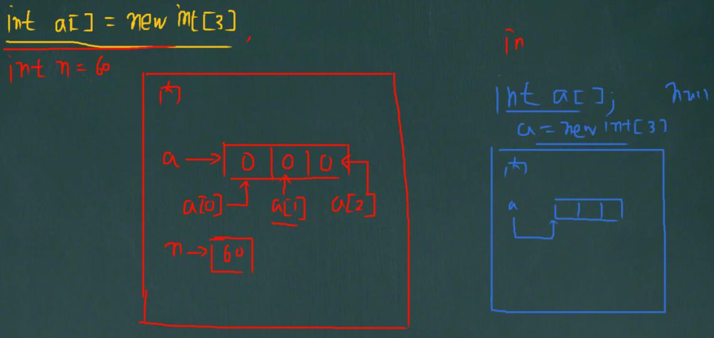
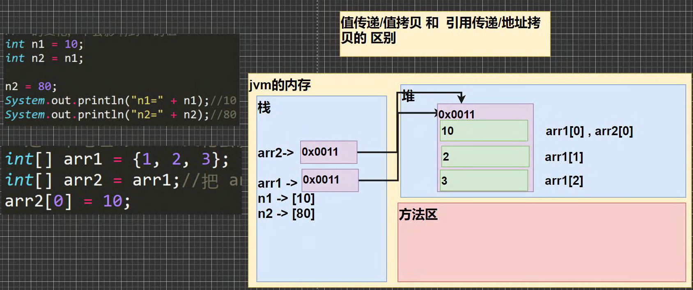
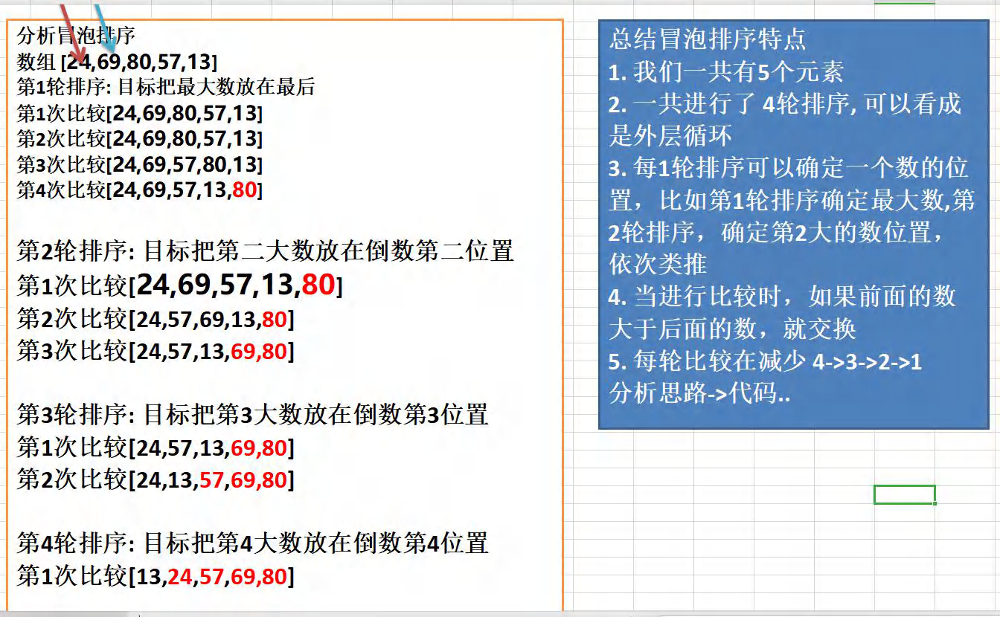
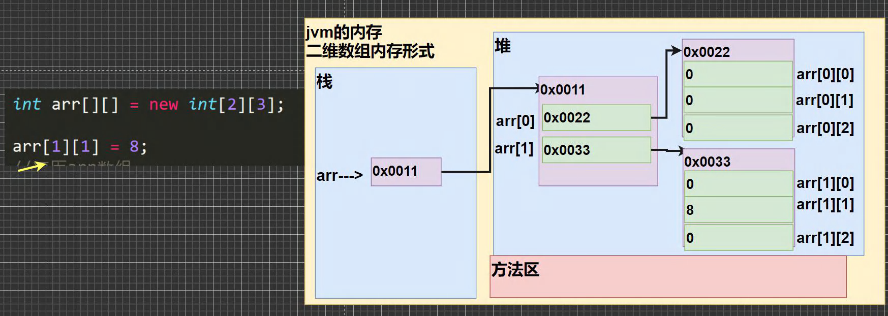
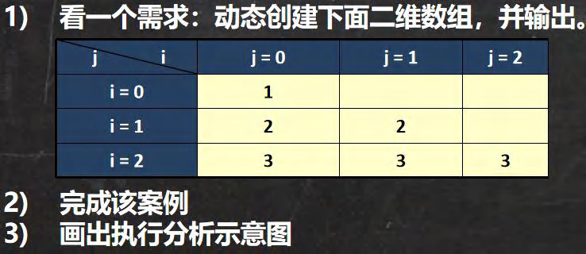

# 五、数组

## 1、概述

### 1.1 为什么需要数组

​	一个有 养鸡场有 6 只鸡，它们的体重分别是 3kg,5kg,1kg,3.4kg,2kg,50kg 。请问这六只鸡的总体重是多少?平
均体重是多少? 请你编一个程序。

​	思路：

​	定义 6 个变量 , 加起来 总体重， 求出平均体重.引出 -> 数组

### 1.2 数组介绍

​	数组可以存放多个同一类型的数据。数组也是一种数据类型，是引用类型。

​	即：数(数据)组(一组)就是一组数据

## 2、数组的使用

### 2.1 初始化

#### 2.1.1 动态初始化

​	定义：数据类型 数组名[] = new 数据类型[大小]

​	int a[] = new int[5];//创建了一个数组，名字 a ，存放 5 个 int

​	说明：这是定义数组的一种方法。为了让大家明白，我画数组内存图说明



​	数组的引用（使用/访问/获取数组元素）

​	数组名[下标/索引/index] 比如：你要使用 a 数组的第 3 个数 a[2]

​	**数组的下标从 0 开始。**

#### 2.1.2 动态初始化2

1）先声明数组

**语法**：

```java
数据类型 数组名[]; 也可以 数据类型[] 数组名;
int a[]; 或者 int[] a;
```

2）再创建数组

语法: 

```java
数组名 = new 数据类型[大小];
a = new int[10];
```

#### 2.1.3 静态初始化

1）初始化数组

语法：

```java
数据类型 数组名[] = {元素值,元素值...}
inta1={2,5,6,7,8,89,90,34,56}
```

前提：如果知道数组有多少元素，具体值

上面的用法相当于：

```java
int a[] = new int[9];
a[5] = 2; a[1] = 5; a[2] = 6; a[3] = 7; a[4] = 8;
a[5] = 89; a[6] = 90; a[7] = 34; a[8] = 56;
```

### 2.2 使用细节

1）数组是多个相同类型数据的组合，实现对这些数据的统一管理

2）数组中的元素可以是任何数据类型，包括基本类型和引用类型，但是不能混用。

3）数组创建后，如果没有赋值，有**默认值**：

**int 0，short 0, byte 0, long 0, float 0.0 , double 0.0，char \u0000，boolean false，String null**

4）使用数组的步骤

(1) 声明数组并开辟空间

(2) 给数组各个元素赋值

(3) 使用数组

5）数组的 **下标是从 0 开始的**。

6）数组下标必须在指定范围内使用，否则报：下标越界异常，比如

int [] arr = new int[5]; 则有效下标为 0-4

7）数组属引用类型，数组型数据是对象 (object)

### 2.3 数组应用

#### 2.3.1 数组赋值机制

1）基本数据类型赋值，这个值就是具体的数据，而且相互不影响。

​	int n1 = 2; int n2 = n1;

2）数组在默认情况下是引用传递，赋的值是地址。

看一个案例，并分析数组赋值的内存图(重点, 难点. )。

int[] arr1 = {1,2,3};

int[] arr2 = arr1;



#### 2.3.2 数组拷贝

```java
public class ArrayCopy {
    //编写一个 main 方法
    public static void main(String[] args) {
        //将 int[] arr1 = {10,20,30}; 拷贝到 arr2 数组,
        //要求数据空间是独立的.
        int[] arr1 = {10,20,30};
        //创建一个新的数组 arr2,开辟新的数据空间
        //大小 arr1.length;
        int[] arr2 = new int[arr1.length];
        //遍历 arr1 ，把每个元素拷贝到 arr2 对应的元素位置
        for(int i = 0; i < arr1.length; i++) {
        	arr2[i] = arr1[i];
        }
        //老师修改 arr2， 不会对 arr1 有影响.
        arr2[0] = 100;
        //输出 arr1
        System.out.println("====arr1 的元素====");
        for(int i = 0; i < arr1.length; i++) {
        	System.out.println(arr1[i]);//10,20,30
        }
        //
        System.out.println("====arr2 的元素====");
        for(int i = 0; i < arr2.length; i++) {
        	System.out.println(arr2[i]);//
        }
    }
}
```

#### 2.3.3 数组反转

1）找规律反转

```java
public class ArrayReverse {
    //编写一个 main 方法
    public static void main(String[] args) {
        //定义数组
        int[] arr = {11, 22, 33, 44, 55, 66};
        //老韩思路
        //规律
        //1. 把 arr[0] 和 arr[5] 进行交换 {66,22,33,44,55,11}
        //2. 把 arr[1] 和 arr[4] 进行交换 {66,55,33,44,22,11}
        //3. 把 arr[2] 和 arr[3] 进行交换 {66,55,44,33,22,11}
        //4. 一共要交换 3 次 = arr.length / 2
        //5. 每次交换时，对应的下标 是 arr[i] 和 arr[arr.length - 1 -i]
        //代码
        //优化
        int temp = 0;
        int len = arr.length; //计算数组的长度
        for( int i = 0; i < len / 2; i++) {
        	temp = arr[len - 1 - i];//保存
        	arr[len - 1 - i] = arr[i];
        	arr[i] = temp;
        }
        System.out.println("===翻转后数组===");
        for(int i = 0; i < arr.length; i++) {
        	System.out.print(arr[i] + "\t");//66,55,44,33,22,11
        }
    }
}
```

2）使用逆序赋值方式

```java
public class ArrayReverse02 {
    //编写一个 main 方法
    public static void main(String[] args) {
        //定义数组
        int[] arr = {11, 22, 33, 44, 55, 66};
        //使用逆序赋值方式
        //老韩思路
        //1. 先创建一个新的数组 arr2 ,大小 arr.length
        //2. 逆序遍历 arr ,将 每个元素拷贝到 arr2 的元素中(顺序拷贝)
        //3. 建议增加一个循环变量 j -> 0 -> 5
        int[] arr2 = new int[arr.length];
        //逆序遍历 arr
        for(int i = arr.length - 1, j = 0; i >= 0; i--, j++) {
        	arr2[j] = arr[i];
        }
        //4. 当 for 循环结束，arr2 就是一个逆序的数组 {66, 55, 44,33, 22, 11}
        //5. 让 arr 指向 arr2 数据空间, 此时 arr 原来的数据空间就没有变量引用
        // 会被当做垃圾，销毁
        arr = arr2;
        System.out.println("====arr 的元素情况=====");
        //6. 输出 arr 看看
        for(int i = 0; i < arr.length; i++) {
        	System.out.print(arr[i] + "\t");
        }
    }
}
```

#### 2.3.4 数组添加/扩容

要求：实现动态的给数组添加元素效果，实现对数组扩容。

1）原始数组使用静态分配 int[] arr = {1,2,3}

2）增加的元素 4，直接放在数组的最后 arr = {1,2,3,4}

3）用户可以通过如下方法来决定是否继续添加，添加成功，是否继续？y/n

```java
import java.util.Scanner;
public class ArrayAdd02 {
    //编写一个 main 方法
    public static void main(String[] args) {
        /*
        要求：实现动态的给数组添加元素效果，实现对数组扩容。ArrayAdd.java
        1.原始数组使用静态分配 int[] arr = {1,2,3}
        2.增加的元素 4，直接放在数组的最后 arr = {1,2,3,4}
        3.用户可以通过如下方法来决定是否继续添加，添加成功，是否继续？y/n
        思路分析
        1. 定义初始数组 int[] arr = {1,2,3}//下标 0-2
        2. 定义一个新的数组 int[] arrNew = new int[arr.length+1];
        3. 遍历 arr 数组，依次将 arr 的元素拷贝到 arrNew 数组
        4. 将 4 赋给 arrNew[arrNew.length - 1] = 4;把 4 赋给 arrNew 最后一个元素
        5. 让 arr 指向 arrNew ; arr = arrNew; 那么 原来 arr 数组就被销毁
        6. 创建一个 Scanner 可以接受用户输入
        7. 因为用户什么时候退出，不确定，老师使用 do-while + break 来控制
        */
        Scanner myScanner = new Scanner(System.in);
        //初始化数组
        int[] arr = {1,2,3};
        do {
        int[] arrNew = new int[arr.length + 1];
        //遍历 arr 数组，依次将 arr 的元素拷贝到 arrNew 数组
        for(int i = 0; i < arr.length; i++) {
        	arrNew[i] = arr[i];
        }
        System.out.println("请输入你要添加的元素");
        int addNum = myScanner.nextInt();
        //把 addNum 赋给 arrNew 最后一个元素
        arrNew[arrNew.length - 1] = addNum;
        //让 arr 指向 arrNew,
        arr = arrNew;
        //输出 arr 看看效果
        System.out.println("====arr 扩容后元素情况====");
        for(int i = 0; i < arr.length; i++) {
        	System.out.print(arr[i] + "\t");
        }
        //问用户是否继续
        System.out.println("是否继续添加 y/n");
        char key = myScanner.next().charAt(0);
        if( key == 'n') { //如果输入 n ,就结束
        	break;
        }
        }while(true);
        System.out.println("你退出了添加...");
    }
}
```

### 2.4 数组查找

1）顺序查找

2）二分查找【二分法，我们放在算法讲解】

```java
import java.util.Scanner;
public class SeqSearch {
    //编写一个 main 方法
    public static void main(String[] args) {
        /*
        有一个数列：白眉鹰王、金毛狮王、紫衫龙王、青翼蝠王猜数游戏：
        从键盘中任意输入一个名称，判断数列中是否包含此名称【顺序查找】
        要求: 如果找到了，就提示找到，并给出下标值
        思路分析
        1. 定义一个字符串数组
        2. 接收用户输入, 遍历数组，逐一比较，如果有，则提示信息，并退出
        */
        //定义一个字符串数组
        String[] names = {"白眉鹰王", "金毛狮王", "紫衫龙王", "青翼蝠王"};
        Scanner myScanner = new Scanner(System.in);
        System.out.println("请输入名字");
        String findName = myScanner.next();
        //遍历数组，逐一比较，如果有，则提示信息，并退出
        //这里老师给大家一个编程思想/技巧, 一个经典的方法
        int index = -1;
        for(int i = 0; i < names.length; i++) {
        //比较 字符串比较 equals, 如果要找到名字就是当前元素
        	if(findName.equals(names[i])) {
                System.out.println("恭喜你找到 " + findName);
                System.out.println("下标为= " + i);
            //把 i 保存到 index
                index = i;
                break;//退出
                }
        }
        if(index == -1) { //没有找到
        	System.out.println("sorry ,没有找到 " + findName);
        }
    }
}
```


## 3、数组的排序

### 3.1 介绍

​	排序是将多个数据，依指定的顺序进行排列的过程。

#### 1）内部排序

​	指将需要处理的所有数据都加载到内部存储器中进行排序。包括(交换式排序法、选择式排序法和插入式排序法)；

#### 2）外部排序

​	数据量过大，无法全部加载到内存中，需要借助外部存储进行排序。包括(合并排序法和直接合并排序法)。

### 3.2 冒泡排序法

#### 1）介绍

​	冒泡排序（Bubble Sorting）的基本思想是：通过对待排序序列从后向前（从下标较大的元素开始），依次比较相邻元素的值，若发现逆序则交换，使值较大的元素逐渐从前移向后部，就象水底下的气泡一样逐渐向上冒。

#### 2）思路

​	我们将五个无序：24,69,80,57,13 使用冒泡排序法将其排成一个从小到大的有序数列。



#### 3）代码

```java
public class BubbleSort {
    //编写一个 main 方法
    public static void main(String[] args) {
        //老韩 化繁为简，先死后活
        //
        //
        /*
        数组 [24,69,80,57,13]
        第 1 轮排序: 目标把最大数放在最后
        第 1 次比较[24,69,80,57,13]
        第 2 次比较[24,69,80,57,13]
        第 3 次比较[24,69,57,80,13]
        第 4 次比较[24,69,57,13,80]
        */
        int[] arr = {24, 69, 80, 57, 13, -1, 30, 200, -110};
        int temp = 0; //用于辅助交换的变量
        //将多轮排序使用外层循环包括起来即可
        //先死后活 =》 4 就是 arr.length - 1
        for( int i = 0; i < arr.length - 1; i++) {//外层循环是 4 次
        	for( int j = 0; j < arr.length - 1 - i; j++) {//4 次比较-3 次-2 次-1 次
        	//如果前面的数>后面的数，就交换
        		if(arr[j] > arr[j + 1]) {
                    temp = arr[j];
                    arr[j] = arr[j+1];
                    arr[j+1] = temp;
                    }
        		}
        System.out.println("\n==第"+(i+1)+"轮==");
        for(int j = 0; j < arr.length; j++) {
        	System.out.print(arr[j] + "\t");
    	}
}
// for( int j = 0; j < 4; j++) {//4 次比较
// //如果前面的数>后面的数，就交换
// 	if(arr[j] > arr[j + 1]) {
    // temp = arr[j];
    // arr[j] = arr[j+1];
    // arr[j+1] = temp;
    // }
// }
// System.out.println("==第 1 轮==");
// for(int j = 0; j < arr.length; j++) {
// System.out.print(arr[j] + "\t");
// }
// /*
// 第 2 轮排序: 目标把第二大数放在倒数第二位置
// 第 1 次比较[24,69,57,13,80]
// 第 2 次比较[24,57,69,13,80]
// 第 3 次比较[24,57,13,69,80]
// */
// for( int j = 0; j < 3; j++) {//3 次比较
// //如果前面的数>后面的数，就交换
// 		if(arr[j] > arr[j + 1]) {
        // temp = arr[j];
        // arr[j] = arr[j+1];
        // arr[j+1] = temp;
        // }
// }
// System.out.println("\n==第 2 轮==");
// for(int j = 0; j < arr.length; j++) {
// System.out.print(arr[j] + "\t");
// }
// 第 3 轮排序: 目标把第 3 大数放在倒数第 3 位置
// 第 1 次比较[24,57,13,69,80]
// 第 2 次比较[24,13,57,69,80]
// for( int j = 0; j < 2; j++) {//2 次比较
// //如果前面的数>后面的数，就交换
// 		if(arr[j] > arr[j + 1]) {
        // temp = arr[j];
        // arr[j] = arr[j+1];
        // arr[j+1] = temp;
        // }
// }
// System.out.println("\n==第 3 轮==");
// for(int j = 0; j < arr.length; j++) {
// System.out.print(arr[j] + "\t");
// }
// /*
// 第 4 轮排序: 目标把第 4 大数放在倒数第 4 位置
// 第 1 次比较[13,24,57,69,80]
// */
// for( int j = 0; j < 1; j++) {//1 次比较
// //如果前面的数>后面的数，就交换
// 		if(arr[j] > arr[j + 1]) {
        // temp = arr[j];
        // arr[j] = arr[j+1];
        // arr[j+1] = temp;
        // }
// }
// System.out.println("\n==第 4 轮==");
// for(int j = 0; j < arr.length; j++) {
// 		System.out.print(arr[j] + "\t");
// }
	}
}
```

## 4、多维数组

### 4.1 二维数组

#### 1）快速入门

请用二维数组输出如下图形
0 0 0 0 0 0
0 0 1 0 0 0
0 2 0 3 0 0
0 0 0 0 0 0

```java
public class TwoDimensionalArray01 {
    //编写一个 main 方法
    public static void main(String[] args) {
        /*
        请用二维数组输出如下图形
        0 0 0 0 0 0
        0 0 1 0 0 0
        0 2 0 3 0 0
        0 0 0 0 0 0
        */
        //什么是二维数组：
        //老韩解读
        //1. 从定义形式上看 int[][]
        //2. 可以这样理解，原来的一维数组的每个元素是一维数组, 就构成二维数组
        int[][] arr = { {0, 0, 0, 0, 0, 0},
        {0, 0, 1, 0, 0, 0},
        {0,2, 0, 3, 0, 0},
        {0, 0, 0, 0, 0, 0} };
        //关于二维数组的关键概念
        //(1)
        System.out.println("二维数组的元素个数=" + arr.length);
        //(2) 二维数组的每个元素是一维数组, 所以如果需要得到每个一维数组的值
        // 还需要再次遍历
        //(3) 如果我们要访问第 (i+1)个一维数组的第 j+1 个值 arr[i][j];
        // 举例 访问 3, =》 他是第 3 个一维数组的第 4 个值 arr[2][3]
        System.out.println("第 3 个一维数组的第 4 个值=" + arr[2][3]); //3
        //输出二维图形
        for(int i = 0; i < arr.length; i++) {//遍历二维数组的每个元素
        //遍历二维数组的每个元素(数组)
        //老韩解读
        //1. arr[i] 表示 二维数组的第 i+1 个元素 比如 arr[0]：二维数组的第一个元素
        //2. arr[i].length 得到 对应的 每个一维数组的长度
        	for(int j = 0; j < arr[i].length; j++) {
        		System.out.print(arr[i][j] + " "); //输出了一维数组
        	}
        System.out.println();//换行
        }
    }
}
```

#### 2）使用方式

##### (1) 动态初始化

1）语法: `类型[][] 数组名 = new 类型[大小][大小]`

2）比如: `int a [][] = new int[2][3]`

3）使用演示

4）二维数组在内存的存在形式(!!画图)

```java
public class TwoDimensionalArray02 {
    //编写一个 main 方法
    public static void main(String[] args) {
        //int arr[][] = new int[2][3];
        int arr[][]; //声明二维数组
        arr = new int[2][3];//再开空间
        arr[1][1] = 8;
        //遍历 arr 数组
        for(int i = 0; i < arr.length; i++) {
        	for(int j = 0; j < arr[i].length; j++) {//对每个一维数组遍历
        		System.out.print(arr[i][j] +" ");
        	}
        System.out.println();//换行
        }
    }
}
```



##### (2) 动态初始化2

1）先声明：`类型 数组名[][];`

2）再定义(开辟空间) `数组名 = new 类型[大小][大小]`

3）赋值(有默认值，比如 int 类型的就是 0)

##### (3) 动态初始化-列数不确定



```java
public class TwoDimensionalArray03 {
    //编写一个 main 方法
    public static void main(String[] args) {
        /*
        看一个需求：动态创建下面二维数组，并输出
        i = 0: 1
        i = 1: 2 2
        i = 2: 3 3 3
        一个有三个一维数组, 每个一维数组的元素是不一样的
        */
        //创建 二维数组，一个有 3 个一维数组，但是每个一维数组还没有开数据空间
        int[][] arr = new int[3][];
        for(int i = 0; i < arr.length; i++) {//遍历 arr 每个一维数组
        //给每个一维数组开空间 new
        //如果没有给一维数组 new ,那么 arr[i]就是 null
        arr[i] = new int[i + 1];
        //遍历一维数组，并给一维数组的每个元素赋值
        	for(int j = 0; j < arr[i].length; j++) {
        		arr[i][j] = i + 1;//赋值
        	}
        }
        System.out.println("=====arr 元素=====");
        //遍历 arr 输出
        for(int i = 0; i < arr.length; i++) {
        //输出 arr 的每个一维数组
        	for(int j = 0; j < arr[i].length; j++) {
        		System.out.print(arr[i][j] + " ");
        	}
        System.out.println();//换行
        }
    }
}
```

##### (4) 静态初始化

1）定义 `类型 数组名[][] = {{值 1,值 2..},{值 1,值 2..},{值 1,值 2..}}`

使用即可 [ 固定方式访问 ]

比如:

`int[][] arr = {{1,1,1}, {8,8,9}, {100}};`

2）解读

(1) 定义了一个二维数组 arr

(2) arr 有三个元素(每个元素都是一维数组)

(3) 第一个一维数组有 3 个元素 , 第二个一维数组有 3 个元素, 第三个一维数组有 1 个元素

#### 3）细节

(1) 一维数组的声明方式有:

`int[] x 或者 int x[]`

(2) 二维数组的声明方式有:

`int[][] y 或者 int[] y[] 者 或者 int y[][]`

(3) 二维数组实际上是由多个一维数组组成的，它的各个一维数组的长度可以相同，也可以不相同。

比如： map[][] 是一个二维数组

`int map [][] = {{1,2},{3,4,5}}`

由 map[0] 是一个含有两个元素的一维数组 ，map[1] 是一个含有三个元素的一维数组构成，我们也称为列数不等的二维数组

#### 4）案例演示

(1) `int arr[][]={{4,6},{1,4,5,7},{-2}};` 遍历该二维数组，并得到和

```java
public class TwoDimensionalArray05 {
    //编写一个 main 方法
    public static void main(String[] args) {
        /*
        int arr[][]={{4,6},{1,4,5,7},{-2}}; 遍历该二维数组，并得到和
        思路
        1. 遍历二维数组，并将各个值累计到 int sum
        */
        int arr[][]= {{4,6},{1,4,5,7},{-2}};
        int sum = 0;
        for(int i = 0; i < arr.length; i++) {
        //遍历每个一维数组
            for(int j = 0; j < arr[i].length; j++) {
           		 sum += arr[i][j];
        	}
        }
        System.out.println("sum=" + sum);
    }
}
```

(2) 使用二维数组打印一个 10 行杨辉三角

```java
public class YangHui {
    //编写一个 main 方法
    public static void main(String[] args) {
        /*
        使用二维数组打印一个 10 行杨辉三角
        1
        1 1
        1 2 1
        1 3 3 1
        1 4 6 4 1
        1 5 10 10 5 1
        规律
        1.第一行有 1 个元素, 第 n 行有 n 个元素
        2. 每一行的第一个元素和最后一个元素都是 1
        3. 从第三行开始, 对于非第一个元素和最后一个元素的元素的值. arr[i][j]
        arr[i][j] = arr[i-1][j] + arr[i-1][j-1]; //必须找到这个规律
        */
        int[][] yangHui = new int[12][];
        for(int i = 0; i < yangHui.length; i++) {//遍历 yangHui 的每个元素
            //给每个一维数组(行) 开空间
            yangHui[i] = new int[i+1];
            //给每个一维数组(行) 赋值
            for(int j = 0; j < yangHui[i].length; j++){
                //每一行的第一个元素和最后一个元素都是 1
                if(j == 0 || j == yangHui[i].length - 1) {
                	yangHui[i][j] = 1;
                } else {//中间的元素
                	yangHui[i][j] = yangHui[i-1][j] + yangHui[i-1][j-1];
                }
            }
        }
        //输出杨辉三角
        for(int i = 0; i < yangHui.length; i++) {
            for(int j = 0; j < yangHui[i].length; j++) {//遍历输出该行
            	System.out.print(yangHui[i][j] + "\t");
            }
        System.out.println();//换行.
        }
    }
}
```

# 