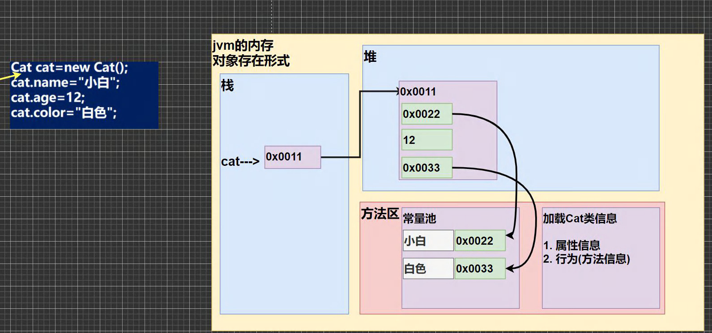
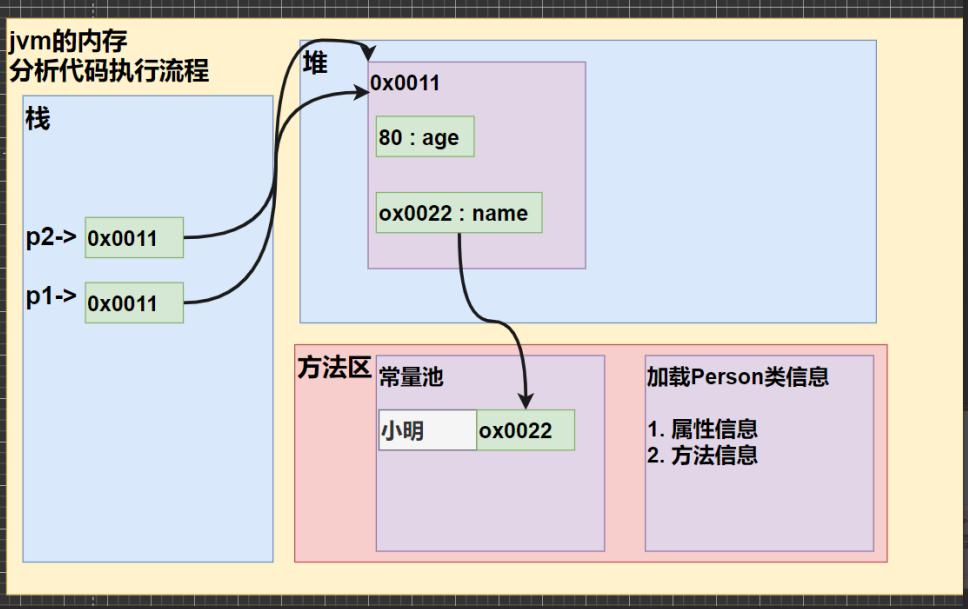
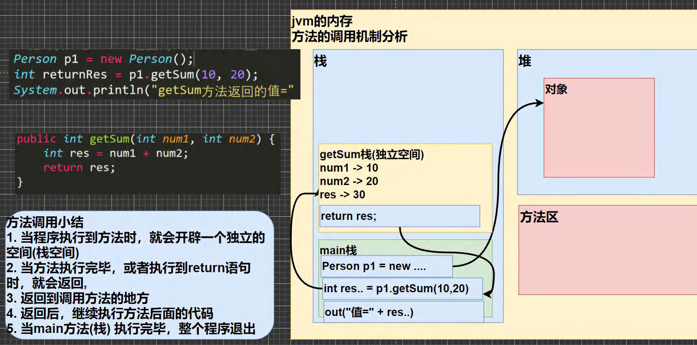
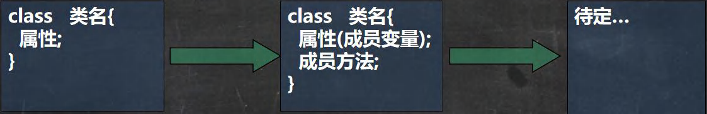
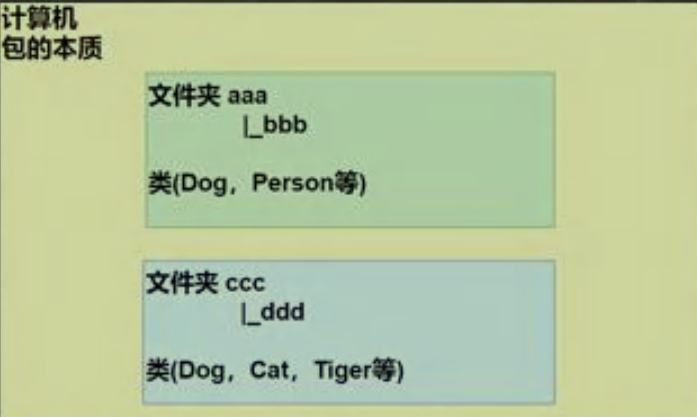
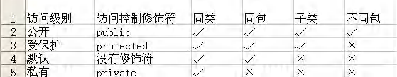
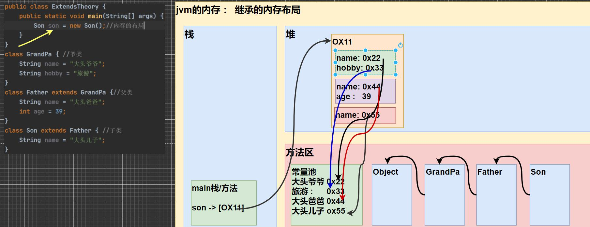
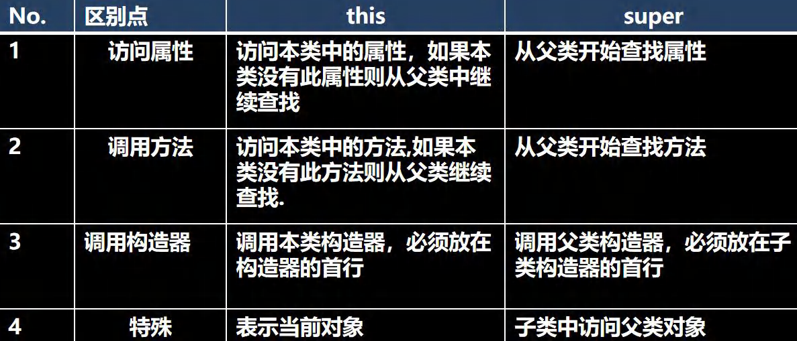
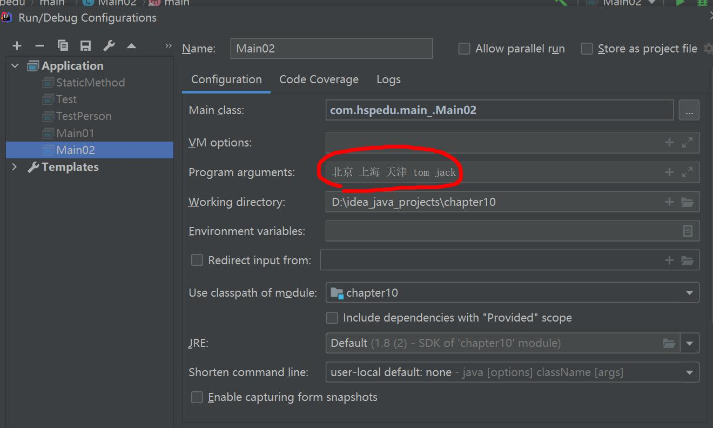

# 六、面向对象

## 面向对象（基础）

### 1、类与对象

#### 1.1 类和对象的区别和联系

1）类是抽象的，概念的，代表一类事物,比如人类,猫类.., 即**它是数据类型**.

2）对象是具体的，实际的，代表一个具体事物, 即 **是实例**.

3）类是对象的模板，对象是类的一个个体，对应一个实例

#### 1.2 对象在内存中存在形式(重要的)



#### 1.3 属性/成员变量/字段

##### 【1】基本介绍

1）从概念或叫法上看： 成员变量 = 属性 = field(字段) （即 成员变量是用来表示属性的，授课中，统一叫 属性)

2）属性是类的一个组成部分，一般是基本数据类型,也可是引用类型(对象，数组)。比如我们前面定义猫类 的 int age 就是属性

##### 【2】注意事项和细节说明

1）属性的定义语法同变量，

示例：`访问修饰符 属性类型 属性名;`

这里老师简单的介绍访问修饰符： 

控制属性的访问范围有四种访问修饰符 public, proctected, 默认, private ,后面我会详细介绍

2）属性的定义类型可以为任意类型，包含基本类型或引用类型

3）属性如果不赋值，有默认值，规则和数组一致。

具体说: int 0，short 0, byte 0, long 0, float 0.0,double 0.0，char \u0000，boolean false，String null

#### 1.4 创建对象

1）先声明再创建

```java
Cat cat ; //声明对象 cat
cat = new Cat(); //创建
```

2）直接创建

```java
Cat cat = new Cat();
```

#### 1.5 访问属性

1）基本语法：`对象名.属性名;`

2）案例演示赋值和输出：

```java
cat.name ;
cat.age;
cat.color;
```

#### 1.6 类和对象的内存分配机制(重要)

【1】Java 内存的结构分析

1）栈： 一般存放基本数据类型(局部变量)

2）堆： 存放对象(Cat cat , 数组等)

3）方法区：常量池(常量，比如字符串)， 类加载信息

【2】Java 创建对象的流程简单分析

1）先加载 Person 类信息(属性和方法信息, 只会加载一次)

2）在堆中分配空间, 进行默认初始化(看规则)

3）把地址赋给 p , p 就指向对象

4）进行指定初始化， 比如 p.name =”jack” p.age = 10



### 2、成员方法

#### 2.1 基本介绍

​	在某些情况下，我们要需要定义成员方法(简称方法)。比如人类:除了有一些属性外( 年龄，姓名..),我们人类还有一些行为比如:可以说话、跑步..,通过学习，还可以做算术题。这时就要用 成员方法才能完成。现在要求对 Person 类完善。

#### 2.2 成员方法快速入门

1）添加 speak 成员方法,输出 “我是一个好人”

2）添加 cal01 成员方法,可以计算从 1+..+1000 的结果

3）添加 cal02 成员方法,该方法可以接收一个数 n，计算从 1+..+n 的结果

4）添加 getSum 成员方法,可以计算两个数的和

```java
public class Method01 {
    //编写一个 main 方法
    public static void main(String[] args) {
        //方法使用
        //1. 方法写好后，如果不去调用(使用)，不会输出
        //2. 先创建对象 ,然后调用方法即可
        Person p1 = new Person();
        p1.speak(); //调用方法
        p1.cal01(); //调用 cal01 方法
        p1.cal02(5); //调用 cal02 方法，同时给 n = 5
        p1.cal02(10); //调用 cal02 方法，同时给 n = 10
        //调用 getSum 方法，同时 num1=10, num2=20
        //把 方法 getSum 返回的值，赋给 变量 returnRes
        int returnRes = p1.getSum(10, 20);
        System.out.println("getSum 方法返回的值=" + returnRes);
    }
}
class Person {
   String name;
   int age;
   //方法(成员方法)
   //添加 speak 成员方法,输出 “我是一个好人”
   //老韩解读
   //1. public 表示方法是公开
   //2. void ： 表示方法没有返回值
   //3. speak() : speak 是方法名， () 形参列表
   //4. {} 方法体，可以写我们要执行的代码
   //5. System.out.println("我是一个好人"); 表示我们的方法就是输出一句话
   public void speak() {
     System.out.println("我是一个好人");
   }
   //添加 cal01 成员方法,可以计算从 1+..+1000 的结果
   public void cal01() {
   //循环完成
   int res = 0;
   for(int i = 1; i <= 1000; i++) {
        res += i;
   }
     System.out.println("cal01 方法 计算结果=" + res);
   }
   //添加 cal02 成员方法,该方法可以接收一个数 n，计算从 1+..+n 的结果
   //老韩解读
   //1. (int n) 形参列表， 表示当前有一个形参 n, 可以接收用户输入
   public void cal02(int n) {
   //循环完成
     int res = 0;
     for(int i = 1; i <= n; i++) {
        	res += i;
        }
        	System.out.println("cal02 方法 计算结果=" + res);
        }
        //添加 getSum 成员方法,可以计算两个数的和
        //老韩解读
        //1. public 表示方法是公开的
        //2. int :表示方法执行后，返回一个 int 值
        //3. getSum 方法名
        //4. (int num1, int num2) 形参列表，2 个形参，可以接收用户传入的两个数
        //5. return res; 表示把 res 的值， 返回
        public int getSum(int num1, int num2) {
        	int res = num1 + num2;
        	return res;
    	}
}
```

#### 2.3 方法的调用机制原理(重要!-示意图!!!)



#### 2.4 成员方法的好处

1）提高代码的复用性

2）可以将实现的细节封装起来，然后供其他用户来调用即可

#### 2.5 成员方法的定义

```java
访问修饰符 返回数据类型 方法名（形参列表..） {//方法体
	语句；
	return 返回值;
}
```

1）形参列表：表示成员方法输入 cal(int n) ， getSum(int num1, int num2)

2）返回数据类型：表示成员方法输出, void 表示没有返回值

3）方法主体：表示为了实现某一功能代码块

4）return 语句不是必须的。

5）老韩提示: 结合前面的题示意图, 来理解

#### 2.6 注意事项和使用细节

##### [1] 访问修饰符 (作用是控制 方法使用的范围)

​	如果不写默认访问，[有四种: public, protected, 默认, private], 具体在后面说


##### [2] 返回数据类型

1）一个方法最多有一个返回值 [思考，如何返回多个结果 --> 返回数组 ]

2）返回类型可以为任意类型，包含基本类型或引用类型(数组，对象)

3）如果方法要求有返回数据类型，则方法体中最后的执行语句必须为 return 值; 而且要求返回值类型必须和 return 的值类型一致或兼容

4）如果方法是 void，则方法体中可以没有 return 语句，或者 只写 return ;


##### [3] 方法名

​	遵循驼峰命名法，最好见名知义，表达出该功能的意思即可, 比如 得到两个数的和 getSum, 开发中按照规范


##### [4] 形参列表

1）一个方法可以有 0 个参数，也可以有多个参数，中间用逗号隔开，比如 `getSum(int n1,int n2)`

2）参数类型可以为任意类型，包含 基本类型 或 引用类型，比如 `printArr(int[][] map)`

3）调用带参数的方法时，一定对应着参数列表传入相同类型或兼容类型的参数！【**getSum**】

4）方法定义时的参数称为形式参数，简称形参；方法调用时的传入参数称为 实际参数，简称实参。
   **实参和形参的类型要一致或兼容、个数、顺序必须一致**！

##### [5] 方法体

​	里面写完成功能的具体的语句，可以为输入、输出、变量、运算、分支、循环、方法调用，但里面不能再定义方法！
​    即：**方法不能嵌套定义**。

##### [6] 方法调用细节说明(!!!)

1）同一个类中的方法调用：直接调用即可。比如 print(参数);

​	案例演示：A 类 sayOk 调用 print()

2）跨类中的方法 A 类调用 B 类方法：需要通过对象名调用。比如 `对象名.方法名（参数);`

​	案例演示：B 类 sayHello 调用 print()

3）特别说明一下：跨类的方法调用和方法的访问修饰符相关，先暂时这么提一下，后面我们讲到访问修饰符时，还要再细说。

#### 2.7 类定义的完善



### 3、成员方法传参机制

#### 3.1 基本数据类型的传参机制

​	基本数据类型，传递的是值（值拷贝），形参的任何改变不影响实参

#### 3.2 引用数据类型的传参机制

​	引用类型传递的是地址（传递也是值，但是值是地址），可以通过形参影响实参！但是，需要确保指向的是同一个地址

#### 3.3 特殊案例展示

1）p=null 和 p = new Person();问题

```java
public class MethodExercise02 {
    //编写一个 main 方法
    public static void main(String[] args) {
        Person p = new Person();
        p.name = "milan";
        p.age = 100;
        //创建 tools
        MyTools tools = new MyTools();
        Person p2 = tools.copyPerson(p);
        //到此 p 和 p2 是 Person 对象，但是是两个独立的对象，属性相同
        System.out.println("p 的属性 age=" + p.age + " 名字=" + p.name);
        System.out.println("p2 的属性 age=" + p2.age + " 名字=" + p2.name);
        //这里老师提示： 可以同 对象比较看看是否为同一个对象
        System.out.println(p == p2);//false
    }
}

class Person {
    String name;
    int age;
}

class MyTools {
    //编写一个方法 copyPerson，可以复制一个 Person 对象，返回复制的对象。克隆对象，
    //注意要求得到新对象和原来的对象是两个独立的对象，只是他们的属性相同
    //
    //编写方法的思路
    //1. 方法的返回类型 Person
    //2. 方法的名字 copyPerson
    //3. 方法的形参 (Person p)
    //4. 方法体, 创建一个新对象，并复制属性，返回即可
        public Person copyPerson(Person p) {
        //创建一个新的对象
        Person p2 = new Person();
        p2.name = p.name; //把原来对象的名字赋给 p2.name
        p2.age = p.age; //把原来对象的年龄赋给 p2.age
        return p2;
    }
}
```

### 4、方法递归调用

#### 4.1 基本介绍

​	简单的说: 递归就是方法自己调用自己,每次调用时传入不同的变量.递归有助于编程者解决复杂问题,同时可以让代码变得简洁

#### 4.2 递归能解决什么问题?

1）各种数学问题如：8皇后问题，汉诺塔，阶乘问题，迷宫问题，球和篮子的问题(google编程大赛)

2）各种算法中也会使用到递归，比如快排，归并排序，二分查找，分治算法等

3）将用栈解决的问题 --> 递归 代码比较简洁

#### 4.3 递归举例

列举两个小案例,来帮助大家理解递归调用机制

1）打印问题

2）阶乘问题

```java
public class Recursion01 {
    //编写一个 main 方法
    public static void main(String[] args) {
        T t1 = new T();
        t1.test(4);//输出什么？ n=2 n=3 n=4
        int res = t1.factorial(5);
        System.out.println("5 的阶乘 res =" + res);
    }
}
class T {
//分析
	public void test(int n) {
    if (n > 2) {
        test(n - 1);
    }
    System.out.println("n=" + n);
}
    
//factorial 阶乘
public int factorial(int n) {
   if (n == 1) {
        return 1;
   } else {
        return factorial(n - 1) * n;
        }
    }
}
```

#### 4.4 递归重要规则

1）执行一个方法时，就创建一个新的受保护的独立空间（栈空间）

2）方法的局部变量是独立的，不会相互影响，比如变量

3）如果方法中使用的是引用类型变量（比如数组，对象），就会共享该引用类型的数据

4）递归必须向退出递归的条件逼近，否则就是无限递归，出现 StackOverflowError ,死龟了:)

5）当一个方法执行完毕，或者遇到 return ，就会返回，遵守谁调用，就将结果返回给谁，同时当方法执行完毕可或者返回时，该方法也就执行完毕。

#### 4.5 应用案例

1）请使用递归的方式求出斐波那契数 1,1,2,3,5,8,13.. 给你一个整数 n ，求出它的值是多

2）猴子吃桃子问题：有一堆桃子，猴子第一天吃了其中的一半，并再多吃了一个！以后每天猴子都吃其中的一半，然后再多吃一个。当到第10天时，想再吃时（即还没吃）发现只有1个桃子了。问题：最初共多少个桃子？

```java
public class RecursionExercise01 {
	//编写一个 main 方法
	public static void main(String[] args) {
    T t1 = new T();
    // int n = 7;
    // int res = t1.fibonacci(n);
    // if(res != -1) {
    // System.out.println("当 n="+ n +" 对应的斐波那契数=" + res);
    // }
    //
    //桃子问题
    int day = 0;
    int peachNum = t1.peach(day);
    if(peachNum != -1) {
    	System.out.println("第 " + day + "天有" + peachNum + "个桃子");
    	}
    }
}

class T {
    /*
    请使用递归的方式求出斐波那契数 1,1,2,3,5,8,13...给你一个整数 n，求出它的值是多
    思路分析
    1. 当 n = 1 斐波那契数 是 1
    2. 当 n = 2 斐波那契数 是 1
    3. 当 n >= 3 斐波那契数 是前两个数的和
    4. 这里就是一个递归的思路
    */
    public int fibonacci(int n) {
        if( n >= 1) {
        	if( n == 1 || n == 2) {
        		return 1;
        	} else {
				return fibonacci(n-1) + fibonacci(n-2);
			}
		} else {
			System.out.println("要求输入的 n>=1 的整数");
			return -1;
	}
}
    /*
    猴子吃桃子问题：有一堆桃子，猴子第一天吃了其中的一半，并再多吃了一个！
    以后每天猴子都吃其中的一半，然后再多吃一个。当到第 10 天时，
    想再吃时（即还没吃），发现只有 1 个桃子了。问题：最初共多少个桃子？
    思路分析 逆推
    1. day = 10 时 有 1 个桃子
    2. day = 9 时 有 (day10 + 1) * 2 = 4
    3. day = 8 时 有 (day9 + 1) * 2 = 10
    4. 规律就是 前一天的桃子 = (后一天的桃子 + 1) *2//就是我们的能力
    5. 递归
    */
	public int peach(int day) {
		if(day == 10) {//第 10 天，只有 1 个桃
			return 1;
		} else if ( day >= 1 && day <=9 ) {
			return (peach(day + 1) + 1) * 2;//规则，自己要想
    	} else {
			System.out.println("day 在 1-10");
			return -1;
		}
	}
}
```

3）迷宫问题

```java
public class MiGong {
    //编写一个 main 方法
    public static void main(String[] args) {
        //思路
        //1. 先创建迷宫，用二维数组表示 int[][] map = new int[8][7];
        //2. 先规定 map 数组的元素值: 0 表示可以走 1 表示障碍物
        int[][] map = new int[8][7];
        //3. 将最上面的一行和最下面的一行，全部设置为 1
        for(int i = 0; i < 7; i++) {
            map[0][i] = 1;
            map[7][i] = 1;
        }
        //4.将最右面的一列和最左面的一列，全部设置为 1
        for(int i = 0; i < 8; i++) {
            map[i][0] = 1;
            map[i][6] = 1;
		}
        map[3][1] = 1;
        map[3][2] = 1;
        map[2][2] = 1; //测试回溯
        // map[2][1] = 1;
        // map[2][2] = 1;
        // map[1][2] = 1;
        //输出当前的地图
        System.out.println("=====当前地图情况======");
        for(int i = 0; i < map.length; i++) {
        	for(int j = 0; j < map[i].length; j++) {
            	System.out.print(map[i][j] + " ");//输出一行
            }
		System.out.println();
		}
        //使用 findWay 给老鼠找路
        T t1 = new T();
        //下右上左
        t1.findWay(map, 1, 1);
        System.out.println("\n====找路的情况如下=====");
        for(int i = 0; i < map.length; i++) {
			for(int j = 0; j < map[i].length; j++) {
            	System.out.print(map[i][j] + " ");//输出一行
            }
		System.out.println();
		}
	}
}


class T {
    //使用递归回溯的思想来解决老鼠出迷宫
    //老韩解读
    //1. findWay 方法就是专门来找出迷宫的路径
    //2. 如果找到，就返回 true ,否则返回 false
    //3. map 就是二维数组，即表示迷宫
    //4. i,j 就是老鼠的位置，初始化的位置为(1,1)
    //5. 因为我们是递归的找路，所以我先规定 map 数组的各个值的含义
    // 0 表示可以走 1 表示障碍物 2 表示可以走 3 表示走过，但是走不通是死路
    //6. 当 map[6][5] =2 就说明找到通路,就可以结束，否则就继续找.
    //7. 先确定老鼠找路策略 下->右->上->左
    public boolean findWay(int[][] map , int i, int j) {
        if(map[6][5] == 2) {//说明已经找到
        	return true;
		} else {
			if(map[i][j] == 0) {//当前这个位置 0,说明表示可以走
        //我们假定可以走通
        map[i][j] = 2;
        //使用找路策略，来确定该位置是否真的可以走通
        //下->右->上->左
		if(findWay(map, i + 1, j)) {//先走下
			return true;
		} else if(findWay(map, i, j + 1)){//右
			return true;
		} else if(findWay(map, i-1, j)) {//上
			return true;
		} else if(findWay(map, i, j-1)){//左
			return true;
		} else {
			map[i][j] = 3;
			return false;
	}
} else { //map[i][j] = 1 , 2, 3
	return false;
		}
	}
}
//修改找路策略，看看路径是否有变化
//下->右->上->左 ==> 上->右->下->左
	public boolean findWay2(int[][] map , int i, int j) {
    if(map[6][5] == 2) {//说明已经找到
    	return true;
    } else {
    	if(map[i][j] == 0) {//当前这个位置 0,说明表示可以走
    	//我们假定可以走通
    	map[i][j] = 2;
    	//使用找路策略，来确定该位置是否真的可以走通
    	//上->右->下->左
    	if(findWay2(map, i - 1, j)) {//先走上
    		return true;
    	} else if(findWay2(map, i, j + 1)){//右
    		return true;
    	} else if(findWay2(map, i+1, j)) {//下
    		return true;
    	} else if(findWay2(map, i, j-1)){//左
    		return true;
    	} else {
    		map[i][j] = 3;
   			return false;
    	}
    } else { //map[i][j] = 1 , 2, 3
    	return false;
    		}
    	}
    }
}
```

4）汉诺塔

​	汉诺塔：汉诺塔（又称河内塔）问题是源于印度一个古老传说的益智玩具。大梵天创造世界的时候做了三根金刚石柱子，在一根柱子上从下往上按照大小顺序摞着 64 片圆盘。大梵天命令婆罗门把圆盘从下面开始按大小顺序重新摆放在另一根柱子上。并且规定，在小圆盘上不能放大圆盘，在三根柱子之间一次只能移动一个圆盘。

​	假如每秒钟移动一次，共需多长时间呢？移完这些金片需要 5845.54 亿年以上，太阳系的预期寿命据说也就是数百亿年。真的过了 5845.54 亿年，地球上的一切生命，连同梵塔、庙宇等，都早已经灰飞烟灭

```java
public class HanoiTower {
    //编写一个 main 方法
    public static void main(String[] args) {
        Tower tower = new Tower();
        tower.move(64, 'A', 'B', 'C');
        }
    }
class Tower {
    //方法
    //num 表示要移动的个数, a, b, c 分别表示 A 塔，B 塔, C 塔
    public void move(int num , char a, char b ,char c) {
        //如果只有一个盘 num = 1
        if(num == 1) {
    		System.out.println(a + "->" + c);
    	} else {
    	//如果有多个盘，可以看成两个 , 最下面的和上面的所有盘(num-1)
    	//(1)先移动上面所有的盘到 b, 借助 c
    	move(num - 1 , a, c, b);
    	//(2)把最下面的这个盘，移动到 c
    	System.out.println(a + "->" + c);
    	//(3)再把 b 塔的所有盘，移动到 c ,借助 a
    	move(num - 1, b, a, c);
    	}
    }
}
```

### 5、方法重载(OverLoad)

#### 5.1 基本介绍

​	java 中允许同一个类中，多个同名方法的存在，但要求 形参列表不一致！

​	比如：System.out.println(); out 是 PrintStream 类型

#### 5.2 重载的好处

1）减轻了起名的麻烦

2）减轻了记名的麻烦

#### 5.3 快速入门案例

案例：类：MyCalculator 方法：calculate

1）calculate(int n1, int n2) //两个整数的和

2）calculate(int n1, double n2) //一个整数，一个 double 的和

3）calculate(double n2, int n1)//一个 double ,一个 Int 和

4）calculate(int n1, int n2,int n3)//三个 int 的和

```java
public class OverLoad01 {
	//编写一个 main 方法
	public static void main(String[] args) {
    // System.out.println(100);
    // System.out.println("hello,world");
    // System.out.println('h');
    // System.out.println(1.1);
    // System.out.println(true);
    //
    MyCalculator mc = new MyCalculator();
    System.out.println(mc.calculate(1, 2));
    System.out.println(mc.calculate(1.1, 2));
    System.out.println(mc.calculate(1, 2.1));
    }
}


class MyCalculator {
    //下面的四个 calculate 方法构成了重载
    //两个整数的和
    public int calculate(int n1, int n2) {
    	System.out.println("calculate(int n1, int n2) 被调用");
    return n1 + n2;
}
    
    
//没有构成方法重载, 仍然是错误的，因为是方法的重复定义
// public void calculate(int n1, int n2) {
// System.out.println("calculate(int n1, int n2) 被调用");
// int res = n1 + n2;
// }
//看看下面是否构成重载, 没有构成，而是方法的重复定义,就错了
// public int calculate(int a1, int a2) {
// System.out.println("calculate(int n1, int n2) 被调用");
// return a1 + a2;
// }
//一个整数，一个 double 的和
public double calculate(int n1, double n2) {
	return n1 + n2;
}
//一个 double ,一个 Int 和
public double calculate(double n1, int n2) {
	System.out.println("calculate(double n1, int n2) 被调用..");
	return n1 + n2;
}
//三个 int 的和
public int calculate(int n1, int n2,int n3) {
	return n1 + n2 + n2;
	}
}
```

#### 5.4 注意事项和使用细节

1）方法名：必须相同

2）形参列表：必须不同（形参类型或个数或顺序，至少有一样不同，参数名无要求）

3）返回类型：无要求

### 6、可变参数

#### 6.1 基本概念

​	java 允许将同一个类中多个同名同功能但参数个数不同的方法，封装成一个方法。

​	就可以通过可变参数实现

#### 6.2 基本语法

```java
访问修饰符 返回类型 方法名(数据类型... 形参名) {
}
```

#### 6.3 快速入门

​	方法 sum 【可以计算 2 个数的和，3 个数的和 ， 4. 5， 。。】

```java
public class VarParameter01 {
    //编写一个 main 方法
    public static void main(String[] args) {
        HspMethod m = new HspMethod();
        System.out.println(m.sum(1, 5, 100)); //106
        System.out.println(m.sum(1,19)); //20
    }
}


class HspMethod {
    //可以计算 2 个数的和，3 个数的和 ， 4. 5， 。。
    //可以使用方法重载
    // public int sum(int n1, int n2) {//2 个数的和
    // return n1 + n2;
    // }
    // public int sum(int n1, int n2, int n3) {//3 个数的和
    // return n1 + n2 + n3;
    // }
    // public int sum(int n1, int n2, int n3, int n4) {//4 个数的和
    // return n1 + n2 + n3 + n4;
    // }
    //.....
    //上面的三个方法名称相同，功能相同, 参数个数不同-> 使用可变参数优化
    //老韩解读
    //1. int... 表示接受的是可变参数，类型是 int ,即可以接收多个 int(0-多)
    //2. 使用可变参数时，可以当做数组来使用 即 nums 可以当做数组
    //3. 遍历 nums 求和即可
	public int sum(int... nums) {
        //System.out.println("接收的参数个数=" + nums.length);
        int res = 0;
        for(int i = 0; i < nums.length; i++) {
			res += nums[i];
		}
		return res;
	}
}
```

#### 6.4 注意事项和使用细节

1）可变参数的实参可以为 0 个或任意多个。

2）可变参数的实参可以为数组。

3）可变参数的本质就是数组

4）可变参数可以和普通类型的参数一起放在形参列表，但必须保证可变参数在最后

5）一个形参列表中只能出现一个可变参数

```java
public class VarParameterDetail {
    //编写一个 main 方法
    public static void main(String[] args) {
        //细节: 可变参数的实参可以为数组
        int[] arr = {1, 2, 3};
            T t1 = new T();
            t1.f1(arr);
        }
    }
class T {
    public void f1(int... nums) {
    	System.out.println("长度=" + nums.length);
    }
    //细节: 可变参数可以和普通类型的参数一起放在形参列表，但必须保证可变参数在最后
    public void f2(String str, double... nums) {
    }
    //细节: 一个形参列表中只能出现一个可变参数
    //下面的写法是错的.
    // public void f3(int... nums1, double... nums2) {
    // }
}
```

### 7、作用域

#### 7.1 基本使用

1）在 java 编程中，主要的变量就是属性（成员变量）和局部变量

2）我们说的局部变量一般是指在成员方法中定义的变量。【举例 Cat 类：cry】

3）java 中作用域的分类

全局变量：也就是属性，作用域为整个类体 Cat 类：cry eat 等方法使用属性

【举例】

局部变量：也就是除了属性之外的其他变量，作用域为定义它的代码块中！

4）全局变量（属性）可以不赋值，直接使用，因为有默认值，局部变量必须赋值后才能使用，因为没有默认值。

#### 7.2 注意事项和细节使用

1）属性和局部变量可以重名，访问时遵循就近原则

2）在同一个作用域中，比如在同一个成员方法中，两个局部变量，不能重名。

3）**属性生命周期较长**，伴随着对象的创建而创建，伴随着对象的销毁而销毁。

  局部变量，**生命周期较短**，伴随着它的代码块的执行而创建，伴随着代码块的结束而销毁，即在一次方法调用过程中。

4）作用域范围不同

​	全局变量/属性：可以被本类使用，或其他类使用（通过对象调用）

​	局部变量：只能在本类中对应的方法中使用

5）修饰符不同

​	全局变量/属性可以加修饰符

​	局部变量不可以加修饰符

### 8、构造方法/构造器

#### 8.1 基本语法

```java
[修饰符] 方法名(形参列表){
	方法体;
}
```

说明：

1）构造器的修饰符可以默认， 也可以是 public protected private

2）构造器没有返回值

3）方法名 和类名字必须一样

4）参数列表 和 成员方法一样的规则

5）构造器的调用, 由系统完成

#### 8.2 基本介绍

​	构造方法又叫构造器(constructor)，是类的一种特殊的方法，它的主要作用是完成对新对象的初始化。它有几个特点：

1）方法名和类名相同

2）没有返回值

3）在创建对象时，系统会自动的调用该类的构造器完成对象的初始化。

#### 8.3 注意事项和使用细节

1）一个类可以定义多个不同的构造器，即构造器重载

比如：我们可以再给 Person 类定义一个构造器，用来创建对象的时候，只指定人名，不需要指定年龄

2）构造器名和类名要相同

3）构造器没有返回值

4）构造器是完成对象的初始化，并不是创建对象

5）在创建对象时，系统自动的调用该类的构造方法

6）如果程序员没有定义构造器，系统会自动给类生成一个默认无参构造器（也叫默认构造器)。

比如 Dog(){}，使用 javap 指令反编译看看

7）一旦定义了自己的构造器，默认的构造器就覆盖了，就不能再使用默认的无参构造器，除非显式的定义一下。

即：Dog(){} ;（这点很重要）

### 9、对象创建的流程分析

#### 9.1 案例分析

```java
class Person{//类Person
    int age = 90;
    String name;
    Person(String n,int a){//构造器
        name = n;//给属性赋值
        age = a;//..
        
    }
}

Person p = new Person("小倩",20);
```

流程分析（面试题）

1）加载 Person 类信息(Person.class)，只会加载一次

2）在堆中分配空间（地址）

3）完成对象初始化

3.1 默认初始化： age = 0 ; name = null

3.2 显式初始化：age = 90 ; name = null 

3.3 构造器的初始化 age = 20 ; name = 小倩

4）在对象在堆中的地址，返回给 p ( p 是对象名，也可以理解成是对象的引用)


学习完构造器后,我们类的定义就应该更加完善了


### 10、this 关键字

#### 10.1 什么是 this

​	java 虚拟机会给每个对像分配 this ，代表当前对象。坦白的讲要明白 this 不是件容易的事，我给大家打一个比方。【上帝创世界小故事】

**代码理解：**

```java
public class This01 {
    //编写一个 main 方法
    public static void main(String[] args) {
        Dog dog1 = new Dog("大壮", 3);
        System.out.println("dog1 的 hashcode=" + dog1.hashCode());
        //dog1 调用了 info()方法
        dog1.info();
        System.out.println("============");
        Dog dog2 = new Dog("大黄", 2);
        System.out.println("dog2 的 hashcode=" + dog2.hashCode());
        dog2.info();
    }
}

class Dog{ //类
    String name;
    int age;
    // public Dog(String dName, int dAge){//构造器
    // name = dName;
    // age = dAge;
    // }
    //如果我们构造器的形参，能够直接写成属性名，就更好了
    //但是出现了一个问题，根据变量的作用域原则
    //构造器的 name 是局部变量，而不是属性
    //构造器的 age 是局部变量，而不是属性
    //==> 引出 this 关键字来解决
    public Dog(String name, int age){//构造器
    //this.name 就是当前对象的属性 name
    	this.name = name;
    //this.age 就是当前对象的属性 age
    	this.age = age;
    	System.out.println("this.hashCode=" + this.hashCode());
    }
    
    public void info(){//成员方法,输出属性 x 信息
    	System.out.println("this.hashCode=" + this.hashCode());
    	System.out.println(name + "\t" + age + "\t");
    }
}
```

this 小结：**简单的说，哪个对象调用，this 就代表哪个对象**

#### 10.2 this 的注意事项和使用细节

1）this 关键字可以用来访问本类的属性、方法、构造器

2）this 用于区分当前类的属性和局部变量

3）访问成员方法的语法：this.方法名(参数列表);

4）访问构造器语法：this(参数列表); 注意只能在构造器中使用(即只能在构造器中访问另外一个构造器, 必须放在第一条语句)

5）this 不能在类定义的外部使用，只能在类定义的方法中使用。

#### 10.3 应用案例

​	定义 Person 类，里面有 name、age 属性，并提供 compareTo 比较方法，用于判断是否和另一个人相等，提供测试TestPerson 用于测试, 名字和年龄完全一样，就返回 true, 否则返回 false

```java
public class TestPerson {
    //编写一个 main 方法
    public static void main(String[] args) {
        Person p1 = new Person("mary", 20);
        Person p2 = new Person("mary", 20);
        System.out.println("p1 和 p2 比较的结果=" + p1.compareTo(p2));
    }
}
/*
定义 Person 类，里面有 name、age 属性，并提供 compareTo 比较方法，
用于判断是否和另一个人相等，提供测试类 TestPerson 用于测试,
名字和年龄完全一样，就返回 true, 否则返回 false
*/
class Person {
    String name;
    int age;
    //构造器
    public Person(String name, int age) {
        this.name = name;
        this.age = age;
    }
    
//compareTo 比较方法
public boolean compareTo(Person p) {
    //名字和年龄完全一样
    // if(this.name.equals(p.name) && this.age == p.age) {
    // return true;
    // } else {
    // return false;
    // }
	return this.name.equals(p.name) && this.age == p.age;
	}
}
```

## 面向对象（中级）

### 1、包

#### 1.1 包基本语法

1）package 关键字，表示打包

2）com.hspedu：表示包名

#### 1.2 包的三大作用

1）区分相同名字的类

2）当类很多时，可以很好的管理类[看Java API文档]

3）控制访问范围

#### 1.3 包的本质分析(原理)

​	包的本质实际上就是创健不同的文件夹目录来保存类文件，画出示意图，



#### 1.4 包的命名

1）规则

​	只能包含数字、字母、下划线、小圆点，但不能用数字开头，不能是关键字或保留字

2）规范

​	一般是小写字母 + 小圆点一般是 com.公司名.项目名.业务模块名

#### 1.5 常用的包

​	一个包下,包含很多的类，java 中常用的包有:

1）java.lang.*  //lang 包是基本包，默认引入，不需要再引入.

2）java.util.*  //util 包，系统提供的工具包, 工具类，使用 Scanner

3）java.net.*   //网络包，网络开发

4）java.awt.*   //是做 java 的界面开发，GUI

#### 1.6 如何引入包

1）语法：`import 包;`

​	我们引入一个包的主要目的是要使用该包下的类

​	比如 import java.util.Scanner; 就只是引入一个类Scanner。

​	import java.util.*;  //表示将java.util包所有都引入

2）注意：

​	建议：我们需要使用到哪个类，就导入哪个类即可，不建议使用 * 导入

#### 1.7 注意事项和使用细节

1）package 的作用是声明当前类所在的包，需要放在类的最上面，一个类中最多只有一句 package

2）import 指令 位置放在 package 的下面，在类定义前面，可以有多句且没有顺序要求。

### 2、访问修饰符

#### 2.1 基本介绍

​	java 提供四种访问控制修饰符号，用于控制方法和属性(成员变量)的访问权限（范围）：

1）公开级别：用 public 修饰,对外公开。

2）受保护级别：用 protected 修饰,对子类和同一个包中的类公开。

3）默认级别：没有修饰符号,向同一个包的类公开。

4）私有级别：用 private 修饰,只有类本身可以访问,不对外公开。

### 2.2 4 种访问修饰符的访问范围



#### 2.3 使用的注意事项

1）修饰符可以用来修饰类中的属性，成员方法以及类

2）只有默认的和 publicz 才能修饰类！并且遵循上述访问权限的特点。

3）因为没有学习继承，因此关于在子类中的访问权限，我们讲完子类后，在回头讲解

4）成员方法的 访问规则 和 属性 完全一样.

//com.hspedu.modifier：需要很多文件来说明(A类，B类，Test类.)

### 3、面向对象编程三大特征

#### 3.1 基本介绍

​	面向对象编程有三大特征：封装、继承 和 多态

#### 3.2 封装介绍

​	封装 (encapsulation) 就是把抽象出的数据 [属性] 和对数据的操作 [方法] 封装在一起，数据被保护在内部，程序的其它部分只有通过被授权的操作 [方法] ，才能对数据进行操作。

#### 3.3 封装的理解和好处

1）隐藏实现细节：方法（连接数据库） <-- 调用（传入参数..）

2）可以对数据进行验证，保证安全合理

#### 3.4 封装的实现步骤 (三步)

1）将属性进行私有化 private【不能直接修改属性】

2）提供一个公共的 (public)set 方法，用于对属性判断并赋值

```java
public void setXxx(类型 参数名){ //Xxx表示某个属性
	//加入数据验证的业务逻辑
	属性 = 参数名;
}
```

3）提供一个公共的(public)get方法，用于获取属性的值

```java
public 数据类型 getXxx(){ //权限判断，Xxx某个属性
	return xx;
}
```

#### 3.5 快速入门案例

​	不能随便查看人的年龄，工资等隐私，并对设置的年龄进行合理的验证。年龄合理就设置，否则给默认年龄，必须在 1-120，年龄，工资不能直接查看

 name 的长度在 2-6 字符之间

```java
public class Encapsulation01 {
    public static void main(String[] args) {
        //如果要使用快捷键 alt+r, 需要先配置主类
        //第一次，我们使用鼠标点击形式运算程序，后面就可以用
        Person person = new Person();
        person.setName("韩顺平");
        person.setAge(30);
        person.setSalary(30000);
        System.out.println(person.info());
        System.out.println(person.getSalary());
        //如果我们自己使用构造器指定属性
        Person smith = new Person("smith", 80, 50000);
        System.out.println("====smith 的信息======");
        System.out.println(smith.info());
    }
}


/*
那么在 java 中如何实现这种类似的控制呢?
请大家看一个小程序(com.hspedu.encap: Encapsulation01.java),
不能随便查看人的年龄,工资等隐私，并对设置的年龄进行合理的验证。年龄合理就设置，否则给默认
年龄, 必须在 1-120, 年龄， 工资不能直接查看 ， name 的长度在 2-6 字符 之间
*/
class Person {
    public String name; //名字公开
    private int age; //age 私有化
    private double salary; //..
    public void say(int n,String name) {}
    //构造器 alt+insert
    public Person() {}
    //有三个属性的构造器
    public Person(String name, int age, double salary) {
        // this.name = name;
        // this.age = age;
        // this.salary = salary;
        //我们可以将 set 方法写在构造器中，这样仍然可以验证
        setName(name);
        setAge(age);
        setSalary(salary);
	}
    //自己写 setXxx 和 getXxx 太慢，我们使用快捷键
    //然后根据要求来完善我们的代码.
    public String getName() {
        return name;
	}
    
    public void setName(String name) {
    //加入对数据的校验,相当于增加了业务逻辑
		if(name.length() >= 2 && name.length() <=6 ) {
			this.name = name;
		}else {
			System.out.println("名字的长度不对，需要(2-6)个字符，默认名字");
			this.name = "无名人";
		}
	}
    
    
    public int getAge() {
        return age;
    }
    
    public void setAge(int age) {
        //判断
        if(age >= 1 && age <= 120) {//如果是合理范围
        	this.age = age;
        } else {
            System.out.println("你设置年龄不对，需要在 (1-120), 给默认年龄 18 ");
            this.age = 18;//给一个默认年龄
    	}
    }
    
    
    public double getSalary() {
        //可以这里增加对当前对象的权限判断
        return salary;
    }
    
    
    public void setSalary(double salary) {
    	this.salary = salary;
    }
    
    //写一个方法，返回属性信息
    public String info() {
    	return "信息为 name=" + name + " age=" + age + " 薪水=" + salary;
    }
}
```

**将构造器和 setXxx 结合**

```java
//有三个属性的构造器
public Person(String name, int age, double salary) {
    // this.name = name;
    // this.age = age;
    // this.salary = salary;
    //我们可以将 set 方法写在构造器中，这样仍然可以验证
    setName(name);
    setAge(age);
    setSalary(salary);
}
```

### 4、继承

#### 4.1 继承基本介绍和示意图

​	继承可以解决代码复用,让我们的编程更加靠近人类思维.当多个类存在相同的属性(变量)和方法时,可以从这些类中抽象出父类,在父类中定义这些相同的属性和方法，所有的子类不需要重新定义这些属性和方法，只需要通过 extends 来声明继承父类即可。画出继承的示意图


#### 4.2 继承的基本语法

```java
class 子类 extends 父类{}
```

1）子类就会自动拥有父类定义的属性和方法

2）父类又叫超类，基类。

3）子类又叫派生类。

#### 4.3 继承给编程带来的便利

1）代码的复用性提高了

2）代码的扩展性和维护性提高了

#### 4.4 继承的深入讨论/细节问题

1）子类继承了所有的属性和方法，非私有的属性和方法可以在子类直接访问, 但是私有属性和方法不能在子类直接访问，要通过父类提供公共的方法去访问

2）子类必须调用父类的构造器，完成父类的初始化

3）当创建子类对象时，不管使用子类的哪个构造器，默认情况下总会去调用父类的无参构造器，如果父类没有提供无参构造器，则必须在子类的构造器中用 super 去指定使用父类的哪个构造器完成对父类的初始化工作，否则，编译不会通过

4）如果希望指定去调用父类的某个构造器，则显式的调用一下 : super(参数列表)

5）super 在使用时，必须放在构造器第一行(super 只能在构造器中使用)

6）super() 和 this() 都只能放在构造器第一行，因此这两个方法不能共存在一个构造器

7）java 所有类都是 Object 类的子类, Object 是所有类的基类.

8）父类构造器的调用不限于直接父类！将一直往上追溯直到 Object 类(顶级父类)

9）子类最多只能继承一个父类(指直接继承)，即 java 中是单继承机制。

思考：如何让 A 类继承 B 类和 C 类？ 【A 继承 B， B 继承 C】

10）不能滥用继承，子类和父类之间必须满足 is-a 的逻辑关系

#### 4.5 继承的本质分析(重要)

```java
/**
* 讲解继承的本质
*/
public class ExtendsTheory {
    public static void main(String[] args) {
        Son son = new Son();//内存的布局
        //?-> 这时请大家注意，要按照查找关系来返回信息
        //(1) 首先看子类是否有该属性
        //(2) 如果子类有这个属性，并且可以访问，则返回信息
        //(3) 如果子类没有这个属性，就看父类有没有这个属性(如果父类有该属性，并且可以访问，就返回信息..)
        //(4) 如果父类没有就按照(3)的规则，继续找上级父类，直到 Object...
        System.out.println(son.name);//返回就是大头儿子
        //System.out.println(son.age);//返回的就是 39
        //System.out.println(son.getAge());//返回的就是 39
        System.out.println(son.hobby);//返回的就是旅游
    }
}
class GrandPa { //爷类
    String name = "大头爷爷";
    String hobby = "旅游";
}
class Father extends GrandPa {//父类
    String name = "大头爸爸";
    private int age = 39;
    public int getAge() {
    	return age;
    }
}
class Son extends Father { //子类
	String name = "大头儿子";
}
```

**子类创建的内存布局**



### 5、super 关键字

#### 5.1 基本介绍

​	super 代表父类的引用，用于 访问父类的属性、方法、构造器

#### 5.2 基本语法

1）访问父类的属性，但不能访问父类的 private 属性

```java
super.属性名;
```

2）访问父类的方法，不能访问父类的 private 方法

```java
super.方法名(参数列表);
```

3）访问父类的构造器（这点前面用过）

```java
super(参数列表); //只能放在构造器的第一句，只能出现一句！
```

#### 5.3 super 给编程带来的便利/细节

1）调用父类的构造器的好处 (分工明确，父类属性由父类初始化，子类的属性由子类初始化)

2）当子类中有和父类中的成员 (属性和方法) 重名时，为了访问父类的成员，必须通过 super。如果没有重名，使用super、this、直接访问是一样的效果！

3）super 的访问不限于直接父类，如果爷爷类和本类中有同名的成员，也可以使用 super 去访问爷爷类的成员；如果多个基类（上级类）中都有同名的成员，使用 super 访问遵循就近原则。A --> B --> C，当然也需要遵守访问权限的相关规则

#### 5.4 super 和 this 的比较



### 6、方法重写/覆盖(override)

#### 6.1 基本介绍

​	简单的说：方法覆盖（重写）就是子类有一个方法，和父类的某个方法的名称、返回类型、参数一样，那么我们就说子类的这个方法覆盖了父类的方法。

#### 6.2 快速入门

```java
public class Animal {
    public void cry() {
    	System.out.println("动物叫唤..");
    }
    
    public Object m1() {
   		return null;
    }
    
    public String m2() {
    	return null;
    }
    
    publicAAAm3() {
    	return null;
    }
    
	protected void eat() {}
}
package com.hspedu.override_;
    public class Dog extendsAnimal{
        //老韩解读
        //1. 因为 Dog 是 Animal 子类
        //2. Dog 的 cry 方法和 Animal 的 cry 定义形式一样(名称、返回类型、参数)
        //3. 这时我们就说 Dog 的 cry 方法，重写了 Animal 的 cry 方法
        public void cry() {
    		System.out.println("小狗汪汪叫..");
		}
        //细节: 子类方法的返回类型和父类方法返回类型一样，
        // 或者是父类返回类型的子类
        比如 父类 返回类型是 Object ,
        // 子类方法返回类型是 String
        public String m1() {
        	return null;
        }
        //这里 Object 不是 String 的子类，因此编译错误
        // public Object m2() {
        // 		return null;
        // }
        // public BBB m3() {
        // 		return null;
        // }
        //细节: 子类方法不能缩小父类方法的访问权限 【演示】
        //public > protected > 默认>private
		public void eat() {}
	}

class AAA{}

class BBB extendsAAA {}


public class Override01 {
    public static void main(String[] args) {
        //演示方法重写的情况
        Dog dog = new Dog();
        dog.cry();//ctrl+b
	}
}
```

#### 6.3 注意事项和使用细节

​	方法重写也叫方法覆盖，需要满足下面的条件

1）子类的方法的 形参列表，方法名称，要和父类方法的形参列表，方法名称完全一样。

2）子类方法的返回类型和父类方法返回类型一样，或者是父类返回类型的子类

​	比如父类返回类型是Object,子类方法返回类型是String

3）子类方法不能缩小父类方法的访问权限。public > protected > 默认 > private

### 7、多态

#### 7.1 基本介绍

​	方法或对象具有多种形态。是面向对象的第三大特征，多态是建立在封装和继承基础之上的。

#### 7.2 多态的具体体现

##### 1）方法的多态

重写和重载就体现多态

```java
public class PloyMethod {
    public static void main(String[] args) {
        //方法重载体现多态
        Aa = new A();
        //这里我们传入不同的参数，就会调用不同 sum 方法，就体现多态
        System.out.println(a.sum(10, 20));
        System.out.println(a.sum(10, 20, 30));
        //方法重写体现多态
        B b = new B();
        a.say();
        b.say();
    }
}

class B { //父类
    public void say() {
    	System.out.println("B say() 方法被调用...");
    }
}

class Aextends B {//子类
    public int sum(int n1, int n2){//和下面 sum 构成重载
    	return n1 + n2;
    }
    public int sum(int n1, int n2, int n3){
    	return n1 + n2 + n3;
    }
    public void say() {
    	System.out.println("Asay() 方法被调用...");
    }
}
```

##### 2）对象的多态（核心，困难，重点）

(1) 一个对象的编译类型和运行类型可以不一致。

(2) 编译类型在定义对象时，就确定了，不能改变。

(3) 运行类型是可以变化的。

(4) 编译类型看定义时 = 号的左边

​    运行类型看 = 号的右边

#### 7.3 多态注意事项和细节讨论

​	多态的 **前提**是：两个对象(类)存在继承关系

##### 1）多态的向上转型

(1) 本质：

​	父类的引用指向了子类的对象

(2) 语法：

​	`父类类型 引用名 = new 子类类型();`

(3) 特点：

​	[1] 编译类型看左边，运行类型看右边。

​	[2] 可以调用父类中的所有成损（需遵守访问权限）

​	[3] 不能调用子类中特有成员

​	[4] 最终运行效果看子类的具体实现！

##### 2）多态向下转型

(1) 语法：

`子类类型 引用名 = (子类类型) 父类引用;`

(2) 只能强转父类的引用，不能强转父类的对象

(3) 要求父类的引用必须指向的是当前目标类型的对象

(4) 当向下转型后，可以调用子类类型中所有的成员

##### 3）案例演示

```java
public class Animal {
    String name = "动物";
    int age = 10;
    public void sleep(){
    	System.out.println("睡");
    }
    public void run(){
   		System.out.println("跑");
    }
    public void eat(){
    	System.out.println("吃");
    }
    public void show(){
    	System.out.println("hello,你好");
    }
}


public class Cat extends Animal {
    public void eat(){//方法重写
    	System.out.println("猫吃鱼");
    }
    public void catchMouse(){//Cat 特有方法
    	System.out.println("猫抓老鼠");
    }
}


public class Dog extendsAnimal {//Dog 是 Animal 的子类
}
    
    

public class PolyDetail {
    public static void main(String[] args) {
        //向上转型: 父类的引用指向了子类的对象
        //语法：父类类型引用名 = new 子类类型();
        Animal animal = new Cat();
        Object obj = new Cat();//可以吗? 可以 Object 也是 Cat 的父类
        //向上转型调用方法的规则如下:
        //(1)可以调用父类中的所有成员(需遵守访问权限)
        //(2)但是不能调用子类的特有的成员
        //(#)因为在编译阶段，能调用哪些成员,是由编译类型来决定的
        //animal.catchMouse();错误
        //(4)最终运行效果看子类(运行类型)的具体实现, 即调用方法时，按照从子类(运行类型)开始查找方法
        //，然后调用，规则我前面我们讲的方法调用规则一致。
        animal.eat();//猫吃鱼..
        animal.run();//跑
        animal.show();//hello,你好
        animal.sleep();//睡
        //老师希望，可以调用 Cat 的 catchMouse 方法
        //多态的向下转型
        //(1)语法：子类类型 引用名 =（子类类型）父类引用;
        //问一个问题? cat 的编译类型 Cat,运行类型是 Cat
        Cat cat = (Cat) animal;
        cat.catchMouse();//猫抓老鼠
        //(2)要求父类的引用必须指向的是当前目标类型的对象
        Dog dog = (Dog) animal; //可以吗？
        System.out.println("ok~~");
    }
}
```


> 注：属性没有重写之说！属性的值看编译类型


```java
public class PolyDetail02 {
    public static void main(String[] args) {
        //属性没有重写之说！属性的值看编译类型
        Base base = new Sub();//向上转型
        System.out.println(base.count);// ？ 看编译类型 10
        Sub sub = new Sub();
        System.out.println(sub.count);//? 20
    }
}

class Base { //父类
	int count = 10;//属性
}
class Sub extends Base {//子类
	int count = 20;//属性
}
```


> instanceOf 比较操作符，用于判断对象的运行类型是否为XX类型或XX类型的子类型


```java
public class PolyDetail03 {
    public static void main(String[] args) {
        BB bb = new BB();
        System.out.println(bb instanceof BB);// true
        System.out.println(bb instanceof AA);// true
        //aa 编译类型 AA, 运行类型是 BB
        //BB 是 AA 子类
        AAaa = new BB();
        System.out.println(aa instanceofAA);
        System.out.println(aa instanceof BB);
        Object obj = new Object();
        System.out.println(obj instanceofAA);//false
        String str = "hello";
        //System.out.println(str instanceof AA);
        System.out.println(str instanceof Object);//true
    }
}
class AA{} //父类
class BB extendsAA{}//子类
```


#### 7.4  java 的动态绑定机制(非常非常重要.)

​	Java 重要特性: 动态绑定机制

1）当调用对像方法的时候，该方法会和该对象的内存地址/运行类型绑定

2）当调用对象属性时，没有动态绑定机制，哪里声明，那里使用

```java
public class DynamicBinding {
    public static void main(String[] args) {
        //a 的编译类型 A, 运行类型 B
        Aa = new B();//向上转型
        System.out.println(a.sum());//?40 -> 30
        System.out.println(a.sum1());//?30-> 20
    }
}

class A{//父类
    public int i = 10;
    //动态绑定机制:
    public int sum() {//父类 sum()
    	return getI() + 10;//20 + 10
	}
    public int sum1() {//父类 sum1()
    	return i + 10;//10 + 10
    }
    public int getI() {//父类 getI
    	return i;
    }
}

class B extends A{//子类
    public int i = 20;
    // public int sum() {
    // 		return i + 20;
    // }
    public int getI() {//子类 getI()
    	return i;
    }
    // public int sum1() {
    // 		return i + 10;
    // }
```

#### 7.5 多态的应用

##### 1）多态数组

​	数组的定义类型为父类类型，里面保存的实际元素类型为子类类型

##### 2）多态参数

​	方法定义的形参类型为父类类型，实参类型允许为子类类型

### 8、Object 类详解

#### 8.1 equals 方法

##### 1）== 和 equals 的对比 [面试题]


1）==：是一个比较运算符

2）==：既可以判断基本类型，又可以判断引用类型

3）==：如果判断基本类型，判断的是值是否相等。

4）==：如果判断引用类型，判断的是地址是否相等，即判定是不是同一个对像

5）equals：是Object类中的方法，只能判断引用类型

6）equals：默认判断的是地址是否相等，子类中往往重写该方法，用于判断内容是否相等。

比如 Integer ，String 。


#### 8.2 hashCode 方法

老韩的 6 个小结:

1）提高具有哈希结构的容器的效率！

2）两个引用，如果指向的是同一个对象，则哈希值肯定是一样的！

3）两个引用，如果指向的是不同对象，则哈希值是不一样的

4）哈希值主要根据地址号来的！但不能完全将哈希值等价于地址。

5）后面在集合中， hashCode 如果需要的话，也会重写。

#### 8.3 toString 方法

1）基本介绍：

​	默认返回：全类名 + @ + 哈希值的十六进制，【查看 Object 的 toString 方法】

​	子类往往重写 toString 方法，用于返回对象的属性信息

2）重写 toString 方法，打印对象或拼接对象时，都会自动调用该对象的 toString 形式.

3）当直接输出一个对象时，toString 方法会被默认的调用, 比如 System.out.println(monster)； 就会默认调用
monster.toString()

#### 8.4 finalize 方法

1）当对象被回收时，系统自动调用该对象的 finalize 方法。子类可以重写该方法，做一些释放资源的操作

2）什么时候被回收：当某个对象没有任何引用时，则 jvm 就认为这个对象是一个垃圾对象，就会使用垃圾回收机制来销毁该对象，在销毁该对象前，会先调用 finalize 方法。

3）垃圾回收机制的调用，是由系统来决定(即有自己的 GC 算法), 也可以通过 System.gc() 主动触发垃圾回收机制

  老韩提示： 我们在实际开发中，几乎不会运用 finalize , 所以更多就是为了应付面试.

### 9、 断点调试(debug)

#### 9.1 实际需求

1）在开发中，新手程序员在查找错误时，这时老程序员就会温馨提示，可以用断点调试，一步一步的看源码执行的过程，从而发现错误所在。

2）重要提示：在断点调试过程中，是运行状态，是以对象的运行类型来执行的.

#### 9.2  断点调试介绍

1）断点调试是指在程序的某一行设置一个断点，调试时，程序运行到这一行就会停住，然后你可以一步一步往下调试，调试过程中可以看各个变量当前的值，出错的话，调试到出错的代码行即显示错误，停下。进行分析从而找到这个Bug

2）断点调试是程序员必须掌握的技能。

3）断点调试也能帮助我们查看 java 底层源代码的执行过程，提高程序员的 Java 水平。

#### 9.3 断点调试的快捷键

F7 (跳入) 

F8 (跳过) 

shift + F8 (跳出) 

F9 (resume，执行到下一个断点)

F7：跳入方法内

F8：逐行执行代码。

shift + F8：跳出方法


## 面向对象（高级）

### 1、类变量和类方法

#### 1.1 什么是类变量

​	又名：静态属性/静态变量，是该类的所有对象共享的变量，任何一个该类的对象去访问它时，取到的都是相同的值，同样，任何一个该类的对象去修改它时，修改的也是同一个变量。这个从前面的图也可看出来

#### 1.2  如何定义类变量

定义语法：

```java
访问修饰符 static 数据类型 变量名；

static 访问修饰符 数据类型 变量名;
```

#### 1.3 如何访问类变量

```java
类名.类变量名
    
或者 
    
对象名.类变量名
```

> 静态变量的访问修饰符的访问权限和范围 和 普通属性是一样的。

推荐使用：`类名.类变量名;`

#### 1.4 类变量使用注意事项和细节讨论

1）什么时候需要用类变量：

​	当我们需要让某个类的所有对象都共享一个变量时，就可以考虑使用类变量（静态变量)：

​	比如：定义学生类，统计所有学生共交多少钱。Student(name,static fee)

2）类变量与实例变量（普通属性）区别：

​	类变量是该类的所有对象共享的，而实例变量是每个对象独享的。

3）加上 static 称为 类变量 或 静态变量，否则称为 实例变量/普通变量/非静态变量

4）类变量可以通过 `类名.类变量名` 或者 `对象名.类变量名` 来访问，但 java 设计者推荐我们使用 `类名.类变量名` 方式访问。【前提是满足访问修饰符的访问权限和范围】

5）实例变量不能通过 `类名.类变量名` 方式访问。

6）类变量是在类加载时就初始化了，也就是说，即使你没有创建对像，只要类加载了，就可以使用类变量了。

> 生命周期跟随类本身，类加载时初始化

7）类变量的生命周期是随类的加载开始，随着类消亡而销毁。


#### 1.5 类方法基本介绍

​	**类方法也叫静态方法**

形式如下：

```java
访问修饰符 static 数据返回类型 方法名(){}【推荐】
static 访问修饰符 数据返回类型 方法名(){}
```

#### 1.6 类方法的调用

使用方式：

```java
类名.类方法名
    或者
对象名.类方法名
```

前提是 满足访问修饰符的访问权限和范围

#### 1.7 类方法经典的使用场景

1）当方法中不涉及到任何和对象相关的成员，则可以将方法设计成静态方法，提高开发效率。

比如：工具类中的方法 utils

Math类、Arrays类、Collections集合类

2）小结

在程序员实际开发，往往会将一些通用的方法，设计成静态方法，这样我们不需要创建对象就可以使用了，比如打印一维数组，冒泡排序，完成谋个计算任务等。

#### 1.8  类方法使用注意事项和细节讨论

1）类方法和普通方法都是随着类的加载而加载，将结构信息存储在方法区：

​	类方法中无 this 的参数

​	普通方法中隐含着 this 的参数

2）类方法可以通过类名调用，也可以通过对象名调用。

3）普通方法和对象有关，需要通过对象名调用，比如 对象名.方法名（参数），不能通过类名调用。

4）类方法中不允许使用和对象有关的关键字，比如 this 和 super 。普通方法（成员方法）可以。

5）类方法（静态方法）中 只能访问 静态变量 或 静态方法。

6）普通成员方法，既可以访问非静态成员，也可以访问静态成员。

**小结**：静态方法，只能访问静态的成员，非静态的方法，可以访问静态成员和非静态成员（必须遵守访问权限）

### 2、main 方法语法

#### 2.1 深入理解 main 方法

解释 main 方法的形式：

```java
public static void main(String[] args){}
```

1）main 方法由虚拟机调用

2）java 虚拟机需要调用类的 main() 方法，所以该方法的访问权限必须是 public

3）java 虚拟机在执行 main() 方法时不必创建对象，所以该方法必须是 static

4）该方法接收 String 类型的数组参数，该数组中保存执行 java 命令时传递给所运行的类的参数

5）java 执行的程序 参数1 参数2 参数3 [举例说明:]


#### 2.2 特别提示：

1）在 main() 方法中，我们可以直接调用 main 方法所在类的静态方法或静态属性。

2）但是，不能直接访问该类中的非静态成员，必须创建该类的一个实例对象后，才能通过这个对象去访问类中的非静态成员

#### 2.3 IDEA 向 main 方法传参



### 3、代码块

#### 3.1 基本介绍

1）代码化块又称为 初始化块，属于类中的成员 [即是类的一部分] ，类以于方法，将逻辑语句封装在方法体中，通过 {} 包围起来。

2）但和方法不同，没有方法名，没有返回，没有参数，只有方法体，而且不用通过对象或类显式调用，而是加载类时，或创建对象时隐式调用。

#### 3.2 基本语法

```java
/*static*/ {/*代码*/}; //；可加可不加
```

说明注意：

1）修饰符可选，要写的话，也只能写 static

2）代码块分为两类，使用 static 修饰的叫静态代码块，没有 static 修饰的，叫 普通代码块/非静态代码块。

3）逻辑语句可以为任何逻辑语句（输入、输出、方法调用、循环、判断等）

4）; 号可以写上，也可以省略。

#### 3.3 代码块的好处和案例演示

1）相当于另外一种形式的构造器（对构造器的补充机制），可以做初始化的操作

2）场景：如果多个构造器中都有重复的语句，可以抽取到初始化块中，提高代码的重用性

3）代码快的快速入门


#### 3.4 代码块使用注意事项和细节讨论

1）static 代码块也叫 静态代码块，作用就是对类进行初始化，而且它**随着类的加载而执行**，并且**只会执行一次**。如果是普通代码块，每创建一个对象，就执行。

2）类什么时候被加载重要背：!!

(1) 创建对象实例时(new)

(2) 创建子类对象实例，父类也会被加载

(3) 使用类的静态成员时（静态属性，静态方法）

3）普通的代码块，在创建对象实例时，会被隐式的调用。

​	被创建一次，就会调用一次。

​	如果只是使用类的静态成员时，普通代码块并不会执行。


小结：

(1) static 代码块是类加载时，执行，只会执行一次

(2) 普通代码块是在创建对象时调用的，创建一次，调用一次

(3) 类加载的3种情况，需要记住


4）创建一个对象时，在**一个类** 调用顺序是：（重点，难点)

(1) 调用静态代码块和静态属性初始化（注意：静态代码块和静态属性初始化调用的优先级一样，如果有多个静态代码块和多个静态变量初始化，则按他们定义的顺序调用)

(2) 调用普通代码块和普通属性的初始化注意：普通代码块和普通属性初始化调用的优先级一样，如果有多个普通代码块和多个普通属性初始化，则按定义顺序调用)

(3) 调用构造方法。

上面老师说的执行的顺序一定要记住：理解的记住


> 注意：以上流程，**创建对象就会过一遍（！！）**
>
> 第二条隐藏在构造器的第一句（属性）与第二句（代码块），或许不会写，但一定会执行

5）构造器的最前面其实隐含了 super() 和 调用普通代码块，静态相关的代码块，属性初始化，在类加载时，就执行完毕，因此是优先于构造器和普通代码块执行的

```java
class A{
    public A(){//构造器
        //这里有隐藏的执行要求
		//(1) super(); //这个知识点，在前面讲解继承的时候，老师说过
		//(2) 调用普通代码块的
		System.out.println("ok");
    }
}
```

6）我们看一下创建一个子类对象时（继承关系），他们的静态代码块，静态属性初始化，普通代码块，普通属性初始化，构造方法的执行顺序如下：

(1) 父类的静态代码块和静态属性（优先级一样，按定义顺序执行）

(2) 子类的静态代码块和静态属性（优先级一样，按定义顺序执行）

(3) 父类的普通代码块和普通属性初始化（优先级一样，按定义顺序执行）

(4) 父类的构造方法

(5) 子类的普通代码块和普通属性初始化（优先级一样，按定义顺序执行）

(6) 子类的构造方法

> 定义顺序就是指的 在同一个类中 由上到下，不同类中 由先到后

7）静态代码块 只能直接调用 静态成员（静态属性和静态方法），普通代码块可以调用任意成员。

### 4、单例设计模式（补充）

#### 4.1 什么是设计模式

​	概念：简单理解为前辈们总结下来的解题思路和解题模板

1）静态方法和属性的经典使用

2）设计模式是在大量的实践中总结和理论化之后优选的代码结构、编程风格、以及解决问题的思考方式。设计模式就像是经典的棋谱，不同的棋局，我们用不同的棋谱，免去我们自己再思考和摸索

#### 4.2 什么是单例模式

​	概念：整个软件系统中，对某个类**只能存在一个对象实列**，且该类**只能提供一个取得其对象实列的方法**

​	单列设计模式分两种：

​	（1）饿汉式（将对象的创建设为静态的，类加载就加载，因为很迫切的创建对象，而对象不一定会被用到，所以被称之为饿汉式，很急切嘛）

​	（2）懒汉式

#### 4.3 单例模式应用实例

1）构造器私有化 ==> 防止直接new

2）类的内部创建对象

3）向外暴露一个静态的公共方法。

```java
public class SingleTon01 {
    public static void main(String[] args) {
        // GirlFriend xh = new GirlFriend("小红");
        // GirlFriend xb = new GirlFriend("小白");
        //通过方法可以获取对象
        GirlFriend instance = GirlFriend.getInstance();
        System.out.println(instance);
        GirlFriend instance2 = GirlFriend.getInstance();
        System.out.println(instance2);
        System.out.println(instance == instance2);//T
        //System.out.println(GirlFriend.n1);
        //...
    }
}

//有一个类， GirlFriend
//只能有一个女朋友
class GirlFriend {
    private String name;
    //public static int n1 = 100;
    //为了能够在静态方法中，返回 gf 对象，需要将其修饰为 static
    //對象，通常是重量級的對象, 餓漢式可能造成創建了對象，但是沒有使用.
    private static GirlFriend gf = new GirlFriend("小红红");
    //如何保障我们只能创建一个 GirlFriend 对象
    //步骤[单例模式-饿汉式]
    //1. 将构造器私有化
    //2. 在类的内部直接创建对象(该对象是 static)
    //3. 提供一个公共的 static 方法，返回 gf 对象
    private GirlFriend(String name) {
        System.out.println("構造器被調用.");
        this.name = name;
    }
    	
	public static GirlFriend getInstance() {
		return gf;
	}
    
    @Override
    public String toString() {
        return "GirlFriend{" +
        "name='" + name + '\'' +
        '}';
    }
}


/**
* 演示懶漢式的單例模式
*/
public class SingleTon02 {
    public static void main(String[] args) {
        //new Cat("大黃");
        //System.out.println(Cat.n1);
        Cat instance = Cat.getInstance();
        System.out.println(instance);
        //再次調用 getInstance
        Cat instance2 = Cat.getInstance();
        System.out.println(instance2);
        System.out.println(instance == instance2);//T
    }
}


//希望在程序運行過程中，只能創建一個 Cat 對象
//使用單例模式
class Cat {
    private String name;
    public static int n1 = 999;
    private static Cat cat ; //默認是 null
//步驟
//1.仍然構造器私有化
//2.定義一個 static 靜態屬性對象
//3.提供一個 public 的 static 方法，可以返回一個 Cat 對象
//4.懶漢式，只有當用戶使用 getInstance 時，才返回 cat 對象, 後面再次調用時，會返回上次創建的 cat 對象
// 從而保證了單例
    private Cat(String name) {
        System.out.println("構造器調用...");
        this.name = name;
    }
    
    public static Cat getInstance() {
        if(cat == null) {//如果還沒有創建 cat 對象
        	cat = new Cat("小可愛");
    	}
	return cat;
	}
    
    
    @Override
    public String toString() {
        return "Cat{" +
        "name='" + name + '\'' +
        '}';
    }
}
```

#### 4.4 饿汉式 VS 懒汉式

1）二者最主要的区别在于创建对象的时机不同：饿汉式是在类加载就创建了对象实例而懒汉式是在使用时才创建。

2）饿汉式不存在线程安全问题，懒汉式存在线程安全问题。(后面学习线程后，会完善一把)

3）饿汉式存在浪费资源的可能。因为如果程序员一个对象实例都没有使用，那么饿汉式创建的对象就浪费了，懒汉式是使用时才创建，就不存在这个问题。

4）在我们 javaSE 标准类中，java.lang.Runtime 就是经典的单例模式。

### 5、final 关键字

#### 5.1 基本介绍

​	final 中文：最后的，最终的

​	final 可以修饰类、属性、方法和局部变量。

​	在某些情况下，程序员可能有以下需求，就会使用到 final

1）当不希望类被继承时，可以用 final 修饰。

2）当不希望父类的某个方法被子类 覆盖/重写(override) 时，可以用 final 关键字修饰。

3）当不希望类的某个属性的值被修改，可以用 final 修饰。

4）当不希望某个局部变量被修改，可以使用 final 修饰

#### 5.2  final 使用注意事项和细节讨论

1）final 修饰的属性又叫 常量，一般用 XX_XX_XX 来命名

2）final 修饰的 属性 在定义时，必须赋初值，并且以后不能再修改，赋值可以在如下位置之一【选择一个位置赋初值即可】：

​	(1) 定义时：如 `public final double TAX_RATE=0.08;`

​	(2) 在构造器中

​	(3) 在代码块中。


3）如果 final 修饰的 属性 是静态的，则初始化的位置只能是：

​	(1) 定义时

​	(2) 在静态代码块 不能在构造器中赋值。


4）final 类不能继承，但是可以实例化对像。

5）如果类不是 final 类，但是含有 final 方法，则该方法虽然不能重写，但是可以被继承。

6）一般来说，如果一个类已经是 final 类了，就没有必要再将方法修饰成 final 方法。

7）final 不能修饰构造方法（即构造器）

8）final 和 static 往往搭配使用，效率更高，不会导致类加载.底层编译器做了优化处理。

9）包装类(Integer,Double,Float,Boolean 等都是 final ),String 也是 final 类。

### 6、抽象类

#### 6.1 抽象类的介绍

1）用 abstract 关键字来修饰一个类时，这个类就叫抽象类

```java
访问修饰符 abstract 类名{}
```

2）用 abstract 关键字来修饰一个方法时，这个方法就是抽象方法

```java
访问修饰符 abstract 返回类型 方法名（参数列表）；//没有方法体
```

3）抽象类的价值更多作用是在于设计，是设计者设计好后，让子类继承并实现抽象类();

4）抽象类，是考官比较爱问的知识点，在框架和设计模式使用较多

#### 6.2 抽象类使用的注意事项和细节讨论 

1）抽象类不能被实例化

2）抽象类不一定要包含 abstract 方法。也就是说，抽象类可以没有 abstract 方法

3）一旦类包含了 abstract 方法，则这个类必须声明为 abstract

4）abstract 只能修饰类和方法，不能修饰属性和其它的。

5）抽象类可以有任意成员【抽象类本质还是类】，比如：非抽象方法构造器、静态属性等等

6）抽象方法不能有主体，即不能实现

7）如果一个类继承了抽象类，则它必须实现抽象类的所有抽象方法，除非它自己也声明为 abstract 类。

8）抽象方法不能使用 private、final 和 static 来修饰，因为这些关键字都是和重写相违背的。

#### 6.3 抽象类最佳实践-模板设计模式

##### 1）基本介绍

​	抽象类体现的就是一种模板模式的设计，抽象类作为多个子类的通用模板，子类在抽象类的基础上进行扩展、改造，但子类总体上会保留抽象类的行为方式。

##### 2）模板设计模式能解决的问题

1）当功能内部一部分实现是确定，一部分实现是不确定的。这时可以把不确定的部分暴露出去，让子类去实现。

2）编写一个抽象父类，父类提供了多个子类的通用方法，并把一个或多个方法留给其子类实现，就是一种模板模式。

##### 3） 最佳实践

需求：

1)有多个类，完成不同的任务 job

2)要求统计得到各自完成任务的时间

```java
abstract public class Template { //抽象类-模板设计模式
    public abstract void job();//抽象方法
    public void calculateTime() {//实现方法，调用 job 方法
        //得到开始的时间
        long start = System.currentTimeMillis();
        job(); //动态绑定机制
        //得的结束的时间
        long end = System.currentTimeMillis();
        System.out.println("任务执行时间 " + (end - start));
    }
}


public class AAextends Template {
    //计算任务
    //1+....+ 800000
    @Override
    public void job() { //实现 Template 的抽象方法 job
    long num = 0;
    for (long i = 1; i <= 800000; i++) {
    	num += i;
    }
}
// public void job2() {
// //得到开始的时间
// long start = System.currentTimeMillis();
// long num = 0;
// for (long i = 1; i <= 200000; i++) {
// num += i;
// }
// //得的结束的时间
// long end = System.currentTimeMillis();
// System.out.println("AA 执行时间 " + (end - start));
// }
}


public class BB extends Template{
    public void job() {//这里也去，重写了 Template 的 job 方法
    long num = 0;
    for (long i = 1; i <= 80000; i++) {
    	num *= i;
    }
    }
}


public class TestTemplate {
    public static void main(String[] args) {
        AA aa = new AA();
        aa.calculateTime(); //这里还是需要有良好的 OOP 基础，对多态
        BB bb = new BB();
        bb.calculateTime();
    }
}
```

### 7、接口：

#### 7.1  基本介绍

​	接口就是给出一些没有实现的方法，封装到一起，到某个类要使用的时候，在根据具体情况把这些方法写出来。语法：

```java
interface 接口名{
	//属性
	//抽象方法
}

class 类名 implements 接口{
    自己属性;
	自己方法;
    必须实现的接口的抽象方法;
}
```

1）小结：

​	接口是更加抽象的抽象的类，抽象类里的方法可以有方法体，接口里的所有方法都没有方法体【jdk7.0】。接口体现了程序设计的多态和高内聚低偶合的设计思想。

2）特别说明：

​	Jdk8.0后接口类可以有静态方法，默认方法，也就是说接口中可以有方法的具体实现

#### 7.2 深入讨论

​	对初学者讲，理解接口的概念不算太难，难的是不知道什么时候使用接口，下面我预举几个应用场景：

1）说现在要制造战斗机武装直升机.专家只需把飞机需要的功能/规格定下来即可，然后让别的人具体实现就可。

2）说现在有一个项目经理（段玉），管理三个程序员，功能开发一个软件，为了控制和管理软件，项目经理可以定义一些接口，然后由程序员具体实现。(1.项目质量 2.项目进度 3.项目奖)参加工作

#### 7.3 注意事项和细节

1）接口不能被实例化

2）接口中所有的方法是 public 方法，接口中抽象方法，可以不用 abstract 修饰

3）一个普通类实现接口，就必须将该接口的所有方法都实现。

4）抽象类实现接口，可以不用实现接口的方法。

5）一个类同时可以实现多个接口

6）接口中的属性，只能是 final 的，而且是 public static final 修饰符。比如：

int a = 1; 实际上是 public static final int a = 1; (必须初始化)

7）接口中属性的访问形式：接口名.属性名

8）接口不能继承其它的类，但是可以继承多个别的接口

9）接口的修饰符只能是 public 和 默认，这点和类的修饰符是一样的。

#### 7.4 实现接口 vs 继承类

1）解决问题不同

继承：解决代码的复用性和可维护性

接口：解决代码的拓展性，(设计好各种方法，让类去实现，即调用)

2）接口比继承灵活

接口比继承更加灵活，继承是满足 is --> a 的关系，而接口只需满足 like --> a 的关系。

3）接口能在一定程度上实现代码解耦（接口规范性 + 动态绑定机制）

#### 7.5 接口的多态特性

##### 1）多态参数

与继承多态一致，**接口可以指向任意实现该接口类中的对象**（类似于父类可以指向任意继承该类的子类中的对象）

接口不能实列化对象，所以一般全为接口指向实现接口类中的对象

##### 2）多态数组

与继承一致，除本身不能创建对象外，数组内部成员可以为一切实现该接口的对象

（注意继承的特性，类如果实现了一个接口，且该接口继承了另一接口，那么该类也算是被继承接口的子类）

##### 3）多态传递

接口可以继承另外一个接口

后面发挥继承的性质，子类需实现这两个接口中的所有方法

接口可以继承多个接口

> （本质貌似是因为接口为抽象类，而接口继承接口，即为抽象类继承抽象类，抽象类不需要去实现父类的抽象方法，所以从语法层面上貌似也是能通过的？）

### 8、内部类

如果定义类在局部位置(方法中/代码块) :(1) 局部内部类 (2) 匿名内部类

定义在成员位置 (1) 成员内部类 (2) 静态内部类

#### 8.1 基本介绍

​	一个类的内部又完整的嵌套了另一个类结构。被嵌套的类称为内部类(inner class),嵌套其他类的类称为外部类(outer class)。是我们类的第五大成员【思考：类的五大成员是哪些？[属性、方法、构造器、代码块、内部类]】，内部类最大的特点就是可以直接访问私有属性，并且可以体现类与类之间的包含关系，注意：内部类是学习的难点，同时也是重点，后面看底层源码时，有大量的内部类.

#### 8.2 基本语法

```java
class Outer{//外部类
    class Inner{//内部类
    }
}

class Other{//外部其他类
    
}
```


#### 8.3  内部类的分类

1）定义在外部类局部位置上(比如方法内)：

(1) 局部内部类（有类名）

(2) 匿名内部类 (没有类名，重点！！！)


2）定义在外部类的成员位置上：

(1) 成员内部类（没用 static 修饰）

(2) 静态内部类（使用 static 修饰）


#### 8.4 局部内部类的使用

说明：局部内部类是定义在外部类的局部位置，比如方法中，并且有类名。

1）可以直接访问外部类的所有成员，包含私有的

2）不能添加访问修饰符，因为它的地位就是一个局部变量。局部变量是不能使用修饰符的。但是可以使用 final 修饰，因为局部变量也可以使用 final

3）作用域：仅仅在定义它的方法或代码块中。

4）局部内部类 -- 访问 --> 外部类的成员 [访问方式：直接访问]

5）外部类 -- 访问 --> 局部内部类的成员，访问方式：创建对象，再访问（注意：必须在作用域内）

记住：

(1)局部内部类定义在方法中/代码块

(2)作用域在方法体或者代码块中

(3)本质仍然是一个类


6）外部其他类 -- 不能访问 --> 局部内部类（因为局部内部类地位是一个局部变量）

7）如果外部类和局部内部类的成员重名时，默认遵循就近原则，如果想访问外部类的成员，则可以使用（外部类名.this.成员）去访问

例如：`System.out.printIn("外部类的n2=" + 外部类名.this.n2);`


#### 8.5  匿名内部类的使用(重要!!!!!!!)

##### 1、概述

(1)本质是类

(2)内部类

(3)该类没有名字

(4)同时还是一个对象

说明：匿名内部类是定义在外部类的局部位置，比如方法中，并且没有类名

> 名字是由系统进行分配的，一般会在原外部类名字的基础上加一个$1，这个程序员无法决定

##### 2、使用

1）匿名内部类的基本语法：

```java
new 类或接口(参数列表){
类体
};
```

2）代码案例

```java
/**
* 演示匿名内部类的使用
*/
public class AnonymousInnerClass {
    public static void main(String[] args) {
        Outer04 outer04 = new Outer04();
        outer04.method();
    }
}

class Outer04 { //外部类
    private int n1 = 10;//属性
    public void method() {//方法
    //基于接口的匿名内部类
    //老韩解读
    //1.需求： 想使用 IA 接口,并创建对象
    //2.传统方式，是写一个类，实现该接口，并创建对象
    //3.老韩需求是 Tiger/Dog 类只是使用一次，后面再不使用
    //4. 可以使用匿名内部类来简化开发
    //5. tiger 的编译类型 ? IA
    //6. tiger 的运行类型 ? 就是匿名内部类 Outer04$1
    /*
    我们看底层 会分配 类名 Outer04$1
    class Outer04$1 implements IA {
    @Override
    public void cry() {
    System.out.println("老虎叫唤...");
    }
    }
    */
    //7. jdk 底层在创建匿名内部类 Outer04$1,立即马上就创建了 Outer04$1 实例，并且把地址
    // 返回给 tiger
    //8. 匿名内部类使用一次，就不能再使用
    IA tiger = new IA() {
    	@Override
    	public void cry() {
    		System.out.println("老虎叫唤...");
    	}
    };
        
    System.out.println("tiger 的运行类型=" + tiger.getClass());
    tiger.cry();
    tiger.cry();
    tiger.cry();
    // IA tiger = new Tiger();
    // tiger.cry();
    //演示基于类的匿名内部类
    //分析
    //1. father 编译类型 Father
    //2. father 运行类型 Outer04$2
    //3. 底层会创建匿名内部类
    /*
    class Outer04$2 extends Father{
    @Override
    public void test() {
    System.out.println("匿名内部类重写了 test 方法");
    }
    }
    */
    //4. 同时也直接返回了 匿名内部类 Outer04$2 的对象
    //5. 注意("jack") 参数列表会传递给 构造器
    Father father = new Father("jack"){
        @Override
        public void test() {
        	System.out.println("匿名内部类重写了 test 方法");
    	}
	};
	System.out.println("father 对象的运行类型=" + father.getClass());//Outer04$2
	father.test();
	//基于抽象类的匿名内部类
    Animal animal = newAnimal(){
        @Override
        void eat() {
        	System.out.println("小狗吃骨头...");
        }
    };
	animal.eat();
	}
}

interface IA {//接口
	public void cry();
}

//class Tiger implements IA {
//
// @Override
// public void cry() {
// System.out.println("老虎叫唤...");
// }
//}
//class Dog implements IA{
// @Override
// public void cry() {
// System.out.println("小狗汪汪...");
// }
//}

class Father {//类
    public Father(String name) {//构造器
    	System.out.println("接收到 name=" + name);
    }
    public void test() {//方法
    }
}

abstract classAnimal { //抽象类
	abstract void eat();
}
```

3）匿名内部类的语法比较奇特，请大家注意，因为匿名内部类既是一个类的定义，同时它本身也是一个对象，因此从语法上看，它既有定义类的特征，也有创建对象的征，对前面代码分析可以看出这个特点，因此可以调用匿名内部类方法。

4）可以直接访问外部类的所有成员，包含私有的

5）不能添加访问修饰符，因为它的地位就是一个局部变量。

6）作用域：仅仅在定义它的方法或代码块中。

7）匿名内部类--访问-->外部类成员[访问方式：直接访问]

8）外部其他类--不能访问-->匿名内部类（因为匿名内部类地位是一个局部变量）

9）如果外部类和匿名内部类的成员重名时，匿名内部类访问的话，默认遵循就近原则如果想访问外部类的成员，则可以使用（外部类名.ths.成员）去访问

##### 3、匿名内部类最佳实践

当做实参直接传递，简洁高效

```java
public class InnerClassExercise01 {
	public static void main(String[] args) {
    //当做实参直接传递，简洁高效
    f1(new IL() {
        @Override
        public void show() {
        	System.out.println("这是一副名画~~...");
    	}
	});
        
    //传统方法
    f1(new Picture());
    }
    
    
//静态方法,形参是接口类型
public static void f1(IL il) {
	il.show();
	}
}

//接口
interface IL {
	void show();
}

//类->实现 IL => 编程领域 (硬编码)
class Picture implements IL {
    @Override
    public void show() {
    	System.out.println("这是一副名画 XX...");
    }
}
```

案例：

1）有一个铃声接口 Bell ,里面有个ring方法。

2）有一个手机类 Cellphone，具有闹钟功能 alarmclock ，参数是 Bell 类型

3）测试手机类的闹钟功能，通过匿名内部类（对象) 作为参数，打印：懒猪起床了

4）再传入另一个匿名内部类（对象），打印：小伙伴上课了

```java
public class InnerClassExercise02 {
    public static void main(String[] args) {
    /*
    1.有一个铃声接口 Bell，里面有个 ring 方法。(右图)
    2.有一个手机类 Cellphone，具有闹钟功能 alarmClock，参数是 Bell 类型(右图)
    3.测试手机类的闹钟功能，通过匿名内部类(对象)作为参数，打印：懒猪起床了
    4.再传入另一个匿名内部类(对象)，打印：小伙伴上课了
    */
    	CellPhone cellPhone = new CellPhone();
    //老韩解读
    //1. 传递的是实现了 Bell 接口的匿名内部类 InnerClassExercise02$1
    //2. 重写了 ring
    //3. Bell bell = new Bell() {
    // @Override
    // public void ring() {
    // System.out.println("懒猪起床了");
    // }
    // }
        
    cellPhone.alarmClock(new Bell() {
        @Override
        public void ring() {
        	System.out.println("懒猪起床了");
    		}
    	});
        
    cellPhone.alarmClock(new Bell() {
        @Override
        public void ring() {
        	System.out.println("小伙伴上课了");
        	}
    	});
	}
}

interface Bell{ //接口
	void ring();//方法
}

class CellPhone{//类
    public void alarmClock(Bell bell){//形参是 Bell 接口类型
        System.out.println(bell.getClass());
        bell.ring();//动态绑定
    }
}
```

#### 8.6 成员内部类

​	说明：成员内部类是定义在外部类的成员位置，并且没有 static 修饰。

1）可以直接访问外部类的所有成员，包含私有的

2）可以添加任意访问修饰符(public、protected、默认、private),因为它的地位就是一个成员。

3）和外部类的其他成员一样，为整个类体，比如前面案例，在外部类的成员方法中创建成员内部类对象，再调用方法.

4）成员内部类 -- 访问 --> 外部类成员（比如：属性) [访问方式：直接访问]

5）外部类 -- 访问 --> 成员内部类

访问方式：创建对象，再访问

6）外部其他类--访问-->成员内部类

7）如果外部类和内部类的成员重名时，内部类访问的话，默认遵循就近原则，如果想访问外部类的成员，则可以使用(外部类名.this.成员)去访问

#### 8.7 静态内部类

说明：静态内部类是定义在外部类的成员位置，并且有 static 修饰

1）可以直接访问外部类的所有静态成员，包含私有的，但不能直接访问非静态成员

2）可以添加任意访问修饰符(public、protected、默认、private),因为它的地位就是一个成员。

3）作用域：同其他的成员，为整个类体

4）静态内部类 -- 访问 --> 外部类（比如：静态属性)[访问方式：直接访问所有静态成员]

5）外部类 -- 访问 --> 静态内部类，访问方式：创建对象，再访问

6）外部其他类 -- 访问 --> 静态内部类

7）如果外部类和静态内部类的成员重名时，静态内部类访问的时候，默认遵循就近原则，如果想访问外部类的成员，则可以使用（外部类名.成员）去访问