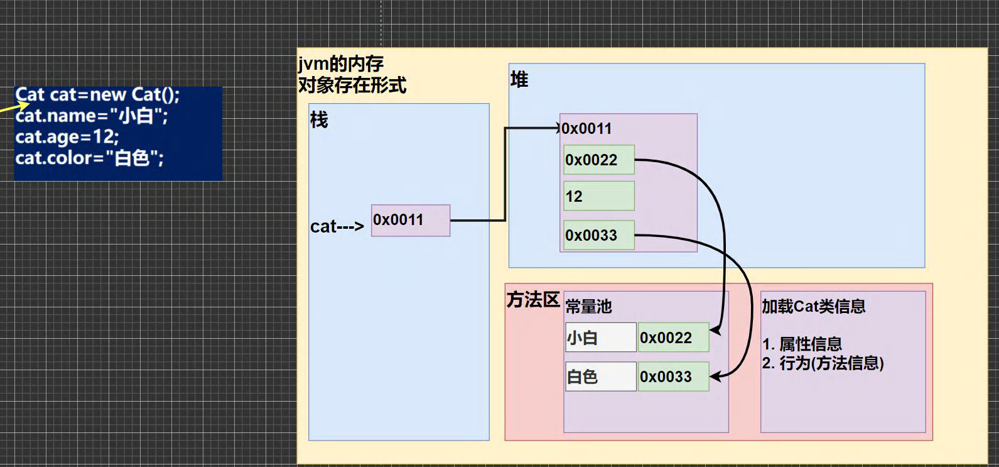
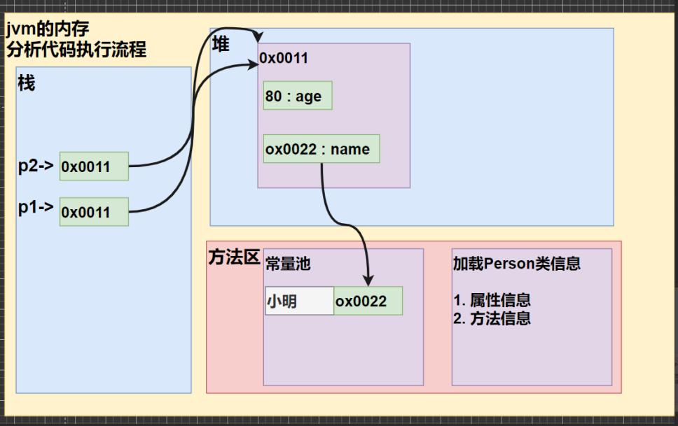
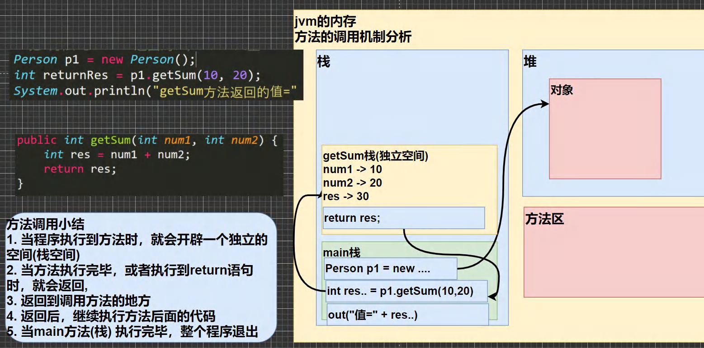
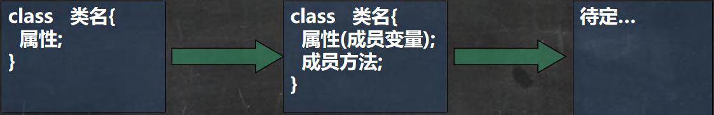
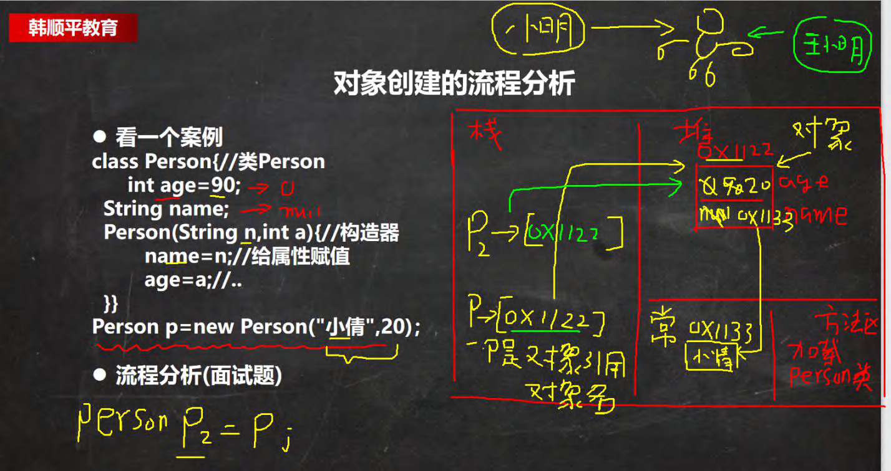
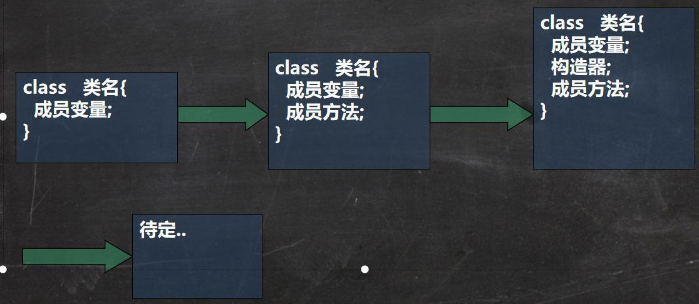

# 面向对象（基础）

### 1、类与对象

#### 1.1 类和对象的区别和联系

1）类是抽象的，概念的，代表一类事物,比如人类,猫类.., 即**它是数据类型**.

2）对象是具体的，实际的，代表一个具体事物, 即 **是实例**.

3）类是对象的模板，对象是类的一个个体，对应一个实例

#### 1.2 对象在内存中存在形式(重要的)



#### 1.3 属性/成员变量/字段

##### 【1】基本介绍

1）从概念或叫法上看： 成员变量 = 属性 = field(字段) （即 成员变量是用来表示属性的，授课中，统一叫 属性)

2）属性是类的一个组成部分，一般是基本数据类型,也可是引用类型(对象，数组)。比如我们前面定义猫类 的 int age 就是属性

##### 【2】注意事项和细节说明

1）属性的定义语法同变量，

示例：`访问修饰符 属性类型 属性名;`

这里老师简单的介绍访问修饰符： 

控制属性的访问范围有四种访问修饰符 public, proctected, 默认, private ,后面我会详细介绍

2）属性的定义类型可以为任意类型，包含基本类型或引用类型

3）属性如果不赋值，有默认值，规则和数组一致。

具体说: int 0，short 0, byte 0, long 0, float 0.0,double 0.0，char \u0000，boolean false，String null

#### 1.4 创建对象

1）先声明再创建

```java
Cat cat ; //声明对象 cat
cat = new Cat(); //创建
```

2）直接创建

```java
Cat cat = new Cat();
```

#### 1.5 访问属性

1）基本语法：`对象名.属性名;`

2）案例演示赋值和输出：

```java
cat.name ;
cat.age;
cat.color;
```

#### 1.6 类和对象的内存分配机制(重要)

【1】Java 内存的结构分析

1）栈： 一般存放基本数据类型(局部变量)

2）堆： 存放对象(Cat cat , 数组等)

3）方法区：常量池(常量，比如字符串)， 类加载信息

【2】Java 创建对象的流程简单分析

1）先加载 Person 类信息(属性和方法信息, 只会加载一次)

2）在堆中分配空间, 进行默认初始化(看规则)

3）把地址赋给 p , p 就指向对象

4）进行指定初始化， 比如 p.name =”jack” p.age = 10



### 2、成员方法

#### 2.1 基本介绍

	在某些情况下，我们要需要定义成员方法(简称方法)。比如人类:除了有一些属性外( 年龄，姓名..),我们人类还有一些行为比如:可以说话、跑步..,通过学习，还可以做算术题。这时就要用 成员方法才能完成。现在要求对 Person 类完善。

#### 2.2 成员方法快速入门

1）添加 speak 成员方法,输出 “我是一个好人”

2）添加 cal01 成员方法,可以计算从 1+..+1000 的结果

3）添加 cal02 成员方法,该方法可以接收一个数 n，计算从 1+..+n 的结果

4）添加 getSum 成员方法,可以计算两个数的和

```java
public class Method01 {
    //编写一个 main 方法
    public static void main(String[] args) {
        //方法使用
        //1. 方法写好后，如果不去调用(使用)，不会输出
        //2. 先创建对象 ,然后调用方法即可
        Person p1 = new Person();
        p1.speak(); //调用方法
        p1.cal01(); //调用 cal01 方法
        p1.cal02(5); //调用 cal02 方法，同时给 n = 5
        p1.cal02(10); //调用 cal02 方法，同时给 n = 10
        //调用 getSum 方法，同时 num1=10, num2=20
        //把 方法 getSum 返回的值，赋给 变量 returnRes
        int returnRes = p1.getSum(10, 20);
        System.out.println("getSum 方法返回的值=" + returnRes);
    }
}
class Person {
   String name;
   int age;
   //方法(成员方法)
   //添加 speak 成员方法,输出 “我是一个好人”
   //老韩解读
   //1. public 表示方法是公开
   //2. void ： 表示方法没有返回值
   //3. speak() : speak 是方法名， () 形参列表
   //4. {} 方法体，可以写我们要执行的代码
   //5. System.out.println("我是一个好人"); 表示我们的方法就是输出一句话
   public void speak() {
     System.out.println("我是一个好人");
   }
   //添加 cal01 成员方法,可以计算从 1+..+1000 的结果
   public void cal01() {
   //循环完成
   int res = 0;
   for(int i = 1; i <= 1000; i++) {
        res += i;
   }
     System.out.println("cal01 方法 计算结果=" + res);
   }
   //添加 cal02 成员方法,该方法可以接收一个数 n，计算从 1+..+n 的结果
   //老韩解读
   //1. (int n) 形参列表， 表示当前有一个形参 n, 可以接收用户输入
   public void cal02(int n) {
   //循环完成
     int res = 0;
     for(int i = 1; i <= n; i++) {
        	res += i;
        }
        	System.out.println("cal02 方法 计算结果=" + res);
        }
        //添加 getSum 成员方法,可以计算两个数的和
        //老韩解读
        //1. public 表示方法是公开的
        //2. int :表示方法执行后，返回一个 int 值
        //3. getSum 方法名
        //4. (int num1, int num2) 形参列表，2 个形参，可以接收用户传入的两个数
        //5. return res; 表示把 res 的值， 返回
        public int getSum(int num1, int num2) {
        	int res = num1 + num2;
        	return res;
    	}
}
```

#### 2.3 方法的调用机制原理(重要!-示意图!!!)



#### 2.4 成员方法的好处

1）提高代码的复用性

2）可以将实现的细节封装起来，然后供其他用户来调用即可

#### 2.5 成员方法的定义

```java
访问修饰符 返回数据类型 方法名（形参列表..） {//方法体
	语句；
	return 返回值;
}
```

1）形参列表：表示成员方法输入 cal(int n) ， getSum(int num1, int num2)

2）返回数据类型：表示成员方法输出, void 表示没有返回值

3）方法主体：表示为了实现某一功能代码块

4）return 语句不是必须的。

5）老韩提示: 结合前面的题示意图, 来理解

#### 2.6 注意事项和使用细节

##### [1] 访问修饰符 (作用是控制 方法使用的范围)

	如果不写默认访问，[有四种: public, protected, 默认, private], 具体在后面说


##### [2] 返回数据类型

1）一个方法最多有一个返回值 [思考，如何返回多个结果 --> 返回数组 ]

2）返回类型可以为任意类型，包含基本类型或引用类型(数组，对象)

3）如果方法要求有返回数据类型，则方法体中最后的执行语句必须为 return 值; 而且要求返回值类型必须和 return 的值类型一致或兼容

4）如果方法是 void，则方法体中可以没有 return 语句，或者 只写 return ;


##### [3] 方法名

	遵循驼峰命名法，最好见名知义，表达出该功能的意思即可, 比如 得到两个数的和 getSum, 开发中按照规范


##### [4] 形参列表

1）一个方法可以有 0 个参数，也可以有多个参数，中间用逗号隔开，比如 `getSum(int n1,int n2)`

2）参数类型可以为任意类型，包含 基本类型 或 引用类型，比如 `printArr(int[][] map)`

3）调用带参数的方法时，一定对应着参数列表传入相同类型或兼容类型的参数！【**getSum**】

4）方法定义时的参数称为形式参数，简称形参；方法调用时的传入参数称为 实际参数，简称实参。
   **实参和形参的类型要一致或兼容、个数、顺序必须一致**！

##### [5] 方法体

	里面写完成功能的具体的语句，可以为输入、输出、变量、运算、分支、循环、方法调用，但里面不能再定义方法！
	即：**方法不能嵌套定义**。

##### [6] 方法调用细节说明(!!!)

1）同一个类中的方法调用：直接调用即可。比如 print(参数);

	案例演示：A 类 sayOk 调用 print()

2）跨类中的方法 A 类调用 B 类方法：需要通过对象名调用。比如 `对象名.方法名（参数);`

	案例演示：B 类 sayHello 调用 print()

3）特别说明一下：跨类的方法调用和方法的访问修饰符相关，先暂时这么提一下，后面我们讲到访问修饰符时，还要再细说。

#### 2.7 类定义的完善



### 3、成员方法传参机制

#### 3.1 基本数据类型的传参机制

	基本数据类型，传递的是值（值拷贝），形参的任何改变不影响实参

#### 3.2 引用数据类型的传参机制

	引用类型传递的是地址（传递也是值，但是值是地址），可以通过形参影响实参！但是，需要确保指向的是同一个地址

#### 3.3 特殊案例展示

1）p=null 和 p = new Person();问题

```java
public class MethodExercise02 {
    //编写一个 main 方法
    public static void main(String[] args) {
        Person p = new Person();
        p.name = "milan";
        p.age = 100;
        //创建 tools
        MyTools tools = new MyTools();
        Person p2 = tools.copyPerson(p);
        //到此 p 和 p2 是 Person 对象，但是是两个独立的对象，属性相同
        System.out.println("p 的属性 age=" + p.age + " 名字=" + p.name);
        System.out.println("p2 的属性 age=" + p2.age + " 名字=" + p2.name);
        //这里老师提示： 可以同 对象比较看看是否为同一个对象
        System.out.println(p == p2);//false
    }
}

class Person {
    String name;
    int age;
}

class MyTools {
    //编写一个方法 copyPerson，可以复制一个 Person 对象，返回复制的对象。克隆对象，
    //注意要求得到新对象和原来的对象是两个独立的对象，只是他们的属性相同
    //
    //编写方法的思路
    //1. 方法的返回类型 Person
    //2. 方法的名字 copyPerson
    //3. 方法的形参 (Person p)
    //4. 方法体, 创建一个新对象，并复制属性，返回即可
        public Person copyPerson(Person p) {
        //创建一个新的对象
        Person p2 = new Person();
        p2.name = p.name; //把原来对象的名字赋给 p2.name
        p2.age = p.age; //把原来对象的年龄赋给 p2.age
        return p2;
    }
}
```

### 4、方法递归调用

#### 4.1 基本介绍

	简单的说: 递归就是方法自己调用自己,每次调用时传入不同的变量.递归有助于编程者解决复杂问题,同时可以让代码变得简洁

#### 4.2 递归能解决什么问题?

1）各种数学问题如：8皇后问题，汉诺塔，阶乘问题，迷宫问题，球和篮子的问题(google编程大赛)

2）各种算法中也会使用到递归，比如快排，归并排序，二分查找，分治算法等

3）将用栈解决的问题 --> 递归 代码比较简洁

#### 4.3 递归举例

列举两个小案例,来帮助大家理解递归调用机制

1）打印问题

2）阶乘问题

```java
public class Recursion01 {
    //编写一个 main 方法
    public static void main(String[] args) {
        T t1 = new T();
        t1.test(4);//输出什么？ n=2 n=3 n=4
        int res = t1.factorial(5);
        System.out.println("5 的阶乘 res =" + res);
    }
}
class T {
//分析
	public void test(int n) {
    if (n > 2) {
        test(n - 1);
    }
    System.out.println("n=" + n);
}
    
//factorial 阶乘
public int factorial(int n) {
   if (n == 1) {
        return 1;
   } else {
        return factorial(n - 1) * n;
        }
    }
}
```

#### 4.4 递归重要规则

1）执行一个方法时，就创建一个新的受保护的独立空间（栈空间）

2）方法的局部变量是独立的，不会相互影响，比如变量

3）如果方法中使用的是引用类型变量（比如数组，对象），就会共享该引用类型的数据

4）递归必须向退出递归的条件逼近，否则就是无限递归，出现 StackOverflowError ,死龟了:)

5）当一个方法执行完毕，或者遇到 return ，就会返回，遵守谁调用，就将结果返回给谁，同时当方法执行完毕可或者返回时，该方法也就执行完毕。

#### 4.5 应用案例

1）请使用递归的方式求出斐波那契数 1,1,2,3,5,8,13.. 给你一个整数 n ，求出它的值是多

2）猴子吃桃子问题：有一堆桃子，猴子第一天吃了其中的一半，并再多吃了一个！以后每天猴子都吃其中的一半，然后再多吃一个。当到第10天时，想再吃时（即还没吃）发现只有1个桃子了。问题：最初共多少个桃子？

```java
public class RecursionExercise01 {
	//编写一个 main 方法
	public static void main(String[] args) {
    T t1 = new T();
    // int n = 7;
    // int res = t1.fibonacci(n);
    // if(res != -1) {
    // System.out.println("当 n="+ n +" 对应的斐波那契数=" + res);
    // }
    //
    //桃子问题
    int day = 0;
    int peachNum = t1.peach(day);
    if(peachNum != -1) {
    	System.out.println("第 " + day + "天有" + peachNum + "个桃子");
    	}
    }
}

class T {
    /*
    请使用递归的方式求出斐波那契数 1,1,2,3,5,8,13...给你一个整数 n，求出它的值是多
    思路分析
    1. 当 n = 1 斐波那契数 是 1
    2. 当 n = 2 斐波那契数 是 1
    3. 当 n >= 3 斐波那契数 是前两个数的和
    4. 这里就是一个递归的思路
    */
    public int fibonacci(int n) {
        if( n >= 1) {
        	if( n == 1 || n == 2) {
        		return 1;
        	} else {
				return fibonacci(n-1) + fibonacci(n-2);
			}
		} else {
			System.out.println("要求输入的 n>=1 的整数");
			return -1;
	}
}
    /*
    猴子吃桃子问题：有一堆桃子，猴子第一天吃了其中的一半，并再多吃了一个！
    以后每天猴子都吃其中的一半，然后再多吃一个。当到第 10 天时，
    想再吃时（即还没吃），发现只有 1 个桃子了。问题：最初共多少个桃子？
    思路分析 逆推
    1. day = 10 时 有 1 个桃子
    2. day = 9 时 有 (day10 + 1) * 2 = 4
    3. day = 8 时 有 (day9 + 1) * 2 = 10
    4. 规律就是 前一天的桃子 = (后一天的桃子 + 1) *2//就是我们的能力
    5. 递归
    */
	public int peach(int day) {
		if(day == 10) {//第 10 天，只有 1 个桃
			return 1;
		} else if ( day >= 1 && day <=9 ) {
			return (peach(day + 1) + 1) * 2;//规则，自己要想
    	} else {
			System.out.println("day 在 1-10");
			return -1;
		}
	}
}
```

3）迷宫问题

```java
public class MiGong {
    //编写一个 main 方法
    public static void main(String[] args) {
        //思路
        //1. 先创建迷宫，用二维数组表示 int[][] map = new int[8][7];
        //2. 先规定 map 数组的元素值: 0 表示可以走 1 表示障碍物
        int[][] map = new int[8][7];
        //3. 将最上面的一行和最下面的一行，全部设置为 1
        for(int i = 0; i < 7; i++) {
            map[0][i] = 1;
            map[7][i] = 1;
        }
        //4.将最右面的一列和最左面的一列，全部设置为 1
        for(int i = 0; i < 8; i++) {
            map[i][0] = 1;
            map[i][6] = 1;
		}
        map[3][1] = 1;
        map[3][2] = 1;
        map[2][2] = 1; //测试回溯
        // map[2][1] = 1;
        // map[2][2] = 1;
        // map[1][2] = 1;
        //输出当前的地图
        System.out.println("=====当前地图情况======");
        for(int i = 0; i < map.length; i++) {
        	for(int j = 0; j < map[i].length; j++) {
            	System.out.print(map[i][j] + " ");//输出一行
            }
		System.out.println();
		}
        //使用 findWay 给老鼠找路
        T t1 = new T();
        //下右上左
        t1.findWay(map, 1, 1);
        System.out.println("\n====找路的情况如下=====");
        for(int i = 0; i < map.length; i++) {
			for(int j = 0; j < map[i].length; j++) {
            	System.out.print(map[i][j] + " ");//输出一行
            }
		System.out.println();
		}
	}
}


class T {
    //使用递归回溯的思想来解决老鼠出迷宫
    //老韩解读
    //1. findWay 方法就是专门来找出迷宫的路径
    //2. 如果找到，就返回 true ,否则返回 false
    //3. map 就是二维数组，即表示迷宫
    //4. i,j 就是老鼠的位置，初始化的位置为(1,1)
    //5. 因为我们是递归的找路，所以我先规定 map 数组的各个值的含义
    // 0 表示可以走 1 表示障碍物 2 表示可以走 3 表示走过，但是走不通是死路
    //6. 当 map[6][5] =2 就说明找到通路,就可以结束，否则就继续找.
    //7. 先确定老鼠找路策略 下->右->上->左
    public boolean findWay(int[][] map , int i, int j) {
        if(map[6][5] == 2) {//说明已经找到
        	return true;
		} else {
			if(map[i][j] == 0) {//当前这个位置 0,说明表示可以走
        //我们假定可以走通
        map[i][j] = 2;
        //使用找路策略，来确定该位置是否真的可以走通
        //下->右->上->左
		if(findWay(map, i + 1, j)) {//先走下
			return true;
		} else if(findWay(map, i, j + 1)){//右
			return true;
		} else if(findWay(map, i-1, j)) {//上
			return true;
		} else if(findWay(map, i, j-1)){//左
			return true;
		} else {
			map[i][j] = 3;
			return false;
	}
} else { //map[i][j] = 1 , 2, 3
	return false;
		}
	}
}
//修改找路策略，看看路径是否有变化
//下->右->上->左 ==> 上->右->下->左
	public boolean findWay2(int[][] map , int i, int j) {
    if(map[6][5] == 2) {//说明已经找到
    	return true;
    } else {
    	if(map[i][j] == 0) {//当前这个位置 0,说明表示可以走
    	//我们假定可以走通
    	map[i][j] = 2;
    	//使用找路策略，来确定该位置是否真的可以走通
    	//上->右->下->左
    	if(findWay2(map, i - 1, j)) {//先走上
    		return true;
    	} else if(findWay2(map, i, j + 1)){//右
    		return true;
    	} else if(findWay2(map, i+1, j)) {//下
    		return true;
    	} else if(findWay2(map, i, j-1)){//左
    		return true;
    	} else {
    		map[i][j] = 3;
   			return false;
    	}
    } else { //map[i][j] = 1 , 2, 3
    	return false;
    		}
    	}
    }
}
```

4）汉诺塔

	汉诺塔：汉诺塔（又称河内塔）问题是源于印度一个古老传说的益智玩具。大梵天创造世界的时候做了三根金刚石柱子，在一根柱子上从下往上按照大小顺序摞着 64 片圆盘。大梵天命令婆罗门把圆盘从下面开始按大小顺序重新摆放在另一根柱子上。并且规定，在小圆盘上不能放大圆盘，在三根柱子之间一次只能移动一个圆盘。
	
	假如每秒钟移动一次，共需多长时间呢？移完这些金片需要 5845.54 亿年以上，太阳系的预期寿命据说也就是数百亿年。真的过了 5845.54 亿年，地球上的一切生命，连同梵塔、庙宇等，都早已经灰飞烟灭

```java
public class HanoiTower {
    //编写一个 main 方法
    public static void main(String[] args) {
        Tower tower = new Tower();
        tower.move(64, 'A', 'B', 'C');
        }
    }
class Tower {
    //方法
    //num 表示要移动的个数, a, b, c 分别表示 A 塔，B 塔, C 塔
    public void move(int num , char a, char b ,char c) {
        //如果只有一个盘 num = 1
        if(num == 1) {
    		System.out.println(a + "->" + c);
    	} else {
    	//如果有多个盘，可以看成两个 , 最下面的和上面的所有盘(num-1)
    	//(1)先移动上面所有的盘到 b, 借助 c
    	move(num - 1 , a, c, b);
    	//(2)把最下面的这个盘，移动到 c
    	System.out.println(a + "->" + c);
    	//(3)再把 b 塔的所有盘，移动到 c ,借助 a
    	move(num - 1, b, a, c);
    	}
    }
}
```

### 5、方法重载(OverLoad)

#### 5.1 基本介绍

	java 中允许同一个类中，多个同名方法的存在，但要求 形参列表不一致！
	
	比如：System.out.println(); out 是 PrintStream 类型

#### 5.2 重载的好处

1）减轻了起名的麻烦

2）减轻了记名的麻烦

#### 5.3 快速入门案例

案例：类：MyCalculator 方法：calculate

1）calculate(int n1, int n2) //两个整数的和

2）calculate(int n1, double n2) //一个整数，一个 double 的和

3）calculate(double n2, int n1)//一个 double ,一个 Int 和

4）calculate(int n1, int n2,int n3)//三个 int 的和

```java
public class OverLoad01 {
	//编写一个 main 方法
	public static void main(String[] args) {
    // System.out.println(100);
    // System.out.println("hello,world");
    // System.out.println('h');
    // System.out.println(1.1);
    // System.out.println(true);
    //
    MyCalculator mc = new MyCalculator();
    System.out.println(mc.calculate(1, 2));
    System.out.println(mc.calculate(1.1, 2));
    System.out.println(mc.calculate(1, 2.1));
    }
}


class MyCalculator {
    //下面的四个 calculate 方法构成了重载
    //两个整数的和
    public int calculate(int n1, int n2) {
    	System.out.println("calculate(int n1, int n2) 被调用");
    return n1 + n2;
}
    
    
//没有构成方法重载, 仍然是错误的，因为是方法的重复定义
// public void calculate(int n1, int n2) {
// System.out.println("calculate(int n1, int n2) 被调用");
// int res = n1 + n2;
// }
//看看下面是否构成重载, 没有构成，而是方法的重复定义,就错了
// public int calculate(int a1, int a2) {
// System.out.println("calculate(int n1, int n2) 被调用");
// return a1 + a2;
// }
//一个整数，一个 double 的和
public double calculate(int n1, double n2) {
	return n1 + n2;
}
//一个 double ,一个 Int 和
public double calculate(double n1, int n2) {
	System.out.println("calculate(double n1, int n2) 被调用..");
	return n1 + n2;
}
//三个 int 的和
public int calculate(int n1, int n2,int n3) {
	return n1 + n2 + n2;
	}
}
```

#### 5.4 注意事项和使用细节

1）方法名：必须相同

2）形参列表：必须不同（形参类型或个数或顺序，至少有一样不同，参数名无要求）

3）返回类型：无要求

### 6、可变参数

#### 6.1 基本概念

	java 允许将同一个类中多个同名同功能但参数个数不同的方法，封装成一个方法。
	
	就可以通过可变参数实现

#### 6.2 基本语法

```java
访问修饰符 返回类型 方法名(数据类型... 形参名) {
}
```

#### 6.3 快速入门

	方法 sum 【可以计算 2 个数的和，3 个数的和 ， 4. 5， 。。】

```java
public class VarParameter01 {
    //编写一个 main 方法
    public static void main(String[] args) {
        HspMethod m = new HspMethod();
        System.out.println(m.sum(1, 5, 100)); //106
        System.out.println(m.sum(1,19)); //20
    }
}


class HspMethod {
    //可以计算 2 个数的和，3 个数的和 ， 4. 5， 。。
    //可以使用方法重载
    // public int sum(int n1, int n2) {//2 个数的和
    // return n1 + n2;
    // }
    // public int sum(int n1, int n2, int n3) {//3 个数的和
    // return n1 + n2 + n3;
    // }
    // public int sum(int n1, int n2, int n3, int n4) {//4 个数的和
    // return n1 + n2 + n3 + n4;
    // }
    //.....
    //上面的三个方法名称相同，功能相同, 参数个数不同-> 使用可变参数优化
    //老韩解读
    //1. int... 表示接受的是可变参数，类型是 int ,即可以接收多个 int(0-多)
    //2. 使用可变参数时，可以当做数组来使用 即 nums 可以当做数组
    //3. 遍历 nums 求和即可
	public int sum(int... nums) {
        //System.out.println("接收的参数个数=" + nums.length);
        int res = 0;
        for(int i = 0; i < nums.length; i++) {
			res += nums[i];
		}
		return res;
	}
}
```

#### 6.4 注意事项和使用细节

1）可变参数的实参可以为 0 个或任意多个。

2）可变参数的实参可以为数组。

3）可变参数的本质就是数组

4）可变参数可以和普通类型的参数一起放在形参列表，但必须保证可变参数在最后

5）一个形参列表中只能出现一个可变参数

```java
public class VarParameterDetail {
    //编写一个 main 方法
    public static void main(String[] args) {
        //细节: 可变参数的实参可以为数组
        int[] arr = {1, 2, 3};
            T t1 = new T();
            t1.f1(arr);
        }
    }
class T {
    public void f1(int... nums) {
    	System.out.println("长度=" + nums.length);
    }
    //细节: 可变参数可以和普通类型的参数一起放在形参列表，但必须保证可变参数在最后
    public void f2(String str, double... nums) {
    }
    //细节: 一个形参列表中只能出现一个可变参数
    //下面的写法是错的.
    // public void f3(int... nums1, double... nums2) {
    // }
}
```

### 7、作用域

#### 7.1 基本使用

1）在 java 编程中，主要的变量就是属性（成员变量）和局部变量

2）我们说的局部变量一般是指在成员方法中定义的变量。【举例 Cat 类：cry】

3）java 中作用域的分类

全局变量：也就是属性，作用域为整个类体 Cat 类：cry eat 等方法使用属性

【举例】

局部变量：也就是除了属性之外的其他变量，作用域为定义它的代码块中！

4）全局变量（属性）可以不赋值，直接使用，因为有默认值，局部变量必须赋值后才能使用，因为没有默认值。

#### 7.2 注意事项和细节使用

1）属性和局部变量可以重名，访问时遵循就近原则

2）在同一个作用域中，比如在同一个成员方法中，两个局部变量，不能重名。

3）**属性生命周期较长**，伴随着对象的创建而创建，伴随着对象的销毁而销毁。

  局部变量，**生命周期较短**，伴随着它的代码块的执行而创建，伴随着代码块的结束而销毁，即在一次方法调用过程中。

4）作用域范围不同

	全局变量/属性：可以被本类使用，或其他类使用（通过对象调用）
	
	局部变量：只能在本类中对应的方法中使用

5）修饰符不同

	全局变量/属性可以加修饰符
	
	局部变量不可以加修饰符

### 8、构造方法/构造器

#### 8.1 基本语法

```java
[修饰符] 方法名(形参列表){
	方法体;
}
```

说明：

1）构造器的修饰符可以默认， 也可以是 public protected private

2）构造器没有返回值

3）方法名 和类名字必须一样

4）参数列表 和 成员方法一样的规则

5）构造器的调用, 由系统完成

#### 8.2 基本介绍

	构造方法又叫构造器(constructor)，是类的一种特殊的方法，它的主要作用是完成对新对象的初始化。它有几个特点：

1）方法名和类名相同

2）没有返回值

3）在创建对象时，系统会自动的调用该类的构造器完成对象的初始化。

#### 8.3 注意事项和使用细节

1）一个类可以定义多个不同的构造器，即构造器重载

比如：我们可以再给 Person 类定义一个构造器，用来创建对象的时候，只指定人名，不需要指定年龄

2）构造器名和类名要相同

3）构造器没有返回值

4）构造器是完成对象的初始化，并不是创建对象

5）在创建对象时，系统自动的调用该类的构造方法

6）如果程序员没有定义构造器，系统会自动给类生成一个默认无参构造器（也叫默认构造器)。

比如 Dog(){}，使用 javap 指令反编译看看

7）一旦定义了自己的构造器，默认的构造器就覆盖了，就不能再使用默认的无参构造器，除非显式的定义一下。

即：Dog(){} ;（这点很重要）

### 9、对象创建的流程分析

#### 9.1 案例分析

```java
class Person{//类Person
    int age = 90;
    String name;
    Person(String n,int a){//构造器
        name = n;//给属性赋值
        age = a;//..
        
    }
}

Person p = new Person("小倩",20);
```

流程分析（面试题）

1）加载 Person 类信息(Person.class)，只会加载一次

2）在堆中分配空间（地址）

3）完成对象初始化

3.1 默认初始化： age = 0 ; name = null

3.2 显式初始化：age = 90 ; name = null 

3.3 构造器的初始化 age = 20 ; name = 小倩

4）在对象在堆中的地址，返回给 p ( p 是对象名，也可以理解成是对象的引用)




学习完构造器后,我们类的定义就应该更加完善了




### 10、this 关键字

#### 10.1 什么是 this

	java 虚拟机会给每个对像分配 this ，代表当前对象。坦白的讲要明白 this 不是件容易的事，我给大家打一个比方。【上帝创世界小故事】

**代码理解：**

```java
public class This01 {
    //编写一个 main 方法
    public static void main(String[] args) {
        Dog dog1 = new Dog("大壮", 3);
        System.out.println("dog1 的 hashcode=" + dog1.hashCode());
        //dog1 调用了 info()方法
        dog1.info();
        System.out.println("============");
        Dog dog2 = new Dog("大黄", 2);
        System.out.println("dog2 的 hashcode=" + dog2.hashCode());
        dog2.info();
    }
}

class Dog{ //类
    String name;
    int age;
    // public Dog(String dName, int dAge){//构造器
    // name = dName;
    // age = dAge;
    // }
    //如果我们构造器的形参，能够直接写成属性名，就更好了
    //但是出现了一个问题，根据变量的作用域原则
    //构造器的 name 是局部变量，而不是属性
    //构造器的 age 是局部变量，而不是属性
    //==> 引出 this 关键字来解决
    public Dog(String name, int age){//构造器
    //this.name 就是当前对象的属性 name
    	this.name = name;
    //this.age 就是当前对象的属性 age
    	this.age = age;
    	System.out.println("this.hashCode=" + this.hashCode());
    }
    
    public void info(){//成员方法,输出属性 x 信息
    	System.out.println("this.hashCode=" + this.hashCode());
    	System.out.println(name + "\t" + age + "\t");
    }
}
```

this 小结：**简单的说，哪个对象调用，this 就代表哪个对象**

#### 10.2 this 的注意事项和使用细节

1）this 关键字可以用来访问本类的属性、方法、构造器

2）this 用于区分当前类的属性和局部变量

3）访问成员方法的语法：this.方法名(参数列表);

4）访问构造器语法：this(参数列表); 注意只能在构造器中使用(即只能在构造器中访问另外一个构造器, 必须放在第一条语句)

5）this 不能在类定义的外部使用，只能在类定义的方法中使用。

#### 10.3 应用案例

	定义 Person 类，里面有 name、age 属性，并提供 compareTo 比较方法，用于判断是否和另一个人相等，提供测试TestPerson 用于测试, 名字和年龄完全一样，就返回 true, 否则返回 false

```java
public class TestPerson {
    //编写一个 main 方法
    public static void main(String[] args) {
        Person p1 = new Person("mary", 20);
        Person p2 = new Person("mary", 20);
        System.out.println("p1 和 p2 比较的结果=" + p1.compareTo(p2));
    }
}
/*
定义 Person 类，里面有 name、age 属性，并提供 compareTo 比较方法，
用于判断是否和另一个人相等，提供测试类 TestPerson 用于测试,
名字和年龄完全一样，就返回 true, 否则返回 false
*/
class Person {
    String name;
    int age;
    //构造器
    public Person(String name, int age) {
        this.name = name;
        this.age = age;
    }
    
//compareTo 比较方法
public boolean compareTo(Person p) {
    //名字和年龄完全一样
    // if(this.name.equals(p.name) && this.age == p.age) {
    // return true;
    // } else {
    // return false;
    // }
	return this.name.equals(p.name) && this.age == p.age;
	}
}
```