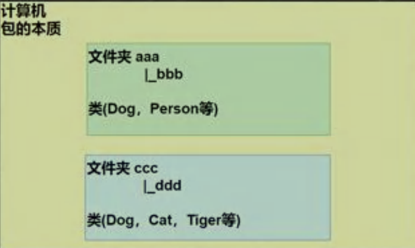
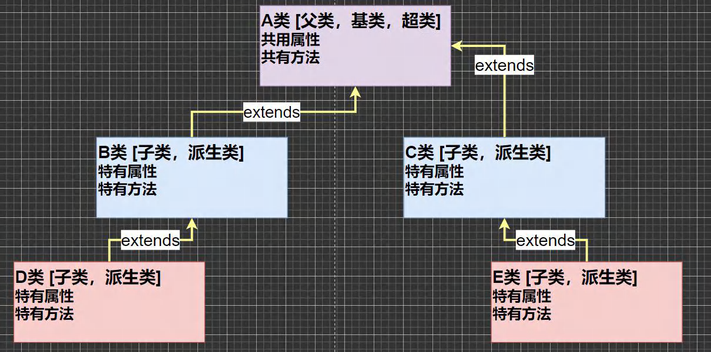
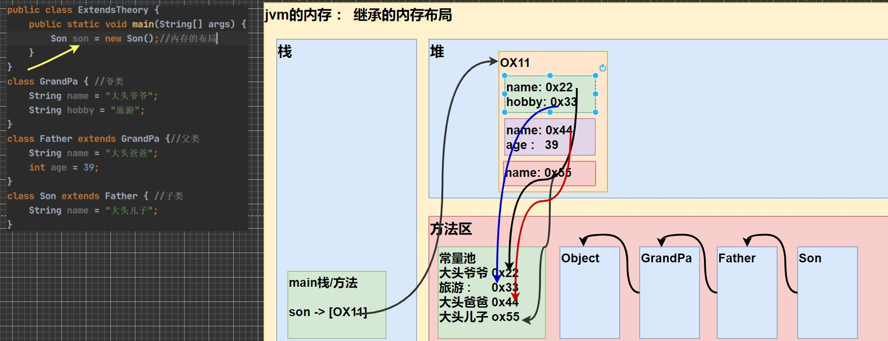
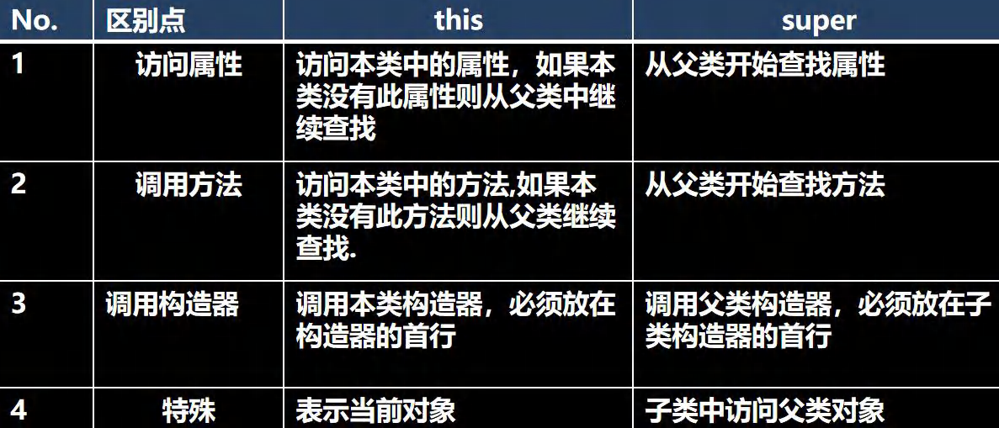
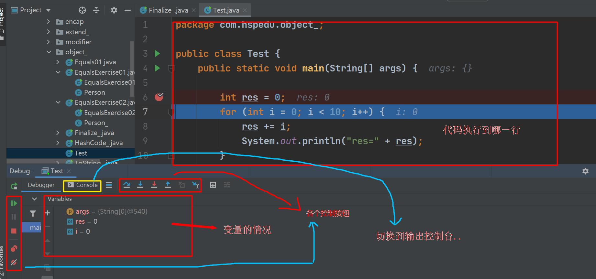

# 面向对象（中级）

### 1、包

#### 1.1 包基本语法

1）package 关键字，表示打包

2）com.hspedu：表示包名

#### 1.2 包的三大作用

1）区分相同名字的类

2）当类很多时，可以很好的管理类[看Java API文档]

3）控制访问范围

#### 1.3 包的本质分析(原理)

	包的本质实际上就是创健不同的文件夹目录来保存类文件，画出示意图，



#### 1.4 包的命名

1）规则

	只能包含数字、字母、下划线、小圆点，但不能用数字开头，不能是关键字或保留字

2）规范

	一般是小写字母 + 小圆点一般是 com.公司名.项目名.业务模块名

#### 1.5 常用的包

	一个包下,包含很多的类，java 中常用的包有:

1）java.lang.*  //lang 包是基本包，默认引入，不需要再引入.

2）java.util.*  //util 包，系统提供的工具包, 工具类，使用 Scanner

3）java.net.*   //网络包，网络开发

4）java.awt.*   //是做 java 的界面开发，GUI

#### 1.6 如何引入包

1）语法：`import 包;`

	我们引入一个包的主要目的是要使用该包下的类
	
	比如 import java.util.Scanner; 就只是引入一个类Scanner。
	
	import java.util.*;  //表示将java.util包所有都引入

2）注意：

	建议：我们需要使用到哪个类，就导入哪个类即可，不建议使用 * 导入

#### 1.7 注意事项和使用细节

1）package 的作用是声明当前类所在的包，需要放在类的最上面，一个类中最多只有一句 package

2）import 指令 位置放在 package 的下面，在类定义前面，可以有多句且没有顺序要求。

### 2、访问修饰符

#### 2.1 基本介绍

	java 提供四种访问控制修饰符号，用于控制方法和属性(成员变量)的访问权限（范围）：

1）公开级别：用 public 修饰,对外公开。

2）受保护级别：用 protected 修饰,对子类和同一个包中的类公开。

3）默认级别：没有修饰符号,向同一个包的类公开。

4）私有级别：用 private 修饰,只有类本身可以访问,不对外公开。

### 2.2 4 种访问修饰符的访问范围


#### 2.3 使用的注意事项

1）修饰符可以用来修饰类中的属性，成员方法以及类

2）只有默认的和 publicz 才能修饰类！并且遵循上述访问权限的特点。

3）因为没有学习继承，因此关于在子类中的访问权限，我们讲完子类后，在回头讲解

4）成员方法的 访问规则 和 属性 完全一样.

//com.hspedu.modifier：需要很多文件来说明(A类，B类，Test类.)

### 3、面向对象编程三大特征

#### 3.1 基本介绍

	面向对象编程有三大特征：封装、继承 和 多态

#### 3.2 封装介绍

	封装 (encapsulation) 就是把抽象出的数据 [属性] 和对数据的操作 [方法] 封装在一起，数据被保护在内部，程序的其它部分只有通过被授权的操作 [方法] ，才能对数据进行操作。

#### 3.3 封装的理解和好处

1）隐藏实现细节：方法（连接数据库） <-- 调用（传入参数..）

2）可以对数据进行验证，保证安全合理

#### 3.4 封装的实现步骤 (三步)

1）将属性进行私有化 private【不能直接修改属性】

2）提供一个公共的 (public)set 方法，用于对属性判断并赋值

```java
public void setXxx(类型 参数名){ //Xxx表示某个属性
	//加入数据验证的业务逻辑
	属性 = 参数名;
}
```

3）提供一个公共的(public)get方法，用于获取属性的值

```java
public 数据类型 getXxx(){ //权限判断，Xxx某个属性
	return xx;
}
```

#### 3.5 快速入门案例

	不能随便查看人的年龄，工资等隐私，并对设置的年龄进行合理的验证。年龄合理就设置，否则给默认年龄，必须在 1-120，年龄，工资不能直接查看

 name 的长度在 2-6 字符之间

```java
public class Encapsulation01 {
    public static void main(String[] args) {
        //如果要使用快捷键 alt+r, 需要先配置主类
        //第一次，我们使用鼠标点击形式运算程序，后面就可以用
        Person person = new Person();
        person.setName("韩顺平");
        person.setAge(30);
        person.setSalary(30000);
        System.out.println(person.info());
        System.out.println(person.getSalary());
        //如果我们自己使用构造器指定属性
        Person smith = new Person("smith", 80, 50000);
        System.out.println("====smith 的信息======");
        System.out.println(smith.info());
    }
}


/*
那么在 java 中如何实现这种类似的控制呢?
请大家看一个小程序(com.hspedu.encap: Encapsulation01.java),
不能随便查看人的年龄,工资等隐私，并对设置的年龄进行合理的验证。年龄合理就设置，否则给默认
年龄, 必须在 1-120, 年龄， 工资不能直接查看 ， name 的长度在 2-6 字符 之间
*/
class Person {
    public String name; //名字公开
    private int age; //age 私有化
    private double salary; //..
    public void say(int n,String name) {}
    //构造器 alt+insert
    public Person() {}
    //有三个属性的构造器
    public Person(String name, int age, double salary) {
        // this.name = name;
        // this.age = age;
        // this.salary = salary;
        //我们可以将 set 方法写在构造器中，这样仍然可以验证
        setName(name);
        setAge(age);
        setSalary(salary);
	}
    //自己写 setXxx 和 getXxx 太慢，我们使用快捷键
    //然后根据要求来完善我们的代码.
    public String getName() {
        return name;
	}
    
    public void setName(String name) {
    //加入对数据的校验,相当于增加了业务逻辑
		if(name.length() >= 2 && name.length() <=6 ) {
			this.name = name;
		}else {
			System.out.println("名字的长度不对，需要(2-6)个字符，默认名字");
			this.name = "无名人";
		}
	}
    
    
    public int getAge() {
        return age;
    }
    
    public void setAge(int age) {
        //判断
        if(age >= 1 && age <= 120) {//如果是合理范围
        	this.age = age;
        } else {
            System.out.println("你设置年龄不对，需要在 (1-120), 给默认年龄 18 ");
            this.age = 18;//给一个默认年龄
    	}
    }
    
    
    public double getSalary() {
        //可以这里增加对当前对象的权限判断
        return salary;
    }
    
    
    public void setSalary(double salary) {
    	this.salary = salary;
    }
    
    //写一个方法，返回属性信息
    public String info() {
    	return "信息为 name=" + name + " age=" + age + " 薪水=" + salary;
    }
}
```

**将构造器和 setXxx 结合**

```java
//有三个属性的构造器
public Person(String name, int age, double salary) {
    // this.name = name;
    // this.age = age;
    // this.salary = salary;
    //我们可以将 set 方法写在构造器中，这样仍然可以验证
    setName(name);
    setAge(age);
    setSalary(salary);
}
```

### 4、继承

#### 4.1 继承基本介绍和示意图

	继承可以解决代码复用,让我们的编程更加靠近人类思维.当多个类存在相同的属性(变量)和方法时,可以从这些类中抽象出父类,在父类中定义这些相同的属性和方法，所有的子类不需要重新定义这些属性和方法，只需要通过 extends 来声明继承父类即可。画出继承的示意图



#### 4.2 继承的基本语法

```java
class 子类 extends 父类{}
```

1）子类就会自动拥有父类定义的属性和方法

2）父类又叫超类，基类。

3）子类又叫派生类。

#### 4.3 继承给编程带来的便利

1）代码的复用性提高了

2）代码的扩展性和维护性提高了

#### 4.4 继承的深入讨论/细节问题

1）子类继承了所有的属性和方法，非私有的属性和方法可以在子类直接访问, 但是私有属性和方法不能在子类直接访问，要通过父类提供公共的方法去访问

2）子类必须调用父类的构造器，完成父类的初始化

3）当创建子类对象时，不管使用子类的哪个构造器，默认情况下总会去调用父类的无参构造器，如果父类没有提供无参构造器，则必须在子类的构造器中用 super 去指定使用父类的哪个构造器完成对父类的初始化工作，否则，编译不会通过

4）如果希望指定去调用父类的某个构造器，则显式的调用一下 : super(参数列表)

5）super 在使用时，必须放在构造器第一行(super 只能在构造器中使用)

6）super() 和 this() 都只能放在构造器第一行，因此这两个方法不能共存在一个构造器

7）java 所有类都是 Object 类的子类, Object 是所有类的基类.

8）父类构造器的调用不限于直接父类！将一直往上追溯直到 Object 类(顶级父类)

9）子类最多只能继承一个父类(指直接继承)，即 java 中是单继承机制。

思考：如何让 A 类继承 B 类和 C 类？ 【A 继承 B， B 继承 C】

10）不能滥用继承，子类和父类之间必须满足 is-a 的逻辑关系

#### 4.5 继承的本质分析(重要)

```java
/**
* 讲解继承的本质
*/
public class ExtendsTheory {
    public static void main(String[] args) {
        Son son = new Son();//内存的布局
        //?-> 这时请大家注意，要按照查找关系来返回信息
        //(1) 首先看子类是否有该属性
        //(2) 如果子类有这个属性，并且可以访问，则返回信息
        //(3) 如果子类没有这个属性，就看父类有没有这个属性(如果父类有该属性，并且可以访问，就返回信息..)
        //(4) 如果父类没有就按照(3)的规则，继续找上级父类，直到 Object...
        System.out.println(son.name);//返回就是大头儿子
        //System.out.println(son.age);//返回的就是 39
        //System.out.println(son.getAge());//返回的就是 39
        System.out.println(son.hobby);//返回的就是旅游
    }
}
class GrandPa { //爷类
    String name = "大头爷爷";
    String hobby = "旅游";
}
class Father extends GrandPa {//父类
    String name = "大头爸爸";
    private int age = 39;
    public int getAge() {
    	return age;
    }
}
class Son extends Father { //子类
	String name = "大头儿子";
}
```

**子类创建的内存布局**



### 5、super 关键字

#### 5.1 基本介绍

	super 代表父类的引用，用于 访问父类的属性、方法、构造器

#### 5.2 基本语法

1）访问父类的属性，但不能访问父类的 private 属性

```java
super.属性名;
```

2）访问父类的方法，不能访问父类的 private 方法

```java
super.方法名(参数列表);
```

3）访问父类的构造器（这点前面用过）

```java
super(参数列表); //只能放在构造器的第一句，只能出现一句！
```

#### 5.3 super 给编程带来的便利/细节

1）调用父类的构造器的好处 (分工明确，父类属性由父类初始化，子类的属性由子类初始化)

2）当子类中有和父类中的成员 (属性和方法) 重名时，为了访问父类的成员，必须通过 super。如果没有重名，使用super、this、直接访问是一样的效果！

3）super 的访问不限于直接父类，如果爷爷类和本类中有同名的成员，也可以使用 super 去访问爷爷类的成员；如果多个基类（上级类）中都有同名的成员，使用 super 访问遵循就近原则。A --> B --> C，当然也需要遵守访问权限的相关规则

#### 5.4 super 和 this 的比较



### 6、方法重写/覆盖(override)

#### 6.1 基本介绍

	简单的说：方法覆盖（重写）就是子类有一个方法，和父类的某个方法的名称、返回类型、参数一样，那么我们就说子类的这个方法覆盖了父类的方法。

#### 6.2 快速入门

```java
public class Animal {
    public void cry() {
    	System.out.println("动物叫唤..");
    }
    
    public Object m1() {
   		return null;
    }
    
    public String m2() {
    	return null;
    }
    
    publicAAAm3() {
    	return null;
    }
    
	protected void eat() {}
}
package com.hspedu.override_;
    public class Dog extendsAnimal{
        //老韩解读
        //1. 因为 Dog 是 Animal 子类
        //2. Dog 的 cry 方法和 Animal 的 cry 定义形式一样(名称、返回类型、参数)
        //3. 这时我们就说 Dog 的 cry 方法，重写了 Animal 的 cry 方法
        public void cry() {
    		System.out.println("小狗汪汪叫..");
		}
        //细节: 子类方法的返回类型和父类方法返回类型一样，
        // 或者是父类返回类型的子类
        比如 父类 返回类型是 Object ,
        // 子类方法返回类型是 String
        public String m1() {
        	return null;
        }
        //这里 Object 不是 String 的子类，因此编译错误
        // public Object m2() {
        // 		return null;
        // }
        // public BBB m3() {
        // 		return null;
        // }
        //细节: 子类方法不能缩小父类方法的访问权限 【演示】
        //public > protected > 默认>private
		public void eat() {}
	}

class AAA{}

class BBB extendsAAA {}


public class Override01 {
    public static void main(String[] args) {
        //演示方法重写的情况
        Dog dog = new Dog();
        dog.cry();//ctrl+b
	}
}
```

#### 6.3 注意事项和使用细节

	方法重写也叫方法覆盖，需要满足下面的条件

1）子类的方法的 形参列表，方法名称，要和父类方法的形参列表，方法名称完全一样。

2）子类方法的返回类型和父类方法返回类型一样，或者是父类返回类型的子类

	比如父类返回类型是Object,子类方法返回类型是String

3）子类方法不能缩小父类方法的访问权限。public > protected > 默认 > private

### 7、多态

#### 7.1 基本介绍

	方法或对象具有多种形态。是面向对象的第三大特征，多态是建立在封装和继承基础之上的。

#### 7.2 多态的具体体现

##### 1）方法的多态

重写和重载就体现多态

```java
public class PloyMethod {
    public static void main(String[] args) {
        //方法重载体现多态
        Aa = new A();
        //这里我们传入不同的参数，就会调用不同 sum 方法，就体现多态
        System.out.println(a.sum(10, 20));
        System.out.println(a.sum(10, 20, 30));
        //方法重写体现多态
        B b = new B();
        a.say();
        b.say();
    }
}

class B { //父类
    public void say() {
    	System.out.println("B say() 方法被调用...");
    }
}

class Aextends B {//子类
    public int sum(int n1, int n2){//和下面 sum 构成重载
    	return n1 + n2;
    }
    public int sum(int n1, int n2, int n3){
    	return n1 + n2 + n3;
    }
    public void say() {
    	System.out.println("Asay() 方法被调用...");
    }
}
```

##### 2）对象的多态（核心，困难，重点）

(1) 一个对象的编译类型和运行类型可以不一致。

(2) 编译类型在定义对象时，就确定了，不能改变。

(3) 运行类型是可以变化的。

(4) 编译类型看定义时 = 号的左边

    运行类型看 = 号的右边

#### 7.3 多态注意事项和细节讨论

	多态的 **前提**是：两个对象(类)存在继承关系

##### 1）多态的向上转型

(1) 本质：

	父类的引用指向了子类的对象

(2) 语法：

	`父类类型 引用名 = new 子类类型();`

(3) 特点：

	[1] 编译类型看左边，运行类型看右边。
	
	[2] 可以调用父类中的所有成损（需遵守访问权限）
	
	[3] 不能调用子类中特有成员
	
	[4] 最终运行效果看子类的具体实现！

##### 2）多态向下转型

(1) 语法：

`子类类型 引用名 = (子类类型) 父类引用;`

(2) 只能强转父类的引用，不能强转父类的对象

(3) 要求父类的引用必须指向的是当前目标类型的对象

(4) 当向下转型后，可以调用子类类型中所有的成员

##### 3）案例演示

```java
public class Animal {
    String name = "动物";
    int age = 10;
    public void sleep(){
    	System.out.println("睡");
    }
    public void run(){
   		System.out.println("跑");
    }
    public void eat(){
    	System.out.println("吃");
    }
    public void show(){
    	System.out.println("hello,你好");
    }
}


public class Cat extends Animal {
    public void eat(){//方法重写
    	System.out.println("猫吃鱼");
    }
    public void catchMouse(){//Cat 特有方法
    	System.out.println("猫抓老鼠");
    }
}


public class Dog extendsAnimal {//Dog 是 Animal 的子类
}
    
    

public class PolyDetail {
    public static void main(String[] args) {
        //向上转型: 父类的引用指向了子类的对象
        //语法：父类类型引用名 = new 子类类型();
        Animal animal = new Cat();
        Object obj = new Cat();//可以吗? 可以 Object 也是 Cat 的父类
        //向上转型调用方法的规则如下:
        //(1)可以调用父类中的所有成员(需遵守访问权限)
        //(2)但是不能调用子类的特有的成员
        //(#)因为在编译阶段，能调用哪些成员,是由编译类型来决定的
        //animal.catchMouse();错误
        //(4)最终运行效果看子类(运行类型)的具体实现, 即调用方法时，按照从子类(运行类型)开始查找方法
        //，然后调用，规则我前面我们讲的方法调用规则一致。
        animal.eat();//猫吃鱼..
        animal.run();//跑
        animal.show();//hello,你好
        animal.sleep();//睡
        //老师希望，可以调用 Cat 的 catchMouse 方法
        //多态的向下转型
        //(1)语法：子类类型 引用名 =（子类类型）父类引用;
        //问一个问题? cat 的编译类型 Cat,运行类型是 Cat
        Cat cat = (Cat) animal;
        cat.catchMouse();//猫抓老鼠
        //(2)要求父类的引用必须指向的是当前目标类型的对象
        Dog dog = (Dog) animal; //可以吗？
        System.out.println("ok~~");
    }
}
```


> 注：属性没有重写之说！属性的值看编译类型


```java
public class PolyDetail02 {
    public static void main(String[] args) {
        //属性没有重写之说！属性的值看编译类型
        Base base = new Sub();//向上转型
        System.out.println(base.count);// ？ 看编译类型 10
        Sub sub = new Sub();
        System.out.println(sub.count);//? 20
    }
}

class Base { //父类
	int count = 10;//属性
}
class Sub extends Base {//子类
	int count = 20;//属性
}
```


> instanceOf 比较操作符，用于判断对象的运行类型是否为XX类型或XX类型的子类型


```java
public class PolyDetail03 {
    public static void main(String[] args) {
        BB bb = new BB();
        System.out.println(bb instanceof BB);// true
        System.out.println(bb instanceof AA);// true
        //aa 编译类型 AA, 运行类型是 BB
        //BB 是 AA 子类
        AAaa = new BB();
        System.out.println(aa instanceofAA);
        System.out.println(aa instanceof BB);
        Object obj = new Object();
        System.out.println(obj instanceofAA);//false
        String str = "hello";
        //System.out.println(str instanceof AA);
        System.out.println(str instanceof Object);//true
    }
}
class AA{} //父类
class BB extendsAA{}//子类
```


#### 7.4  java 的动态绑定机制(非常非常重要.)

	Java 重要特性: 动态绑定机制

1）当调用对像方法的时候，该方法会和该对象的内存地址/运行类型绑定

2）当调用对象属性时，没有动态绑定机制，哪里声明，那里使用

```java
public class DynamicBinding {
    public static void main(String[] args) {
        //a 的编译类型 A, 运行类型 B
        Aa = new B();//向上转型
        System.out.println(a.sum());//?40 -> 30
        System.out.println(a.sum1());//?30-> 20
    }
}

class A{//父类
    public int i = 10;
    //动态绑定机制:
    public int sum() {//父类 sum()
    	return getI() + 10;//20 + 10
	}
    public int sum1() {//父类 sum1()
    	return i + 10;//10 + 10
    }
    public int getI() {//父类 getI
    	return i;
    }
}

class B extends A{//子类
    public int i = 20;
    // public int sum() {
    // 		return i + 20;
    // }
    public int getI() {//子类 getI()
    	return i;
    }
    // public int sum1() {
    // 		return i + 10;
    // }
```

#### 7.5 多态的应用

##### 1）多态数组

	数组的定义类型为父类类型，里面保存的实际元素类型为子类类型

##### 2）多态参数

	方法定义的形参类型为父类类型，实参类型允许为子类类型

### 8、Object 类详解

#### 8.1 equals 方法

##### 1）== 和 equals 的对比 [面试题]


1）==：是一个比较运算符

2）==：既可以判断基本类型，又可以判断引用类型

3）==：如果判断基本类型，判断的是值是否相等。

4）==：如果判断引用类型，判断的是地址是否相等，即判定是不是同一个对像

5）equals：是Object类中的方法，只能判断引用类型

6）equals：默认判断的是地址是否相等，子类中往往重写该方法，用于判断内容是否相等。

比如 Integer ，String 。


#### 8.2 hashCode 方法

老韩的 6 个小结:

1）提高具有哈希结构的容器的效率！

2）两个引用，如果指向的是同一个对象，则哈希值肯定是一样的！

3）两个引用，如果指向的是不同对象，则哈希值是不一样的

4）哈希值主要根据地址号来的！但不能完全将哈希值等价于地址。

5）后面在集合中， hashCode 如果需要的话，也会重写。

#### 8.3 toString 方法

1）基本介绍：

	默认返回：全类名 + @ + 哈希值的十六进制，【查看 Object 的 toString 方法】
	
	子类往往重写 toString 方法，用于返回对象的属性信息

2）重写 toString 方法，打印对象或拼接对象时，都会自动调用该对象的 toString 形式.

3）当直接输出一个对象时，toString 方法会被默认的调用, 比如 System.out.println(monster)； 就会默认调用
monster.toString()

#### 8.4 finalize 方法

1）当对象被回收时，系统自动调用该对象的 finalize 方法。子类可以重写该方法，做一些释放资源的操作

2）什么时候被回收：当某个对象没有任何引用时，则 jvm 就认为这个对象是一个垃圾对象，就会使用垃圾回收机制来销毁该对象，在销毁该对象前，会先调用 finalize 方法。

3）垃圾回收机制的调用，是由系统来决定(即有自己的 GC 算法), 也可以通过 System.gc() 主动触发垃圾回收机制

  老韩提示： 我们在实际开发中，几乎不会运用 finalize , 所以更多就是为了应付面试.

### 9、 断点调试(debug)

#### 9.1 实际需求

1）在开发中，新手程序员在查找错误时，这时老程序员就会温馨提示，可以用断点调试，一步一步的看源码执行的过程，从而发现错误所在。

2）重要提示：在断点调试过程中，是运行状态，是以对象的运行类型来执行的.

#### 9.2  断点调试介绍

1）断点调试是指在程序的某一行设置一个断点，调试时，程序运行到这一行就会停住，然后你可以一步一步往下调试，调试过程中可以看各个变量当前的值，出错的话，调试到出错的代码行即显示错误，停下。进行分析从而找到这个Bug

2）断点调试是程序员必须掌握的技能。

3）断点调试也能帮助我们查看 java 底层源代码的执行过程，提高程序员的 Java 水平。

#### 9.3 断点调试的快捷键

F7 (跳入) 

F8 (跳过) 

shift + F8 (跳出) 

F9 (resume，执行到下一个断点)

F7：跳入方法内

F8：逐行执行代码。

shift + F8：跳出方法

