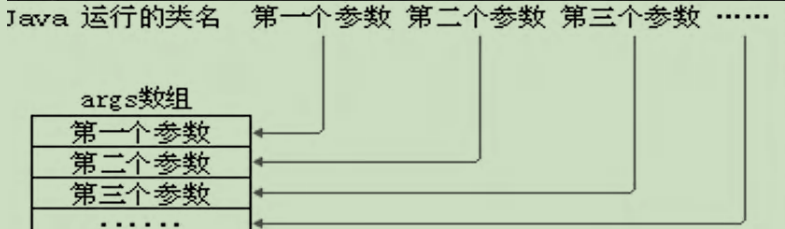
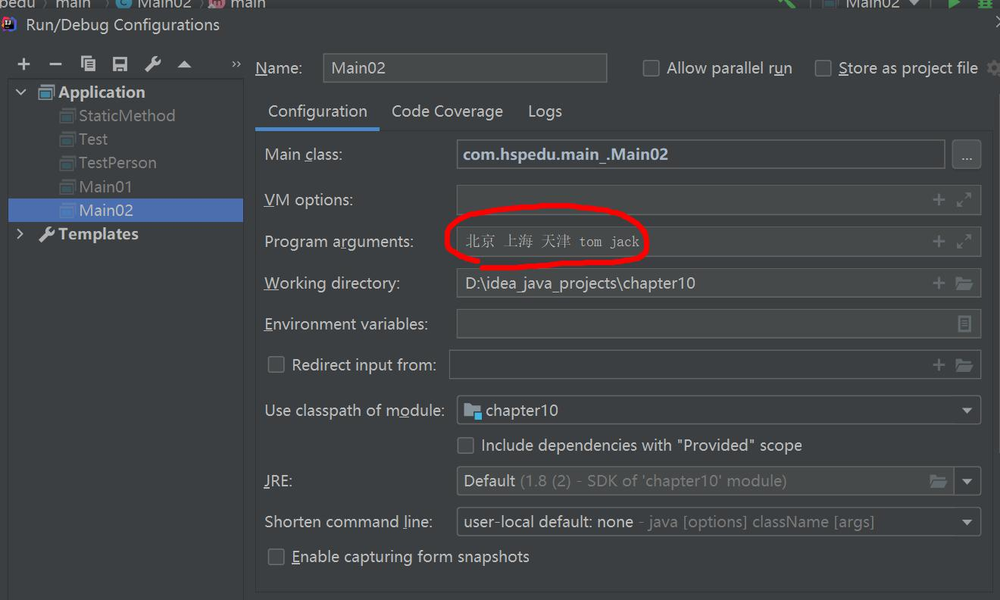
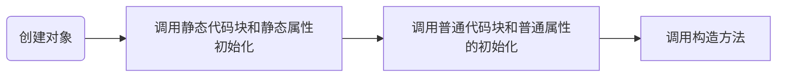

# 面向对象（高级）

### 1、类变量和类方法

#### 1.1 什么是类变量

	又名：静态属性/静态变量，是该类的所有对象共享的变量，任何一个该类的对象去访问它时，取到的都是相同的值，同样，任何一个该类的对象去修改它时，修改的也是同一个变量。这个从前面的图也可看出来

#### 1.2  如何定义类变量

定义语法：

```java
访问修饰符 static 数据类型 变量名；

static 访问修饰符 数据类型 变量名;
```

#### 1.3 如何访问类变量

```java
类名.类变量名
    
或者 
    
对象名.类变量名
```

> 静态变量的访问修饰符的访问权限和范围 和 普通属性是一样的。

推荐使用：`类名.类变量名;`

#### 1.4 类变量使用注意事项和细节讨论

1）什么时候需要用类变量：

	当我们需要让某个类的所有对象都共享一个变量时，就可以考虑使用类变量（静态变量)：
	
	比如：定义学生类，统计所有学生共交多少钱。Student(name,static fee)

2）类变量与实例变量（普通属性）区别：

	类变量是该类的所有对象共享的，而实例变量是每个对象独享的。

3）加上 static 称为 类变量 或 静态变量，否则称为 实例变量/普通变量/非静态变量

4）类变量可以通过 `类名.类变量名` 或者 `对象名.类变量名` 来访问，但 java 设计者推荐我们使用 `类名.类变量名` 方式访问。【前提是满足访问修饰符的访问权限和范围】

5）实例变量不能通过 `类名.类变量名` 方式访问。

6）类变量是在类加载时就初始化了，也就是说，即使你没有创建对像，只要类加载了，就可以使用类变量了。

> 生命周期跟随类本身，类加载时初始化

7）类变量的生命周期是随类的加载开始，随着类消亡而销毁。


#### 1.5 类方法基本介绍

	**类方法也叫静态方法**

形式如下：

```java
访问修饰符 static 数据返回类型 方法名(){}【推荐】
static 访问修饰符 数据返回类型 方法名(){}
```

#### 1.6 类方法的调用

使用方式：

```java
类名.类方法名
    或者
对象名.类方法名
```

前提是 满足访问修饰符的访问权限和范围

#### 1.7 类方法经典的使用场景

1）当方法中不涉及到任何和对象相关的成员，则可以将方法设计成静态方法，提高开发效率。

比如：工具类中的方法 utils

Math类、Arrays类、Collections集合类

2）小结

在程序员实际开发，往往会将一些通用的方法，设计成静态方法，这样我们不需要创建对象就可以使用了，比如打印一维数组，冒泡排序，完成谋个计算任务等。

#### 1.8  类方法使用注意事项和细节讨论

1）类方法和普通方法都是随着类的加载而加载，将结构信息存储在方法区：

	类方法中无 this 的参数
	
	普通方法中隐含着 this 的参数

2）类方法可以通过类名调用，也可以通过对象名调用。

3）普通方法和对象有关，需要通过对象名调用，比如 对象名.方法名（参数），不能通过类名调用。

4）类方法中不允许使用和对象有关的关键字，比如 this 和 super 。普通方法（成员方法）可以。

5）类方法（静态方法）中 只能访问 静态变量 或 静态方法。

6）普通成员方法，既可以访问非静态成员，也可以访问静态成员。

**小结**：静态方法，只能访问静态的成员，非静态的方法，可以访问静态成员和非静态成员（必须遵守访问权限）

### 2、main 方法语法

#### 2.1 深入理解 main 方法

解释 main 方法的形式：

```java
public static void main(String[] args){}
```

1）main 方法由虚拟机调用

2）java 虚拟机需要调用类的 main() 方法，所以该方法的访问权限必须是 public

3）java 虚拟机在执行 main() 方法时不必创建对象，所以该方法必须是 static

4）该方法接收 String 类型的数组参数，该数组中保存执行 java 命令时传递给所运行的类的参数

5）java 执行的程序 参数1 参数2 参数3 [举例说明:]



#### 2.2 特别提示：

1）在 main() 方法中，我们可以直接调用 main 方法所在类的静态方法或静态属性。

2）但是，不能直接访问该类中的非静态成员，必须创建该类的一个实例对象后，才能通过这个对象去访问类中的非静态成员

#### 2.3 IDEA 向 main 方法传参



### 3、代码块

#### 3.1 基本介绍

1）代码化块又称为 初始化块，属于类中的成员 [即是类的一部分] ，类以于方法，将逻辑语句封装在方法体中，通过 {} 包围起来。

2）但和方法不同，没有方法名，没有返回，没有参数，只有方法体，而且不用通过对象或类显式调用，而是加载类时，或创建对象时隐式调用。

#### 3.2 基本语法

```java
/*static*/ {/*代码*/}; //；可加可不加
```

说明注意：

1）修饰符可选，要写的话，也只能写 static

2）代码块分为两类，使用 static 修饰的叫静态代码块，没有 static 修饰的，叫 普通代码块/非静态代码块。

3）逻辑语句可以为任何逻辑语句（输入、输出、方法调用、循环、判断等）

4）; 号可以写上，也可以省略。

#### 3.3 代码块的好处和案例演示

1）相当于另外一种形式的构造器（对构造器的补充机制），可以做初始化的操作

2）场景：如果多个构造器中都有重复的语句，可以抽取到初始化块中，提高代码的重用性

3）代码快的快速入门


#### 3.4 代码块使用注意事项和细节讨论

1）static 代码块也叫 静态代码块，作用就是对类进行初始化，而且它**随着类的加载而执行**，并且**只会执行一次**。如果是普通代码块，每创建一个对象，就执行。

2）类什么时候被加载重要背：!!

(1) 创建对象实例时(new)

(2) 创建子类对象实例，父类也会被加载

(3) 使用类的静态成员时（静态属性，静态方法）

3）普通的代码块，在创建对象实例时，会被隐式的调用。

	被创建一次，就会调用一次。
	
	如果只是使用类的静态成员时，普通代码块并不会执行。


小结：

(1) static 代码块是类加载时，执行，只会执行一次

(2) 普通代码块是在创建对象时调用的，创建一次，调用一次

(3) 类加载的3种情况，需要记住


4）创建一个对象时，在**一个类** 调用顺序是：（重点，难点)

(1) 调用静态代码块和静态属性初始化（注意：静态代码块和静态属性初始化调用的优先级一样，如果有多个静态代码块和多个静态变量初始化，则按他们定义的顺序调用)

(2) 调用普通代码块和普通属性的初始化注意：普通代码块和普通属性初始化调用的优先级一样，如果有多个普通代码块和多个普通属性初始化，则按定义顺序调用)

(3) 调用构造方法。

上面老师说的执行的顺序一定要记住：理解的记住



> 注意：以上流程，**创建对象就会过一遍（！！）**
>
> 第二条隐藏在构造器的第一句（属性）与第二句（代码块），或许不会写，但一定会执行

5）构造器的最前面其实隐含了 super() 和 调用普通代码块，静态相关的代码块，属性初始化，在类加载时，就执行完毕，因此是优先于构造器和普通代码块执行的

```java
class A{
    public A(){//构造器
        //这里有隐藏的执行要求
		//(1) super(); //这个知识点，在前面讲解继承的时候，老师说过
		//(2) 调用普通代码块的
		System.out.println("ok");
    }
}
```

6）我们看一下创建一个子类对象时（继承关系），他们的静态代码块，静态属性初始化，普通代码块，普通属性初始化，构造方法的执行顺序如下：

(1) 父类的静态代码块和静态属性（优先级一样，按定义顺序执行）

(2) 子类的静态代码块和静态属性（优先级一样，按定义顺序执行）

(3) 父类的普通代码块和普通属性初始化（优先级一样，按定义顺序执行）

(4) 父类的构造方法

(5) 子类的普通代码块和普通属性初始化（优先级一样，按定义顺序执行）

(6) 子类的构造方法

> 定义顺序就是指的 在同一个类中 由上到下，不同类中 由先到后

7）静态代码块 只能直接调用 静态成员（静态属性和静态方法），普通代码块可以调用任意成员。

### 4、单例设计模式（补充）

#### 4.1 什么是设计模式

	概念：简单理解为前辈们总结下来的解题思路和解题模板

1）静态方法和属性的经典使用

2）设计模式是在大量的实践中总结和理论化之后优选的代码结构、编程风格、以及解决问题的思考方式。设计模式就像是经典的棋谱，不同的棋局，我们用不同的棋谱，免去我们自己再思考和摸索

#### 4.2 什么是单例模式

	概念：整个软件系统中，对某个类**只能存在一个对象实列**，且该类**只能提供一个取得其对象实列的方法**
	
	单列设计模式分两种：
	
	（1）饿汉式（将对象的创建设为静态的，类加载就加载，因为很迫切的创建对象，而对象不一定会被用到，所以被称之为饿汉式，很急切嘛）
	
	（2）懒汉式

#### 4.3 单例模式应用实例

1）构造器私有化 ==> 防止直接new

2）类的内部创建对象

3）向外暴露一个静态的公共方法。

```java
public class SingleTon01 {
    public static void main(String[] args) {
        // GirlFriend xh = new GirlFriend("小红");
        // GirlFriend xb = new GirlFriend("小白");
        //通过方法可以获取对象
        GirlFriend instance = GirlFriend.getInstance();
        System.out.println(instance);
        GirlFriend instance2 = GirlFriend.getInstance();
        System.out.println(instance2);
        System.out.println(instance == instance2);//T
        //System.out.println(GirlFriend.n1);
        //...
    }
}

//有一个类， GirlFriend
//只能有一个女朋友
class GirlFriend {
    private String name;
    //public static int n1 = 100;
    //为了能够在静态方法中，返回 gf 对象，需要将其修饰为 static
    //對象，通常是重量級的對象, 餓漢式可能造成創建了對象，但是沒有使用.
    private static GirlFriend gf = new GirlFriend("小红红");
    //如何保障我们只能创建一个 GirlFriend 对象
    //步骤[单例模式-饿汉式]
    //1. 将构造器私有化
    //2. 在类的内部直接创建对象(该对象是 static)
    //3. 提供一个公共的 static 方法，返回 gf 对象
    private GirlFriend(String name) {
        System.out.println("構造器被調用.");
        this.name = name;
    }
    	
	public static GirlFriend getInstance() {
		return gf;
	}
    
    @Override
    public String toString() {
        return "GirlFriend{" +
        "name='" + name + '\'' +
        '}';
    }
}


/**
* 演示懶漢式的單例模式
*/
public class SingleTon02 {
    public static void main(String[] args) {
        //new Cat("大黃");
        //System.out.println(Cat.n1);
        Cat instance = Cat.getInstance();
        System.out.println(instance);
        //再次調用 getInstance
        Cat instance2 = Cat.getInstance();
        System.out.println(instance2);
        System.out.println(instance == instance2);//T
    }
}


//希望在程序運行過程中，只能創建一個 Cat 對象
//使用單例模式
class Cat {
    private String name;
    public static int n1 = 999;
    private static Cat cat ; //默認是 null
//步驟
//1.仍然構造器私有化
//2.定義一個 static 靜態屬性對象
//3.提供一個 public 的 static 方法，可以返回一個 Cat 對象
//4.懶漢式，只有當用戶使用 getInstance 時，才返回 cat 對象, 後面再次調用時，會返回上次創建的 cat 對象
// 從而保證了單例
    private Cat(String name) {
        System.out.println("構造器調用...");
        this.name = name;
    }
    
    public static Cat getInstance() {
        if(cat == null) {//如果還沒有創建 cat 對象
        	cat = new Cat("小可愛");
    	}
	return cat;
	}
    
    
    @Override
    public String toString() {
        return "Cat{" +
        "name='" + name + '\'' +
        '}';
    }
}
```

#### 4.4 饿汉式 VS 懒汉式

1）二者最主要的区别在于创建对象的时机不同：饿汉式是在类加载就创建了对象实例而懒汉式是在使用时才创建。

2）饿汉式不存在线程安全问题，懒汉式存在线程安全问题。(后面学习线程后，会完善一把)

3）饿汉式存在浪费资源的可能。因为如果程序员一个对象实例都没有使用，那么饿汉式创建的对象就浪费了，懒汉式是使用时才创建，就不存在这个问题。

4）在我们 javaSE 标准类中，java.lang.Runtime 就是经典的单例模式。

### 5、final 关键字

#### 5.1 基本介绍

	final 中文：最后的，最终的
	
	final 可以修饰类、属性、方法和局部变量。
	
	在某些情况下，程序员可能有以下需求，就会使用到 final

1）当不希望类被继承时，可以用 final 修饰。

2）当不希望父类的某个方法被子类 覆盖/重写(override) 时，可以用 final 关键字修饰。

3）当不希望类的某个属性的值被修改，可以用 final 修饰。

4）当不希望某个局部变量被修改，可以使用 final 修饰

#### 5.2  final 使用注意事项和细节讨论

1）final 修饰的属性又叫 常量，一般用 XX_XX_XX 来命名

2）final 修饰的 属性 在定义时，必须赋初值，并且以后不能再修改，赋值可以在如下位置之一【选择一个位置赋初值即可】：

	(1) 定义时：如 `public final double TAX_RATE=0.08;`
	
	(2) 在构造器中
	
	(3) 在代码块中。


3）如果 final 修饰的 属性 是静态的，则初始化的位置只能是：

	(1) 定义时
	
	(2) 在静态代码块 不能在构造器中赋值。


4）final 类不能继承，但是可以实例化对像。

5）如果类不是 final 类，但是含有 final 方法，则该方法虽然不能重写，但是可以被继承。

6）一般来说，如果一个类已经是 final 类了，就没有必要再将方法修饰成 final 方法。

7）final 不能修饰构造方法（即构造器）

8）final 和 static 往往搭配使用，效率更高，不会导致类加载.底层编译器做了优化处理。

9）包装类(Integer,Double,Float,Boolean 等都是 final ),String 也是 final 类。

### 6、抽象类

#### 6.1 抽象类的介绍

1）用 abstract 关键字来修饰一个类时，这个类就叫抽象类

```java
访问修饰符 abstract 类名{}
```

2）用 abstract 关键字来修饰一个方法时，这个方法就是抽象方法

```java
访问修饰符 abstract 返回类型 方法名（参数列表）；//没有方法体
```

3）抽象类的价值更多作用是在于设计，是设计者设计好后，让子类继承并实现抽象类();

4）抽象类，是考官比较爱问的知识点，在框架和设计模式使用较多

#### 6.2 抽象类使用的注意事项和细节讨论 

1）抽象类不能被实例化

2）抽象类不一定要包含 abstract 方法。也就是说，抽象类可以没有 abstract 方法

3）一旦类包含了 abstract 方法，则这个类必须声明为 abstract

4）abstract 只能修饰类和方法，不能修饰属性和其它的。

5）抽象类可以有任意成员【抽象类本质还是类】，比如：非抽象方法构造器、静态属性等等

6）抽象方法不能有主体，即不能实现

7）如果一个类继承了抽象类，则它必须实现抽象类的所有抽象方法，除非它自己也声明为 abstract 类。

8）抽象方法不能使用 private、final 和 static 来修饰，因为这些关键字都是和重写相违背的。

#### 6.3 抽象类最佳实践-模板设计模式

##### 1）基本介绍

	抽象类体现的就是一种模板模式的设计，抽象类作为多个子类的通用模板，子类在抽象类的基础上进行扩展、改造，但子类总体上会保留抽象类的行为方式。

##### 2）模板设计模式能解决的问题

1）当功能内部一部分实现是确定，一部分实现是不确定的。这时可以把不确定的部分暴露出去，让子类去实现。

2）编写一个抽象父类，父类提供了多个子类的通用方法，并把一个或多个方法留给其子类实现，就是一种模板模式。

##### 3） 最佳实践

需求：

1)有多个类，完成不同的任务 job

2)要求统计得到各自完成任务的时间

```java
abstract public class Template { //抽象类-模板设计模式
    public abstract void job();//抽象方法
    public void calculateTime() {//实现方法，调用 job 方法
        //得到开始的时间
        long start = System.currentTimeMillis();
        job(); //动态绑定机制
        //得的结束的时间
        long end = System.currentTimeMillis();
        System.out.println("任务执行时间 " + (end - start));
    }
}


public class AAextends Template {
    //计算任务
    //1+....+ 800000
    @Override
    public void job() { //实现 Template 的抽象方法 job
    long num = 0;
    for (long i = 1; i <= 800000; i++) {
    	num += i;
    }
}
// public void job2() {
// //得到开始的时间
// long start = System.currentTimeMillis();
// long num = 0;
// for (long i = 1; i <= 200000; i++) {
// num += i;
// }
// //得的结束的时间
// long end = System.currentTimeMillis();
// System.out.println("AA 执行时间 " + (end - start));
// }
}


public class BB extends Template{
    public void job() {//这里也去，重写了 Template 的 job 方法
    long num = 0;
    for (long i = 1; i <= 80000; i++) {
    	num *= i;
    }
    }
}


public class TestTemplate {
    public static void main(String[] args) {
        AA aa = new AA();
        aa.calculateTime(); //这里还是需要有良好的 OOP 基础，对多态
        BB bb = new BB();
        bb.calculateTime();
    }
}
```

### 7、接口：

#### 7.1  基本介绍

	接口就是给出一些没有实现的方法，封装到一起，到某个类要使用的时候，在根据具体情况把这些方法写出来。语法：

```java
interface 接口名{
	//属性
	//抽象方法
}

class 类名 implements 接口{
    自己属性;
	自己方法;
    必须实现的接口的抽象方法;
}
```

1）小结：

	接口是更加抽象的抽象的类，抽象类里的方法可以有方法体，接口里的所有方法都没有方法体【jdk7.0】。接口体现了程序设计的多态和高内聚低偶合的设计思想。

2）特别说明：

	Jdk8.0后接口类可以有静态方法，默认方法，也就是说接口中可以有方法的具体实现

#### 7.2 深入讨论

	对初学者讲，理解接口的概念不算太难，难的是不知道什么时候使用接口，下面我预举几个应用场景：

1）说现在要制造战斗机武装直升机.专家只需把飞机需要的功能/规格定下来即可，然后让别的人具体实现就可。

2）说现在有一个项目经理（段玉），管理三个程序员，功能开发一个软件，为了控制和管理软件，项目经理可以定义一些接口，然后由程序员具体实现。(1.项目质量 2.项目进度 3.项目奖)参加工作

#### 7.3 注意事项和细节

1）接口不能被实例化

2）接口中所有的方法是 public 方法，接口中抽象方法，可以不用 abstract 修饰

3）一个普通类实现接口，就必须将该接口的所有方法都实现。

4）抽象类实现接口，可以不用实现接口的方法。

5）一个类同时可以实现多个接口

6）接口中的属性，只能是 final 的，而且是 public static final 修饰符。比如：

int a = 1; 实际上是 public static final int a = 1; (必须初始化)

7）接口中属性的访问形式：接口名.属性名

8）接口不能继承其它的类，但是可以继承多个别的接口

9）接口的修饰符只能是 public 和 默认，这点和类的修饰符是一样的。

#### 7.4 实现接口 vs 继承类

1）解决问题不同

继承：解决代码的复用性和可维护性

接口：解决代码的拓展性，(设计好各种方法，让类去实现，即调用)

2）接口比继承灵活

接口比继承更加灵活，继承是满足 is --> a 的关系，而接口只需满足 like --> a 的关系。

3）接口能在一定程度上实现代码解耦（接口规范性 + 动态绑定机制）

#### 7.5 接口的多态特性

##### 1）多态参数

与继承多态一致，**接口可以指向任意实现该接口类中的对象**（类似于父类可以指向任意继承该类的子类中的对象）

接口不能实列化对象，所以一般全为接口指向实现接口类中的对象

##### 2）多态数组

与继承一致，除本身不能创建对象外，数组内部成员可以为一切实现该接口的对象

（注意继承的特性，类如果实现了一个接口，且该接口继承了另一接口，那么该类也算是被继承接口的子类）

##### 3）多态传递

接口可以继承另外一个接口

后面发挥继承的性质，子类需实现这两个接口中的所有方法

接口可以继承多个接口

> （本质貌似是因为接口为抽象类，而接口继承接口，即为抽象类继承抽象类，抽象类不需要去实现父类的抽象方法，所以从语法层面上貌似也是能通过的？）

### 8、内部类

如果定义类在局部位置(方法中/代码块) :(1) 局部内部类 (2) 匿名内部类

定义在成员位置 (1) 成员内部类 (2) 静态内部类

#### 8.1 基本介绍

	一个类的内部又完整的嵌套了另一个类结构。被嵌套的类称为内部类(inner class),嵌套其他类的类称为外部类(outer class)。是我们类的第五大成员【思考：类的五大成员是哪些？[属性、方法、构造器、代码块、内部类]】，内部类最大的特点就是可以直接访问私有属性，并且可以体现类与类之间的包含关系，注意：内部类是学习的难点，同时也是重点，后面看底层源码时，有大量的内部类.

#### 8.2 基本语法

```java
class Outer{//外部类
    class Inner{//内部类
    }
}

class Other{//外部其他类
    
}
```


#### 8.3  内部类的分类

1）定义在外部类局部位置上(比如方法内)：

(1) 局部内部类（有类名）

(2) 匿名内部类 (没有类名，重点！！！)


2）定义在外部类的成员位置上：

(1) 成员内部类（没用 static 修饰）

(2) 静态内部类（使用 static 修饰）


#### 8.4 局部内部类的使用

说明：局部内部类是定义在外部类的局部位置，比如方法中，并且有类名。

1）可以直接访问外部类的所有成员，包含私有的

2）不能添加访问修饰符，因为它的地位就是一个局部变量。局部变量是不能使用修饰符的。但是可以使用 final 修饰，因为局部变量也可以使用 final

3）作用域：仅仅在定义它的方法或代码块中。

4）局部内部类 -- 访问 --> 外部类的成员 [访问方式：直接访问]

5）外部类 -- 访问 --> 局部内部类的成员，访问方式：创建对象，再访问（注意：必须在作用域内）

记住：

(1)局部内部类定义在方法中/代码块

(2)作用域在方法体或者代码块中

(3)本质仍然是一个类


6）外部其他类 -- 不能访问 --> 局部内部类（因为局部内部类地位是一个局部变量）

7）如果外部类和局部内部类的成员重名时，默认遵循就近原则，如果想访问外部类的成员，则可以使用（外部类名.this.成员）去访问

例如：`System.out.printIn("外部类的n2=" + 外部类名.this.n2);`


#### 8.5  匿名内部类的使用(重要!!!!!!!)

##### 1、概述

(1)本质是类

(2)内部类

(3)该类没有名字

(4)同时还是一个对象

说明：匿名内部类是定义在外部类的局部位置，比如方法中，并且没有类名

> 名字是由系统进行分配的，一般会在原外部类名字的基础上加一个$1，这个程序员无法决定

##### 2、使用

1）匿名内部类的基本语法：

```java
new 类或接口(参数列表){
类体
};
```

2）代码案例

```java
/**
* 演示匿名内部类的使用
*/
public class AnonymousInnerClass {
    public static void main(String[] args) {
        Outer04 outer04 = new Outer04();
        outer04.method();
    }
}

class Outer04 { //外部类
    private int n1 = 10;//属性
    public void method() {//方法
    //基于接口的匿名内部类
    //老韩解读
    //1.需求： 想使用 IA 接口,并创建对象
    //2.传统方式，是写一个类，实现该接口，并创建对象
    //3.老韩需求是 Tiger/Dog 类只是使用一次，后面再不使用
    //4. 可以使用匿名内部类来简化开发
    //5. tiger 的编译类型 ? IA
    //6. tiger 的运行类型 ? 就是匿名内部类 Outer04$1
    /*
    我们看底层 会分配 类名 Outer04$1
    class Outer04$1 implements IA {
    @Override
    public void cry() {
    System.out.println("老虎叫唤...");
    }
    }
    */
    //7. jdk 底层在创建匿名内部类 Outer04$1,立即马上就创建了 Outer04$1 实例，并且把地址
    // 返回给 tiger
    //8. 匿名内部类使用一次，就不能再使用
    IA tiger = new IA() {
    	@Override
    	public void cry() {
    		System.out.println("老虎叫唤...");
    	}
    };
        
    System.out.println("tiger 的运行类型=" + tiger.getClass());
    tiger.cry();
    tiger.cry();
    tiger.cry();
    // IA tiger = new Tiger();
    // tiger.cry();
    //演示基于类的匿名内部类
    //分析
    //1. father 编译类型 Father
    //2. father 运行类型 Outer04$2
    //3. 底层会创建匿名内部类
    /*
    class Outer04$2 extends Father{
    @Override
    public void test() {
    System.out.println("匿名内部类重写了 test 方法");
    }
    }
    */
    //4. 同时也直接返回了 匿名内部类 Outer04$2 的对象
    //5. 注意("jack") 参数列表会传递给 构造器
    Father father = new Father("jack"){
        @Override
        public void test() {
        	System.out.println("匿名内部类重写了 test 方法");
    	}
	};
	System.out.println("father 对象的运行类型=" + father.getClass());//Outer04$2
	father.test();
	//基于抽象类的匿名内部类
    Animal animal = newAnimal(){
        @Override
        void eat() {
        	System.out.println("小狗吃骨头...");
        }
    };
	animal.eat();
	}
}

interface IA {//接口
	public void cry();
}

//class Tiger implements IA {
//
// @Override
// public void cry() {
// System.out.println("老虎叫唤...");
// }
//}
//class Dog implements IA{
// @Override
// public void cry() {
// System.out.println("小狗汪汪...");
// }
//}

class Father {//类
    public Father(String name) {//构造器
    	System.out.println("接收到 name=" + name);
    }
    public void test() {//方法
    }
}

abstract classAnimal { //抽象类
	abstract void eat();
}
```

3）匿名内部类的语法比较奇特，请大家注意，因为匿名内部类既是一个类的定义，同时它本身也是一个对象，因此从语法上看，它既有定义类的特征，也有创建对象的征，对前面代码分析可以看出这个特点，因此可以调用匿名内部类方法。

4）可以直接访问外部类的所有成员，包含私有的

5）不能添加访问修饰符，因为它的地位就是一个局部变量。

6）作用域：仅仅在定义它的方法或代码块中。

7）匿名内部类--访问-->外部类成员[访问方式：直接访问]

8）外部其他类--不能访问-->匿名内部类（因为匿名内部类地位是一个局部变量）

9）如果外部类和匿名内部类的成员重名时，匿名内部类访问的话，默认遵循就近原则如果想访问外部类的成员，则可以使用（外部类名.ths.成员）去访问

##### 3、匿名内部类最佳实践

当做实参直接传递，简洁高效

```java
public class InnerClassExercise01 {
	public static void main(String[] args) {
    //当做实参直接传递，简洁高效
    f1(new IL() {
        @Override
        public void show() {
        	System.out.println("这是一副名画~~...");
    	}
	});
        
    //传统方法
    f1(new Picture());
    }
    
    
//静态方法,形参是接口类型
public static void f1(IL il) {
	il.show();
	}
}

//接口
interface IL {
	void show();
}

//类->实现 IL => 编程领域 (硬编码)
class Picture implements IL {
    @Override
    public void show() {
    	System.out.println("这是一副名画 XX...");
    }
}
```

案例：

1）有一个铃声接口 Bell ,里面有个ring方法。

2）有一个手机类 Cellphone，具有闹钟功能 alarmclock ，参数是 Bell 类型

3）测试手机类的闹钟功能，通过匿名内部类（对象) 作为参数，打印：懒猪起床了

4）再传入另一个匿名内部类（对象），打印：小伙伴上课了

```java
public class InnerClassExercise02 {
    public static void main(String[] args) {
    /*
    1.有一个铃声接口 Bell，里面有个 ring 方法。(右图)
    2.有一个手机类 Cellphone，具有闹钟功能 alarmClock，参数是 Bell 类型(右图)
    3.测试手机类的闹钟功能，通过匿名内部类(对象)作为参数，打印：懒猪起床了
    4.再传入另一个匿名内部类(对象)，打印：小伙伴上课了
    */
    	CellPhone cellPhone = new CellPhone();
    //老韩解读
    //1. 传递的是实现了 Bell 接口的匿名内部类 InnerClassExercise02$1
    //2. 重写了 ring
    //3. Bell bell = new Bell() {
    // @Override
    // public void ring() {
    // System.out.println("懒猪起床了");
    // }
    // }
        
    cellPhone.alarmClock(new Bell() {
        @Override
        public void ring() {
        	System.out.println("懒猪起床了");
    		}
    	});
        
    cellPhone.alarmClock(new Bell() {
        @Override
        public void ring() {
        	System.out.println("小伙伴上课了");
        	}
    	});
	}
}

interface Bell{ //接口
	void ring();//方法
}

class CellPhone{//类
    public void alarmClock(Bell bell){//形参是 Bell 接口类型
        System.out.println(bell.getClass());
        bell.ring();//动态绑定
    }
}
```

#### 8.6 成员内部类

	说明：成员内部类是定义在外部类的成员位置，并且没有 static 修饰。

1）可以直接访问外部类的所有成员，包含私有的

2）可以添加任意访问修饰符(public、protected、默认、private),因为它的地位就是一个成员。

3）和外部类的其他成员一样，为整个类体，比如前面案例，在外部类的成员方法中创建成员内部类对象，再调用方法.

4）成员内部类 -- 访问 --> 外部类成员（比如：属性) [访问方式：直接访问]

5）外部类 -- 访问 --> 成员内部类

访问方式：创建对象，再访问

6）外部其他类--访问-->成员内部类

7）如果外部类和内部类的成员重名时，内部类访问的话，默认遵循就近原则，如果想访问外部类的成员，则可以使用(外部类名.this.成员)去访问

#### 8.7 静态内部类

说明：静态内部类是定义在外部类的成员位置，并且有 static 修饰

1）可以直接访问外部类的所有静态成员，包含私有的，但不能直接访问非静态成员

2）可以添加任意访问修饰符(public、protected、默认、private),因为它的地位就是一个成员。

3）作用域：同其他的成员，为整个类体

4）静态内部类 -- 访问 --> 外部类（比如：静态属性)[访问方式：直接访问所有静态成员]

5）外部类 -- 访问 --> 静态内部类，访问方式：创建对象，再访问

6）外部其他类 -- 访问 --> 静态内部类

7）如果外部类和静态内部类的成员重名时，静态内部类访问的时候，默认遵循就近原则，如果想访问外部类的成员，则可以使用（外部类名.成员）去访问