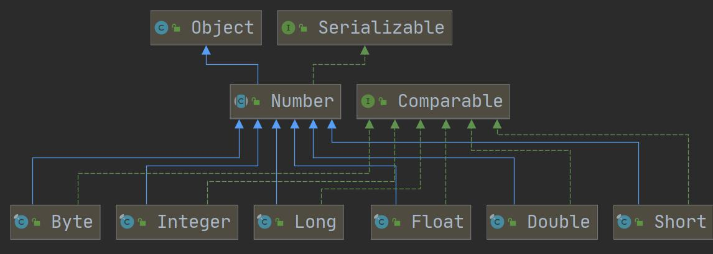
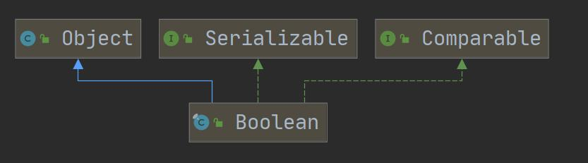
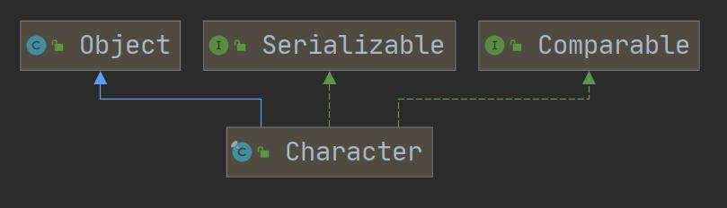
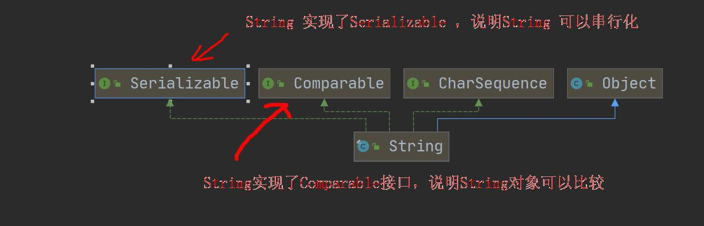
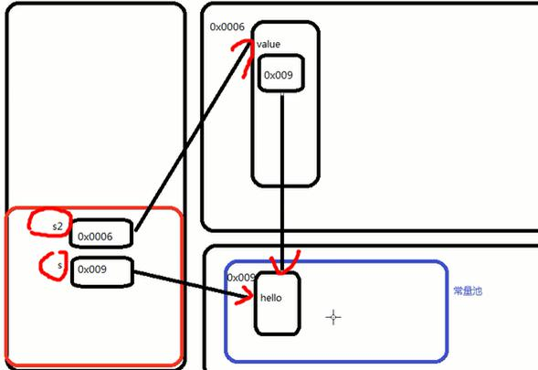
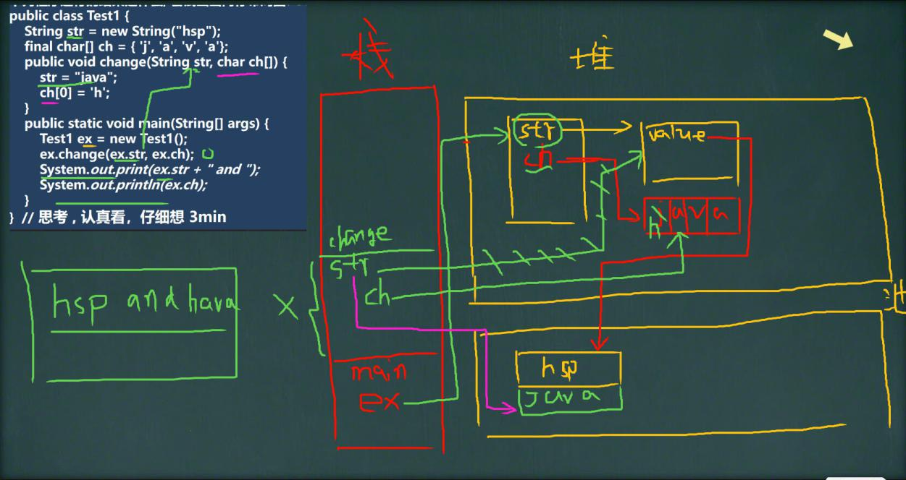

# 九、常用类

## 	1、包装类：

### 1.1、基本数据类型对应的包装类

| 基本数据类型 |  包装类   |
| :----------: | :-------: |
|   boolean    |  Boolean  |
|     char     | Character |
|     byte     |   Byte    |
|    short     |   Short   |
|     int      |  Integer  |
|     long     |   Long    |
|    float     |   Float   |
|    double    |  Double   |



​								包装类的基本继承机制（有些方法为何能用）




​								boolean和char为直接继承Object




​							char的包装类与boolean的包装类继承机制一致

### 1.2、包装类和基本数据类型的转换

#### 1.2.1、术语：

- 装箱：基本类型 --> 包装类型

- 拆箱：包装类型 --> 基本类型

#### 1.2.2、拆装箱

​	JDK5以前，装箱和拆箱只能手动，以后，可以通过valueOf实现自动装拆箱

1）手动拆装箱：

```java
//手动装箱 int->Integer
int n1 = 100;
Integer integer= new Integer(n1);
Integer integer1 = Integer.vaLueOf(n1);
//手动拆箱
//Integer -> int
int i = integer.intVaLue();
```

2）自动拆装箱：

```java
//jdk5后,就可以自动装箱和自动拆箱
int n2 = 200;
//自动装箱 int -> Integer
Integen integer2 = n2；//底层使用的是 Integer.vaLueOf(n2)
//自动拆箱 Integer -> int
int n3 = integer2;//底层仍然使用的是 intVaLue()方法
```

> 补充：
>
> 三元运算符是一个整体，不同精度的数据类型放在同三元运算符中会自动提升精度进行运算
>
> ```java
> Object obj1 = true ? new Integer(1) : new Double(2.O);
> //三元运算符【是一个整体】一真大师
> ```
>
> System.out.printn(obj1):/什么？1.0
>
>
> 这里看的是**整体思想**

### 1.3、String与包装类的互相转换：

> 自定义名词：应为 String 是字符串类型，所以 其他类型转成 String 不就是转成字符串么，而 String 类型转其他类型不就是将字符串拆成其他基本数据类型么
>
> 成串
>
> 拆散

#### 1.3.1 成串：包装类 --> String

```java
//1方式1
String str1 = i + "";
//方式2
String str2 = i.toString();
//方式3
String str3 = String.valueOf(i);
```

#### 1.3.2 拆散：Sting --> 包装类

```java
//parseInt方法

//创建对象使用构造器，将值传给构造器实现装箱

//String -> 包装类(Integer)
String str4 = "12345";

//方式1
Integer i2 = Integer.parseInt(str4);//使用到自动装箱
//方式2
Integer i3 = new Integer(str4);//构造器
```

### 1.4、包装类的常用方法：

> 不止这一点，有详细需求自行百度或查手册

#### 1.4.1 Integer类的常用方法

| 方法              | 作用           |
| ----------------- | -------------- |
| Integer.MAX_VALUE | 方法返回最大值 |
| Integer.MIN_VALUE | 方法返回最小值 |

#### 1.4.2 Character类的常用方法

| 方法                   | 作用               |
| ---------------------- | ------------------ |
| Character.isDigit      | 方法判断是不是数字 |
| Character.isLetter     | 方法判断是不是字母 |
| Character.isUpperCase  | 方法判断是不是大写 |
| Character.isLowerCase  | 方法判断是不是小写 |
| Character.isWhitespace | 方法判断是不是空格 |
| Character.toUpperCase  | 方法字符转成大写   |
| Character.toLowerCase  | 方法字符转成小写   |

### 1.5、细节补充：

#### 1.5.1 Integer 包装类的数值范围问题

```java
public void method1(){
Integer i = new Integer(1);
Integer j = new Integer(1);
System.out.printin(i == j);//False
//所以，这里主要是看范围-128~127就是直接返回
//1. 如果 i 在 IntegerCache.low(-128)~IntegerCache.high(127),就直接从数组返回
//2. 如果不在 -128~127,就直接 new Integer(i)
Integer m = 1;//底层Integer.valueOf(1); -> 阅读源码
Integer n = 1://底层Integer.valueOf(1)；
System.out.printin(m == n);//T
//所以，这里主要是看范围-128~127就是直接返回,否则，就new Integer(xx)；
Integer x = 128;//底层Integer.valueOf(1):
Integer y = 128;//底层Integer.valueOf(1):
System.out.println(x == y);}//False
```

#### 1.5.2 基本数据类型与包装类的区别

包装类本质是一个类，包装类直接等于一个数时，就使用到了自动装拆箱的方法。

> 补充：只要有基本数据类型，判断的就是值

## 2、String类

### 2.1 String 类型概述

1）String 对象用于保存字符串常量，也就是一组字符序列

> 字符串常量对象是用双引号括起的字符序列。例如："你好”、"12.97”、"boy"等

2）字符串的字符使用 Unicode 字符编码，一个字符（不区分字符和汉字）占两个字节

3）String 类有很多构造器，构成构造器的重载

#### 2.1.1 String 类常用构造器

```java
String s1 = new String();
String s1 = new String(String original);
String s1 = new String(char[] a);
String s1 = new String(char[] a,int startIndex,int count);
String s1 = new String(byte[] b);
```

#### 2.1.2 重要补充点：



1）String 类型实现了接口 Serializable ，还实现了接口 Comparable

> Serializable 接口可以使 String 串行化，串行化表示能在网络间进行传输
>
> Comparable 接口表示 String 对象可以比较大小

2）String 类是个 final 类 ，代表不可变的字符序列，字符串是不可变的，一个字符串对象一旦被分配，其内容是不可变的，改变就等价于在常量池中重新创建了一个空间，来存放这个改变值

3）String 有属性 `private final char value[];` 用于存放字符串内容

> 一定要注意：value 是一个 final 类型， 不可以修改(单个字符可变化)：即 value 不能指向新的地址，但是单个字符内容是可以变化，表示，这个对象**一旦指定了一个地址之后，就不能再次指向另一个地址**

4）final修饰的引用类型，**表示一个对象一旦指向了某个数据空间，就不可再指向另一个数据空间**

> 例如数组，举例，a1 指向了一个空间，a2 指向了另一个空间，这时，如果用 final 修饰 a1 的话，那么就不可再让 a1 指向 a2 ，因为地址不可修改
>
> **注意**：这里**要final显示的修饰（即明显的声明）**，**不加final的话**，**下面的条件就不成立**

String字符串常量相加，则**直接在常量池中进行**，变量相加，则看的是**堆**，由**堆中创建一个对象**，由这个**对象指向**常量池中**得出相加结果的常量空间**，底层原理如下图：
    

>  老韩小结：
>
>  底层是 `StringBuilder sb = new StringBuilder(); `
>
>  `sb.append(a)`   `sb.append(b);`
>
>  `sb` 是在堆中，并且 `append` 是在原来字符串的基础上追加的
>
>  
>
>  重要规则:
>
>  `String c1 = "ab” + "cd"; `常量相加，看的是池。
>
>  `String c1 = a + b;` 变量相加，是在堆中

### 2.2、两种创建 String 对象的区别

#### 2.2.1 直接赋值

```java
	String s = "hahaha";
```

**创建流程解读**

1）先在方法区里的常量池看看有没有 "hahaha" 这个字符串常量
2）如果有，那么两种创建对象的方式都会直接指向存放 "hahaha" 的这个常量空间
3）如果没有，那么直接赋值的方式会直接在常量池里创建一块空间存放 hahaha 这个常量，并直接指向这块空间

#### 2.2.2 调用构造器创建对象

```java
	String s = new String("hahaha");
```

**调用构造器创建对象流程解读**

1）先在堆里面创建一个对象空间，并指向这个空间，这个空间里面维护了 value 属性

2） value 属性又会指向常量池，并检查有无对应的常量空间

3）有则直接指向

4）没有就创建后再指向。



​       							创建String对象的两种方式

### 2.3、String类重要补充例题：

#### 2.3.1 题1

```java
String a = "hello" + "abc";
//问：创建了几个对象？
//答：1个，
//分析：
//1、"hello" + "abc" 优化等价于 ==> "helloabc"
//2、编译器会判断创建常量池对象，是否有引用指向，并作出相应的优化
```

#### 2.3.2 题2

```java
String a = "hello";//创建a对象
String b = "abc";//创建b对象
String c = a + b;//创建了几个对象？画出内存图？
//答：3个
//底层是 StringBuilder sb = new StringBuilder();
//sb.append(a);
//sb.append(b);
//sb 是在堆中，并且 append 是在原来字符串的基础上追加的.
```

> **重要规则**：
>
> String c1 = "ab” + "cd"; 
>
> 1）常量相加，看的是池。
>
> String c1 = a + b;
>
> 2）变量相加，是在堆中
>
> 学习思路：一定尽量看源码学习。

#### 2.3.3 题3

   ```java
public class Test1{
    
	String str = new String("hsp");
	final char[] ch = {'j','a','v','a'};
                       
	public void change(String str,char ch[]){
		str = "java";
		ch[0] = 'h';
    }
                       
	public static void main(String[] args){
		Test1 ex = new Test1();
		ex.change(ex.str,ex.ch);
		System.out.print(ex.str + "and");//输出什么？hspand
		System.out.println(ex.ch);//输出什么？hava
	}
}
   ```

原因如下图：

> 方法调用时会临时开辟一个栈空间执行方法体中的操作，这个指向是在新栈里面指的，而方法调用完毕后，临时栈会被销毁，所以指向没了，但是在堆中的修改还在



**补充细节**：

> 1）直接给数组赋值的形式将常量给对象，则常量会保存在堆空间中
>
> ```java
> char[] ch = {'j','a','v','a'};//保存在堆空间中
> ```
>
> 2）如果在临时栈空间对String对象重新赋值，且赋值的是一个字符串常量而不是变量，那么这个对象会直接指向常量池，而原先的指向就会断掉。
>
> ```java
> public void change(String str,char ch[]){//方法调用会创建临时栈空间
> 		str = "java";//这个指向在临时栈空间里，但是原先的指向确实会断掉，直到栈空间销毁
> 		ch[0] = 'h';
>  }
> ```
>
> 3）引用数据类型 的方法调用 本质是返回一个地址

### 2.4 String类常用的方法

#### 1）和长度有关的方法

| 返回类型 | 方法名   | 作用                                                         |
| -------- | -------- | ------------------------------------------------------------ |
| int      | length() | 得到一个字符串的字符个数<br>（一个中文是一个字符，一个英文是一个字符，一个转义字符是一个字符） |

#### 2）和数组有关的方法

| 返回类型 | 方法名        | 作用                         |
| -------- | ------------- | ---------------------------- |
| byte[]   | getBytes()    | 将一个字符串转换成字节数组   |
| char[]   | toCharArray() | 将一个字符串转换成字符数组   |
| String[] | split(String) | 将一个字符串按照指定内容劈开 |

#### 3）和判断有关的方法

| 返回类型 | 方法名                   | 作用                                         |
| -------- | ------------------------ | -------------------------------------------- |
| boolean  | equals(String)           | 判断两个字符串的内容是否一模一样             |
| boolean  | equalsIgnoreCase(String) | 忽略大小写的比较两个字符串的内容是否一模一样 |
| boolean  | contains(String)         | 判断一个字符串里面是否包含指定的内容         |
| boolean  | startsWith(String)       | 判断一个字符串是否以指定的内容开头           |
| boolean  | endsWith(String)         | 判断一个字符串是否以指定的内容结尾           |
| int      | compareTo()              | 比较两个字符串的大小，并返回两个之间的差值   |

#### 4）和改变内容有关的方法

> 和改变内容有关的方法，都不会直接操作原本的字符串
>
> 而是将符合条件的字符串返回给我们，所以注意接收

| 返回类型 | 方法名                      | 作用                                   |
| -------- | --------------------------- | -------------------------------------- |
| String   | toUpperCase()               | 将一个字符串全部转换成大写             |
| String   | toLowerCase()               | 将一个字符串全部转换成小写             |
| String   | replace(String,String)      | 将某个内容全部替换成指定内容           |
| String   | replaceAll(String,String)   | 将某个内容全部替换成指定内容，支持正则 |
| String   | repalceFirst(String,String) | 将第一次出现的某个内容替换成指定的内容 |
| String   | substring(int)              | 从指定下标开始一直截取到字符串的最后   |
| String   | substring(int,int)          | 从下标x截取到下标y-1对应的元素         |
| String   | trim()                      | 去除一个字符串的前后空格               |
| String   | concat(String)              | 拼接字符串                             |

#### 5）和位置有关的方法

| 返回类型 | 方法名              | 作用                           |
| -------- | ------------------- | ------------------------------ |
| char     | charAt(int)         | 得到指定下标位置对应的字符     |
| int      | indexOf(String)     | 得到指定内容第一次出现的下标   |
| int      | lastIndexOf(String) | 得到指定内容最后一次出现的下标 |

#### 6）其他方法

| 返回类型 | 方法名 | 作用       |
| -------- | ------ | ---------- |
| String   | format | 格式字符串 |

> format 补充说明
>
> ```java
> /* 占位符有:
> * %s 字符串 %c 字符 %d 整型 %.2f 浮点型
> *
> */
> String name = "john";
> int age = 10;
> double score = 56.857;
> char gender = '男';
> 
> //方式1 --> 传统方式
> //将所有的信息都拼接在一个字符串.
> String info =
> "我的姓名是" + name + "年龄是" + age + ",成绩是" + score + "性别是" + gender + "。希望大家喜欢我！
> ";
> System.out.println(info);
> 
> //方式2 --> format方式
> //老韩解读
> //1. %s , %d , %.2f %c 称为占位符
> //2. 这些占位符由后面变量来替换
> //3. %s 表示后面由 字符串来替换
> //4. %d 是整数来替换
> //5. %.2f 表示使用小数来替换，替换后，只会保留小数点两位, 并且进行四舍五入的处理
> //6. %c 使用 char 类型来替换
> String formatStr = "我的姓名是%s 年龄是%d，成绩是%.2f 性别是%c.希望大家喜欢我！";
> String info2 = String.format(formatStr, name, age, score, gender);
> System.out.println("info2=" + info2);
> ```

 ### 2.5 StringBuffer类：

#### 2.5.1 概述

> 1）java.lang.StringBufferf 代表可变的字符序列，可以对字符串内容进行增删。
>
> 2）很多方法与 String 相同，但 StringBuffer 是可变长度的。
>
> 3）StringBuffer 是一个容器。

#### 2.5.2 StringBuffer 解读

```java
public class StringBuffer01 {
public static void main(String[] args) {
//老韩解读
//1. StringBuffer 的直接父类 是 AbstractStringBuilder
//2. StringBuffer 实现了 Serializable, 即 StringBuffer 的对象可以串行化
//3. 在父类中 AbstractStringBuilder 有属性 char[] value,不是 final
// 该 value 数组存放 字符串内容，引出存放在堆中的
//4. StringBuffer 是一个 final 类，不能被继承
//5. 因为 StringBuffer 字符内容是存在 char[] value, 所有在变化(增加/删除)
// 不用每次都更换地址(即不是每次创建新对象)， 所以效率高于 String
StringBuffer stringBuffer = new StringBuffer("hello");
	}
}
```

> 总结：
>
> 1）StringBuffer 的直接父类 是 AbstractStringBuilder
>
> 2）StringBuffer 实现了 Serializable, 即 StringBuffer 的对象可以串行化
>
> 3）在父类中 AbstractStringBuilder 有属性 char[] value,不是 final，该 value 数组存放 字符串内容，引出 StringBuffer 保证的字符串变量是存放在堆中的
>
> 4）StringBuffer 是一个 final 类，不能被继承
>
> 5）因为 StringBuffer 字符内容是存在 char[] value 数组中, 所以在变化(增加/删除)字符内容时，不用每次都更换地址(即不是每次创建新对象)， 所以效率高于 String
>
> 6）StringBuffer 保存的是一个字符串变量，里面的值可以更改，只有在空间满时才会更新地址(换一个更大的地址，前面的字符拷贝到新数组)。

#### 2.5.3 String VS StringBuffer

1）String 保存的是字符串常量，里面的值不能更改，每次 String 类的更新实际上就是更改地址，效率较低 // 属性 private final char value[]; 用来存放字符串内容

2）StringBuffer 保存的是字符串变量，里面的值可以更改，每次 StringBuffer 的更新实际上可以更新内容，不用每次更新地址，效率较高 // 属性 char[]value; 用来存放字符串内容 //这个放在堆里

3）StringBuffer 存放字符串内容的属性为 char[] value; 为 Buffer 的直接父类 AbstractStringBuilder 的属性，不是 final 修饰的。

#### 2.5.4 String 与 StringBuffer 类型的转换:

```java
public class StringAndStringBuffer {
	public static void main(String[] args) {
	  //String -> stringBuffer
	  String str = "hello tom";
	  //方式1  使用构造器
      //注意：返回的才是StringBuffer对象，对str本身没有影响
      StringBuffer stringBuffer = new StringBuffer(str);
      //方式2  使用的是append方法
      StringBuffer stringBuffer1 = new StringBuffer();
      stringBuffer1 = stringBuffer1.append(str);
      //看看StringBuffer -> String
      StringBuffer stringBuffer3 = new StringBuffer("韩顺平教育")；
      //方式1  使用StringBuffer提供的  tostring  方法
      String s = stringBuffer3.tostring();
      //方式2  使用构造器来搞定
      String s1 = new String(stringBuffer3);
    }
}
```

#### 2.5.5 StringBuffer 构造器详解

```java
// 定义一个空的字符串缓冲区，含有16个字符的容量
StringBuffer str1 = new StringBuffer();

//StringBuffer(int capacity)  //capacity[容量]
//构造一个不带字符，但具有指定初始容量的字符串缓冲区。即对 char[] 大小进行指定

// 定义一个含有10个字符容量的字符串缓冲区
StringBuffer str2 = new StringBuffer(10);

//StringBuffer(String str)
//构造一个字符串缓冲区，并将其内容初始化为指定的字符串内容。

// 定义一个含有(16+4)的字符串缓冲区，"青春无悔"为4个字符
StringBuffer str3 = new StringBuffer("青春无悔");
/*
*输出字符串的容量大小
*capacity()方法返回字符串的容量大小
*/
System.out.println(str1.capacity());    // 输出 16
System.out.println(str2.capacity());    // 输出 10
System.out.println(str3.capacity());    // 输出 20
```

#### 2.5.6 StringBuffer 类的常用方法

##### 1）基本的增删改查

| 返回值       | 方法                                | 作用                                                         |
| ------------ | ----------------------------------- | ------------------------------------------------------------ |
| StringBuffer | append(char c)                      | 添加字符到 StringBuffer 对象中末尾                           |
| StringBuffer | delete(int start,int end)           | 删除 StringBuffer 对象中指定范围的字符或字符串               |
| StringBuffer | deleteCharAt(int index)             | 移除 StringBuffer 对象中指定位置的字符                       |
| StringBuffer | replace(int start,int end,String s) | 将 StringBuffer 对象中指定范围的字符或字符串用新的字符串 s 进行替换，start -- end 间的内容替换掉，不含 end |
| void         | setCharAt(int index,char ch)        | 修改指定位置 index 处的字符                                  |
| int          | indexOf()                           | 查找子串在字符串第 1 次出现的索引，如果找不到返回 -1         |
| int          | length()                            | 获取字符串的长度                                             |

##### 2）其他方法

| 返回值       | 方法                          | 作用                                               |
| ------------ | ----------------------------- | -------------------------------------------------- |
| StringBuffer | insert(int offset,String str) | 在 StringBuffer 对象中的 offset 位置插入字符串 str |
| String       | toString()                    | 返回 StringBuffer 缓冲区中的字符串对象             |
| StringBuffer | reverse()                     | 将此 StringBuffer 对象用其反转形式取代             |

### 2.6 StringBuilder 类：

#### 2.6.1 概述

1）一个可变的字符序列。此类提供一个与 StringBuffer 兼容的 API ,但不保证同步( **StringBuilder 不是线程安全**)。该类被设计用作 StringBuffer 的一个简易替换，**用在字符串缓冲区被单个线程使用的时候**。如果可能，建议优先采用该类。
因为在大多数实现中，它比 StringBuffer 要快

2）在 StringBuilder 上的主要操作是 append 和 insert 方法，可重载这些方法，以接受任意类型的数据。

#### 2.6.2 效率问题

​	StringBuilder > StringBuffer > String

#### 2.6.3 应用场景

使用的原则，结论：

1）如果字符串存在大量的修改操作，一般使用 StringBuffer 或 String Builder

2）如果字符串存在大量的修改操作，并在单线程的情况，使用 StringBuilder

3）如果字符串存在大量的修改操作，并在多线程的情况，使用 StringBuffer

4）如果我们字符串很少修改，被多个对象引用，使用 String ,比如配置信息等

##  3、Math 类常用方法

> 常用的数学类，包含了各种数学方法

| 方法     | 作用                                                         |
| -------- | ------------------------------------------------------------ |
| abs()    | 求绝对值                                                     |
| pow(n,m) | 取幂                                                         |
| ceil()   | 向上取整，无论是正数还是负数，都取最大的值                   |
| floor()  | 向下取整，无论是正数还是负数，都取最小的值                   |
| round()  | 正数的话，还是正常的，之前理解的，但是如果是负数，临界点必须大于5 |
| sqrt()   | 开平方                                                       |
| random() | 获取0~1之间的随机数(大于等于0小于1)                          |
| max()    | 获取最大值                                                   |
| min()    | 获取最小值                                                   |

> 补充：
>
> 1）获取随机数公式：
>
> `int num = (int)(Math.random()*(b-a+1)+a)`，这是获取 a -- b 之间的随机整数的公式
>
> 2）int 会取整，但不会四舍五入的取，而是直接将小数给舍去

##  4、Arrays 类常用方法：

> 这个类包含了各种操作数组的方法

| 返回值  | 方法                                                      | 作用                                   |
| ------- | --------------------------------------------------------- | -------------------------------------- |
| String  | toString(/这里填入数组的名字/)                            | 返回数组的字符串形式                   |
| int[]   | sort(/*这里填数组名字*/)                                  | 排序（自然排序和定制排序）             |
| int     | binarySearch(/*这里填数组名字*/,/*这里填需要查找的元素*/) | 通过二分搜索法进行查找，要求必须排好序 |
| int[]   | copyOf()                                                  | 数组元素的复制                         |
|         | fill()                                                    | 数组填充                               |
| boolean | equals()                                                  | 比较两个数组元素内容是否完全一致       |
| List    | asList()                                                  | 将一组值，转换成List集合               |
|         | copeOf() 和copeOfRange()                                  | 截取数组                               |
|         |                                                           |                                        |

### 4.1 定制排序：

> 韩顺平482p

降序，需要用到匿名内部类

```java
public class ArraysSortCustom {
    public static void main(String[] args) {
        int[] arr = {-10, -10, 20, -30, 40};
//        bubble01(arr);
        bobble02(arr, new Comparator() {
            @Override
            public int compare(Object o1, Object o2) {
                int n1 = (Integer)o1;
                int n2 = (Integer)o2;
                return n1 - n2;//n2 - n1
            }
        });
        System.out.println(Arrays.toString(arr));
    }

    public static void bubble01(int[] arr) {
        int temp = 0;
        for (int i = 0; i < arr.length - 1; i++) {
            for (int j = 0; j < arr.length - 1 - i; j++) {
                if (arr[j] > arr[j + 1]) {
                    temp = arr[j];
                    arr[j] = arr[j + 1];
                    arr[j + 1] = temp;
                }
            }
        }
    }

    public static void bobble02(int[] arr, Comparator comparator) {
        int temp = 0;
        for (int i = 0; i < arr.length - 1; i++) {
            for (int j = 0; j < arr.length - 1 - i; j++) {
                if (comparator.compare(arr[j], arr[j + 1]) > 0) {
                    temp = arr[j];
                    arr[j] = arr[j + 1];
                    arr[j + 1] = temp;
                }
            }
        }

```

> 搞明白一点，其实就是第33行调方法会回到第10行获取返回值，结果大于0就换，小于0就不换
>
> 而返回值就一点，前者减后者大于0，说明前者大于后者，如果需要交换就是从小到大排
>
> 如果后者减前者大于0，说明后者大于前者，如果要交换就是从大到小排

### 4.2 二分查找-binarySearch

​	如果数组中不存在要查的元素，就返回 return = -(low + 1);

> 解读：
>
> low 表示两个数组间的坐标，
>
> 例如 int [] a = {1,3,5};，那么如果你要找2这个元素，2这个元素在a中并不存在，但是在1和3之间，那么就认为2应该在1的后面，即下标为2的位置，而这个 low 就表示1的下标位置，即 -(0 + 1) ，那么就会返回一个 -1

### 4.3 数组元素复制-copyOf

   ```java
//1.从arr数组中，拷贝 arr.length 个元素到 newArr 数组中
//如果拷贝的长度 > arr.length 就在新数组的后面增加 null
//如果拷贝长度 < 0 就抛出异常 NegativeArraySizeException
Integer[] newArr = Arrays.copyOf(arr,arr.length);
System.out.println("=拷贝执行完毕后==")；
System.out.println(Arrays.tostring(newArr));
   ```

### 4.4 数组填充-fill

```java
//fill数组元素的填充
Integer[] num = new Integer[]{9,3,2};
//1.使用99去填充num数组，可以理解成是替换原来数组的所有元素
Arrays.fill(num,99);
System.oUt.println("==num数组填充后==")；
System.out.println(Arrays.tostring(num));
```

### 4.5 数组比较-equals

```java
//如果arr和arr2数组的元素一样，则返回true:
boolean equals = Arrays.equals(arr,arr2);
```

### 4.6 数组转集合-asList

```java
//asList将一组值，转换成List
//老韩解读
//1.asList方法，会将（2,3,4,5,6,1)数据转成一个List集合
//返回的asList编译类型List(接口)
//asList运行类型java.utiL.Arrays#ArrayList,是Arrays类的
//静态内部类private static class ArrayList<E>extends AbstractList<E>
//implements RandomAccess,java.io.Serializable
List asList = Arrays.asList(2,3,4,5,6,1);
System.out.println("asList=" + asList);
System.out.println("asList的运行类型" + asList.getClass());
```

### 4.7 数组的截取

```java
	int[] arr = {10,20,30,40,50};
	int[] arr1 = Arrays.copyOf(arr, 3);
	String str = Arrays.toString(arr1); // Arrays类的toString()方法能将数组中的内容全部打印出来
	System.out.print(str);
	//输出：[10, 20, 30] （截取arr数组的3个元素赋值给新数组arr1）
```

```java
	int []arr = {10,20,30,40,50};
	int []arr1 = Arrays.copyOfRange(arr,1,3);
	String str = Arrays.toString(arr1); // Arrays类的toString()方法能将数组中的内容全部打印出来
	System.out.print(str);
	//输出：[20, 30] （从第1位（0开始）截取到第3位（不包括））
```

##  5、System 类常用方法：

> 系统类

| 方法                | 作用                                                         |
| ------------------- | ------------------------------------------------------------ |
| exit()              | 退出当前程序                                                 |
| arraycopy()         | 复制数组元素，比较适合底层调用，一般使用 Arrays.copyOf 完成复制数组 |
| currenTimeMillens() | 返回当前时间距离1970 - 1 - 1 的毫秒数                        |
| gc()                | 运行垃圾回收机制                                             |

### 5.1 退出当前程序-exit

```java
System.out.println("ok1");
//老韩解读
//exit(0)表示程序退出
// 0表示一个状态，正常的状态
System.exit(0);
System.out.println("ok2");//不会输出
```

### 5.2 复制数组元素-arraycopy

```java
int[] src = {1,2,3};
int[] dest = new int[3];
System.arraycopy(src,0,dest,0,3);
```

上面 `arraycopy()` 括号里，从左到右，与下面一 一对应

> `src` : 源数组
>
> `srcPos ` : 从源数组的哪个索引位置开始拷贝
>
> `dest` ：目标数组，即把源数组的数据拷贝到哪个数组
>
> `destPos` : 把源数组的数据拷贝到目标数组的哪个索引
>
> `length` : 从源数组拷贝多少个数据到目标数组

### 5.3 时间差-currenTimeMillens

```java
//调用方法
System.currenTimeMillens();
```

### 5.4 垃圾回收-gc

```java
//调用方法
System.gc();
```

##  6、BigInteger 和 BigDecimal 类

> 大数类，
>
> BigInteger 适合保存比较大的整数（整型）
>
> BigDecimal 适合保存精度更高的浮点型（小数）

### 6.1 BigInteger

```java
BigInteger bigInteger = new BigInteger("23788888899999999999999999999")//这里记得要加字符串 ，输出的仍是数值
BigInteger bigInteger2 = new BigInteger("100");
System.out.println(bigInteger);
//老韩解读
//1.在对BigInteger进行加减乘除的时候，需要使用对应的方法，不能直接进行+-*/
//可以创建一个要操作的BigInteger然后进行相应操作
BigInteger add = bigInteger.add(bigInteger2);
System.out.println (add);//
```

### 6.2 BigDecimal

```java
BigDecimal b1 = new BigDecimal("1234567890.567");
BigDecimal b2 = new BigDecimal("123");
//调用常见的运算方法
//System.out.println(b1+b2);不能使用 + 号运算.
System.out.printIn(b1.add(b2));//加
System.out.println(b1.subtract(b2));//减
System.out.println(b1.multiply(b2));//乘
//后面这个 BigDecimal.ROUND_CEILING 需要指定，是精度
//没有这个参数，则会提示：错误
System.out.println(b1.divide(b2,BigDecimal.ROUND_CEILING));//除
```

### 6.3 常用方法

| 方法     | 作用 |
| -------- | ---- |
| add      | 加   |
| subtract | 减   |
| multiply | 乘   |
| divide   | 除   |

**方法使用示例**：

```java
public class BigInteger_ {
public static void main(String[] args) {
//当我们编程中，需要处理很大的整数，long 不够用
//可以使用 BigInteger 的类来搞定
// long l = 23788888899999999999999999999l;
// System.out.println("l=" + l);
BigInteger bigInteger = new BigInteger("23788888899999999999999999999");
BigInteger bigInteger2 = new BigInteger("10099999999999999999999999999999999999999999999999999999999999999999999999999999999");
    System.out.println(bigInteger);
//解读
//1. 在对 BigInteger 进行加减乘除的时候，需要使用对应的方法，不能直接进行 + - * /
//2. 可以创建一个 要操作的 BigInteger 然后进行相应操作
BigInteger add = bigInteger.add(bigInteger2);
System.out.println(add);//
BigInteger subtract = bigInteger.subtract(bigInteger2);
System.out.println(subtract);//减
BigInteger multiply = bigInteger.multiply(bigInteger2);
System.out.println(multiply);//乘
BigInteger divide = bigInteger.divide(bigInteger2);
System.out.println(divide);//除
	}
}
```


## 7、日期类：

### 7.1 第一代日期类

| 方法               | 作用                                                         |
| ------------------ | ------------------------------------------------------------ |
| Date()             | 精确到毫秒，代表特定的瞬间                                   |
| SimpleDateFormat() | 格式和解析日期的具体类<br/>它允许进行格式化（日期 -> 文本）解析（文本 -> 日期）和规范化， |

三种用法

```java
public class Date01{
	public static void main(string[]args){
    //获取当前系统时间
    // 这里的 Date 类是在 java.util 包
    // 默认输出的日期格式是国外的方式，因此通常需要对格式进行转换
    Date d1 = new Date();//获取当前系统时间
    System.out.println("当前日期=" + d1);
    Date d2 = new Date(9234567);//通过指定毫秒数得到时间
    System.oUt.println("d2=" + d2);//获取某个时间对应的毫秒数
        
        
    //1.创建 SimpleDateFormat 对象，可以指定相应的格式
	//这里的格式使用的字母是规定好，不能乱写
    SimpleDateFormat sdf = new SimpleDateFormat("yyyy年MM月dd日 hh:mm:ss E")
    String format = sdf.format(d1);
	//format:将日期转换成指定格式的字符串
    System.out.println("当前日期=" + format);
        
        
    //1,可以把一个格式化的 String 转成对应的 Date
    //得到 Date 在输出时，还是按照国外的形式，如果希望指定格式输出，需要转换
    //把 String -> Date,使用的 sdf 格式需要和你给的 String 的格式一样，否则会抛出转换异常
    String s = "1996年01月01日10：20：30星期一"；
    Date parse = sdf.parse(s);
    System.out.println("parse=" + sdf.format(parse));
    }
}
```

### 7.2 第二代日期类：

​	主要就是 Calendar 类（日历）

> ​	Calendar 类是一个抽象类，它为特定瞬间与一组诸如 YEAR、MONTH、DAY_OF_MONTH、HOUR 等日历字段之间的转换提供了一些方法，并为操作日历字段（例如获得下星期的日期）提供了一些方法。

```java
         //老韩解读
         //Calendar是一个抽象类，并且构造器是private
         // 可以通过getInstance()来获取实例
         // 提供大量的方法和字段提供给程序员
         // Calendari没有提供对应的格式化的类，因此需要程序员自己组合来输出(灵活)
         Calendar c = Calendar.getInstance();//创建日历类对象//比较简单，自由
         System.out.println("c=" + c);
         //获取日历对象的某个日历字段
         System.out.println("年:" + c.get(Calendar.YEAR));
         //这里为什么要 +1,因为Calendar返回月时候，是按照0开始编号
         System.out.println("月:" + (c.get(Calendar.MONTH) + 1));
         System.out.println("日:" + c.get(Calendar.DAY_OF_MONTH))
         System.oUt.println("小时："+ c.get(Calendar.HOUR);//这个是12进制的
         //24进制的为 HOUR_OF_DAY
         System.out.println("分钟："+ c.get(Calendar.MINUTE));
         System.out.println("秒:" + c.get(Calendar.SECOND));
         //Calender 没有专门的格式化方法，所以需要程序员自己来组合显示
         System.out.println(c.get(Calendar.YEAR) + "-" + (c.get(Calendar.MONTH) + 1) + "-" + c.get(Calendar.DAY_OF_MONTH) + " " + c.get(Calendar.HOUR_OF_DAY) + ":" + c.get(Calendar.MINUTE) + ":" + c.get(Calendar.SECOND) );
```

### 7.3 第三代日期类：

>前面两代日期类的不足分析：
>
>JDK1.0 中包含了一个 java.util.Date 类，但是它的大多数方法已经在 JDK1.1 引入 Calendar 类之后被弃用了。而Calendar也存在的问题是：
>
>1）可变性：像日期和时间这样的类应该是不可变的。
>
>2）偏移性：Date中的年份是从1900开始的，而月份都从0开始。
>
>3）格式化：格式化只对Date有用，Calendar!则不行。
>
>4）此外，它们也不是线程安全的；不能处理闰秒等（每隔2天，多出1s)

| 方法                                 | 作用                                  |
| ------------------------------------ | ------------------------------------- |
| LocalDate(日期/年月日)               | 只包含日期，可以获取日期字段          |
| LocalTime(时间/时分秒)               | 只包含时间，可以获取时间字段          |
| LocalDateTime(日期时间/年月日时分秒) | 包含日期+时间，可以获取日期和时间字段 |

```java
public class LocalDate_ {
public static void main(String[] args) {
    //第三代日期
    //老韩解读
    //1. 使用 now() 返回表示当前日期时间的 对象
    LocalDateTime ldt = LocalDateTime.now(); //LocalDate.now();//LocalTime.now()
    System.out.println(ldt);
    
    //2. 使用 DateTimeFormatter 对象来进行格式化
    // 创建 DateTimeFormatter 对象
    DateTimeFormatter dateTimeFormatter = DateTimeFormatter.ofPattern("yyyy-MM-dd HH:mm:ss");
    String format = dateTimeFormatter.format(ldt);
    System.out.println("格式化的日期=" + format);
    System.out.println("年=" + ldt.getYear());
    System.out.println("月=" + ldt.getMonth());
    System.out.println("月=" + ldt.getMonthValue());
    System.out.println("日=" + ldt.getDayOfMonth());
    System.out.println("时=" + ldt.getHour());
    System.out.println("分=" + ldt.getMinute());
    System.out.println("秒=" + ldt.getSecond());
    LocalDate now = LocalDate.now(); //可以获取年月日
    LocalTime now2 = LocalTime.now();//获取到时分秒
    
    //提供 plus 和 minus 方法可以对当前时间进行加或者减
    //看看 890 天后，是什么时候 把 年月日-时分秒
    LocalDateTime localDateTime = ldt.plusDays(890);
    System.out.println("890 天后=" + dateTimeFormatter.format(localDateTime));
    //看看在 3456 分钟前是什么时候，把 年月日-时分秒输出
    LocalDateTime localDateTime2 = ldt.minusMinutes(3456);
    System.out.println("3456 分钟前 日期=" + dateTimeFormatter.format(localDateTime2));
    }
}
```

#### 7.3.1 DateTimeFormatter 格式日期类

> 类似于SimpleDateFormat

```java
    DateTimeFormat dtf = DateTimeFormatter.ofPattern(格式);
    String str = dtf.format(日期对象);
```

案例演示：

```java
    LocalDateTime ldt = LocalDateTime.now();
    //关于DateTimeFormatter的各个格式参数，需要看jdk8的文档.
    DateTimeFormatter dtf = DateTimeFormatter.ofPattern("yyyy年MM月dd日 HH小时mm分钟ss秒");
    String strDate = dtf.format(ldt);
```

#### 7.3.2 时间戳-Instant

> 类似于 Date
>
> 提供了一系列和 Date 类转换的方式
>
> Instant  -->  Date:
>
> `Date date = Date.from(instant);`
>
> Date  -->  Instant:
>
> `Instant instant = date.tolnstant();`

案例演示：

```java
public class Instant_ {
    public static void main(String[] args) {
        //1.通过 静态方法 now() 获取表示当前时间戳的对象
        Instant now = Instant.now();
        System.out.println(now);
        //2. 通过 from 可以把 Instant 转成 Date
        Date date = Date.from(now);
        //3. 通过 date 的 toInstant() 可以把 date 转成 Instant 对象
        Instant instant = date.toInstant();
    }
}
```

#### 7.3.3 第三代日期类更多方法

1）LocalDateTime 类

2）MonthDay 类：检查重复事件

3）是否是闰年

4）增加日期的某个部分

5）使用 plus 方法测试增加时间的某个部分

6）使用 minus 方法测试查看一年前和一年后的日期

7）其他的方法，老师就不说，使用的时候，自己查看 API 使用即可