[toc]

# 一、前端基础

## 1、HTML

已学习

## 2、CSS

已学习

## 3、JavaScript

### 3.1 认识

JavaScript 的诞生是为了**完成页面的数据验证**，是一个**运行在客户端**，**需要浏览器来解析执行**的**弱类型语言**。

> 弱类型：类型可变

特点是：

1. 动态交互（信息的动态交互）
2. 安全（不允许直接访问本地硬盘）
3. 跨平台（只要是可以解释js的浏览器都可以执行js代码）

### 3.2 HTML 引用 JS

1. 内部集成：

```html
<head>
    <script>编写 JS 代码</script>
</head>

<!-- or -->

<body>
    <script>编写 JS 代码</script>
</body>
```

2. 外部引用：

将 JS 代码写在单独的 JS 文件中，使用的时候，使用 script 标签引入 JS 文件

```html
<head>
    <script src="JS 文件所在路径"></script>
</head>
```

> Tips:
>
> script 标签可以用来定义 JS 代码，也可以用来引入 JS 文件，但是，两个功能**二选一**使用，不能同时使用两个功能

### 3.3 JS 数据类型

(1) **基本数据类型：**

|  表示   |    释义    |
| :-----: | :--------: |
| number  |   数值型   |
| String  | 字符串类型 |
| Object  |  对象类型  |
| boolean |  布尔类型  |
| funtion |  函数类型  |

(2) **特殊值：**

|   表示    |      释义      |
| :-------: | :------------: |
| undefined |     未定义     |
|   null    |      空值      |
|    NAN    | 非数字，非数值 |

> Tips:
>
> 1. 所有 JS 变量未赋值时，默认值都是 undefined
> 2. NAN 全称为：Not a Number

(3) **定义变量：**

```javascript
let 变量名;

<!--  or  -->

let 变量名 = 值;
```


> 补充：typeof 方法，取变量的数据类型并返回

### 3.4 运算符

(1) **关系运算符：**

| 标识符 |  含义  |                        作用                        |
| :----: | :----: | :------------------------------------------------: |
|   ==   |  等于  |                简单的做字面值的比较                |
|  ===   | 全等于 | 除了做字面值的比较之外，还会比较两个变量的数据类型 |

(2) **逻辑运算符：**

| 标识符 |  含义  |                             作用                             |
| :----: | :----: | :----------------------------------------------------------: |
|   &&   | 且运算 | 当表达式全为真时，返回最后一个表达式的值<br />当表达式有一个为假时，返回第一个为假的表达式的值 |
|  \|\|  | 或运算 | 当表达式全为假时，返回最后一个表达式的值<br />当表达式有一个为真时，返回第一个为真的表达式的值 |
|   !    |  取反  |                        真变假，假变真                        |


> Tips:
>
> 1. 在 JS 中，所有的变量，都可以作为一个布尔类型的变量去使用
> 2. 0、null、undefined、””（空串，一个空格都不能有的才算空串）都认为是 false；

### 3.5 数组

(1) **数组的定义：**

```javascript
let 数组名 = [];//表示空数组

let 数组名 = [随机元素，随机元素，等等];//定义数组同时赋值
```

> 注意事项：
>
> 1. 通过下标给数组赋值时，JS 的数组会根据下标最大值，进行自动的扩容操作
> 2. 中间未被赋值的元素，初始默认值为 undefined
> 3. 只在写的时候会扩容（也就是赋值的时候），而读取的时候并不会进行扩容操作

### 3.6 函数：

(1) **函数的定义：**

```javascript
<!-- 第一种方式： -->
function 函数名（形参列表）{函数体}

<!-- 第二种方式： -->
let 函数名 = function（形参列表）{函数体}
```

> 注意事项：
>
> 1. 定义带有返回值的函数，直接加 return 即可
> 2. JS 函数的**形参列表不需要类型定义**，只需要定义形参名字即可
> 3. JS 函数**不允许重载**，同一个函数，**后面定义的会直接覆盖掉前面定义的**
> 4. 函数的 arguments 隐形参数(只在 function 函数内)

> **隐形参数：**
>
> 1. 在 function 函数中不需要定义，但可以直接用来获取所有参数的变量，就是隐形参数
> 2. 隐形参数与 Java 中的可变参比较像，本质都是一个数组，可以进行数组的各种操作
> 3. 由于隐形参数的原因，在**定义函数形参列表时，要求没有那么严格**，可填可不填。但是**为了代码的可读性**，建议还是**根据实际情况和实际要求，来填写实际形参的个数**

### 3.7 对象

(1) **定义方式1：**

```javascript
<!-- Object 形式自定义： -->

let 变量名 = new Object(); //对象实例(空对象)

变量名.属性名 = 值;	//定义一个属性

变量名.函数名 = function(){}	//定义一个函数

// 对象的访问：
变量名.属性/函数名();
```

(2) **定义方式2:**

```javascript
let 变量名 = {}; //空对象

let 变量名 = {属性值：值，属性名：值}; //定义属性

let 变量名 = {函数名：function(){} }; //定义函数属性

// 对象的访问：
变量名.属性/函数名();
```

> 注意：
>
> 1. 多个属性之间用逗号隔开，最后一个属性不加逗号
> 2. 多个函数之间用逗号隔开，最后一个函数不加逗号

### 3.8 事件

(1) **认识：**

  **电脑输入设备与网页进行交互的响应**，就称之为事件。

(2) **常用事件：**

|   方法   |       释义       |                      作用                      |
| :------: | :--------------: | :--------------------------------------------: |
|  onload  |   加载完成事件   | 页面加载完成后，常用于做页面 JS 代码初始化操作 |
| onclick  |     单击事件     |            常用于按钮的点击响应操作            |
|  onblur  |   失去焦点事件   |  常用于输入框失去焦点后验证其输入内容是否合法  |
| onchange | 内容发生改变事件 |    常用于下拉列表和输入框内容发生改变后操作    |
| onsubmit |   表单提交事件   |    常用于表单提交前，验证所有表单项是否合法    |

> Tips:
>
> 1. 焦点的个人理解，就是鼠标点击后高亮的那一部分，在输入框中还会有个一闪一闪的竖线，而失去焦点则是失去高亮，那个一闪一闪的竖线也会消失

(3) **事件注册(又叫事件绑定):**

**认识：**告诉浏览器，当事件响应后要执行哪些操作代码。


**(3.1) 静态绑定:**

  通过 HTML 标签的事件属性直接赋于事件响应后的代码。


**(3.2) 动态绑定:**

**动态绑定基本思路：**

1. 通过 JS 代码得到标签的 DOM 对象
2. 再通过 `DOM对象.事件名 = function(){}`这种形式，赋于事件响应后的代码。


**动态绑定基本步骤：**

1. 获取标签对象
2. 标签对象.事件名 = function(){};


**(3.3) 常用事件详解:**


1. 静态注册方式：

```html
//静态注册：
<body onload = "方法名()"></body>
<body onclick = "方法名()"></body>
<body onblur = "方法名()"></body>
<body onchange = "方法名()"></body>
<body onsubmit = "方法名()"></body>
```

> Tips:
>
> 1. 常用的事件都是 body 的属性，也可以说是标签的基本属性。
> 2. 一般**将属性值设置为方法**，放在一个专门的 script 代码块中。


2. 动态注册的方式：

加载事件比较特殊，需要固定格式写法：

```javascript
//动态注册固定写法：
window.onload = function(){函数体} //加载完成事件
```

其他事件都**需要在加载完成事件动态绑定后执行**：

```javascript
//在动态注册事件的方法体中，获取到对应的 id 属性获取到相应的标签对象

let 变量A = document.getElementById(""); 

//getElementById 通过 id 属性获取元素，并将元素给到变量A

//这时，A 代表的 DOM 对象，也就是标签对象，赋予相应的事件函数

A.onclick = function(){具体代码}

//严格示范：
window.onload = function(){
    //onload 方法体中，才能动态使用其他事件
    
    //onclick事件
	let 变量A = document.getElementById("");
    A.onclick = function(){具体代码}
    
    //onblur事件
    let 变量A = document.getElementById("");
    A.onblur = function(){具体代码}
    
    //onchange事件
    let 变量A = document.getElementById("");
    A.onchange = function(){具体代码}
    
    //onsubmit事件
    let 变量A = document.getElementById("");
    A.onsubmit = function(){
    	//判断表单是否合法
        //不和法就 false 阻止提交
        return true/false;
    }
}
```

```javascript
//赋予事件响应后的代码的固定格式
DOM对象.事件名 = function(){}
```

> Tips:
>
> 1. 其他事件动态绑定都需要去 onload 事件的动态绑定的方法体中去获取相应的标签对象。
> 2. onblur,onchange,onsubmit事件的动态绑定方式都与 oncilck 事件的绑定方式一致。


3. **特殊事件注意事项：**

  **onsubmit 事件需要注意，验证表单输入不合法时，阻止表单的提交**

  **具体的操作方法就是：**

```html
<!-- 静态绑定的操作方式： -->
<body onsubmit = "return 方法名()"></body>
<!-- 方法名() 就是承接的返回值，最后一拼接就成了 return false 或者 return true -->
<!-- false 就阻止提交，true 就正常提交 -->

<script>
	function 方法名(){
        //根据表单是否和法设置返回值，返回值为 false 能阻止表单的提交
        return true/false;
    }
</script>
```

```javascript
<!-- 动态绑定的操作方式 -->
window.onload = function(){
	let 变量A = document.getElementById("");
    A.onsubmit = function(){
    	//判断表单是否合法
        //不和法就 false 阻止提交
        return true/false;
    }
}
```

### 3.9 DOM

(1) **名词解释：**

全称：**Document Object Model**

翻译：**文档对象模型**

> 白话：将文档中的标签，属性，文本，转换成为对象来管理


(2) **Document 对象详解**


1. 文档树模型：


2. Document 对象的理解：

   1. Document 管理了所有的 HTML 文档内容

   2. Document 是一种树结构的文档，有层级关系

   3. 他让我们把所有的标签都对象化

   4. 我们可以通过 Document 访问所有的标签对象


3. HTML 标签对象化的具体对应：

```html
<body>
    <div id="div01"></div>
</body>
```

将以上标签模型对象化，就相当于：

````javascript
class Dom{
    private String id; //id 属性
    private String tagName; //表示标签名
    private Dom parentNode; //父级
    private List<Dom> children; //子级节点
    private String innerHTML; //起始标签和结束标签中间的内容
}
````

4. Document 对象方法<重要！>：

|                  方法                   |                             作用                             |
| :-------------------------------------: | :----------------------------------------------------------: |
|   document.getElementById(elementId)    | 通过标签的 id 属性查找标签 DOM 对象，elementId 是标签的 id 属性值 |
| document.getElementsByName(elementName) | 通过标签的 name 属性查找标签 DOM 对象，elementName 标签的 name 属性值<br />返回带有指定名称的对象集合 |
| document.getElementsByTagName(tagname)  | 通过标签名查找标签 DOM 对象。tagname 是标签名<br />返回带有指定标签名的对象集合 |
|     document.createElement(tagName)     | 通过给定的标签名，创建一个标签对象。 tagName 是要创建的标签名 |


5. 正则表达式：

​	借助文档开发，记不住的


### 3.10 节点常用属性和方法

> 节点就是标签对象

(1) **方法：**

> 通过具体的元素节点调用。

|          方法           |                       释义                       |
| :---------------------: | :----------------------------------------------: |
| getElementsByTagName()  |        获取当前节点的指定标签名的子级节点        |
| appendChild(oChildNode) | 可以添加一个子节点，oChildNode是要添加的子级节点 |
|    createTextNode()     |               创建一个文本节点对象               |

(2) **属性：**

3. 

|      方法       |                     释义                      |
| :-------------: | :-------------------------------------------: |
|   childNodes    |           获取当前节点的所有子节点            |
|   firstChild    |          获取当前节点的第一个子节点           |
|    lastChild    |         获取当前节点的最后一个子节点          |
|   parentNode    |             获取当前节点的父节点              |
|   nextSibling   |           获取当前节点的下一个节点            |
| previousSibling |           获取当前节点的上一个节点            |
|    className    |        用于获取或设置标签的class属性值        |
|    innerHTML    | 属性，表示获取/设置起始标签和结束标签中的内容 |
|    innerText    | 属性，表示获取/设置起始标签和结束标签中的文本 |


> console.log() 方法详解：
>
> console 是控制台对象，是由 JS 语言提供，专门用来向浏览器的控制台打印输出，用于测试使用。
>
> log() 是打印的方法。

## 4、JS框架 - JQuery

### 4.1 认识

1. JS 和 查询(Query)，是辅助 JS 开发的 JS 类库
2. 核心思想：写的更少，做的更多(write less,do more)，它实现了很多浏览器的兼容问题
3. 很流行
4. 免费开源

### 4.2 基本应用

1. 引入 jQuery 库，之后就可以使用了

```javascript
$(function(){//表示页面加载完成之后，相当于window.onload = function(){}
    var 变量名 = $("#id属性值");//表示按 id 查询标签对象
    $变量名.click(function(){//绑定单击事件
        函数体;
    })
})
```

> Tips:
>
> $ 是一个函数，就等于 jQuery

### 4.3 核心函数

​	`$` 就是 jQuery 的核心函数，`$()` 就表示调用 `$`。

(1) **核心函数的功能：**

1. 当传入参数为【函数】时

​	表示页面加载完成之后。

​	等价于 `window.onload = function(){}`

2. 传入参数为【HTML字符串】时

​	会根据这个字符串帮我们创建这个 HTML 标签节点对象

3. 传入参数为【选择器字符串】时

​	根据不同的选择器查询不同的标签对象

|    选择器    |      传入参数       |            作用             |
| :----------: | :-----------------: | :-------------------------: |
|  id 选择器   |  `$("#id属性值")`   |  根据 id 属性查询标签对象   |
|  标签选择器  |    `$("标签名")`    |   根据标签名查询标签对象    |
| class 选择器 | `$(".class属性值")` | 根据 class 属性查询标签对象 |

4. 传入参数为【DOM对象】时

​	会将这个传入的 DOM 对象转换为 jQuery 对象

### 4.4 JQuery 详解

**(1) DOM 对象 与 JQuery 对象的对比：**

DOM 对象：

通过 getElementXXX 或 createElement() 创建的对象就是 DOM 对象

特点：DOM 对象的类型是由 `[HTML + 标签名 + Element()]` 组成的


JQuery 对象：

1. 通过 jQuery 提供的 API 创建的对象
2. 通过 jQuery 包装的对象
3. 通过 jQuery 提供的 API 查询到的对象
4. jQuery对 象的类型是 `[object Object]`


**(2) JQuery 对象的本质：**

​	是一个 DOM 对象数组 + jQuery 提供的一系列功能函数 


**(3) jQuery 对象和 DOM 对象使用区别：**

1. jQuery 不能使用 DOM 对象的属性和方法
2. DOM 不能使用 jQuery 对象的属性和方法

> 总结：各用各的，互不干涉。


**(4) DOM 对象和 jQuery 对象互转：**

DOM 转 jQuery：

​	`$(DOM对象)` 就可以转换成为 jQuery 对象。


jQuery 转 DOM

​	`jQuery 对象[下标]` 取出相应的 DOM 对象

​	示例：`var dom = $obj[下标];`

### 4.5 JQuery 对象选择器

**(1) 基本选择器：**

|             选择器             |                       作用                       |
| :----------------------------: | :----------------------------------------------: |
|           #ID 选择器           |               根据 id 查找标签对象               |
|         .class 选择器          |             根据 class 查找标签对象              |
|         element 选择器         |              根据标签名查找标签对象              |
|            * 选择器            |              表示任意的，所有的元素              |
| selector1,selector2 组合选择器 | 合并选择器1，选择器2的结果并返回(中间用逗号隔开) |

示例：

```javascript
p.mysel;
//表示返回标签名为 p
//类选择器值为 mysel 的 jQuery 对象
```

**(2) 层级选择器：**

|             选择器             |                 作用                  |
| :----------------------------: | :-----------------------------------: |
| ancestor descendant 后代选择器 |  在给定的祖先元素下匹配所有后代元素   |
|   parent>child 子元素选择器    |    在给定的父元素下匹配所有子元素     |
|   prev + next 相邻元素选择器   | 匹配所有紧接在 prev 元素后的next 元素 |
| prev~slibings 之后的兄弟选择器 | 匹配 prev 元素之后的所有slibings 元素 |

> Tips:
>
> 
>
> 后代选择器：
>
> 1. 中间用空格隔开
>
> 2. 祖先和后代选择器可将符合条件的所有的descendant 后代元素找到
>
> 
>
> 父子选择器：
>
> 只限于找父元素的直接子元素
>
> 
>
> 相邻元素选择器：
>
> 匹配的结果都为同级的结果，即 prev 与 next 是同级的
>
> 
>
> 兄弟选择器：
>
> 要求 slibings 与 prev 同级

**(3) 过滤选择器：**

1. **基本用法：**

最值获取

| 选择器 |                       作用                       |
| :----: | :----------------------------------------------: |
| :first | 获取第一个元素，获取后会被自动封装成 jQuery 对象 |
| :last  |  获取最后一个元素，也会被自动封装成 jQuery 对象  |

筛选获取

| :not(selector) | 去除所有与给定选择器匹配的元素，selector 表示用于筛选的选择器 |
| -------------- | ------------------------------------------------------------ |

索引获取

| :even      | 匹配所有索引为偶数的元素，从0开始计数           |
| ---------- | ----------------------------------------------- |
| :odd       | 匹配所有索引为奇数的元素，从0开始计数           |
| :eq(index) | 匹配一个给定索引值的元素，index 从0开始计数     |
| :gt(index) | 匹配所有大于给定索引值的元素，index 从0开始计数 |
| :lt(index) | 匹配所有小于给定索引值的元素，index 从0开始计数 |

标题获取

| :header | 匹配如 h1,h2,h3 之类的标题元素 |
| ------- | ------------------------------ |

动画获取

| :animated | 匹配所有正在执行动画效果的元素 |
| --------- | ------------------------------ |

> 补充：**获取没有执行动画的元素 就用 筛选获取 配合 动画获取**

示例：

```javascript
//11.选择没有执行动画的最后一个div
$("#btn11").click(function(){
	$("div:not(:animated)").css("background","#bbffaa");
});
```


2. **内容过滤器：**

|     选择器      |                            作用                             |
| :-------------: | :---------------------------------------------------------: |
| :contains(text) |      匹配包含给定文本的元素，text 一个用以查找的字符串      |
|     :empty      |            匹配所有不包含子元素或者文本的空元素             |
|     :parent     |                匹配含有子元素或者文本的元素                 |
| :has(selector)  | 匹配含有选择器所匹配的元素的元素，selector 用于筛选的选择器 |

> :has(selector) 返回的是包含 selector 元素的外面的那一个元素


3. **属性过滤器：**

|               选择器                |                             作用                             |
| :---------------------------------: | :----------------------------------------------------------: |
|             [attribute]             |         匹配包含给定属性的元素<br />attribute 属性名         |
|          [attribute=value]          | 匹配给定的属性是某个特定值的元素<br />attribute 属性名，value 属性值 |
|         [attribute!=value]          |    匹配所有不含有指定的属性，或者属性不等于特定值的元素。    |
|         [attribute^=value]          |              匹配给定的属性是以某些值开始的元素              |
|         [attribute$=value]          |              匹配给定的属性是以某些值结尾的元素              |
|         [attribute*=value]          |              匹配给定的属性是以包含某些值的元素              |
| `[selector1][selector2][selectorN]` |          复合属性选择器，需要同时满足多个条件时使用          |

> [attribute!=value]：
>
> 1. 没有这个属性的也会被选中
> 2. 等价于:not([attr=value])
> 3. 要匹配含有特定属性但不等于特定值的元素，请使用[attr]:not([attr=value])
>
> `[selector1][selector2][selectorN]`：
>
> `selector1`属性选择器，`selector2`另一个属性选择器，用以进一步缩小范围，`selectorN`任意多个属性选择器


4. **表单过滤器：**

| 选择器    | 作用                                            |
| --------- | ----------------------------------------------- |
| :input    | 匹配所有 input, textarea, select 和 button 元素 |
| :text     | 匹配所有的单行文本框                            |
| :password | 匹配所有密码框                                  |
| :radio    | 单选框                                          |
| :checkbox | 复选框                                          |
| :submit   | 提交                                            |
| :image    | 图像域                                          |
| :reset    | 重置                                            |
| :button   | 按钮                                            |
| :file     | 文件域                                          |
| :hidden   | 匹配所有不可见元素，或者 type 为 hidden 的元素  |


5. **表单对象属性过滤器：**

| 选择器    | 作用                                                         |
| --------- | ------------------------------------------------------------ |
| :enabled  | 匹配所有可用元素                                             |
| :disabled | 匹配所有不可用元素                                           |
| :checked  | 匹配所有选中的被选中元素(复选框、单选框等，不包括 select 中的 option) |
| :selected | 匹配所有选中的 option 元素                                   |

**(4) 筛选：**

1. 过滤（详情API）

| 选择器                     | 作用 |
| -------------------------- | ---- |
| eq(index\|-index)          |      |
| first()                    |      |
| last()                     |      |
| hasClass(class)            |      |
| filter(expr\|obj\|ele\|fn) |      |
| is(expr\|obj\|ele\|fn)     |      |
| map(callback)              |      |
| has(expr\|ele)             |      |
| not(expr\|ele\|fn)         |      |
| slice(start,[end])         |      |

2. 查找（详情API）
3. 串联（详情API）

### 4.6 属性操作

| 方法   | 作用                                                         |
| ------ | ------------------------------------------------------------ |
| html() | 可以设置和获取起始标签和结束标签中的内容，跟 DOM 属性中的 innerHTML 一样 |
| text() | 可以设置和获取起始标签和结束标签中的文本，跟 DOM 属性中的 innerText 一样 |
| val()  | 可以设置和获取表单项的 value 属性值 ，跟 DOM 属性中的 value 一样 |
| attr() | 可以设置和获取属性的值                                       |
| prop() | 可以设置和获取属性的值                                       |

> val()：
>
> 设置值的方式为在括号中加`["这里填写设置默认值即可"]`，多个默认值的设置需要在中间以逗号间隔，中括号只有一个，多个默认值也都在括号中写，一个默认值一个双引号
>
> attr()：
>
> 获取，括号中只需传入一个属性
>
> 设置时，括号中需要传入两个值，一个为属性，一个为要修改的属性值
>
> 操作一些属性和属性值相同的属性时会返回 undefined，一般常见在复选框等等属性时会碰到
>
> attr 方法还可以操作非标准的属性，比如自定义的属性，例如 abc 啥啥啥的
>
> prop()：
>
> 为了解决 attr() 的缺陷，在 attr() 方法返回 undefined 时，可以使用 prop() 方法
>
> prop() 设置是否选中的属性值的时候，一般用布尔值设置，true 表示选中，false 表示未选中

### 4.7 DOM 操作

| 方法          | 作用                                                         |
| ------------- | ------------------------------------------------------------ |
| appendTo()    | 示例：`a.appendTo(b)`将a插入到b子元素末尾，成为最后一个元素  |
| prependTo()   | 示例：`a.prependTo(b)`将a插入到b所有子元素前面，成为第一个子元素 |
| inserAfter()  | 示例：`a.inserAfter(b)`，在b后面插入a                        |
| inserBefore() | 示例：`a.inserBefore(b)，`在b前面插入a                       |
| replaceWith() | 示例：`a.replaceWith(b)`，在b替换a，将所有的替换成一个       |
| repaceAll()   | 示例：`a.repaceAll(b)，`在b替换a，有多少个替换多少个         |
| remove()      | 示例：`a.replaceWith()`，删除a标签                           |
| empty()       | 示例：`a.repaceAll()`，清空a标签里的内容                     |

### 4.8 CSS 样式操作

| 方法          | 作用                                  |
| ------------- | ------------------------------------- |
| addClass()    | 添加样式 ，向被选元素添加一个或多个类 |
| removeClass() | 删除样式，向被选元素删除一个或多个类  |
| toggleClass() | 有就删除，没有就添加样式              |
| offset()      | 获取和设置元素的坐标                  |

### 4.9 动画

1. **基本动画：**

| 方法     | 作用                     |
| -------- | ------------------------ |
| show()   | 将隐藏的元素显示         |
| hide()   | 将可见的元素隐藏         |
| toggle() | 可见就隐藏，不可见就显示 |

> 以上方法可以添加参数：
>
> 第 1 个参数是 动画执行的时长，以毫秒为单位
>
> 第 2 个参数是 动画的回调函数，（动画完成后自动调用的函数）

2. **淡入淡出动画：**

| 方法         | 作用                                                         |
| ------------ | ------------------------------------------------------------ |
| fadeIn()     | 淡入，慢慢可见                                               |
| fadeOut()    | 淡出，慢慢隐藏                                               |
| fadeTo()     | 在指定的时长内慢慢的将透明度修改到指定的值，透明度0为不可见，1 为完全可见，0.5 为半透明 |
| fadeToggle() | 切换                                                         |

> 同理，也可以设置参数，参数跟基本动画同理

### 4.10 事件

**(1) DOM 与 JQuery 的页面初始化差异：**

> $(function(){}); 和 window.onload = function(){} 之间的区别

1. 触发顺序

- jQuery 页面加载完整之后先执行
- 原生 JS 的页面加载完成之后相较于 jQ 后执行

> jQuery 的页面加载完成是浏览器的内核解析完页面的标签创建好 DOM 对象之后就会马上执行，
>
> 原生 JS 的页面加载完成，除了要等浏览器内核解析完标签创建好 DOM 对象，还要等标签显示时需要的内容加载完成。

2. 执行次数

- 原生 JS 的页面加载完成，只会执行最后一次的赋值函数
- jQuery 的页面加载完成是全部把注册的 function 函数，依次顺序的全部执行


**(2) 常用事件处理方法：**

| 方法        | 作用                                                         |
| ----------- | ------------------------------------------------------------ |
| click()     | 可以绑定单击事件也可以触发单击事件<br />传 function 参数是绑定事件<br />不传 function 是触发事件 |
| mouseover() | 鼠标移入事件                                                 |
| mouseout()  | 鼠标移出事件                                                 |
| bind()      | 可以给元素一次性绑定一个或多个事件，多个的时候用空格隔开     |
| one()       | 使用上跟 bind 一样，但是 one 方法绑定的事件只会响应一次      |
| unbind()    | 跟 bind 方法相反的操作，解除绑定<br />传参就解绑具体参数的事件<br />不传参就解绑全部事件 |
| live()      | 用来绑定事件，可以用来绑定选择器匹配的所有元素的事件，哪怕这个元素是后面动态创建出来的也有效 |


**(3) 事件的冒泡：**


现象：

​	父子元素同时监听同一个事件，当触发子元素的事件的时候，同一个事件也被传递到了父元素的事件里去响应。


解决：

​	在事件函数体内，return false；可以阻止事件的冒泡传递


**(4) javaScript 获取事件对象：**

认识：

​	事件对象，是封装有触发的事件信息的一个 javaScript 对象，重点是如何拿到这个事件对象，以及使用


操作：

​	在给元素绑定事件的时候，在事件的 function(event) 参数列表中添加一个参数，这个参数，我们习惯取名为 event，这个 event 就是 JS 传递参事件处理函数的事件对象。

​	jQuery 代码获取事件对象的步骤同 JS 一致


具体使用场景：

1. 搭配 bind 方法使用，event 能判断具体是什么事件
2. 在 bind 方法中，搭配 event 能在每个不同的事件中做不同的事

```javascript
//代码示例

//1.原生 javascript 获取事件对象
window.onload = function (){
    document.getELementById("areaDiv").onclick = function (event){
        console.Log(event);
    }
}

//2.JQuery 代码获取事件对象
$(function(){
    //$("#areaDiv").click(function(event){
    //    consle.log(event);
    //});
    //3.使用 bind 同时对多个事件绑定同一个函数。
    $("#areaDiv").bind("mouseover mouseout",function(event){
        if (event.type ="mouseover"){
            console.1og("鼠标移入")；
        }else if (event.type ="mouseout"){
			console.1og("鼠标移出");
        }
    });
});
```


> 补充：
>
> 1. 常用方法：
>
> `css()` 方法可以设置和获取样式
>
> `click()` 方法可以绑定单击事件
>
> `val()` 方法可以操作表单项(表示input，就是表单项)的 `Value`属性值，`()`这里不传参就是获取，传参就是赋值
>
> 2. `$(function(){})`的全写：
>
> `$(document).ready(function(){})`
>
> 3. DOM 对象补充方法：
>
> value，获取多选框或者表单项的值
>
> 4. jQury 补充遍历方法
>
> `each(function(){})` 方法，由 jQ 提供，用来遍历元素的方法
>
> 在 function 函数中，有一个 this 对象，这个 this 对象就是当前遍历到的 DOM 对象
>
> 5. 下拉列表复选
>
> `select`下拉列表补充属性，`multiple`表示多重的，使用这个属性就能在下拉列表中进行复选了

# 二、配置文件

## 1、XML

### 1.1 认识

XML 是可扩展（自定义）的标记语言

### 1.2 作用

1. 用来保存数据，而且这些数据具有自我描述性
2. 可以做为项目或者模块的配置文件
3. 还可以做为网络传输数据的格式（现在 JSON 为主）

### 1.3 语法

**(1) 文档声明：**

```xml
<!-- 这个就是 XML 文件的声明 -->
<?xml version="1.0" encoding="utf-8" ?>
```

- version --> 表示 XML 的版本
- encoding --> 表示 XML 文件本身的编码

> XML 中的注释：`<!-- -->`

**(2) 元素(标签)：**

XML 元素与 HTML 元素一样，就是标签，只不过是自定义的标签


**XML 命名规则：**

- 名称可以包含字母，数字以及其他的字符
- 名称不能以数字或者标点符号开始
- 名称不能包含空格

> XML 中元素（标签）也分单标签和双标签，格式与 HTML 保持一致


**XML 属性：**

- 属性可以提供元素的额外信息
- 每个属性的值必须使用引号引起来
- 其他（语法格式）基本与HTML属性一致


**(3) 语法规则：**

1. 所有 XML 元素必须有关闭标签
2. XML 元素对大小写敏感
3. XML 标签必须正确地嵌套
4. XML 文档必须有根元素（顶级元素，没有父标签的元素）
5. XML 的属性值须加引号
6. XML 中的特殊字符就是 HTML 中的实体字符
7. 文本区域（CDATA区）
   1. 用于解决大量的需要用实体字符标识的内容
   2. CDATA 语法可以告诉 XML 解析器，我 CDATA 里的文本内容，只是纯文本，不需要 XML 语法解析
   3. 格式：`<![CDTAT[这里可以将输入的字符原样显示，不会解析xml]]>`

### 1.4 XML 解析技术介绍

不管是 html 文件还是 xml 文件它们都是标记型文档，都可以使用 w3c 组织制定的 dom 技术来解析，其实也就是将整个文件对象化，跟 JS 中的 DOM 文档树是一样的。


这里我们主要以使用和思路为主，详讲的是 Dom4j

对应的 xml 文件

```xml
<?xml version="1.0" encoding="utf-8"?>
<books>
	<book sn="SN12341232">
        <name>辟邪剑谱</name>
        <price>9.9</price>
        <author>班主任</author>
	</book>
	<book sn="SN12341231">
        <name>葵花宝典</name>
        <price>99.99</price>
        <author>班长</author>
	</book>
</books>
```

对应的 实体类

```java
@Data
public class Book{
    private String sn;
    private String name;
    private BigDecimal price;
    private String author;
}
```

对应的处理 xml 文件的程序

```java
/**
* 读取 books.xml 文件生成 Book 类
*/
@Test
public void test2() throws Exception{
	//1 读取 books.xml 文件
	SAXReader reader = new SAXReader();
	//在 Junit 测试中，相对路径是从模块名开始算
    //去读取 XML 配置文件，生成 Document 对象
	Document document = reader.read("src/books.xml");
	//2 通过 Document 对象获取根元素
	Element rootElement = document.getRootElement();
	//3 通过根元素获取 book 标签对象
	//element() 和 elements() 都是通过标签名查找子元素
    List<Element> books = rootElement.elements("book");
	//4 遍历，处理每个 book 标签转换为 Book 类
    for (Element book : books){
        //asXML() 把标签对象。转换为标签字符串
        Element nameElement = book.element("name");
        //getText(); 可以获取标签中的文本内容
        String nameText = nameElement.getText();
        //直接 获取指定标签名的文本内容
        String priceText = book.elementText("price");
		String authorText = book.elementText("author");
        //获取 sn 的属性值
        String snValue = book.attributeValue("sn");
        //生成对象，并对 对象 进行赋值操作
        System.out.println(new Book(snValue,nameText,Double.parseDouble(priceText),authorText));
    }
}
```

### 1.5 补充：了解知识

早期 JDK 为我们提供了两种 xml 解析技术 DOM 和 Sax 简介（已经过时，但我们需要知道这两种技术） 

dom 解析技术是 W3C 组织制定的，而所有的编程语言都对这个解析技术使用了自己语言的特点进行实现。 Java 对 dom 技术解析标记也做了实现。 

sun 公司在 JDK5 版本对 dom 解析技术进行升级：SAX（ Simple API for XML ） SAX 解析，它跟 W3C 制定的解析不太一样。它是以类似事件机制通过回调告诉用户当前正在解析的内容。 它是一行一行的读取 xml 文件进行解析的。不会创建大量的 dom 对象。 所以它在解析 xml 的时候，在内存的使用上。和性能上。都优于 Dom 解析。 

第三方的解析：

jdom 在 dom 基础上进行了封装 、 

dom4j 又对 jdom 进行了封装。 

pull 主要用在 Android 手机开发，是在跟 sax 非常类似都是事件机制解析 xml 文件。 

这个 Dom4j 它是第三方的解析技术。我们需要使用第三方给我们提供好的类库才可以解析 xml 文件。


# 三、数据传输

## 0、Web 的认识

### 0.1 基本概念

**(1) JavaWeb：**

1. 游览器可以访问 Java 写的程序，就是 JavaWeb
2. JavaWeb 是基于 请求 和 响应 来开发的

**(2) 请求：**

​	客户端给服务器发送数据，叫请求 Request

**(3) 响应：**

​	服务器给客户端回传数据，叫响应 Response

**(4) 请求 和 响应 的关系：**

​	成对出现，有请求就有响应

### 0.2 Web 资源分类

​	这里的 Web 指的是所有浏览器可以访问的，按实现的技术不同，又分**静态资源**和**动态资源**两种：

1. 静态资源：

- 固定不变、HTML、CSS、JS、TXT、MP4视频、JPG图片等等

2. 动态资源：

- JSP 页面、Setvlet 程序

### 0.3 常用服务器

1. Tomcat：由 Apache 组织提供的一种 Web 服务器，提供对 jsp 和 Servlet 的支持。它是一种轻量级的 javaWeb 容器（服务 器），也是当前应用最广的 JavaWeb 服务器（免费）。
2. Jboss：是一个遵从 JavaEE 规范的、开放源代码的、纯 Java 的 EJB 服务器，它支持所有的 JavaEE 规范（免费）。
3. GlassFish： 由 Oracle 公司开发的一款 JavaWeb 服务器，是一款强健的商业服务器，达到产品级质量（应用很少）。
4. Resin：是 CAUCHO 公司的产品，是一个非常流行的服务器，对 servlet 和 JSP 提供了良好的支持， 性能也比较优良，resin 自身采用 JAVA 语言开发（收费，应用比较多）。 
5. WebLogic：是 Oracle 公司的产品，是目前应用最广泛的 Web 服务器，支持 JavaEE 规范， 而且不断的完善以适应新的开发要求，适合大型项目（收费，用的不多，适合大公司）


## 1、Tomcat

### 1.1 版本对应

Tomcat 服务器和 Servlet 版本的对应关系（自查）

### 1.2 基本使用

**(1) 安装**

1. 找到对应的版本，解压。
2. 目录解释

- bin 专门用来存放 Tomcat 服务器的可执行程序 
- conf 专门用来存放 Tocmat 服务器的配置文件 
- lib 专门用来存放 Tomcat 服务器的 jar 包 
- logs 专门用来存放 Tomcat 服务器运行时输出的日记信息 
- temp 专门用来存放 Tomcdat 运行时产生的临时数据 
- webapps 专门用来存放部署的 Web 工程。
- work 是 Tomcat 工作时的目录，用来存放 Tomcat 运行时 jsp 翻译为 Servlet 的源码，和 Session 钝化（也可以说是序列化，将对象写入到磁盘上）的目录。

**(2) 启动**


第一种启动方式：

1. 找到 Tomcat 目录下的 bin 目录下的 startup.bat 文件，双击，就可以启动 Tomcat 服务器。
2. 打开浏览器，在浏览器地址栏中输入以下地址测试 Tomcat 是否启动成功：

- http://localhost:8080
- http://127.0.0.1:8080
- http://真实 ip:8080

3. 当出现 Tomcat 首页，说明 Tomcat 服务器启动成功！！


第二种启动方式：

​	通过在命令行下输入 `catalina run`

> 注意：
>
> 路径要保证正确，在 Tomcat 目录下的 bin 目录下输入，才有效

**(3) 停止**

1. 点击 tomcat 服务器窗口的 x 关闭按钮
2. 把 Tomcat 服务器窗口置为当前窗口，然后按快捷键 Ctrl+C
3. 找到 Tomcat 的 bin 目录下的 shutdown.bat 双击，就可以停止 Tomcat 服务（主要）

**(4) 修改端口**

1. Tomcat 默认的端口号是：8080
2. 找到 Tomcat 目录下的 conf 目录，找到 server.xml 配置文件。
3. 找到 Connector 标签，修改 port 属性为需要的端口号
4. 然后重启，才能生效

> 补充：HTTP 协议默认的端口号是：80

**(5) 部署 web**

第一种部署方法：

1. 把 web 工程的目录拷贝到 Tomcat 的 webapps 目录下即可
2. 访问 Tomcat 下的 web 工程，只需要在浏览器中输入访问地址格式如下：http://ip:port/工程名/目录下/文件名


第二种部署方法：

1. 找到 Tomcat 下的 conf 目录\Catalina\localhost\ 下,创建如下的配置文件：adc.xml，配置文件内容如下

```xml
<!-- 
Context 表示一个工程上下文
path 表示工程的访问路径:/abc
docBase 表示你的工程目录在哪里
-->
<Context path="/abc" docBase="E:\book" /
```

2. 访问这个工程的路径如下:http://ip:port/abc/ 就表示访问 E:\book 目录
3. 一个 XML 配置文件就表示一个工程

> 记事本的注意编码问题，须是 utf-8 编码

**(6) 访问方式的区别**


第一种方式：手动拖拽 html 页面到浏览器

1. 手拖拽时，浏览器的访问地址如下：`file:///E:/book/index.html`
2. 它使用的协议是`file://`协议
3. `file://`协议表示告诉浏览器直接读取`file:`协议后面的路径，解析展示在浏览器上即可


第二种方式：在浏览器中输入 http://ip:端 口号/工程名/

1. 如果格式为`http://ip:port/工程名/资源名`

2. 所使用的协议就是`http`协议，http 协议的原理为：

   1. 浏览器将请求发给服务器

   2. 服务器接收到请求后，读取你要访问的资源文件，然后回传给客户端要的页面内容

   3. 得到内容的客户端，解析内容并展示在浏览器上


**(7) 默认访问路径**

1. ROOT 工程的访问：

当我们在浏览器地址栏中输入访问地址如下： http://ip:port/

没有工程名的时候，默认访问的是 ROOT 工程。

2. index.html 页面的访问：

当我们在浏览器地址栏中输入的访问地址如下： http://ip:port/工程名/

没有资源名，默认访问 index.html 页面


**(8) IDEA 整合 Tomcat**

（详解为IDEA部署动态web工程）

## 2、Servlet

### 2.1 认识

**(1) Servlet 是什么？**

1. JavaEE 规范之一，就是一个接口
2. 三大组件之一，分别为 Servlet 程序，Filter 过滤器，Listener 监听器
3. **是运行在服务器上的一个 Java 小程序，可以接收客户端发送过来的请求，并响应数据给客户端**

### 2.2 实现

1. 编写类实现 Servlet 接口
2. 实现 service 方法，具体方法体根据自身需求写
3. 配置 XML 文件，这个文件一般为 WEB.XML，初始创建时会配置好一个初始文件，只需要在这里面去配置即可

```java
public class HelloServlet implements Servlet {
/**
* service 方法是专门用来处理请求和响应的
* @param servletRequest
* @param servletResponse
* @throws ServletException
* @throws IOException
*/
@Override
public void service(ServletRequest servletRequest, ServletResponse servletResponse) throws
ServletException, IOException {
System.out.println("Hello Servlet 被访问了");
}
}
```

```xml
<?xml version="1.0" encoding="UTF-8"?>
<web-app xmlns="http://xmlns.jcp.org/xml/ns/javaee"
xmlns:xsi="http://www.w3.org/2001/XMLSchema-instance"
xsi:schemaLocation="http://xmlns.jcp.org/xml/ns/javaee
http://xmlns.jcp.org/xml/ns/javaee/web-app_4_0.xsd"
version="4.0">
<!-- servlet 标签给 Tomcat 配置 Servlet 程序 -->
<servlet>
<!--servlet-name 标签 Servlet 程序起一个别名（一般是类名） -->
<servlet-name>HelloServlet</servlet-name>
<!--servlet-class 是 Servlet 程序的全类名 -->
<servlet-class>com.atguigu.servlet.HelloServlet</servlet-class>
</servlet>
<!--servlet-mapping 标签给 servlet 程序配置访问地址 -->
<servlet-mapping>
<!--servlet-name 标签的作用是告诉服务器，我当前配置的地址给哪个 Servlet 程序使用 -->
<servlet-name>HelloServlet</servlet-name>
<!--url-pattern 标签配置访问地址 <br/>
/ 斜杠在服务器解析的时候，表示地址为： http://ip:port/ 工程路径 <br/>
/hello 表示地址为： http://ip:port/ 工程路径 /hello <br/>
-->
<url-pattern>/hello</url-pattern>
</servlet-mapping>
</web-app>
```

常见错误：

1. url-pattern 的资源没有以斜杠/开始
2. servlet-name 中的 k 值一定与 Servlet 标签下的 servlet-name 中的值一致
3. Servlet 标签下 servlet-class 中的完整路径一定要正确

### 2.3 servlet 生命周期

生命周期表示从创建到销毁过程中调用了几个方法

1. 执行 Servlet 构造器方法
2. 执行 init 初始化方法
3. 构造器方法和 init 方法只在第一次访问时调用，即只在创建初期加载一次
4. 执行service方法，servlet 方法每次访问时都会调用一次，就是浏览器每次刷新时都会调用一次
5. 执行 destroy 销毁方法，web 工程停止的时候调用，就是 Tomcat 停止时执行销毁方法

### 2.4 GET 和 POST 请求分发处理（HTML标签中表单部分内容）

1. 通过将形参 ServletTequest 类型的对象，强转为 HttpServletRequest 对象
2. 调用 HttpServletRequest 对象独有的 getMeghod 方法获取请求方式的类型信息
3. 通过 if 和 equals 方法做对应的处理

> 补充：高内聚低耦合，if 方法体中最好只调用相应的请求方式代码，而相应的请求方式代码则用一个专用的方法体封装起来

### 2.5 继承 HttpServlet 实现 Servlet

一般在实际项目开发中，都是使用继承 HttpServlet 类的方式去实现Servlet 程序

步骤

1. 编写一个类去继承 HttpServlet 类
2. 根据业务需要重写 doGet 或 doPost 方法
3. 到 web.xml 中的配置 Servlet 程序的访问地址
4. 使用 IDEA 创建 Servlet 程序（自动生成，没啥好说的）

### 2.6 Servlet 类的继承体系

**(1) 图解：**

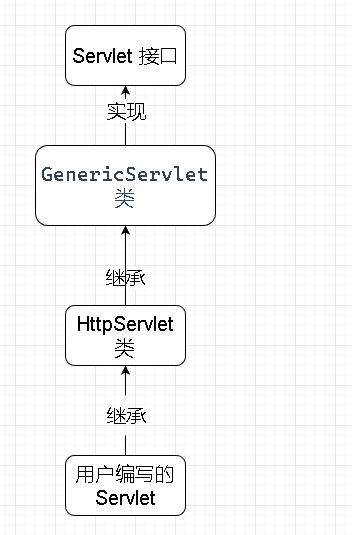

**(2) 各个类的分工：**

1. Servlet 接口负责定义 Servlet 程序的访问规范
2. GenericServlet 类实现 Servlet 接口，做了很多空实现，并持有一个 ServletConfig 类的引用，并对 ServletConfig 的使用做一些方法
3. HttpServlet 抽象类实现了 service 方法，并实现了请求的分发处理，分别为 doGet 和 doPost 方法，这些方法只负责抛异常
4. 最后，由我们自定义的 Servlet 程序来负责实现具体的响应程序，重写相应的响应方法


**(3) ServletConfig 类作用：**

> GenericServlet 类持有一个 ServletConfig 类的引用
>
> 这是一个 servlet 配置类，主要作用就是获取相关参数的

1. 获取 Servlet 程序的别名 servlet-name 的值

​	运用对象调用 getServletName 方法获取 servlet-name 的值

2. 获取初始化参数 init-param

   1. 在 web.xml 配置文件中去配置 init-param，具体位置为 servlet 标签下。

   2. init-param 标签，是初始化参数，需要在其下定义两个标签，分别为 param-name 和 param-value，这一组是一组键值对

      > param-name 是参数名
      >
      > param-value 是参数值

   3. 在方法体中获取相应的键值对：

      运用对象调用 getServletParameter 方法，并传参，传入的具体参数为自定义的参数名，获取到的就是相对应的参数值

3. 获取 ServletContext 对象

​	获取方式：运用对象调用 getServletContext 方法


**(4) ServletConfig 类的细节：**

1. Servlet 程序和 ServletConfig 对象都是**由TomCat负责创建，我们负责使用**

2. Servlet 程序默认是**第一次访问时创建**，ServletConfig 是**每个Servlet 程序创建时，就创建一个对应的 ServletConfig 对象**

3. 每一个 ServletConfig 对象只对应自己所在的类，也就是自己所在的 Servlet 程序，在自己所在的 Servlet 程序中获取其他的类（Servlet程序）的配置信息是获取不到的

4. 重写 init 方法时，没有 super 访问父类的 ServletConfig 对象，会报空指针异常

   - 原因：GenericServlet 中持有一个 `ServletConfig config`对象，使用 transient 修饰，表示，瞬时的，暂时的，GenericServlet 中有一个 getServletConfig 方法，能获取到 ServletConfig 对象，会返回一个config。

     GenericServlet 还有一个 init 方法，这个方法只有两句：

     ```java
     this.config = config;//将config对象保存起来了
     this.init();
     ```

     ServletConfig 对象由 Tomcat 创建，如果没有及时保存起来(重写 init 方法，没有super.init(config))，就会造成 ServletConfig 对象的丢失，导致获取不到相应的 config 信息，就造成了空指针异常。


**(5) ServletContext 类作用：**

1. 认识：

ServletContext 是一个接口，表示 Servlet 上下文对象，一个 web 工程（即模块），只有一个 ServletContext 对象实例。ServletContext 对象是一个域对象，域对象指可以像 Map 一样存取数据的对象，"域" 指的是存取数据的操作范围。

域对象的增删查方法：

| 方法              | 作用     |
| ----------------- | -------- |
| setAttribute()    | 存数据   |
| getAttribute()    | 取数据   |
| removeAttribute() | 删除数据 |


Map 与 域对象的比较：

|        | 存数据         | 取数据         | 删除数据          |
| ------ | -------------- | -------------- | ----------------- |
| Map    | put()          | get()          | remove()          |
| 域对象 | setAttribute() | getAttribute() | removeAttribute() |


2. ServletContext 有四大用处：
   1. 获取 web.xml 中配置的上下文参数 context-param
   2. 获取当前的工程路径，格式：/工程路径
   3. 获取工程部署后在服务器硬盘上的绝对路径
   4. 像 Map 一样存取数据

```xml
<!-- 演示用 xml 配置文件-->
<?xml version="1.0" encoding="UTF-8"?>
<web-app xmlns="http://xmlns.jcp.org/xml/ns/javaee"
xmlns:xsi="http://www.w3.org/2001/XMLSchema-instance"
xsi:schemaLocation="http://xmlns.jcp.org/xml/ns/javaee
http://xmlns.jcp.org/xml/ns/javaee/web-app_4_0.xsd"
version="4.0">
    <!-- context-param 是上下文参数(它属于整个 web 工程) -->
    <context-param>
    	<param-name>username</param-name>
        <param-value>context</param-value>
    </context-param>
    <context-param>
    	<param-name>password</param-name>
        <param-value>root</param-value>
    </context-param>
```

作用1，2，3：


```java
// 获取 xml 配置文件参数的 java 程序
protected void doGet(HttpServletRequest request,HttpServletResponse response) throws ServletException,IOException{
    //1 获取 web.xml 中配置的上下文参数 context-param
    ServletContext context = getservletConfig().getservletContext();
    String username = context.getInitParameter("username");
    System.out.println("context-param参数usernamel的值是：" + username);
	System.out.println("context-param参数password的值是：" + context,getInitParameter("password"));
    //2 获取当前的工程路径，格式：/工程路径
    System.out.println("当前工程路径：" + context.getContextPath());
	//3 获取工程部署后在服务器硬盘上的绝对路径
    System.out.println("工程部署的路径是：" + context.getRealPath("/"));
    System.out.println("工程下css目录的绝对路径是：" + context.getRealPath("/css"));
    System.out.print1n("工程下imgs目录1.jpg的绝对路径是：" + context.getRealPath("/imgs/1.jpg"));
}
```

作用4：

```java
protected void doGet(HttpServletRequest request,HttpServletResponse response) throws ServletException,IOException{
    //获取erv儿etContext对象
	ServletContext context = getservletContext();
    System.out.printIn("保存之前：Context1 获取 key1 的值是：" + context.getAttribute("key1"));
    context.setAttribute("key1","value1");
    System.out.println("Context1中获取域数据key1的值是：" + context.getAttribute("key1");
	System.out.printIn("Context1中获取域数据key1的值是：" + context.getAttribute("key1"));
	System.out.printIn("Context1中获取域数据key1的值是：" + context.getAttribute("key1"));
	System.out.println("Context1中获取域数据key1的值是：" + context.getAttribute("key1"));
}
```


> context-param 标签在所有子标签的最上方，web-app 的下方，其下有两个标签，键值对标签，param-name 和 param-value标签

> 注意：context-param 属于整个 web 工程，是共用的，所有 Servlet 程序，Filter 过滤器，Listener 监听器都可以获取到它的信息
>
> 获取参数值的方法为：ServletContext 对象调用 getInitParameter 方法，需要传入参数，具体传入参数为键值对中的键

> 补充：
>
> 1. 相应的对象只能获取相应的值，ServletContext 对象获取不了 ServletConfig 对象才能获取到的参数信息
> 2. ServletContext 对象调用方法 getRealPath() 传入参数为`/`，表示，获取到工程名后面的内容，斜杠表示被服务器解析为`http://ip:port/工程名/`，而获取到的绝对路径是从工程（模块）下的 web 目录开始，而自己写的 Java 类的字节码文件，被放在了 web 下的 WEB-INF 目录中的 classes 文件夹中
> 3. 补充：Using CATALINA_BASE 表示 IDEA 整合 TomCat 之后，Tomcat 被拷贝的一些副本内容，这个也是一个路径

> 存取数据注意事项：
>
> 1. ServletContext 是在 web 工程部署启动时创建，只有用 ServletContext 对象存数据了，取数据的时候才会有对应的数据，而存入的数据，在所有的 Servlet 程序中调用 ServletContext 对象都能取到

### 2.7 Http 协议

**(1) Http 协议是什么？**

​	**协议** 是指 双方或多方，相互约定好，大家都需要遵守的规则，叫协议。

​	所谓 HTTP 协议，就是指客户端和服务器之间通信时，发送数据，需要遵守的规定，叫 HTTP 协议，**HTTP 协议中的数据又叫报文**。


**(2) 请求 HTTP 协议的格式：**

**格式由：请求行 + 请求头 (+ 请求体) 组成**

**请求行包含信息：**

1. 请求的方式
2. 请求的资源路径
3. 请求的协议的版本号


**请求头包含信息：**

由 key-vlaue 组成，不同的键值对，包含不同的含义。


**请求体(只有Post有)包含信息：**

发送给服务器的数据 


1. Get 请求

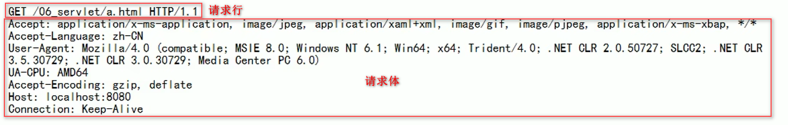

**请求行包含内容：**

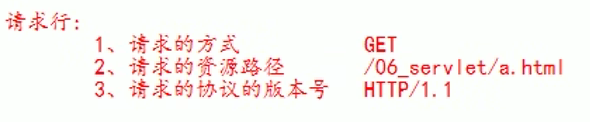

**请求头包含内容：**

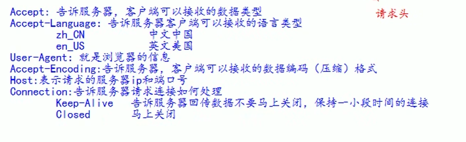

2. Post 请求

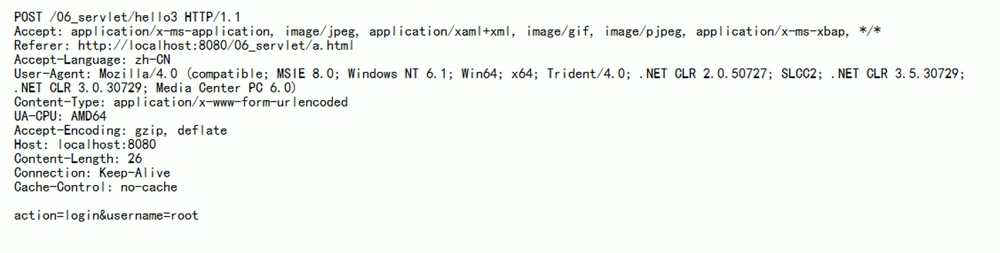

**请求行包含内容：**

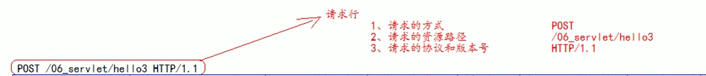

**请求头包含内容：**

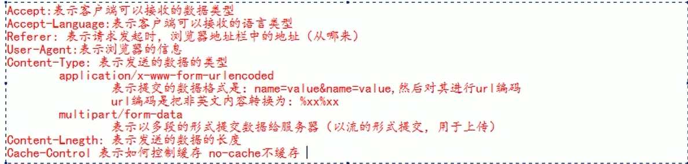

**请求体包含内容：**

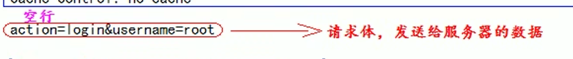


**(3) 常用的请求头：**

| 请求头          | 含义                           |
| --------------- | ------------------------------ |
| Accept          | 表示客户端可以接收的数据类型   |
| Accept-Languege | 表示客户端可以接收的语言类型   |
| User-Agent      | 表示客户端浏览器的信息         |
| Host            | 表示请求时的服务器 ip 和端口号 |

**(4) GET 请求和 POST 请求的区别：**

**GET 请求：**

1. form 标签 method=get
2. a 标签
3. link 标签引入 css
4. Script 标签引入 js 文件
5. img 标签引入图片
6. iframe 引入 html 页面
7. 在浏览器地址栏中输入地址后敲回车


**POST 请求：**

form 标签 method=post


**(5) 响应的 HTTP 协议格式：**

**格式：响应行 + 响应头 + 响应体**

**响应行是组成：**

1. 响应的协议和版本号
2. 响应状态码
3. 响应状态描述符

**响应头的组成：**

key-value 不同的响应头，有其不同含义

**响应体的组成：**

> 注意：响应体 与 响应头 之间隔着一行空行

回传给客户端的数据


**HTTP 响应协议详解：**

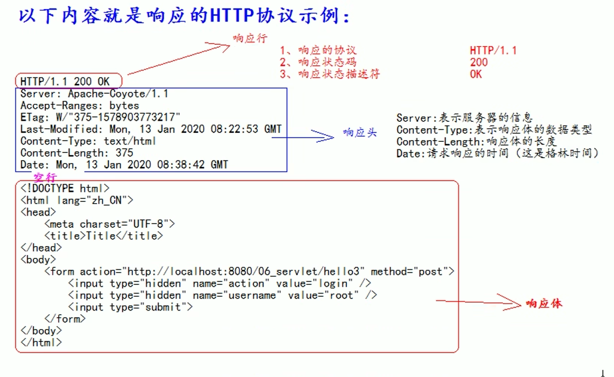


**(6) 常见的响应码：**

| 响应码 | 含义                                                         |
| ------ | ------------------------------------------------------------ |
| 200    | 表示请求成功                                                 |
| 302    | 表示请求重定向                                               |
| 404    | 表示请求服务器已经收到了，但是你要的数据不存在（请求地址错误或者数据不存在） |
| 500    | 表示服务器已经收到请求，但是服务器内部错误（代码错误）       |


**(7) MIME 类型说明：**

MIME 是 HTTP 协议中数据类型。

英文全称是 "Multipurpose Internet Mail Extensions" 多功能 Internet 邮件扩充服务。MIME 类型的格式是 "大类型/小类型"，并与某一种文件的扩展名相对应

常见的 MIME 类型：

| 文件               | MIME类型    | 对应格式                |
| ------------------ | ----------- | ----------------------- |
| 超文本标记语言文本 | .html,.html | text/html               |
| 普通文本           | .txt        | text/plain              |
| RTF文本            | .rtf        | application/rtf         |
| GIF图形            | .gif        | image/gif               |
| JPEG图形           | .jpeg,.jpg  | image/jpeg              |
| au声音文件         | .au         | audio/basic             |
| MIDI音乐文件       | .mid,.midi  | audio/midi,audio/x-midi |
| RealAudio音乐文件  | .ra,.ram    | audio/x-pn-realaudio    |
| MPEG文件           | .mpg,.mpeg  | video/mpeg              |
| AVI文件            | .avi        | video/x-msvideo         |
| GZIP文件           | .gz         | application/x-gzip      |
| TAR文件            | .tar        | application/x-tar       |

### 2.8 HttpServletRequest 详解

​	只要有请求进入 TomCat 服务器。TomCat 服务器就会把请求过来的HTTP 协议信息解析好封装到 Request 对象中，然后传递到 service 方法（doGet 和 doPost）中给我们使用。我们可以通过 HttpServletRequest 对象，获取到所有请求的信息，每次请求创建一个，请求完成就销毁。

**(1) HttpServletRequest 的常用方法：**

| 方法                     | 作用                                 |
| ------------------------ | ------------------------------------ |
| getRequestURI()          | 获取请求的资源路径                   |
| getRequestURL()          | 获取请求的统一资源定位符（绝对路径） |
| getRemoteHost()          | 获取客户端的 ip 地址                 |
| getHeader()              | 获取请求头                           |
| getParameter()           | 获取请求的参数                       |
| getParameterValues()     | 获取请求的参数（多个值的时候使用）   |
| getMethod()              | 获取请求的方式 GET 或 POST           |
| setAttribute(key, value) | 设置域数据                           |
| getAttribute(key)        | 获取域数据                           |
| getRequestDispatcher()   | 获取请求转发对象                     |

> 补充1：
>
> 1. 在 IDEA 中，使用 localhost 访问时，得到的客户端 ip 地址是，127.0.0.1
> 2. 在 IDEA 中，使用 127.0.0.1 访问时，得到的客户端 ip 地址是，127.0.0.1
> 3. 在 IDEA 中，使用真实 ip 访问时，得到的客户端 ip 地址是，真实的 IP 地址

**(2) 获取客户端发送的参数：**

**页面数据：**

```html
<body>
    <form action="http://localhost:8080/07_servlet/parameterServlet" method="get">
        用户名：<input type="text" name="username"><br/>
        密码：<input type="password" name="password"><br/>
        兴趣爱好：<input type="checkbox" name="hobby" value="cpp">C+
        <input type="checkbox" name="hobby" value="java">Java
        <input type="checkbox" name="hobby" value="js">JavaScript<br/>
        <input type="submit">
    </form>
</body>
```

**GET 请求获取参数的程序：**

```java
@Override
protected void doGet(HttpServletRequest req,HttpServletResponse resp) throws ServletException,IOException{
    //获取请求参数
    String username = req.getParameter("username");
    String password = req.getParameter("password");
    String[] hobby = req.getParameterValues("hobby");
    System.out.println("用户名："+username);
    System.out.println("密码："+password);
    System.out.println("兴趣爱好："+hobby);
}
```

**POST 请求获取参数的程序：**

```java
@Override
protected void doPost(HttpServletRequest req,HttpServletResponse resp) throws ServletException,IOException{
    // 设置请求体的字符集 UTF-8，解决 Post 请求的中文乱码问题。
	req.setCharacterEncoding("UTF-8");
    //获取请求参数
    String username = req.getParameter("username");
    String password = req.getParameter("password");
    String[] hobby = req.getParameterValues("hobby");
    System.out.println("用户名："+username);
    System.out.println("密码："+password);
    System.out.println("兴趣爱好："+hobby);
}
```

> 注意：该方法只有在获取请求参数之前才有用，只要该方法之前有一个获取参数的请求，并生效了，那么该设置字符集的方法就会失去作用


**(3) 请求转发：**

​	服务器收到请求后，从一次资源跳转到另一个资源的操作叫请求转发。

> 通俗的讲：从一个 Servlet 程序跳转到另一个 Servlet 程序 或 其他程序 就叫请求转发

```java
//第一个 Servlet 程序，用来转发请求
@Override
protected void doGet(HttpServletRequest req,HttpServletResponse resp) throws ServletException,IOException {
    //获取请求的参数（办事的材料）查看
    String username = req.getParameter("username");
    System.out.println("在 Servlet1(柜台1) 中查看参数（材料）:" + username);
    //给材料盖一个章，并传递到跳erv儿et2(柜台2)去查看
	req.setAtribute("key","柜台 1 的章");
    //问路：Servlet2(柜台2）怎么走
    // 请求转发必需要以 / 打头，/ 表示地址为：http://ip:port/工程名/ ，映射到 IDEA 代码的 web 目录
    RequestDispatcher requestDispatcher = req.getRequestDispatcher("/servlet2");
    //走向 Sevlet2(柜台2)
    //forward 中文释义：向前进
	requestDispatcher.forward(req,resp);
}
```

```java
//第二个 Servlet 程序，用来接收第一个 Servlet 程序转发过来的请求
@Override
protected void doGet(HttpServletRequest req,HttpServletResponse resp) throws ServletException,IOException {
    //获取请求的参数（办事的材料）查看
    String username = req.getParameter("username");
    System.out.println("在 Servlet2(柜台2) 中查看参数（材料）:" + username);
    //查看柜台1是否有盖章
    Object key1 = req.getAttribute("key1");
    System.out.print1ln("柜台1是否有章：" + key1);
    //处理自己的业务
    System.out.println("Servlet2 处理自己的业务");
}
```

**请求转发的特点：**

1. 浏览器的地址栏不会发生变化
2. 只是**一次请求**，只不过分了不同的程序去处理而已
3. 所有 Servlet 程序共享 Request 域中的数据
4. 可以转发到 WEB-INF 下目录下，只不过路径需要设置为：`/WEB-INF/资源路径`
5. 不可以访问工程以外的资源，只能访问本工程内的资源


**(4) base 标签：**

**作用：**

1. 设置页面相对路径工作时参照的地址
2. href 属性就是参数的地址值

**为什么要有 base 标签？他有什么用？**

在请求转发时，从一个页面跳转到另外一个页面，在另外一个界面就会面临回不到原界面的问题。

根本原因为：在正常跳转页面时，浏览器的地址栏会将路径信息显示的比较完整，包括在哪个目录下，而请求跳转时，浏览器地址栏信息不会发生变化，那么，在返回到原界面时，一般都会用 `../../源文件路径` 这个方式来返回原界面，而 `../` 表示去掉一层目录，这个放在正常完整的路径的情况下没什么问题，去掉目录后就是正确的路径，而在请求转发的情况下，去掉目录就可能产生路径错误

**base 标签的作用：**

在进行页面跳转时，会优先参考 base 标签中的路径，以 base 标签中 href 的值作为最优先参考的路径，这样在进行页面跳转的时候，就能避免产生路径错误，包括请求转发的情况下，也能避免产生路径错误

```html
<html lang="zh_CN">
<head>
    <meta charset="UTF-8">
    <title>Title</title>
<!-- 
	base 标签设置页面相对路径工作时参照的地址 
		href 属性就是参数的地址值
-->

	<base href="http://localhost:8080/07_servlet/a/b/c.html">
</head>
<body>
    这是 a 下的 b 下的 c.html 页面<br/>
    <a href="../../index.html">跳回首页</a><br/>
</body>
</html>
```


**(5) web 中相对路径，绝对路径 和 斜杠的问题：**

1. 斜杠是一种绝对路径。
2. `response.sendRediect("/")` 表示将斜杠发送给浏览器解析，得到 `http://ip:port/` **这个就表示请求重定向**

### 2.9 HttpServletResponse 详解

每次请求进来，Tomcat 服务器都会创建一个 Response 对象传递给 Servlet 程序去使用，我们可以通过 HttpServletResponse 对象来设置所有返回给客户端的信息。

> HttpServletRequest 表示请求信息
>
> HttpServletResponse 表示响应信息

**(1) 往客户端回传数据：**

```java
@Override
protected void doGet(HttpServletRequest req,HttpServletResponse resp) throws ServletException,IOException{
    
    //服务器默认编码格式是 IS0-8859-1，所以回传中文时，会出现乱码的问题
    //System.out.println(resp.getcharacterEncoding());//IS0-8859-1
    // 设置服务器的字符集为 UTF-8
    resp.setCharacterEncoding("UTF-8");
    // 在将服务器的编码设置为 UTF-8 后，浏览器仍有可能会显示乱码，这个时候就需要设置一下浏览器的编码了
    // 方式1：通过响应头，设置浏览器也使用 UTF-8 字符集
    //resp.setHeader("Content-Type","text/html;charset=UTF-8");
    // 方式2：它会同时设置服务器和客户端都使用 UTF-8 字符集，还设置了响应头
    // 此方法一定要在获取流对象之前调用才有效
	resp.setContentType("text/html;charset=UTF-8");
    //要求：往客户端回传字符串数据。
	PrintWriter writer = resp.getWriter();
	writer.write("response's content!!!");
}
```

**(2) 请求重定向：**

客户端给服务器发请求，服务器告诉客户端，去新地址访问，叫请求重定向（因为之前的地址可能已经被废弃）。

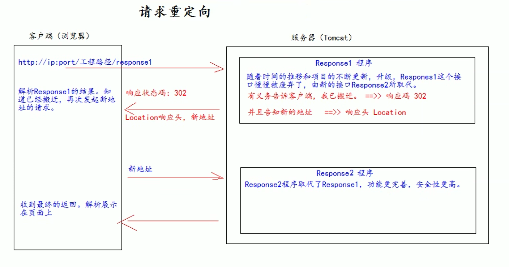

**方案1：**

```java
// 响应程序1
@Override
protected void doGet(HttpServletRequest req,HttpServletResponse resp) throws ServletException,IOException {
    System.out.println("曾到此一游Response1");
    
    req.setAttribute("key1","value1");
    
    //设置响应状态码302，表示重定向，(已搬迁)
    resp.setStatus(302);
    //设置响应头，说明新的地址在哪里
    resp.setHeader("Location","http://localhost:8080/07_servlet/response2");
}
```

```java
//响应程序2
@Override
protected void doGet(HttpServletRequest req,HttpServletResponse resp) throws ServletException,IOException {
    
    //不共享 Request 域中的数据
    System.out.println(req.getAttribute("key1")); // null
    
    resp.getWriter().write("response2's result!");
}
```

**方案2：**

```java
@Override
protected void doGet(HttpServletRequest req,HttpServletResponse resp) throws ServletException,IOException {
    //这种方式，在有程序进行访问时，会直接跳转到括号内的地址，比之前的方案更加的方便
    resp.sendRedirect("http://localhost:8080");
}
```

**请求重定向的特点：**

1. 浏览器地址栏会发生变化
2. 是**两次请求**
3. 不共享 Request 域中的数据
4. 不能访问 WEB-INF 下的资源
5. 可以访问工程外的资源

## 3、文件的上传与下载

### 3.1 文件的上传

**(1) 实现的前置要求：**

1. 要有一个 form 标签，method=post 请求
2. form 标签的 encType 属性值必须为 multipart/form-data 值
3. 在 form 标签中使用 input type = file 添加上传的文件
4. 编写服务器代码(Servlet 程序)接受，处理上传的数据。


**(2) 名词理解：**

```html
<body>
    <form action="" method="post" enctype="multipart/form-data">
    用户名：<input type="text" name="username"/><br>
    头像：<input type="file" name="photo"><br>
    <input type="submit" value="上传">
    </form>
</body>
```

1. encType = multipart/form-data 表示提交的数据，以多段(每一个表单项一个数据段)的形式进行拼接，然后以二进制流的形式发送 给服务器
2. Content-Type 表示提交的数据类型
3. multipart/form-data 表示提交的数据，以多段(每一个表单项一个数据段)的形式进行拼接，然后以二进制流的形式发送给服务器
4. boundary 表示每段数据的分隔符，分隔符又系统随机生成，一般在 Cookie 后面隔一个空行，分隔符一般有多个，每个分隔符的前面有多个减号，最后一个分隔符在末尾多了两个减号

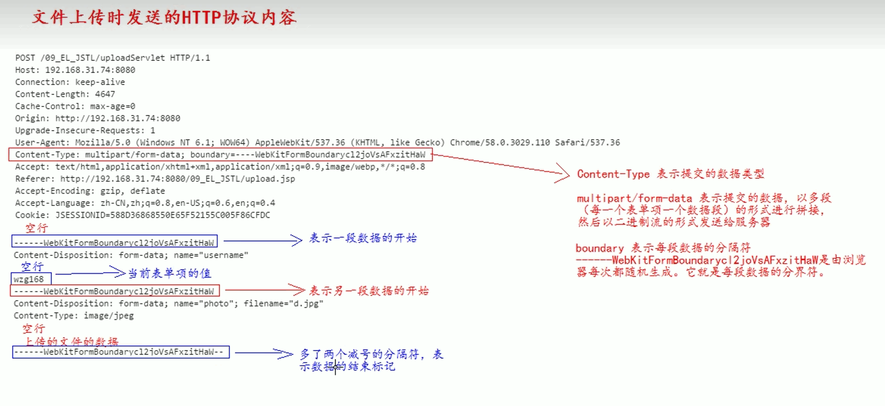

**(3) 文件上传的具体流程：**

由于数据上传过于常见，有第三方提供了相应的 jar 包，commons-fileupload.jar 包和 commons-io.jar 包。

commons-fileupload.jar 需要依赖 commons-io.jar 这个包，所以我们两个包都要导入。

常用类 ServletFileUpload 的常用方法：

> ServletFileUpload 类就是用于解析上传的数据的

| 方法                                                         | 作用                                                         |
| ------------------------------------------------------------ | ------------------------------------------------------------ |
| boolean ServletFileUpload.isMultipartContent(HttpServletRequest request); | 判断当前上传的数据格式是否为多段的格式                       |
| public List parseRequest(HttpServletRequest request)         | 解析上传的数据                                               |
| boolean FileItem.isFormField()                               | 判断当前这个表单项，是否是普通的表单项。还是上传的文件类型。<br />true 表示普通类型的表单项<br />false 表示上传的文件类型 |
| String FileItem.getFieldName()                               | 获取表单项的 name 属性值                                     |
| String FileItem.getString()                                  | 获取当前表单项的值。                                         |
| String FileItem.getName();                                   | 获取上传的文件名                                             |
| void FileItem.write(file);                                   | 将上传的文件写到 参数 file 所指向抽硬盘位置                  |

```java
//文件上传大致就是客户端向服务端发送数据，然后服务端进行数据接收，在解析数据即可
@Override
protected void doGet(HttpServletRequest req,HttpServletResponse resp) throws ServletException,IOException {
    //1 先判断上传的数据是否多段数据(只有是多段的数据，才是文件上传的)
	if (ServletFileUpload.isMultipartContent(req)){
		//创建 FileItemFactory 工厂实现类
		FileItemFactory fileItemFactory = new DiskFileItemFactory();
        //创建用于解析上传数据的工具类 ServletFileUpload 类
		ServletFileUplpad servletFileUpload = new ServletFileUpload(fileItemFactory);
        try{
            //解析上传的数据，得到每一个表单顶 FileItem
        	List<FileItem> list = servletFileUpload.parseRequest(req);
            //循环判断，每一个表单顶，是普通类型，还是上传的文件
            for (FileItem fileItem : list){
            	if (fileItem.isFormField()){
            		// 普通表单顶
                    System.out.println("表单项的 name 属性值：" + fileItem.getFieldName());
					//参数UTF-8.解决乱码问题
					System.out.println("表单项的 value 属性值：" + fileItem.getString("UTF-8"));
                }else {
                    // 上传的文件
                    System.out.println("表单项的 name 属性值：" + fileItem.getFieldName());
					System.out.println("上传的文件名：" + fileItem.getName());
                    
                    fileItem.write(new File("e:\\" + fileItem.getName()));
                }
        }catch (Exception e){
        	e.printstackTrace();
    	}
}
```

### 3.2 文件的下载

**(1) 整体流程：**

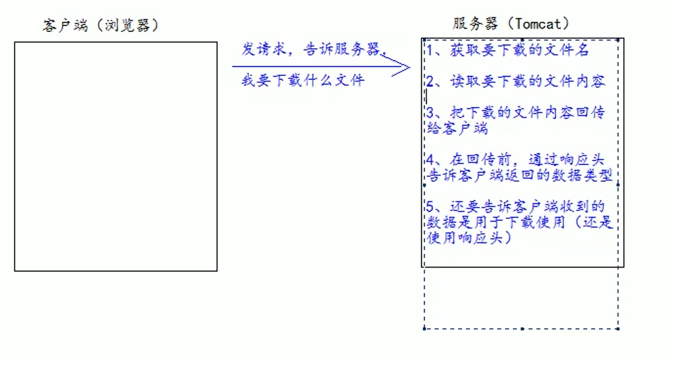

```java
//文件上传大致就是客户端向服务端发送数据，然后服务端进行数据接收，在解析数据即可
@Override
protected void doGet(HttpServletRequest req,HttpServletResponse resp) throws ServletException,IOException {
	//1 获取要下载的文件名
	String downloadFileName = "2.jpg";
    //2 读取要下载的文件内容(通过 ServletContext 对象可以读取)
	ServletContext servletcontext = getServletContext();
	//获取要下裁的文件类型
	String mimeType = servletContext.getMimeType("/file/" + downloadFileName);
	System.out.println("下载的文件类型：" + mimeType);
    //4 在回传前，通过响应头告诉客户端返回的数据类型
    resp.setContentType(mimeType);
    //5 还要告诉客户端收到的数据是用于下裁使用（还是使用响应头）
    // Content-Disposition 响应头，表示收到的数据怎么处理
	// attachment 表示附件，表示下载使用
	// filename= 表示指定下载的文件名
	resp.setHeader("Content-Disposition","attachment; filename=" + downloadFileName);
    
	/**
	 / 斜杠被服务器解析表示地址 http://ip:prot/工程名/ 映射 到代码的 Web 目录
	*/
    Inputstream
resourceAsstream = 
servletContext.getResourceAsstream("/file/" + downloadFileName);
    //获取响应的输出流
	Outputstream outputstream = resp.getOutputStream();
	//3 把下载的文件内容回传给客户谢
    // 读取输入流中全部的数据，复制给输出流，输出给客户端
	IOUtils.copy(resourceAsStream,outputStream);
}
```

> 补充：注意，运用的是 service 程序给客户端回传数据，所以要在 web.xml 配置文件中给该 service 类进行配置处理
>
> 补充2：回传给客户端的文件的名字是可以修改的，在 setHeader 中设置一下文件名即可

**(2) 回传下载文件名中文乱码问题：**

1. **谷歌，IE 浏览器的乱码问题：**

```java
// url 编码是把汉字转换成为 %xx%xx 的格式，这种方式能解决 Google 和 IE 浏览器的乱码问题
resp.setHeader("Content-Disposition","attachment; filename=" + URLEncoder.encode("中国.jpg","UTF-8"));
```

2. **火狐浏览器的乱码问题：**

**Base64 的编解码操作：**

```java
	//要解决火狐浏览器的乱码问题需要用 Base64 编解码，因为火狐用的就是 Base64 编解码
	String content = "这是需要Base64编码的内容";
	// 创建一个 Base64 编码器
	BASE64Encoder base64Encoder = new BASE64Encoder();
	//执行 Base64 编码操作
	String encodedString = base64Encoder.encode(content.getBytes("UTF-8"));
    System.out.println(encodedString);
	//创建 Base64 解码器
	BASE64Decoder base64Decoder = new BASE64Decoder();
	//解码操作
	byte[] bytes = base64Decoder.decodeBuffer(encodedString
    String str = new String(bytes,"UTF-8");
	System.out.println(str);
```

火狐浏览器需要对中文名进行 BASE64 的编码操作：

这时候需要把请求头 Content-Disposition: attachment; filenames=中文名

编码成为：Content-Disposition: attachment; filename=**=?charset?B?XXXXx?=**

**=?charset?B?xxxxx?= 内容详解：**

| 符号    | 解释                           |
| ------- | ------------------------------ |
| =?      | 表示编码内容的开始             |
| charset | 表示字符集                     |
| B       | 表示BASE64编码                 |
| xxxxx   | 表示文件名 BASE64 编码后的内容 |
| ?=      | 表示编码内容的结束             |

```java
//火狐浏览器解决中文乱码操作的具体实现范例
resp.setHeader("Content-Disposition","attachment; filename==?UTF-8?B?" + new BASE64Encoder().encode("中国.jpg".getBytest("UTF-8")) + "?=");
```

3. **动态判断不同浏览器切换不同方案解决中文乱码问题：**

```java
if (req.getHeader("User-Agent").contains("Firefox")){
    //getHeader 获取请求头 User-Agent 的信息，contains 判断是否含有 Firefox 的信息，如果含有，那就是火狐浏览器，如果没有，那就是谷歌浏览器或者 IE 浏览器。
    //是火狐浏览器
    resp.setHeader("Content-Disposition","attachment; filename==?UTF-8?B?" + new BASE64Encoder().encode("中国.jpg".getBytest("UTF-8")) + "?=");
}else {
    //不是火狐浏览器
    resp.setHeader("Content-Disposition","attachment; filename=" + URLEncoder.encode("中国.jpg","UTF-8"));
}
```

## 4、Cookie

**中文释义：饼干**

### 4.1 认识

1. Cookie 是**服务器通知客户端保存键值对**的一种技术
2. 客户端有了 Cookie 之后，**每次请求都发送给服务器**
3. 每个 Cookie 的大小不能超过 4kb

### 4.2 Cookie 的基本使用

**(1) 创建 Cookie：**

流程图：

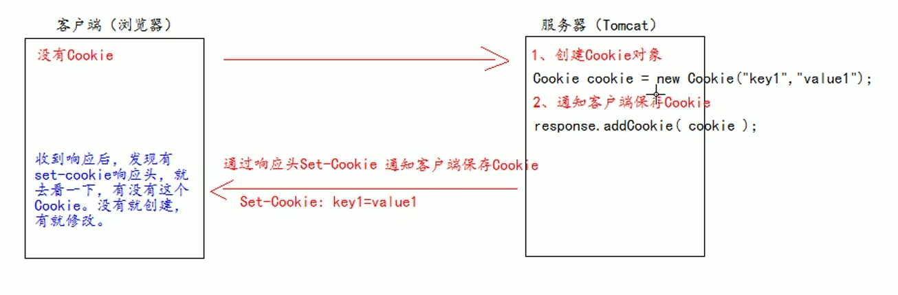

```html
<!-- 前端页面配置 -->
<!-- GET 请求，因为没有 springmvc 的路径映射，所以需要进行手动的程序拼接，?action=createCookie 表示请求的程序，由 createCookie 这个程序进行处理。 -->
<li><a href="cookieServlet?action=createCookie" target="target">Cookie</a></li>
```

```java
// 是一个 Servlet 程序
public class CookieServlet extends BaseServlet {
    protected void createCookie(HttpServletRequest req,HttpServletResponse resp) throws ServletException,IOException {
        //1 创建 Cookie 对象
		Cookie cookie new = Cookie("key1","value1");
		//2 通知客户端保存 Cookie，千万不能省略
		resp.addCookie(cookie);
        // 输出流，输出到客户端
		resp.getWriter().write("Cookie 创建成功");
    }
}
```

```xml
<!-- web.xml 中的配置 -->
<servlet>
    <servlet-name>CookieServlet</servlet-name>
    <servlet-class>com.atguigu.servlet.CookieServlet</servlet-class>
</servlet>
<servlet-mapping>
    <servlet-name>CookieServlet</servlet-name>
    <url-pattern>/cookieServlet</url-pattern>
</servlet-mapping>
```

**(2) 服务器获取客户端的 Cookie：**

```java
protected void getCookie(HttpServletRequest req,HttpServletResponse resp) throws ServletException,IOException {
    // 获取全部 Cookie
    Cookie[] cookies = req.getCookies();
	for (Cookie cookie : cookies) {
        //getName 方法返回 Cookie 的 key(名)
        //getValue 方法返回 Cookie 的 Value 值
        resp.getwriter().write("cookie[" + cookie.getName() + "=" + cookie.getValue() + "]");
    }
}
```

查找某个指定的 Cookie：

```java
	Cookie iWantCooike = null;
	for (Cookie cookie : cookies){
		if ("key2".equals(cookie.getName())){
			iwantcookie = cookie;
			break;
        }
    }
	//如果不等于nuLL,说明赋过值，也就是找到了需要的Cookie
	if (iWantCookie != null){
		resp.getWriter().write("找到了需要的 Cookie");
	)
```

**(3) Cookie 值的修改：**

方案1：

```java
protected void updateCookie(HttpServletRequest req,HttpServletResponse resp) throws ServletException,IOException {
    //1 先创建一个要修改的同名的 Cookie 对象
	//2 在构造器，同时赋于新的 Cookie 值。
	Cookie cookie = new cookie("key1","newvalue1");
	//3 调用 response.addcookie(Cookie); 通知 客户端 保存修改
	resp.addCookie(cookie);
	resp.getWriter().write("key1的Cookie已经修改好");
    }
}
```

方案2：

```java
protected void updateCookie(HttpServletRequest req,HttpServletResponse resp) throws ServletException,IOException {
    //1 先查找到需要修改的 Cookie 对象
    Cookie[] cookies = req.getCookies();
    Cookie cookie = null;
	for (Cookie cookie : cookies){
		if ("key2".equals(cookie.getName())){
			cookie = cookie;
			break;
        }
    }
    //2 调用 setValue() 方法赋于新的 Cookie 值。
    cookie.setValue("newValue2");
    //3 调用 response.addCookie() 通知客户端保存修改
    resp.addCookie(cookie);
}
```

> **注意：**
>
> 对于 setValue 方法，cookie 值**不应该包含 空格、方括号、圆括号、等号、逗号、双引号、斜杠、问号、at符号、冒号和分号。空值在所有浏览器上的行为不一定相同，包括不能包含中文，如果想要用这些符号，需要使用Base64编码**

**(4) 浏览器如何查看 Cookie：**

- 谷歌查看：
  1. 打开源码
  2. 进入 Application 界面
  3. 进入左侧栏 Cookie

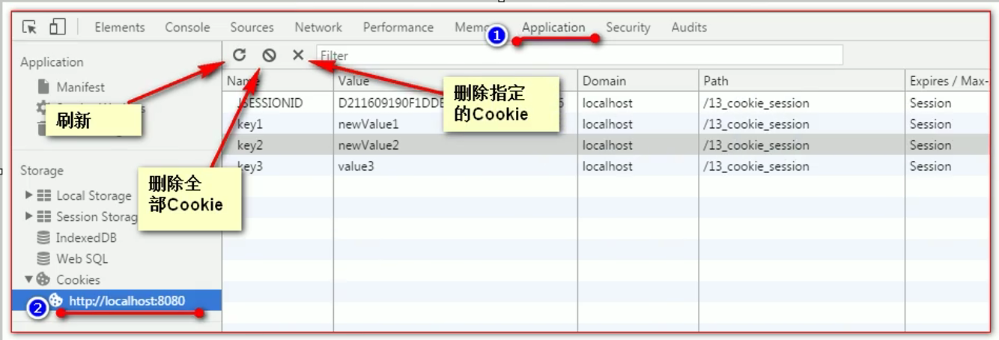

- 火狐查看
  1. 打开源码
  2. 进入存储界面
  3. 进入左侧栏的 Cookie
  4. 右键可以操作

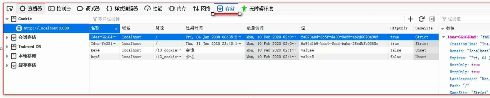

**(5) Cookie 生命控制：**

Cookie 生命控制指的是如何管理 Cookie 什么时候被销毁（删除），主要由 setMaxAge() 方法控制。

```java
Cookie cookie = new cookie("key1","newvalue1");
if (cookie != null){
    //1. 该方法表示设置 cookie 的最大生存时间，以秒为单位
    //2. 正数 表示在指定的秒数后过期
    //3. 负数 表示浏览器关闭后，Cookie 就会被删除
    //4. 0 表示马上删除 Cookie
    //5. 默认值是 -1
    cookie.setMaxAge();
    //每次调用完成后，都不要忘记加上
    resp.addCookie(cookie);
}
```

**(6) Cookie 有效路径 Path 的设置：**

Cookie 的 path 属性可以决定哪些 Cookie 可以发送给服务器，那些不能发送。

path 属性是**通过请求的地址来进行有效的过滤**

```java
protected void testPath(HttpServletRequest req,HttpServletResponse resp) throws ServletException,IOException {
	Cookie cookie = new Cookie("path1","path1");
	//getContextPath() ==>>> 表示得到工程路径
	cookie.setPath(req.getContextPath() + "/abc") // ===>>>>  /工程路径/abc
	resp.addCookie(cookie);
	resp.getWriter().write("创建了一个带有Path路径的Cookie");
}
```

> 注意：只要满足工程路径，那么在相应的工程路径下的所有的 Cookie 都会发送给客户端，哪怕工程路径后面还附带了几个目录条件
>
> 个人理解：这个 Cookie 对象就在工程路径下，所以才会只要满足工程路径就给发送，而其他不直接在工程路径下，而是在别的具体目录下的，就只能满足具体的带有目录的路径才能返回

> 在浏览器上，获取一个具体的在下级目录的 Cookie，需要去到对应的网页，这样才能查看到这个要获取的 Cookie 对象，浏览器路径不一致，看不到其他路径的 Cookie 是谷歌为了安全考虑，自动的给过滤掉了

**(7) Cookie 实现免用户名登录：**

流程图：

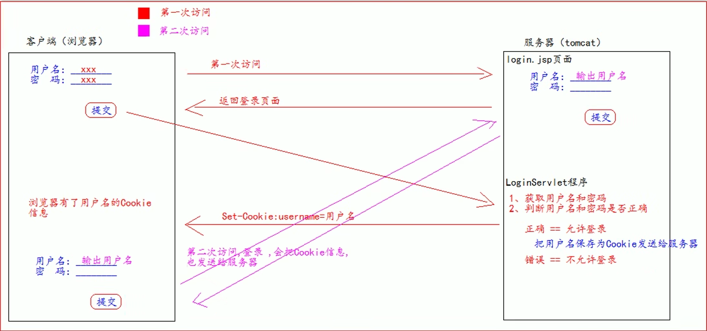

```java
 if( "admin".equals(username) && "123456".equals(password)){
     //登录成功
     //创建 Cookie
     Cookie cookie = new Cookie("username",username);
     //设置 Cookie 生命周期
     cookie.setMaxAge(60 * 60 * 24 * 7);//1周有效
     //通知浏览器保存
     resp.addCookie(cookie);
     System.out.println("登录成功");
 }else {
     //登录失败
     System.out.println("登录失败");
 }
```

## 5、Session

### 5.1 认识

Session 就是会话，也是一个接口(HttpSession)，他是用来**维护一个客户端和服务器之间关联**的一种技术。

每个客户端都有自己的一个 Session 会话。

Session 会话中，我们经常用来保存用户登录之后的信息。

### 5.2 基本使用

**(1) 创建 Session 和 获取 Session：**

```java
protected void createOrGetSession(HttpServletRequest req,HttpServletResponse resp) throws ServletException,IOException {
	//创建和获取 Session 会话对象
	HttpSession session = req.getsession();
	//判断当前 Session 会话，是否是新创建出来的
	boolean isNew = session.isNew();
	//获取 Session 会话的唯一标识 id
    //每个会话都有一个身份证号，也就是ID值，而且这个ID是唯一的
	String id = session.getId();
}
```

> request.getSession()：
>
> 第一次调用是创建 Session 会话，之后调用都是 获取前面创建好的 Session 会话对象
>
> isNew()：
>
> 判断到底是不是刚创建出来的，true 表示刚创建，false 表示获取之前创建

**(2) Session 域数据的存取：**

```java
protected void setAttribute(HttpServletRequest req,HttpServletResponse resp) throws ServletException,IOException {
	req.getSeeion().setAttribute("key","value");//存数据
}

protected void getAttribute(HttpServletRequest req,HttpServletResponse resp) throws ServletException,IOException {
	req.getSeeion().getAttribute("key");//取数据
}
```

**(3) Session 生命周期控制：**

| 方法                     | 作用                                                        |
| ------------------------ | ----------------------------------------------------------- |
| setMaxInactiveInterval() | 设置 Session 的超时时间，超过指定的时长，Session 就会被销毁 |
| getMaxInactiveInterval() | 获取 Session 的超时时间                                     |
| public void invalidate() | 让当前 Session 会话马上超时无效。                           |

```java
protected void life(HttpServletRequest req,HttpServletResponse resp) throws ServletException,IOException {
	//先获取Session对象
	Httpsession session = req.getsession();
	//设置当前 session 3秒后超时
	session.setMaxInactiveInterval(3);
    //获取 Session 的超时时间
    session.getMaxInactiveInterval();
}
```

> **设置超时时间的各种值的情况:**
>
> 1. 正数表示设置 Session 的超时时长
> 2. 负数表示永不超时（极少使用）
> 3. 没有 0 值的情况，0 表示马上删除(或无效)，如果想要当前 Session 会话马上超时无效，直接使用 invalidate() 方法即可。

Session 默认的超时时长为 30 分钟，这是因为在 Tomcat 服务器的配置文件 web.xml 中默认有以下配置：

```xml
<!-- 他就表示配置了 Tomcat 服务器下所有的 `session` 超时配置默认时长为 30 分钟 -->
<session-config>
	<session-timeout>30</session-timeout>
</session-config>
```

如果希望自己的 web 工程默认的 Session 的超时时长为其他时长，则可以在自己的 web.xml 配置文件中做以上相同的配置，覆盖掉 Tomcat 的配置，就可以修改自己 web 工程所有的 Session 的默认超时时长。

如果只希望修改个别 Session 的超时时长，就可以使用上面的 API，setMaxInactiveInterval() 来单独的设置。

> 补充：Session 超时表示客户端两次请求的最大间隔时长。
>
> 补充2：每次重新请求(点击)，会重置 Session 的默认超时时间

**(4) 浏览器和 Session 之间关联的技术内幕：**

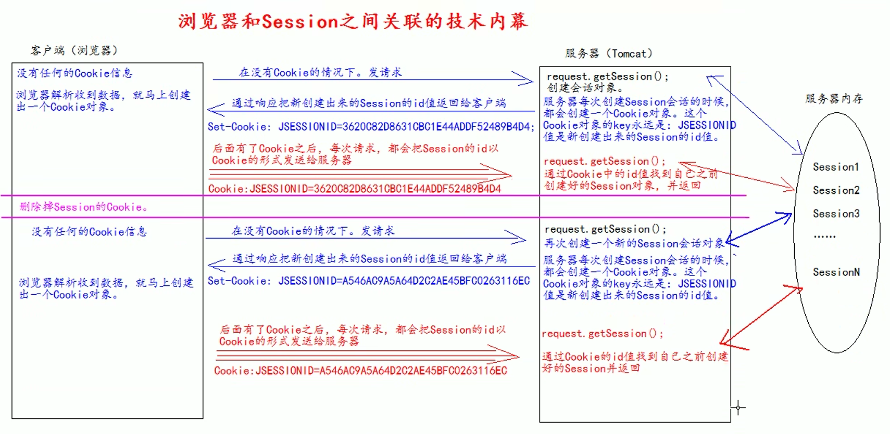

1. 在客户端没有任何 Cookie 信息的情况下，向服务器发送请求
2. 服务器收到请求后，调用 getSession 方法创建会话对象
3. 每次创建会话的时候，都会随之创建一个 Cookie 对象，这个 Cookie 对象的 key 永远是 JSESSIONID，而 value 的值是新创建出来的 Session 的 id 值
4. 然后服务器通过响应把新创建出来的 Session 的 id 值返回给客户端，响应头的格式为 Set-Cookie
5. 浏览器解析收到的数据，就马上创建一个 Cookie 对象
6. 以后，只要在浏览器的 Cookie 对象没有删除的情况下，每次向服务器发送请求，都会将 Cookie 对象发送给服务器，服务器就根据 Cookie 中的 id 值找到自己之前创建好的 Session 对象，并返回
7. 补充：如果浏览器中的 Cookie 对象被删除掉了，再次向服务器发送请求的时候，就会因为没有相应的 Cookie 的 id 值信息，无法查找相应的 Session 会话，从而导致服务器重新创建一个新的 Session 会话
8. 由此可知，Session 技术，底层其实是基于 Cookie 技术来实现的，浏览器关闭，Cookie 清空，所以所有的 Session 会话也会被清空

## 6、Filtener - 过滤器

### 6.1 认识

JavaEE 规范之一，是一个接口。

### 6.2 作用

**拦截请求，过滤响应。**

**常见的应用场景：**

1. 权限检查
2. 日记操作
3. 事物管理
4. 等等

### 6.3 使用

web.xml 配置：

```xml
<!-- filter 标签用于配置一个 Filter 过滤器 -->
<filter>
    <!-- 给 Filter  起一个别名 -->
    <filter-name> AdminFilter </filter-name>
    <!-- 配置 filter 的全类名 -->
    <filter-class> com.atguigu.filter.AdminFilter </filter-class>
</filter>
    <!-- filter-mapping 配置 Filter 过滤器的拦截路径 -->
<filter-mapping>
    <!-- filter-name 表示当前的拦截路径给哪个 filter 使用 -->
    <filter-name>AdminFilter</filter-name>
    <!--url-pattern 配置拦截路径
		/ 表示请求地址为：http://ip:port/工程路径/  映射到 IDEA 的 Web 目录
		/admin/* 表示请求地址为：http://ip:port/工程路径到/admin/*
	-->
    <url-pattern>/</url-pattern>
</filter-mapping>
```

Java 程序：

```java
public class AdminFilter implements Filter {
    @Override
	public void init(FilterConfig filterConfig) throws ServletException {}
    
    //doFilter 方法，专门用于拦截请求，过滤响应。可以做权限检查
    @override
	public void doFilter(ServletRequest servletRequest,ServletResponse servletResponse,Filterchain filterchain) throws ServletException,IOException{
        HttpServletRequest httpservletRequest = (HttpservletRequest)servletRequest;
		HttpSession session = httpservletRequest.getsession();
		object user = session.getAttribute("user");
		//如果等于nuLL,说明还没有登录
		if (user == null){
			//getRequestDispatcher 请求重定向，将请求重新发送到登录界面 /login
            servletRequest
                .getRequestDispatcher("/login.jsp")
                .forward(servletRequest,servletResponse);
			return;
        } else {
            // 让程序继续往下访问用户的目标资源
            // 很重要，不能没有，没有的话，那么用户就算登录成功后去访问资源也是一片空白
            // 因为服务端没有将资源给发回去
			filterchain.doFilter(servletRequest,servletResponse);
        }
    }
}
```

> Filter 在响应程序之前执行

### 6.4 生命周期

**(1) Filter 的生命周期包含几个方法：**

1. 构造器方法
2. init 初始化方法
3. doFilter 过滤方法
4. destroy 销毁方法


**(2) 各方法的使用时间：**

1. 构造器方法和初始化方法在 web 工程启动的时候执行（Filter已经创建）
2. 过滤方法每次拦截到请求就会执行
3. 销毁方法在停止 web 工程（停止服务器），就会执行（停止 web 工程，也会销毁 Filter 过滤器）


### 6.5 FilterConfig 类

**(1) 介绍：**

FilterConfig 类是 Filter 过滤器的配置文件类。Tomcat 每次创建 Filter 的时候，也会同时创建一个 FilteConfig 类，这里包含了 Filter 配置文件的配置信息。

**(2) 作用：**

FilterConfig 类的作用是获取 Filter 过滤器的配置内容。

| 方法                         | 作用                                       |
| ---------------------------- | ------------------------------------------ |
| filterConfig.getFilterName() | 获取 Filter 的名称，即 filter-name 的内容  |
| getInitParameter("key")      | 获取 Filter 中配置的 init-param 初始化参数 |
| getServletContext()          | 获取 ServletContext 对象                   |

### 6.6 FilterChain 过滤器链

过滤器链，表示多个过滤器如何一起工作。

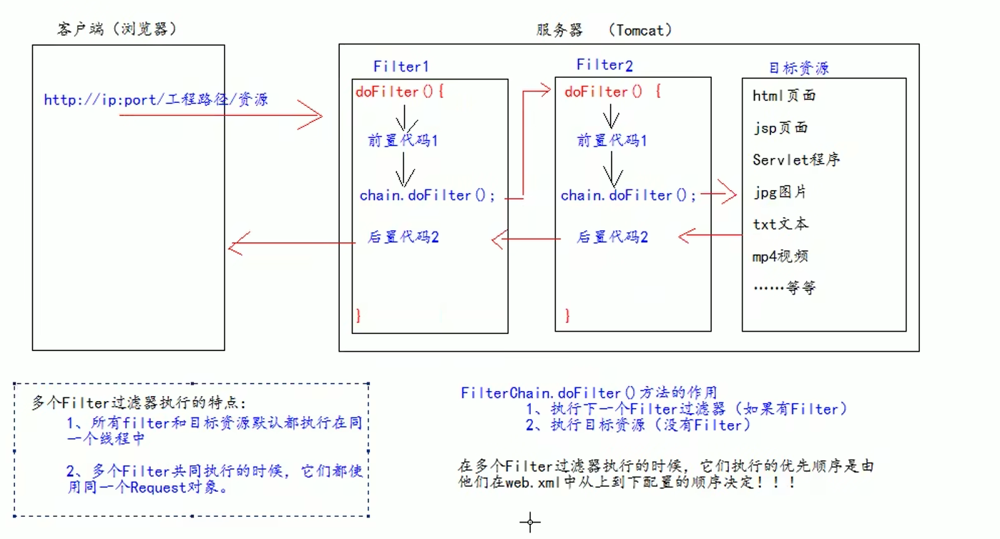

> 细节部分：
>
> 1. 都在 doFilter 方法体中
> 2. 每个 chain.doFilter 方法一般都会有前置代码和后置代码
> 3. 执行流程如上图所示：进入第一个过滤器，执行前置代码，执行 chain.doFilter() 方法，进入到下一个过滤器，执行下一个过滤器的前置代码，并判断有无下一个过滤器，没有下一个过滤器的话，chain.doFilter 方法就获取目标资源，然后返回该过滤器，并执行后置代码，执行完毕，返回前一个过滤器，执行该过滤器的后置代码，直到返回到客户端。

> 问题：
>
> 1. 如果最后一个过滤器中**没有 chain,doFilter 方法和 后置代码**，则**获取不到资源**，**且会直接返回到前一个过滤器中，执行前一个过滤器中的后置代码**
> 2. 如果在一个过滤器链中，第一个过滤器中就没有 chain.doFilter 方法和后置代码，那么后面的过滤器就都不会执行，执行完第一个过滤器的前置代码后，就直接返回给客户端


### 6.7 Filter 拦截路径

**(1) 精确匹配**

```xml
<url-pattern>/文件</url-pattern>
```

以上配置的路径，表示请求地址必须为：http://ip:port/工程路径/资源名

**(2) 目录匹配**

```xml
<url-pattern>/目录名/*</url-pattern>
```

以上配置的路径，表示请求的地址必须为：http://ip:port//目录/*，表示该目录下的所有资源

**(3) 后缀名匹配**

```xml
<url-pattern>*.html</url-pattern>
```

以上配置的路径，表示请求地址必须以 .html 结尾才会拦截到

> 注意：
>
> 后缀名匹配，在 web.xml 配置文件中设置访问路径时(即 `<url-pattern>` 中)，不能以斜杠（即 `/` ）开头，只能为：`*.后缀`；

> 注意：
>
> Filter 过滤器只关心请求的地址是否匹配，不关心请求的资源是否存在


## 7、Listener - 监听器

### 7.1 认识

JavaWeb 三大组件之一，JavaEE 的规范，是一个接口。

### 7.2 作用

监听某种事物的变化，然后通过回调函数，反馈给客户(程序)去做一些相应的处理。

### 7.3 ServletContextListener 监听器

**(1) 作用：**

监听 ServletContext 对象的创建和销毁，ServletContext 对象在 web 工程启动时创建，在 web 工程销毁时销毁。

| 方法                 | 作用         |
| -------------------- | ------------ |
| contextInitialized() | 监听创建方法 |
| contextDestroyed()   | 监听销毁方法 |

**(2) 代码实现：**

1. 实现 ServletContextListener
2. 实现两个回调方法，就是监听创建和销毁的两个方法
3. 在 web.xml 中去配置监听器

```java
public class MyServletContextListenerImpl implements ServletContextListener{
    
    // 在 ServletContext 对象创建后马上调用，做初始化
    @Override
    public void contextInitialized(ServletContextEvent sce){
        System.out.println("监听到 ServletContext 对象创建");
    }
    
    // 在 ServletContext 对象销毁之后调用
    @Override
    public void contextDestroyed(ServletContextEvent sce){
        System.out.println("监听到 ServletContext 对象销毁");
    }
}

```

web.xml 中的配置

```xml
<!-- 配置监听器 -->
<listener>
	<listener-class>com.atguigu.listener.MyServletContextListenerImpl</listener-class>
</listener>
```


## 8、JSON

### 8.1 认识

JSON 是一种轻量的数据交换格式，易于人的阅读和编写，同时也易于机器解析和生成，JSON 采用完全独立于语言的文本格式，很多语言都提供了对 JSON 的支持，这使得 JSON 成为理想的数据交换语言。

> 轻量级：指的是与 XML 做比较
>
> 数据交换：指的是客户端和服务器之间业务数据的传输格式

### 8.2 在 JS 中的使用

**(1) JSON 的定义：**

json 是由键值对组成，并且由花括号（大括号）包围。每个键由引号引起来，键和值之间使用冒号进行分隔，多组键值对之间使用逗号进行分隔。

```javascript
let jsonObj = {
    "key1" : 12,
    "key2" : "abc",
    "key3" : true,
    "key4" : [11,"arr",false],
    "key5" : {
    	"key5_1" : 551,
        "key5_2" : "key5_2_value"
    },
    "key6" : [{
    	"key6_1_1" : 6611,
        "key6_1_2" : "key6_1_2_value"
    },{
        "key6_2_1" : 6621,
        "key6_2_2" : "key6_2_2_value"
    }]
}
```

> JSON 就是一个对象。key 可以理解为对象的属性，value 可以理解为属性的值。

**(2) JSON 的访问：**

```javascript
//1 访问对象的属性，可以得到属性的值
alert(jsonObj.key1);

//2 对于数组，遍历访问即可
for(let i = 0; i < jsonObj.key4.length; i++){
    alert(jsonObj.key4[i]);
}

//3 属性值为对象，且为值的对象中也包含键值对的情况
//访问 key5 对象中的 key5_1 属性的值
alert(jsonObj.key5.key5_1);

//4 属性值为数组，且数组中包含有对象的情况
let jsonItem = jsonObj.key6[0];
//访问 key6 中数组下标为 0 的对象中的 key6_1_1 属性的值
alert(jsonItem.key6_1_1);
```

**(3) JSON 的两个常用方法：**

json 的存在有两种形式：

一种是：对象的形式存在，我们叫它 json 对象。

一种是：字符串的形式存在，我们叫它 json 字符串。

而转换用的方法，如下：

| 方法             | 作用                             |
| ---------------- | -------------------------------- |
| JSON.stringify() | 将 JSON 对象转化成为 JSON 字符串 |
| JSON.parse()     | 将 JSON 字符串转化成为 JSON 对象 |

两种存在形式的使用场景：

1. 需要操作 JSON 中的数据的时候，需要 JSON 对象的格式。
2. 需要在客户端和服务器之间进行数据交换的时候，使用 JSON 字符串。


使用示例：

```javascript
//将 JSON 对象转化成为 JSON 字符串
let JSONObjString = JSON.stringify(jsonObj); // 有点象 Java 中的 toString

//将 JSON 字符串转化成为 JSON 对象
let jsonObj2 = JSON.parse(JSONObjString);
```

### 8.3 在 Java 中的使用

> 需要使用 JSON，就需要先导入相应的 jar 包，这里我们用的是谷歌的 gson

实体类准备：

```java
@Data
public class Person {
    private Integer id;
	private String name;
}
```

**(1) JavaBean 和 JSON 的互转：**

```java
Person person = new Person(1,"国哥好帅！");
//创建Gson对象实例
Gson gson = new Gson();
// toJson 方法可以将 Java 对象转化成为 json 字符串
String personJsonString = gson.toJson(person);
System.out.println(personJsonString);

// formJson 方法可以将 json 字符串转化成 Java 对象
// 第一个参数是 JSON 字符串
// 第二个参数是转换回去的 Java 对象类型
Person person1 = gson.formJson(personJsonString,Person.class);
System.out.println(person1);
```

**(2) List 和 JSON 的互转：**

```java
List<Person> personList = new ArrayList<>();

personList.add(new Person(1,"国哥"));
personList.add(new Person(2,"康师傅"));


Gson gson = new Gson();

// 把 List 转换为 json 字符串
String personListJsonString = gson.toJson(personList);
System.out.println(personListJsonString);

// 将 JSON 字符串转换为一个 List 集合
// 注意，这里 JSON 里面是两个 Map 集合，直接转换会出现问题
// 在 gson 依赖中的解决方法是 创建一个类继承 TypeToken<>，泛型中放入需要转换的 JSON 的最终转换类型即可。
/*
	创建的继承类如下：
	public class PersonListType extends TypeToken<ArrayList<Person>>{}
*/
List<Person> list = gson.fromJson(personListJsonstring,new PersonListType().getType());
System.out.println(list);
Person person = list.get(0);
System.out.println(person);
```

**(3) map 和 JSON 的互转：**

```java
Map<Integer,Person> personMap = new HashMap<>();
personMap.put(1,new Person(1,"国哥好帅"));
personMap.put(2,new Person(2,"康师傅也好帅"));
Gson gson = new Gson();
// 把 map 集合转换成为 json 字符串
String personMapJsonString = gson.toJson(personMap);
System.out.println(personMapJsonString);

// 注意，这里 JSON 里面是两个 Map 集合，直接转换会出现问题，哪怕是 Map，在转换的时候还是会出问题
/*
	解决方式跟 List 集合转换时的解决方式一样。
	创建的继承类如下：
	public class PersonMapType extends TypeToken<HashMap<Integer,Person>>{}
*/
Map<Integer,Person> personMap2 = gson.fromJson(personListJsonstring,new PersonMapType().getType());

//方案2(更优)：匿名内部类形式，进行类型转换
Map<Integer,Person> personMap2 = gson.fromJson(personListJsonstring,new TypeToken<HashMap<Integer,Person>>(){}.getType());

System.out.println(personMap2);
Person p = personMap2.get(1);
System.out.println(p);
```

## 9、AJAX

### 9.1 认识

全称：Asynchronous Javascript And XML(异步JavaScript 和 XML)

AJAX 是一种**创建交互式网页应用**的网页开发技术

AJAX 是一种**浏览器通过 JS 异步发起请求，局部更新页面**的技术

> 术语解释：
>
> 1. **局部更新**
>
>    浏览器地址栏不会发生变化，也不会舍弃原来页面的内容
>
> 2. **异步请求**
>
>    可以**类比为线程**。**同步即单一线程**，一个**程序中只能按顺序执行**，如果前面的代码有一部分卡住了（阻塞），那么后面的代码就只能等待前面的代码执行完毕，整个程序就**卡在了阻塞的地方**。而**异步可以理解为单独再开一个线程**，专门去处理会导致阻塞的部分，但是**整个程序并不会因为一个点的阻塞而停止**，而是会继续执行，这样**能有效的改善用户体验**。

### 9.2 原生 AJAX 请求示例

前端页面：

```html
<script>
	//在这里使用 javascript 语言发起 Ajax 请求，访问服务器 Ajaxservlet 中 javascriptAjax
    function ajaxRequest(){
        //1 我们首先要创建 XMLHttpRequest
        var xmlhttprequest = new XMLHttpRequest();
        //2 调用 open 方法设置请求参数
        xmlhttprequest.open("GET","http://localhost:8080/16_json_ajax_i18n/ajaxservlet?action=javascriptAjax",true);
    	//3 调用 send 方法发送请求
        xmlhttprequest.send();
    	//4 在 send 方法前绑定 onreadystatechange 事件，处理请求完成后的操作。
        xmlhttprequest.onreadystatechange = function(){
            if (xmlhttprequest.readystate == 4 && xmlhttprequest.status == 200){
                // responseText：获取字符串形式的响应数据
                // responseXML：获取 XML 形式的响应数据
                let jsonObj = JSON.parse(xmlhttprequest.responseText);
                // 将响应的数据显示在页面上
				document.getElementById("div01").innerHTML = "编号：" + jsonObj.id + "，姓名：" + jsonObj.name;
            }
        }
    }
</script>
```

> XMLHttpRequest 对象的三个重要属性：
>
> 1. onreadystatechange：存储函数，每当 readyState 属性改变时，就会调用该函数
> 2. readyState：存有 XMLHttpRequest 的状态，从 0 到 4 发生变化
>    - 0：请求未初始化
>    - 1：服务器连接已建立
>
>    - 2：请求已接收
>
>    - 3：请求处理中
>
>    - 4：请求已完成，且响应已就绪
> 3. status：响应码
>    - 200：ok
>    - 404：未找到页面

Java 程序：

```java
public class Ajaxservlet extends Baseservlet{
    protected void javaScriptAjax(HttpServletRequest req,HttpServletResponse resp) throws ServletException,IOException {
        System.out.println("Ajax请求过来了")；
        Person person = new Person(1,"国哥");
        
        //Json 格式的字符串
        Gson gson = new Gson();
        String personJsonString = gson.toJson(person);
        resp.getWriter().write(personJsonString);
    }
}
```

### 9.3 JQ 中的 AJAX

**(1) `$.ajax` 方法：**

| 参数     | 解释                            |
| -------- | ------------------------------- |
| url      | 表示请求的地址                  |
| type     | 表示请求的类型 GET 或 POST 请求 |
| data     | 表示发送给服务器的数据          |
| success  | 请求成功，响应的回调函数        |
| dataType | 响应的数据类型                  |

> 补充：
>
> 发送给服务器的数据 data 的格式有两种：
>
> 1. `name=value&name=value`
> 2. `{key:value}`
>
> dataType 常用的响应数据类型有：
>
> 1. text 表示纯文本 
> 2. xml 表示 xml 数据
> 3. json 表示 json 对象

演示代码：

```javascript
$.ajax({
    url:"http://localhost:8080/16_json_ajax_i18n/ajaxservlet",
    data:{action:"jQueryAjax"},
    type:"GET",
    success:function (data){
    	$("#msg").html("编号：" + data.id + ",姓名：" + data.name);
    },
    dataType:"json"
});
```

**(2) `$.get` 方法和 `$.post` 方法：**

| 参数     | 意思             |
| -------- | ---------------- |
| url      | 请求的 url 地址  |
| data     | 发送给服务器数据 |
| callback | 成功的回调函数   |
| type     | 返回的数据类型   |

演示代码：

```javascript
// ajaX--post 请求
$("#postBtn").click(function(){
    //post请求
    $.post("http://localhost:8080/16_json_ajax_i18n/ajaxServlet",
           "action=jQueryPost",
           function (data){
    			$("#msg").html("post编号：" + data.id + "，姓名：" + data.name);
    		},"json");
});


// ajaX--get 请求
$.("#getBtn").click(function(){
	$.get("http://localhost:8080/16_json_ajax_i18n/ajaxServlet",
          "action=jQueryGet",
          function (data){
			$("#msg").html("get编号：" + data.id + "，姓名：" + data.name);
    		},"json");
});
```

**(3) `$.getJSON` 方法：**

| 参数     | 意思               |
| -------- | ------------------ |
| url      | 请求的 url 地址    |
| data     | 发送给服务器的数据 |
| callback | 成功的回调函数     |

演示代码：

```javascript
// ajaX--getJSON 请求
$.("#getJSONBtn").click(function(){
	$.getJSON("http://localhost:8080/16_json_ajax_i18n/ajaxServlet",
          "action=jQueryGetJSON",
          function (data){
			$("#msg").html("getJSON编号：" + data.id + "，姓名：" + data.name);
    		});
});
```


**(4) serialize()-表单序列化：**

serialize() 可以把表单中所有表单项的内容都获取到，并以 `name=value&name=value` 的形式进行拼接。

> 注意，action 数据类型后面不要忘记加上一个连字符&

演示代码：

```javascript
// ajax 请求
$("#submit").click(function(){
    // 将参数序列化
    alert($("#form01").serialize());
    
    $.getJSON("http://localhost:8080/16_json_ajax_i18n/ajaxServlet",
          "action=jQuerySerialize&" + $("#form01").serialize(),
          function (data){
			$("#msg").html("Serialize 编号：" + data.id + "，姓名：" + data.name);
    		});
});
```


## 10、ThreadLocal 的使用

### 10.1 作用

ThreadLocal 的作用，它可以解决多线程的数据安全问题。

ThreadLocal 它可以给当前线程关联一个数据（可以是普通变量，可以是对象，也可以是数组，集合）

### 10.2 特点

1、ThreadLocal 可以为当前线程**关联一个数据**。（它可以像 Map 一样存取数据，key 为当前线程）

2、每一个 ThreadLocal 对象，只能为当前线程关联一个数据，如果要为当前线程**关联多个数据，就需要使用多个 ThreadLocal 对象实例。**

3、每个 ThreadLocal 对象实例定义的时候，一般都是 static 类型

4、ThreadLocal 中保存数据，在线程销毁后。会由 JVM 虚拟自动释放。

### 10.3 实现

```java
public class ThreadLocalTest {
    public static Map<string,object> data = new Hashtable<string,object>();
    private static Random random = new Random();
    public class Task implements Runnable{
    	@Override
        public void run(){
            //在 Run 方法中，随机生成一个变量（线程要关联的数据），然后以当前线程名为 key 保存到 map 中
            Integer i = random.nextInt(1000);
            // 获取当前线程名
            String name = Thread.currentThread().getName();
			System.out.println("线程[" + name + "]生成的随机数是：" + i);
            data.put(name,i);
            try{
                //线程休眠 5 秒
                Thread.sleep(millis:5000);
            }catch (InterruptedException e){
                e.printstackTrace();
            }
        	//在 Run 方法结束之前，以当前线程名获取出数据并打印。查看是否可以取出操作
            object o = data.get(name);
			System.out.println("在线程[" + name + "]快结束时取出关联的数据是：" + o);
        }
    }
}
```

### 10.4 ThreadLocal 与事务相关联

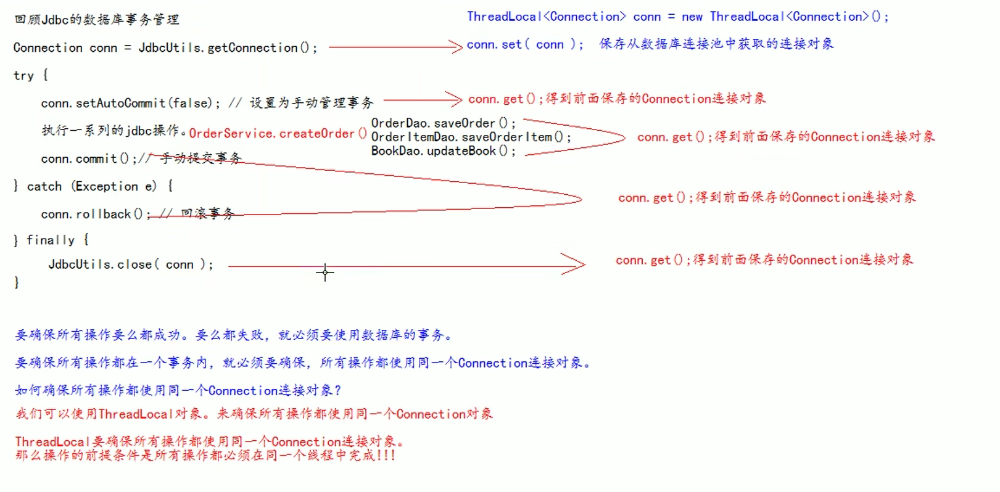

```java
private static DruidDataSource datasource;
private static ThreadLocal<connection> conns = new ThreadLocal<connection>();

//保证获取到同一个连接
public static Connection getConnection(){
	Connection conn = conns.get();//是从 ThreadLocal 线程里获取的连接对象
	if (conn == null){
        try{
            conn = dataSource.getConnection();//从数据库连接池中获取连接
			conns.set(conn);//保存到 ThreadLocal 对象中，供后面的 jdbc 操作使用
            conn.setAutoCommit(false);//设置为手动管理事务
        } catch(SQLException e) {
            e.printStackTrace();
        }
    }
    return conn;
}

//提交事务，并关闭释放连接
public static void commitAndClose(){
	Connection connection = conns.get();
	if(connection != null){ // 如果不等于null,说明之前使用过连接，操作过数据库
	try{
        connection.commit();//提交 事务
    } catch (SQLException e){
        e.printstackTrace();
    } finally {
        try{
            connection.close();//关闭连接，资源资源
        }catch (SQLException e){
            e.printstackTrace();
        	}
    	}
    }
    //一定要执行 remove 操作，否则就会出错。(因为 Tomcat 服务器底层使用了线程池技术)
	conns.remove();
}

//回滚事务
public static void commitAndClose(){
	Connection connection = conns.get();
	if(connection != null){ // 如果不等于null,说明之前使用过连接，操作过数据库
	try{
        connection.rollback();//回滚 事务
    } catch (SQLException e){
        e.printstackTrace();
    } finally {
        try{
            connection.close();//关闭连接，资源资源
        }catch (SQLException e){
            e.printstackTrace();
        	}
    	}
    }
    //一定要执行 remove 操作，否则就会出错。(因为 Tomcat 服务器底层使用了线程池技术)
	conns.remove();
}
```

> 出现异常，不要用 try 进行捕获，要往外抛。这样做的目的是，为了让调用的程序知道发生了异常，好进行异常捕获，并决定是否进行回滚操作。如果用 try 进行捕获，会导致，发生了异常时，后面调用的程序是获取不到异常信息的，因为在前面进行了捕获，异常自然传递不到后面的程序，就间接导致后面程序的异常捕获机制废了。
>
> 决定 事务操作失败进行回滚的就是最后一道程序，所以前面如果出现异常一定不要捕获，要丢给最后一道程序进行捕获和处理。

**(1) 统一给所有 Servlet 加上事务管理：**

结账地址：localhost:8080/book/orderServlet?action=createOrder

表示访问 orderServlet 类中的 createOrder 方法

那么，doFilter 就等于是调用了 createOrder 里面的业务逻辑，在此基础上，在 doFilter 外面加上 try 捕获异常，等于将整个 orderServlet 类中的 createOrder 方法里的所有异常全部捕获了，因为出异常了如果没有进行处理会默认往外抛出，谁调用就会抛给谁。

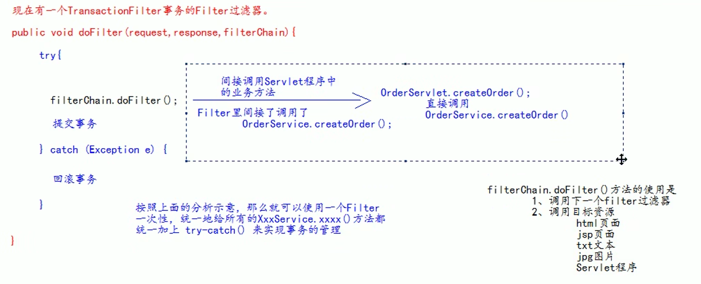

**(2) Tomcat 统一处理异常，展示友好的错误信息页面：**

web.xml 中配置错误页面：

```xml
<!-- error-page 标签配置，服务器出错之后，自动跳转的页面 -->
<error-page>
	<!-- error-code 是错误类型 -->
	<error-code>500</error-code>
	<!-- Location 标签表示。要跳转去的页面路径 -->
	<location>/pages/error/error500.jsp</location>
</error-page>
```

> 注意：
>
> 如果需要 Tomcat 统一处理错误页面，就需要手动进行异常抛出，将异常扔给 Tomcat 进行处理。

# 四、其他

## 1、浏览器源码界面介绍

1. `Elements` - 看标签的界面
2. `Console` - 控制台界面
3. `Source` - 源码界面，这里可以进行断点调试