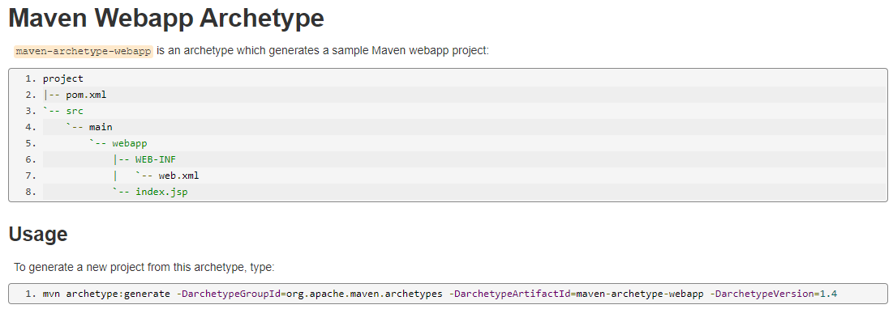
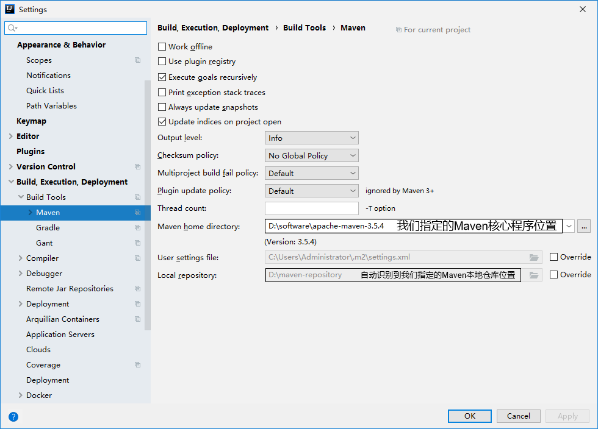

# 一、概述

## 1、为什么学Maven？

### Ⅰ：依赖的管理（jar包）：

​	I：**简化**依赖数量

​	Ⅱ：**辅助管理**依赖之间的关系

​	Ⅲ：**方便拿取**依赖

### Ⅱ：构建的管理：

> 构建：编译→打包→部署→上线


​	对于**庞大的jar包的管理**，和对**脱离本地环境之后的构建需求**，都使我们需要Maven

## 2、Maven作用？

​	是 Apache 软件基金会维护的专门为 java 项目提供**构建** 和 **依赖管理** 支持的工具。

### Ⅰ：构建详解

​	构建指的是使用【**原材料生产产品**】的过程

构建的主要环节有：

- 清理：删除上一次构建的结果，为下一次构建做准备
- 编译：将 `.java` 的源文件编译成 `.class`的字节码文件
- 测试：运行提前准备好的测试程序
- 报告：针对刚才测试的结果生成一个全面的信息
- 打包
  - java工程：jar包
  - web工程：war包
- 安装：将一个Maven工程经过打包操作生成的jar包或war包存入到Maven仓库
- 部署：
  - jar包：部署到 Nexus 私服服务器
  - war包：借助相关Maven插件（例如：cargo），将war包部署到 Tomcat 服务器上

### Ⅱ：依赖：

​	简单解释：如果 A 工程里用到了 B 工程的类、接口、配置文件等等资源，那么就可以说 A 依赖 B。


依赖管理中要解决的具体问题有：

- 下载：Maven自动规范的从远程仓库下载到本地
- 包之间的依赖：通过依赖的传递性自动完成
- 包之间的冲突：对依赖的配置调整，让某些 jar 包不会被导入

### Ⅲ：Maven的工作机制


# 二、安装

> `tar.gz`是 Linux 平台的，`zip` 是 Windows 平台的

安装路径：非中文没有空格的路径

setting配置：

- 设置本地仓库：要求非中文没有空格

- 配置镜像仓库：

  - 先将原有的http://0.0.0.0/的示例注释掉，再加入自己的配置，当然也可不管

  - ```xml
    <mirrors>
    	<mirror>
    		<id>nexus-aliyun</id>
    		<mirrorof>central</mirrorof>
    		<name>Nexus aliyun</name>
    		<ur1>http://maven.aliyun.com/nexus/content/groups/public</ur1>
    	</mirror>
    </mirrors>
    ```

- 配置jdk版本

  - ```xml
    <profile>
    	  <id>jdk-1.8</id>
    	  <activation>
    		<activeByDefault>true</activeByDefault>
    		<jdk>1.8</jdk>
    	  </activation>
    	  <properties>
    		<maven.compiler.source>1.8</maven.compiler.source>
    		<maven.compiler.target>1.8</maven.compiler.target>
    		<maven.compiler.compilerVersion>1.8</maven.compiler.compilerVersion>
    	  </properties>
    	</profile>
    ```

  - > Maven 默认JDK是1.5，我比较熟的是1.8，所以也配一下

- 配置环境变量

# 三、常用命令（命令行环境）

## 1、坐标概念

### [1]、向量

使用三个【**向量**】在【**Maven仓库**】中**唯一的定位**到一个【**jar**】包

- **groupld**：公司或组织的id
- **artifactld**：一个项目或是项目中的一个模块的id
- **version**：版本号

### [2]、向量取值方式

- groupld：公司或组织域名的倒序，通常也会加上项目名称
  - 例如：com.atguigu.maven，正序就是：maven.atguigu.com
- artifactld:模块的名称，将来作为 Maven 工程的工程名
- version：版本号，根据需求定
  - 例如：SNAPSHOT表示快照版本，正在迭代过程中，不稳定的版本
  - RELEASE表示正式版本

### [3]、坐标与仓库中jar包的路径的对应关系

例如：坐标如下

```xml
<groupId>javax.servlet</groupId>
  <artifactId>servlet-api</artifactId>
  <version>2.5</version>
```

这个坐标对应的jar包的路径为：

```
Maven本地仓库根目录\javax\servlet\servlet-api\2.5\servlet-api-2.5.jar
```


## 2、实验一

### （1）、准备阶段

#### [1]、准备操作空间

#### [2]、打开cmd，切换至准备好的操作空间目录下

#### [3]、准备生成 Maven 项目

指令：`mvn archetype:generate`

- 解释：
  - `mvn`是主命令
  - `archetype`中文`原型`，是一个插件
  - `generate`中文`生成`，是一个目标

```
# 创建工程时 archetype 插件有不同的模式可以选择，下面列出来的都是不同的创建模式

[INFO] No archetype defined. Using maven-archetype-quickstart (org.apache.maven.archetypes:maven-archetype-quickstart:1.0)Choose archetype:

1: internal -> org.apache.maven.archetypes:maven-archetype-archetype (An archetype which contains a sample archetype.)

2: internal -> org.apache.maven.archetypes:maven-archetype-j2ee-simple (An archetype which contains a simplifed sample J2EE application.)

3: internal -> org.apache.maven.archetypes:maven-archetype-plugin (An archetype which contains a sample Maven plugin.)

4: internal -> org.apache.maven.archetypes:maven-archetype-plugin-site (An archetype which contains a sample Maven plugin site.
      This archetype can be layered upon an existing Maven plugin project.)
      
5: internal -> org.apache.maven.archetypes:maven-archetype-portlet (An archetype which contains a sample JSR-268 Portlet.)

6: internal -> org.apache.maven.archetypes:maven-archetype-profiles ()

7: internal -> org.apache.maven.archetypes:maven-archetype-quickstart (An archetype which contains a sample Maven project.)

8: internal -> org.apache.maven.archetypes:maven-archetype-site (An archetype which contains a sample Maven site which demonstrates
      some of the supported document types like APT, XDoc, and FML and demonstrates how
      to i18n your site. This archetype can be layered upon an existing Maven project.)
      
9: internal -> org.apache.maven.archetypes:maven-archetype-site-simple (An archetype which contains a sample Maven site.)

10: internal -> org.apache.maven.archetypes:maven-archetype-webapp (An archetype which contains a sample Maven Webapp project.)

# 默认选择7，快速开始模式，这个可以不用管，直接回车放行即可
Choose a number or apply filter (format: [groupId:]artifactId, case sensitive contains): 7:

# 再下完一堆东西之后，到达指定 groupId 的步骤

Define value for property 'groupId':

# 指定完 groupId 之后，再开始指定模块名称
Define value for property 'artifactId':

#指定完模块名称之后，开始指定版本信息 
Define value for property 'version' 1.0-SNAPSHOT: :

#指定完版本信息后，开始指定包名，默认不管，直接下一步
Define value for property 'package' com.atguigu.maven: :

# 最终环节，确认信息无误，无误输入 y 下一步，有误输入 n 重新填写
Confirm properties configuration:
groupId: com.atguigu.maven
artifactId: pro01-maven
version: 1.0-SNAPSHOT
package: com.atguigu.maven
 Y: : 
 
 
# 构建信息
[INFO] ----------------------------------------------------------------------------
[INFO] Using following parameters for creating project from Old (1.x) Archetype: maven-archetype-quickstart:1.1
[INFO] ----------------------------------------------------------------------------
[INFO] Parameter: basedir, Value: D:\Environment\Maven\Maven_Test\space001
[INFO] Parameter: package, Value: com.atguigu.maven
[INFO] Parameter: groupId, Value: com.atguigu.maven
[INFO] Parameter: artifactId, Value: pro01-maven-java
[INFO] Parameter: packageName, Value: com.atguigu.maven
[INFO] Parameter: version, Value: 1.0-SNAPSHOT
[INFO] project created from Old (1.x) Archetype in dir: D:\Environment\Maven\Maven_Test\space001\pro01-maven-java
[INFO] ------------------------------------------------------------------------
# 这里有两种情况，SUCCESS 是构建成功
[INFO] BUILD SUCCESS
[INFO] ------------------------------------------------------------------------
[INFO] Total time:  15:16 min
[INFO] Finished at: 2022-10-21T14:24:16+08:00
[INFO] ------------------------------------------------------------------------
```

#### [4]、对生成好的项目进行调整

##### Ⅰ：调整junit版本

> Maven 自动创建的项目依赖的 junit 版本比较低，是3.8.1，需要手动调整至更高的版本，再 pom 文件中调整

```pom
<dependencies>
    <dependency>
      <groupId>junit</groupId>
      <artifactId>junit</artifactId>
      <version>4.12</version>
      <scope>test</scope>
    </dependency>
  </dependencies>
```

##### Ⅱ、对不需要的文件的删除

> Maven 自动创建的项目会自动帮我们创建好两个测试类，分别是 `AppTest.java` 和 `App.java`，我们不需要这两个文件，所以需要进行删除操作

#### [5]、pom文件的解读

```xml

<!-- project 标签：根标签，表示对当前项目进行管理和配置 -->

<project xmlns="http://maven.apache.org/POM/4.0.0" xmlns:xsi="http://www.w3.org/2001/XMLSchema-instance"
  xsi:schemaLocation="http://maven.apache.org/POM/4.0.0 http://maven.apache.org/xsd/maven-4.0.0.xsd">
    
<!-- modelVersion 标签：结构标签，表示当前 pom.xml 所采用的标签结构，从 Maven 2 开始就固定是 4.0.0 -->
  <modelVersion>4.0.0</modelVersion>

<!-- g. a. v. 标签：向量标签，g.表示当前项目的组织，a.表示某一个模块，v.表示当前模块版本 -->
  <groupId>com.atguigu.maven</groupId>
  <artifactId>pro01-maven-java</artifactId>
  <version>1.0-SNAPSHOT</version>
<!-- packaging 标签：打包方式，分三种：
 					jar包，表示java程序
					war包，表示web程序
					pom包，表示管理其他工程的工程-->
  <packaging>jar</packaging>
	
  <!-- name 标签：当前模块名称 -->
  <name>pro01-maven-java</name>
  <!-- url 标签：maven链接地址-->
  <url>http://maven.apache.org</url>

   
  <properties>
      <!-- propertie 标签：工程构建过程中，读取源码时使用的字符集-->
    <project.build.sourceEncoding>UTF-8</project.build.sourceEncoding>
  </properties>
	
   <!-- dependencies 标签：当前工程所依赖的jar包 -->
  <dependencies>
    <!-- dependency 标签：在dependency标签内使用具体的坐标依赖我们需要的一个jar包 -->
    <dependency>
      <groupId>junit</groupId>
      <artifactId>junit</artifactId>
      <version>4.12</version>
        
        <!-- scope 标签：配置依赖范围-->
      <scope>test</scope>
    </dependency>
  </dependencies>
</project>

```

总结：

|            标签            |                             作用                             |
| :------------------------: | :----------------------------------------------------------: |
|          project           |             根标签，表示对当前项目进行管理和配置             |
|        modelVersion        | 结构标签，表示当前 pom.xml 所采用的标签结构，从 Maven 2 开始就固定是 4.0.0 |
|         packaging          | 打包方式，分三种：<br>jar包，表示java工程<br>war包，表示web工程<br/>pom包，表示管理其他工程的工程 |
|            name            |                         当前模块名称                         |
|            url             |                        maven链接地址                         |
|         propertie          |            工程构建过程中，读取源码时使用的字符集            |
|        dependencies        |                    当前工程所依赖的jar包                     |
|         dependency         |          使用具体的坐标依赖表示我们需要的一个jar包           |
|           scope            |                         配置依赖范围                         |
| groupId,artifactId,version |          gav,表示具体的坐标信息，组织，模块名，版本          |

## 3、核心概念：POM

### [1]、含义

POM：**P**roject **O**bject **M**odel，**项目对象模型**。和 POM 类似的是：DOM（Document Object Model），文档对象模型。它们都是**模型化思想**的具体体现。

### [2]、模型化思想

POM 表示**将工程抽象为一个模型**，再**用程序中的对象来描述这个模型**。这样我们**就可以用程序来管理项目了**。我们在开发过程中，最基本的做法就是将现实生活中的事物抽象为模型，然后封装模型相关的数据作为一个对象，这样就可以在程序中计算与现实事物相关的数据。

### [3]、对应的配置文件

POM 理念集中体现在 Maven 工程根目录下 **pom.xml** 这个配置文件中。所以这个 pom.xml 配置文件就是 Maven 工程的核心配置文件。其实学习 Maven 就是学这个文件怎么配置，各个配置有什么用。


## 4、核心概念：约定的目录结构

### [1]、各个目录的作用


另外还有一个 target 目录专门存放构建操作输出的结果。

### [2]、约定目录结构的意义

Maven 为了让构建过程能够尽可能自动化完成，所以必须约定目录结构的作用。例如：Maven 执行编译操作，必须先去 Java 源程序目录读取 Java 源代码，然后执行编译，最后把编译结果存放在 target 目录。

### [3]、约定大于配置

Maven 对于目录结构这个问题，没有采用配置的方式，而是基于约定。这样会让我们在开发过程中非常方便。如果每次创建 Maven 工程后，还需要针对各个目录的位置进行详细的配置，那肯定非常麻烦。

目前开发领域的技术发展趋势就是：约定大于配置，配置大于编码。

## 5、实验2-写代码

### [1]、准备阶段

#### Ⅰ：准备好主体程序

主体程序指的是被测试的程序，同时也是将来在项目中真正要使用的程序。存放在 main 路径下的 maven 包中。

#### Ⅱ：准备好测试程序

存放在 test 目录下的 maven 包中。

### [2]、执行 maven 构建命令

#### Ⅰ：要求

运行 Maven 中和构建操作相关的命令时，必须进入到 pom.xml 所在的目录。如果没有在 pom.xml 所在的目录运行 Maven 的构建命令，那么会看到下面的错误信息：

```java
The goal you specified requires a project to execute but there is no POM in this directory
```

> TIP
>
> mvn -v 命令和构建操作无关，只要正确配置了 PATH，在任何目录下执行都可以。而构建相关的命令要在 pom.xml 所在目录下运行——操作哪个工程，就进入这个工程的 pom.xml 目录。

#### Ⅱ：清理操作

`mvn clean`

效果：删除 target 目录

#### Ⅲ：编译操作

主程序编译：`mvn compile`

测试程序编译：`mvn test-compile`

主体程序编译结果存放的目录：`target/classes`

测试程序编译结果存放的目录：`target/test-classes`

#### Ⅳ：测试操作

`mvn test`

测试的报告存放的目录：`target/surefire-reports`

#### Ⅴ：打包操作

`mvn package`

打包的结果——jar 包，存放的目录：`target`

#### Ⅵ：安装操作

`mvn install`

```
[INFO] Installing D:\maven-workspace\space201026\pro01-maven-java\target\pro01-maven-java-1.0-SNAPSHOT.jar to D:\maven-rep1026\com\atguigu\maven\pro01-maven-java\1.0-SNAPSHOT\pro01-maven-java-1.0-SNAPSHOT.jar
[INFO] Installing D:\maven-workspace\space201026\pro01-maven-java\pom.xml to D:\maven-rep1026\com\atguigu\maven\pro01-maven-java\1.0-SNAPSHOT\pro01-maven-java-1.0-SNAPSHOT.pom
```

安装的效果是将本地构建过程中生成的 jar 包存入 Maven 本地仓库。这个 jar 包在 Maven 仓库中的路径是根据它的坐标生成的。

坐标信息如下：

```xml
<groupId>com.atguigu.maven</groupId>
  <artifactId>pro01-maven-java</artifactId>
  <version>1.0-SNAPSHOT</version>
```

在 Maven 仓库中生成的路径如下：

```log
D:\maven-rep1026\com\atguigu\maven\pro01-maven-java\1.0-SNAPSHOT\pro01-maven-java-1.0-SNAPSHOT.jar
```

另外，安装操作还会将 pom.xml 文件转换为 XXX.pom 文件一起存入本地仓库。所以我们在 Maven 的本地仓库中想看一个 jar 包原始的 pom.xml 文件时，查看对应 XXX.pom 文件即可，它们是名字发生了改变，本质上是同一个文件。

## 6、实验3-web程序

### [1]、说明

使用 mvn archetype:generate 命令生成 Web 工程时，需要使用一个专门的 archetype。这个专门生成 Web 工程骨架的 archetype 可以参照官网看到它的用法：



参数 archetypeGroupId、archetypeArtifactId、archetypeVersion 用来指定现在使用的 maven-archetype-webapp 的坐标。

### [2]、操作

注意：如果在上一个工程的目录下执行 mvn archetype:generate 命令，那么 Maven 会报错：不能在一个非 pom 的工程下再创建其他工程。所以不要再刚才创建的工程里再创建新的工程，**请回到工作空间根目录**来操作。

然后运行生成工程的命令：

```log
mvn archetype:generate -DarchetypeGroupId=org.apache.maven.archetypes -DarchetypeArtifactId=maven-archetype-webapp -DarchetypeVersion=1.4
```

下面的操作按照提示执行：

> TIP
>
> Define value for property 'groupId': com.atguigu.maven Define value for property 'artifactId': pro02-maven-web Define value for property 'version' 1.0-SNAPSHOT: :【直接回车，使用默认值】
>
> Define value for property 'package' com.atguigu.maven: :【直接回车，使用默认值】 Confirm properties configuration: groupId: com.atguigu.maven artifactId: pro02-maven-web version: 1.0-SNAPSHOT package: com.atguigu.maven Y: :【直接回车，表示确认】

### [3]、生成的pom.xml

确认打包的方式是war包形式

```xml
<packaging>war</packaging>
```

### [4]、生成的Web工程的目录结构


webapp 目录下有 index.jsp

WEB-INF 目录下有 web.xml

### [5]、创建 Servlet

#### Ⅰ：在 main 目录下创建 java 目录


#### Ⅱ：在 java 目录下创建 Servlet 类所在的包的目录


#### Ⅲ：在包下创建 Servlet 类

```java
package com.atguigu.maven;
	
import javax.servlet.http.HttpServlet;
import javax.servlet.http.HttpServletRequest;
import javax.servlet.http.HttpServletResponse;
import javax.servlet.ServletException;
import java.io.IOException;
	
public class HelloServlet extends HttpServlet{
	
	protected void doGet(HttpServletRequest request, HttpServletResponse response) throws ServletException, IOException {
		
		response.getWriter().write("hello maven web");
		
	}
	
}
```


#### Ⅳ：在 web.xml 中注册 Servlet

```xml
 <servlet>
	<servlet-name>helloServlet</servlet-name>
	<servlet-class>com.atguigu.maven.HelloServlet</servlet-class>
  </servlet>
  <servlet-mapping>
	<servlet-name>helloServlet</servlet-name>
	<url-pattern>/helloServlet</url-pattern>
  </servlet-mapping>
```


### [6]、在 index.jsp 页面编写超链接

```html
<html>
<body>
<h2>Hello World!</h2>
<a href="helloServlet">Access Servlet</a>
</body>
</html>
```

> TIP
>
> JSP全称是 Java Server Page，和 Thymeleaf 一样，是服务器端页面渲染技术。这里我们不必关心 JSP 语法细节，编写一个超链接标签即可。

### [7]、编译

此时直接执行 mvn compile 命令出错：

> DANGER
>
> 程序包 javax.servlet.http 不存在
>
> 程序包 javax.servlet 不存在
>
> 找不到符号
>
> 符号: 类 HttpServlet
>
> ……

上面的错误信息说明：我们的 Web 工程用到了 HttpServlet 这个类，而 HttpServlet 这个类属于 servlet-api.jar 这个 jar 包。此时我们说，Web 工程需要依赖 servlet-api.jar 包。


### [8]、配置对 servlet-api.jar 包的依赖

对于不知道详细信息的依赖可以到 https://mvnrepository.com/ 网站查询。使用关键词搜索，然后在搜索结果列表中选择适合的使用。


比如，我们找到的 servlet-api 的依赖信息：

```xml
<!-- https://mvnrepository.com/artifact/javax.servlet/javax.servlet-api -->
<dependency>
    <groupId>javax.servlet</groupId>
    <artifactId>javax.servlet-api</artifactId>
    <version>3.1.0</version>
    <scope>provided</scope>
</dependency>
```

这样就可以把上面的信息加入 pom.xml。重新执行 mvn compile 命令。

### [9]、将 Web 工程打包为 war 包

运行 mvn package 命令，生成 war 包的位置如下图所示：


### [10]、将 war 包部署到 Tomcat 上运行

将 war 包复制到 Tomcat/webapps 目录下


通过浏览器尝试访问：http://localhost:8080/pro02-maven-web/index.jsp

## 7、实验4-web工程依赖java工程

### [1]、观念

明确一个意识：从来只有 Web 工程依赖 Java 工程，没有反过来 Java 工程依赖 Web 工程。本质上来说，Web 工程依赖的 Java 工程其实就是 Web 工程里导入的 jar 包。最终 Java 工程会变成 jar 包，放在 Web 工程的 WEB-INF/lib 目录下。

### [2]、操作

在 pro02-maven-web 工程的 pom.xml 中，找到 dependencies 标签，在 dependencies 标签中做如下配置：

```xml
<!-- 配置对Java工程pro01-maven-java的依赖 -->
<!-- 具体的配置方式：在dependency标签内使用坐标实现依赖 -->
<dependency>
	<groupId>com.atguigu.maven</groupId>
	<artifactId>pro01-maven-java</artifactId>
	<version>1.0-SNAPSHOT</version>
</dependency>
```

### [3]、在 Web 工程中，编写测试代码

#### Ⅰ：补充创建目录

pro02-maven-web**\src\test\java\com\atguigu\maven**

#### Ⅱ：确认 Web 工程依赖了 junit

```xml
   <dependency>
      <groupId>junit</groupId>
      <artifactId>junit</artifactId>
      <version>4.12</version>
      <scope>test</scope>
    </dependency>
```

#### Ⅲ：创建测试类

把 Java 工程的 CalculatorTest.java 类复制到 pro02-maven-wb**\src\test\java\com\atguigu\maven** 目录下

### [4]、创建测试类

#### Ⅰ：测试命令

`mvn test`

说明：测试操作中会提前自动执行编译操作，测试成功就说明编译也是成功的。

#### Ⅱ：打包命令

`mvn package`


通过查看 war 包内的结构，我们看到被 Web 工程依赖的 Java 工程确实是会变成 Web 工程的 WEB-INF/lib 目录下的 jar 包。


#### Ⅲ：查看当前 Web 工程所依赖的 jar 包的列表

`mvn dependency:list`

> TIP
>
> [INFO] The following files have been resolved:
> [INFO] org.hamcrest:hamcrest-core:jar:1.3:test
> [INFO] javax.servlet:javax.servlet-api:jar:3.1.0:provided
> [INFO] com.atguigu.maven:pro01-maven-java:jar:1.0-SNAPSHOT:compile
> [INFO] junit:junit:jar:4.12:test

说明：javax.servlet:javax.servlet-api:jar:3.1.0:provided 格式显示的是一个 jar 包的坐标信息。格式是：

> TIP
>
> groupId:artifactId:打包方式:version:依赖的范围

这样的格式虽然和我们 XML 配置文件中坐标的格式不同，但是本质上还是坐标信息，大家需要能够认识这样的格式，将来从 Maven 命令的日志或错误信息中看到这样格式的信息，就能够识别出来这是坐标。进而根据坐标到Maven 仓库找到对应的jar包，用这样的方式解决我们遇到的报错的情况。

#### Ⅳ：以树形结构查看当前 Web 工程的依赖信息

`mvn dependency:tree`

> TIP
>
> [INFO] com.atguigu.maven:pro02-maven-web:war:1.0-SNAPSHOT
> [INFO] +- junit:junit:jar:4.12:test
> [INFO] | \- org.hamcrest:hamcrest-core:jar:1.3:test
> [INFO] +- javax.servlet:javax.servlet-api:jar:3.1.0:provided
> [INFO] \- com.atguigu.maven:pro01-maven-java:jar:1.0-SNAPSHOT:compile

我们在 pom.xml 中并没有依赖 hamcrest-core，但是它却被加入了我们依赖的列表。原因是：junit 依赖了hamcrest-core，然后基于依赖的传递性，hamcrest-core 被传递到我们的工程了。

## 8、实验5-测试依赖范围

### [1]、依赖范围

标签的位置：dependencies/dependency/**scope**

标签的可选值：**compile**/**test**/**provided**/system/runtime/**import**

#### Ⅰ：compile 和 test 对比

|         | main目录（空间） | test目录（空间） | 开发过程（时间） | 部署到服务器（时间） |
| ------- | ---------------- | ---------------- | ---------------- | -------------------- |
| compile | 有效             | 有效             | 有效             | 有效                 |
| test    | 无效             | 有效             | 有效             | 无效                 |

#### Ⅱ：compile 和 provided 对比

|          | main目录（空间） | test目录（空间） | 开发过程（时间） | 部署到服务器（时间） |
| -------- | ---------------- | ---------------- | ---------------- | -------------------- |
| compile  | 有效             | 有效             | 有效             | 有效                 |
| provided | 有效             | 有效             | 有效             | 无效                 |

#### Ⅲ：结论

**compile**：通常使用的第三方框架的 jar 包这样在项目实际运行时真正要用到的 jar 包都是以 compile 范围进行依赖的。比如 SSM 框架所需jar包。

**test**：测试过程中使用的 jar 包，以 test 范围依赖进来。比如 junit。

**provided**：在开发过程中需要用到的“服务器上的 jar 包”通常以 provided 范围依赖进来。比如 servlet-api、jsp-api。而这个范围的 jar 包之所以不参与部署、不放进 war 包，就是避免和服务器上已有的同类 jar 包产生冲突，同时减轻服务器的负担。说白了就是：“**服务器上已经有了，你就别带啦！**”

### [2]、测试

#### Ⅰ：验证 compile 范围对 main 目录有效

> TIP
>
> main目录下的类：HelloServlet 使用compile范围导入的依赖：pro01-atguigu-maven
>
> 验证：使用compile范围导入的依赖对main目录下的类来说是有效的
>
> 有效：HelloServlet 能够使用 pro01-atguigu-maven 工程中的 Calculator 类
>
> 验证方式：在 HelloServlet 类中导入 Calculator 类，然后编译就说明有效。

#### Ⅱ：验证test范围对main目录无效

测试方式：在主体程序中导入 org.junit.Test 这个注解，然后执行编译。

具体操作：在 pro01-maven-java\src\main\java\com\atguigu\maven 目录下修改 Calculator.java

```java
package com.atguigu.maven;

import org.junit.Test;

public class Calculator {
	
	public int sum(int i, int j){
		return i + j;
	}
	
}
```

执行Maven编译命令：

```java
[ERROR] /D:/maven-workspace/space201026/pro01-maven-java/src/main/java/com/atguigu/maven/Calculator.java:[3,17] 程序包org.junit不存在
```

#### Ⅲ：验证test和provided范围不参与服务器部署

其实就是验证：通过compile范围依赖的jar包会放入war包，通过test范围依赖的jar包不会放入war包。


#### Ⅳ：验证provided范围对测试程序有效

测试方式是在pro02-maven-web的测试程序中加入servlet-api.jar包中的类。

修改：**pro02-maven-web**\src\ **test** \java\com\atguigu\maven\ **CalculatorTest.java**

```java
package com.atguigu.maven;

import javax.servlet.http.HttpServlet;
import javax.servlet.http.HttpServletRequest;
import javax.servlet.http.HttpServletResponse;
import javax.servlet.ServletException;

import org.junit.Test;
import com.atguigu.maven.Calculator;

// 静态导入的效果是将Assert类中的静态资源导入当前类
// 这样一来，在当前类中就可以直接使用Assert类中的静态资源，不需要写类名
import static org.junit.Assert.*;

public class CalculatorTest{
	
	@Test
	public void testSum(){
		
		// 1.创建Calculator对象
		Calculator calculator = new Calculator();
		
		// 2.调用Calculator对象的方法，获取到程序运行实际的结果
		int actualResult = calculator.sum(5, 3);
		
		// 3.声明一个变量，表示程序运行期待的结果
		int expectedResult = 8;
		
		// 4.使用断言来判断实际结果和期待结果是否一致
		// 如果一致：测试通过，不会抛出异常
		// 如果不一致：抛出异常，测试失败
		assertEquals(expectedResult, actualResult);
		
	}
	
}
```

然后运行Maven的编译命令：mvn compile

然后看到编译成功。

## 9、实验6-测试依赖的传递性

### [1]、依赖的传递性

#### Ⅰ：概念

A 依赖 B，B 依赖 C，那么在 A 没有配置对 C 的依赖的情况下，A 里面能不能直接使用 C？

#### Ⅱ：传递的原则

在 A 依赖 B，B 依赖 C 的前提下，C 是否能够传递到 A，**取决于** B 依赖 C 时使用的**依赖范围**。

- B 依赖 C 时使用 **compile** 范围：**可以传递**
- B 依赖 C 时使用 **test** 或 **provided** 范围：**不能传递**，所以需要这样的 jar 包时，就必须在需要的地方明确配置依赖才可以。

### [2]、使用 compile 范围依赖 spring-core

测试方式：让 pro01-maven-java 工程依赖 spring-core

具体操作：编辑 pro01-maven-java 工程根目录下 pom.xml;

```xml
<!-- https://mvnrepository.com/artifact/org.springframework/spring-core -->
<dependency>
	<groupId>org.springframework</groupId>
	<artifactId>spring-core</artifactId>
	<version>4.0.0.RELEASE</version>
</dependency>
```

使用 mvn dependency:tree 命令查看效果：

> TIP
>
> [INFO] com.atguigu.maven:pro01-maven-java:jar:1.0-SNAPSHOT
> [INFO] +- junit:junit:jar:4.12:test
> [INFO] | \- org.hamcrest:hamcrest-core:jar:1.3:test
> [INFO] \- org.springframework:spring-core:jar:4.0.0.RELEASE:compile
> [INFO] \- commons-logging:commons-logging:jar:1.1.1:compile

还可以在 Web 工程中，使用 mvn dependency:tree 命令查看效果（需要重新将 pro01-maven-java 安装到仓库）：

> TIP
>
> [INFO] com.atguigu.maven:pro02-maven-web:war:1.0-SNAPSHOT
> [INFO] +- junit:junit:jar:4.12:test
> [INFO] | \- org.hamcrest:hamcrest-core:jar:1.3:test
> [INFO] +- javax.servlet:javax.servlet-api:jar:3.1.0:provided
> [INFO] \- com.atguigu.maven:pro01-maven-java:jar:1.0-SNAPSHOT:compile
> [INFO] \- org.springframework:spring-core:jar:4.0.0.RELEASE:compile
> [INFO] \- commons-logging:commons-logging:jar:1.1.1:compile

### [3]、验证 test 和 provided 范围不能传递

从上面的例子已经能够看到，pro01-maven-java 依赖了 junit，但是在 pro02-maven-web 工程中查看依赖树的时候并没有看到 junit。

要验证 provided 范围不能传递，可以在 pro01-maven-java 工程中加入 servlet-api 的依赖。

```xml
<dependency>
	<groupId>javax.servlet</groupId>
	<artifactId>javax.servlet-api</artifactId>
	<version>3.1.0</version>
	<scope>provided</scope>
</dependency>
```

效果还是和之前一样：

> TIP
>
> [INFO] com.atguigu.maven:pro02-maven-web:war:1.0-SNAPSHOT
> [INFO] +- junit:junit:jar:4.12:test
> [INFO] | \- org.hamcrest:hamcrest-core:jar:1.3:test
> [INFO] +- javax.servlet:javax.servlet-api:jar:3.1.0:provided
> [INFO] \- com.atguigu.maven:pro01-maven-java:jar:1.0-SNAPSHOT:compile
> [INFO] \- org.springframework:spring-core:jar:4.0.0.RELEASE:compile
> [INFO] \- commons-logging:commons-logging:jar:1.1.1:compile

## 10、实验7-测试依赖的排除

### [1]、概念

当 A 依赖 B，B 依赖 C 而且 C 可以传递到 A 的时候，A 不想要 C，需要在 A 里面把 C 排除掉。而往往这种情况都是为了避免 jar 包之间的冲突。


所以配置依赖的排除其实就是阻止某些 jar 包的传递。因为这样的 jar 包传递过来会和其他 jar 包冲突。

### [2]、配置方式

```xml
<dependency>
	<groupId>com.atguigu.maven</groupId>
	<artifactId>pro01-maven-java</artifactId>
	<version>1.0-SNAPSHOT</version>
	<scope>compile</scope>
	<!-- 使用excludes标签配置依赖的排除	-->
	<exclusions>
		<!-- 在exclude标签中配置一个具体的排除 -->
		<exclusion>
			<!-- 指定要排除的依赖的坐标（不需要写version） -->
			<groupId>commons-logging</groupId>
			<artifactId>commons-logging</artifactId>
		</exclusion>
	</exclusions>
</dependency>
```

### [3]、测试

测试的方式：在 pro02-maven-web 工程中配置对 commons-logging 的排除

```xml
<dependency>
	<groupId>com.atguigu.maven</groupId>
	<artifactId>pro01-maven-java</artifactId>
	<version>1.0-SNAPSHOT</version>
	<scope>compile</scope>
	<!-- 使用excludes标签配置依赖的排除	-->
	<exclusions>
		<!-- 在exclude标签中配置一个具体的排除 -->
		<exclusion>
			<!-- 指定要排除的依赖的坐标（不需要写version） -->
			<groupId>commons-logging</groupId>
			<artifactId>commons-logging</artifactId>
		</exclusion>
	</exclusions>
</dependency>
```

运行 mvn dependency:tree 命令查看效果：

> TIP
>
> [INFO] com.atguigu.maven:pro02-maven-web:war:1.0-SNAPSHOT
> [INFO] +- junit:junit:jar:4.12:test
> [INFO] | \- org.hamcrest:hamcrest-core:jar:1.3:test
> [INFO] +- javax.servlet:javax.servlet-api:jar:3.1.0:provided
> [INFO] \- com.atguigu.maven:pro01-maven-java:jar:1.0-SNAPSHOT:compile
> [INFO] \- org.springframework:spring-core:jar:4.0.0.RELEASE:compile

发现在 spring-core 下面就没有 commons-logging 了。

总结：

```xml
<!-- 使用excludes标签配置依赖的排除	-->
	<exclusions>
		<!-- 在exclude标签中配置一个具体的排除 -->
		<exclusion>
			<!-- 指定要排除的依赖的坐标（不需要写version） -->
            </exclusion>
	</exclusions>
```

## 11、实验8：继承

### [1]、概念

Maven工程之间，A 工程继承 B 工程

- B 工程：父工程
- A 工程：子工程

本质上是 A 工程的 pom.xml 中的配置继承了 B 工程中 pom.xml 的配置。

### [2]、作用

在父工程中统一管理项目中的依赖信息，具体来说是管理依赖信息的版本。

它的背景是：

- 对一个比较大型的项目进行了模块拆分。
- 一个 project 下面，创建了很多个 module。
- 每一个 module 都需要配置自己的依赖信息。

它背后的需求是：

- 在每一个 module 中各自维护各自的依赖信息很容易发生出入，不易统一管理。
- 使用同一个框架内的不同 jar 包，它们应该是同一个版本，所以整个项目中使用的框架版本需要统一。
- 使用框架时所需要的 jar 包组合（或者说依赖信息组合）需要经过长期摸索和反复调试，最终确定一个可用组合。这个耗费很大精力总结出来的方案不应该在新的项目中重新摸索。

通过在父工程中为整个项目维护依赖信息的组合既**保证了整个项目使用规范、准确的 jar 包**；又能够将**以往的经验沉淀**下来，节约时间和精力。

### [3]、举例

在一个工程中依赖多个 Spring 的 jar 包

> TIP
>
> [INFO] +- org.springframework:**spring-core**:jar:**4.0.0**.RELEASE:compile
> [INFO] | \- commons-logging:commons-logging:jar:1.1.1:compile
> [INFO] +- org.springframework:**spring-beans**:jar:**4.0.0**.RELEASE:compile
> [INFO] +- org.springframework:**spring-context**:jar:**4.0.0**.RELEASE:compile
> [INFO] +- org.springframework:**spring-expression**:jar:4.0.0.RELEASE:compile
> [INFO] +- org.springframework:**spring-aop**:jar:**4.0.0**.RELEASE:compile
> [INFO] | \- aopalliance:aopalliance:jar:1.0:compile

使用 Spring 时要求所有 Spring 自己的 jar 包版本必须一致。为了能够对这些 jar 包的版本进行统一管理，我们使用继承这个机制，将所有版本信息统一在父工程中进行管理。

### [4]、操作

#### Ⅰ：创建父工程

创建的过程和前面创建 pro01-maven-java 一样。

工程名称：pro03-maven-parent

工程创建好之后，要修改它的打包方式：

```xml
 <groupId>com.atguigu.maven</groupId>
  <artifactId>pro03-maven-parent</artifactId>
  <version>1.0-SNAPSHOT</version>

  <!-- 当前工程作为父工程，它要去管理子工程，所以打包方式必须是 pom -->
  <packaging>pom</packaging>
```

只有打包方式为 pom 的 Maven 工程能够管理其他 Maven 工程。打包方式为 pom 的 Maven 工程中不写业务代码，它是专门管理其他 Maven 工程的工程。

#### Ⅱ：创建模块工程

模块工程类似于 IDEA 中的 module，所以需要**进入 pro03-maven-parent 工程的根目录**，然后运行 mvn archetype:generate 命令来创建模块工程。

假设，我们创建三个模块工程：


#### Ⅲ：查看被添加新内容的父工程 pom.xml

下面 modules 和 module 标签是聚合功能的配置

```	xml
<modules>  
	<module>pro04-maven-module</module>
	<module>pro05-maven-module</module>
	<module>pro06-maven-module</module>
</modules>
```

#### Ⅳ：解读子工程的pom.xml

```xml
<!-- 使用parent标签指定当前工程的父工程 -->
<parent>
	<!-- 父工程的坐标 -->
	<groupId>com.atguigu.maven</groupId>
	<artifactId>pro03-maven-parent</artifactId>
	<version>1.0-SNAPSHOT</version>
</parent>

<!-- 子工程的坐标 -->
<!-- 如果子工程坐标中的groupId和version与父工程一致，那么可以省略 -->
<!-- <groupId>com.atguigu.maven</groupId> -->
<artifactId>pro04-maven-module</artifactId>
<!-- <version>1.0-SNAPSHOT</version> -->
```

#### Ⅴ：在父工程中配置依赖的统一管理

```xml
<!-- 使用dependencyManagement标签配置对依赖的管理 -->
<!-- 被管理的依赖并没有真正被引入到工程 -->
<dependencyManagement>
	<dependencies>
		<dependency>
			<groupId>org.springframework</groupId>
			<artifactId>spring-core</artifactId>
			<version>4.0.0.RELEASE</version>
		</dependency>
		<dependency>
			<groupId>org.springframework</groupId>
			<artifactId>spring-beans</artifactId>
			<version>4.0.0.RELEASE</version>
		</dependency>
		<dependency>
			<groupId>org.springframework</groupId>
			<artifactId>spring-context</artifactId>
			<version>4.0.0.RELEASE</version>
		</dependency>
		<dependency>
			<groupId>org.springframework</groupId>
			<artifactId>spring-expression</artifactId>
			<version>4.0.0.RELEASE</version>
		</dependency>
		<dependency>
			<groupId>org.springframework</groupId>
			<artifactId>spring-aop</artifactId>
			<version>4.0.0.RELEASE</version>
		</dependency>
	</dependencies>
</dependencyManagement>
```

#### Ⅵ：子工程中引用那些被父工程管理的依赖

关键点：省略版本号

```xml
<!-- 子工程引用父工程中的依赖信息时，可以把版本号去掉。	-->
<!-- 把版本号去掉就表示子工程中这个依赖的版本由父工程决定。 -->
<!-- 具体来说是由父工程的dependencyManagement来决定。 -->
<dependencies>
	<dependency>
		<groupId>org.springframework</groupId>
		<artifactId>spring-core</artifactId>
	</dependency>
	<dependency>
		<groupId>org.springframework</groupId>
		<artifactId>spring-beans</artifactId>
	</dependency>
	<dependency>
		<groupId>org.springframework</groupId>
		<artifactId>spring-context</artifactId>
	</dependency>
	<dependency>
		<groupId>org.springframework</groupId>
		<artifactId>spring-expression</artifactId>
	</dependency>
	<dependency>
		<groupId>org.springframework</groupId>
		<artifactId>spring-aop</artifactId>
	</dependency>
</dependencies>
```

#### Ⅶ：在父工程中升级依赖信息的版本

```xml
……
			<dependency>
				<groupId>org.springframework</groupId>
				<artifactId>spring-beans</artifactId>
				<version>4.1.4.RELEASE</version>
			</dependency>
……
```

然后在子工程中运行mvn dependency:list，效果如下：

> TIP
>
> [INFO] org.springframework:spring-aop:jar:4.1.4.RELEASE:compile
> [INFO] org.springframework:spring-core:jar:4.1.4.RELEASE:compile
> [INFO] org.springframework:spring-context:jar:4.1.4.RELEASE:compile
> [INFO] org.springframework:spring-beans:jar:4.1.4.RELEASE:compile
> [INFO] org.springframework:spring-expression:jar:4.1.4.RELEASE:compile

#### Ⅷ：在父工程中声明自定义属性

```xml
<!-- 通过自定义属性，统一指定Spring的版本 -->
<properties>
	<project.build.sourceEncoding>UTF-8</project.build.sourceEncoding>
	
	<!-- 自定义标签，维护Spring版本数据 -->
	<atguigu.spring.version>4.3.6.RELEASE</atguigu.spring.version>
</properties>
```

在需要的地方使用${}的形式来引用自定义的属性名：

```xml
	<dependency>
				<groupId>org.springframework</groupId>
				<artifactId>spring-core</artifactId>
				<version>${atguigu.spring.version}</version>
			</dependency>
```

真正实现“一处修改，处处生效”。

### [5]、实际意义


编写一套符合要求、开发各种功能都能正常工作的依赖组合并不容易。如果公司里已经有人总结了成熟的组合方案，那么再开发新项目时，如果不使用原有的积累，而是重新摸索，会浪费大量的时间。为了提高效率，我们可以使用工程继承的机制，让成熟的依赖组合方案能够保留下来。

如上图所示，公司级的父工程中管理的就是成熟的依赖组合方案，各个新项目、子系统各取所需即可。

### [6]、总结

​	依赖统一管理的实现

#### Ⅰ：流程

1. 父工程的打包方式需要是 pom 
2. 新建模块需要在父工程的根目录下

#### Ⅱ：新增标签：

1. `<modules>` 和 `<module>` ：聚合功能的配置
2. `<parent>` 子工程 pom 独有标签：表示指定当前工程的父工程
3. `<dependencyManagement>` 标签：父工程独有，表示对依赖的统一管理

#### Ⅲ：细节

1. 父工程的打包方式必须是pom
2. 如果子工程坐标中的groupId和version与父工程一致，那么可以省略
3. 父工程管理的依赖并没有真正的引入到子工程中，仍需要子工程自行去配置，但是子工程可以省略配置版本号，由父工程来统一管理，也就是由`<dependencyManagement>`来管理
   - 如果子工程配置的依赖版本号与父工程不一致，那么子工程的依赖会覆盖掉父工程的依赖，子工程使用的依赖版本就会以子工程自身配置的版本号为主
4. 升级依赖版本时直接去父工程中的`<dependencyManagement>`标签内部修改即可，修改后会统一对所有子工程生效（自身有版本号配置的除外）
5. 父工程能在 `<properties>` 标签内自定义标签/属性，在需要的地方使用${}的形式来引用自定义的标签/属性名：

## 12、实验9-聚合

### [1]、聚合本身的含义

部分组成整体

### [2]、Maven 中的聚合

使用一个“总工程”将各个“模块工程”汇集起来，作为一个整体对应完整的项目。

- 项目：整体
- 模块：部分

> TIP
>
> 概念的对应关系：
>
> 从继承关系角度来看：
>
> - 父工程
> - 子工程
>
> 从聚合关系角度来看：
>
> - 总工程
> - 模块工程

### [3]、好处

- 一键执行 Maven 命令：很多构建命令都可以在“总工程”中一键执行。

  以 mvn install 命令为例：Maven 要求有父工程时先安装父工程；有依赖的工程时，先安装被依赖的工程。我们自己考虑这些规则会很麻烦。但是工程聚合之后，在总工程执行 mvn install 可以一键完成安装，而且会自动按照正确的顺序执行。

- 配置聚合之后，各个模块工程会在总工程中展示一个列表，让项目中的各个模块一目了然。

### [4]、聚合的配置

在总工程中配置 modules 即可:

```xml
	<modules>  
		<module>pro04-maven-module</module>
		<module>pro05-maven-module</module>
		<module>pro06-maven-module</module>
	</modules>
```

### [5]、依赖循环问题

如果 A 工程依赖 B 工程，B 工程依赖 C 工程，C 工程又反过来依赖 A 工程，那么在执行构建操作时会报下面的错误：

> DANGER
>
> [ERROR] [ERROR] The projects in the reactor contain a cyclic reference:

这个错误的含义是：循环引用。

# 四、IDEA环境

## 1、创建项目配置环境

跳过，已知。

## 2、IDEA环境执行Maven命令

### Ⅰ：IDEA图形指令


如果有需要，还可以给命令后面附加参数：

```sh
# -D 表示后面要附加命令的参数，字母 D 和后面的参数是紧挨着的，中间没有任何其它字符
# maven.test.skip=true 表示在执行命令的过程中跳过测试
mvn clean install -Dmaven.test.skip=true
```

### Ⅱ：IDEA命令行窗口指令


## 3、查看某个模块的依赖信息


## 4、工程导入

Maven工程除了自己创建的，还有很多情况是别人创建的。而为了参与开发或者是参考学习，我们都需要导入到 IDEA 中。下面我们分几种不同情况来说明：

### [1]、来自版本控制系统

目前我们通常使用的都是 Git（本地库） + 码云（远程库）的版本控制系统，结合 IDEA 的相关操作方式请点**这里** (opens new window)查看**克隆远程库**部分。

### [2]、来自工程目录

直接使用 IDEA 打开工程目录即可。下面咱们举个例子：

#### Ⅰ：工程压缩包

假设别人发给我们一个 Maven 工程的 zip 压缩包：maven-rest-demo.zip。从码云或GitHub上也可以以 ZIP 压缩格式对项目代码打包下载。

#### Ⅱ：解压

如果你的所有 IDEA 工程有一个专门的目录来存放，而不是散落各处，那么首先我们就把 ZIP 包解压到这个指定目录中。


#### Ⅲ：打开

只要我们确认在解压目录下可以直接看到 pom.xml，那就能证明这个解压目录就是我们的工程目录。那么接下来让 IDEA 打开这个目录就可以了。


#### Ⅳ：设置 Maven 核心程序位置

打开一个新的 Maven 工程，和新创建一个 Maven 工程是一样的，此时 IDEA 的 settings 配置中关于 Maven 仍然是默认值：


所以我们还是需要像新建 Maven 工程那样，指定一下 Maven 核心程序位置：



## 5、模块导入

### [1]、情景重现

在实际开发中，通常会忽略模块（也就是module）所在的项目（也就是project）仅仅导入某一个模块本身。这么做很可能是类似这样的情况：比如基于 Maven 学习 SSM 的时候，做练习需要导入老师发给我们的代码参考。


### [2]、导入 Java 类型模块

#### Ⅰ：找到老师发的工程目录


#### Ⅱ：复制我们想要导入的模块目录


#### Ⅲ：粘贴到我们自己工程目录下

这个工程（project）是我们事先在 IDEA 中创建好的。


#### Ⅳ：在 IDEA 中执行导入


#### Ⅴ：修改 pom.xml

刚刚导入的 module 的父工程坐标还是以前的，需要改成我们自己的 project。


#### Ⅵ：最终效果


### [3]、导入 Web 类型模块

其它操作和上面演示的都一样，只是多一步：删除多余的、不正确的 web.xml 设置。如下图所示：


# 五、其他核心概念

## 1、生命周期

### [1]、作用：

为了让构建过程自动化完成，Maven 设定了三个生命周期，生命周期中的每一个环节对应构建过程中的一个操作。

### [2]、三个生命周期

| 生命周期名称 |     作用     | 各个环节                                                     |
| :----------: | :----------: | :----------------------------------------------------------- |
|    Clean     | 清理操作相关 | pre-clean <br/>clean <br/>post-clean                         |
|     Site     | 生成站点相关 | pre-site <br/>site <br/>post-site <br/>deploy-site           |
|   Default    | 主要构建过程 | validate<br/>generate-sources<br/>process-sources<br/>generate-resources<br/>process-resources 复制并处理资源文件，至目标目录，准备打包。 <br/>compile 编译项目 main 目录下的源代码。 <br/>process-classes <br/>generate-test-sources <br/>process-test-sources <br/>generate-test-resources <br/>process-test-resources 复制并处理资源文件，至目标测试目录。 <br/>test-compile 编译测试源代码。 <br/>process-test-classes <br/>test 使用合适的单元测试框架运行测试。这些测试代码不会被打包或部署。 <br/>prepare-package <br/>package 接受编译好的代码，打包成可发布的格式，如JAR。 <br/>pre-integration-test <br/>integration-test <br/>post-integration-test <br/>verify <br/>install将包安装至本地仓库，以让其它项目依赖。 <br/>deploy将最终的包复制到远程的仓库，以让其它开发人员共享；或者部署到服务器上运行（需借助插件，例如：cargo）。 |

> 补充：Site 生成的站点是指，将开发者信息，项目信息等等基本信息抽取出来，生成一个静态网站，这个网站就专门存放这些基本信息。

### [3]、特点

- 前面三个生命周期彼此是独立的。
- **在任何一个生命周期内部，执行任何一个具体环节的操作，都是从本周期最初的位置开始执行，直到指定的地方**。（本节记住这句话就行了，其他的都不需要记）

Maven 之所以这么设计其实就是为了提高构建过程的自动化程度：让使用者只关心最终要干的即可，过程中的各个环节是自动执行的。

## 2、插件和目标

### [1]、插件

Maven 的核心程序仅仅负责宏观调度，不做具体工作。具体工作都是由 Maven 插件完成的。例如：编译就是由 maven-compiler-plugin-3.1.jar 插件来执行的。

### [2]、目标

**一个插件可以对应多个目标，而每一个目标都和生命周期中的某一个环节对应。**

Default 生命周期中有 compile 和 test-compile 两个和编译相关的环节，这两个环节对应 compile 和 test-compile 两个目标，而这两个目标都是由 maven-compiler-plugin-3.1.jar 插件来执行的。

## 3、仓库

- 本地仓库：在当前电脑上，为电脑上所有 Maven 工程服务
- 远程仓库：需要联网
  - 局域网：我们自己搭建的 Maven 私服，例如使用 Nexus 技术。
  - Internet
    - 中央仓库
    - 镜像仓库：内容和中央仓库保持一致，但是能够分担中央仓库的负载，同时让用户能够就近访问提高下载速度，例如：Nexus aliyun

建议：不要中央仓库和阿里云镜像混用，否则 jar 包来源不纯，彼此冲突。
