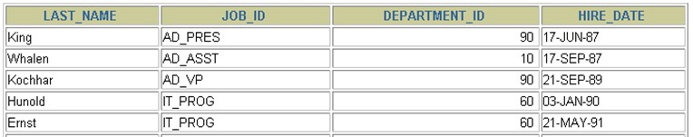
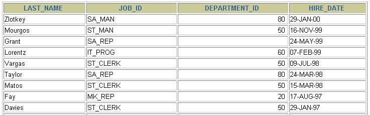
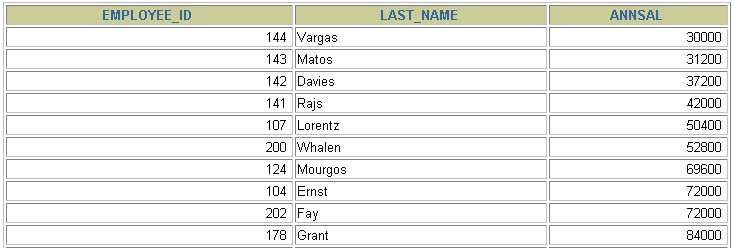
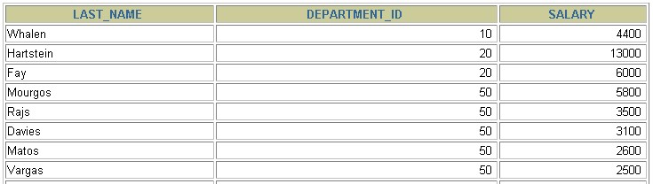

# 四、排序与分页

## 1、排序数据 

### 1.1 排序规则 

- 使用 ORDER BY 子句排序
  - **ASC（ascend）: 升序**
  - **DESC（descend）:降序 ORDER BY 子句在SELECT语句的结尾。**
- **ORDER BY 子句在 SELECT 语句的结尾**

### 1.2 单列排序 

```sql
SELECT  last_name, job_id, department_id, hire_date
FROM   employees
ORDER BY hire_date ;
```





```sql
SELECT  last_name, job_id, department_id, hire_date
FROM   employees
ORDER BY hire_date DESC ;
```





```sql
SELECT employee_id, last_name, salary*12 annsal
FROM  employees
ORDER BY annsal;
```





### 1.3 多列排序 

```sql
SELECT last_name, department_id, salary
FROM  employees
ORDER BY department_id, salary DESC;
# 或者
# ORDER BY department_id DESC, salary ASC;
# 表示首先以 department_id 字段进行降序排序，在 department_id 字段相同的情况下，对 salary 字段进行升序排序
```





- 可以使用不在 SELECT 列表中的列排序。
- 在对多列进行排序的时候，首先排序的第一列必须有相同的列值，才会对第二列进行排序。如果第一列数据中所有值都是唯一的，将不再对第二列进行排序。

**补充：列的别名问题**

> 列的别名只能在 ORDER BY 中使用，而不能在 WHERE 过滤中使用。

**原因：**

> SQL语句的执行顺序：
> 1、执行 FROM 语句，确认找那个表
>
> 2、执行 WHERE 语句，确认大概的搜索范围
>
> 3、执行 SELECT 语句，确认需要查询什么
>
> 4、ORDER BY 之类的其他语句
>
> 所以就有个格式：WHERE 语句需要在 FROM 之后，在 ORDER BY 之前。

因为 WHERE 的执行顺序高于 SELECT，所以在 SELECT 中起的别名在 WHERE 中是不能使用的，只有在执行顺序比 SELECT 低的语句中才能使用

**再补充：**

> ORDER BY 所进行排序的列可以不是 SELECT 语句中的查询内容
>
> 也就是，哪怕我 SELECT 语句不查，ORDER BY 也可以对单个的列进行排序，可以是 WHERE 语句中的列，也可以是其他


## 2、分页 

### 2.1 背景 

背景1：查询返回的记录太多了，查看起来很不方便，怎么样能够实现分页查询呢？

背景2：表里有 4 条数据，我们只想要显示第 2、3 条数据怎么办呢？

### 2.2 实现规则 

- 分页原理

  所谓分页显示，就是将数据库中的结果集，一段一段显示出来需要的条件。

- **MySQL中使用 LIMIT 实现分页**

- 格式：

```sql
LIMIT [位置偏移量,] 行数
```

第一个"位置偏移量"参数指示MySQL从哪一行开始显示，是一个可选参数，如果不指定"位置偏移量"，将会从表中的第一条记录开始（第一条记录的位置偏移量是0，第二条记录的位置偏移量是1，以此类推）；第二个参数"行数"指示返回的记录条数。

- 举例

```sql
--前10条记录：
SELECT * FROM 表名 LIMIT 0,10;
或者
SELECT * FROM 表名 LIMIT 10;

--第11至20条记录：
SELECT * FROM 表名 LIMIT 10,10;

--第21至30条记录：
SELECT * FROM 表名 LIMIT 20,10;
```

> MySQL 8.0中可以使用“LIMIT 3 OFFSET 4”，意思是获取从第5条记录开始后面的3条记录，和“LIMIT 4,3;”返回的结果相同。
>
> 也就是 OFFSET 表示 位置偏移量，LIMIT 就单纯的表示 要显示几条记录。

- 分页显式公式：**（当前页数-1）* 每页条数**
- 语法表现：LIMIT（当前页数-1）* 每页条数,每页条数

```sql
SELECT * FROM table
LIMIT(PageNo - 1)*PageSize,PageSize;
```

- **注意：LIMIT 子句必须放在整个SELECT语句的最后！**
- 使用 LIMIT 的好处
  - 约束返回结果的数量可以`减少数据表的网络传输量`，也可以`提升查询效率`。如果我们知道返回结果只有 1 条，就可以使用 `LIMIT 1` ，告诉 SELECT 语句只需要返回一条记录即可。这样的好处就是 SELECT 不需要扫描完整的表，只需要检索到一条符合条件的记录即可返回。

> 补充：位置偏移量为 0 的情况下，LIMIT 可以简写为 LIMIT 10，等价于 LIMIT 0,10;

> 声明顺序，在同时有 WHERE，ORDER BY，LIMIT的情况下，声明顺序最好为
>
> 1、WHERE最优先
>
> 2、其次 ORDER BY
>
> 3、LIMIT 垫底

### 2.3 拓展 

在不同的 DBMS 中使用的关键字可能不同。在 MySQL、PostgreSQL、MariaDB 和 SQLite 中使用 LIMIT 关键字，而且需要放到 SELECT 语句的最后面。

- 如果是 SQL Server 和 Access，需要使用 `TOP` 关键字，比如：

```sql
SELECT TOP 5 name, hp_max FROM heros ORDER BY hp_max DESC
```

- 如果是 DB2，使用 `FETCH FIRST 5 ROWS ONLY` 这样的关键字：

```sql
SELECT name, hp_max FROM heros ORDER BY hp_max DESC FETCH FIRST 5 ROWS ONLY
```

- 如果是 Oracle，你需要基于 `ROWNUM` 来统计行数：

```sql
SELECT rownum,last_name,salary FROM employees WHERE rownum < 5 ORDER BY salary DESC;
```

需要说明的是，这条语句是先取出来前 5 条数据行，然后再按照 hp_max 从高到低的顺序进行排序。但这样产生的结果和上述方法的并不一样。我会在后面讲到子查询，你可以使用：

```sql
SELECT rownum, last_name,salary
FROM (
  SELECT last_name,salary
  FROM employees
  ORDER BY salary DESC)
WHERE rownum < 10;
```

得到与上述方法一致的结果。
