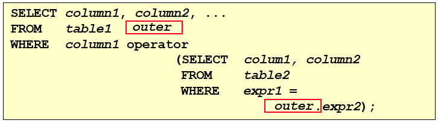

# 八、子查询

## 1、基本使用

子查询指一个查询语句嵌套在另一个查询语句内部的查询。

### 1.1 语法结构

```mysql
# 示意程序
SELECT last_name,salary
FROM employees
WHERE salary > (
                SELECT salary
                FROM employees
                WHERE last_name = 'Abel'
                );
```

**特点：**

- 子查询（内查询）在主查询之前一次执行完成。
- 子查询的结果被主查询（外查询）使用 。

**注意：**

- 子查询要包含在括号内
- 将子查询放在比较条件的右侧
- 单行操作符对应单行子查询，多行操作符对应多行子查询

### 1.2 子查询的分类

**分类方式1：**

按内查询的结果返回一条还是多条记录，将子查询分为 **单行子查询** 、 **多行子查询** 

- 单行子查询


- 多行子查询


**分类方式2：**

按内查询是否被执行多次，将子查询划分为 **相关(或关联)子查询** 和 **不相关(或非关联)子查询** 

- **不相关子查询**

子查询所查到的结果不会随着主查询的改变而随之变动，就叫不相关子查询。

- **相关子查询**

子查询的结果会随着主查询的改变而改变，就叫相关子查询。

## 2、单行子查询

### 2.1 单行比较操作符

| 操作符 | 含义     |
| ------ | -------- |
| =      | 等于     |
| >      | 大于     |
| >=     | 大于等于 |
| <      | 小于     |
| <=     | 小于等于 |
| <>     | 不等于   |

### 2.2 代码示例

需求：返回job_id与141号员工相同，salary比143号员工多的员工姓名，job_id和工资

```mysql
SELECT last_name, job_id, salary
FROM  employees
WHERE job_id = 
       (SELECT job_id
        FROM  employees
        WHERE employee_id = 141)
AND  salary >
       (SELECT salary
        FROM  employees
        WHERE employee_id = 143);
```

**特殊示例：成对比较(了解)**

需求：查询与141号或174号员工的manager_id和department_id相同的其他员工的employee_id，manager_id，department_id

```mysql
# 实现方式1：不成对比较
SELECT employee_id, manager_id, department_id
FROM  employees
WHERE  manager_id IN
(SELECT manager_id
         FROM  employees
         WHERE  employee_id IN (174,141))
AND   department_id IN
(SELECT department_id
         FROM  employees
         WHERE  employee_id IN (174,141))
AND employee_id NOT IN(174,141);

# 实现方式2：成对比较
SELECT employee_id, manager_id, department_id
FROM employees
WHERE (manager_id, department_id) IN
          (SELECT manager_id, department_id
           FROM  employees
           WHERE employee_id IN (141,174))
AND employee_id NOT IN (141,174);
```

### 2.3 HAVING 中的子查询

特点：

- 首先执行子查询。
- 向主查询中的 HAVING 子句返回结果。

```mysql
# 需求：查询最低工资大于50号部门最低工资的部门id和其最低工资
# 示例
SELECT  department_id, MIN(salary)
FROM   employees
GROUP BY department_id
HAVING  MIN(salary) >
           (SELECT MIN(salary)
            FROM  employees
            WHERE department_id = 50);
```

### 2.4 CASE 中的子查询

在CASE表达式中使用单列子查询：

```mysql
# 示例代码
# 需求：显式员工的employee_id,last_name和location。其中，若员工department_id与location_id为1800
# 的department_id相同，则location为’Canada’，其余则为’USA’。
SELECT employee_id, last_name,
   (CASE department_id
   WHEN
      (SELECT department_id FROM departments
  WHERE location_id = 1800)     
   THEN 'Canada' ELSE 'USA' END) location
FROM  employees;
```

### 2.5 子查询空值问题

> 指的 子查询不返回任何行 的情况

```mysql
# 错误示例，子查询返回值为 NULL
SELECT last_name, job_id
FROM  employees
WHERE job_id =
       (SELECT job_id
        FROM  employees
        WHERE last_name = 'Haas');
```

### 2.6 非法使用子查询

> 多行子查询使用单行比较符，会直接报错

```mysql
# 错误示例
SELECT employee_id, last_name
FROM  employees
WHERE salary =
       (SELECT  MIN(salary)
        FROM   employees
        GROUP BY department_id);
```

## 3、多行子查询

**特点：**

- 也称为集合比较子查询
- 内查询返回多行
- 使用多行比较操作符

### 3.1 多行比较操作符

| 操作符 | 含义                                                         |
| ------ | ------------------------------------------------------------ |
| IN     | 等于列表中的**任意一个**                                     |
| ANY    | 需要和单行比较操作符一起使用，和子查询返回的**某一个**值比较 |
| ALL    | 需要和单行比较操作符一起使用，和子查询返回的**所有**值比较   |
| SOME   | 实际上是ANY的别名，作用相同，一般常使用ANY                   |

> ANY 与 ALL 与比较运算符一起使用，都有点类似于找最值的情况

### 3.2 代码示例

```mysql
# 需求：查询平均工资最低的部门id
# 示例
# 方式1
SELECT department_id
FROM employees
GROUP BY department_id
HAVING AVG(salary) = (
            SELECT MIN(avg_sal)#3、这里就可以实现聚合函数的嵌套了，这里 avg_sal已经不是一个聚合函数了，而是一张表，所以这一段就表示取 avg_sal 这张表的最小值，最后，在这一段子查询中返回的数据就是 t_dept_avg_sal
            FROM (
                SELECT AVG(salary) avg_sal
                FROM employees
                GROUP BY department_id
                #1、这一段子查询会返回数据，可以将返回的数据看作一个表
            ) t_dept_avg_sal 
      		# 2、这里是将查到的数据当作了一个表，如果当作表，则必须取表的别名，这里别名就叫t_dept_avg_sal，而 avg_sal 则作为了表中的一个字段而存在
		)
# 方式2
SELECT department_id
FROM employees
GROUP BY department_id
HAVING AVG(salary) <= ALL (
            SELECT AVG(salary) avg_sal
            FROM employees
            GROUP BY department_id
)
```

> MySQL 中是不支持 聚合函数 嵌套使用的。

### 3.3 空值问题

```mysql
# 错误示例
SELECT last_name
FROM employees
# 不等于列表中的任意一个
WHERE employee_id NOT IN (
                        SELECT manager_id
                        FROM employees
    					# 该子查询查出来的结果中有 NULL，导致 NULL 参与运算了，所以结果都为NULL
    					# WHERE manager_id IS NOT NULL;把这句补上，就能正常的查询到结果了
                        );
```

> 注意：需要考虑到子查询中的结果为 NULL 的问题。

## 4、相关子查询

### 4.1 子查询执行流程

如果子查询的执行依赖于外部查询，通常情况下都是因为子查询中的表用到了外部的表，并进行了条件关联，因此每执行一次外部查询，子查询都要重新计算一次，这样的子查询就称之为 **关联子查询** 。

相关子查询按照一行接一行的顺序执行，主查询的每一行都执行一次子查询。




说明：**子查询中使用主查询中的列**

### 4.2 代码示例

需求：查询员工中工资大于本部门平均工资的员工的last_name,salary和其department_id

```mysql
# 方式1，相关子查询，子查询中的数据是会受到外部表的改变而改变的
SELECT last_name,salary,department_id
FROM employees e
WHERE salary > (
	SELECT AVG(salary)
	FROM employees
	WHERE department_id = e.`department_id`
);
# 方式2，在 FROM 中使用子查询
SELECT last_name,salary,e1.department_id
FROM employees e1,(SELECT department_id,AVG(salary) dept_avg_sal FROM employees GROUP
BY department_id) e2
WHERE e1.`department_id` = e2.department_id
AND e2.dept_avg_sal < e1.`salary`;
# 表示将查到的数据当作一个表，然后依据这个表进行下一步的查询
# 方式3，在 ORDER BY 中使用子查询
# 需求：查询员工的id,salary,按照department_name 排序
SELECT employee_id,salary
FROM employees e
ORDER BY (
     SELECT department_name
     FROM departments d
     WHERE e.`department_id` = d.`department_id`
    );
    
# 需求：若employees表中employee_id与job_history表中employee_id相同的数目不小于2，输出这些相同id的员工的employee_id,last_name和其job_id

SELECT e.employee_id, last_name,e.job_id
FROM  employees e
WHERE 2 <= (SELECT COUNT(*)
      FROM  job_history
      WHERE employee_id = e.employee_id);

```

> from型的子查询：子查询是作为from的一部分，子查询要用()引起来，并且要给这个子查询取别名， 把它当成一张“临时的虚拟的表”来使用。

> 补充：子查询的声明位置
>
> - 在 GROUP BY 中不能声明
> - 在 LIMIT 中不能声明
> - 其他 SELECT 位置中都可以声明

### 4.3 EXISTS 与 NOT EXISTS关键字

EXISTS 介绍：

- **如果在子查询中不存在满足条件的行：**
  - 条件返回 FALSE
  - 继续在子查询中查找
- **如果在子查询中存在满足条件的行：**
  - 不在子查询中继续查找
  - 条件返回 TRUE
- NOT EXISTS关键字表示如果不存在某种条件，则返回TRUE，否则返回FALSE。(就是 EXISTS 的取反)

> 其实就类似于双层循环遍历，内层循环返回的是一个布尔值，为 ture 时，直接结束循环，然后外层循环开始下一次循环遍历。

需求：查询公司管理者的employee_id，last_name，job_id，department_id信息

```mysql
# 方式1，EXISTS
SELECT employee_id, last_name, job_id, department_id
FROM  employees e1
WHERE EXISTS ( SELECT *
        FROM  employees e2
        WHERE e2.manager_id =
           e1.employee_id);
           
# 方式2，自连接
SELECT DISTINCT e1.employee_id, e1.last_name, e1.job_id, e1.department_id
FROM  employees e1 JOIN employees e2
WHERE e1.employee_id = e2.manager_id;

# 方式3，子查询和DISTINCT
SELECT employee_id,last_name,job_id,department_id
FROM employees
WHERE employee_id IN (
  SELECT DISTINCT manager_id
  FROM employees
 
  );
  
  
```

需求2：查询departments表中，不存在于employees表中的部门的department_id和department_name

```mysql
# 方式：NOT EXISTS
SELECT department_id, department_name
FROM departments d
WHERE NOT EXISTS (SELECT 'X'
         FROM  employees
         WHERE department_id = d.department_id);
```

### 4.4 相关更新

```mysql
UPDATE table1 alias1
SET  column = (SELECT expression
        FROM  table2 alias2
        WHERE alias1.column = alias2.column);
```

使用相关子查询依据一个表中的数据更新另一个表的数据。

需求：在employees中增加一个department_name字段，数据为员工对应的部门名称

```mysql
# 1）
ALTER TABLE employees
ADD(department_name VARCHAR2(14));
# 2）
UPDATE employees e
SET department_name = (SELECT department_name
           FROM  departments d
           WHERE e.department_id = d.department_id);
```

### 4.5 相关删除

```mysql
DELETE FROM table1 alias1
WHERE column operator (SELECT expression
            FROM  table2 alias2
            WHERE alias1.column = alias2.column);
```

使用相关子查询依据一个表中的数据删除另一个表的数据。

需求：删除表employees中，其与emp_history表皆有的数据

```mysql
DELETE FROM employees e
WHERE employee_id in 
     (SELECT employee_id
      FROM  emp_history
      WHERE employee_id = e.employee_id);
```

> 补充：自连结与子查询的优劣
>
> 自连接优于子查询，自连接的效率比子查询高。
>
> 可以这样理解：子查询实际上是通过未知表进行查询后的条件判断，而自连接是通过已知的自身数据表进行条件判断，因此在大部分 DBMS 中都对自连接处理进行了优化。
