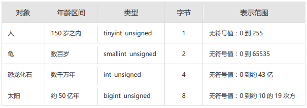

# 九、创建管理数据库

## 1、前置知识

### 1.1 一条数据的储存过程


### 1.2 标识符命名规则

- 数据库名、表名不得超过30个字符，变量名限制为29个
- 必须只能包含 A–Z, a–z, 0–9, _共63个字符
- 数据库名、表名、字段名等对象名中间不要包含空格
- 同一个MySQL软件中，数据库不能同名；同一个库中，表不能重名；同一个表中，字段不能重名
- 必须保证你的字段没有和保留字、数据库系统或常用方法冲突。如果坚持使用，请在SQL语句中使用`（着重号）引起来
- 保持字段名和类型的一致性：在命名字段并为其指定数据类型的时候一定要保证一致性，假如数据类型在一个表里是整数，那在另一个表里可就别变成字符型了

### 1.3 MySQL中的数据类型

| 类型             | 类型举例                                                     |
| ---------------- | ------------------------------------------------------------ |
| 整数类型         | TINYINT、SMALLINT、MEDIUMINT、**INT(或INTEGER)**、BIGINT     |
| 浮点类型         | FLOAT、DOUBLE                                                |
| 定点数类型       | **DECIMAL**                                                  |
| 位类型           | BIT                                                          |
| 日期时间类型     | YEAR、TIME、**DATE**、DATETIME、TIMESTAMP                    |
| 文本字符串类型   | CHAR、**VARCHAR**、TINYTEXT、TEXT、MEDIUMTEXT、LONGTEXT      |
| 枚举类型         | ENUM                                                         |
| 集合类型         | SET                                                          |
| 二进制字符串类型 | BINARY、VARBINARY、TINYBLOB、BLOB、MEDIUMBLOB、LONGBLOB      |
| JSON类型         | JSON对象、JSON数组                                           |
| 空间数据类型     | 单值：GEOMETRY、POINT、LINESTRING、POLYGON；<br/>集合：MULTIPOINT、MULTILINESTRING、MULTIPOLYGON、GEOMETRYCOLLECTION |

其中，常用的几类类型介绍如下：

| 数据类型      | 描述                                                         |
| ------------- | ------------------------------------------------------------ |
| INT           | 从-2^31到2^31-1的整型数据。存储大小为 4个字节                |
| CHAR(size)    | 定长字符数据。若未指定，默认为1个字符，最大长度255           |
| VARCHAR(size) | 可变长字符数据，根据字符串实际长度保存，**必须指定长度**     |
| FLOAT(M,D)    | 单精度，占用4个字节，M=整数位+小数位，D=小数位。 D<=M<=255,0<=D<=30，默认M+D<=6 |
| DOUBLE(M,D)   | 双精度，占用8个字节，D<=M<=255,0<=D<=30，默认M+D<=15         |
| DECIMAL(M,D)  | 高精度小数，占用M+2个字节，D<=M<=65，0<=D<=30，最大取值范围与DOUBLE相同。 |
| DATE          | 日期型数据，格式'YYYY-MM-DD'                                 |
| BLOB          | 二进制形式的长文本数据，最大可达4G                           |
| TEXT          | 长文本数据，最大可达4G                                       |

## 2、数据库的操作

### 2.1 创建

- 方式1：创建数据库

```mysql
CREATE DATABASE 数据库名;
```

- 方式2：创建数据库并指定字符集

```mysql
CREATE DATABASE 数据库名 CHARACTER SET 字符集;
```

- 方式3：判断数据库是否已经存在，不存在则创建数据库（ **推荐** ）

```mysql
CREATE DATABASE IF NOT EXISTS 数据库名;
```

> 如果MySQL中已经存在相关的数据库，则忽略创建语句，不再创建数据库。

> 补充：DATABASE 不能改名。一些可视化工具可以改名，它是建新库，把所有表复制到新库，再删旧库完成的，所以成本比较高，建库之间记得想好

### 2.2 查看数据库

- 查看当前所有的数据库

```mysql
SHOW DATABASES; #有一个S，代表多个数据库
```

- 查看当前正在使用的数据库

```mysql
SELECT DATABASE();  #使用的一个 mysql 中的全局函数
```

- 查看指定库下所有的表

```mysql
SHOW TABLES FROM 数据库名;
```

- 查看数据库的创建信息

```mysql
SHOW CREATE DATABASE 数据库名;
或者：
# 命令行下的，MySQL 不支持 \G 的写法
SHOW CREATE DATABASE 数据库名\G
```

- 使用/切换数据库

```mysql
USE 数据库名;
```

> 注意：要操作表格和数据之前必须先说明是对哪个数据库进行操作，否则就要对所有对象加上 “数据库名.”。

### 2.3 修改数据库

- 更改数据库字符集

```mysql
ALTER DATABASE 数据库名 CHARACTER SET 字符集;  #比如：gbk、utf8等
```

### 2.4 删除数据库

- 方式1：删除指定的数据库

```mysql
DROP DATABASE 数据库名;
```

- 方式2：删除指定的数据库（**推荐**）

```mysql
DROP DATABASE IF EXISTS 数据库名;
```

## 3、表的操作

### 3.1 创建表

**方式1：**

> 白手起家方式，从 0 到 1

- **必须具备：**
  - CREATE TABLE权限
  - 存储空间
- **语法格式：**

```mysql
CREATE TABLE [IF NOT EXISTS] 表名(
    字段1, 数据类型 [约束条件] [默认值],
    字段2, 数据类型 [约束条件] [默认值],
    字段3, 数据类型 [约束条件] [默认值],
    ……
    [表约束条件]
);
```

> 加上了 IF NOT EXISTS 关键字，则表示：如果当前数据库中不存在要创建的数据表，则创建数据表；
>
> 如果当前数据库中已经存在要创建的数据表，则忽略建表语句，不再创建数据表。

- **必须指定：**
  - 表名
  - 列名(或字段名)，数据类型，长度

- **可选指定：**
  - 约束条件
  - 默认值
- **创建表举例1：**

```mysql
-- 创建表
CREATE TABLE emp (
    -- int类型
    emp_id INT,
    -- 最多保存20个中英文字符
    emp_name VARCHAR(20),
    -- 总位数不超过15位
    salary DOUBLE,
    -- 日期类型
    birthday DATE
);
-- 查看当前表的数据结构
DESC emp;
```

MySQL在执行建表语句时，将id字段的类型设置为int(11)，这里的11实际上是int类型指定的显示宽度，默认的显示宽度为11。也可以在创建数据表的时候指定数据的显示宽度。

- **创建表举例2：**

```mysql
CREATE TABLE dept(
    -- int类型，自增
    deptno INT(2) AUTO_INCREMENT,
    dname VARCHAR(14),
    loc VARCHAR(13),
    -- 主键
    PRIMARY KEY (deptno)
);

-- desc 全写 DESCRIBE
DESCRIBE dept;
```

> 在MySQL 8.x版本中，不再推荐为INT类型指定显示长度，并在未来的版本中可能去掉这样的语法。


**方式2：**

> 富二代造表方式，直接 copy 现成的

- 使用 AS subquery(子查询) 选项，将创建表和插入数据结合起来
- 指定的列和子查询中的列要一一对应
- 通过列名和默认值定义列

```mysql
# 示例

CREATE TABLE emp1 AS SELECT * FROM employees;

-- 1 = 2 永远不可能成立，所以，返回值永远为空
CREATE TABLE emp2 AS SELECT * FROM employees WHERE 1=2; -- 创建的emp2是空表
```

```mysql
CREATE TABLE dept80
AS
SELECT employee_id, last_name, salary*12 ANNSAL, hire_date
FROM  employees
WHERE  department_id = 80;

DESCRIBE dept80;
```

### 3.2 查看数据表结构

MySQL支持使用 DESCRIBE/DESC 语句查看数据表结构，也支持使用 SHOW CREATE TABLE 语句查看数据表结构。

语法：

```mysql
# 命令行语法，SQLYog 不支持这种写法，需要将 \G 换成分号 ;
SHOW CREATE TABLE 表名\G

SHOW CREATE TABLE 表名;
```

>  使用SHOW CREATE TABLE语句不仅可以查看表创建时的详细语句，还可以查看存储引擎和字符编码。

### 3.3 修改表

修改表指的是修改数据库中已经存在的数据表的结构。

使用 **ALTER TABLE** 语句可以实现：

- 向已有的表中添加列
- 修改现有表中的列
- 删除现有表中的列
- 重命名现有表中的列

**3.3.1 追加一个列**

语法：

```mysql
ALTER TABLE 表名 ADD 【列】 字段名 字段类型 【FIRST|AFTER 字段名】;
```

```mysql
# 示例
ALTER TABLE dept80
ADD job_id varchar(15);
```

> 不指定 FIRST|AFTER 的话，则默认添加到表中的最后一个字段的位置。

**3.3.2 修改一个列**

- 可以修改列的数据类型，长度、默认值和位置
- 修改字段数据类型、长度、默认值、位置的语法格式如下：

```mysql
ALTER TABLE 表名 MODIFY 【列】 字段名1 字段类型 【DEFAULT 默认值】【FIRST|AFTER 字段名2】;
```

- 举例：

```mysql
# 例1
ALTER TABLE dept80
MODIFY last_name VARCHAR(30);

# 例2
ALTER TABLE dept80
MODIFY salary double(9,2) default 1000;
```

- 对默认值的修改只影响今后对表的修改
- 此外，还可以通过此种方式修改列的约束。

**3.3.3 重命名一个列**

使用 `CHANGE 旧名 新名 类型` 子句重命名列。语法格式如下：

```mysql
ALTER TABLE 表名 CHANGE 【column】 列名 新列名 新数据类型;
```

- 举例：

```mysql
ALTER TABLE dept80
CHANGE department_name dept_name varchar(15);
```

**3.3.4 删除一个列**

删除表中某个字段的语法格式如下：

```mysql
ALTER TABLE 表名 DROP 【COLUMN】字段名
```

- 举例：

```mysql
ALTER TABLE dept80
DROP COLUMN job_id;
```

### 3.4 重命名表

- 方式1：使用RENAME

```mysql
RENAME TABLE emp
TO myemp;
```

- 方式2：

```mysql
ALTER table dept
RENAME [TO] detail_dept;  -- [TO]可以省略
```

- 必须是对象的拥有者

### 3.5 删除表

**语法格式：**

```mysql
DROP TABLE [IF EXISTS] 数据表1 [, 数据表2, …, 数据表n];
```

> `IF EXISTS`的含义为：如果当前数据库中存在相应的数据表，则删除数据表；如果当前数据库中不存在相应的数据表，则忽略删除语句，不再执行删除数据表的操作。

**注意：**

- 数据和结构都被删除
- 所有正在运行的相关事务被提交
- 所有相关索引被删除

**举例：**

```mysql
DROP TABLE dept80;
```

> **注意：DROP TABLE 语句不能回滚**

### 3.6 清空表

**TRUNCATE TABLE 语句：**

- 删除表中所有的数据
- 释放表的存储空间

**举例：**

```mysql
TRUNCATE TABLE detail_dept;
```

- TRUNCATE 语句**不能回滚**，而使用 DELETE 语句删除数据，可以回滚

**TRUNCATE 与 DELETE 的对比：**

- 都能对表中的数据进行删除，同时**保留表的结构**

- **TRUNCATE 不能回滚操作**，而 **DELETE 可以执行回滚操作**(需要手动的设置一下)
- TRUNCATE 只能做清空所有数据的操作，而 **DELETE 则可以指定需要清除的数据**(可以加 WHERE) ，所以 DELETE 比 TRUNCATE 更加的灵活

> 说明：TRUNCATE TABLE 在功能上与不带 WHERE 子句的 DELETE 语句相同。都是对表中的全部数据进行删除，但是不建议使用 TRUNCATE ，因为不能回滚，容易出事，且 TRUNCATE 也没有 DELETE 灵活。
>
> 但是，需要注意的是，TRUNCATE 的执行效率是要高于 DELECT 的

> 补充：DDL 和 DML 的说明
>
> 【参考】TRUNCATE TABLE 比 DELETE 速度快，且使用的系统和事务日志资源少，但 TRUNCATE 无事务且不触发 TRIGGER，有可能造成事故，故不建议在开发代码中使用此语句。 
>
> - DDL 的操作一旦执行，就不可回滚。指令 SET autocommit=FALSE; 对 DDL 操作失效。（因为在执行完 DDL 操作之后，一定会执行一次 COMMIT。而此 COMMIT 操作不受 SET autocommit = FALSE 影响的。)
> - DML 的操作默认情况，一旦执行，也是不可回滚的。但是，如果在执行 DML 之前，执行了 SET autocommit = FALSE, 则执行的 DML 操作就可以实现回滚。

## 拓展

### 1、阿里巴巴《Java开发手册》之MySQL字段命名

- 【`强制`】表名、字段名必须使用小写字母或数字，禁止出现数字开头，禁止两个下划线中间只出现数字。数据库字段名的修改代价很大，因为无法进行预发布，所以字段名称需要慎重考虑。
  - 正例：aliyun_admin，rdc_config，level3_name 
  - 反例：AliyunAdmin，rdcConfig，level_3_name

- 【`强制`】禁用保留字，如 desc、range、match、delayed 等，请参考 MySQL 官方保留字。

- 【`强制`】表必备三字段：id, gmt_create, gmt_modified。 

  - 说明：其中 id 必为主键，类型为BIGINT UNSIGNED、单表时自增、步长为 1。gmt_create, gmt_modified 的类型均为 DATETIME 类型，前者现在时表示主动式创建，后者过去分词表示被动式更新

- 【`推荐`】表的命名最好是遵循 “业务名称_表的作用”。 

  - 正例：alipay_task 、 force_project、 trade_config

- 【`推荐`】库名与应用名称尽量一致。

- 【参考】合适的字符存储长度，不但节约数据库表空间、节约索引存储，更重要的是提升检索速度。 

  - 正例：无符号值可以避免误存负数，且扩大了表示范围。



### 2、如何理解清空表、删除表等操作需谨慎？！

`表删除`操作将把表的定义和表中的数据一起删除，并且MySQL在执行删除操作时，不会有任何的确认信息提示，因此执行删除操时应当慎重。在删除表前，最好对表中的数据进行`备份`，这样当操作失误时可以对数据进行恢复，以免造成无法挽回的后果。

同样的，在使用 `ALTER TABLE` 进行表的基本修改操作时，在执行操作过程之前，也应该确保对数据进行完整的`备份`，因为数据库的改变是`无法撤销`的，如果添加了一个不需要的字段，可以将其删除；相同的，如果删除了一个需要的列，该列下面的所有数据都将会丢失。

### 3、MySQL8新特性—DDL的原子化

在MySQL 8.0版本中，InnoDB表的DDL支持事务完整性，即`DDL操作要么成功要么回滚`。DDL操作回滚日志写入到data dictionary数据字典表mysql.innodb_ddl_log（该表是隐藏的表，通过show tables无法看到）中，用于回滚操作。通过设置参数，可将DDL操作日志打印输出到MySQL错误日志中。
