[toc]

# 一、框架概述

## 1、认识 and 术语解释

Spring 是轻量级的开源的 JavaEE 框架。

- **轻量级**：体积小，jar 包少，不需要依赖特别的组件，可以单独进行使用
- **开源**：开放源代码，可以免费的进行使用
- **框架**：解决企业应用开发的复杂性

## 2、Spring 的两个核心

### 2.1 AOP

AOP 表示**面向切面**：指的是在不修改源码的情况下，对程序进行增强

### 2.2 IOC

IOC 表示**控制反转**：指的是将创建对象的过程交给 Spring 管理。

## 3、Spring 的作用

1. 方便解耦，简化开发，分别由 IOC 和 AOP 实现
2. AOP 编程支持
3. 方便程序测试
4. 方便与其他框架进行整合
5. 方便进行事务的操作
6. 降低 API 开发难度

# 二、IOC

## 1、基本介绍：

全称：Inversion of Control

中文释义：控制反转。

作用：将创建对象的过程和对象之间调用的过程，交付出去，这里交给的是 Spring，让其进行管理。

### 1.1 入门案例

1. 导包

> 这一步我们大多时候都是交由 Maven 自动导入，不需要我们管太多，但还是需要认识一下相关的 jar 包。

Spring5 相关的 jar 包：

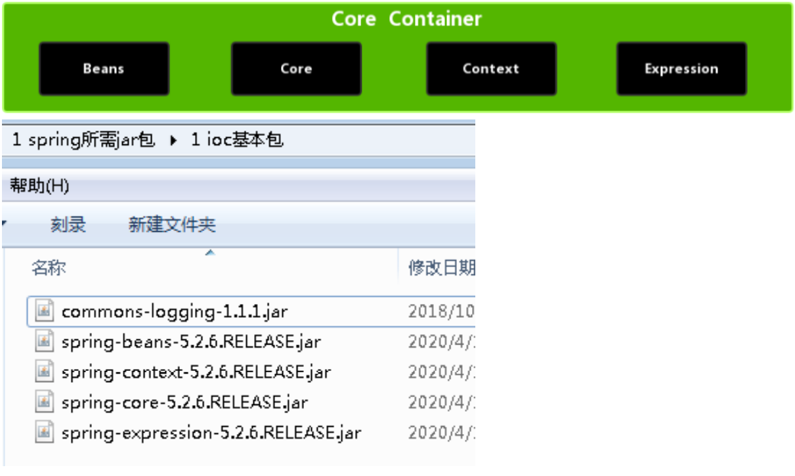

2. 创建普通类，在这个类创建普通方法

```java
public class User {
     public void add() {
     	System.out.println("add......");
     }
}

```

3. 创建 Spring 配置文件，在配置文件配置创建的对象

> Spring 配置文件使用 xml 格式

```xml
<?xml version="1.0" encoding="UTF-8"?>
<beans xmlns="http://www.springframework.org/schema/beans" 
 xmlns:xsi="http://www.w3.org/2001/XMLSchema-instance" 
 xsi:schemaLocation="http://www.springframework.org/schema/beans 
http://www.springframework.org/schema/beans/spring-beans.xsd">
 <!--配置 User 对象创建--> 
 	<bean id="user" class="com.atguigu.spring5.User"></bean>
</beans>
```

4. 测试代码的编写：

```java
@Test
public void testAdd() {
     //1 加载 spring 配置文件
     ApplicationContext context = new ClassPathXmlApplicationContext("bean1.xml");
     //2 获取配置创建的对象
     User user = context.getBean("user", User.class);
     System.out.println(user);
     user.add();
}
```

5. 输出结果：


## 2、底层原理：

1. XML 解析
2. 工厂设计模式
3. 反射

> 补充：
>
> - 工厂设计模式的初衷就是为了降低代码的耦合度，将创建对象的过程交给工厂类负责，其他类只负责调用
> - 代码之间**不可能没有耦合度**，但是有个最低限度的耦合度，我们的追求就是将**耦合度降到最低**的限度，IOC 底层能更进一步的降低代码耦合

IOC 底层原理图解：

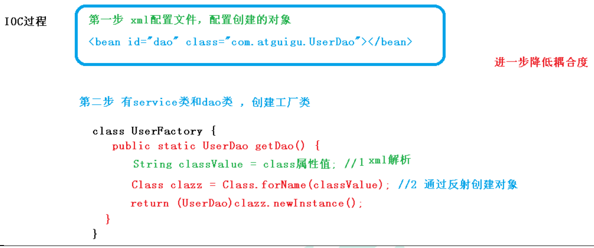

## 3、API

> IOC 思想基于 IOC 容器完成，IOC 容器底层就是对象工厂

### 3.1 Spring 提供 IOC 容器实现两种方式：

> 也就是两个接口

**(1) BeanFactory：**

​	IOC 容器基本实现，是 Spring 内部的使用接口，不提供开发人员进行使用

> 加载配置文件时候不会创建对象，在获取对象（使用）才去创建对象

**(2) ApplicationContext：**

​	BeanFactory 接口的子接口，提供更多更强大的功能，一般由开发人 员进行使用

> 加载配置文件时候就会把在配置文件对象进行创建

### 3.2 ApplicationContext 接口的实现类：

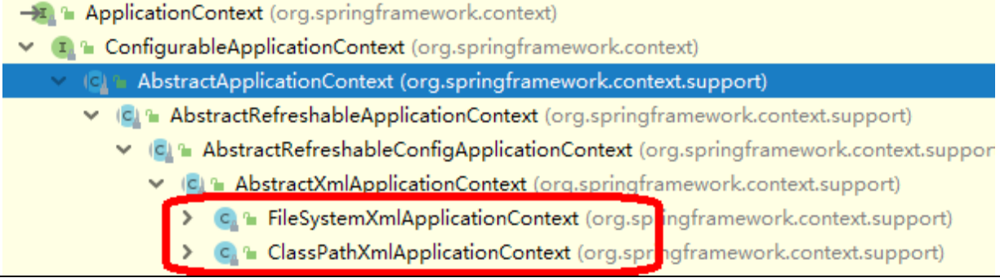

**(1) ClassPathXmlApplicationContext**

​	表示加载配置文件时**获取的是配置文件的类路径**，从 src 开始的

**(2) FileSystemXmlApplicationContext**

​	表示加载配置文件时**获取的是配置文件的磁盘路径**，即**从盘符开始**的

## 4、IOC 操作 Bean 管理

### 4.1 Bean 管理是什么？

Bean 指的是两个操作：

1. Spring 创建对象
2. Spirng 注入属性

### 4.2 Bean 管理操作的两种方式

#### 4.2.1 基于 xml 配置文件方式实现：

**1、基于 xml 方式创建对象**

```xml
<!-- 配置 User 对象创建-->
<bean id="user" class="com.atguigu.spring.User"></bean>
```

> 1. 在 spring 配置文件中，使用 bean 标签，标签里面添加对应属性，就可以实现对象创建.
> 2. bean 标签的常用属性
>    - id 属性：唯一标识
>    - class 属性：类全路径（包类路径）
>
> 3. 创建对象时候，默认是执行无参数构造方法完成对象创建


**2、基于 xml 方式注入属性**

> DI：依赖注入，就是注入属性

**(1) 方案1：使用 set 方法进行注入**

a> 创建类，定义属性和对应的 set 方法

```java
/**
* 演示使用 set 方法进行注入属性
*/
public class Book {
     //创建属性
     private String bname;
     private String bauthor;
     //创建属性对应的 set 方法
     public void setBname(String bname) {
     	this.bname = bname;
     }
     public void setBauthor(String bauthor) {
     	this.bauthor = bauthor;
     }
}

```

b> 在 spring 配置文件配置对象创建，配置属性注入

```xml
<!--2 set 方法注入属性-->
<bean id="book" class="com.atguigu.spring5.Book">
     <!--使用 property 完成属性注入
     	name：类里面属性名称
     	value：向属性注入的值
     -->
     <property name="bname" value="易筋经"></property>
     <property name="bauthor" value="达摩老祖"></property>
</bean>

```

**(2) 方案2：使用有参数构造进行注入**

a> 创建类，定义属性，创建属性对应有参数构造方法

```java
/**
* 使用有参数构造注入
*/
public class Orders {
     //属性
     private String oname;
     private String address;
     //有参数构造
     public Orders(String oname,String address) {
         this.oname = oname;
         this.address = address;
     }
}

```

b> 在 spring 配置文件中进行配置

```xml
<!--3 有参数构造注入属性-->
<bean id="orders" class="com.atguigu.spring5.Orders">
     <constructor-arg name="oname" value="电脑"></constructor-arg>
     <constructor-arg name="address" value="China"></constructor-arg>
</bean>
```

**(3) 方案3：p 名称空间注入(了解)：**

> 1. 对 set 注入和有参注入做了一定的简化，可以简化基于 xml 配置方式
>
> 2. 这种方式的底层用的还是 set 注入，只是做了一定的简化

a> 添加 p 名称空间在配置文件中

> 也可以说是在约束中增加配置，也就是在 beans 标签中。

```xml
<?xml version="1.0" encoding="UTF-8"?>
<beans xmlns="http://www.springframework.org/schema/beans" 
 xmlns:xsi="http://www.w3.org/2001/XMLSchema-instance" 
 xmlns:p="http://www.springframework.org/schema/p"
 xsi:schemaLocation="http://www.springframework.org/schema/beans 
http://www.springframework.org/schema/beans/spring-beans.xsd">
 <!--配置 User 对象创建--> 
 	<bean id="user" class="com.atguigu.spring5.User"></bean>
</beans>
```

b> 进行属性注入，在 bean 标签里面进行操作

```xml
<!--2 set 方法注入属性-->
<bean id="book" class="com.atguigu.spring5.Book" p:bname="九阳神功" p:bauthor="无名氏"></bean>
```


**3、xml 注入其他类型属性**

**(1) 字面量：**

a> null 值

```xml
<!-- null 值 -->
<property name="address">
 	<null/>
</property>
```

b> 属性值包含特殊符号

```xml
<!--属性值包含特殊符号
 	1 把<>进行转义 &lt; &gt;
 	2 把带特殊符号内容写到 CDATA
-->
<property name="address">
 	<value><![CDATA[<<南京>>]]></value>
</property>
```

**(2) 属性-外部 bean：**

基本流程：

1. 创建两个类 service 类和 dao 类
2. 在 service 调用 dao 里面的方法
3. 在 spring 配置文件中进行配置

a> Java 实体类准备：

```java
public class UserService {
     //创建 UserDao 类型属性，生成 set 方法
     private UserDao userDao;
     public void setUserDao(UserDao userDao) {
     	this.userDao = userDao;
     }
     public void add() {
     	System.out.println("service add...............");
     	userDao.update();
     }
}

```

b> spring 配置文件准备：

```xml
<!--1 service 和 dao 对象创建-->
<bean id="userService" class="com.atguigu.spring5.service.UserService">
     <!--注入 userDao 对象
     	name 属性：类里面属性名称
     	ref 属性：创建 userDao 对象 bean 标签 id 值
     -->
     <property name="userDao" ref="userDaoImpl"></property>
</bean>
<bean id="userDaoImpl" class="com.atguigu.spring5.dao.UserDaoImpl"></bean>
```

> 外部 Bean 其实就是在外部配置一个 bean 加载一个对象，然后通过 ref 标签将对象进行引入的操作，所以叫外部 bean


**(3) 属性-内部 bean：**

> 解释：内部 bean 属于一对多关系
>
> 举例：部门和员工，一个部门有多个员工，一个员工属于一个部门，部门是一，员工是多
>
> 需求：在实体类之间表示一对多关系，员工表示所属部门，使用对象类型属性进行表示

实现：

a> 准备实体类：

```java
//部门类
public class Dept {
     private String dname;
     public void setDname(String dname) {
     	this.dname = dname;
     }
}


//员工类
public class Emp {
     private String ename;
     private String gender;
     //员工属于某一个部门，使用对象形式表示
     private Dept dept;
     public void setDept(Dept dept) {
     	this.dept = dept;
     }
     public void setEname(String ename) {
     	this.ename = ename;
     }
     public void setGender(String gender) {
     	this.gender = gender;
     }
}
```

b> 在 spring 配置文件中进行配置

```xml
<!-- 内部 bean -->
<bean id="emp" class="com.atguigu.spring5.bean.Emp">
     <!-- 设置两个普通属性 -->
     <property name="ename" value="lucy"></property>
     <property name="gender" value="女"></property>
     <!-- 设置对象类型属性 -->
     <property name="dept">
         <bean id="dept" class="com.atguigu.spring5.bean.Dept">
        	 <property name="dname" value="安保部"></property>
         </bean>
     </property>
</bean>
```


**(4) 属性-级联赋值**

> 解释：
>
> 级联赋值就是**在一个类中往另外一个类中注入属性**
>
> 内部 bean 和外部 bean 的方式都可以进行级联赋值。

a> 写法1：

```xml
<!--级联赋值-->
<bean id="emp" class="com.atguigu.spring5.bean.Emp">
     <!--设置两个普通属性-->
     <property name="ename" value="lucy"></property>
     <property name="gender" value="女"></property>
     <!--级联赋值-->
     <property name="dept" ref="dept"></property>
</bean>
<bean id="dept" class="com.atguigu.spring5.bean.Dept">
	 <property name="dname" value="财务部"></property>
</bean>
```

b> 写法2：

在实体类中添加 get 方法

```java
public class Emp {
     private String ename;
     private String gender;
     //员工属于某一个部门，使用对象形式表示
     private Dept dept;
     // 添加的 get 方法
     public void getDept(Dept dept) {
     	this.dept = dept;
     }
     public void setDept(Dept dept) {
     	this.dept = dept;
     }
     public void setEname(String ename) {
     	this.ename = ename;
     }
     public void setGender(String gender) {
     	this.gender = gender;
     }
}
```

对应的 xml 配置文件

```xml
<!--级联赋值-->
<bean id="emp" class="com.atguigu.spring5.bean.Emp">
     <!--设置两个普通属性-->
     <property name="ename" value="lucy"></property>
     <property name="gender" value="女"></property>
     <!--级联赋值-->
     <!--将该对象进行引入-->
     <property name="dept" ref="dept"></property>
     <!-- 直接在 name 标签中使用 对象.属性 赋值 -->
     <!-- 这是基于 get 方法进行的级联赋值，这需要在 赋值类 中获取对象，所以需要 get 方法。 -->
     <property name="dept.dname" value="技术部"></property>
</bean>
<!-- 类对象所属的类的加载步骤还是不能少，而且是外部 bean -->
<bean id="dept" class="com.atguigu.spring5.bean.Dept">
 	<property name="dname" value="财务部"></property>
</bean>

```

> get 方法需要注意的两个点：
>
> 1. 即使生成了 get 方法，配置文件中类对象所属的类的加载步骤还是不能少，即 bean 不能少，而且是外部 bean
> 2. 外部就算生成了 bean，在注入属性的类中还是需要使用 ref 属性来将该对象进行引入

> 只有满足上述的两个点，才能使用 `对象.属性` 的方式对 对象类型的属性中的属性值进行注入

> 总结：get 方法的使用是基于外部 bean 方式的简化，需要先使用外部 bean 的方式，将对象创建并引入，然后才能使用`对象.属性`的注入方式


**4、xml 注入集合属性**

**(1) 数组，List，Map集合类型**

a> 创建类，定义数组、list、map、set 类型属性，生成对应 set 方法

```java
public class Stu {
     //1 数组类型属性
     private String[] courses;
     //2 list 集合类型属性
     private List<String> list;
     //3 map 集合类型属性
     private Map<String,String> maps;
     //4 set 集合类型属性
     private Set<String> sets;
     public void setSets(Set<String> sets) {
     	this.sets = sets;
     }
     public void setCourses(String[] courses) {
     	this.courses = courses;
     }
     public void setList(List<String> list) {
     	this.list = list;
     }
     public void setMaps(Map<String, String> maps) {
     	this.maps = maps;
     }
}

```

b> 在 spring 配置文件进行配置

```xml
<!--1 集合类型属性注入-->
<bean id="stu" class="com.atguigu.spring5.collectiontype.Stu">
     <!--数组类型属性注入-->
     <property name="courses">
         <array>
             <value>java 课程</value>
             <value>数据库课程</value>
         </array>
     </property>
     <!--list 类型属性注入-->
     <property name="list">
         <list>
             <value>张三</value>
             <value>小三</value>
         </list>
     </property>
     <!--map 类型属性注入-->
     <property name="maps">
         <map>
             <entry key="JAVA" value="java"></entry>
             <entry key="PHP" value="php"></entry>
         </map>
     </property>
     <!--set 类型属性注入-->
     <property name="sets">
         <set>
             <value>MySQL</value>
             <value>Redis</value>
         </set>
     </property>
</bean>
```

> 细节：
>
> 1. 在集合中设置对象属性，需要在外部创建 bean，并在其中注入属性，id 值唯一，不能重复，其他不变，要加多少个对象就创建多少个bean
> 2. <list> 标签中不能使用 value 注入了，需要使用 ref 标签注入，属性为创建的 bean，bean 的值为 id 值，需要增加多少就添加多少


**5、在集合里面设置对象类型值**

```xml
<!--创建多个 course 对象-->
<bean id="course1" class="com.atguigu.spring5.collectiontype.Course">
 	<property name="cname" value="Spring5 框架"></property>
</bean>
<bean id="course2" class="com.atguigu.spring5.collectiontype.Course">
 	<property name="cname" value="MyBatis 框架"></property>
</bean>
<!--注入 list 集合类型，值是对象-->
<property name="courseList">
     <list>
         <ref bean="course1"></ref>
         <ref bean="course2"></ref>
     </list>
</property>
```


**6、把集合注入部分提取出来**

a> 在 spring 配置文件中引入名称空间 util

```xml
<?xml version="1.0" encoding="UTF-8"?>
<beans xmlns="http://www.springframework.org/schema/beans"
 xmlns:xsi="http://www.w3.org/2001/XMLSchema-instance"
 xmlns:p="http://www.springframework.org/schema/p"
 xmlns:util="http://www.springframework.org/schema/util"
 xsi:schemaLocation="http://www.springframework.org/schema/beans 
					 http://www.springframework.org/schema/beans/spring-beans.xsd
 				 	 http://www.springframework.org/schema/util 
					 http://www.springframework.org/schema/util/spring-util.xsd">
```

b> 使用 util 标签完成 list 集合注入提取

```xml
<!--1 提取 list 集合类型属性注入-->
<util:list id="bookList">
     <!-- id 表示一个名字，也就是代号 -->
     <!-- <value> 设置值 -->
     <value>易筋经</value>
     <value>九阴真经</value>
     <value>九阳神功</value>
</util:list>
<!--2 提取 list 集合类型属性注入使用-->
<bean id="book" class="com.atguigu.spring5.collectiontype.Book">
    <!-- ref 的值为 id 的值，name 表示集合属性的名字 -->
 	<property name="list" ref="bookList"></property>
</bean>
```

#### 4.2.2 基于注解方式操作 bean 管理

**1、什么是注解** 

（1）注解是代码特殊标记，格式：@注解名称(属性名称=属性值, 属性名称=属性值..) 

（2）使用注解，注解作用在类上面，方法上面，属性上面 

（3）使用注解目的：简化 xml 配置

**2、Spring 针对 Bean 管理中创建对象提供注解** 

（1）@Component 

（2）@Service（用在业务层）

（3）@Controller（web层）

（4）@Repository（dao持久层）

> 上面四个注解功能是一样的，都可以用来创建 bean 实例

**3、基于注解方式实现对象创建**

a> 引入依赖

b> 开启组件扫描

```xml
<!--开启组件扫描
     1 如果扫描多个包，多个包使用逗号隔开
     2 扫描包上层目录
-->
<!-- 报错的话就在配置文件中配置空间 -->
<context:component-scan base-package="com.atguigu"></context:component-scan>
```

c> 创建类，在类上面添加创建对象注解

```java
//在注解里面 value 属性值可以省略不写，
//默认值是类名称，首字母小写
//UserService -- userService
@Component(value = "userService") //<bean id="userService" class=".."/>
public class UserService {
     public void add() {
         System.out.println("service add.......");
     }
}

```

**4、开启组件扫描细节配置**

```xml
<!--示例 1
     use-default-filters="false" 表示现在不使用默认 filter，自己配置 filter
     context:include-filter ，设置扫描哪些内容
-->
<context:component-scan base-package="com.atguigu" use-defaultfilters="false">
     <context:include-filter type="annotation" 
     expression="org.springframework.stereotype.Controller"/>
</context:component-scan>


<!--示例 2
     下面配置扫描包所有内容
     context:exclude-filter： 设置哪些内容不进行扫描
-->
<context:component-scan base-package="com.atguigu">
     <context:exclude-filter type="annotation"  
     expression="org.springframework.stereotype.Controller"/>
</context:component-scan>
```

**5、基于注解方式实现属性注入** 

（1）@Autowired：根据属性类型进行自动装配

a> 把 service 和 dao 对象创建，在 service 和 dao 类添加创建对象注解

b> 在 service 注入 dao 对象，在 service 类添加 dao 类型属性，在属性上面使用注解

```java
@Service
public class UserService {
     //定义 dao 类型属性
     //不需要添加 set 方法
     //添加注入属性注解
     @Autowired 
     private UserDao userDao;
     public void add() {
         System.out.println("service add.......");
         userDao.add();
     }
}

```

（2）@Qualifier：根据名称进行注入

这个@Qualifier 注解的使用，和上面@Autowired 一起使用

```java
//定义 dao 类型属性
//不需要添加 set 方法
//添加注入属性注解
@Autowired //根据类型进行注入
@Qualifier(value = "userDaoImpl1") //根据名称进行注入
private UserDao userDao;
```

（3）@Resource：可以根据类型注入，可以根据名称注入

> java 扩展包 javax 提供，不是 spring 提供的
>
> 不加括号就是根据类型注入
>
> 加括号有特殊属性name，值就是 id 值，表示根据名称注入

```java
//@Resource //根据类型进行注入
@Resource(name = "userDaoImpl1") //根据名称进行注入
private UserDao userDao;
```

（4）@Value：注入普通类型属性

```java
@Value(value = "abc")
private String name;
```

> 注入属性基本流程
>
> 1. 创建对象实例
> 2. 创建对象实例之后，注入属性

**6、完全注解开发** 

a> 创建配置类，替代 xml 配置文件

```java
@Configuration //作为配置类，替代 xml 配置文件
@ComponentScan(basePackages = {"com.atguigu(包路径)"})//代替 XML 配置文件中的组件扫描步骤
//包路径表示的是扫描的部分
public class SpringConfig {
}
```

b> 编写测试类

```java
@Test
public void testService2() {
     //加载配置类
     ApplicationContext context = new AnnotationConfigApplicationContext(SpringConfig.class);
     UserService userService = context.getBean("userService", UserService.class);
     System.out.println(userService);
     userService.add();
}
```

> 对应的改变有，加载时，不在获取 XML 配置文件，转而使用 AnnotationConfigApplicationContext 获取配置类

> 补充，注入属性需要在创建对象之后，需要对象先创建起来

### 4.3 Bean 的两种类型

1、Spring 有两种类型 bean，一种普通 bean，另外一种工厂 bean（FactoryBean）

2、普通 bean：在配置文件中定义 bean 类型就是返回类型

3、工厂 bean：在配置文件定义 bean 类型可以和返回类型不一样

**(1) 实现步骤：**

a> 创建类，让这个类作为工厂 bean，实现接口 FactoryBean

Java

```java
public class MyBean implements FactoryBean<Course> {
     //定义返回 bean
     @Override
     public Course getObject() throws Exception {
         Course course = new Course();
         course.setCname("abc");
     	 return course;
     }
     @Override
     public Class<?> getObjectType() {
     	return null;
     }
     @Override
     public boolean isSingleton() {
     	return false;
     }
}
```

XML

```xml
<bean id="myBean" class="com.atguigu.spring5.factorybean.MyBean"></bean>
```

JavaTest

```java
@Test
public void test3() {
     ApplicationContext context =new ClassPathXmlApplicationContext("bean3.xml");
     Course course = context.getBean("myBean", Course.class);
     System.out.println(course);
}
```

### 4.4 Bean 的作用域

1、在 Spring 里面，设置创建 bean 实例是单实例还是多实例

2、在 Spring 里面，默认情况下，bean 是单实例对象

**(1) 如何设置单实例还是多实例**

a> 在 spring 配置文件 bean 标签里面有属性（scope）用于设置单实例还是多实例

```xml
<!-- scope 属性值：
 		singleton，默认值，表示是单实例对象
		prototype，表示是多实例对象-->
<bean id="book" class="com.atguigu.spring5.factorybean.Book" scope="prototype"></bean>
```

> singleton 和 prototype 区别：
>
> 1. singleton 单实例，prototype 多实例
> 2. 设置 scope 值是 singleton 时候，加载 spring 配置文件时候就会创建单实例对象
> 3. 设置 scope 值是 prototype 时候，不是在加载 spring 配置文件时候创建对象，而是在调用 getBean 方法时候创建多实例对象

### 4.5 Bean 的生命周期

1、生命周期

（1）从对象创建到对象销毁的过程

2、bean 生命周期

（1）通过构造器创建 bean 实例（无参数构造）

（2）为 bean 的属性设置值和对其他 bean 引用（调用 set 方法）

（3）调用 bean 的初始化的方法（需要进行配置初始化的方法）

（4）bean 可以使用了（对象获取到了）

（5）当容器关闭时候，调用 bean 的销毁的方法（需要进行配置销毁的方法）

3、演示 bean 生命周期

```java
public class Orders {
     //无参数构造
     public Orders() {
     	System.out.println("第一步 执行无参数构造创建 bean 实例");
     }
     private String oname;
     public void setOname(String oname) {
         this.oname = oname;
         System.out.println("第二步 调用 set 方法设置属性值");
     }
     //创建执行的初始化的方法
     public void initMethod() {
     	System.out.println("第三步 执行初始化的方法");
     }
     //创建执行的销毁的方法
     public void destroyMethod() {
     	System.out.println("第五步 执行销毁的方法");
     }
}

```

XML 配置文件

```xml
<bean id="orders" class="com.atguigu.spring5.bean.Orders" initmethod="initMethod" destroy-method="destroyMethod">
 	<property name="oname" value="手机"></property>
</bean>
```

JavaTest

```java
@Test
 public void testBean3() {
    // ApplicationContext context =
    // new ClassPathXmlApplicationContext("bean4.xml");
     ClassPathXmlApplicationContext context = 
         new ClassPathXmlApplicationContext("bean4.xml");
     Orders orders = context.getBean("orders", Orders.class);
     System.out.println("第四步 获取创建 bean 实例对象");
     System.out.println(orders);
     //手动让 bean 实例销毁
     context.close();
 }

/*
输出结果：
    第一步 执行无参数构造创建bean实例
    第二步 调用set方法设置属性值
    第三步 执行初始化的方法
    第四步 获取创建bean实例对象
    com.atguigu.spring5.bean.Orders@192d3247
    第五步 执行销毁的方法
*/
```

4、bean 的后置处理器，bean 生命周期有七步

（1）通过构造器创建 bean 实例（无参数构造）

（2）为 bean 的属性设置值和对其他 bean 引用（调用 set 方法）

（3）把 bean 实例传递 bean 后置处理器的方法 postProcessBeforeInitialization 

（4）调用 bean 的初始化的方法（需要进行配置初始化的方法）

（5）把 bean 实例传递 bean 后置处理器的方法 postProcessAfterInitialization

（6）bean 可以使用了（对象获取到了）

（7）当容器关闭时候，调用 bean 的销毁的方法（需要进行配置销毁的方法）

5、演示添加后置处理器效果

a> 创建类，实现接口 BeanPostProcessor，创建后置处理器

```java
public class MyBeanPost implements BeanPostProcessor {
     //初始化之前将bean实例传递给后置处理器的方法
     @Override
     public Object postProcessBeforeInitialization(Object bean, String beanName) 
    throws BeansException {
    	 System.out.println("在初始化之前执行的方法");
    	 return bean;
     }
    
    //初始化之后将bean实例传递给后置处理器的方法
     @Override
     public Object postProcessAfterInitialization(Object bean, String beanName) 
    throws BeansException {
   	 	 System.out.println("在初始化之后执行的方法");
   	 	 return bean;
     }
}
```

XML

```xml
<!--配置后置处理器-->
<bean id="myBeanPost" class="com.atguigu.spring5.bean.MyBeanPost"></bean>
```

输出结果：

```java
/*
第一步 执行无参数构造创建bean实例
第二步 调用set方法设置属性值
在初始化之前执行的方法
第三步 执行初始化的方法
在初始化之后执行的方法
第四步 获取创建bean实例对象
com.atguigu.spring5.bean.Orders@43bd930a
第五步 执行销毁的方法
*/
```

### 4.6 XML 自动装配

1、什么是自动装配？

（1）根据指定装配规则（属性名称或者属性类型），Spring 自动将匹配的属性值进行注入

2、演示自动装配过程

（1）根据属性名称自动注入

```xml
<!--实现自动装配
     bean 标签属性 autowire，配置自动装配
     autowire 属性常用两个值：
     byName 根据属性名称注入 ，注入值 bean 的 id 值和类属性名称一样
     byType 根据属性类型注入
-->
<bean id="emp" class="com.atguigu.spring5.autowire.Emp" autowire="byName">
	 <!--<property name="dept" ref="dept"></property>-->
</bean>
<bean id="dept" class="com.atguigu.spring5.autowire.Dept"></bean>
```

（2）根据属性类型自动注入

```xml
<!--实现自动装配
     bean 标签属性 autowire，配置自动装配
     autowire 属性常用两个值：
     byName 根据属性名称注入 ，注入值 bean 的 id 值和类属性名称一样
     byType 根据属性类型注入
-->
<bean id="emp" class="com.atguigu.spring5.autowire.Emp" autowire="byType">
 	<!--<property name="dept" ref="dept"></property>-->
</bean>
<bean id="dept" class="com.atguigu.spring5.autowire.Dept"></bean>
```

### 4.7 引入外部属性文件

**1、直接配置数据库信息**

a> 配置德鲁伊连接池

```xml
<!--直接配置连接池-->
<bean id="dataSource" class="com.alibaba.druid.pool.DruidDataSource">
     <property name="driverClassName" value="com.mysql.jdbc.Driver"></property>
     <property name="url" value="jdbc:mysql://localhost:3306/userDb"></property>
     <property name="username" value="root"></property>
     <property name="password" value="root"></property>
</bean>
```

b> 引入德鲁伊连接池依赖 jar 包

自行引入。


**2、引入外部属性文件配置数据库连接池**

a> 创建外部属性文件，properties 格式文件，写数据库信息

```properties
prop.driverClass=com.mysql.jdbc.Driver
prop.url=jdbc:mysql://localhost:3306/userDb
prop.userName=root
prop.password=root
```

b> 把外部 properties 属性文件引入到 spring 配置文件中

> 引入 context 名称空间

```xml
<beans xmlns="http://www.springframework.org/schema/beans" 
 xmlns:xsi="http://www.w3.org/2001/XMLSchema-instance" 
 xmlns:p="http://www.springframework.org/schema/p" 
 xmlns:util="http://www.springframework.org/schema/util" 
 xmlns:context="http://www.springframework.org/schema/context" 
 xsi:schemaLocation="http://www.springframework.org/schema/beans 
                     http://www.springframework.org/schema/beans/spring-beans.xsd 
                     http://www.springframework.org/schema/util 
                     http://www.springframework.org/schema/util/spring-util.xsd 
                     http://www.springframework.org/schema/context 
                     http://www.springframework.org/schema/context/spring-context.xsd">
    
<!-- 在 spring 配置文件使用标签引入外部属性文件 -->
<!--引入外部属性文件-->
<context:property-placeholder location="classpath:jdbc.properties"/>
<!--配置连接池-->
<bean id="dataSource" class="com.alibaba.druid.pool.DruidDataSource">
     <property name="driverClassName" value="${prop.driverClass}"></property>
     <property name="url" value="${prop.url}"></property>
     <property name="username" value="${prop.userName}"></property>
     <property name="password" value="${prop.password}"></property>
</bean>
```


# 三、AOP

## 1、认识

### 1.1 AOP 是什么？

全称：Aspect Oriented Programming

中文释义：面向切面编程

**(1) 什么是面向切面？**

​	不通过修改源代码，在原程序里添加新的功能，就是面向切面，即面向部分，不面向整体，原始的添加功能的操作肯定是 要修改源代码的，这就需要改变整体的结构，而面向切面不用修改源代码，就能添加新的功能，这就不需要修改原始代码的结构，也方便后期的维护

举例：

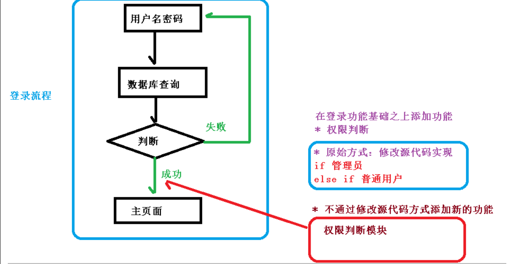

### 1.2 有什么用？

对各个业务逻辑部分进行隔离，降低耦合度，提高程序可重用性，提高开发效率

### 1.3 AOP是怎么实现面向切面编程的呢？（底层原理）

**1、AOP 底层使用动态代理，有两种情况**

**(1) 有接口情况，使用 JDK 动态代理**

- 创建接口实现类代理对象，增强类的方法

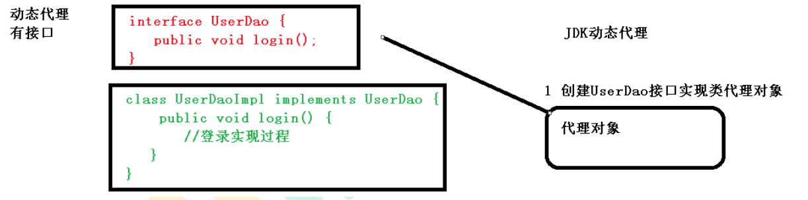

**(2) 没有接口情况，使用 CGLIB 动态代理**

- 创建子类的代理对象，增强类的方法

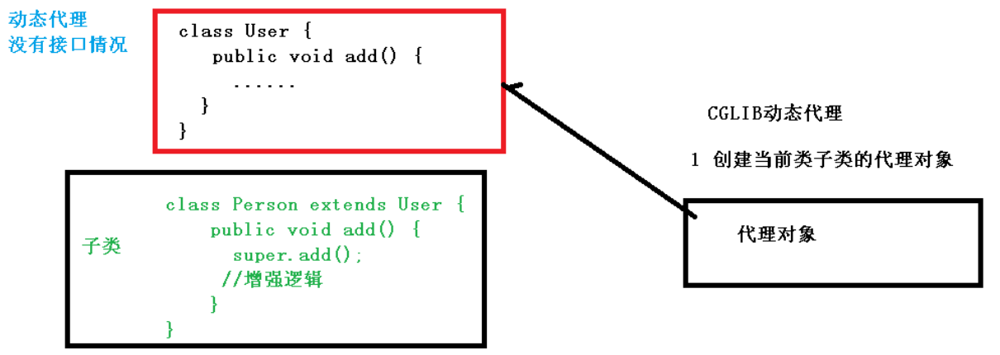

**(3) JDK 动态代理详解：**

a> 使用 JDK 动态代理，使用 Proxy 类里面的方法创建代理对象

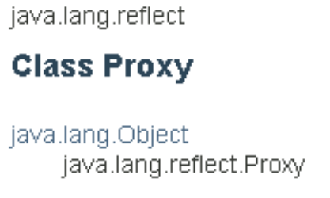

调用 newProxyInstance 方法

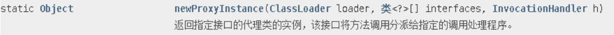

方法有三个参数：

第一参数，类加载器

第二参数，增强方法所在的类，这个类实现的接口，支持多个接口

第三参数，实现这个接口 InvocationHandler，创建代理对象，写增强的部分(可用匿名内部类，也可自己写一个类去实现)

返回值是一个 Object 对象

b> 编写 JDK 动态代理代码

1. 创建接口，定义方法

```java
public interface UserDao {
     public int add(int a,int b);
     public String update(String id);
}
```

2. 创建接口实现类，实现方法

```java
public class UserDaoImpl implements UserDao {
     @Override
     public int add(int a, int b) {
     	return a+b;
     }
     @Override
     public String update(String id) {
     	return id;
     }
}

```

3. 使用 Proxy 类创建接口代理对象

```java
public class JDKProxy {
     public static void main(String[] args) {
         //创建接口实现类代理对象
         Class[] interfaces = {UserDao.class};
        // Proxy.newProxyInstance(JDKProxy.class.getClassLoader(), interfaces, new InvocationHandler() {
            // @Override
            // public Object invoke(Object proxy, Method method, Object[] args) throws Throwable {
            	// return null;
            // }
        // });
         UserDaoImpl userDao = new UserDaoImpl();
         UserDao dao = 
             (UserDao)Proxy.newProxyInstance(JDKProxy.class.getClassLoader(), interfaces, 
                                             new UserDaoProxy(userDao));
         int result = dao.add(1, 2);
         System.out.println("result:"+result);
     }
}
         
         
//创建代理对象代码
class UserDaoProxy implements InvocationHandler {
     //1 把创建的是谁的代理对象，把谁传递过来
     //有参数构造传递
     private Object obj;
     public UserDaoProxy(Object obj) {
     	this.obj = obj;
     }
     //增强的逻辑
     //表示增强功能，表示执行被增强的方法为method.invoke()
     //在此方法的前后添加各种功能就是在原功能的前后添加各种功能
     @Override
     public Object invoke(Object proxy, Method method, Object[] args) throws 
    Throwable {
     	//方法之前
     	System.out.println("方法之前执行...."+method.getName()+" :传递的参数..."
                           + Arrays.toString(args));
         
         //被增强的方法执行
         //invoke 需要传入两个参数
         //第一个参数是代理实现类的对象，就是实现了接口的类的对象，但是一般都使用object，为了使用方便，		 而对象的获取一般使用有参构造器，与 newProxyInstance 的第三个参数搭配使用
         //第二个参数为传入的参数，就是形参列表的 args
         //该方法本身也会返回一个对象
         //基本流程基本也是围绕 newProxyInstance 和 method.invoke() 实现，然后就是这两个参数缺什么就补什么
         //这是 AOP 的底层实现原理，了解即可，有封装好的，基本可以随拿随用
         Object res = method.invoke(obj, args);
         
         //方法之后
         System.out.println("方法之后执行...."+obj);
         return res;
     }
}
```

### 1.4 术语解释

**(1) 连接点**

​	其实就是表示那些方法可以被增强，这些方法称为连接点

**(2) 切入点**

​	实际真正被增强的方法，被称为切入点

**(3) 通知（增强）**

​	实际增强的逻辑部分称为通知

通知类型：

1. 前置通知（被增强的前面执行）
2. 后置通知（后面执行）
3. 环绕通知（都执行）
4. 异常通知（出现异常就执行）
5. 最终通知（类似finally，不管怎么样都要执行）


**(4) 切面**

​	将通知应用到切入点的过程，是动作

## 2、使用

### 2.1 准备工作

**(1) 概念认识：**

1、Spring 框架一般都是基于 AspectJ 实现 AOP 操作

- AspectJ 不是 Spring 组成部分，他是一个独立 AOP 框架，一般把 AspectJ 和 Spirng 框架一起使用，进行 AOP 操作	

2、基于 AspectJ 实现 AOP 操作的两种方式

- 基于 XML 配置文件实现
- 基于注解方式实现（多用）

**(2) 依赖导入：**

在项目工程里面引入 AOP 相关依赖

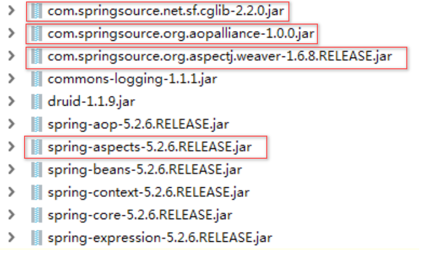

**(3) 切入点表达式：**

> （1）切入点表达式作用：知道对哪个类里面的哪个方法进行增强
>
> （2）语法结构：`execution([权限修饰符] [返回类型] [类全路径] [方法名称]([参数列表]) )`

举例 1：

对 com.atguigu.dao.BookDao 类里面的 add 进行增强 execution(* com.atguigu.dao.BookDao.add(..)) 

举例 2：

对 com.atguigu.dao.BookDao 类里面的所有的方法进行增强 execution(* com.atguigu.dao.BookDao.* (..)) 

举例 3：

对 com.atguigu.dao 包里面所有类，类里面所有方法进行增强 execution(* com.atguigu.dao.*.* (..))

> 补充：
>
> - 访问修饰符可以用`*`替代，表示任意的访问修饰符，`*`表示所有
>
> - 返回类型可以省略
>
> - 类全路径加方法名可以用`.`衔接
>
> - 参数列表可以以`..`表示
> - `*`号与类路径之间有一个空格

### 2.2 基于 AspectJ 注解实现 AOP 操作

**(1) 创建类，在类里面定义方法**

```java
public class User {
    public void add() {
    	System.out.println("add.......");
    }
}
```

**(2) 创建增强类（编写增强逻辑）**

```java
// 在增强类里面，创建方法，让不同方法代表不同通知类型
// 增强的类
public class UserProxy {
    public void before() {//前置通知
    	System.out.println("before......");
    }
}
```

**(3) 进行通知的配置**

1、在 spring 配置文件中，开启注解扫描

```xml
<?xml version="1.0" encoding="UTF-8"?>
<beans xmlns="http://www.springframework.org/schema/beans" 
       xmlns:xsi="http://www.w3.org/2001/XMLSchema-instance" 
       xmlns:context="http://www.springframework.org/schema/context" 
       xmlns:aop="http://www.springframework.org/schema/aop" 
       xsi:schemaLocation="http://www.springframework.org/schema/beans 
                           http://www.springframework.org/schema/beans/spring-beans.xsd 
                           http://www.springframework.org/schema/context 
                           http://www.springframework.org/schema/context/spring-context.xsd 
                           http://www.springframework.org/schema/aop 
                           http://www.springframework.org/schema/aop/spring-aop.xsd">
 <!-- 开启注解扫描 -->
 <context:component-scan base-package="com.atguigu.spring5.aopanno"></context:component-scan>
```

2、使用注解创建 User 和 UserProxy 对象

```java
// 被增强的类
@Component
public class User{}


// 增强的类
@Component
public class UserProxy{}
```

3、在增强类上面添加注解 @Aspect

```java
// 增强的类
@Component
@Aspect // 生成代理对象
public class UserProxy{}
```

4、在 spring 配置文件中开启生成代理对象

```xml
<!-- 开启 Aspect 生成代理对象-->
<aop:aspectj-autoproxy></aop:aspectj-autoproxy>
```

**(4) 配置不同类型的通知：**

1、在增强类的里面，在作为通知方法上面添加通知类型注解，使用切入点表达式配置

```java
//增强的类
@Component
@Aspect //生成代理对象
public class UserProxy {
     //前置通知
     //@Before 注解表示作为前置通知
     @Before(value = "execution(* com.atguigu.spring5.aopanno.User.add(..))")
     public void before() {
     	System.out.println("before.........");
     }
 	//后置通知（返回通知），在方法返回结果之后执行
     @AfterReturning(value = "execution(* com.atguigu.spring5.aopanno.User.add(..))")
     public void afterReturning() {
    	 System.out.println("afterReturning.........");
     }
     //最终通知，方法执行之后执行
     @After(value = "execution(* com.atguigu.spring5.aopanno.User.add(..))")
     public void after() {
 	    System.out.println("after.........");
     }
     //异常通知，异常发生时执行
     @AfterThrowing(value = "execution(* com.atguigu.spring5.aopanno.User.add(..))")
     public void afterThrowing() {
     	System.out.println("afterThrowing.........");
     }
     //环绕通知，需要手动配置一下被增强的方法的执行，表现为在形参中添加对象
     @Around(value = "execution(* com.atguigu.spring5.aopanno.User.add(..))")
     public void around(ProceedingJoinPoint proceedingJoinPoint) throws Throwable {
         System.out.println("环绕之前.........");
         //被增强的方法执行
         proceedingJoinPoint.proceed();
         System.out.println("环绕之后.........");
     }
}
```

**(5) 相同的切入点抽取**

> 需求：我有 5 个类型的切入点都是一样的，能不能抽取出来简化开发？
>
> 解决：使用 @Pointcut

```java
    //相同切入点抽取
    @Pointcut(value = "execution(* com.atguigu.spring5.aopanno.User.add(..))")
    public void pointdemo() {}
    //前置通知
    //@Before 注解表示作为前置通知
    @Before(value = "pointdemo()") // value 值就是切入点方法 pointdemo()
    public void before() {
     	System.out.println("before.........");
    }
```

**(6) 有多个增强类多同一个方法进行增强，设置增强类优先级**

1、在增强类上面添加注解 @Order(数字类型值)，数字类型值越小优先级越高

```java
@Component
@Aspect
@Order(1)
public class PersonProxy{}
```

### 2.3 基于 Aspect 配置文件实现 AOP 操作（了解，用的不多）

(1) 创建两个类，增强类和被增强类，创建方法

(2) 在 spring 配置文件中创建两个类对象

```xml
<!--创建对象-->
<bean id="book" class="com.atguigu.spring5.aopxml.Book"></bean>
<bean id="bookProxy" class="com.atguigu.spring5.aopxml.BookProxy"></bean>
```

(3) 在 spring 配置文件中配置切入点

```xml
<!-- 配置 aop 增强 -->
<aop:config>
     <!-- 切入点 -->
     <aop:pointcut id="p" 
                   expression="execution(*  com.atguigu.spring5.aopxml.Book.buy(..))"/>
     <!-- 配置切面 -->
     <aop:aspect ref="bookProxy">
     <!-- 增强作用在具体的方法上 -->
     <aop:before method="before" pointcut-ref="p"/>
     </aop:aspect>
</aop:config>
```

### 2.4 完全注解开发

(1) 创建配置类，不需要创建 xml 配置文件 

```java
@Configuration
@ComponentScan(basePackages = {"com.atguigu"})
@EnableAspectJAutoProxy(proxyTargetClass = true)
public class ConfigAop {
}
```

# 四、JdbcTemplate


## 1、JdbcTemplate 介绍

### 1.1 JdbcTemplate 是什么？

​	Spring 框架对 JDBC 进行封装

### 1.2 JdbcTemplate 有什么用？

​	使用 JdbcTemplate 方便实现对数据库操作

## 2、怎么使用 JdbcTemplate

### 2.1 准备工作

**(1) 引入相关 jar 包**

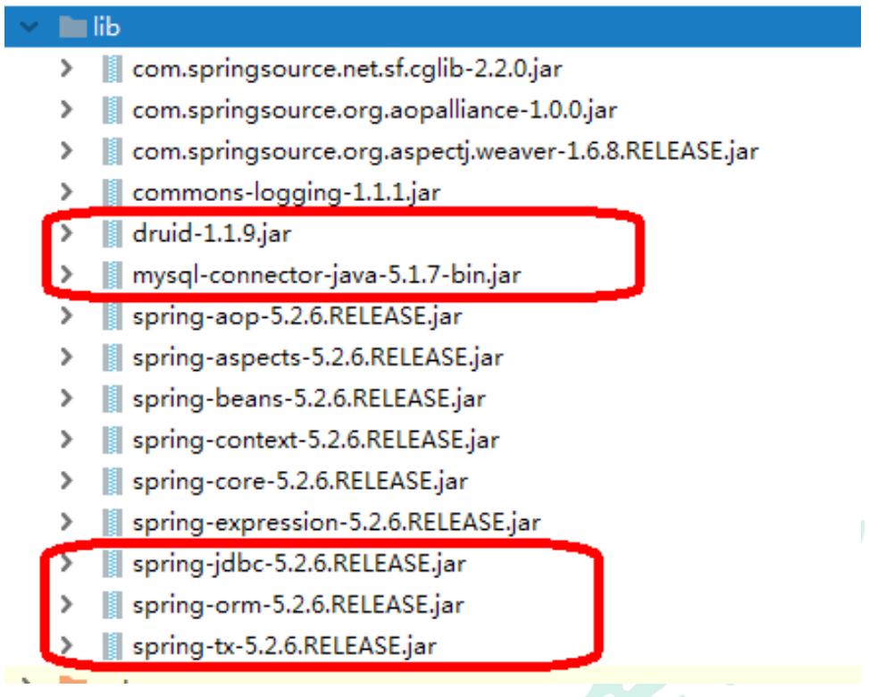

**(2) 在 spring 配置文件配置数据库连接池**

```xml
<!-- 数据库连接池 -->
<bean id="dataSource" class="com.alibaba.druid.pool.DruidDataSource" 
    destroy-method="close">
     <property name="url" value="jdbc:mysql:///user_db" />
     <property name="username" value="root" />
     <property name="password" value="root" />
     <property name="driverClassName" value="com.mysql.jdbc.Driver" />
</bean>
```

**(3) 配置 JdbcTemplate 对象，注入 DataSource**

```xml
<!-- JdbcTemplate 对象 -->
<bean id="jdbcTemplate" class="org.springframework.jdbc.core.JdbcTemplate">
     <!--注入 dataSource-->
     <property name="dataSource" ref="dataSource"></property>
</bean>
```

**(4) 创建 service 类，创建 dao 类，在 dao 注入 jdbcTemplate 对象**

配置文件：开启组件扫描

```xml
<!-- 组件扫描 -->
<context:component-scan base-package="com.atguigu"></context:component-scan>
```

Service 层

```java
@Service
public class BookService {
     //注入 dao
     @Autowired
     private BookDao bookDao;
}
```

Dao 层

```java
@Repository
public class BookDaoImpl implements BookDao {
     //注入 JdbcTemplate
     @Autowired
     private JdbcTemplate jdbcTemplate;
}
```


### 2.2 jdbctemplate 操作数据库

#### 2.2.1 增加

(1) 对应数据库创建实体类

```java
// 数据库表对应的实体类
@Data
public class User{
    private String userId:
    private String username;
    private String ustatus;
}
```

(2) 编写 service 和 dao

> 1、在 dao 进行数据库添加操作
>
> 2、调用 JdbcTemplate 对象里面 update 方法实现添加操作
>
> 
>
> - 有两个参数
> - 第一个参数：sql 语句
> - 第二个参数：可变参数，设置 sql 语句值(占位符 ? 所需要的参数)

```java
@Repository
public class BookDaoImpl implements BookDao {
     //注入 JdbcTemplate
     @Autowired
     private JdbcTemplate jdbcTemplate;
     //添加的方法
     @Override
     public void add(Book book) {
         //1 创建 sql 语句
         String sql = "insert into t_book values(?,?,?)";
         //2 调用方法实现
         Object[] args = {book.getUserId(), book.getUsername(), book.getUstatus()};
         int update = jdbcTemplate.update(sql,args);
         System.out.println(update);
     }
}
```

> 补充：
>
> update 方法的可变参数可以使用数组的方式来达到同样的效果。也就是上文的 args，这样使用起来更加的方便和美观，但是要确保数组中的元素要与 sql 语句中的占位符相对应。

(3) 测试类

```java
@Test
public void testJdbcTemplate() {
     ApplicationContext context = new ClassPathXmlApplicationContext("bean1.xml");
     BookService bookService = context.getBean("bookService", BookService.class);
     Book book = new Book();
     book.setUserId("1");
     book.setUsername("java");
     book.setUstatus("a");
     bookService.addBook(book);
}
```

输出结果：


#### 2.2.2 删除

```java
@Override
public void delete(String id) {
     String sql = "delete from t_book where user_id=?";
     int update = jdbcTemplate.update(sql, id);
     System.out.println(update);
}

```

#### 2.2.3 修改

```java
@Override
public void updateBook(Book book) {
     String sql = "update t_book set username=?,ustatus=? where user_id=?";
     Object[] args = {book.getUsername(), book.getUstatus(),book.getUserId()};
     int update = jdbcTemplate.update(sql, args);
     System.out.println(update);
}
```

#### 2.2.4 查询

> 1、查询表里面有多少条记录，返回是某个值
>
> 2、使用 JdbcTemplate 实现查询返回某个值代码
>
> 

**(1) 查询返回某个值：**


- 有两个参数
- 第一个参数：sql 语句
- 第二个参数：返回类型 Class

```java
//查询表记录数
@Override
public int selectCount() {
     String sql = "select count(*) from t_book";
     Integer count = jdbcTemplate.queryForObject(sql, Integer.class);
     return count;
}
```

**(2) 查询返回对象：**

> 1、场景：查询图书详情
>
> 2、JdbcTemplate 实现查询返回对象


- 有三个参数
- 第一个参数：sql 语句
- 第二个参数：RowMapper 是接口，针对返回不同类型数据，使用这个接口里面实现类完成 数据封装
- 第三个参数：sql 语句值

```java
//查询返回对象
@Override
public Book findBookInfo(String id) {
     String sql = "select * from t_book where user_id=?";
     //调用方法
     Book book = jdbcTemplate.queryForObject(sql, 
                                             new BeanPropertyRowMapper<Book>(Book.class),
                                             id);
     return book;
}
```

**(3) 查询返回集合：**

> 1、场景：查询图书列表分页…
>
> 2、调用 JdbcTemplate 方法实现查询返回集合


- 有三个参数
- 第一个参数：sql 语句
- 第二个参数：RowMapper 是接口，针对返回不同类型数据，使用这个接口里面实现类完成 数据封装
- 第三个参数：sql 语句值

```java
//查询返回集合
@Override
public List<Book> findAllBook() {
     String sql = "select * from t_book";
     //调用方法
     List<Book> bookList = 
         jdbcTemplate.query(sql,new BeanPropertyRowMapper<Book>(Book.class));
     return bookList;
}
```

#### 2.2.5 批量操作

> 1、批量操作：操作表里面多条记录
>
> 2、JdbcTemplate 实现批量添加操作
>
> 
>
> - 有两个参数
> - 第一个参数：sql 语句
> - 第二个参数：List 集合，添加多条记录数据

**(1) 批量添加**

```java
//批量添加
@Override
public void batchAddBook(List<Object[]> batchArgs) {
     String sql = "insert into t_book values(?,?,?)";
     int[] ints = jdbcTemplate.batchUpdate(sql, batchArgs);
     System.out.println(Arrays.toString(ints));
}
```

测试：

```java
//批量添加测试
List<Object[]> batchArgs = new ArrayList<>();
Object[] o1 = {"3","java","a"};
Object[] o2 = {"4","c++","b"};
Object[] o3 = {"5","MySQL","c"};
batchArgs.add(o1);
batchArgs.add(o2);
batchArgs.add(o3);
//调用批量添加
bookService.batchAdd(batchArgs);
```


**(2) 批量修改**

```java
//批量修改
@Override
public void batchUpdateBook(List<Object[]> batchArgs) {
     String sql = "update t_book set username=?,ustatus=? where user_id=?";
     int[] ints = jdbcTemplate.batchUpdate(sql, batchArgs);
     System.out.println(Arrays.toString(ints));
}
```

测试：

```java
//批量修改
List<Object[]> batchArgs = new ArrayList<>();
Object[] o1 = {"java0909","a3","3"};
Object[] o2 = {"c++1010","b4","4"};
Object[] o3 = {"MySQL1111","c5","5"};
batchArgs.add(o1);
batchArgs.add(o2);
batchArgs.add(o3);
//调用方法实现批量修改
bookService.batchUpdate(batchArgs);
```


**(3) 批量删除**

```java
//批量删除
@Override
public void batchDeleteBook(List<Object[]> batchArgs) {
     String sql = "delete from t_book where user_id=?";
     int[] ints = jdbcTemplate.batchUpdate(sql, batchArgs);
     System.out.println(Arrays.toString(ints));
}
```

测试：

```java
//批量删除
List<Object[]> batchArgs = new ArrayList<>();
Object[] o1 = {"3"};
Object[] o2 = {"4"};
batchArgs.add(o1);
batchArgs.add(o2);
//调用方法实现批量删除
bookService.batchDelete(batchArgs);
```

#### 2.2.6 Java 业务层分工

- 业务层 Service 负责处理具体业务，在 Service 层调用持久层 dao 的具体方法
- 持久层 Dao，负责具体操作数据库。

# 五、事务

## 1、认识事务

​	事务是数据库操作最基本单元，逻辑上一组操作，要么都成功，如果有一个失败所有操 作都失败

典型场景：银行转账

- lucy 转账 100 元 给 mary
- lucy 少 100，mary 多 100

## 2、事务的特性

1. 原子性
2. 一致性
3. 隔离性
4. 持久性


## 3、事务的操作

### 3.1 准备阶段

流程图：

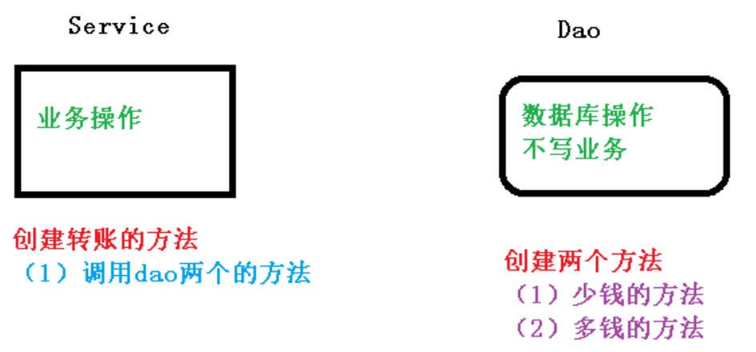

**(1) 创建数据库表，添加记录**

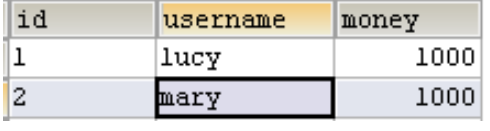

**(2) 创建 service，搭建 dao，完成对象创建和注入关系**

> service 注入 dao，在 dao 注入 JdbcTemplate，在 JdbcTemplate 注入 DataSource

```java
@Service
public class UserService {
     //注入 dao
     @Autowired
     private UserDao userDao;
}
```

```java
@Repository
public class UserDaoImpl implements UserDao {
     @Autowired
     private JdbcTemplate jdbcTemplate;
}
```

**(3) 在 dao 创建两个方法：多钱和少钱的方法，在 service 创建方法（转账的方法）**

```java
@Repository
public class UserDaoImpl implements UserDao {
     @Autowired
     private JdbcTemplate jdbcTemplate;
     //lucy 转账 100 给 mary
     //少钱
     @Override
     public void reduceMoney() {
         String sql = "update t_account set money=money-? where username=?";
         jdbcTemplate.update(sql,100,"lucy");
     }
     //多钱
     @Override
     public void addMoney() {
         String sql = "update t_account set money=money+? where username=?";
         jdbcTemplate.update(sql,100,"mary");
     }
}
```

```java
@Service
public class UserService {
     //注入 dao
     @Autowired
     private UserDao userDao;
     //转账的方法
     public void accountMoney() {
         //lucy 少 100
         userDao.reduceMoney();
         //mary 多 100
         userDao.addMoney();
     }
}
```

**(4) 上面代码，如果正常执行没有问题的，但是如果代码执行过程中出现异常，有问题**

```java
@Service
public class UserService {
     //注入 dao
     @Autowired
     private UserDao userDao;
     //转账的方法
     public void accountMoney() {
         //lucy 少 100
         userDao.reduceMoney();
         
         // 模拟异常
         int i = 10/0;
         
         //mary 多 100
         userDao.addMoney();
     }
}
```

可以观察到，上面的方法在运行时必会出现异常，面对这种情况，我们就需要用到事务了。

**(5) 事务的使用：**

```java
public class accountMoney(){
    try{
        // 第一步，开启事务
        
        // 第二部，进行业务操作
        
        //lucy 少 100
         userDao.reduceMoney();
         
         // 模拟异常
         int i = 10/0;
         
         //mary 多 100
         userDao.addMoney();
        
        // 第三步，没有发生异常，提交事务
    } catch(Exception e) {
        // 第四步，出现异常，事务回滚
        
    }
}
```

### 3.2 Spring 事务管理介绍

**(1) 添加位置：**

JavaEE 三层结构里面 Service 层（业务逻辑层）


**(2) 在 Spring 进行事务管理操作的两种方式：**

1. 编程式事务管理
2. 声明式事务管理(使用)


**(3) 声明式事务管理使用的两种方式：**

1. 基于注解方式（使用）
2. 基于 xml 配置文件方式


**(4) Spring 声明式事务管理底层原理：**

- 底层使用 AOP 原理


**(5) Spring 事务管理 API：**

​	提供一个接口，代表事务管理器，这个接口针对不同的框架提供不同的实现类

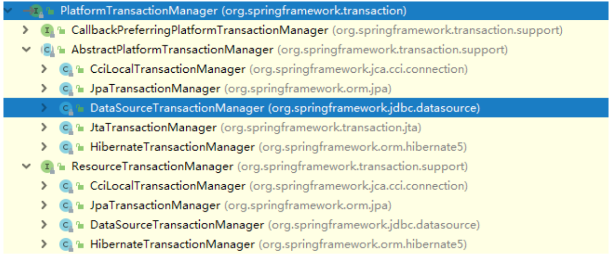

### 3.3 注解声明式事务管理操作

(1) 在 spring 配置文件配置事务管理器

```xml
<!--创建事务管理器-->
<bean id="transactionManager" 
      class="org.springframework.jdbc.datasource.DataSourceTransactionManager">
     <!--注入数据源-->
     <property name="dataSource" ref="dataSource"></property>
</bean>
```

(2) 在 spring 配置文件，开启事务注解

```xml
<!-- 在 spring 配置文件引入名称空间 tx -->
<beans xmlns="http://www.springframework.org/schema/beans" 
       xmlns:xsi="http://www.w3.org/2001/XMLSchema-instance" 
       xmlns:context="http://www.springframework.org/schema/context" 
       xmlns:aop="http://www.springframework.org/schema/aop" 
       xmlns:tx="http://www.springframework.org/schema/tx" 
       xsi:schemaLocation="http://www.springframework.org/schema/beans 
                           http://www.springframework.org/schema/beans/spring-beans.xsd 
                           http://www.springframework.org/schema/context 
                           http://www.springframework.org/schema/context/spring-context.xsd 
                           http://www.springframework.org/schema/aop 
                           http://www.springframework.org/schema/aop/spring-aop.xsd 
                           http://www.springframework.org/schema/tx 
                           http://www.springframework.org/schema/tx/spring-tx.xsd">
<!-- 开启事务注解 -->
<tx:annotation-driven transaction-manager="transactionManager"></tx:annotation-driven>
```

(3) 在 service 类上面（或者 service 类里面方法上面）添加事务注解

> 1、@Transactional，这个注解添加到类上面，也可以添加方法上面
>
> 2、如果把这个注解添加类上面，这个类里面所有的方法都添加事务
>
> 3、如果把这个注解添加方法上面，为这个方法添加事务

```java
@Service
@Transactional
public class UserService {}
```

### 3.4 声明式事务管理参数配置

**(0) 在 service 类上面添加注解 @Transactional，在这个注解里面可以配置事务相关参数，如下图：**

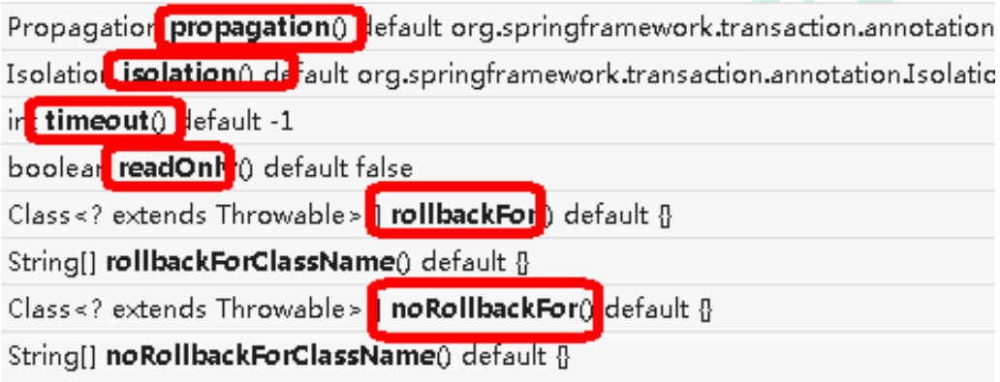

**(1) propagation：事务传播行为**

> propagation 的值默认为：REQUIRED

多事务方法直接进行调用，这个过程中事务 是如何进行管理的

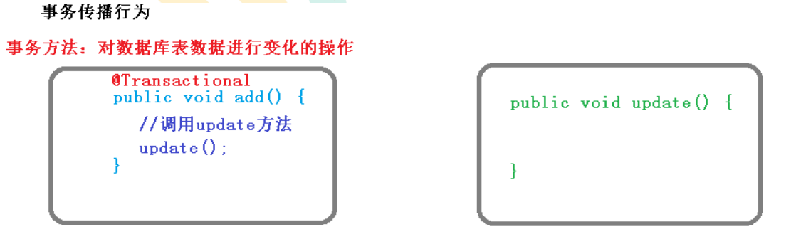

Spring 框架事务传播行为有七种，其中最重要最常见的有两种，需要记忆，其他只做了解

**需要记忆的：**

| 事务传播行为 | 含义                                                         |
| ------------ | ------------------------------------------------------------ |
| REQUIRED     | 如果 A 方法本身有事务，调用 B 方法之后，B 使用当前 A 方法里的事务。<br />如果 A 方法本身没有事务，调用 B 方法之后，创建新事物 |
| REQUIRED_NEW | 使用 A 方法调用 B 方法，无论 A 是否有事务，都创建新的事务    |

**需要了解的：**

| 事务传播行为 | 含义                                                         |
| ------------ | ------------------------------------------------------------ |
| SUPPORTS     | 如果有事务在运行，当前的方法就在这个事务内运行，否则它可以不运行在事务中 |
| NOT_SUPPORTE | 当前的方法不应该运行在事务中，如果有运行的事务，将他挂起     |
| MANDATORY    | 当前的方法必须运行在事务内部，如果没有正在运行的事务，就抛出异常 |
| NEVER        | 当前的方法不应该运行在事务中，如果有运行的事务，就抛出异常   |
| NESTED       | 如果有事务在运行，当前的方法就应该在这个事务的嵌套事务内运行，否则，就启动一个新的事务，并在它自己的事务内运行 |

**使用案例：**

```java
@Service
@Transactional (propagation = Propagation.REQUIRED)
public class UserService{}
```


**(2) ioslation：事务隔离级别**

> 默认隔离级别为：REPEATABLE READ(可重复读)

**事务有特性称为隔离性，多事务操作之间不会产生影响。不考虑隔离性会产生很多问题**

**有三个读问题：脏读、不可重复读、虚（幻）读**

- 脏读：一个未提交事务读取到另一个未提交事务的数据

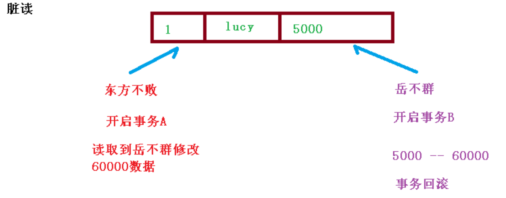

- 不可重复读：一个未提交事务读取到另一提交事务修改数据

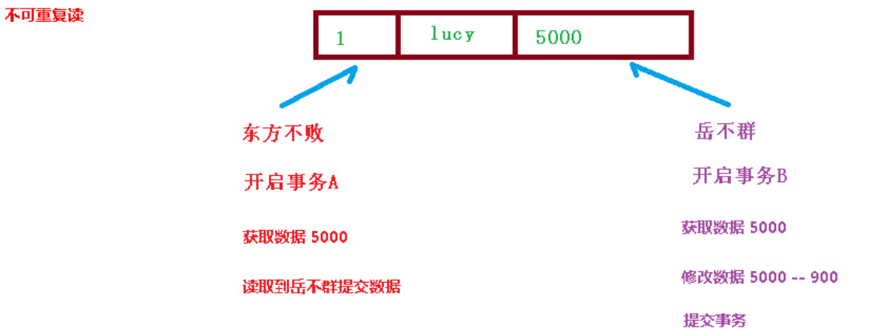

- 虚读(幻读)：一个未提交事务读取到另一提交事务添加数据


**解决：通过设置事务隔离级别，解决读问题**：

| 事务隔离级别               | 脏读 | 不可重复读 | 幻读 |
| -------------------------- | ---- | ---------- | ---- |
| READ UNCOMMITTED(读未提交) | 有   | 有         | 有   |
| READ COMMITTTED(读以提交)  | 无   | 有         | 有   |
| REPEATABLE READ(可重复读)  | 无   | 无         | 有   |
| SERIALIZABLE(串行化)       | 无   | 无         | 无   |


**演示案例：**

```java
@Service
@Transactional(propagation = Propagation.REQUIRED,isolation = Isolation.REPEATABLE_READ)
public class UserService {}
```


**(3) timeout：超时时间**

- 事务需要在一定时间内进行提交，如果不提交就进行回滚
- 默认值是 -1 ，表示不超时，设置时间以秒为单位进行计算


**(4) readOnly：是否只读**

- 读：查询操作。写：添加修改删除操作
- readOnly 默认值 false，表示可以查询，可以添加修改删除操作
- 设置 readOnly 值是 true，设置成 true 之后，只能查询


**(5) rollbackFor：回滚**

- 设置出现哪些异常进行事务回滚


**(6) noRollbackFor：不回滚**

- 设置出现哪些异常不进行事务回滚


### 3.5 XML 声明式事务管理(了解)

(1) 在 spring 配置文件中进行配置

1. 配置事务管理器
2. 配置通知
3. 配置切入点和切面

```xml
<!--1 创建事务管理器-->
<bean id="transactionManager" 
      class="org.springframework.jdbc.datasource.DataSourceTransactionManager">
     <!--注入数据源-->
     <property name="dataSource" ref="dataSource"></property>
</bean>


<!--2 配置通知-->
<tx:advice id="txadvice">
     <!--配置事务参数-->
     <tx:attributes>
         <!--指定哪种规则的方法上面添加事务-->
         <tx:method name="accountMoney" propagation="REQUIRED"/>
         <!--<tx:method name="account*"/>-->
     </tx:attributes>
</tx:advice>


<!--3 配置切入点和切面-->
<aop:config>
     <!--配置切入点-->
     <aop:pointcut id="pt" 
                   expression=
                   "execution(* com.atguigu.spring5.service.UserService.*(..))"/>
     <!--配置切面-->
     <aop:advisor advice-ref="txadvice" pointcut-ref="pt"/>
</aop:config>
```

### 3.6 完全注解声明式事务管理

(1) 创建配置类，使用配置类替代 xml 配置文件

```java
@Configuration //配置类
@ComponentScan(basePackages = "com.atguigu") //组件扫描
@EnableTransactionManagement //开启事务
public class TxConfig {
    
     //创建数据库连接池
     @Bean
     public DruidDataSource getDruidDataSource() {
         DruidDataSource dataSource = new DruidDataSource();
         dataSource.setDriverClassName("com.mysql.jdbc.Driver");
         dataSource.setUrl("jdbc:mysql:///user_db");
         dataSource.setUsername("root");
         dataSource.setPassword("root");
         return dataSource;
	 }
    
     //创建 JdbcTemplate 对象
     @Bean
     public JdbcTemplate getJdbcTemplate(DataSource dataSource) {
         //到 ioc 容器中根据类型找到 dataSource
         JdbcTemplate jdbcTemplate = new JdbcTemplate();
         //注入 dataSource
         jdbcTemplate.setDataSource(dataSource);
         return jdbcTemplate;
     }
    
     //创建事务管理器
     @Bean
     public DataSourceTransactionManager getDataSourceTransactionManager(DataSource dataSource) {
         DataSourceTransactionManager transactionManager = 
             new DataSourceTransactionManager();
         transactionManager.setDataSource(dataSource);
         return transactionManager;
     }
}

```

> 注意：不要忘了在 Service 层的类上加注解：@Transactional，表示添加事务

# 六、Spring5 新特性

整个 Spring5 框架的代码基于 Java8，运行时兼容 JDK9，许多不建议使用的类和方 法在代码库中删除

## 1、整合日志框架

Spring 5.0 框架自带了通用的日志封装

- Spring5 已经移除 Log4jConfigListener，官方建议使用 Log4j2
- Spring5 框架整合 Log4j2

### 1.1 日志使用基本流程

(1) 引入 jar 包

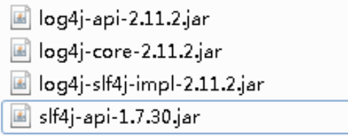

(2) 创建 log4j2.xml 配置文件

```xml
<?xml version="1.0" encoding="UTF-8"?>
<!--日志级别以及优先级排序: OFF > FATAL > ERROR > WARN > INFO > DEBUG > TRACE > 
ALL -->
<!--Configuration 后面的 status 用于设置 log4j2 自身内部的信息输出，可以不设置，
当设置成 trace 时，可以看到 log4j2 内部各种详细输出-->
<configuration status="INFO">
     <!--先定义所有的 appender-->
     <appenders>
         <!--输出日志信息到控制台-->
         <console name="Console" target="SYSTEM_OUT">
             <!--控制日志输出的格式-->
             <PatternLayout pattern="%d{yyyy-MM-dd HH:mm:ss.SSS} [%t] %-5level %logger{36} - %msg%n"/>
         </console>
     </appenders>
 <!--然后定义 logger，只有定义 logger 并引入的 appender，appender 才会生效-->
 <!--root：用于指定项目的根日志，如果没有单独指定 Logger，则会使用 root 作为
默认的日志输出-->
 	<loggers>
         <root level="info">
         	<appender-ref ref="Console"/>
         </root>
    </loggers>
</configuration>
```

> 注意：
>
> - 创建 Logger 的对象，将当前类的反射即 `.class` 当作参数传入进去，使用 Logger 的有参构造器，就可以使用日志进行输出了
> - 注意包不要引错了，是 org.slf4j.Logger 包

## 2、@Nullable 注解

Spring5 框架核心容器支持 @Nullable 注解

- @Nullable 注解可以使用在方法上面，属性上面，参数上面，表示方法返回可以为空，属性值可以 为空，参数值可以为空
- 注解用在方法上面，方法返回值可以为空
- 注解使用在方法参数里面，方法参数可以为空
- 注解使用在属性上面，属性值可以为空

示例：

```java
// 用在方法上面，方法返回值可以为空
@Nullable
String getId();

// 使用在方法参数里面，方法参数可以为空
public <T> void registerBean(@Nullable String beanName){}

// 使用在属性上面，属性值可以为空
@Nullable
private String bookName;
```

## 3、函数式注册对象

Spring5 核心容器支持函数式风格 GenericApplicationContext

```java
//函数式风格创建对象，交给 spring 进行管理
@Test
public void testGenericApplicationContext() {
     //1 创建 GenericApplicationContext 对象
     GenericApplicationContext context = new GenericApplicationContext();
     //2 调用 context 的方法对象注册
     context.refresh();
     context.registerBean("user1",User.class,() -> new User());
     //3 获取在 spring 注册的对象
     // User user = (User)context.getBean("com.atguigu.spring5.test.User");
     User user = (User)context.getBean("user1");
     System.out.println(user);
}
```


## 4、整合 JUnit5 单元测试框架

Spring5 支持整合 JUnit5

### 4.1 整合 JUnit4

(1) 引入 Spring 相关针对测试依赖

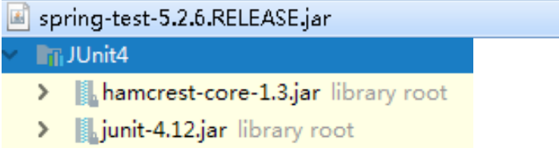

(2) 创建测试类，使用注解方式完成

```java
@RunWith(SpringJUnit4ClassRunner.class) //单元测试框架
@ContextConfiguration("classpath:bean1.xml") //加载配置文件
public class JTest4 {
     @Autowired
     private UserService userService;
     @Test
     public void test1() {
     	userService.accountMoney();
     }
}
```

> 注意bug：使用该测试类的时候，需要将 Service 层上的 @Transactional 事务注解取消掉，或者注释掉，不然会报错误，找到两个 dataSource 和 gettransactionManager

### 4.2 整合 JUnit5

(1) 引入 JUnit5 的 jar 包

(2) 创建测试类，使用注解完成

```java
@ExtendWith(SpringExtension.class)
@ContextConfiguration("classpath:bean1.xml")
public class JTest5 {
     @Autowired
     private UserService userService;
     @Test
     public void test1() {
     	userService.accountMoney();
     }
}

// 简化 @ExtendWith 注解和 @ContextConfiguration 注解为一个步骤
@SpringJUnitConfig(locations = "classpath:bean1.xml")
public class JTest5 {
     @Autowired
     private UserService userService;
     @Test
     public void test1() {
     	userService.accountMoney();
     }
}
```

## 5、SpringWebflux 使用

有需求再来，现在不着急。属于新功能，现在可能不太用的上。

